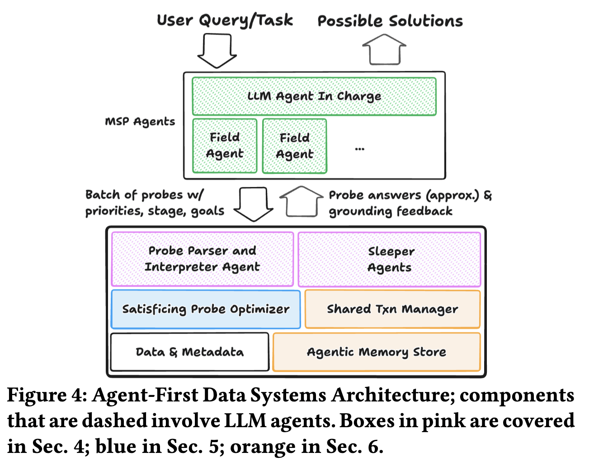
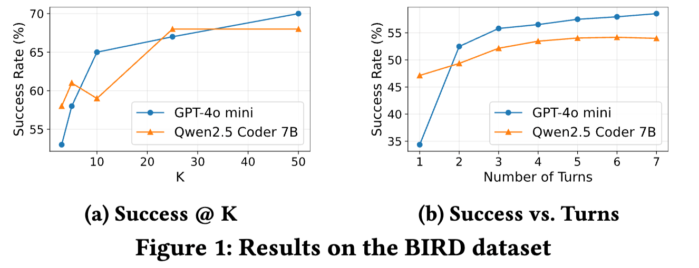
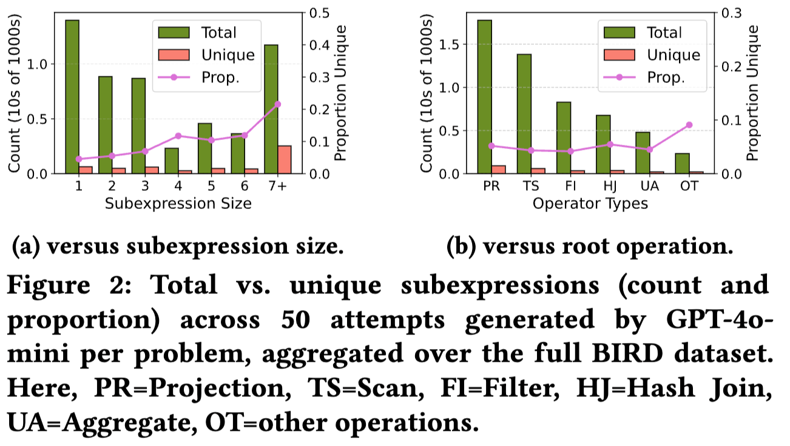
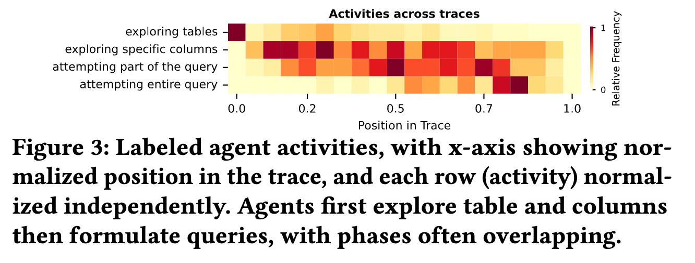
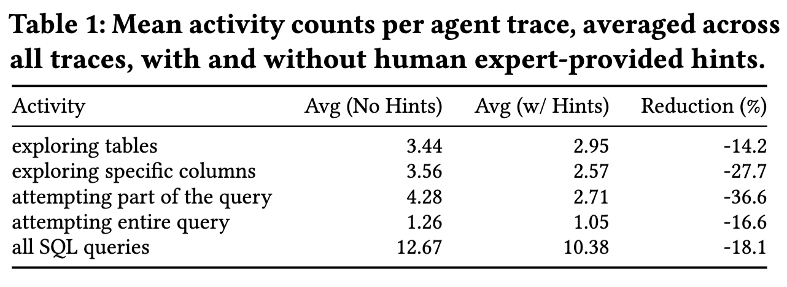

# Agent-First：为Agent重构数据系统的路线图

现在的数据库系统都是为人类设计的，但未来AI-Agent会成为使用数据的主力。这些Agent干活的方式和人不一样——它们会像“好奇宝宝”一样，为了完成一个任务，会疯狂地、试探性地问数据库成千上万个问题来摸索解决方案。

这种“海量试探”的工作模式，让传统数据库有点顶不住了，主要因为三个不匹配：
1. 并发量太低：人一次问几个问题，Agent一秒能问几百上千个。
2. 流程太死板：人按固定步骤操作，Agent是东一榔头西一棒子地探索，先查查表结构，再试试部分查询，最后才验证完整方案。
3. 不会“主动聊天”：数据库现在是你问啥我答啥。但Agent需要数据库能像助手一样，主动给点提示，比如“你查的这个表可能不对，试试旁边那个？”

所以，伯克利这篇研究提出，得把数据库整个儿重构一遍，变成“Agent优先”的架构。这相当于给数据库来次大升级：
1. 数据探针：Agent与数据系统的交互不应局限于SQL查询，而应通过“探针”（probes）实现。探针允许Agent使用自然语言描述查询意图、当前阶段（如元数据探索或解决方案制定）以及近似需求（例如，“处于探索阶段，只需大致结果”）。这使数据系统能更灵活地理解Agent目标，并提供针对性响应。
2. 查询处理：Agentic化的推测（agentic speculation）模式会产生海量且高度冗余的请求。数据系统需利用这些请求的冗余特性（如相似查询模式或重叠操作），通过多查询优化、近似查询处理等技术共享部分计算结果，避免重复工作，从而显著提升处理效率。
3. 分支更新机制：在智能体的工作负载中，智能体经常需要并行探索多个“假设”（what-if）场景，例如在数据更新时同时测试多种解决方案。这导致智能体创建大量数据分支（branched updates），每个分支代表一个独立的推测路径。在实际系统（如Neon）中，智能体创建的分支数量是人类的20倍，回滚操作是人类的50倍。然而，传统数据系统的事务模型基于线性执行，无法高效处理这种高并发、大规模的分支操作。因此，数据系统需要引入新的分支更新机制，该机制应具备以下特点：
    * 高效分支管理：允许智能体快速创建、管理和回滚大量分支，避免天真地复制整个数据库（这会导致高昂成本）。灵感来自工业系统（如Neon、Aurora）的写时复制（copy-on-write）技术，但需进一步优化以支持大规模并行分支。
    * 新事务模型：提供 multi-world isolation，确保每个分支在逻辑上隔离（即分支间的操作互不干扰），但在物理存储上共享相同的数据基础（以节省资源）。这类似于加强版的多版本并发控制（MVCC），需处理分支间的相似性（例如，90%的数据相同）以实现高效共享。
    * 高并发支持：应对多个智能体同时操作数千个分支的场景，要求事务模型支持快速分支创建、回滚（如失败分支的即时中止）和最终协调（分支之间的合并或选择）。

    总之，分支更新机制的核心是平衡逻辑隔离与物理共享，以提升Agentic speculation的效率和可扩展性。

> **事务模型（transaction model）** 在数据系统中指的是处理数据更新和并发访问的框架，确保数据的一致性、隔离性和可靠性。在传统数据系统中，事务模型通常基于ACID属性（原子性、一致性、隔离性、持久性），强调线性执行和隔离性，即每个事务独立运行，不会相互干扰。

总之，就是要把数据库从给“人”用的工具，改造成能高效服务“AI-Agent”的智能平台。

## 研究背景：Agent工作负载为何“非典型”？
当任务由Agent主导时，数据库面临与人类用户完全不同的压力与模式：
- 超高吞吐与大量探索：为完成一个任务，Agent会发起密集的探索性query（枚举表、列、样例等）。
- 高度冗余：少量语义差异导致大量近似重复的计划与子表达式（重复率可达 80%-90%）。
- query类型多样：从元数据探索、局部尝试到完整query，呈现异构与动态阶段性。
- 强可引导性：提供“目标、阶段、精度、终止条件”等语义线索，能显著减少不必要尝试。
- 大量“what-if”探索：像调试代码一样创建分支、对比方案、回滚与合并。

这些特征让传统“面向单条query的低延迟优化”难以为继，系统需要转而优化“整个任务”的交互轮次与总成本。

## 核心方法论：四层重构
Agent-First 的核心是让数据库从“被动执行者”转变为“主动协作伙伴”，围绕四个方面重构：

1) 用 Probe 接口替代单一 SQL
    - 在 SQL 之外附带自然语言“简报（Brief）”：query意图、当前阶段、精度要求、终止条件等。
    - 让系统理解“做什么与做到什么程度”，以便进行多query协同、近似执行与早停等更高层优化。

2) 引入库内Agent（Sleeper/Field Agents）
    - 解析与解释Agent：将 Probe 语义映射到可执行计划，解释结果与错误来源。
    - 休眠Agent：不直接答复，而是提供“顾问式”辅助（相关数据推荐、成本建议、结果解释）。

3) 构建Agent记忆存储（Agentic Memory Store）
    - 持久化语义缓存：元数据、过去探针结果与经验。
    - 面向高冗余负载的跨探针共享：在安全与一致性约束下重用计算与知识。

4) Git 式分支替代传统 MVCC
    - 支持大规模并行的“what-if”分支创建、切换与合并，历史呈树状而非线性。
    - 以分支为一等公民管理探索过程，契合Agent的迭代式推测与对比需求。
> 在计算机科学和系统设计中，“一等公民”（First-Class Citizen）指某个实体（如对象、函数、数据类型或操作）在系统中享有完整的权利和支持，能够被自由地创建、传递、存储和操作，而无需特殊限制或额外封装。

## 效果验证：从成功率到冗余度与活动分布
论文通过多维度实验刻画 Agent-First 场景下的收益与负载特征：

- 成功率提升（BIRD 数据集）：并行尝试（K）与序列探索（Turns）均能显著提高任务完成率。

- 计算可共享性：在 50 次并行尝试中，唯一子表达式仅占 10%-20%，为跨探针共享与多query优化提供空间。

- 活动异构性与阶段性：Agent早期偏向元数据探索，随后过渡到query构建与验证，各阶段交织重叠。

- 系统引导的效率收益：提供 grounding hints 后，各活动阶段的平均步骤数明显下降，总query数减少约 18.1%。

## 优缺点分析：从蓝图到落地
优点（潜在收益）：
- 面向任务的全局优化：通过 Probe 语义与库内Agent协作，减少不必要交互与重复计算。
- 显式拥抱冗余：语义缓存与多query优化让共享成为常态，提升整体吞吐与成本效率。
- 可被引导：用“阶段、意图、精度、终止条件”让系统主动提供建议与早停，降低试错开销。
- 探索友好：Git 式分支支持大规模并行对比与回滚，贴合Agent的迭代式工作流。

待改进（现实挑战）：
- 自然语言语义解析仍具开放性：如何稳健映射到精度与成本策略有待探索。
- 多探针优化的权衡复杂：近似与成本、共享与一致性、早停与后续修正之间需动态平衡。
- 语义缓存的一致性与隐私：过时知识可能误导决策；多用户共享需精细访问控制。
- 分支事务的扩展性：数千并行分支下的写时复制与合并机制仍需工程性突破。
- Sleeper Agent 触发与筛选策略：何时提供何种信息、成本模型与效果评估需要系统化设计。

## 