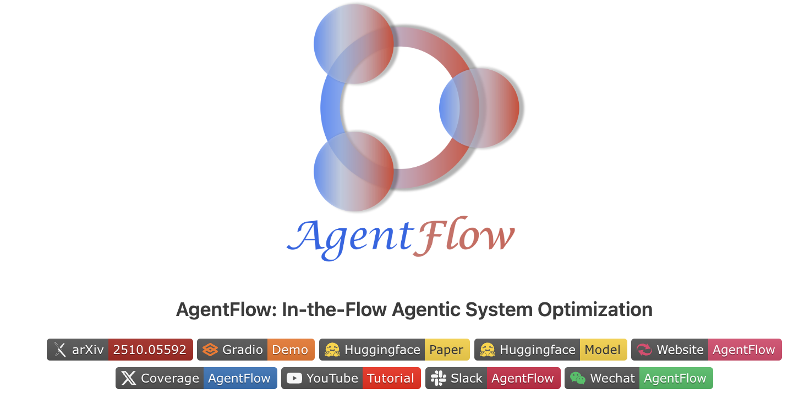
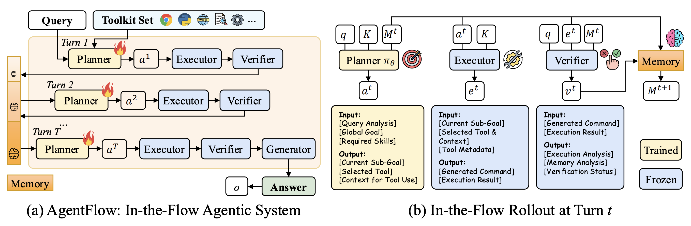
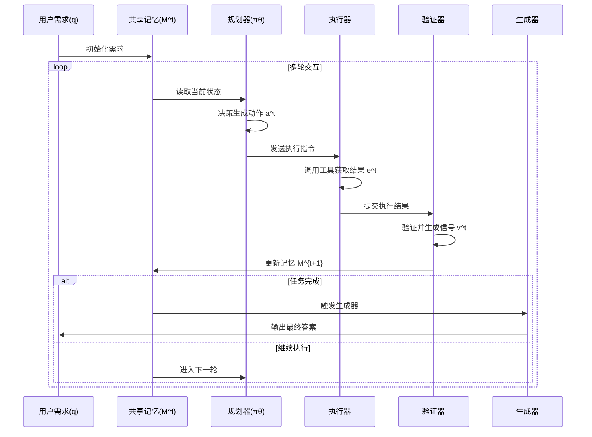
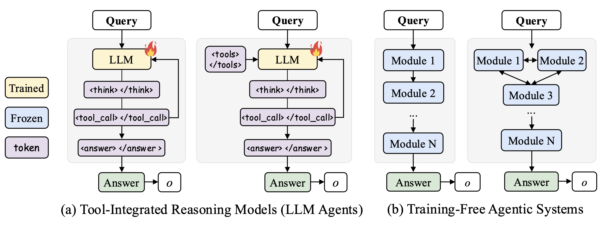
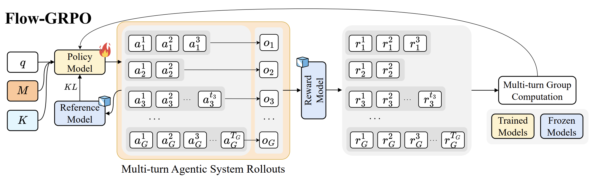
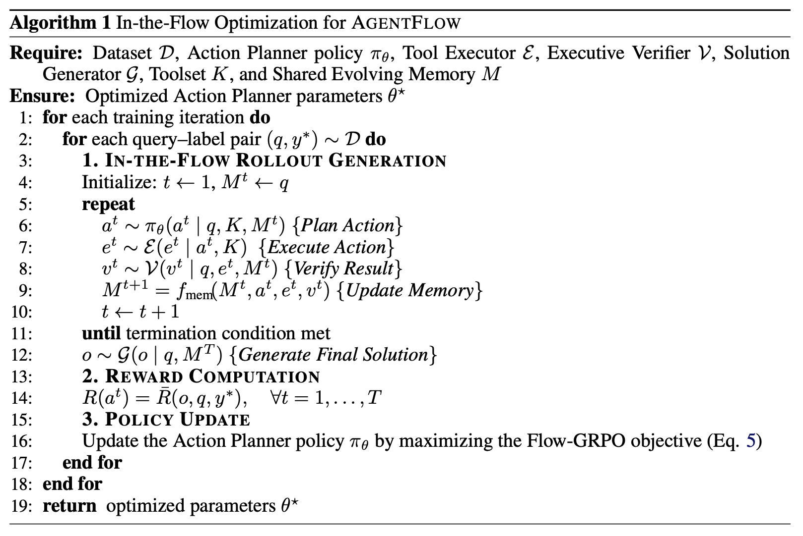
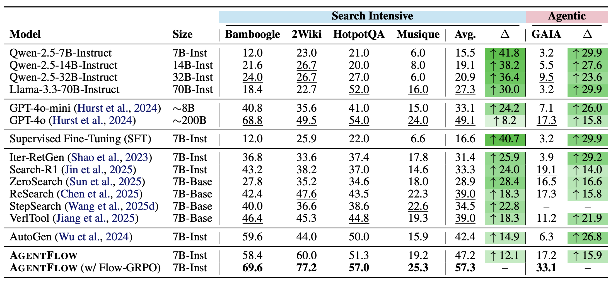
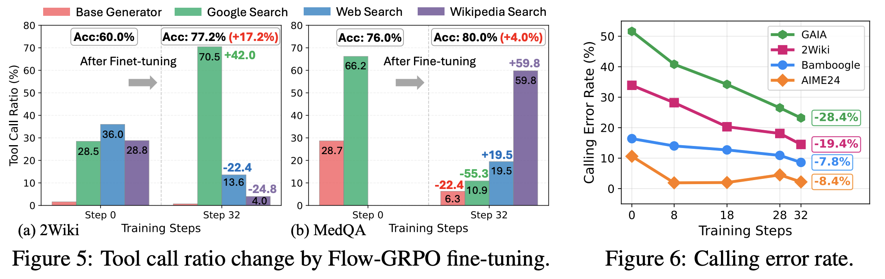
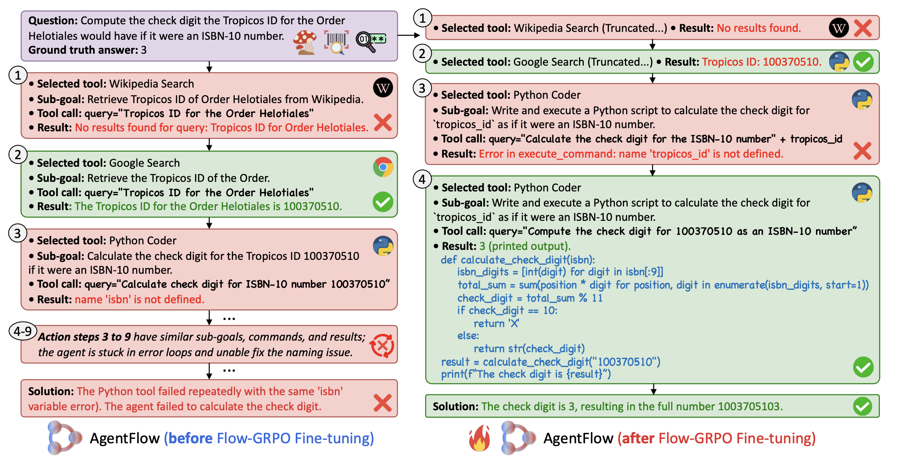

# AgentFlow: 让大模型学会"聪明干活"的智能协作系统

## 一、引言

当前大语言模型（LLM）在处理复杂任务时面临两大困境：单体模型"包办一切"容易出错，多模块协作系统"不会学习"难以优化。AgentFlow通过创新的模块化设计和训练方法，让70亿参数的小模型在工具使用和长期规划任务上超越了拥有约200亿参数的GPT-4o，成为AI Agent领域的重要突破。

## 二、论文基础信息

**论文标题**：In-the-Flow Agentic System Optimization for Effective Planning and Tool Use  
**作者单位**：Stanford University, Texas A&M University, UC San Diego, Lambda  
**发布平台**：arXiv 2510.05592  
**研究背景**：现有大模型在需要"调用多种工具、多步骤规划"的复杂任务中表现不佳。单体模型因上下文混乱导致工具误用，而传统多模块Agent系统因缺乏训练机制无法动态优化决策。AgentFlow旨在通过可训练的模块化架构和创新的Flow-GRPO算法，解决这一核心矛盾。

## 三、核心创新点

AgentFlow提出了三大创新：

1. **可训练的模块化架构**：首次实现4个专业模块（规划器、执行器、验证器、生成器）的协同工作，其中规划器通过训练持续优化，打破了传统Agent系统"训练无关"的局限。

2. **Flow-GRPO训练方法**：不纠结每一步的局部奖励，而是以任务最终成败作为全局信号，倒推优化每个决策步骤，避免了稀疏奖励和短视决策问题。

3. **动态共享记忆机制**：所有模块共享一个实时更新的"记事本"，记录任务进展、工具调用结果和验证状态，确保多步骤任务的上下文连贯性。

## 四、系统架构与方法论

### 4.1 整体架构设计

AgentFlow采用"分工明确、协作紧密"的设计理念，将复杂任务分解给4个专业模块：

**四大核心模块**：

- **Planner（规划器）**：系统的"大脑"，根据当前记忆和工具集决定下一步动作，是唯一接受训练的模块。
- **Executor（执行器）**：按规划器指令调用具体工具（如搜索引擎、计算器、代码解释器），获取执行结果。
- **Verifier（验证器）**：检查执行结果的合理性和完整性，判断是否需要继续、重试或终止任务。
- **Generator（生成器）**：任务完成后整合所有信息，生成最终用户可读的答案。

**动态记忆机制**：

共享记忆 \(M\) 随着任务推进持续更新。在第 \(t\) 步，记忆更新公式为：

$$M^{t+1} = \text{Update}(M^t, a^t, e^t, v^t)$$

其中 \(a^t\) 是规划动作，\(e^t\) 是执行结果，\(v^t\) 是验证信号。这种设计确保后续步骤能访问完整的历史信息，避免重复操作或信息丢失。

### 4.2 单步执行流程

每个回合的执行遵循"规划-执行-验证-记录"的闭环：

### 4.3 与传统方法的对比

**Monolithic（单体式）**：一个大模型包办所有思考和工具调用，容易因上下文混乱导致错误累积。

**Agentic（传统智能体）**：多模块分工但按固定规则协作，无法根据任务反馈优化决策。

**AgentFlow**：结合模块化分工和可训练的规划器，既保证专业性又具备学习能力。

## 五、Flow-GRPO训练算法

### 5.1 训练核心思想

Flow-GRPO（Flow-based Group Relative Policy Optimization）的核心是"结果导向+全局优化"：不关注中间某步是否完美，只看最终任务是否成功，再将成败信号反向传播到每个决策步骤。

### 5.2 算法流程

**训练分三阶段**：

**阶段1：多轮交互生成轨迹**

系统在数据集 \(D\) 上逐条处理任务 \((q, y^*)\)，规划器生成动作序列 \(\tau = \{a^1, a^2, ..., a^T\}\)，记录完整的执行轨迹。

**阶段2：基于最终结果计算奖励**

任务结束后，用生成答案 \(o\) 与正确答案 \(y^*\) 对比，计算全局奖励：

$$\bar{R}(o, q, y^*) = \begin{cases} 
R & \text{if task succeeds} \\
0 & \text{otherwise}
\end{cases}$$

每个动作 \(a^t\) 的责任奖励通过折扣因子分配：

$$r_t = \gamma^{T-t} \cdot \bar{R}$$

其中 \(\gamma \in (0,1)\) 是折扣因子，越接近终点的步骤获得越高奖励。

**阶段3：优化规划器策略**

使用策略梯度优化规划器参数 \(\theta\)：

$$\mathcal{L} = -\mathbb{E}_{a^t \sim \pi_\theta} \left[ \log \pi_\theta(a^t \mid M^t, K) \cdot r_t \right]$$

配合分组归一化（Group Normalization）稳定训练，避免单步错误影响全局收敛。

### 5.3 训练优势

相比传统强化学习，Flow-GRPO无需人工设计复杂的中间奖励函数，只需任务最终的二元反馈（成功/失败），大幅降低了训练难度和标注成本。

## 六、实验结果

### 6.1 主任务性能对比

AgentFlow在十个基准测试上全面超越了当前最佳模型。论文在四类核心任务上进行了评估：

**相比最佳7B基线模型的提升**：
- **知识密集型搜索**（Bamboogle, 2Wiki, HotpotQA, Musique）：平均准确率57.3%，相比最佳基线AutoGen（42.4%）提升**14.9%**
- **智能体任务**（GAIA）：准确率33.1%，相比最佳基线Search-R1（19.1%）提升**14.0%**
- **数学推理**（AIME24, AMC23, GameOf24）：平均准确率51.5%，相比最佳基线ToRL（37.0%）提升**14.5%**
- **科学推理**（GPQA, MedQA）：平均准确率63.5%，相比最佳基线TIR（59.4%）提升**4.1%**

**超越大规模模型GPT-4o（~200B参数）**：
- 搜索任务：57.3% vs 49.1%（**+8.2%**）
- 智能体任务：33.1% vs 17.3%（**+15.8%**）
- 数学推理：51.5% vs 35.1%（**+16.4%**）
- 科学推理：63.5% vs 45.5%（**+18.0%**）

这些结果表明，AgentFlow的模块化设计和Flow-GRPO训练方法有效解决了长期规划难题，在需要多步骤、多工具配合的复杂任务中优势最为显著。

### 6.2 工具选择与纠错能力

**Flow-GRPO优化工具使用模式**：通过对比训练前后的工具调用分布，发现规划器学会了针对不同任务选择合适的工具：
- **2Wiki任务**（需要广泛事实知识）：Google Search使用率提升**42.0%**
- **MedQA任务**（需要专业医学知识）：Google Search从66.2%降至10.9%，转而使用更专业的Wikipedia Search（0→59.8%）和针对性的Web Search（0→19.5%）

**增强工具调用可靠性**：训练过程中工具调用错误率持续下降，在GAIA任务上错误率最多降低**28.4%**。这表明Flow-GRPO不仅教会模型选择哪个工具，还教会了如何正确调用工具（正确的参数和格式）。

**自主发现新解决方案**：案例研究显示，训练后的AgentFlow展现出更强的规划能力和自我纠错能力。当初始方案失败时，系统能够探索新的解决路径，在2-3轮尝试后自主调整策略并成功完成任务。

### 6.3 训练策略消融实验

论文对比了不同训练策略对规划器性能的影响（其他模块保持固定）：

| 规划器配置 | 训练方式 | 平均准确率 | 相对基线变化 |
|-----------|---------|-----------|-------------|
| Qwen-2.5-7B | 冻结（基线） | 38.5% | - |
| GPT-4o | 冻结 | 44.3% | **+5.8%** |
| Qwen-2.5-7B | 离线SFT | 19.5% | **-19.0%** |
| Qwen-2.5-7B | Flow-GRPO | 55.7% | **+17.2%** |

**关键发现**：
1. **更强的模型有限提升**：用GPT-4o替换Qwen-2.5-7B仅提升5.8%，说明静态规划器无法与系统动态协同，存在性能瓶颈。
2. **离线训练导致性能崩溃**：使用SFT蒸馏GPT-4o的轨迹反而下降19.0%，因为token级别的模仿目标与轨迹级别的任务成功不一致，且无法适应动态工具反馈。
3. **在流优化至关重要**：Flow-GRPO通过在线优化最终结果，使规划器学会处理长期规划，性能提升17.2%，远超静态方法。

## 七、落地分析

### 7.1 核心优势

1. **成本效益高**：70亿参数模型即可超越200亿参数的GPT-4o，大幅降低推理成本和部署门槛，以更小的模型规模实现更强的性能。
2. **任务适应性强**：通过训练规划器，系统能快速适配新工具和新任务场景，无需重构架构。
3. **可解释性好**：模块化设计使每步决策可追溯，共享记忆机制便于调试和审计。

### 7.2 潜在挑战

1. **训练数据依赖**：Flow-GRPO需要高质量的"需求-正确答案"对，数据采集和标注成本较高。
2. **模块间延迟**：多模块协作相比单次推理增加了通信开销，实时性要求高的场景需优化。
3. **复杂工具支持**：当前主要验证了搜索、计算等标准工具，对特定领域工具（如专业软件API）的集成能力待验证。

### 7.3 应用场景

- **智能客服**：处理多步骤查询（查订单→计算退款→生成邮件）
- **科研助手**：文献检索→数据分析→报告生成的全流程自动化
- **代码开发**：需求分析→API调用→代码生成→单元测试的闭环开发

## 八、总结

AgentFlow通过 **"可训练的模块化架构+Flow-GRPO全局优化"**，突破了传统Agent系统"不会学习"和单体模型"容易出错"的双重瓶颈。其以小博大的性能表现和清晰的设计逻辑，为构建实用化AI Agent提供了新范式。未来随着工具生态的完善和训练方法的迭代，AgentFlow有望在更多实际场景中展现价值。