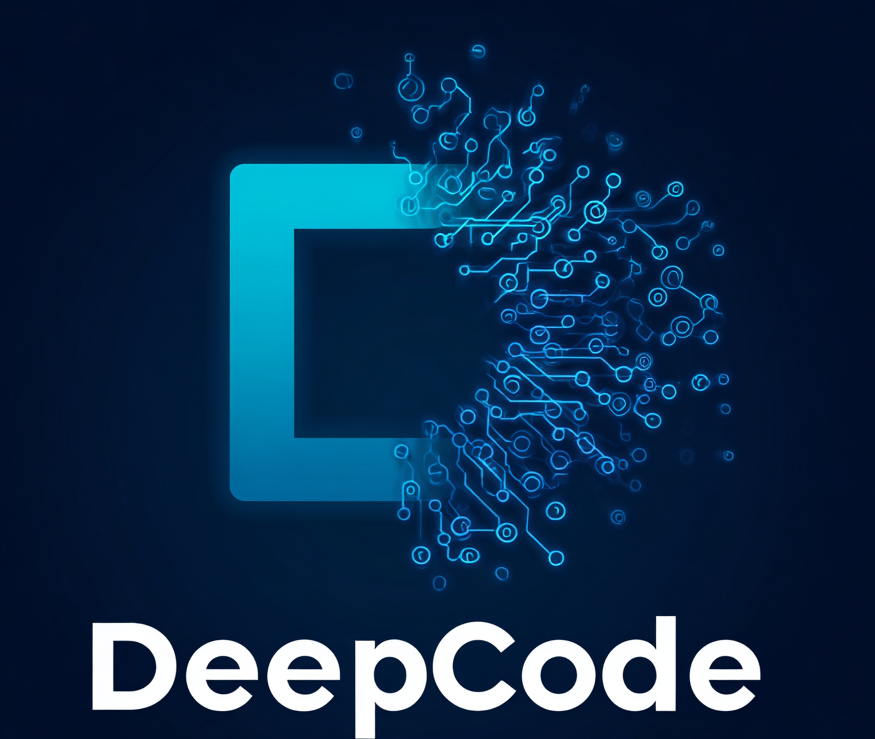
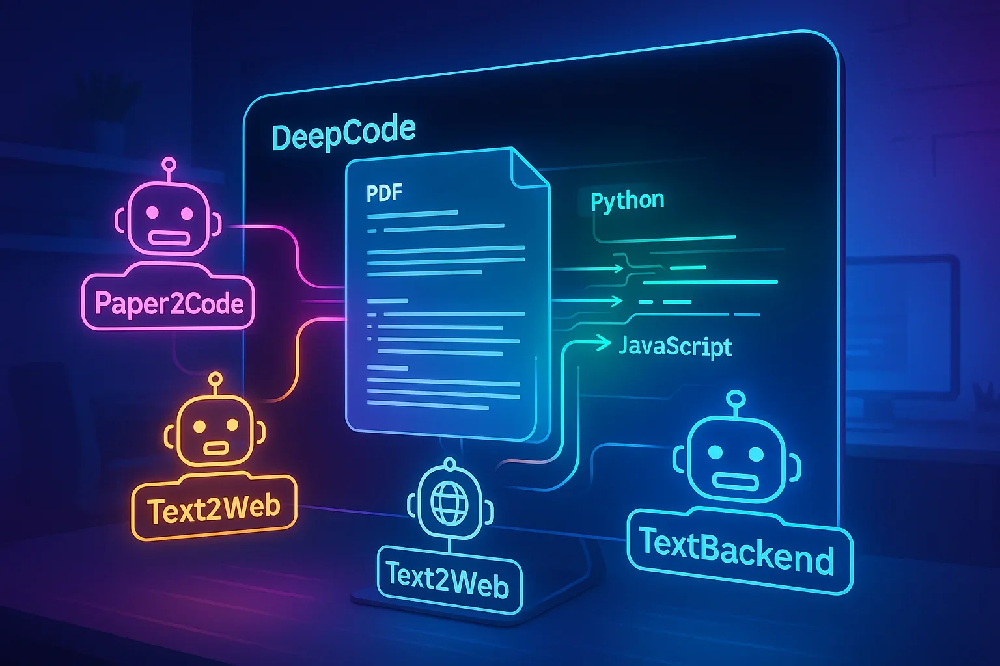
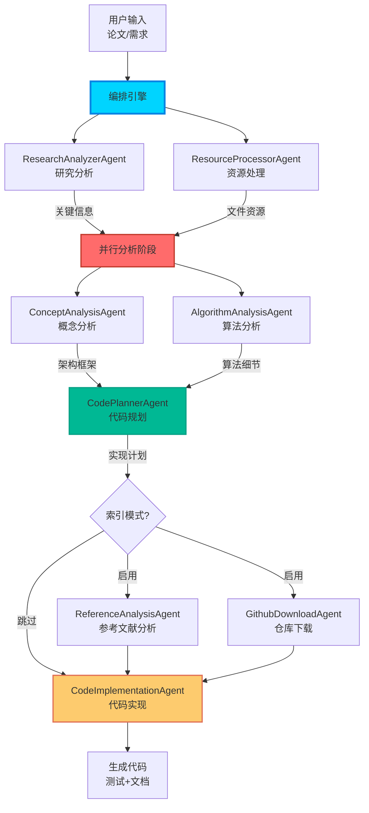
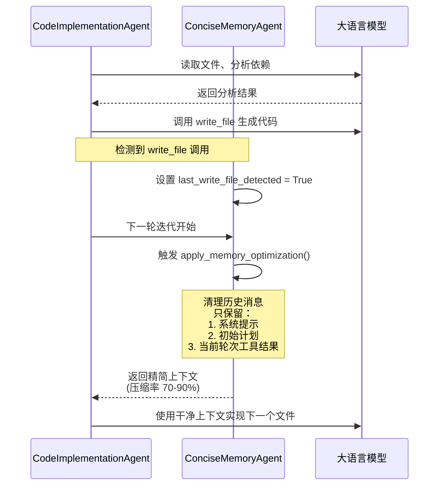
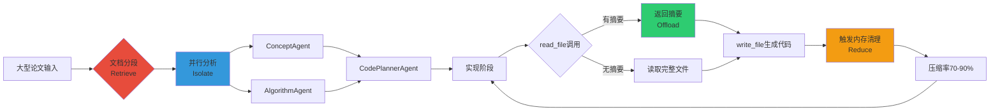

# DeepCode: 用多智能体架构重新定义代码生成

**代码仓库**: https://github.com/HKUDS/DeepCode  
**PyPI 安装**: `pip install deepcode-hku`



## 写在前面

学术论文到工程代码的转化一直是研究落地的"最后一公里"难题。研究人员花费大量时间实现算法而非专注科研，产品团队在概念验证阶段陷入漫长等待。港大数据智能实验室开源的 **DeepCode** 试图用多智能体架构彻底解决这个问题——它不仅在 OpenAI 的 PaperBench 基准上超越人类专家（75.9% vs 72.4%），更重要的是，它提供了一套工程化的、可复现的解决方案。



## 一、多智能体编排：分工与协作

DeepCode 构建了 **7 个专业智能体**，通过中央编排引擎实现复杂任务的分解与协作：



### 并行处理的扇出/扇入模式

系统的核心亮点是 **ParallelLLM** 机制，让 ConceptAnalysisAgent 和 AlgorithmAnalysisAgent 并行分析同一篇论文，再由 CodePlannerAgent 整合输出：

```python
# workflows/agent_orchestration_engine.py
concept_analysis_agent = Agent(
    name="ConceptAnalysisAgent",
    instruction=prompts["concept_analysis"],
    server_names=agent_config["concept_analysis"],
)

algorithm_analysis_agent = Agent(
    name="AlgorithmAnalysisAgent",
    instruction=prompts["algorithm_analysis"],
    server_names=agent_config["algorithm_analysis"],
)

code_planner_agent = Agent(
    name="CodePlannerAgent",
    instruction=prompts["code_planning"],
    server_names=agent_config["code_planner"],
)

# 扇出/扇入架构：并行分析 → 统一整合
code_aggregator_agent = ParallelLLM(
    fan_in_agent=code_planner_agent,
    fan_out_agents=[concept_analysis_agent, algorithm_analysis_agent],
    llm_factory=get_preferred_llm_class(),
)
```

这种设计兼顾了**效率**（并行处理）和**质量**（多视角分析），每个 Agent 专注于自己的领域，最终由 Planner 综合决策。

## 二、三大技术创新

### 1. 智能编排 Agent：动态任务分配

编排引擎管理 **8 个处理阶段**：研究分析 → 资源处理 → 工作空间构建 → 代码规划 → 参考智能分析 → 仓库获取 → 代码库索引 → 代码实现。

关键设计是**自适应配置**：根据文档大小和复杂度动态调整 Agent 配置。例如，大型论文触发文档分段机制，小文档则直接处理；用户可通过 `enable_indexing` 参数在"全功能模式"和"快速模式"间切换。

### 2. 高效内存机制：激进的上下文清理

DeepCode 的内存管理采用了一种**激进且巧妙**的策略——基于 `write_file` 触发的内存优化：



核心逻辑体现在 `ConciseMemoryAgent` 中：

```python
# workflows/agents/memory_agent_concise.py
def create_concise_messages(self, system_prompt, messages, files_implemented):
    """每次 write_file 后，清空历史，只保留关键信息"""
    if not self.last_write_file_detected:
        return messages  # 首次写文件前，保持完整历史
    
    concise_messages = []
    
    # 1. 保留初始计划消息
    initial_plan_message = {
        "role": "user",
        "content": f"""**Code Reproduction Plan:**
{self.initial_plan}

**Previously Implemented Files:**
{implemented_files_list}

**Current Status:** {files_implemented} files implemented"""
    }
    concise_messages.append(initial_plan_message)
    
    # 2. 添加知识库（最新实现文件的摘要）
    knowledge_base_message = {
        "role": "user",
        "content": f"""**Knowledge Base:**
{self._read_code_knowledge_base()}

**Development Cycle:**
1. Call read_code_mem() to understand dependencies
2. Use write_file() to implement new component
3. Execute tests if needed"""
    }
    concise_messages.append(knowledge_base_message)
    
    # 3. 添加当前轮次的工具结果（仅关键工具）
    if self.current_round_tool_results:
        concise_messages.append({
            "role": "user",
            "content": f"**Current Tool Results:**\n{tool_results}"
        })
    
    return concise_messages
```

这种设计实现了 **70-90% 的上下文压缩率**，每个新文件的实现都有一个干净的起点，避免了上下文膨胀导致的 token 溢出。

### 3. 高级 CodeRAG 系统：全局代码理解

CodeRAG 通过 `code-reference-indexer` MCP 服务器实现代码的**语义索引和智能检索**：

```python
# workflows/agents/code_implementation_agent.py
async def _handle_read_file_with_memory_optimization(self, tool_call):
    """拦截 read_file 调用，优先使用摘要缓存"""
    file_path = tool_call["input"].get("file_path")
    
    # 1. 先尝试从内存读取摘要
    mem_result = await self.mcp_client.call_tool(
        "read_code_mem",
        {"file_path": file_path}
    )
    
    if "successfully" in mem_result.lower():
        # 摘要存在，直接返回（节省 token）
        return {"tool_id": tool_call["id"], "result": mem_result}
    
    # 2. 摘要不存在，执行原始文件读取
    original_result = await self.mcp_client.call_tool(
        "read_file", 
        tool_call["input"]
    )
    return {"tool_id": tool_call["id"], "result": original_result}
```

CodeRAG 的价值在于**按需加载**：只在需要时读取完整文件，大部分情况下通过摘要即可理解代码结构和依赖关系。

## 三、上下文工程的四种方法论实践

DeepCode 系统性地实现了业界提出的四种上下文工程方法：

| 方法 | DeepCode 的实现 | 关键机制 |
|-----|----------------|---------|
| **Offload**<br/>通过引用减少长度 | read_file 拦截 + 代码摘要缓存 | `read_code_mem` 返回摘要而非完整代码 |
| **Retrieve**<br/>动态检索相关信息 | CodeRAG 索引 + 智能文档分段 | `search_reference_code` 按需检索 |
| **Reduce**<br/>压缩冗余信息 | write_file 触发内存清理 | 只保留系统提示、初始计划、当前工具结果 |
| **Isolate**<br/>SubAgent 处理子任务 | 7 个专业 Agent + ParallelLLM | 每个 Agent 独立上下文，并行处理 |

这四种方法的协同效果：



## 四、性能表现：超越人类专家

在 OpenAI 的 PaperBench 基准测试上，DeepCode 创造了多项新纪录：

- **75.9%** vs 顶级机器学习博士 72.4%（**+3.5%**）
- **84.8%** vs 最佳商业代码智能体 58.7%（**+26.1%**，包括 Cursor、Claude Code）
- **73.5%** vs PaperCoder 51.1%（**+22.4%**）
- **73.5%** vs o1 + IterativeAgent 43.3%（**+30.2%**）

这些数据背后的关键不是模型能力（大家都用 Claude 3.5 Sonnet 或 GPT-4），而是**架构设计**：
- 多智能体的专业分工 vs 单体 Agent 的全能选手
- 激进的内存管理 vs 朴素的上下文累积
- 全局代码理解 vs 局部模式匹配

## 五、工程实用主义的权衡

DeepCode 的设计体现了明确的工程权衡：

**优势**：
- ✅ 模块化设计易于维护和扩展
- ✅ 并行处理提高整体效率
- ✅ 激进内存清理避免 token 溢出
- ✅ 提供快速模式（跳过索引）和综合模式切换

**劣势**：
- ⚠️ 多 Agent 协调增加系统复杂度
- ⚠️ 并行调用 LLM 增加 API 成本
- ⚠️ 激进清理可能丢失有用历史信息
- ⚠️ CodeRAG 索引构建耗时较长

系统通过两种运行模式平衡速度和质量：
- **优化模式**：跳过参考文献分析、仓库下载、代码索引，快速生成
- **综合模式**：启用所有功能，提供最佳代码质量

## 总结

DeepCode 的价值不仅在于"能把论文变成代码"，更在于它提供了一套**可复现的多智能体架构范式**：

1. **专业分工 + 并行处理**：7 个智能体各司其职，扇出/扇入模式兼顾效率和质量
2. **上下文工程的系统化实践**：Offload、Retrieve、Reduce、Isolate 四种方法的工程化落地
3. **激进但有效的内存管理**：write_file 触发清理，70-90% 压缩率，避免 token 溢出
4. **全局代码理解**：CodeRAG 索引提供语义级别的代码检索和推荐