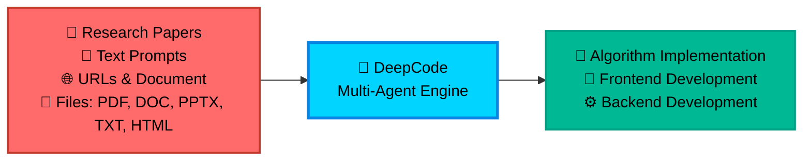
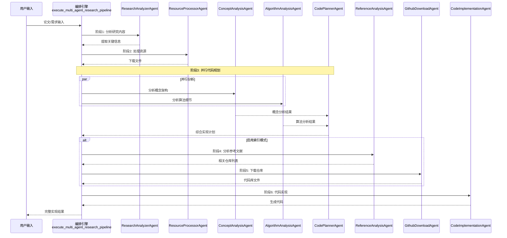

# 基本信息
- 代码仓库：https://github.com/HKUDS/DeepCode
- 机构：港大
- logo：

# 我问
这个repo构建的目的什么？也就是在什么背景下构建该仓库？然后最显著的成果是什么

# deepwiki答
## DeepCode仓库的构建目的和背景

DeepCode是一个**AI驱动的多智能体系统**,旨在自动将研究论文、自然语言需求和技术规范转换为生产就绪的代码 [1](#0-0) 。该仓库由香港大学数据智能实验室(Data Intelligence Lab @ HKU)开发 [2](#0-1) 。

### 构建背景

该系统解决了学术研究和软件开发中的几个关键痛点 [3](#0-2) :

- **实现复杂性**: 将学术论文和复杂算法转换为可工作代码需要大量技术投入和领域专业知识<cite />
- **研究瓶颈**: 研究人员花费宝贵时间实现算法,而非专注于核心研究工作<cite />
- **开发延迟**: 产品团队在概念到可测试原型之间经历漫长等待,减缓创新周期<cite />
- **重复编码**: 开发者反复实现相似模式和功能,而非基于现有解决方案构建<cite />

## 最显著的成果

DeepCode实现了三个核心自动化能力 [4](#0-3) :

### 1. **Paper2Code** - 算法自动实现
将研究论文中的复杂算法转换为**高质量**、**生产就绪**的代码,加速算法复现 [5](#0-4) 。

### 2. **Text2Web** - 前端自动开发
将纯文本描述转换为**功能完整**、**视觉美观**的前端Web代码,实现快速界面创建 [6](#0-5) 。

### 3. **Text2Backend** - 后端自动生成
从简单文本输入生成**高效**、**可扩展**、**功能丰富**的后端代码,简化服务器端开发 [7](#0-6) 。

### 技术创新

系统采用了先进的多智能体架构和技术 [8](#0-7) :

- **智能编排代理**: 动态选择最优处理策略的中央决策系统<cite />
- **高效内存机制**: 通过分层内存结构和智能压缩管理大规模代码上下文<cite />
- **高级CodeRAG系统**: 执行跨代码库关系映射的全局代码理解引擎<cite />

该系统通过Model Context Protocol (MCP)标准集成各种工具和服务 [9](#0-8) ,实现了从研究论文到完整代码库(包括测试套件和文档)的端到端自动化 [10](#0-9) 。

## Notes

DeepCode的核心价值在于**革新研究可复现性** [11](#0-10) ,通过协作式AI构建代码从自然语言自动生成的未来 [12](#0-11) 。系统已发布为开源项目,包名为`deepcode-hku` [13](#0-12) ,当前版本为1.0.4 [14](#0-13) 。

Wiki pages you might want to explore:
- [Overview (HKUDS/DeepCode)](/wiki/HKUDS/DeepCode#1)
- [Getting Started (HKUDS/DeepCode)](/wiki/HKUDS/DeepCode#2)

### Citations

**File:** README.md (L159-164)
```markdown
<p align="center"><strong>Automated Implementation of Complex Algorithms</strong></p>
</div>

<div style="height: 60px; display: flex; align-items: center; justify-content: center;">
<p align="center">Effortlessly converts complex algorithms from research papers into <strong>high-quality</strong>, <strong>production-ready</strong> code, accelerating algorithm reproduction.</p>
</div>
```

**File:** README.md (L180-185)
```markdown
<p align="center"><strong>Automated Front-End Web Development</strong></p>
</div>

<div style="height: 60px; display: flex; align-items: center; justify-content: center;">
<p align="center">Translates plain textual descriptions into <strong>fully functional</strong>, <strong>visually appealing</strong> front-end web code for rapid interface creation.</p>
</div>
```

**File:** README.md (L201-206)
```markdown
<p align="center"><strong>Automated Back-End Development</strong></p>
</div>

<div style="height: 60px; display: flex; align-items: center; justify-content: center;">
<p align="center">Generates <strong>efficient</strong>, <strong>scalable</strong>, and <strong>feature-rich</strong> back-end code from simple text inputs, streamlining server-side development.</p>
</div>
```

**File:** README.md (L218-227)
```markdown
**The Challenges**:

- 📄 **Implementation Complexity**: Converting academic papers and complex algorithms into working code requires significant technical effort and domain expertise

- 🔬 **Research Bottleneck**: Researchers spend valuable time implementing algorithms instead of focusing on their core research and discovery work

- ⏱️ **Development Delays**: Product teams experience long wait times between concept and testable prototypes, slowing down innovation cycles

- 🔄 **Repetitive Coding**: Developers repeatedly implement similar patterns and functionality instead of building on existing solutions

```

**File:** README.md (L232-240)
```markdown

```

**File:** README.md (L250-250)
```markdown
**DeepCode** is an AI-powered development platform that automates code generation and implementation tasks. Our multi-agent system handles the complexity of translating requirements into functional, well-structured code, allowing you to focus on innovation rather than implementation details.
```

**File:** README.md (L273-278)
```markdown
- 🧠 **Intelligent Orchestration Agent**: Central decision-making system that coordinates workflow phases and analyzes requirements. Employs dynamic planning algorithms to adapt execution strategies in real-time based on evolving project complexity. Dynamically selects optimal processing strategies for each implementation step. <br>

- 💾 **Efficient Memory Mechanism**: Advanced context engineering system that manages large-scale code contexts efficiently. Implements hierarchical memory structures with intelligent compression for handling complex codebases. This component enables instant retrieval of implementation patterns and maintains semantic coherence across extended development sessions. <br>

- 🔍 **Advanced CodeRAG System**: Global code comprehension engine that analyzes complex inter-dependencies across repositories. Performs cross-codebase relationship mapping to understand architectural patterns from a holistic perspective. This module leverages dependency graphs and semantic analysis to provide globally-aware code recommendations during implementation.

```

**File:** README.md (L301-303)
```markdown
**🔧 Powered by MCP (Model Context Protocol)**

DeepCode leverages the **Model Context Protocol (MCP)** standard to seamlessly integrate with various tools and services. This standardized approach ensures reliable communication between AI agents and external systems, enabling powerful automation capabilities.
```

**File:** README.md (L398-400)
```markdown
⚡ <strong>OUTPUT DELIVERY</strong><br/>
📦 Complete Codebase • 🧪 Test Suite • 📚 Documentation • 🚀 Deployment Ready
</td>
```

**File:** cli/main_cli.py (L6-7)
```python
🧬 Data Intelligence Lab @ HKU
⚡ Revolutionizing Research Reproducibility through Multi-Agent Architecture
```

**File:** cli/main_cli.py (L37-37)
```python
║    Revolutionizing research reproducibility through collaborative AI         ║
```

**File:** cli/main_cli.py (L38-38)
```python
║    Building the future where code is reproduced from natural language       ║
```

**File:** setup.py (L61-61)
```python
    name="deepcode-hku",
```

**File:** __init__.py (L8-8)
```python
__version__ = "1.0.4"
```


# 我追问
你说三个技术创新：智能编排Agent、高效内存机制，以及高级CodeRAG。具体描述工程代码上是怎么实现的？有什么优势和劣势？

# deepwiki答
## 三大技术创新的工程实现

您询问的是DeepCode的三个核心技术创新在代码层面的具体实现。让我详细解释每个组件的工程实现、优势和劣势。

## 1. 智能编排Agent (Intelligent Orchestration Agent)

### 工程实现

智能编排Agent通过`Agent Orchestration Engine`实现,核心在`workflows/agent_orchestration_engine.py`中 [1](#1-0) 。

**多智能体协调架构**:系统使用`ParallelLLM`实现扇出/扇入(fan-out/fan-in)模式,协调多个专业化Agent并行工作 [2](#1-1) 。例如在代码分析阶段,`ConceptAnalysisAgent`和`AlgorithmAnalysisAgent`并行分析论文,然后由`CodePlannerAgent`整合结果 [3](#1-2) 。

**动态LLM选择**:系统通过`get_preferred_llm_class()`根据API密钥可用性自动选择Anthropic或OpenAI模型 [4](#1-3) 。

**八阶段流水线**:编排引擎管理从研究分析到代码实现的完整流程,包括研究分析、资源处理、工作空间构建、代码规划、参考智能分析、仓库获取、代码库索引和代码实现 [5](#1-4) 。

### 优势
- **模块化设计**:每个Agent职责明确,易于维护和扩展<cite />
- **并行处理**:多Agent并行工作提高处理效率<cite />
- **自适应配置**:根据文档分割需求动态调整Agent配置 [6](#1-5) 

### 劣势
- **复杂性高**:多Agent协调增加系统复杂度,调试困难<cite />
- **API依赖**:依赖外部LLM服务,需要API密钥配置<cite />
- **成本问题**:多Agent并行调用LLM增加API使用成本<cite />

## 2. 高效内存机制 (Efficient Memory Mechanism)

### 工程实现

内存管理通过`ConciseMemoryAgent`实现,采用**基于write_file触发的内存优化策略** [7](#1-6) 。

**核心机制**:
1. **写文件触发清理**:每次调用`write_file`工具后立即触发内存优化 [8](#1-7) 
2. **精简消息列表**:清理后只保留系统提示、初始计划和当前轮次的工具结果 [9](#1-8) 
3. **工具结果过滤**:只记录关键工具(`read_code_mem`、`read_file`、`write_file`、`execute_python`、`execute_bash`、`search_code`等)的结果 [10](#1-9) 

**内存优化流程**:
- 检测到`write_file`调用时设置`last_write_file_detected = True`<cite />
- 下一轮迭代时调用`apply_memory_optimization()`清理历史消息 [9](#1-8) 
- 压缩率通常达到70-90%,显著减少token使用 [11](#1-10) 

**Token管理**:系统配置最大上下文为200,000 tokens(Claude-3.5-Sonnet限制),并设置10,000 token安全缓冲区 [12](#1-11) 。

### 优势
- **高效token使用**:每次文件生成后清理历史,避免上下文膨胀 [13](#1-12) 
- **清晰上下文**:每个新文件实现都有干净的起点,减少混淆<cite />
- **自动化管理**:无需手动干预,系统自动触发优化<cite />

### 劣势
- **上下文丢失风险**:激进的清理可能丢失有用的历史信息<cite />
- **依赖工具分类**:需要准确识别"关键工具",分类错误会影响效果<cite />
- **调试困难**:清理后的历史难以追溯问题根源<cite />

## 3. 高级CodeRAG系统 (Advanced CodeRAG System)

### 工程实现

CodeRAG系统通过`CodeIndexer`和`code-reference-indexer` MCP服务器实现 [14](#1-13) 。

**代码索引流程**:
1. **文件扫描与过滤**:扫描仓库并通过`pre_filter_files()`过滤支持的文件类型<cite />
2. **内容分析**:使用LLM分析每个文件,提取函数、概念、依赖关系<cite />
3. **关系映射**:通过`find_relationships()`建立文件间的依赖关系图<cite />
4. **索引生成**:生成`RepoIndex`包含文件摘要和关系网络<cite />

**智能读取优化**:
`CodeImplementationAgent`实现了`read_file`拦截机制,优先从内存摘要读取而非直接读取文件 [15](#1-14) 。流程为:
1. 拦截`read_file`调用
2. 先调用`read_code_mem` MCP工具检查是否有缓存摘要
3. 如果有摘要则返回摘要,否则执行原始文件读取<cite />

**循环检测**:系统通过`_track_tool_call_for_loop_detection()`防止无限分析循环,限制连续5次读取操作而不写入代码 [16](#1-15) 。

### 优势
- **全局代码理解**:跨仓库分析提供更广阔的实现参考 [17](#1-16) 
- **性能优化**:摘要缓存减少重复文件读取<cite />
- **智能推荐**:基于依赖图提供相关代码建议<cite />

### 劣势
- **索引开销**:初始索引构建耗时且消耗大量LLM tokens<cite />
- **准确性依赖LLM**:关系映射质量取决于LLM理解能力<cite />
- **存储成本**:大型代码库的索引文件可能很大<cite />
- **可选功能**:通过`enable_indexing`参数控制,默认关闭以提高速度 [18](#1-17) 

## 系统集成

三个组件通过MCP协议无缝集成 [19](#1-18) :
- 编排Agent调用内存Agent管理上下文
- 内存Agent与CodeRAG协作优化读取操作
- CodeRAG索引为编排决策提供智能支持

## Notes

这三个技术创新构成了DeepCode的核心架构。系统提供两种运行模式:
- **综合模式**(Comprehensive Mode):启用所有功能包括CodeRAG索引 [20](#1-19) 
- **优化模式**(Optimized Mode):跳过索引阶段以提高速度 [21](#1-20) 

用户可以根据项目需求在速度和智能程度之间权衡选择。<cite />

Wiki pages you might want to explore:
- [Architecture (HKUDS/DeepCode)](/wiki/HKUDS/DeepCode#3)
- [Memory Management System (HKUDS/DeepCode)](/wiki/HKUDS/DeepCode#3.4)
- [Code Implementation Engine (HKUDS/DeepCode)](/wiki/HKUDS/DeepCode#5.2)

### Citations

**File:** workflows/agent_orchestration_engine.py (L1-27)
```python
"""
Intelligent Agent Orchestration Engine for Research-to-Code Automation

This module serves as the core orchestration engine that coordinates multiple specialized
AI agents to automate the complete research-to-code transformation pipeline:

1. Research Analysis Agent - Intelligent content processing and extraction
2. Workspace Infrastructure Agent - Automated environment synthesis
3. Code Architecture Agent - AI-driven design and planning
4. Reference Intelligence Agent - Automated knowledge discovery
5. Repository Acquisition Agent - Intelligent code repository management
6. Codebase Intelligence Agent - Advanced relationship analysis
7. Code Implementation Agent - AI-powered code synthesis

Core Features:
- Multi-agent coordination with intelligent task distribution
- Local environment automation for seamless deployment
- Real-time progress monitoring with comprehensive error handling
- Adaptive workflow optimization based on processing requirements
- Advanced intelligence analysis with configurable performance modes

Architecture:
- Async/await based high-performance agent coordination
- Modular agent design with specialized role separation
- Intelligent resource management and optimization
- Comprehensive logging and monitoring infrastructure
"""
```

**File:** workflows/agent_orchestration_engine.py (L65-89)
```python
def get_default_search_server(config_path: str = "mcp_agent.config.yaml"):
    """
    Get the default search server from configuration.

    Args:
        config_path: Path to the main configuration file

    Returns:
        str: The default search server name ("brave" or "bocha-mcp")
    """
    try:
        if os.path.exists(config_path):
            with open(config_path, "r", encoding="utf-8") as f:
                config = yaml.safe_load(f)

            default_server = config.get("default_search_server", "brave")
            print(f"🔍 Using search server: {default_server}")
            return default_server
        else:
            print(f"⚠️ Config file {config_path} not found, using default: brave")
            return "brave"
    except Exception as e:
        print(f"⚠️ Error reading config file {config_path}: {e}")
        print("🔍 Falling back to default search server: brave")
        return "brave"
```

**File:** workflows/agent_orchestration_engine.py (L353-361)
```python
    # Get adaptive configuration based on segmentation usage
    search_server_names = get_search_server_names()
    agent_config = get_adaptive_agent_config(use_segmentation, search_server_names)
    prompts = get_adaptive_prompts(use_segmentation)

    print(
        f"📊 Code analysis mode: {'Segmented' if use_segmentation else 'Traditional'}"
    )
    print(f"   Agent configurations: {agent_config}")
```

**File:** workflows/agent_orchestration_engine.py (L363-383)
```python
    concept_analysis_agent = Agent(
        name="ConceptAnalysisAgent",
        instruction=prompts["concept_analysis"],
        server_names=agent_config["concept_analysis"],
    )
    algorithm_analysis_agent = Agent(
        name="AlgorithmAnalysisAgent",
        instruction=prompts["algorithm_analysis"],
        server_names=agent_config["algorithm_analysis"],
    )
    code_planner_agent = Agent(
        name="CodePlannerAgent",
        instruction=prompts["code_planning"],
        server_names=agent_config["code_planner"],
    )

    code_aggregator_agent = ParallelLLM(
        fan_in_agent=code_planner_agent,
        fan_out_agents=[concept_analysis_agent, algorithm_analysis_agent],
        llm_factory=get_preferred_llm_class(),
    )
```

**File:** README.md (L273-277)
```markdown
- 🧠 **Intelligent Orchestration Agent**: Central decision-making system that coordinates workflow phases and analyzes requirements. Employs dynamic planning algorithms to adapt execution strategies in real-time based on evolving project complexity. Dynamically selects optimal processing strategies for each implementation step. <br>

- 💾 **Efficient Memory Mechanism**: Advanced context engineering system that manages large-scale code contexts efficiently. Implements hierarchical memory structures with intelligent compression for handling complex codebases. This component enables instant retrieval of implementation patterns and maintains semantic coherence across extended development sessions. <br>

- 🔍 **Advanced CodeRAG System**: Global code comprehension engine that analyzes complex inter-dependencies across repositories. Performs cross-codebase relationship mapping to understand architectural patterns from a holistic perspective. This module leverages dependency graphs and semantic analysis to provide globally-aware code recommendations during implementation.
```

**File:** README.md (L301-303)
```markdown
**🔧 Powered by MCP (Model Context Protocol)**

DeepCode leverages the **Model Context Protocol (MCP)** standard to seamlessly integrate with various tools and services. This standardized approach ensures reliable communication between AI agents and external systems, enabling powerful automation capabilities.
```

**File:** README.md (L317-318)
```markdown
| **📚 code-reference-indexer** | Smart Code Search | Intelligent indexing and search of code repositories |
| **📄 document-segmentation** | Smart Document Analysis | Intelligent document segmentation for large papers and technical documents |
```

**File:** workflows/agents/memory_agent_concise.py (L1-17)
```python
"""
Concise Memory Agent for Code Implementation Workflow

This memory agent implements a focused approach:
1. Before first file: Normal conversation flow
2. After first file: Keep only system_prompt + initial_plan + current round tool results
3. Clean slate for each new code file generation

Key Features:
- Preserves system prompt and initial plan always
- After first file generation, discards previous conversation history
- Keeps only current round tool results from essential tools:
  * read_code_mem, read_file, write_file
  * execute_python, execute_bash
  * search_code, search_reference_code, get_file_structure
- Provides clean, focused input for next write_file operation
"""
```

**File:** workflows/agents/memory_agent_concise.py (L867-941)
```python
    def should_use_concise_mode(self) -> bool:
        """
        Check if concise memory mode should be used

        Returns:
            True if first file has been generated and concise mode should be active
        """
        return self.last_write_file_detected

    def create_concise_messages(
        self,
        system_prompt: str,
        messages: List[Dict[str, Any]],
        files_implemented: int,
    ) -> List[Dict[str, Any]]:
        """
        Create concise message list for LLM input
        NEW LOGIC: Always clear after write_file, keep system_prompt + initial_plan + current round tools

        Args:
            system_prompt: Current system prompt
            messages: Original message list
            files_implemented: Number of files implemented so far

        Returns:
            Concise message list containing only essential information
        """
        if not self.last_write_file_detected:
            # Before any write_file, use normal flow
            self.logger.info(
                "🔄 Using normal conversation flow (before any write_file)"
            )
            return messages

        # After write_file detection, use concise approach with clean slate
        self.logger.info(
            f"🎯 Using CONCISE memory mode - Clear slate after write_file, Round {self.current_round}"
        )

        concise_messages = []

        # Get formatted file lists
        file_lists = self.get_formatted_files_lists()
        implemented_files_list = file_lists["implemented"]

        # 1. Add initial plan message (always preserved)
        initial_plan_message = {
            "role": "user",
            "content": f"""**Task: Implement code based on the following reproduction plan**

**Code Reproduction Plan:**
{self.initial_plan}

**Working Directory:** Current workspace

**All Previously Implemented Files:**
{implemented_files_list}

**Current Status:** {files_implemented} files implemented

**Objective:** Continue implementation by analyzing dependencies and implementing the next required file according to the plan's priority order.""",
        }

        # Append Next Steps information if available
        if self.current_next_steps.strip():
            initial_plan_message["content"] += (
                f"\n\n**Next Steps (from previous analysis):**\n{self.current_next_steps}"
            )

        # Debug output for unimplemented files (clean format without dashes)
        unimplemented_files = self.get_unimplemented_files()
        print("✅ Unimplemented Files:")
        for file_path in unimplemented_files:
            print(f"{file_path}")
        if self.current_next_steps.strip():
```

**File:** workflows/agents/memory_agent_concise.py (L1304-1341)
```python
    def apply_memory_optimization(
        self, system_prompt: str, messages: List[Dict[str, Any]], files_implemented: int
    ) -> List[Dict[str, Any]]:
        """
        Apply memory optimization using concise approach
        NEW LOGIC: Clear all history after write_file, keep only system_prompt + initial_plan + current tools

        Args:
            system_prompt: Current system prompt
            messages: Original message list
            files_implemented: Number of files implemented so far

        Returns:
            Optimized message list
        """
        if not self.should_clear_memory_next:
            # Before any write_file, return original messages
            return messages

        # Apply concise memory optimization after write_file detection
        # self.logger.info(f"🧹 CLEARING MEMORY after write_file - creating clean slate")
        optimized_messages = self.create_concise_messages(
            system_prompt, messages, files_implemented
        )

        # Clear the flag after applying optimization
        self.should_clear_memory_next = False

        compression_ratio = (
            ((len(messages) - len(optimized_messages)) / len(messages) * 100)
            if messages
            else 0
        )
        self.logger.info(
            f"🎯 CONCISE optimization applied: {len(messages)} → {len(optimized_messages)} messages ({compression_ratio:.1f}% compression)"
        )

        return optimized_messages
```

**File:** workflows/code_implementation_workflow.py (L380-392)
```python
                if memory_agent.should_trigger_memory_optimization(
                    messages, code_agent.get_files_implemented_count()
                ):
                    # Memory optimization triggered

                    # Apply concise memory optimization
                    files_implemented_count = code_agent.get_files_implemented_count()
                    current_system_message = code_agent.get_system_prompt()
                    messages = memory_agent.apply_memory_optimization(
                        current_system_message, messages, files_implemented_count
                    )

                    # Memory optimization completed
```

**File:** workflows/code_implementation_workflow.py (L862-874)
```python
✅ WRITE-FILE-BASED Memory Agent - Clear after each file generation
✅ After write_file: Clear history → Keep system prompt + initial plan + tool results
✅ Tool accumulation: read_code_mem, read_file, search_reference_code until next write_file
✅ Clean memory cycle: write_file → clear → accumulate → write_file → clear
✅ Essential tool recording with write_file detection
✅ Specialized agent separation for clean code organization
✅ MCP-compliant tool execution
✅ Production-grade code with comprehensive type hints
✅ Intelligent dependency analysis and file reading
✅ Automated read_file usage for implementation context
✅ Eliminates conversation clutter between file generations
✅ Focused memory for efficient next file generation
"""
```

**File:** workflows/agents/code_implementation_agent.py (L82-91)
```python
        self.max_context_tokens = (
            200000  # Default max context tokens for Claude-3.5-Sonnet
        )
        self.token_buffer = 10000  # Safety buffer before reaching max
        self.summary_trigger_tokens = (
            self.max_context_tokens - self.token_buffer
        )  # Trigger summary when approaching limit
        self.last_summary_token_count = (
            0  # Track token count when last summary was triggered
        )
```

**File:** workflows/agents/code_implementation_agent.py (L108-111)
```python
        # Analysis loop detection
        self.recent_tool_calls = []  # Track recent tool calls to detect analysis loops
        self.max_read_without_write = 5  # Max read_file calls without write_file

```

**File:** workflows/agents/code_implementation_agent.py (L202-221)
```python
                if tool_name == "read_file":
                    file_path = tool_call["input"].get("file_path", "unknown")
                    self.logger.info(f"🔍 READ_FILE CALL DETECTED: {file_path}")
                    self.logger.info(
                        f"📊 Files implemented count: {self.files_implemented_count}"
                    )
                    self.logger.info(
                        f"🧠 Memory agent available: {self.memory_agent is not None}"
                    )

                    # Enable optimization if memory agent is available (more aggressive approach)
                    if self.memory_agent is not None:
                        self.logger.info(
                            f"🔄 INTERCEPTING read_file call for {file_path} (memory agent available)"
                        )
                        result = await self._handle_read_file_with_memory_optimization(
                            tool_call
                        )
                        results.append(result)
                        continue
```

**File:** cli/cli_interface.py (L715-728)
```python
║      {Colors.BOLD}🧠 Comprehensive Mode{Colors.CYAN} - Full intelligence analysis (Default)         ║
║         ✓ Research Analysis + Resource Processing                            ║
║         ✓ Reference Intelligence Discovery                                   ║
║         ✓ Automated Repository Acquisition                                   ║
║         ✓ Codebase Intelligence Orchestration                               ║
║         ✓ Intelligent Code Implementation Synthesis                         ║
║                                                                               ║
║      {Colors.BOLD}⚡ Optimized Mode{Colors.CYAN} - Fast processing (Skip indexing)                    ║
║         ✓ Research Analysis + Resource Processing                            ║
║         ✓ Code Architecture Synthesis                                        ║
║         ✓ Intelligent Code Implementation Synthesis                         ║
║         ✗ Reference Intelligence Discovery (Skipped)                        ║
║         ✗ Repository Acquisition (Skipped)                                   ║
║         ✗ Codebase Intelligence Orchestration (Skipped)                     ║
```


# 我追问
业界提出了系统性的上下文工程方法论：Offload：通过引用减少上下文长度。Retrieve：RAG 技术动态检索相关信息。Reduce：压缩裁剪冗余信息。Isolate：分而治之，通过SubAgent处理子任务。

请问DeepCode的工程代码上，是如何实现上述4种方法？

# deepwiki答
## DeepCode中的四种上下文工程方法实现

您询问的是DeepCode如何实现业界提出的四种上下文工程方法论。让我逐一分析系统在代码层面的具体实现。<cite />

## 1. Offload - 通过引用减少上下文长度

### 实现方式

DeepCode通过**read_file拦截机制**和**代码摘要缓存**实现Offload策略 [1](#2-0) 。

**核心流程**:
- 当Agent需要读取文件时,系统首先拦截`read_file`调用 [2](#2-1) 
- 调用`read_code_mem` MCP工具检查是否存在该文件的摘要缓存 [3](#2-2) 
- 如果摘要存在,直接返回摘要而非完整文件内容,大幅减少token消耗<cite />

**知识库管理**:系统维护`implement_code_summary.md`文件作为代码知识库 [4](#2-3) 。每次文件实现后,通过LLM生成该文件的结构化摘要并存储<cite />。后续实现新文件时,只需引用这些摘要而非读取完整历史代码 [5](#2-4) 。

**最新条目提取**:为进一步优化,系统只提取知识库中的最新实现条目 [6](#2-5) ,使用正则表达式匹配最后一个实现章节,避免加载全部历史记录<cite />。

## 2. Retrieve - RAG技术动态检索相关信息

### 实现方式

DeepCode通过**CodeRAG系统**和**智能文档分段**实现动态检索<cite />。

**CodeRAG索引系统**:
- 使用`code-reference-indexer` MCP服务器建立代码库索引 [7](#2-6) 
- `search_reference_code`工具允许Agent根据关键词和目标文件动态搜索相关代码模式 [8](#2-7) 
- 系统分析文件间依赖关系,建立语义关系图,实现全局代码理解 [9](#2-8) 

**智能文档分段检索**:
- `DocumentSegmentationAgent`对大型研究论文进行语义分析和智能分段 [10](#2-9) 
- 支持`read_document_segments`工具,允许Agent根据查询类型和关键词动态检索相关文档片段 [11](#2-10) 
- 采用多种分段策略:`semantic_research_focused`、`algorithm_preserve_integrity`、`concept_implementation_hybrid`等 [12](#2-11) ,确保算法完整性和规划Agent优化<cite />

**检索优化**:系统在代码规划阶段明确指导Agent使用分段读取获取额外细节 [11](#2-10) ,避免一次性加载整个文档导致token溢出<cite />。

## 3. Reduce - 压缩裁剪冗余信息

### 实现方式

DeepCode通过**write_file触发的内存优化**和**工具结果过滤**实现Reduce策略<cite />。

**激进的内存清理机制**:
- 每次`write_file`调用后,系统设置`last_write_file_detected = True`标志 [13](#2-12) 
- 下一轮迭代时,`create_concise_messages()`方法清理所有历史对话 [14](#2-13) 
- 只保留三类信息:系统提示、初始计划消息、当前轮次工具结果 [15](#2-14) 

**工具结果选择性记录**:
系统定义了"关键工具"列表,只记录这些工具的执行结果 [16](#2-15) :
- 文件操作:`read_code_mem`、`read_file`、`write_file`<cite />
- 代码分析:`search_code`、`search_reference_code`、`get_file_structure`<cite />
- 执行工具:`execute_python`、`execute_bash`<cite />

非关键工具的结果被直接丢弃,不进入上下文<cite />。

**压缩效果**:系统报告显示,这种策略通常实现70-90%的上下文压缩率 [17](#2-16) ,显著减少token使用并保持每个文件实现的清晰起点<cite />。

## 4. Isolate - 分而治之的SubAgent处理

### 实现方式

DeepCode通过**多智能体编排**和**ParallelLLM扇出/扇入模式**实现Isolate策略<cite />。

**专业化Agent分工**:
系统将复杂任务分解给多个专业Agent [18](#2-17) :
- `ResearchAnalyzerAgent`:处理研究内容分析<cite />
- `ConceptAnalysisAgent`:分析系统架构和概念框架 [19](#2-18) 
- `AlgorithmAnalysisAgent`:提取算法和技术细节 [20](#2-19) 
- `CodePlannerAgent`:整合分析结果生成实现计划 [21](#2-20) 

**并行处理架构**:
使用`ParallelLLM`实现扇出/扇入模式 [22](#2-21) :
- `ConceptAnalysisAgent`和`AlgorithmAnalysisAgent`并行分析同一论文<cite />
- `CodePlannerAgent`作为扇入Agent整合两个并行Agent的输出<cite />
- 每个Agent维护独立的上下文和专业提示词<cite />

**实现层隔离**:
在代码实现阶段,系统进一步隔离职责 [23](#2-22) :
- `CodeImplementationAgent`:负责工具执行和进度跟踪<cite />
- `ConciseMemoryAgent`:负责内存管理和上下文优化<cite />
- 两个Agent通过明确的接口协作,各自维护独立状态<cite />

**可选功能隔离**:
系统通过`enable_indexing`参数控制是否启用CodeRAG索引功能 [24](#2-23) ,允许用户在快速模式和综合模式间选择,实现功能级别的隔离<cite />。

## 系统集成效果

四种方法协同工作形成完整的上下文工程体系<cite />:

1. **Offload + Retrieve**:摘要缓存与动态检索结合,按需加载信息<cite />
2. **Reduce + Isolate**:激进清理与任务分解结合,每个SubAgent处理精简上下文<cite />
3. **整体优化**:系统在最终报告中展示这些策略的综合效果 [25](#2-24) ,包括内存清理统计、工具记录数量、文件实现进度等<cite />

## Notes

DeepCode的上下文工程实现体现了工程实用主义:
- **Offload**通过摘要缓存实现,但依赖LLM生成质量<cite />
- **Retrieve**通过RAG和文档分段实现,但索引构建有成本<cite />
- **Reduce**采用激进的write_file触发清理,可能丢失部分历史信息<cite />
- **Isolate**通过多Agent并行实现,但增加了系统复杂度和API调用成本<cite />

系统提供`enable_read_tools`参数用于测试和调试 [26](#2-25) ,可以禁用读取工具来验证内存管理策略的有效性<cite />。

Wiki pages you might want to explore:
- [Architecture (HKUDS/DeepCode)](/wiki/HKUDS/DeepCode#3)
- [Memory Management System (HKUDS/DeepCode)](/wiki/HKUDS/DeepCode#3.4)
- [Code Implementation Engine (HKUDS/DeepCode)](/wiki/HKUDS/DeepCode#5.2)

### Citations

**File:** workflows/agents/code_implementation_agent.py (L173-197)
```python
                # Check if read tools are disabled
                if not self.enable_read_tools and tool_name in [
                    "read_file",
                    "read_code_mem",
                ]:
                    # self.logger.info(f"🚫 SKIPPING {tool_name} - Read tools disabled for testing")
                    # Return a mock result indicating the tool was skipped
                    mock_result = json.dumps(
                        {
                            "status": "skipped",
                            "message": f"{tool_name} tool disabled for testing",
                            "tool_disabled": True,
                            "original_input": tool_input,
                        },
                        ensure_ascii=False,
                    )

                    results.append(
                        {
                            "tool_id": tool_call["id"],
                            "tool_name": tool_name,
                            "result": mock_result,
                        }
                    )
                    continue
```

**File:** workflows/agents/code_implementation_agent.py (L201-221)
```python
                # INTERCEPT read_file calls - redirect to read_code_mem first if memory agent is available
                if tool_name == "read_file":
                    file_path = tool_call["input"].get("file_path", "unknown")
                    self.logger.info(f"🔍 READ_FILE CALL DETECTED: {file_path}")
                    self.logger.info(
                        f"📊 Files implemented count: {self.files_implemented_count}"
                    )
                    self.logger.info(
                        f"🧠 Memory agent available: {self.memory_agent is not None}"
                    )

                    # Enable optimization if memory agent is available (more aggressive approach)
                    if self.memory_agent is not None:
                        self.logger.info(
                            f"🔄 INTERCEPTING read_file call for {file_path} (memory agent available)"
                        )
                        result = await self._handle_read_file_with_memory_optimization(
                            tool_call
                        )
                        results.append(result)
                        continue
```

**File:** workflows/agents/memory_agent_concise.py (L37-40)
```python
    Essential Tools Tracked:
    - File Operations: read_code_mem, read_file, write_file
    - Code Analysis: search_code, search_reference_code, get_file_structure
    - Execution: execute_python, execute_bash
```

**File:** workflows/agents/memory_agent_concise.py (L69-72)
```python
        self.last_write_file_detected = (
            False  # Track if write_file was called in current iteration
        )
        self.should_clear_memory_next = False  # Flag to clear memory in next round
```

**File:** workflows/agents/memory_agent_concise.py (L87-90)
```python
        # Code summary file path
        self.code_summary_path = os.path.join(
            self.save_path, "implement_code_summary.md"
        )
```

**File:** workflows/agents/memory_agent_concise.py (L876-904)
```python
    def create_concise_messages(
        self,
        system_prompt: str,
        messages: List[Dict[str, Any]],
        files_implemented: int,
    ) -> List[Dict[str, Any]]:
        """
        Create concise message list for LLM input
        NEW LOGIC: Always clear after write_file, keep system_prompt + initial_plan + current round tools

        Args:
            system_prompt: Current system prompt
            messages: Original message list
            files_implemented: Number of files implemented so far

        Returns:
            Concise message list containing only essential information
        """
        if not self.last_write_file_detected:
            # Before any write_file, use normal flow
            self.logger.info(
                "🔄 Using normal conversation flow (before any write_file)"
            )
            return messages

        # After write_file detection, use concise approach with clean slate
        self.logger.info(
            f"🎯 Using CONCISE memory mode - Clear slate after write_file, Round {self.current_round}"
        )
```

**File:** workflows/agents/memory_agent_concise.py (L912-1000)
```python
        # 1. Add initial plan message (always preserved)
        initial_plan_message = {
            "role": "user",
            "content": f"""**Task: Implement code based on the following reproduction plan**

**Code Reproduction Plan:**
{self.initial_plan}

**Working Directory:** Current workspace

**All Previously Implemented Files:**
{implemented_files_list}

**Current Status:** {files_implemented} files implemented

**Objective:** Continue implementation by analyzing dependencies and implementing the next required file according to the plan's priority order.""",
        }

        # Append Next Steps information if available
        if self.current_next_steps.strip():
            initial_plan_message["content"] += (
                f"\n\n**Next Steps (from previous analysis):**\n{self.current_next_steps}"
            )

        # Debug output for unimplemented files (clean format without dashes)
        unimplemented_files = self.get_unimplemented_files()
        print("✅ Unimplemented Files:")
        for file_path in unimplemented_files:
            print(f"{file_path}")
        if self.current_next_steps.strip():
            print(f"\n📋 {self.current_next_steps}")

        concise_messages.append(initial_plan_message)

        # 2. Add Knowledge Base
        knowledge_base_message = {
            "role": "user",
            "content": f"""**Below is the Knowledge Base of the LATEST implemented code file:**
{self._read_code_knowledge_base()}

**Development Cycle - START HERE:**

**For NEW file implementation:**
1. **You need to call read_code_mem(already_implemented_file_path)** to understand existing implementations and dependencies - agent should choose relevant ALREADY IMPLEMENTED file paths for reference, NOT the new file you want to create
2. Write_file can be used to implement the new component
3. Finally: Use execute_python or execute_bash for testing (if needed)

**When all files implemented:**
**Use execute_python or execute_bash** to test the complete implementation""",
        }
        concise_messages.append(knowledge_base_message)

        # 3. Add current tool results (essential information for next file generation)
        if self.current_round_tool_results:
            tool_results_content = self._format_tool_results()

            # # Append Next Steps information if available
            # if self.current_next_steps.strip():
            #     tool_results_content += f"\n\n**Next Steps (from previous analysis):**\n{self.current_next_steps}"

            tool_results_message = {
                "role": "user",
                "content": f"""**Current Tool Results:**
{tool_results_content}""",
            }
            concise_messages.append(tool_results_message)
        else:
            # If no tool results yet, add guidance for next steps
            guidance_content = f"""**Current Round:** {self.current_round}

**Development Cycle - START HERE:**

**For NEW file implementation:**
1. **You need to call read_code_mem(already_implemented_file_path)** to understand existing implementations and dependencies - agent should choose relevant ALREADY IMPLEMENTED file paths for reference, NOT the new file you want to create
2. Write_file can be used to implement the new component
3. Finally: Use execute_python or execute_bash for testing (if needed)

**When all files implemented:**
1. **Use execute_python or execute_bash** to test the complete implementation"""

            # # Append Next Steps information if available (even when no tool results)
            # if self.current_next_steps.strip():
            #     guidance_content += f"\n\n**Next Steps (from previous analysis):**\n{self.current_next_steps}"

            guidance_message = {
                "role": "user",
                "content": guidance_content,
            }
            concise_messages.append(guidance_message)
```

**File:** workflows/agents/memory_agent_concise.py (L1006-1029)
```python
    def _read_code_knowledge_base(self) -> Optional[str]:
        """
        Read the implement_code_summary.md file as code knowledge base
        Returns only the final/latest implementation entry, not all historical entries

        Returns:
            Content of the latest implementation entry if it exists, None otherwise
        """
        try:
            if os.path.exists(self.code_summary_path):
                with open(self.code_summary_path, "r", encoding="utf-8") as f:
                    content = f.read().strip()

                if content:
                    # Extract only the final/latest implementation entry
                    return self._extract_latest_implementation_entry(content)
                else:
                    return None
            else:
                return None

        except Exception as e:
            self.logger.error(f"Failed to read code knowledge base: {e}")
            return None
```

**File:** workflows/agents/memory_agent_concise.py (L1031-1077)
```python
    def _extract_latest_implementation_entry(self, content: str) -> Optional[str]:
        """
        Extract the latest/final implementation entry from the implement_code_summary.md content
        Uses a simpler approach to find the last implementation section

        Args:
            content: Full content of implement_code_summary.md

        Returns:
            Latest implementation entry content, or None if not found
        """
        try:
            import re

            # Pattern to match the start of implementation sections
            section_pattern = (
                r"={80}\s*\n## IMPLEMENTATION File .+?; ROUND \d+\s*\n={80}"
            )

            # Find all implementation section starts
            matches = list(re.finditer(section_pattern, content))

            if not matches:
                # No implementation sections found
                lines = content.split("\n")
                fallback_content = (
                    "\n".join(lines[:10]) + "\n... (truncated for brevity)"
                    if len(lines) > 10
                    else content
                )
                self.logger.info(
                    "📖 No implementation sections found, using fallback content"
                )
                return fallback_content

            # Get the start position of the last implementation section
            last_match = matches[-1]
            start_pos = last_match.start()

            # Take everything from the last section start to the end of content
            latest_entry = content[start_pos:].strip()

            # self.logger.info(f"📖 Extracted latest implementation entry from knowledge base")
            # print(f"DEBUG: Extracted content length: {len(latest_entry)}")
            # print(f"DEBUG: First 200 chars: {latest_entry[:]}")

            return latest_entry
```

**File:** README.md (L277-277)
```markdown
- 🔍 **Advanced CodeRAG System**: Global code comprehension engine that analyzes complex inter-dependencies across repositories. Performs cross-codebase relationship mapping to understand architectural patterns from a holistic perspective. This module leverages dependency graphs and semantic analysis to provide globally-aware code recommendations during implementation.
```

**File:** README.md (L317-317)
```markdown
| **📚 code-reference-indexer** | Smart Code Search | Intelligent indexing and search of code repositories |
```

**File:** prompts/code_prompts.py (L564-575)
```python
# INTELLIGENT DOCUMENT ACCESS

## IMPORTANT: Use Segmented Reading for Detailed Planning
When you need additional details beyond the provided analyses, use the intelligent segmentation system:

1. **Use read_document_segments tool** with these parameters:
   - query_type: "code_planning"
   - keywords: Specific to what you need, e.g., ["implementation", "code", "experiment", "setup", "configuration"]
   - max_segments: 3
   - max_total_chars: 8000

2. **This approach ensures** you access the most planning-relevant content without token limits
```

**File:** prompts/code_prompts.py (L1038-1041)
```python
2. **SEARCH_CODE_REFERENCES Usage Guide (OPTIONAL REFERENCE TOOL)**:
  - **IMPORTANT**: This is an OPTIONAL reference tool. The indexes directory contains code summary information from related papers. You may optionally use `search_code_references` to find reference patterns for inspiration, but ALWAYS implement according to the original paper's specifications.
  - **Reference only**: Use `search_code_references(indexes_path="indexes", target_file=the_file_you_want_to_implement, keywords=the_keywords_you_want_to_search)` for reference, NOT as implementation standard
  - **Core principle**: Original paper requirements take absolute priority over any reference code found
```

**File:** workflows/agents/document_segmentation_agent.py (L99-117)
```python
    async def analyze_and_prepare_document(
        self, paper_dir: str, force_refresh: bool = False
    ) -> Dict[str, Any]:
        """
        Perform intelligent semantic analysis and create optimized document segments.

        This method coordinates with the enhanced document segmentation server to:
        - Classify document type using semantic content analysis
        - Select optimal segmentation strategy (semantic_research_focused, algorithm_preserve_integrity, etc.)
        - Preserve algorithm and formula integrity
        - Optimize segments for downstream planning agents

        Args:
            paper_dir: Path to the paper directory
            force_refresh: Whether to force re-analysis with latest algorithms

        Returns:
            Dict containing enhanced analysis results and intelligent segment information
        """
```

**File:** workflows/agents/document_segmentation_agent.py (L136-138)
```python
   - `semantic_research_focused` for research papers with high algorithm density
   - `algorithm_preserve_integrity` for algorithm-heavy documents
   - `concept_implementation_hybrid` for mixed concept/implementation content
```

**File:** workflows/code_implementation_workflow.py (L296-314)
```python
        # Initialize specialized agents
        code_agent = CodeImplementationAgent(
            self.mcp_agent, self.logger, self.enable_read_tools
        )
        memory_agent = ConciseMemoryAgent(plan_content, self.logger, target_directory)

        # Log read tools configuration
        read_tools_status = "ENABLED" if self.enable_read_tools else "DISABLED"
        self.logger.info(
            f"🔧 Read tools (read_file, read_code_mem): {read_tools_status}"
        )
        if not self.enable_read_tools:
            self.logger.info(
                "🚫 No read mode: read_file and read_code_mem tools will be skipped"
            )

        # Connect code agent with memory agent for summary generation
        # Note: Concise memory agent doesn't need LLM client for summary generation
        code_agent.set_memory_agent(memory_agent, client, client_type)
```

**File:** workflows/code_implementation_workflow.py (L818-876)
```python
            report = f"""
# Pure Code Implementation Completion Report (Write-File-Based Memory Mode)

## Execution Summary
- Implementation iterations: {iterations}
- Total elapsed time: {elapsed_time:.2f} seconds
- Files implemented: {code_stats['total_files_implemented']}
- File write operations: {write_operations}
- Total MCP operations: {history_data.get('total_operations', 0)}

## Read Tools Configuration
- Read tools enabled: {code_stats['read_tools_status']['read_tools_enabled']}
- Status: {code_stats['read_tools_status']['status']}
- Tools affected: {', '.join(code_stats['read_tools_status']['tools_affected'])}

## Agent Performance
### Code Implementation Agent
- Files tracked: {code_stats['files_implemented_count']}
- Technical decisions: {code_stats['technical_decisions_count']}
- Constraints tracked: {code_stats['constraints_count']}
- Architecture notes: {code_stats['architecture_notes_count']}
- Dependency analysis performed: {code_stats['dependency_analysis_count']}
- Files read for dependencies: {code_stats['files_read_for_dependencies']}
- Last summary triggered at file count: {code_stats['last_summary_file_count']}

### Concise Memory Agent (Write-File-Based)
- Last write_file detected: {memory_stats['last_write_file_detected']}
- Should clear memory next: {memory_stats['should_clear_memory_next']}
- Files implemented count: {memory_stats['implemented_files_tracked']}
- Current round: {memory_stats['current_round']}
- Concise mode active: {memory_stats['concise_mode_active']}
- Current round tool results: {memory_stats['current_round_tool_results']}
- Essential tools recorded: {memory_stats['essential_tools_recorded']}

## Files Created
"""
            for file_path in files_created[-20:]:
                report += f"- {file_path}\n"

            if len(files_created) > 20:
                report += f"... and {len(files_created) - 20} more files\n"

            report += """
## Architecture Features
✅ WRITE-FILE-BASED Memory Agent - Clear after each file generation
✅ After write_file: Clear history → Keep system prompt + initial plan + tool results
✅ Tool accumulation: read_code_mem, read_file, search_reference_code until next write_file
✅ Clean memory cycle: write_file → clear → accumulate → write_file → clear
✅ Essential tool recording with write_file detection
✅ Specialized agent separation for clean code organization
✅ MCP-compliant tool execution
✅ Production-grade code with comprehensive type hints
✅ Intelligent dependency analysis and file reading
✅ Automated read_file usage for implementation context
✅ Eliminates conversation clutter between file generations
✅ Focused memory for efficient next file generation
"""
            return report

```

**File:** workflows/agent_orchestration_engine.py (L1-26)
```python
"""
Intelligent Agent Orchestration Engine for Research-to-Code Automation

This module serves as the core orchestration engine that coordinates multiple specialized
AI agents to automate the complete research-to-code transformation pipeline:

1. Research Analysis Agent - Intelligent content processing and extraction
2. Workspace Infrastructure Agent - Automated environment synthesis
3. Code Architecture Agent - AI-driven design and planning
4. Reference Intelligence Agent - Automated knowledge discovery
5. Repository Acquisition Agent - Intelligent code repository management
6. Codebase Intelligence Agent - Advanced relationship analysis
7. Code Implementation Agent - AI-powered code synthesis

Core Features:
- Multi-agent coordination with intelligent task distribution
- Local environment automation for seamless deployment
- Real-time progress monitoring with comprehensive error handling
- Adaptive workflow optimization based on processing requirements
- Advanced intelligence analysis with configurable performance modes

Architecture:
- Async/await based high-performance agent coordination
- Modular agent design with specialized role separation
- Intelligent resource management and optimization
- Comprehensive logging and monitoring infrastructure
```

**File:** workflows/agent_orchestration_engine.py (L363-367)
```python
    concept_analysis_agent = Agent(
        name="ConceptAnalysisAgent",
        instruction=prompts["concept_analysis"],
        server_names=agent_config["concept_analysis"],
    )
```

**File:** workflows/agent_orchestration_engine.py (L368-372)
```python
    algorithm_analysis_agent = Agent(
        name="AlgorithmAnalysisAgent",
        instruction=prompts["algorithm_analysis"],
        server_names=agent_config["algorithm_analysis"],
    )
```

**File:** workflows/agent_orchestration_engine.py (L373-377)
```python
    code_planner_agent = Agent(
        name="CodePlannerAgent",
        instruction=prompts["code_planning"],
        server_names=agent_config["code_planner"],
    )
```

**File:** workflows/agent_orchestration_engine.py (L379-383)
```python
    code_aggregator_agent = ParallelLLM(
        fan_in_agent=code_planner_agent,
        fan_out_agents=[concept_analysis_agent, algorithm_analysis_agent],
        llm_factory=get_preferred_llm_class(),
    )
```

**File:** workflows/agent_orchestration_engine.py (L1286-1311)
```python
        if enable_indexing:
            reference_result = await orchestrate_reference_intelligence_agent(
                dir_info, logger, progress_callback
            )
        else:
            print("🔶 Skipping reference intelligence analysis (fast mode enabled)")
            # Create empty reference analysis result to maintain file structure consistency
            reference_result = "Reference intelligence analysis skipped - fast mode enabled for optimized processing"
            with open(dir_info["reference_path"], "w", encoding="utf-8") as f:
                f.write(reference_result)

        # Phase 6: Repository Acquisition Automation (optional)
        if enable_indexing:
            await automate_repository_acquisition_agent(
                reference_result, dir_info, logger, progress_callback
            )
        else:
            print("🔶 Skipping automated repository acquisition (fast mode enabled)")
            # Create empty download result file to maintain file structure consistency
            with open(dir_info["download_path"], "w", encoding="utf-8") as f:
                f.write(
                    "Automated repository acquisition skipped - fast mode enabled for optimized processing"
                )

        # Phase 7: Codebase Intelligence Orchestration (optional)
        if enable_indexing:
```


# 我追问
DeepCode声称自己是多智能体架构，那是构建了多少个智能体？智能体之间的交互流程是怎样的？画出mermaid图

# deepwiki答
## DeepCode的多智能体架构

DeepCode构建了**7个核心专业智能体**,通过中央编排引擎协调工作 [1](#0-0) 。

### 智能体列表

根据`agent_orchestration_engine.py`的文档,系统包含以下智能体 [1](#0-0) :

1. **ResearchAnalyzerAgent** - 研究分析智能体,负责内容处理和信息提取<cite />
2. **ResourceProcessorAgent** - 资源处理智能体,下载和处理相关文件<cite />
3. **ConceptAnalysisAgent** - 概念分析智能体,分析系统架构和概念框架 [2](#0-1) 
4. **AlgorithmAnalysisAgent** - 算法分析智能体,提取算法、公式和技术细节 [3](#0-2) 
5. **CodePlannerAgent** - 代码规划智能体,整合分析结果生成实现计划 [4](#0-3) 
6. **ReferenceAnalysisAgent** - 参考文献分析智能体,分析论文引用并发现相关代码库<cite />
7. **GithubDownloadAgent** - GitHub下载智能体,下载识别的代码仓库<cite />

此外还有**ChatPlanningAgent**用于处理用户需求输入的场景<cite />。

### 智能体交互流程



### 核心交互机制

**并行处理架构**: ConceptAnalysisAgent和AlgorithmAnalysisAgent通过`ParallelLLM`并行分析同一输入,然后由CodePlannerAgent综合两者输出 [5](#0-4) :

```python
code_aggregator_agent = ParallelLLM(
    fan_in_agent=code_planner_agent,
    fan_out_agents=[concept_analysis_agent, algorithm_analysis_agent],
    llm_factory=get_preferred_llm_class(),
)
```

**条件执行流程**: 系统根据`enable_indexing`参数决定是否执行参考文献分析、仓库下载和代码索引阶段 [6](#0-5) 。当`enable_indexing=False`时,跳过这些阶段以实现快速模式<cite />。

**MCP工具集成**: 每个智能体配置了特定的MCP服务器工具<cite />。例如,ResearchAnalyzerAgent使用`brave`搜索工具<cite />,ResourceProcessorAgent使用`filesystem`和`file-downloader`<cite />,CodeImplementationAgent使用`code-implementation`和`code-reference-indexer`服务器 [7](#0-6) 。

## Notes

系统实际运行的智能体数量取决于配置:在完整模式下运行全部7个核心智能体,在快速模式(`enable_indexing=False`)下跳过ReferenceAnalysisAgent和GithubDownloadAgent<cite />。此外还有辅助智能体如DocumentSegmentationAgent用于文档分段 [8](#0-7) ,以及ConciseMemoryAgent用于内存管理<cite />。

Wiki pages you might want to explore:
- [Architecture (HKUDS/DeepCode)](/wiki/HKUDS/DeepCode#3)
- [Code Implementation Engine (HKUDS/DeepCode)](/wiki/HKUDS/DeepCode#5.2)

### Citations

**File:** workflows/agent_orchestration_engine.py (L1-14)
```python
"""
Intelligent Agent Orchestration Engine for Research-to-Code Automation

This module serves as the core orchestration engine that coordinates multiple specialized
AI agents to automate the complete research-to-code transformation pipeline:

1. Research Analysis Agent - Intelligent content processing and extraction
2. Workspace Infrastructure Agent - Automated environment synthesis
3. Code Architecture Agent - AI-driven design and planning
4. Reference Intelligence Agent - Automated knowledge discovery
5. Repository Acquisition Agent - Intelligent code repository management
6. Codebase Intelligence Agent - Advanced relationship analysis
7. Code Implementation Agent - AI-powered code synthesis

```

**File:** workflows/agent_orchestration_engine.py (L363-367)
```python
    concept_analysis_agent = Agent(
        name="ConceptAnalysisAgent",
        instruction=prompts["concept_analysis"],
        server_names=agent_config["concept_analysis"],
    )
```

**File:** workflows/agent_orchestration_engine.py (L368-372)
```python
    algorithm_analysis_agent = Agent(
        name="AlgorithmAnalysisAgent",
        instruction=prompts["algorithm_analysis"],
        server_names=agent_config["algorithm_analysis"],
    )
```

**File:** workflows/agent_orchestration_engine.py (L373-377)
```python
    code_planner_agent = Agent(
        name="CodePlannerAgent",
        instruction=prompts["code_planning"],
        server_names=agent_config["code_planner"],
    )
```

**File:** workflows/agent_orchestration_engine.py (L379-383)
```python
    code_aggregator_agent = ParallelLLM(
        fan_in_agent=code_planner_agent,
        fan_out_agents=[concept_analysis_agent, algorithm_analysis_agent],
        llm_factory=get_preferred_llm_class(),
    )
```

**File:** workflows/agent_orchestration_engine.py (L1286-1311)
```python
        if enable_indexing:
            reference_result = await orchestrate_reference_intelligence_agent(
                dir_info, logger, progress_callback
            )
        else:
            print("🔶 Skipping reference intelligence analysis (fast mode enabled)")
            # Create empty reference analysis result to maintain file structure consistency
            reference_result = "Reference intelligence analysis skipped - fast mode enabled for optimized processing"
            with open(dir_info["reference_path"], "w", encoding="utf-8") as f:
                f.write(reference_result)

        # Phase 6: Repository Acquisition Automation (optional)
        if enable_indexing:
            await automate_repository_acquisition_agent(
                reference_result, dir_info, logger, progress_callback
            )
        else:
            print("🔶 Skipping automated repository acquisition (fast mode enabled)")
            # Create empty download result file to maintain file structure consistency
            with open(dir_info["download_path"], "w", encoding="utf-8") as f:
                f.write(
                    "Automated repository acquisition skipped - fast mode enabled for optimized processing"
                )

        # Phase 7: Codebase Intelligence Orchestration (optional)
        if enable_indexing:
```

**File:** workflows/code_implementation_workflow.py (L451-455)
```python
            self.mcp_agent = Agent(
                name="CodeImplementationAgent",
                instruction="You are a code implementation assistant, using MCP tools to implement paper code replication.",
                server_names=["code-implementation", "code-reference-indexer"],
            )
```

**File:** workflows/agents/document_segmentation_agent.py (L16-33)
```python
class DocumentSegmentationAgent:
    """
    Intelligent document segmentation agent with semantic analysis capabilities.

    This enhanced agent provides:
    1. **Semantic Document Classification**: Content-based document type identification
    2. **Adaptive Segmentation Strategy**: Algorithm integrity and semantic coherence preservation
    3. **Planning Agent Optimization**: Segment preparation specifically optimized for downstream agents
    4. **Quality Intelligence Validation**: Advanced metrics for completeness and technical accuracy
    5. **Algorithm Completeness Protection**: Ensures critical algorithms and formulas remain intact

    Key improvements over traditional segmentation:
    - Semantic content analysis vs mechanical structure splitting
    - Dynamic character limits based on content complexity
    - Enhanced relevance scoring for planning agents
    - Algorithm and formula integrity preservation
    - Content type-aware segmentation strategies
    """
```
