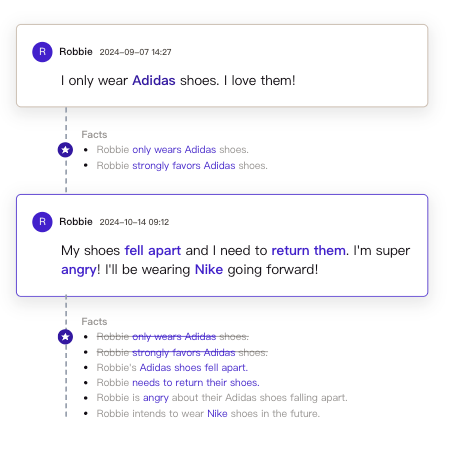
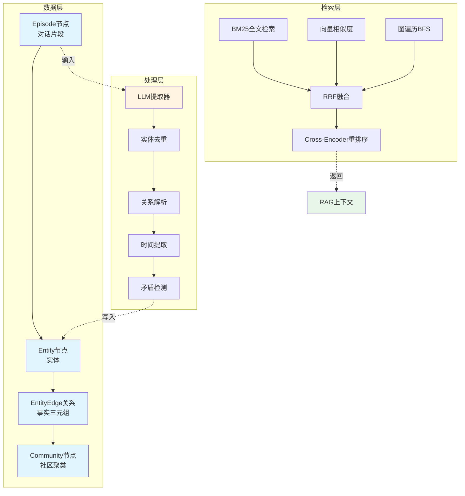
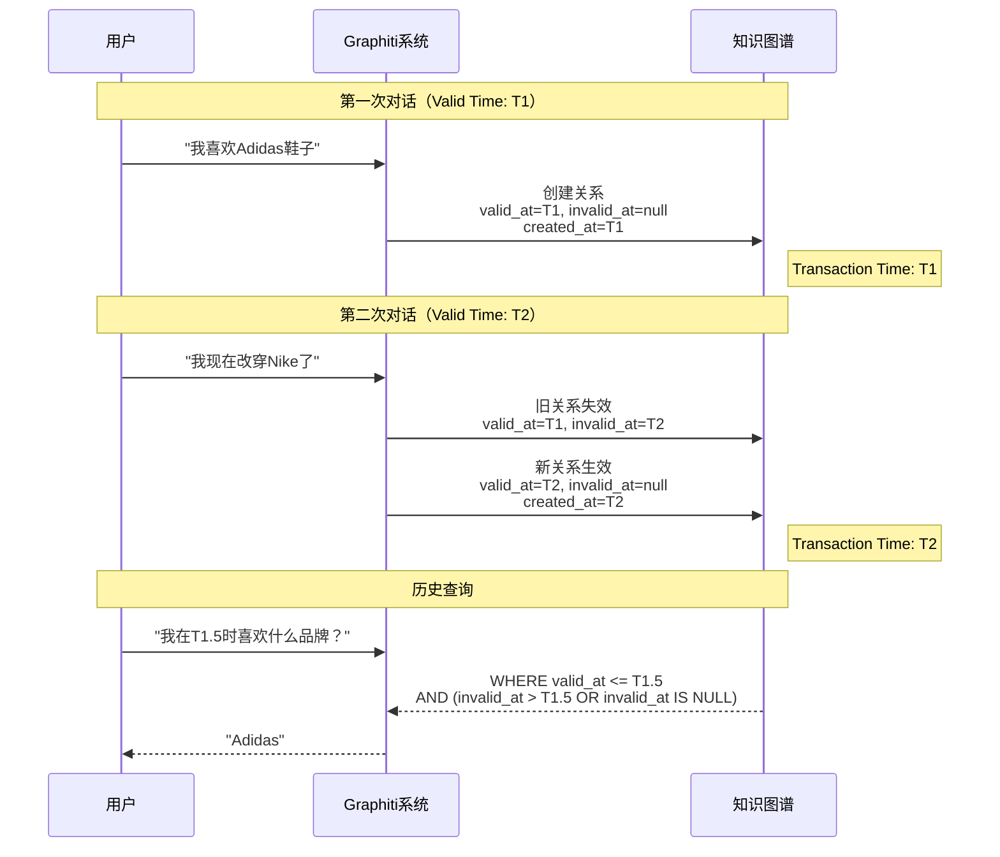
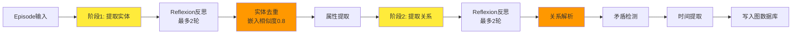
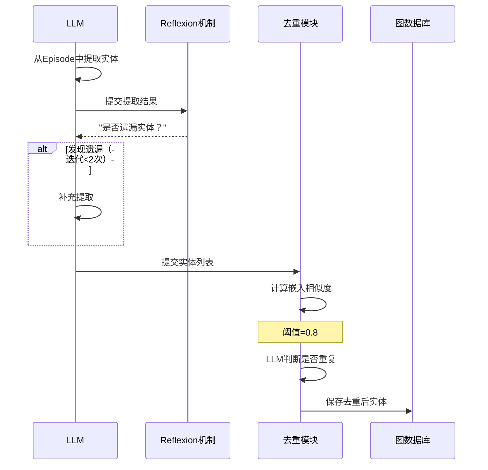
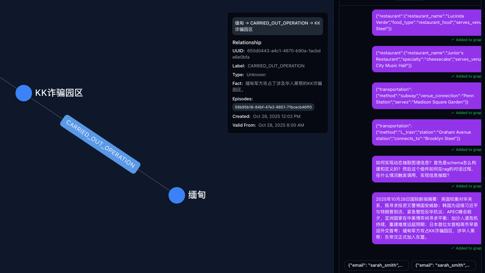
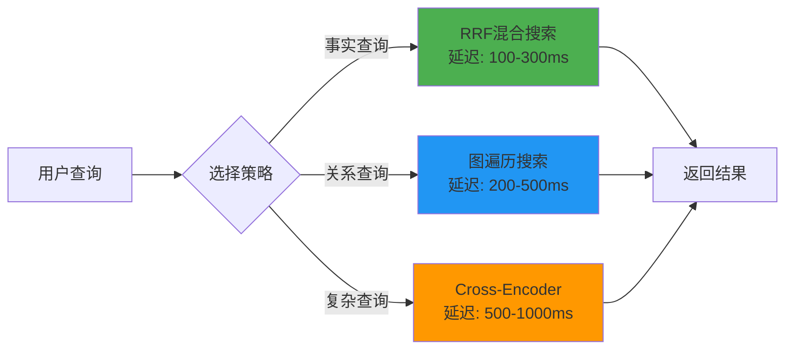
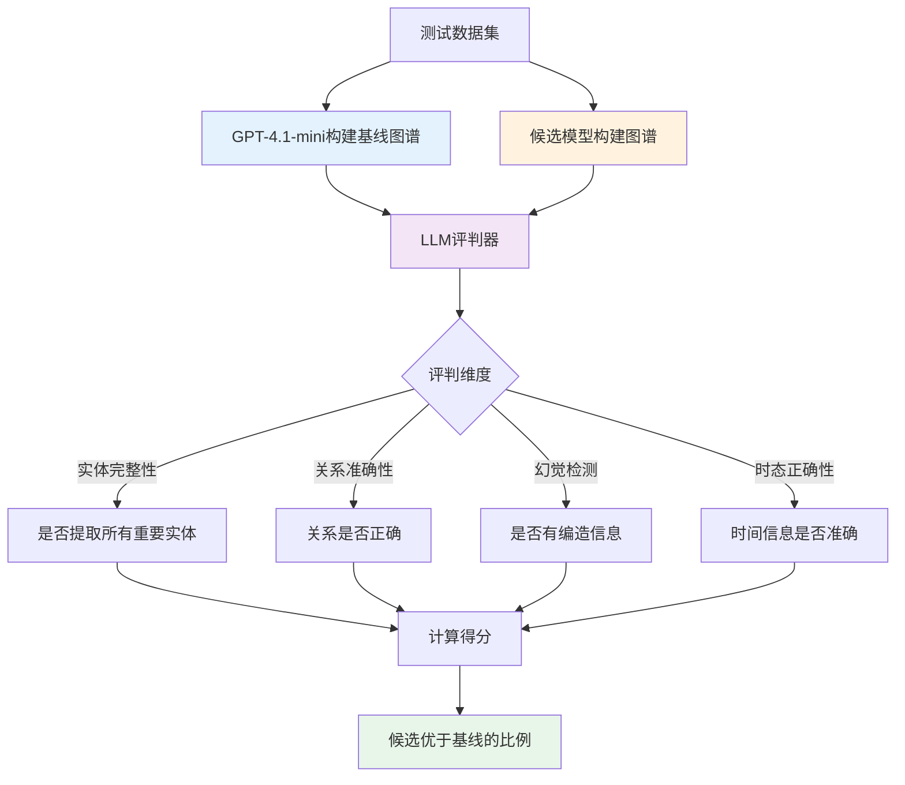
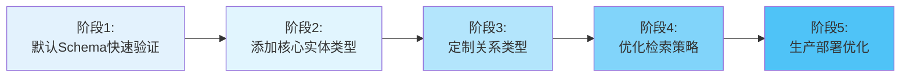

# Graphiti：面向AI智能体的时序知识图谱架构

> 论文地址：https://arxiv.org/pdf/2501.13956  
> 论文标题：ZEP：面向智能体记忆的时序知识图谱架构  
> 公司官网：https://www.getzep.com/product/agent-memory/

## 一、为什么需要Graphiti？

传统的RAG（检索增强生成）系统在处理动态变化的数据时遇到了瓶颈。想象一下，当用户说"我喜欢Adidas鞋子"，几天后又说"我的鞋子坏了，准备买Nike"，传统系统很难准确追踪这种偏好变化。它们依赖批处理和静态摘要，无法实时更新知识，也难以回答"上个月我最喜欢哪个品牌？"这类历史查询。

**Graphiti应运而生**，它是一个专为AI智能体设计的时序知识图谱框架，解决了动态环境中的知识管理问题。核心突破在于：

- **实时增量更新**：新对话立即融入图谱，无需重新计算整个图
- **双时态追踪**：同时记录"事件何时发生"和"系统何时知道"，支持时光旅行查询
- **混合检索**：结合向量语义、BM25关键词和图遍历，查询延迟降至亚秒级
- **灵活Schema**：从零Schema开始，随需扩展自定义实体类型



## 二、核心架构设计

Graphiti的架构由三层组成：**数据层**、**处理层**和**检索层**。



### 2.1 图数据库选择

Graphiti支持多种图数据库后端，通过统一的`GraphDriver`接口实现：

| 数据库 | 版本要求 | 适用场景 |
|--------|----------|----------|
| **Neo4j** | 5.26+ | 生产环境（默认） |
| **FalkorDB** | 1.1.2+ | 基于Redis的高性能场景 |
| **Kuzu** | 0.11.2+ | 本地开发和嵌入式应用 |
| **Amazon Neptune** | - | AWS云端大规模部署 |

```python
from graphiti_core import Graphiti
from graphiti_core.driver.neo4j_driver import Neo4jDriver

# Neo4j配置示例
driver = Neo4jDriver(
    uri="bolt://localhost:7687",
    user="neo4j", 
    password="password",
    database="agent_memory"
)
graphiti = Graphiti(graph_driver=driver)
```

## 三、双时态数据模型：时光旅行的秘密

传统系统只记录"当前状态"，而Graphiti引入**双时态模型**，分别追踪两个时间维度：

### 3.1 两个时间维度



**1. Valid Time（有效时间）** - 事实在现实世界中为真的时间
- `valid_at`：关系建立的时间点
- `invalid_at`：关系失效的时间点

**2. Transaction Time（事务时间）** - 事实被系统记录的时间
- `created_at`：节点/边的创建时间戳

### 3.2 时间信息提取

LLM会从对话内容中智能提取时间信息，支持：
- **绝对时间**：2024年10月28日
- **相对时间**：10年前、2分钟前（基于参考时间戳计算）
- **模糊时间**：只有年份时默认为1月1日00:00:00

所有时间统一使用**ISO 8601格式**：`YYYY-MM-DDTHH:MM:SS.SSSSSSZ`

### 3.3 矛盾处理机制

当系统检测到矛盾信息时，不是简单删除旧数据，而是通过`invalid_at`字段标记失效：

```
时间T1: Edge(fact="Robbie只穿Adidas鞋", valid_at=T1, invalid_at=null)
时间T2: 新事实"Robbie准备穿Nike"
结果:
  - 旧边: Edge(fact="Robbie只穿Adidas鞋", valid_at=T1, invalid_at=T2)
  - 新边: Edge(fact="Robbie准备穿Nike", valid_at=T2, invalid_at=null)
```

这种设计让知识图谱拥有"记忆"——既知道当前状态，也保留完整历史。

## 四、Schema设计：从零到定制

Graphiti采用**渐进式Schema**策略，无需预先定义复杂的本体结构。

### 4.1 默认Schema：开箱即用

系统使用通用的`Entity`节点和`EntityEdge`关系，适合快速启动：

```python
await graphiti.add_episode(
    name="user_chat",
    episode_body="John在TechCorp工作，负责软件开发",
    reference_time=datetime.now()
)
```

### 4.2 自定义实体类型

当需要结构化属性时，通过Pydantic模型定义：

```python
from pydantic import BaseModel, Field

class Person(BaseModel):
    """人物实体"""
    age: int | None = Field(None, description="年龄")
    occupation: str | None = Field(None, description="职业")

class Organization(BaseModel):
    """组织实体"""
    industry: str | None = Field(None, description="所属行业")

entity_types = {
    "Person": Person,
    "Organization": Organization
}

await graphiti.add_episode(
    name="meeting",
    episode_body="John，30岁，在TechCorp工作，该公司属于软件行业",
    entity_types=entity_types
)
```

### 4.3 自定义关系类型

通过`edge_type_map`定义实体对之间允许的关系：

```python
edge_types = {
    "WORKS_AT": WorksAtRelation,
    "MANAGES": ManagesRelation
}

edge_type_map = {
    ("Person", "Organization"): ["WORKS_AT"],
    ("Person", "Person"): ["MANAGES"]
}
```

这些类型信息会传递给LLM，指导其提取符合业务逻辑的关系。

## 五、图谱构建：两阶段提取策略

Graphiti采用**先实体后关系**的两阶段提取，避免指代歧义。



### 5.1 阶段1：实体提取



**关键步骤**：
1. **LLM提取** - 调用`extract_nodes()`从Episode内容中识别实体
2. **Reflexion机制** - 通过`MAX_REFLEXION_ITERATIONS`次迭代（最多2次）检查是否遗漏
3. **去重解析** - 使用嵌入相似度（阈值0.8）+ LLM判断识别重复实体
4. **属性提取** - 为自定义实体类型填充结构化属性

### 5.2 阶段2：关系提取



```python
# 关系提取Prompt的核心约束
"""
只提取满足以下条件的关系：
1. 主体和客体都必须来自已识别的ENTITIES列表
2. 必须涉及两个**不同**的实体
3. 关系类型使用SCREAMING_SNAKE_CASE格式（如WORKS_AT）
4. 不得编造或推断时间信息
5. fact_text应直接引用或紧密释义原文
"""
```

**为什么是两阶段？**
- **降低认知负担**：实体作为"锚点"先被识别，关系提取时可引用明确的实体ID
- **避免指代不清**：确保"他"、"那家公司"等代词已被解析为具体实体
- **提高准确性**：分而治之，每个阶段专注单一任务

### 5.3 并发控制

系统通过环境变量`SEMAPHORE_LIMIT`（默认10）控制并发数，防止触发LLM的速率限制。在MCP服务器中，使用队列机制确保同一`group_id`的Episode按顺序处理，避免竞态条件。

## 六、混合检索：三管齐下的RAG增强

Graphiti的检索系统结合三种互补方法，实现亚秒级查询。

### 6.1 三种检索方法

| 方法 | 实现 | 索引 | 擅长场景 |
|------|------|------|----------|
| **BM25全文检索** | `edge_fulltext_search()` | `edge_name_and_fact`全文索引 | 关键词精确匹配 |
| **向量相似度** | `edge_similarity_search()` | `fact_embedding`向量索引 | 语义相似查询 |
| **图遍历BFS** | `edge_bfs_search()` | 图结构遍历 | 关系链路查询 |

### 6.2 预配置搜索策略

**策略1：基础混合搜索（RRF融合）**

```python
from graphiti_core.search.search_config_recipes import EDGE_HYBRID_SEARCH_RRF

results = await graphiti.search(
    query="John的工作信息",
    config=EDGE_HYBRID_SEARCH_RRF,
    group_ids=["user_123"]
)
```

RRF（倒数排名融合）算法合并BM25和向量搜索结果，平衡关键词和语义匹配。

**策略2：图遍历增强搜索**

```python
from graphiti_core.search.search_config_recipes import EDGE_HYBRID_SEARCH_NODE_DISTANCE

results = await graphiti.search(
    query="与John相关的所有信息",
    config=EDGE_HYBRID_SEARCH_NODE_DISTANCE,
    center_node_uuid="john_uuid"  # 以John为中心
)
```

从中心节点出发进行BFS遍历，根据图距离调整结果排序，发现隐藏的关联关系。

**策略3：Cross-Encoder深度重排序**

```python
from graphiti_core.search.search_config_recipes import COMBINED_HYBRID_SEARCH_CROSS_ENCODER

results = await graphiti.search(
    query="John的职业发展路径",
    config=COMBINED_HYBRID_SEARCH_CROSS_ENCODER
)
```

使用LLM对初步结果进行深度语义重排序，适合复杂查询。

### 6.3 Prompt拼装示例

```python
# 1. 检索相关事实
edges = await graphiti.search(
    query="用户的饮食偏好",
    num_results=10
)

# 2. 格式化为上下文
context = "\n".join([
    f"- {edge.fact} (时间: {edge.valid_at})"
    for edge in edges
])

# 3. 拼装RAG Prompt
prompt = f"""
基于以下知识图谱中的事实回答问题：

<FACTS>
{context}
</FACTS>

<QUESTION>
{user_question}
</QUESTION>

请基于FACTS中的信息回答，不要编造内容。如果信息不足，请明确说明。
"""
```

### 6.4 检索性能对比



与传统GraphRAG的数秒到数十秒相比，Graphiti的查询延迟通常在**亚秒级**。

## 七、质量评估：LLM-as-Judge

Graphiti使用**LLM作为评判者**的方法评估图谱构建质量。

### 7.1 评估流程



### 7.2 评估Prompt示例

```python
"""
给定PREVIOUS MESSAGES和MESSAGE，判断CANDIDATE图谱提取是否优于BASELINE。

评判标准：
1. 实体提取的完整性（召回率）
2. 关系提取的准确性（精确率）
3. 是否存在幻觉或遗漏
4. 整体质量对比

如果CANDIDATE更好或质量相近，返回True；否则返回False。
"""
```

### 7.3 隐含评估指标

虽然没有明确的量化指标，但评估隐含考虑：
- **召回率**：是否提取了所有重要实体和关系
- **准确率**：提取的信息是否正确
- **一致性**：跨Episode的实体去重是否准确
- **时态正确性**：时间信息提取是否准确

**局限性**：LLM-as-Judge方法可能存在评判偏差，建议结合人工抽样验证。

## 八、Graphiti vs GraphRAG：核心差异

| 维度 | GraphRAG | Graphiti |
|------|----------|----------|
| **主要用途** | 静态文档摘要 | 动态数据管理 |
| **数据处理** | 批处理 | 连续增量更新 |
| **知识结构** | 实体集群+社区摘要 | 情节数据+语义实体+社区 |
| **检索方法** | 顺序LLM摘要 | 混合语义+关键词+图搜索 |
| **适应性** | 低 | 高 |
| **时态处理** | 基础时间戳 | 双时态显式追踪 |
| **矛盾处理** | LLM驱动的摘要判断 | 时态边失效 |
| **查询延迟** | 数秒到数十秒 | 通常亚秒级 |
| **自定义实体** | 否 | 是，灵活定制 |
| **可扩展性** | 中等 | 高，优化大规模数据集 |

**适用场景**：
- **GraphRAG**：适合对静态文档集合进行一次性分析和摘要
- **Graphiti**：适合需要实时交互、精确历史查询的AI智能体应用

## 九、实战建议

### 9.1 渐进式开发路径



### 9.2 检索策略选择指南

| 查询类型 | 推荐策略 | 原因 |
|---------|---------|------|
| 简单事实查询 | `EDGE_HYBRID_SEARCH_RRF` | 平衡速度和准确性 |
| 关系链查询 | `EDGE_HYBRID_SEARCH_NODE_DISTANCE` | 利用图结构发现关联 |
| 复杂语义查询 | `COMBINED_HYBRID_SEARCH_CROSS_ENCODER` | 深度语义理解 |
| 时间范围查询 | 使用`SearchFilters`时间过滤 | 精确时态查询 |

### 9.3 性能优化要点

1. **并发控制**：根据LLM提供商的速率限制调整`SEMAPHORE_LIMIT`
2. **批量处理**：对历史数据使用批量摄入，降低延迟
3. **索引优化**：确保Neo4j的向量索引和全文索引正确构建
4. **嵌入模型选择**：根据业务场景选择合适的嵌入模型（平衡精度和速度）

## 十、总结

Graphiti将静态的批处理知识图谱转变为能够**实时演化的动态记忆系统**，特别适合AI智能体在动态环境中的应用场景。

**核心创新点**：
1. **实时增量更新** - 告别批处理，新对话即刻融入
2. **双时态模型** - 记住历史，回答"过去时"问题
3. **两阶段提取** - 先实体后关系，降低歧义
4. **混合检索** - 三管齐下，查询延迟降至亚秒级
5. **灵活Schema** - 从零到定制，渐进式演进

Graphiti不仅仅是一个技术框架，更是AI智能体记忆管理的新范式。它让智能体拥有了"时光旅行"的能力——既记得当前状态，也能回溯历史，在动态世界中保持连贯的上下文感知。

**开源地址**：https://github.com/getzep/graphiti-core  
**开始使用**：`pip install graphiti-core`

---

*本文基于Graphiti官方文档和论文《ZEP：面向智能体记忆的时序知识图谱架构》整理，旨在帮助开发者快速理解和应用这一创新技术。*

