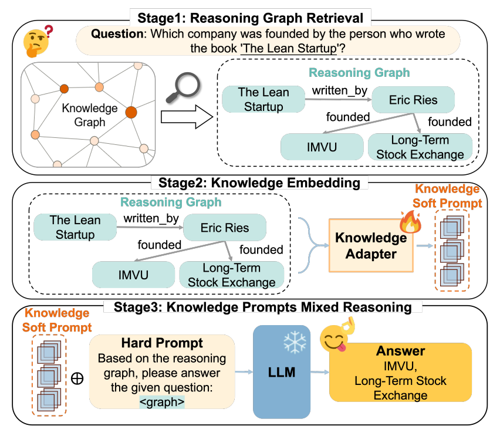
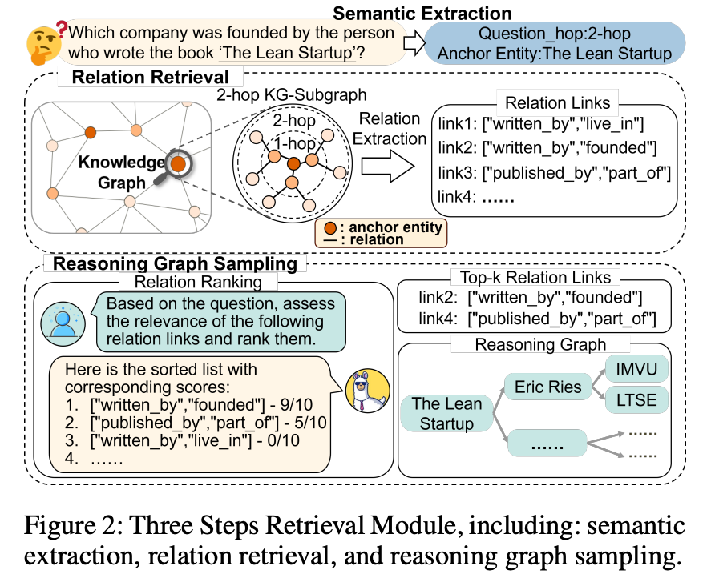
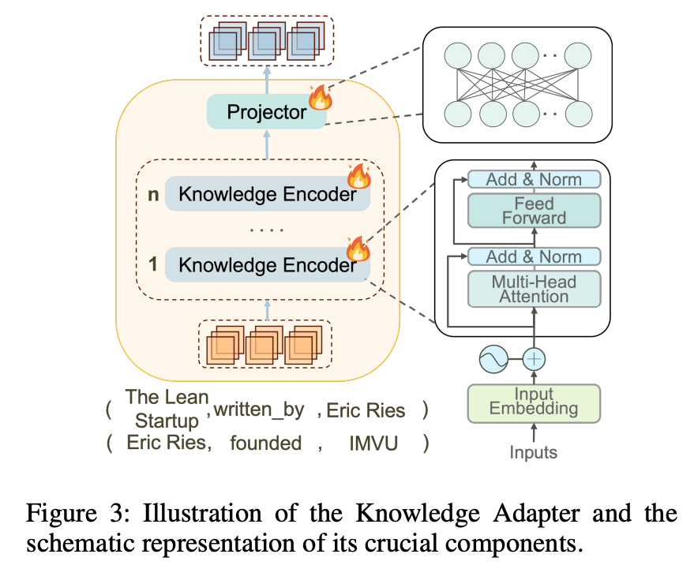

# LightPROF：轻量级知识图谱推理框架的理论与实践

## 论文核心原理

### 设计思路

LightPROF的核心价值在于**轻量化**：在知识图谱问答场景中，只训练一个小型的Knowledge Adapter（知识适配器），完全冻结大语言模型参数。这种设计规避了全模型微调的高昂成本，同时保持了较好的推理准确性。

整个系统遵循三阶段流水线：**Retrieve → Embed → Reason**。



### 阶段一：推理图检索（Reasoning Graph Retrieval）

这一阶段的目标是从庞大的知识图谱中精准提取与问题相关的子图。以问题"哪家公司由《精益创业》作者创办"为例，系统需要找到书籍→作者→公司的推理路径。



检索分三步执行：

1. **语义提取**：通过BERT模型预测所需跳数（hop count），并识别锚点实体。例如识别"The Lean Startup"为起点，预测需要2跳推理。

2. **关系检索**：以锚点实体为起点，执行约束性广度优先搜索（constrained BFS）。约束条件来自问题语义——只保留与"作者""创办"等相关的关系，过滤掉"获奖记录""出版信息"等无关路径。

3. **推理图采样**：对候选路径进行语义相关性排序，选取Top-K路径组成最终的推理子图。例如保留 `["written_by", "founded"]` 这条关系链，得分9/10；而 `["published_by", "part_of"]` 相关性低，被过滤。

输出的推理图是路径列表结构：
```python
[
    [("The_Lean_Startup", "written_by", "Eric_Ries"), 
     ("Eric_Ries", "founded", "IMVU")],
    [("Eric_Ries", "founded", "Long-Term_Stock_Exchange")]
]
```

### 阶段二：知识嵌入（Knowledge Embedding）

Knowledge Adapter负责将结构化的推理图转换为大语言模型可理解的向量表示。



处理流程包括两个核心组件：

1. **Knowledge Encoder（知识编码器）**：
   - 使用冻结的BERT将三元组文本嵌入向量空间
   - 通过MLP编码结构信息（头实体→关系→尾实体的拓扑模式）
   - 融合文本语义和图结构，输出统一的路径表示

2. **Projector（投影器）**：
   - 两层全连接网络将编码器输出投影到LLM的token空间
   - 使得知识向量能与模型输入对齐

理论上，这里生成的向量应作为 **软提示（soft prompt）** 直接注入LLM的embedding层。

### 阶段三：混合推理（Knowledge Prompts Mixed Reasoning）

最终推理阶段结合硬提示和软提示：

- **硬提示**：系统指令模板，例如"根据知识图谱三元组回答问题，不使用外部知识"
- **软提示**：Knowledge Adapter输出的向量表示

理论设计中，软提示作为可学习的embedding插入到prompt中，通过计算LLM输出logits与目标答案的交叉熵损失，反向传播只更新Adapter参数。

## 工程实现的实际情况

代码仓库的模块划分清晰：`retrieval.py`、`adapter.py`、`reasoning.py`分别对应三个阶段，工程结构值得借鉴。但实际实现与论文理论存在显著差异。

### 问题一：软提示退化为文本拼接

理论设计中，软提示应该是tensor embeddings直接注入LLM输入层。但代码实际采用了文本拼接方式：

```python
# reasoning.py 中的实现
knowledge_context = self._format_subgraph_for_prompt(subgraph)
full_prompt = f"{hard_prompt}{knowledge_context}\nUser Question: {question}\nAnswer:"
response = self.model.generate_content(full_prompt)
```

推理图被格式化成普通文本字符串后与硬提示拼接，直接作为文本发送给Gemini API。**Knowledge Adapter生成的软提示向量并未真正使用**。这是因为Google Gemini API不支持直接注入tensor embeddings，只能接受文本输入。

这种简化导致：
- Adapter的核心价值（将结构化知识转换为可学习向量）无法体现
- 图结构信息被压缩为线性文本，损失了拓扑特征
- 与论文描述的"soft prompt injection"机制完全不符

### 问题二：训练模块使用虚拟损失

`train.py`的训练流程存在致命缺陷——使用占位符损失函数：

```python
# 实际代码中的损失计算
all_fused = torch.cat(batch_fused_embeddings, dim=0)
loss = torch.sum(all_fused) / all_fused.numel()  # 仅对embeddings求均值
```

这个损失值**与目标答案完全无关**，只是对向量求平均。正确的做法应该是：

1. 将软提示注入冻结的LLM输入
2. 执行前向传播获取答案logits
3. 计算logits与目标答案的交叉熵

但由于Gemini API限制（无法获取中间logits，无法注入embeddings），当前实现无法完成真实训练。代码注释中明确承认了这一点：

> "Since we cannot directly interact with the frozen LLM (Gemini) in this manner with the current setup, we use a placeholder loss."

### 问题三：检索模块的简化实现

虽然`retrieval.py`定义了hop prediction和约束BFS的接口，但实际执行逻辑较为简略。真实场景中需要：

- 预训练hop predictor（需要标注数据）
- 实现基于关系语义的约束策略
- 优化大规模图的搜索效率

当前实现更多是概念验证，而非生产就绪的检索引擎。

## 项目落地建议

如果要将LightPROF应用于实际项目，需要解决以下核心问题：

### 1. 更换可微分的LLM后端

**必须替换掉Gemini API**，改用本地部署的开源模型（如LLaMA、Mistral、Qwen）。原因：

- 需要访问模型的embedding层以注入软提示
- 需要获取输出logits计算真实损失
- 需要可微分的前向传播路径

具体技术路径：
- 使用Transformers库加载本地模型
- 通过`model.get_input_embeddings()`获取embedding层
- 将软提示向量与tokenized question拼接后输入
- 使用`torch.nn.CrossEntropyLoss`计算答案token的预测损失

### 2. 构建真实训练数据集

代码中的`dummy_dataloader`无法支撑真实训练。需要：

- 从`data/webqsp.jsonl`等问答数据集加载真实样本
- 为每个问题预检索推理图并标注答案token IDs
- 实现数据增强（路径采样、负样本构造）

### 3. 优化检索效率

对于大规模知识图谱（百万级实体），需要：

- 将NetworkX替换为DGL或PyG（支持GPU加速）
- 引入实体/关系embedding预计算
- 使用近似最近邻搜索（如FAISS）加速语义匹配
- 实现增量索引更新机制

### 4. 工程化改造建议

**模块解耦**：
- 将检索、编码、推理三模块做成独立服务
- 支持不同LLM后端的插件化切换

**可观测性**：
- 记录每个阶段的中间结果（检索到的路径数、向量范数、推理耗时）
- 添加错误召回的可解释性分析（哪一步检索失败）

**成本控制**：
- 实现路径缓存（相同问题避免重复检索）
- 分层检索策略（先粗排后精排）

## 总结

LightPROF提出了一个优雅的理论框架：通过轻量级Adapter注入知识图谱信息，避免微调大模型。但当前代码实现受限于商业API的封闭性，核心机制（软提示注入、基于logits的损失计算）未能真正落地。

从学习角度看，这个项目的 **模块化设计和三阶段流程** 仍值得参考；从应用角度看，必须替换为开源LLM后端并重构训练逻辑，才能发挥轻量级知识增强的真正价值。对于资源受限的场景（如边缘设备、私有化部署），这种"冻结LLM + 训练小型Adapter"的范式依然具有实践意义。