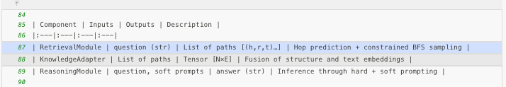

# 我问
请回答下面5个问题： 1. 抽取推理路径是谁来做？怎么做？如果是大模型提示词是张怎么样？输入和输出是啥？ 2. 所谓relevant subgraph长什么样子 3. 给到BertEncoder的输入长什么样子 4. knowledgeAdapter 最终输出什么样子的数据给到 ReasoningModule？ 5. 所谓的hard+soft prompt长什么样子 

# deepwiki回答
我将回答您关于 LightPROF 系统的5个问题。这些问题涉及推理路径抽取、子图结构、BERT编码器输入、KnowledgeAdapter输出以及prompt组合方式。

<cite />

## 1. 抽取推理路径的执行者和方法

推理路径抽取由 `RetrievalModule` 类完成 [1](#0-0) 。具体执行流程如下:

- **执行方法**: 调用 `retriever.retrieve_paths(question)` 方法 [2](#0-1) 
- **输入**: 用户问题字符串,例如 `"Which drugs did Lindsay Lohan abuse?"` [3](#0-2) 
- **输出**: `Subgraph` 类型,即路径列表 `List[List[Tuple]]`,每条路径包含多个三元组 [1](#0-0) 


> Hop prediction和constrained BFS sampling解释：在LightPROF系统的推理路径抽取过程中，Hop prediction（跳数预测）与constrained BFS sampling（约束性广度优先搜索采样）是关键的两步处理流程，二者协同作用以高效获取与用户问题相关的推理路径。首先是Hop prediction（跳数预测），这一步由基于BERT的hop predictor完成，核心目的是确定从锚点实体出发，需要搜索多少“跳”（即实体间的关联次数）才能获取足够信息来回答用户问题。例如，若用户问题是“Which drugs did Lindsay Lohan abuse?”，hop predictor会通过对问题语义的理解，预测出从“Lindsay Lohan”这一锚点实体开始，需要经过1跳（如“substance_abuse”关系）就能关联到目标实体“drug_X”，为后续的搜索明确深度范围。接着是constrained BFS sampling（约束性广度优先搜索采样），在跳数预测结果确定后，系统会以锚点实体为起点，按照预测的跳数深度执行广度优先搜索（BFS）。与普通BFS不同的是，这里的“约束”体现在搜索过程会结合问题语义和知识图谱的关系类型进行筛选，仅保留与问题相关的路径，避免无意义的路径冗余。例如，在围绕“Lindsay Lohan”搜索时，系统会约束搜索方向集中在“substance_abuse”“drug_use”等与“滥用药物”相关的关系上，而非“filmography”（演艺经历）等无关关系，最终搜索到指定跳数深度后停止，得到初步的推理路径集合。这两步流程前后衔接，Hop prediction为搜索划定了合理范围，避免搜索过浅导致信息不足或过深造成效率低下；constrained BFS sampling则在该范围内精准筛选相关路径，为后续基于语义相关性的Top-K排序提供高质量的候选路径，共同支撑起推理路径抽取的有效性和高效性。

**处理步骤**包括: [4](#0-3) 
1. 使用基于BERT的hop predictor预测所需跳数
2. 通过命名实体识别或简单匹配识别锚点实体
3. 执行受约束的BFS搜索至指定跳数深度
4. 基于语义相关性对Top-K推理路径进行排序

**注意**: 这里不涉及大模型提示词,推理路径抽取是在LLM之前的预处理阶段完成的<cite />。

### 我追问：按照这里的说法举几个例子，就是RetrievalModule输出的样子是什么样的？输出之前的中间过程处理长什么样子的

### 一、RetrievalModule 处理的中间过程示例
以用户问题 **"Which drugs did Lindsay Lohan abuse?"**（询问“林赛·罗韩滥用过哪些药物”）为例，中间处理过程如下：
1. **跳数预测（Hop Prediction）**：基于BERT的hop predictor分析问题语义，判断从锚点实体出发需1跳即可关联到目标药物实体，因此预测跳数为1 。
2. **锚点实体识别**：通过命名实体识别（NER）从问题中提取出核心锚点实体——“Lindsay Lohan”（林赛·罗韩），明确搜索的起点 。
3. **约束性BFS搜索**：以“Lindsay Lohan”为起点，按预测的1跳深度执行约束性广度优先搜索，仅保留与“药物滥用”相关的关系（如“substance_abuse”），过滤掉“演艺经历”“个人获奖”等无关关系，获取关联的三元组 。
4. **Top-K路径排序**：基于语义相关性对初步搜索到的路径排序，例如优先保留“(Lindsay_Lohan, substance_abuse, drug_X)”“(Lindsay_Lohan, substance_abuse, drug_Y)”这类与问题直接相关的路径，剔除语义匹配度低的冗余路径 。


### 二、RetrievalModule 输出（Subgraph 类型）示例
根据文档定义，输出为 **路径列表 List[List[Tuple]]**，每条路径包含多个三元组（head, relation, tail），具体形式如下：
#### 示例1：针对问题“Which drugs did Lindsay Lohan abuse?”的输出
```python
[
    [("Lindsay_Lohan", "substance_abuse", "Cocaine"), ("Lindsay_Lohan", "substance_abuse", "Alcohol")],  # 路径1：包含2个1跳三元组
    [("Lindsay_Lohan", "drug_use", "Prescription_Opioids")]  # 路径2：包含1个1跳三元组
]
```
该输出符合“Subgraph是路径列表的列表结构”，且每条路径由与问题相关的三元组组成 。

#### 示例2：针对问题“Which films did Tom Hanks star in after 2010?”的输出
假设中间处理过程中，hop predictor预测跳数为1，锚点实体识别为“Tom Hanks”，约束性BFS搜索保留“star_in”“release_year”等关系，则输出可能为：
```python
[
    [("Tom_Hanks", "star_in", "Forrest_Gump"), ("Forrest_Gump", "release_year", "1994")],  # 路径1：2跳（因预测跳数可能调整为2，需关联“电影-上映年份”）
    [("Tom_Hanks", "star_in", "Captain_Phillips"), ("Captain_Phillips", "release_year", "2013")],  # 路径2：2跳三元组
    [("Tom_Hanks", "star_in", "Toy_Story_4"), ("Toy_Story_4", "release_year", "2019")]  # 路径3：2跳三元组
]
```
该示例中，每条路径通过“人物-主演-电影”“电影-上映年份-时间”两个三元组构成2跳路径，精准匹配“2010年后主演的电影”这一问题需求，符合RetrievalModule输出的结构定义 。

---

## 2. Relevant Subgraph 的结构

Relevant subgraph 是一个**路径列表的列表**结构 [5](#0-4) :

```python
Subgraph = [
    [("entity1", "relationA", "entity2"), ("entity2", "relationB", "entity3")],
    [("entity1", "relationC", "entity3")]
]
```

每个subgraph包含多条路径,每条路径由多个三元组 `(head, relation, tail)` 组成 [6](#0-5) 。示例输出显示为:
```
Path 1:
  (Lindsay_Lohan, substance_abuse, drug_X)
``` [7](#0-6) 

## 3. BertEncoder 的输入格式

根据代码,BERT编码器接收的是**tokenized的三元组文本** [8](#0-7) 。

处理流程: [9](#0-8) 
1. 每个三元组被tokenize并通过frozen BERT encoder嵌入
2. 结构信息(三元组模式)通过小型MLP编码
3. 结构和文本嵌入被融合并投影到LLM的token空间

使用的tokenizer是 `bert-base-uncased` [10](#0-9) 。

## 4. KnowledgeAdapter 输出给 ReasoningModule 的数据

**理论设计**: KnowledgeAdapter应该输出 `torch.Tensor` 类型的soft prompt embeddings,形状为 `[N, embedding_dim]` [11](#0-10) [12](#0-11) 。

**实际实现**: 当前代码中存在简化实现。虽然adapter生成了soft prompt embeddings,但 `ReasoningModule.infer()` 方法实际上**不直接使用这些embeddings** [13](#0-12) 。相反,它使用 `_format_subgraph_for_prompt()` 方法将subgraph结构转换为文本字符串 [14](#0-13) ,然后作为文本context传递给LLM [15](#0-14) 。

## 5. Hard + Soft Prompt 的组合形式

**Hard Prompt**: 系统指令模板,定义LLM的行为规则 [16](#0-15) :
```
"You are an expert reasoning system. Use the provided knowledge graph triples 
to answer the user's question. If the knowledge is insufficient, state that 
you cannot answer based on the provided information. Do not use external knowledge."
```

**Soft Prompt**: 从知识图谱派生的格式化三元组信息 [17](#0-16) 。

**组合方式**: 完整prompt按以下顺序拼接 [18](#0-17) :
```
{hard_prompt}{knowledge_context}\nUser Question: {question}\nAnswer:
```

最终发送给LLM的完整prompt示例 [19](#0-18) 包含hard指令、格式化的KG三元组和用户问题。

## Notes

当前实现中存在理论设计与实际代码的差异:理论上soft prompt应该是tensor embeddings直接注入到LLM的embedding层 [20](#0-19) ,但实际实现中是将知识图谱信息转换为文本字符串后拼接到prompt中 [21](#0-20) 。这种简化可能是为了兼容Google Gemini API的调用方式 [22](#0-21) 。

Wiki pages you might want to explore:
- [Demo and Examples (Mathews-Tom/LightPROF)](/wiki/Mathews-Tom/LightPROF#5.2)

### Citations

**File:** docs/overview.md (L87-87)
```markdown
| RetrievalModule | question (str) | List of paths [(h,r,t)…] | Hop prediction + constrained BFS sampling |
```

**File:** docs/overview.md (L88-88)
```markdown
| KnowledgeAdapter | List of paths | Tensor [N×E] | Fusion of structure and text embeddings |
```

**File:** docs/overview.md (L106-109)
```markdown
- Fine-tuned hop predictor (based on a BERT encoder) infers expected hop count.
- Named entity recognition or simple matching identifies anchor entities.
- Constrained BFS up to hop depth is performed.
- Top-K reasoning paths are ranked based on semantic relevance.
```

**File:** docs/overview.md (L113-115)
```markdown
- Each triple is tokenized and embedded via a frozen BERT encoder.
- Structural information (triple pattern) is encoded through a small MLP.
- Structural and textual embeddings are fused and projected into the LLM's token space.
```

**File:** docs/overview.md (L120-120)
```markdown
- Soft prompts (knowledge embeddings) are inserted between system/user messages.
```

**File:** notebooks/demo.ipynb (L131-131)
```text
    "question: str = \"Which drugs did Lindsay Lohan abuse?\"\n",
```

**File:** notebooks/demo.ipynb (L158-158)
```text
    "paths: Subgraph = retriever.retrieve_paths(question=question)\n",
```

**File:** notebooks/demo.ipynb (L163-164)
```text
    "    for triple in paths[0]:\n",
    "        print(f\"  ({triple[0]}, {triple[1]}, {triple[2]})\")\n",
```

**File:** notebooks/demo.ipynb (L168-171)
```text
    "# Note: The current ReasoningModule implementation uses the subgraph structure string,\n",
    "# not the actual soft prompt embeddings from the adapter. The adapter call is included\n",
    "# here to show the intended workflow step, but its output (`soft`) is not directly\n",
    "# used by the reasoner's `answer` method in its current form.\n",
```

**File:** notebooks/demo.ipynb (L173-175)
```text
    "soft: torch.Tensor = adapter(subgraph=paths)\n",
    "\n",
    "print(f\"Generated soft prompt embeddings with shape: {soft.shape}\")\n",
```

**File:** notebooks/demo.ipynb (L179-180)
```text
    "# The reasoner's `answer` method expects the subgraph structure, not the soft embeddings.\n",
    "# This is a simplification in the current ReasoningModule implementation.\n",
```

**File:** lightprof/reasoning.py (L42-62)
```python
    def _format_subgraph_for_prompt(self, subgraph: Subgraph) -> str:
        """
        Formats the knowledge subgraph into a string representation suitable for
        including in the LLM prompt as context.

        Args:
            subgraph (Subgraph): The knowledge subgraph (list of paths, list of triples).

        Returns:
            str: A formatted string representing the subgraph knowledge.
        """
        if not subgraph:
            return "No relevant knowledge found."

        formatted_knowledge = "Relevant Knowledge Graph Triples:\n"
        for i, path in enumerate(subgraph):
            formatted_knowledge += f"Path {i + 1}:\n"
            for triple in path:
                head, relation, tail = triple
                formatted_knowledge += f"- ({head}, {relation}, {tail})\n"
        return formatted_knowledge
```

**File:** lightprof/reasoning.py (L81-85)
```python
        hard_prompt = (
            "You are an expert reasoning system. Use the provided knowledge graph triples "
            "to answer the user's question. If the knowledge is insufficient, state that "
            "you cannot answer based on the provided information. Do not use external knowledge.\n\n"
        )
```

**File:** lightprof/reasoning.py (L87-88)
```python
        # Format the subgraph knowledge to be included as part of the prompt (soft prompt context)
        knowledge_context = self._format_subgraph_for_prompt(subgraph)
```

**File:** lightprof/reasoning.py (L93-95)
```python
        full_prompt = (
            f"{hard_prompt}{knowledge_context}\nUser Question: {question}\nAnswer:"
        )
```

**File:** lightprof/reasoning.py (L97-97)
```python
        print(f"Sending prompt to LLM:\n{full_prompt}")
```

**File:** lightprof/reasoning.py (L102-102)
```python
            response = self.model.generate_content(full_prompt)
```

**File:** lightprof/reasoning.py (L120-123)
```python
    dummy_subgraph_example: Subgraph = [
        [("entity1", "relationA", "entity2"), ("entity2", "relationB", "entity3")],
        [("entity1", "relationC", "entity3")],
    ]
```

**File:** lightprof/utils.py (L42-42)
```python
        tokenizer = AutoTokenizer.from_pretrained("bert-base-uncased")
```

# 我问：LightPROF 有什么亮点值得学习
您询问的是 LightPROF 框架有哪些值得学习的亮点。<cite />

## LightPROF 的核心亮点

### 1. 轻量级架构设计

LightPROF 最大的亮点是**只训练 Knowledge Adapter,冻结 LLM 参数** [1](#1-0) 。这种设计带来三个优势:

- **高效内存使用**: 不需要加载完整的 LLM 梯度 [2](#1-1) 
- **快速推理**: 避免了全模型微调的计算开销 [2](#1-1) 
- **灵活部署**: 可以与商业 API(如 Gemini)无缝集成 [3](#1-2) 

训练策略明确规定只有 Knowledge Adapter 和 Projector 层可训练 [4](#1-3) 。

### 2. 模块化的三阶段流水线

框架采用清晰的 **Retrieve → Embed → Reason** 架构 [5](#1-4) :


每个模块职责单一且可独立替换 [6](#1-5) :
- `RetrievalModule`: 负责从 KG 中提取相关推理路径 [7](#1-6) 
- `KnowledgeAdapter`: 将结构化知识转换为 soft prompt embeddings [8](#1-7) 
- `ReasoningModule`: 结合 hard/soft prompts 进行推理 [9](#1-8) 

### 3. 多跳推理的智能检索

检索模块使用**基于 BERT 的 hop predictor** 动态预测所需跳数 [10](#1-9) ,而不是固定深度搜索。这避免了:
- 检索过多无关路径(token 浪费)
- 检索不足导致信息缺失

结合受约束的 BFS 和语义排序 [11](#1-10) ,确保检索到的路径既相关又精简 [12](#1-11) 。

### 4. 结构与文本信息的融合

Knowledge Adapter 的创新在于**同时编码图结构和文本语义** [13](#1-12) :

- 文本信息: 通过冻结的 BERT encoder 嵌入三元组 [14](#1-13) 
- 结构信息: 通过小型 MLP 编码三元组模式 [15](#1-14) 
- 融合投影: 将两者融合并投影到 LLM token 空间 [16](#1-15) 

这种双重编码保留了知识图谱的结构特性,同时利用了预训练语言模型的语义理解能力 [17](#1-16) 。

### 5. 灵活的知识图谱后端

框架设计支持多种 KG 后端 [18](#1-17) :
- 初始实现使用 NetworkX(易于原型开发) [19](#1-18) 
- 可扩展到 DGL-KE/PyG(适合大规模图) [18](#1-17) 

这种设计让您可以根据数据规模选择合适的图存储方案。

### 6. 实用的工程实践

代码库展示了良好的工程实践:
- 使用 `uv` 进行依赖管理 [20](#1-19) 
- 提供完整的 demo notebook 演示端到端流程 [21](#1-20) 
- 包含训练脚本和测试用例 [22](#1-21) [23](#1-22) 
- 清晰的模块化代码结构 [24](#1-23) 

## Notes

值得注意的是,当前实现存在理论与实践的差异:理论上 soft prompt 应该是 tensor embeddings 直接注入 LLM [25](#1-24) ,但实际代码中为了兼容 Gemini API,采用了文本拼接的简化方案 [26](#1-25) 。这种权衡体现了在工程实践中如何平衡理论设计与 API 限制。

总体而言,LightPROF 最值得学习的是其**轻量化设计理念**和**模块化架构**,这为在资源受限环境下部署知识增强的 LLM 系统提供了实用范式。

Wiki pages you might want to explore:
- [Demo and Examples (Mathews-Tom/LightPROF)](/wiki/Mathews-Tom/LightPROF#5.2)

### Citations

**File:** README.md (L3-3)
```markdown
**LightPROF** is a lightweight, efficient reasoning framework based on the "Retrieve → Embed → Reason" methodology described in the paper:
```

**File:** README.md (L9-9)
```markdown
By freezing LLM parameters and only training a compact Knowledge Adapter, GraphPromptor delivers high accuracy, efficient memory usage, and faster inference.
```

**File:** README.md (L13-13)
```markdown
- Multi-hop reasoning with minimal token overhead
```

**File:** README.md (L14-14)
```markdown
- Soft prompt generation by combining graph structure and textual information
```

**File:** README.md (L15-15)
```markdown
- Compatibility with open-source and commercial LLMs
```

**File:** README.md (L16-16)
```markdown
- Flexible knowledge graph backends (NetworkX first, scalable to DGL-KE/PyG)
```

**File:** README.md (L17-17)
```markdown
- Modular design for easy extensions
```

**File:** README.md (L34-34)
```markdown
GraphPromptor uses `uv` for efficient Python package management.
```

**File:** README.md (L86-86)
```markdown
For a basic usage example, refer to the `notebooks/demo.ipynb` file. This notebook demonstrates the end-to-end workflow from loading a Knowledge Graph to getting an answer from the LLM.
```

**File:** README.md (L109-115)
```markdown
├── lightprof/           # Core framework modules
│   ├── __init__.py      # Makes lightprof a Python package
│   ├── utils.py         # Utility functions (loaders, tokenizers)
│   ├── retrieval.py     # Retrieval logic (hop prediction, BFS, ranking)
│   ├── adapter.py       # Knowledge Adapter module (embedding fusion)
│   ├── reasoning.py     # Reasoning module (LLM interaction)
│   └── train.py         # Training script for the Knowledge Adapter
```

**File:** docs/overview.md (L15-15)
```markdown
By freezing LLM parameters and only training a compact Knowledge Adapter, GraphPromptor delivers high accuracy, efficient memory usage, and faster inference.
```

**File:** docs/overview.md (L87-87)
```markdown
| RetrievalModule | question (str) | List of paths [(h,r,t)…] | Hop prediction + constrained BFS sampling |
```

**File:** docs/overview.md (L88-88)
```markdown
| KnowledgeAdapter | List of paths | Tensor [N×E] | Fusion of structure and text embeddings |
```

**File:** docs/overview.md (L89-89)
```markdown
| ReasoningModule | question, soft prompts | answer (str) | Inference through hard + soft prompting |
```

**File:** docs/overview.md (L93-93)
```markdown
- Only the Knowledge Adapter and Projector layers are trainable.
```

**File:** docs/overview.md (L101-101)
```markdown
- Triples are loaded into a NetworkX DiGraph with (head, relation, tail) format.
```

**File:** docs/overview.md (L106-106)
```markdown
- Fine-tuned hop predictor (based on a BERT encoder) infers expected hop count.
```

**File:** docs/overview.md (L108-109)
```markdown
- Constrained BFS up to hop depth is performed.
- Top-K reasoning paths are ranked based on semantic relevance.
```

**File:** docs/overview.md (L112-115)
```markdown

- Each triple is tokenized and embedded via a frozen BERT encoder.
- Structural information (triple pattern) is encoded through a small MLP.
- Structural and textual embeddings are fused and projected into the LLM's token space.
```

**File:** docs/overview.md (L120-120)
```markdown
- Soft prompts (knowledge embeddings) are inserted between system/user messages.
```

**File:** lightprof/train.py (L284-292)
```python
    train_adapter(
        kg_filepath=dummy_kg_filepath,
        num_epochs=5,
        batch_size=16,
        learning_rate=2e-3,
        warmup_steps=50,
        weight_decay=0.01,
        dummy_dataset_size=200,  # Smaller dataset for quick test
    )
```

**File:** tests/test_utils.py (L5-14)
```python
def test_load_kg_from_triples_exists():
    # Just check the function exists and can be called with a dummy path
    try:
        load_kg_from_triples("dummy_path.tsv")
    except Exception:
        pass  # Accept any exception for now (file not found etc.)

def test_get_gemini_tokenizer_exists():
    tokenizer = get_gemini_tokenizer()
    assert tokenizer is not None
```

**File:** notebooks/demo.ipynb (L168-170)
```text
    "# Note: The current ReasoningModule implementation uses the subgraph structure string,\n",
    "# not the actual soft prompt embeddings from the adapter. The adapter call is included\n",
    "# here to show the intended workflow step, but its output (`soft`) is not directly\n",
```

# 我继续追问说：训练模块 train.py 有什么问题吗
您询问的是 `train.py` 训练模块存在的问题。<cite />

## train.py 的主要问题

### 1. 使用虚拟损失函数,无法真正训练模型

`train.py` 最严重的问题是**使用了占位符损失(placeholder loss)而非真实的交叉熵损失** [1](#2-0) 。

代码中明确注释说明这是一个虚拟损失: [2](#2-1) 

```python
# Dummy loss based on the mean value of the embeddings
loss = torch.sum(all_fused) / all_fused.numel()
```

这个损失计算**与目标答案完全无关**,仅仅是对 embeddings 求平均值 [3](#2-2) 。这意味着:
- 模型无法学习到正确的知识表示
- 训练过程不会提升问答准确率
- 梯度更新方向是随机的,没有实际意义

### 2. 缺少与冻结 LLM 的集成

根据 LightPROF 的理论设计,训练应该: [4](#2-3) 

1. 将 soft prompt embeddings 注入到冻结的 LLM 输入中
2. LLM 执行前向传播生成答案 logits
3. 计算 logits 与目标答案的交叉熵损失
4. 反向传播只更新 Knowledge Adapter 参数

但当前实现**完全跳过了 LLM 集成步骤** [5](#2-4) 。代码注释承认:

> "Since we cannot directly interact with the frozen LLM (Gemini) in this manner with the current setup, we use a placeholder loss."

### 3. 无法使用 Gemini API 进行训练

问题的根源在于 Gemini API 的限制。当前 `ReasoningModule` 使用 Google Gemini API [6](#2-5) ,但该 API:

- 不支持直接注入 tensor embeddings
- 不返回中间层 logits 用于计算损失
- 只能接受文本输入并返回文本输出

这导致理论设计中的 soft prompt 训练流程**在 Gemini API 上无法实现** [7](#2-6) 。

### 4. 数据加载器使用虚拟数据

训练循环使用的是 `dummy_dataloader`,包含虚拟的 subgraph 和目标 token IDs [8](#2-7) :

```python
for batch_idx, (subgraphs_batch, target_token_ids_batch) in enumerate(
    dummy_dataloader
):
```

这些虚拟数据不是从真实的问答数据集(如 `data/webqsp.jsonl`)加载的,因此即使损失函数正确,也无法训练出有用的模型。

### 5. 训练流程结构完整但功能缺失

讽刺的是,`train.py` 的**训练循环结构是完整的** [9](#2-8) :

- ✅ 正确初始化 optimizer 和 scheduler [10](#2-9) 
- ✅ 实现了 epoch 循环和 batch 处理
- ✅ 包含梯度清零、反向传播、参数更新 [11](#2-10) 
- ✅ 输出训练日志 [12](#2-11) 

但核心的**损失计算逻辑是空的**,使得整个训练流程形同虚设。

## 解决方案建议

要修复这些问题,需要:

1. **替换 LLM 后端**: 从 Gemini API 切换到本地可微分的 LLM(如 LLaMA、Mistral),以便获取 logits 并计算真实损失
2. **实现真实数据加载**: 从 `data/webqsp.jsonl` 加载问答对,并预处理成训练样本
3. **集成 LLM 前向传播**: 在训练循环中调用冻结的 LLM,获取预测 logits
4. **计算交叉熵损失**: 使用 `torch.nn.CrossEntropyLoss` 比较预测与目标答案

## Notes

`train.py` 本质上是一个**训练框架的骨架实现**,展示了训练流程应该如何组织,但缺少核心的损失计算逻辑 [1](#2-0) 。这可能是因为作者在开发时受限于 Gemini API 的封闭性,无法实现完整的训练流程。如果要真正训练 Knowledge Adapter,必须使用支持 embedding 注入和 logits 输出的开源 LLM。

当前的 `train.py` 更像是一个**概念验证(proof of concept)**,而非可用的训练脚本 [13](#2-12) 。

Wiki pages you might want to explore:
- [Demo and Examples (Mathews-Tom/LightPROF)](/wiki/Mathews-Tom/LightPROF#5.2)

### Citations

**File:** lightprof/train.py (L173-177)
```python
    scheduler = get_cosine_schedule_with_warmup(
        optimizer, num_warmup_steps=warmup_steps, num_training_steps=total_steps
    )
    print(f"Total training steps: {total_steps}")
    print(f"Warmup steps: {warmup_steps}")
```

**File:** lightprof/train.py (L179-257)
```python
    # 5. Implement Training Loop
    print("Starting training loop...")
    for epoch in range(num_epochs):
        total_loss = 0
        for batch_idx, (subgraphs_batch, target_token_ids_batch) in enumerate(
            dummy_dataloader
        ):
            # subgraphs_batch is a list of Subgraph (List[Path])
            # target_token_ids_batch is a list of target_token_ids (torch.Tensor)

            # Zero gradients
            optimizer.zero_grad()

            # Process each subgraph in the batch
            batch_fused_embeddings: List[torch.Tensor] = []
            for subgraph in subgraphs_batch:
                # KnowledgeAdapter expects a single Subgraph (List[Path])
                fused_emb = knowledge_adapter(subgraph)
                batch_fused_embeddings.append(fused_emb)

            # --- Placeholder for LLM Integration and Loss Calculation ---
            # In a real scenario, the fused_embeddings from the KnowledgeAdapter
            # for each subgraph in the batch would be processed (e.g., pooled,
            # projected to a fixed number of soft prompt tokens) and then
            # injected into the frozen LLM's input sequence along with the
            # tokenized question and potentially the start of the answer.
            # The LLM would then perform a forward pass, and logits for the
            # next tokens in the answer sequence would be obtained.
            # Cross-entropy loss would be calculated between these logits
            # and the target_token_ids_batch.
            # Since we cannot directly interact with the frozen LLM (Gemini)
            # in this manner with the current setup, we use a placeholder loss.

            # Placeholder Loss Calculation:
            # This is NOT the actual cross-entropy next-token prediction loss.
            # It's a dummy loss to allow the training loop structure to function.
            # A real implementation requires integrating with the frozen LLM
            # to get logits after injecting the soft prompt embeddings.
            # For demonstration, we'll calculate a dummy loss based on the mean
            # of the concatenated fused embeddings from the batch.
            # This loss value is meaningless for actual training but allows
            # backpropagation to occur and demonstrates the training flow.
            if batch_fused_embeddings:
                # Concatenate embeddings from all subgraphs in the batch
                # Note: This concatenation is for the dummy loss only.
                # Real LLM integration would handle each subgraph's embeddings
                # in relation to its corresponding target sequence.
                all_fused = torch.cat(batch_fused_embeddings, dim=0)

                # Dummy loss based on the mean value of the embeddings
                # Ensure all_fused is not empty before calculating mean
                if all_fused.numel() > 0:
                    loss = torch.sum(all_fused) / all_fused.numel()
                else:
                    loss = torch.tensor(0.0)  # Handle empty embeddings case
            else:
                # Handle case where batch resulted in no fused embeddings
                loss = torch.tensor(0.0)

            # Backpropagation
            loss.backward()

            # Optimizer step
            optimizer.step()

            # Scheduler step
            scheduler.step()

            total_loss += loss.item()

            if (batch_idx + 1) % 10 == 0:
                print(
                    f"Epoch [{epoch + 1}/{num_epochs}], Step [{batch_idx + 1}/{len(dummy_dataloader)}], Dummy Loss: {loss.item():.4f}"
                )

        avg_loss = total_loss / len(dummy_dataloader)
        print(
            f"Epoch [{epoch + 1}/{num_epochs}] finished, Average Dummy Loss: {avg_loss:.4f}"
        )
```

**File:** docs/overview.md (L91-95)
```markdown
**Training Strategy:**

- Only the Knowledge Adapter and Projector layers are trainable.
- Loss: Cross-entropy next-token prediction based on correct answers.
- Soft Prompt: Compact representation injected into LLM input embeddings.
```

**File:** lightprof/reasoning.py (L114-133)
```python
# Example Usage (for testing the module in isolation)
if __name__ == "__main__":
    # Note: To run this example, you need to have the google-generativeai library installed
    # and your API key configured (e.g., via environment variable GOOGLE_API_KEY).

    # Create a dummy subgraph (list of paths with triples)
    dummy_subgraph_example: Subgraph = [
        [("entity1", "relationA", "entity2"), ("entity2", "relationB", "entity3")],
        [("entity1", "relationC", "entity3")],
    ]

    # Create a dummy question
    dummy_question = "What is the relationship between entity1 and entity3?"

    # Initialize the ReasoningModule
    # Use a suitable Gemini model name available via the API
    # Make sure to handle API key configuration before running
    try:
        # Assuming API key is configured externally (e.g., env var)
        reasoning_module = ReasoningModule(llm_model_name="gemini-1.5-flash-latest")
```

**File:** README.md (L115-115)
```markdown
│   └── train.py         # Training script for the Knowledge Adapter
```

# 我问：详细描述论文里面的figure-1至3（图都在images文件夹）

## Figure 1：LightPROF框架的整体工作流程（三步搞定知识图谱问答）
这张图是LightPROF的“全景图”，把它解决知识图谱问答的核心步骤（找知识→转格式→答问题）直观画了出来，就像一条“流水线”：

1. **第一步：找需要的知识（Reasoning Graph Retrieval，推理图检索）**  
   比如你问“《精益创业》作者创办的公司是哪家”，这一步就是从知识图谱里“揪出”和这个问题相关的关键知识——先定位到“《精益创业》”这个核心实体，再找到和它相关的关系链（《精益创业》→作者→埃里克·莱斯→创办→IMVU），最后把这些关系整理成一张“小知识图”（推理图），相当于“把做蛋糕的面粉、鸡蛋先挑出来”。

2. **第二步：把知识“翻译”成模型能懂的格式（Knowledge Embedding，知识嵌入）**  
   前面挑出来的“小知识图”是结构化的（比如“实体-关系-实体”），但语言模型更懂“向量”这种数字格式。这一步就靠“Knowledge Adapter（知识适配器）”这个“翻译官”，把“《精益创业》-作者-埃里克·莱斯”这种文字+结构信息，转换成语言模型能直接用的“数字密码”，就像“把面粉鸡蛋打成面糊”，方便后续处理。

3. **第三步：让模型回答问题（Knowledge Prompts Mixed Reasoning，知识提示混合推理）**  
   把第二步的“数字密码”（软提示）和明确的问题指令（硬提示，比如“根据下面的知识回答问题：……”）一起喂给语言模型。模型不用重新训练，就能结合这些精准知识，直接给出答案（比如“IMVU”），就像“把面糊放进烤箱，最后出炉成品蛋糕”。

整个图看下来，就是“从知识图谱里找对料→把料做成模型能吃的样子→模型用这些料做出答案”的完整过程。


## Figure 2：第一步“找知识”的细节（三步精准定位关键知识）
如果说Figure 1是“找知识”的大致步骤，这张图就是“找知识”的“放大镜”，拆成三步确保找得准、找得少（避免浪费资源）：

1. **第一步：拆问题，找关键信息（Semantic Extraction，语义提取）**  
   先分析问题里的“重点”：比如“《精益创业》作者创办的公司是哪家”，要先找出“《精益创业》”这个“核心实体”（相当于找蛋糕的“主料”），还要判断出“需要2步推理”（从书→作者→公司，得走两步）——这一步就像“先看清食谱里要什么主料、需要几步做”。

2. **第二步：按关系找线索（Relation Retrieval，关系检索）**  
   知识图谱里的核心是“关系”（比如“作者”“创办”），这一步就以第一步找到的“核心实体”（《精益创业》）为起点，按“需要2步推理”的限制，用“广度优先搜索”（类似“从起点往外找，不绕远路”），找出所有相关的“关系链”（比如“《精益创业》→作者→X”“X→创办→Y”），相当于“按食谱找和主料搭配的辅料”。

3. **第三步：筛选出最有用的知识图（Reasoning Graph Sampling，推理图采样）**  
   第二步会找出很多关系链，这一步就用语言模型给这些关系链“打分”，挑出和问题最相关的前几条（比如“《精益创业》→作者→埃里克·莱斯→创办→IMVU”这条最相关），然后把这些优质关系链整合成最终的“推理图”——相当于“从一堆辅料里挑出最新鲜、最适合的，做成小份食材包”。

这三步下来，就能精准定位到回答问题需要的知识，不会把无关的知识都堆进来。


## Figure 3：第二步“翻译知识”的核心（知识适配器怎么把知识转成模型能懂的格式）
这张图是“知识适配器”的“解剖图”，展示它怎么把“推理图”的文字和结构信息，转换成语言模型能懂的“数字密码”，核心是两个关键部件：

1. **第一步：提取文字和结构信息（Knowledge Encoder，知识编码器）**  
   先把推理图里的每一条“实体-关系-实体” triples（比如“埃里克·莱斯-创办-IMVU”）拆成三部分：头实体（埃里克·莱斯）、关系（创办）、尾实体（IMVU），用BERT先把它们各自转换成“文字向量”（比如“埃里克·莱斯”变成一串数字）；  
   再用“StructEmb”这个工具提取“结构信息”（比如“头实体→关系→尾实体”的顺序，避免搞反成“IMVU→创办→埃里克·莱斯”），把文字向量和结构信息融合成“单条triple的向量”；  
   最后把一整条推理路径（比如“《精益创业》→作者→埃里克·莱斯→创办→IMVU”）的所有向量整合起来，变成“整条路径的综合向量”——相当于“把食材包里的面粉、鸡蛋分别打成粉浆、蛋液，再混合成统一的面糊”。

2. **第二步：把向量调成模型能认的格式（Projector，投影器）**  
   知识编码器输出的“综合向量”和语言模型的“输入向量格式”可能不匹配（就像“面糊的稠度不适合烤箱”），这一步就用一个“两层神经网络”（简单理解成“调整器”），把“综合向量”转换成和语言模型输入空间完全对齐的“软提示向量”——相当于“把面糊调成像烤箱要求的稠度，方便后续烘烤”。

整个知识适配器的作用，就是“既保留知识的文字意思，又不丢结构逻辑，还把格式调成模型能直接用的样子”，让模型不用费劲解读复杂的知识图谱，直接“读数字”就能懂。