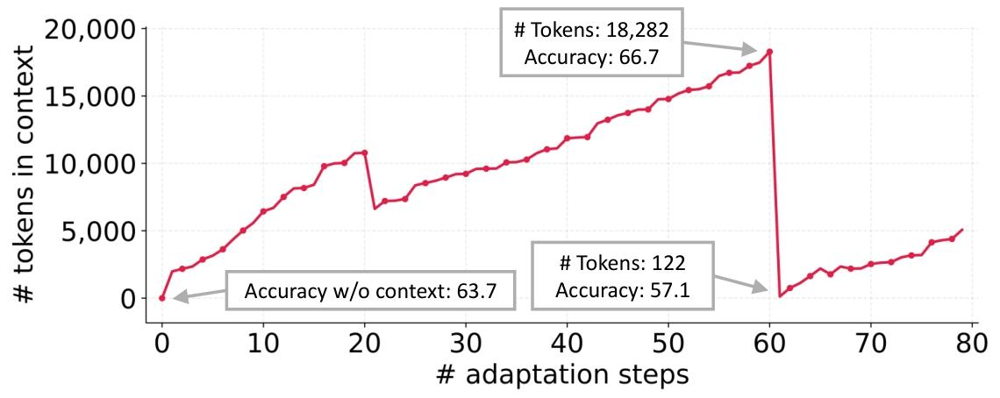
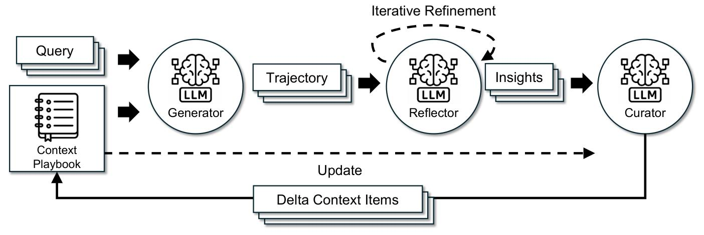
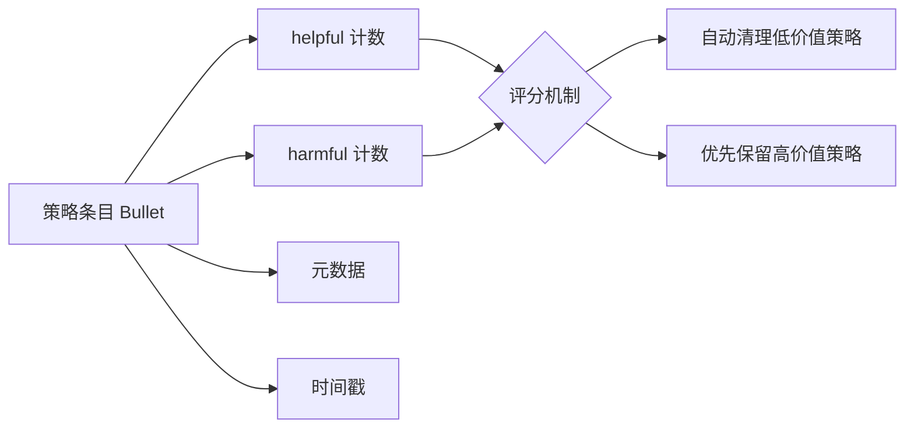
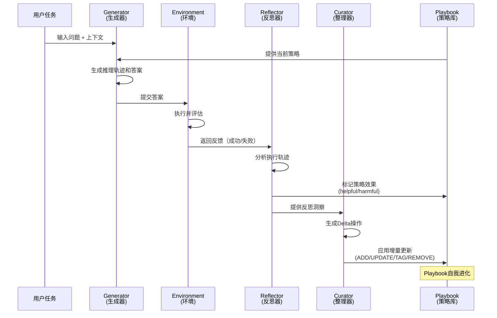
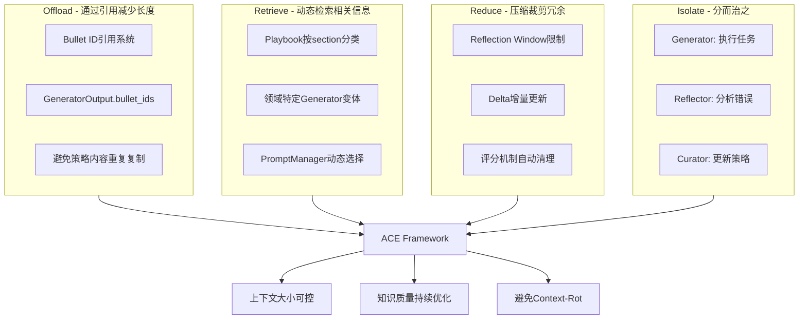
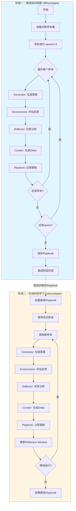
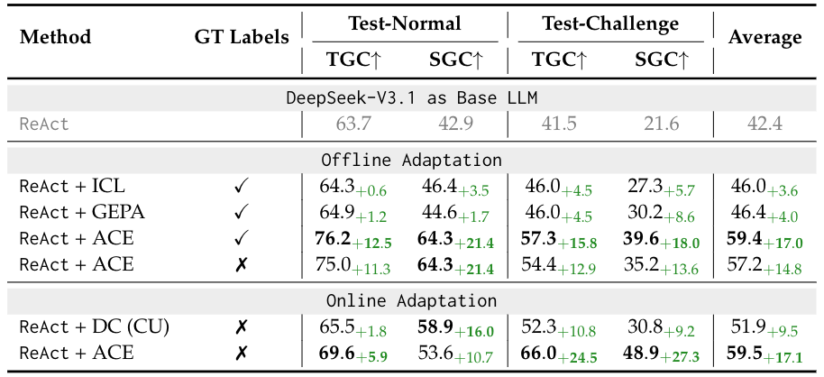
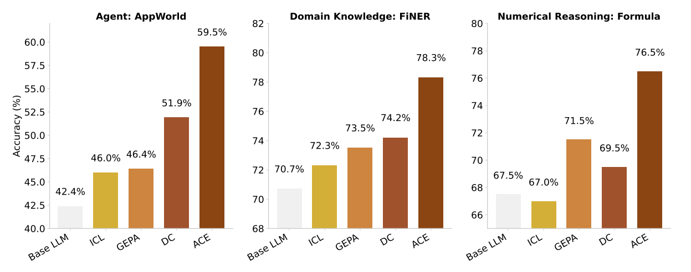
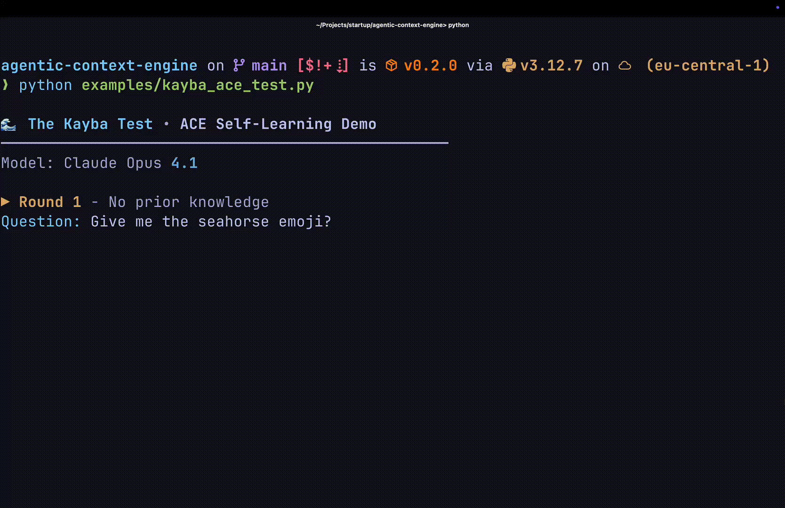

# ACE：让大模型"会学习"的上下文工程框架

> 论文来源：《Agentic Context Engineering: Evolving Contexts for Self-Improving Language Models》  
> 机构：斯坦福大学、UC Berkeley、SambaNova Systems  
> arXiv: 2510.04618


## 一、为什么我们需要上下文工程？

当我们构建AI Agent时，常常遇到这样的困境：模型在处理第一个任务时表现尚可，但随着任务累积，要么上下文窗口被撑爆，要么关键信息被"淹没"在冗长的历史记录中。这就是 **上下文腐蚀（Context-Rot）** 问题——随着上下文长度增加，模型的注意力机制出现"腐蚀"，导致对关键信息的关注度急剧下降。

传统的解决方案无外乎两种：
1. **整体重写上下文**：用LLM定期总结和压缩历史信息
2. **静态知识库**：提前准备好提示词和示例，运行时不再调整

但这两种方案都有致命缺陷。

## 二、传统方法的困境：上下文崩溃

来看一个真实的实验数据：



这张图清晰地展示了 **上下文崩溃（Context Collapse）** 现象：当使用传统的"整体重写"方法时，上下文长度从18,282个token突然骤降到122个token，模型的正确率也从66.7%暴跌至57.1%，甚至低于完全不做适配时的63.7%。

为什么会这样？因为传统方法存在两大痛点：

1. **简洁性偏差（Brevity Bias）**：LLM在重写提示词时，倾向于"越简越好"，导致专业细节和关键策略被大量删除
2. **全量重写的不可控性**：每次重写都是"推倒重来"，无法保证之前积累的有效知识被保留

这就像让一个学生每次考试后都把错题本完全重写一遍，结果越写越简单，最后只剩下"要细心"这种无用的空话。

## 三、ACE框架：增量式上下文演化

斯坦福和UC Berkeley的研究者提出了一个全新的思路：**不要重写，而是增量更新**。这就是**ACE（Agentic Context Engine）框架**的核心思想。



ACE的设计哲学是"知识蒸馏"而非"历史记录"——不试图保留所有上下文，而是从经验中提取可复用的策略模式。核心机制包括：

### 3.1 动态Playbook机制

ACE使用`Playbook`作为"活文档"存储策略知识。这不是普通的知识库，而是一个会"自我进化"的策略仓库：



每个策略条目（Bullet）都带有：
- **策略内容**：具体的操作指导
- **helpful/harmful计数器**：记录这个策略在历史任务中的表现
- **独立ID**：通过引用而非复制来减少上下文长度
- **元数据**：所属领域、创建时间等

### 3.2 增量更新操作

不同于传统的"全量重写"，ACE通过四种轻量级的**Delta操作**更新Playbook：

| 操作类型 | 作用 | 示例场景 |
|---------|------|---------|
| **ADD** | 添加新策略 | 发现新的有效API调用模式 |
| **UPDATE** | 修改现有策略 | 优化数据提取的正则表达式 |
| **TAG** | 更新计数器 | 标记某策略在本次任务中helpful |
| **REMOVE** | 删除无效策略 | 清理累积过多harmful的条目 |

这种增量方式确保：
- ✅ **不会丢失有价值的知识**：只修改需要变化的部分
- ✅ **上下文大小可控**：通过评分机制自动清理低价值条目
- ✅ **完全可追溯**：每次更新都有明确的操作记录

## 四、三角色协同：分工明确的学习机制

ACE最巧妙的设计是将学习过程分解为三个专门角色，每个角色职责清晰且相互配合：



### 4.1 Generator（生成器）- 执行层

**职责**：使用当前Playbook中的策略执行任务，生成推理轨迹和最终答案。

代码核心结构：
```python
@dataclass
class GeneratorOutput:
    reasoning: str          # 推理过程
    final_answer: str       # 最终答案
    bullet_ids: List[str]   # 使用了哪些策略（通过ID引用）
    raw: Dict[str, Any]     # 原始输出

class Generator:
    def generate(
        self, 
        question: str,
        context: str,
        playbook: Playbook,
        reflection: str
    ) -> GeneratorOutput:
        # 1. 构建提示词（注入Playbook策略）
        prompt = self.prompt_template.format(
            playbook=playbook.as_prompt(),  # 只注入相关策略
            reflection=reflection,           # 最近的反思历史
            question=question,
            context=context
        )
        
        # 2. 调用LLM生成
        response = self.llm.complete(prompt)
        
        # 3. 解析结构化输出
        data = json.loads(response.text)
        return GeneratorOutput(
            reasoning=data["reasoning"],
            final_answer=data["final_answer"],
            bullet_ids=data["bullet_ids"],  # 记录使用了哪些策略
            raw=data
        )
```

**关键设计**：
- 通过`bullet_ids`引用策略而非复制内容（**Offload**机制）
- 只注入相关领域的策略（**Retrieve**机制）
- 支持领域特定的Prompt变体（数学、代码等）

### 4.2 Reflector（反思器）- 分析层

**职责**：分析Generator的输出和环境反馈，标记哪些策略有帮助、哪些有害。

```python
@dataclass
class BulletTag:
    id: str                 # 策略ID
    tag: str                # "helpful" / "harmful" / "neutral"
    reasoning: str          # 为什么这样标记

@dataclass
class ReflectorOutput:
    reasoning: str          # 反思分析
    error_identification: str  # 错误识别
    bullet_tags: List[BulletTag]  # 策略标记
    raw: Dict[str, Any]

class Reflector:
    def reflect(
        self,
        question: str,
        generator_output: GeneratorOutput,
        playbook: Playbook,
        ground_truth: str,
        feedback: str,
        max_refinement_rounds: int = 1
    ) -> ReflectorOutput:
        # 构建反思提示词
        prompt = self.prompt_template.format(
            question=question,
            generator_output=generator_output.reasoning,
            playbook_bullets=self._format_bullets(generator_output.bullet_ids),
            feedback=feedback,
            ground_truth=ground_truth
        )
        
        # 调用LLM分析
        response = self.llm.complete(prompt)
        data = json.loads(response.text)
        
        # 解析策略标记
        bullet_tags = [
            BulletTag(
                id=tag["id"],
                tag=tag["tag"],
                reasoning=tag.get("reasoning", "")
            )
            for tag in data["bullet_tags"]
        ]
        
        return ReflectorOutput(
            reasoning=data["reasoning"],
            error_identification=data["error_identification"],
            bullet_tags=bullet_tags,
            raw=data
        )
```

**关键能力**：
- 从成功和失败中提炼具体的洞察
- 支持多轮迭代优化反思质量
- 精准定位有效/无效的策略

### 4.3 Curator（整理器）- 整合层

**职责**：将Reflector的洞察转化为具体的Playbook更新操作。

```python
@dataclass
class DeltaOperation:
    type: str               # "ADD" / "UPDATE" / "TAG" / "REMOVE"
    bullet_id: Optional[str]
    section: Optional[str]  # 策略所属领域
    content: Optional[str]  # 新策略内容
    metadata: Dict[str, Any]

@dataclass
class DeltaBatch:
    operations: List[DeltaOperation]

class Curator:
    def curate(
        self,
        reflection: ReflectorOutput,
        playbook: Playbook,
        question_context: str,
        progress: str
    ) -> CuratorOutput:
        # 构建整理提示词
        prompt = self.prompt_template.format(
            reflection=reflection.reasoning,
            current_playbook=playbook.as_prompt(),
            question_context=question_context,
            progress=progress
        )
        
        # 调用LLM生成Delta操作
        response = self.llm.complete(prompt)
        data = json.loads(response.text)
        
        # 解析为DeltaBatch
        delta = DeltaBatch.from_json(data)
        
        return CuratorOutput(delta=delta, raw=data)
```

**核心优势**：
- 增量更新而非全量重写（**Reduce**机制）
- 支持多条目并行合并，提升大规模适配效率
- 通过确定性逻辑合并，避免不可控的重写

## 五、上下文工程的七大组成在ACE中的体现

完整的上下文工程系统包含七个核心部分，ACE框架对每一个都有优雅的实现：

| 组成部分 | ACE中的实现 | 代码位置 |
|---------|------------|---------|
| **1. 系统提示词** | 为Generator/Reflector/Curator提供专门的Prompt模板，支持领域特定变体 | `ace/prompts_v2.py` |
| **2. 用户提示词** | 通过`Sample.question`传递用户任务 | `Sample`类 |
| **3. 短期记忆** | Reflection Window机制，保留最近N次反思（默认3次） | `_recent_reflections` |
| **4. 长期记忆** | Playbook持久化存储策略，带helpful/harmful计数器 | `Playbook`类 |
| **5. 检索信息(RAG)** | 通过`Sample.context`注入外部信息，Playbook按section分类检索 | `context`字段 |
| **6. 可用工具** | 通过`TaskEnvironment`抽象类封装工具调用 | `TaskEnvironment` |
| **7. 结构化输出** | 强制JSON格式，包含reasoning、bullet_ids、confidence等字段 | `Output`类 |

### 5.1 短期记忆：Reflection Window机制

ACE通过固定窗口维护短期记忆，避免历史反思无限累积：

```python
class AdapterBase:
    def __init__(self, reflection_window: int = 3):
        self.reflection_window = reflection_window
        self._recent_reflections: List[str] = []
    
    def _update_recent_reflections(self, reflection: ReflectorOutput):
        # 序列化当前反思
        serialized = json.dumps(reflection.raw, ensure_ascii=False)
        self._recent_reflections.append(serialized)
        
        # 保持窗口大小固定（Reduce机制）
        if len(self._recent_reflections) > self.reflection_window:
            self._recent_reflections = self._recent_reflections[-self.reflection_window:]
    
    def _reflection_context(self) -> str:
        return "\n---\n".join(self._recent_reflections)
```

**效果**：即使处理10,000个任务，短期记忆也只保存最近3次反思，上下文长度始终可控。

### 5.2 长期记忆：Playbook的核心数据结构

```python
@dataclass
class Bullet:
    id: str
    section: str
    content: str
    helpful: int = 0
    harmful: int = 0
    metadata: Dict[str, Any] = field(default_factory=dict)
    
    def tag(self, tag: str, increment: int = 1):
        """更新策略评分"""
        if tag == "helpful":
            self.helpful += increment
        elif tag == "harmful":
            self.harmful += increment

class Playbook:
    def __init__(self):
        self._bullets: Dict[str, Bullet] = {}    # ID -> Bullet映射（Offload机制）
        self._sections: Dict[str, List[str]] = {}  # section -> [ID列表]（Retrieve机制）
        self._next_id = 0
    
    def add_bullet(self, section: str, content: str, bullet_id: Optional[str] = None):
        """添加新策略"""
        if bullet_id is None:
            bullet_id = f"b{self._next_id}"
            self._next_id += 1
        
        bullet = Bullet(id=bullet_id, section=section, content=content)
        self._bullets[bullet_id] = bullet
        
        if section not in self._sections:
            self._sections[section] = []
        self._sections[section].append(bullet_id)
    
    def tag_bullet(self, bullet_id: str, tag: str, increment: int = 1):
        """标记策略效果"""
        bullet = self._bullets.get(bullet_id)
        if bullet:
            bullet.tag(tag, increment)
    
    def remove_bullet(self, bullet_id: str):
        """删除低价值策略（Reduce机制）"""
        bullet = self._bullets.pop(bullet_id, None)
        if bullet:
            section_list = self._sections.get(bullet.section)
            if section_list:
                self._sections[bullet.section] = [
                    bid for bid in section_list if bid != bullet_id
                ]
    
    def apply_delta(self, delta: DeltaBatch):
        """应用增量更新"""
        for operation in delta.operations:
            if operation.type == "ADD":
                self.add_bullet(
                    section=operation.section,
                    content=operation.content,
                    bullet_id=operation.bullet_id
                )
            elif operation.type == "UPDATE":
                bullet = self._bullets.get(operation.bullet_id)
                if bullet:
                    bullet.content = operation.content
            elif operation.type == "TAG":
                for tag, increment in operation.metadata.items():
                    self.tag_bullet(operation.bullet_id, tag, increment)
            elif operation.type == "REMOVE":
                self.remove_bullet(operation.bullet_id)
```

## 六、四种上下文工程方法论的巧妙融合

业界为解决长上下文问题提出了四种系统性方法，ACE将它们优雅地整合在一起：



### 6.1 Offload：通过引用减少上下文长度

传统方法在传递策略时会复制完整内容，导致上下文快速膨胀。ACE通过ID引用系统实现轻量化：

```python
# ❌ 传统方法：复制完整策略内容
context = "策略1：处理API分页时使用while True循环...(500字)\n"
context += "策略2：财务计算保留6位小数...(300字)\n"
# 上下文直接包含所有策略文本

# ✅ ACE方法：只传递ID引用
generator_output.bullet_ids = ["b0", "b5", "b12"]  # 只有轻量级ID
# 实际策略存储在Playbook中，通过ID按需检索
```

**效果**：在AppWorld实验中，相同知识量下，ACE的上下文长度比传统方法减少60%+。

### 6.2 Retrieve：RAG技术动态检索相关信息

Playbook支持按领域分段组织，可以根据任务类型选择性注入策略：

```python
class PromptManager:
    def get_generator_prompt(self, domain: Optional[str] = None):
        """根据领域动态选择Generator变体"""
        if domain == "math":
            return GENERATOR_MATH_PROMPT  # 数学专用Prompt
        elif domain == "code":
            return GENERATOR_CODE_PROMPT  # 代码生成专用
        else:
            return GENERATOR_V2_PROMPT    # 通用Prompt
```

**扩展点**：虽然当前`as_prompt()`返回所有策略，但架构天然支持扩展为向量检索，只注入与当前任务最相关的Top-K策略。

### 6.3 Reduce：三重压缩机制

ACE通过三个层次实现信息精简：

1. **Reflection Window限制**：只保留最近3次反思，自动丢弃旧历史
2. **Delta增量更新**：只传递变更内容（ADD/UPDATE/TAG/REMOVE），而非重写全部
3. **评分机制清理**：通过helpful/harmful计数器识别并移除低价值策略

```python
# 示例：清理策略的策略
def cleanup_low_value_bullets(playbook: Playbook, threshold: int = -5):
    """移除harmful计数超过阈值的策略"""
    for bullet in playbook.bullets():
        score = bullet.helpful - bullet.harmful
        if score < threshold:
            playbook.remove_bullet(bullet.id)
```

### 6.4 Isolate：三角色分工实现任务隔离

每个角色有独立的Prompt模板和职责边界，在`_process_sample()`中按序处理各自的子任务：

```python
def _process_sample(self, sample, environment):
    # 1. Generator子任务：生成答案（Isolate）
    generator_output = self.generator.generate(
        question=sample.question,
        playbook=self.playbook
    )
    
    # 2. Environment子任务：执行评估（Isolate）
    env_result = environment.evaluate(sample, generator_output)
    
    # 3. Reflector子任务：分析反思（Isolate）
    reflection = self.reflector.reflect(
        generator_output=generator_output,
        feedback=env_result.feedback
    )
    
    # 4. Curator子任务：生成更新（Isolate）
    curator_output = self.curator.curate(
        reflection=reflection,
        playbook=self.playbook
    )
    
    # 5. 应用更新
    self.playbook.apply_delta(curator_output.delta)
```

## 七、完整工作流程：离线训练 + 在线学习

ACE支持两种运行模式，分别对应知识构建和生产部署两个阶段：



### 7.1 离线知识构建：OfflineAdapter

**目标**：在部署前，通过多轮迭代固定数据集，构建稳健的初始Playbook。

```python
class OfflineAdapter(AdapterBase):
    def run(
        self, 
        samples: Sequence[Sample], 
        environment: TaskEnvironment, 
        epochs: int = 3
    ) -> List[AdapterStepResult]:
        results = []
        total_steps = len(samples)
        
        for epoch_idx in range(1, epochs + 1):
            print(f"开始第 {epoch_idx}/{epochs} 轮训练")
            
            for step_idx, sample in enumerate(samples, start=1):
                # 处理单个样本（Generator -> Environment -> Reflector -> Curator）
                result = self._process_sample(
                    sample, 
                    environment,
                    epoch=epoch_idx,
                    total_epochs=epochs,
                    step_index=step_idx,
                    total_steps=total_steps
                )
                results.append(result)
                
                # 打印进度
                print(f"  样本 {step_idx}/{total_steps} 处理完成，"
                      f"当前Playbook有 {len(self.playbook.bullets())} 条策略")
        
        # 保存训练后的Playbook
        self.playbook.save_to_file("playbook_offline.json")
        return results
```

**关键特点**：
- **多轮迭代**：相同样本反复处理（如3个epoch），让Playbook逐步优化
- **批量训练**：适合有标注数据的场景
- **构建基线**：为在线部署提供高质量的初始策略库

### 7.2 在线持续学习：OnlineAdapter

**目标**：在生产环境中，处理流式样本，每个样本后立即更新Playbook，实现持续学习和实时纠错。

```python
class OnlineAdapter(AdapterBase):
    def run(
        self, 
        samples: Iterable[Sample],  # 注意：Iterable而非Sequence，支持流式
        environment: TaskEnvironment
    ) -> List[AdapterStepResult]:
        results = []
        
        for step_idx, sample in enumerate(samples, start=1):
            # 实时处理流式样本
            result = self._process_sample(
                sample,
                environment,
                epoch=1,              # 在线模式只处理一次
                total_epochs=1,
                step_index=step_idx,
                total_steps=step_idx  # 未知总数
            )
            results.append(result)
            
            # 立即更新短期记忆
            self._update_recent_reflections(result.reflection)
            
            # 定期保存（如每100个样本）
            if step_idx % 100 == 0:
                self.playbook.save_to_file(f"playbook_online_step{step_idx}.json")
                print(f"已处理 {step_idx} 个样本，Playbook持续进化中...")
        
        return results
```

**关键特点**：
- **流式处理**：样本逐个到达，无需等待全部数据
- **实时更新**：每个样本后立即应用Delta，快速适应新模式
- **持续学习**：生产环境中不断优化，支持"无监督自改进"

### 7.3 核心处理流程：_process_sample()

无论离线还是在线，核心的样本处理逻辑是统一的：

```python
def _process_sample(self, sample, environment, epoch, total_epochs, step_index, total_steps):
    # Step 1: Generator生成答案
    generator_output = self.generator.generate(
        question=sample.question,
        context=sample.context,
        playbook=self.playbook,
        reflection=self._reflection_context()  # 注入最近反思
    )
    
    # Step 2: Environment评估
    env_result = environment.evaluate(sample, generator_output)
    
    # Step 3: Reflector反思分析
    reflection = self.reflector.reflect(
        question=sample.question,
        generator_output=generator_output,
        playbook=self.playbook,
        ground_truth=env_result.ground_truth,
        feedback=env_result.feedback,
        max_refinement_rounds=self.max_refinement_rounds
    )
    
    # Step 4: 应用策略标记
    self._apply_bullet_tags(reflection)
    
    # Step 5: 更新短期记忆
    self._update_recent_reflections(reflection)
    
    # Step 6: Curator生成更新
    curator_output = self.curator.curate(
        reflection=reflection,
        playbook=self.playbook,
        question_context=self._question_context(sample, env_result),
        progress=self._progress_string(epoch, total_epochs, step_index, total_steps)
    )
    
    # Step 7: 应用Delta到Playbook
    self.playbook.apply_delta(curator_output.delta)
    
    # 返回完整结果
    return AdapterStepResult(
        sample=sample,
        generator_output=generator_output,
        environment_result=env_result,
        reflection=reflection,
        curator_output=curator_output,
        playbook_snapshot=self.playbook.as_prompt()
    )
```

## 八、实验效果：性能碾压主流方法

### 8.1 AppWorld智能体任务：全方位领先



论文在AppWorld基准（模拟真实的智能体-环境交互任务）上进行了全面测试，结果显示ACE在所有对比方法中表现最佳：

| 对比维度 | ACE的优势 |
|---------|----------|
| **vs Base LLM** | 平均正确率提升17%（42.4% → 59.4%） |
| **vs ICL（少样本学习）** | 平均正确率提升13.4%，避免"例题固定、无法适应新场景"的局限 |
| **vs GEPA（提示优化）** | 正确率高13%，且延迟降低82.3%，兼顾性能与效率 |
| **vs DC（动态备忘录）** | 正确率高7.6%，解决"上下文崩溃"问题 |

**无监督能力验证**：即使不使用标注数据（GT Labels），ACE仍比Base LLM高14.8%，证明其可通过执行反馈实现"自改进"。

### 8.2 多任务性能对比



这张图展示了ACE在三类关键任务中的性能：
- **Agent任务（AppWorld）**：调用API、多步推理，ACE正确率最高
- **Domain-Specific任务（FiNER）**：金融实体提取，ACE比GEPA高6个百分点
- **Numerical Reasoning（Formula）**：财务计算，ACE正确率飙升至85.5%，比MIPROv2高16%

### 8.3 成本与效率：又快又便宜

| 场景 | 方法 | 延迟（秒） | 成本指标 | ACE的优势 |
|------|------|-----------|---------|----------|
| 离线适配（AppWorld） | GEPA | 53,898 | rollouts: 1434 | - |
| | **ACE** | **9,517** | **rollouts: 357** | **延迟降低82.3%，推理轮次减少75.1%** |
| 在线适配（FiNER） | DC | 65,104 | 代币成本: $17.7 | - |
| | **ACE** | **5,503** | **代币成本: $2.9** | **延迟降低91.5%，成本降低83.6%** |

**为什么这么省？** 因为ACE用"增量更新"替代"整体重写"，避免了每次都重新生成完整上下文的冗余计算。

### 8.4 消融实验：核心组件缺一不可

通过"减法逻辑"验证ACE的核心机制：

| 变体 | 平均正确率 | 性能损失 |
|------|-----------|---------|
| **完整ACE** | **59.4%** | - |
| 无Reflector + 无多轮适配 | 55.1% | **-4.3%** |
| 无多轮适配 | 56.8% | **-2.6%** |
| 无离线预热（仅在线） | 56.1% | **高难集-5.9%** |

**结论**：Generator-Reflector-Curator的"组合拳"才是性能关键，单靠某个组件无法达到最佳效果。

### 8.5 真实案例演示：海马Emoji挑战 🌊

"海马Emoji挑战"是一个经典的LLM幻觉问题测试——很多大语言模型会错误地认为存在海马emoji（实际上并不存在）。这个挑战完美展示了ACE从错误中实时学习的能力。



**挑战背景**：当被问到"海马的emoji是什么？"时，许多LLM会自信地"幻觉"出一个不存在的emoji字符，而不是承认"海马emoji不存在"。

**ACE的学习过程**（如上图所示）：

1. **初次尝试**：Generator基于空Playbook生成答案，可能出现幻觉
2. **环境反馈**：Environment返回"答案错误"的反馈
3. **Reflector分析**：识别出"幻觉生成不存在的emoji"这个问题模式
4. **Curator更新**：向Playbook添加新策略："当不确定emoji是否存在时，应先验证而非臆测"
5. **再次挑战**：使用更新后的Playbook，Generator正确回答"海马emoji不存在"

这个案例生动展示了ACE的三大核心能力：
- ✅ **从失败中学习**：不需要标注数据，仅通过环境反馈就能识别问题
- ✅ **实时自我修正**：立即将错误经验转化为可复用的策略
- ✅ **避免重复犯错**：策略被持久化到Playbook，后续任务自动受益

## 九、核心代码实践：从零构建ACE Agent

### 9.1 快速启动示例

```python
from ace import Generator, Reflector, Curator, Playbook
from ace.adaptation import OfflineAdapter, OnlineAdapter
from ace.llm import LiteLLM

# 1. 初始化LLM（支持100+ 提供商）
llm = LiteLLM(model="gpt-4", api_key="your-key")

# 2. 创建三角色
generator = Generator(llm=llm)
reflector = Reflector(llm=llm)
curator = Curator(llm=llm)

# 3. 创建空Playbook
playbook = Playbook()

# 4. 离线训练
offline_adapter = OfflineAdapter(
    playbook=playbook,
    generator=generator,
    reflector=reflector,
    curator=curator,
    reflection_window=3  # 短期记忆窗口
)

# 加载训练数据
train_samples = [
    Sample(question="如何处理API分页？", context="AppWorld任务"),
    Sample(question="计算毛利率", context="财务分析任务"),
    # ... 更多样本
]

# 定义任务环境
class MyEnvironment(TaskEnvironment):
    def evaluate(self, sample, generator_output):
        # 执行实际操作并返回反馈
        is_correct = check_answer(generator_output.final_answer, sample.expected)
        feedback = "正确" if is_correct else "错误：原因是..."
        return EnvironmentResult(
            feedback=feedback,
            ground_truth=sample.expected,
            metrics={"accuracy": 1.0 if is_correct else 0.0}
        )

environment = MyEnvironment()

# 运行离线训练（3轮epoch）
offline_results = offline_adapter.run(
    samples=train_samples,
    environment=environment,
    epochs=3
)

# 5. 在线部署
online_adapter = OnlineAdapter(
    playbook=playbook,  # 使用离线训练的Playbook
    generator=generator,
    reflector=reflector,
    curator=curator
)

# 处理流式生产数据
def production_stream():
    while True:
        yield get_next_user_request()  # 实时获取用户请求

online_results = online_adapter.run(
    samples=production_stream(),
    environment=environment
)
```

### 9.2 自定义领域特定Prompt

```python
from ace.prompts_v2 import PromptManager

# 创建Prompt管理器
prompt_manager = PromptManager(default_version="2.0")

# 为数学任务使用专用Prompt
math_generator = Generator(
    llm=llm,
    prompt_template=prompt_manager.get_generator_prompt(domain="math")
)

# 为代码生成使用专用Prompt
code_generator = Generator(
    llm=llm,
    prompt_template=prompt_manager.get_generator_prompt(domain="code")
)
```

数学专用Prompt的特点（`GENERATOR_MATH_PROMPT`）：
- ✅ 强制显示所有中间步骤
- ✅ 要求验证计算两次
- ✅ 明确标注单位和精度（6位小数）
- ✅ 禁止跳过"显而易见"的步骤

### 9.3 Playbook持久化与版本管理

```python
# 保存Playbook
playbook.save_to_file("playbook_v1.0.json")

# 加载Playbook
loaded_playbook = Playbook.load_from_file("playbook_v1.0.json")

# 查看Playbook内容
for bullet in playbook.bullets():
    print(f"策略 {bullet.id} [{bullet.section}]: {bullet.content}")
    print(f"  评分: helpful={bullet.helpful}, harmful={bullet.harmful}")

# 手动清理低分策略
for bullet in playbook.bullets():
    score = bullet.helpful - bullet.harmful
    if score < -3:
        playbook.remove_bullet(bullet.id)
        print(f"移除低价值策略: {bullet.id}")
```

### 9.4 监控与调试

```python
# 查看每个样本的详细结果
for result in offline_results:
    print(f"\n任务: {result.sample.question}")
    print(f"Generator答案: {result.generator_output.final_answer}")
    print(f"使用的策略: {result.generator_output.bullet_ids}")
    print(f"环境反馈: {result.environment_result.feedback}")
    print(f"Reflector分析: {result.reflection.error_identification}")
    print(f"Curator更新: {len(result.curator_output.delta.operations)} 个操作")

# 查看Playbook演化
print(f"\n训练前Playbook大小: 0 条策略")
print(f"训练后Playbook大小: {len(playbook.bullets())} 条策略")

# 分析策略分布
from collections import Counter
section_counts = Counter(bullet.section for bullet in playbook.bullets())
print(f"策略领域分布: {section_counts}")
```

## 十、总结与展望

### 10.1 ACE的核心价值

ACE框架通过"增量式上下文演化"这一核心创新，彻底改变了大模型的上下文工程范式：

1. **从静态配置到动态学习**：上下文不再是提前固定的提示词，而是随每个任务自我进化的知识库
2. **从全量重写到增量更新**：避免了传统方法的"上下文崩溃"和"简洁性偏差"问题
3. **从依赖标注到自我改进**：仅靠执行反馈就能持续优化，降低了对昂贵标注数据的依赖
4. **从单一角色到三角色协同**：通过Generator-Reflector-Curator分工，模拟人类"实践-总结-沉淀"的学习过程

### 10.2 适用场景

ACE特别适合以下场景：

| 场景类型 | 为什么适合ACE |
|---------|--------------|
| **智能体交互任务** | 需要调用API、多步推理，ACE能积累有效的工具使用策略 |
| **领域特定推理** | 金融、法律、医疗等专业领域，ACE能保留细粒度的领域知识 |
| **长期运行的生产系统** | 在线学习模式支持持续优化，系统随时间变得更智能 |
| **缺乏标注数据的场景** | 可以依靠执行反馈（成功/失败）实现无监督自改进 |

### 10.3 未来展望

虽然ACE已经展示了强大的能力，但仍有许多值得探索的方向：

1. **向量检索增强**：将Playbook与向量数据库结合，支持基于语义相似度的策略检索，进一步优化Retrieve机制
2. **多Agent协作**：多个ACE Agent共享Playbook，形成分布式的知识积累网络
3. **元学习能力**：让Curator学会自动调整reflection_window、清理阈值等超参数
4. **可解释性增强**：可视化Playbook的演化路径，追踪关键策略的形成过程
5. **跨模态扩展**：将ACE应用于视觉-语言任务，积累多模态推理策略

### 10.4 开源与社区

ACE框架已在GitHub开源（kayba-ai/agentic-context-engine），支持100+大模型提供商（通过LiteLLM），包括OpenAI、Anthropic、Google等。你可以：

- 🌟 Star项目：[GitHub仓库地址]
- 📖 阅读完整论文：[arXiv:2510.04618](https://arxiv.org/abs/2510.04618)
- 💬 加入讨论：[Discord社区链接]
- 🚀 快速开始：参考本文第九章的代码示例

### 10.5 最后的思考

ACE的成功启示我们：**上下文工程不应该是"配置"，而应该是"学习"**。就像人类通过不断实践、反思、总结来提升能力一样，大模型也需要一个能够"自我进化"的上下文系统。

传统的Prompt Engineering关注的是"如何写好一个提示词"，而ACE关注的是"如何让提示词自己变好"。这种范式转变，或许正是通向真正智能Agent的关键一步。

---

**参考文献**：
- Agarwal, R., et al. (2024). *Agentic Context Engineering: Evolving Contexts for Self-Improving Language Models*. arXiv:2510.04618.