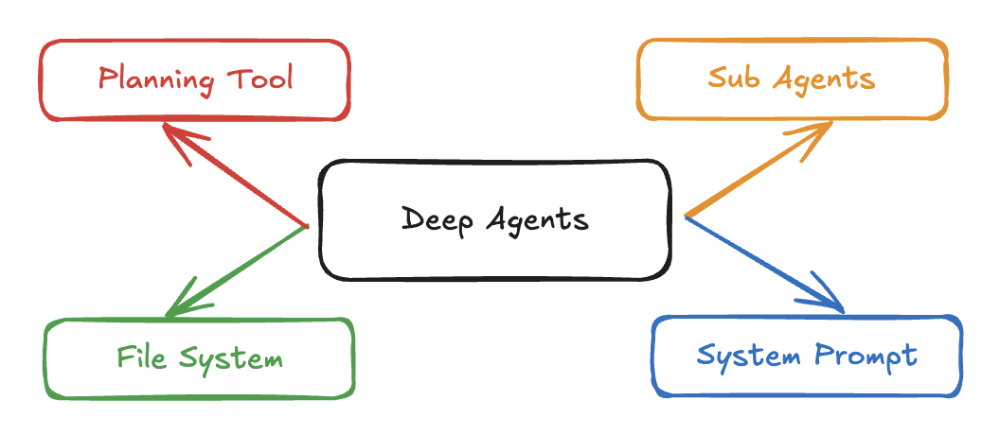
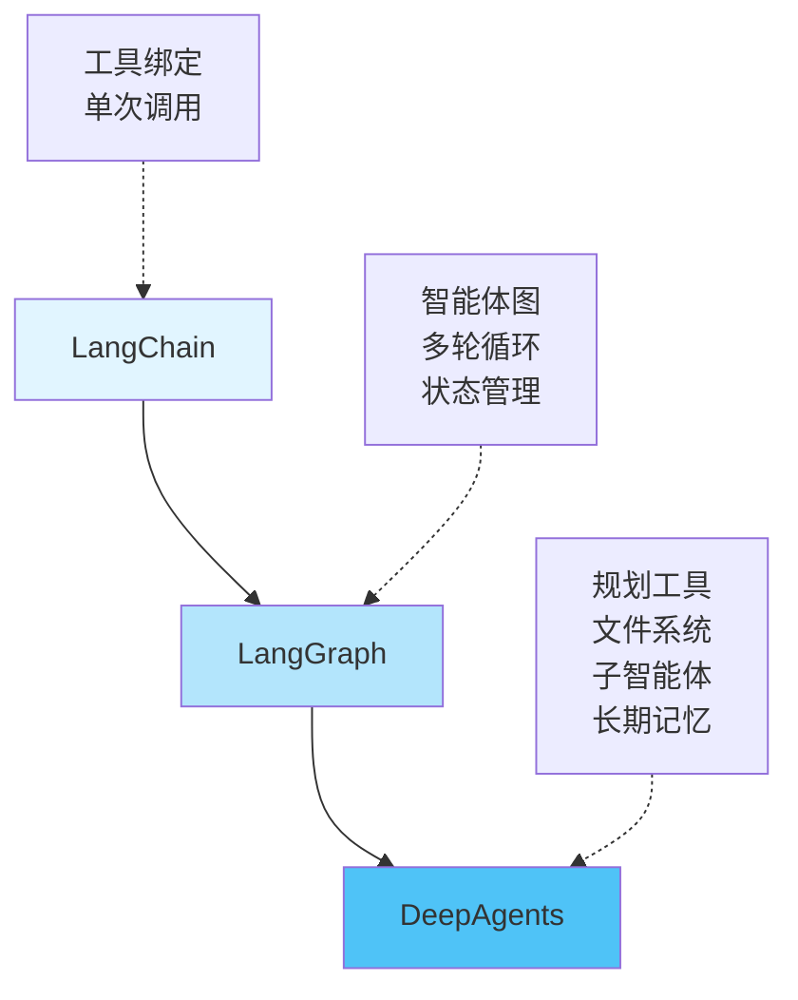
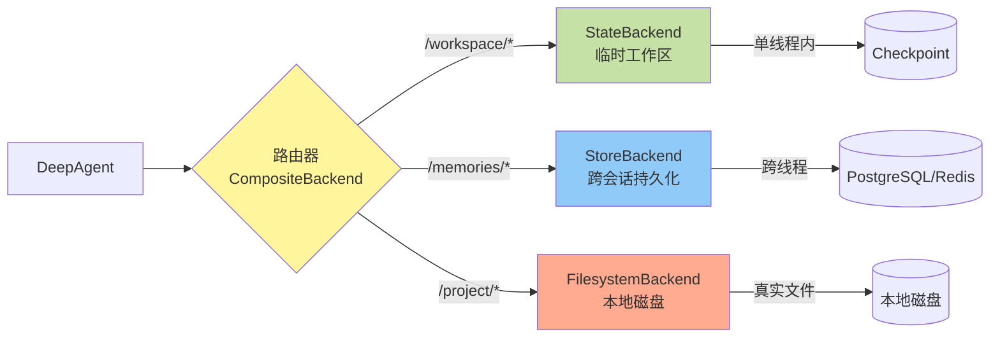
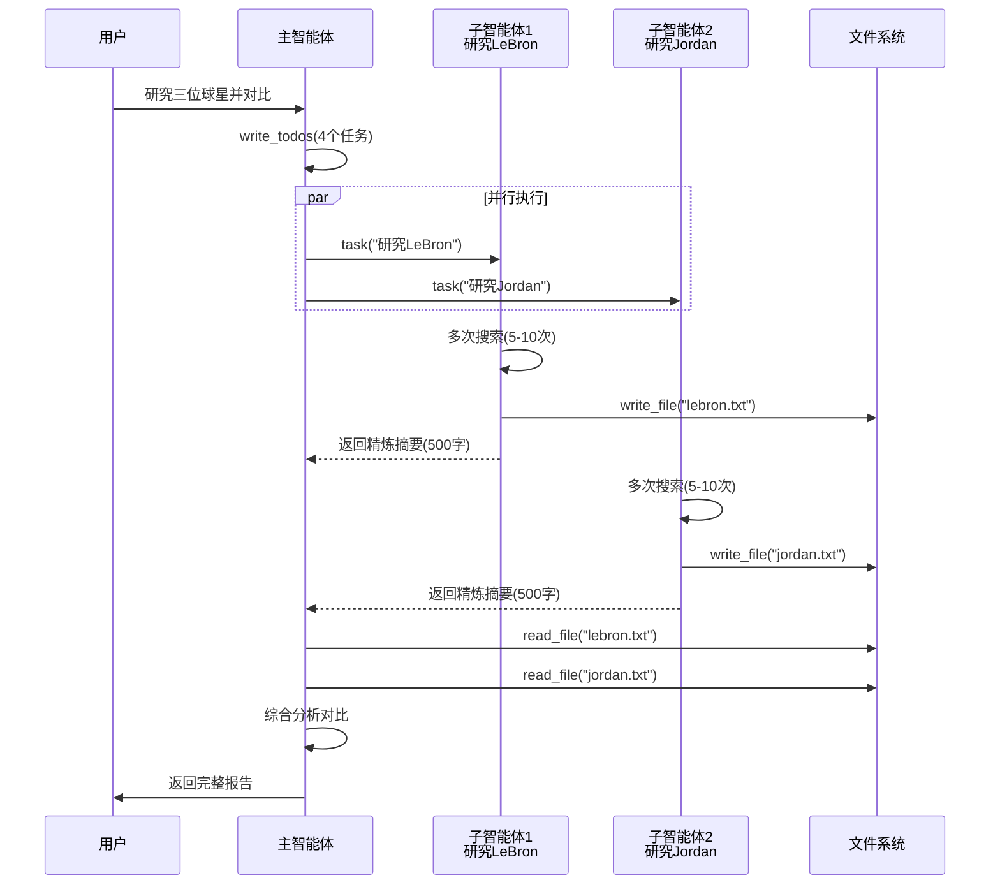
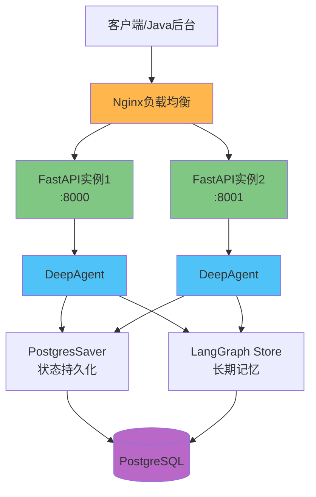
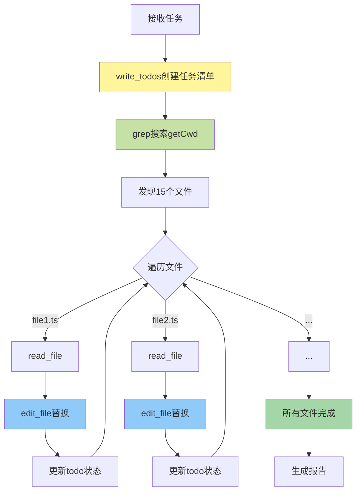

# DeepAgents：让AI智能体从"浅层循环"走向"深度思考"

## 引言

传统的AI智能体通常采用"调用工具-获取结果-返回答案"的简单循环模式。这种架构在处理简单任务时游刃有余，但面对需要多步规划、上下文管理的复杂任务时，往往力不从心。LangChain AI团队推出的**DeepAgents**框架，通过引入规划工具、虚拟文件系统、子智能体和精细化提示词四大核心能力，让智能体具备了处理复杂长任务的"深度思考"能力。



## 一、DeepAgents是什么？

**DeepAgents是基于LangGraph构建的高级智能体框架**，它不是替代LangGraph，而是在其之上提供了一套针对"深度任务"优化的预配置模板。可以将其理解为LangGraph的"豪华套装版"——保留了LangGraph的所有灵活性，同时内置了处理复杂任务所需的关键能力。

### 与LangChain生态的关系



**三者的使用场景区分：**

| 框架 | 适用场景 | 典型任务 |
|------|---------|---------|
| **LangChain** | 1-2次工具调用 | 天气查询、简单翻译、格式转换 |
| **LangGraph** | 3步内的多轮循环 | 连续搜索后总结、简单数据处理 |
| **DeepAgents** | >3步的复杂任务 | 研究报告、代码重构、迭代写作 |

## 二、核心能力解析

### 1. 规划工具（Planning Tool）

DeepAgents内置`write_todos`工具，让智能体能够像人类一样先制定计划再执行：

```python
# 用户请求："研究三位篮球明星并写对比报告"
# 智能体自动创建任务清单：
{
  "todos": [
    {"id": "1", "content": "研究 LeBron James", "status": "completed"},
    {"id": "2", "content": "研究 Michael Jordan", "status": "in_progress"},
    {"id": "3", "content": "研究 Kobe Bryant", "status": "pending"},
    {"id": "4", "content": "撰写对比报告", "status": "pending"}
  ]
}
```

**何时使用规划工具：**
- ✅ 任务步骤 > 3步
- ✅ 需要跨文件的系统性重构（如重命名15个文件中的函数）
- ✅ 需要迭代改进的流程（写作→审阅→修改）
- ❌ 简单的并行独立操作（如同时订3份外卖）

### 2. 虚拟文件系统（Filesystem）

提供6个文件操作工具，解决智能体的"上下文爆炸"问题：

```python
# 智能体可以将大量搜索结果写入文件
write_file("lebron_research.txt", "详细的研究内容...5000字")

# 需要时再精确读取
read_file("lebron_research.txt", offset=0, limit=50)  # 只读前50行

# 批量搜索代码库
grep("getCwd", path="/src")  # 找到所有匹配项

# 精确编辑
edit_file("utils.ts", "getCwd", "getCurrentWorkingDirectory")
```

**支持多种存储后端：**



### 3. 子智能体（Sub-agents）

通过`task`工具实现任务委托和上下文隔离：

```python
from deepagents import create_deep_agent

# 定义专业化子智能体
subagents = [{
    "name": "research-agent",
    "description": "深度研究专家",
    "prompt": "你是严谨的研究分析师",
    "tools": [internet_search],
    "model": "gpt-4o"  # 子智能体可以使用不同模型
}]

agent = create_deep_agent(
    model="claude-sonnet-4-20250514",
    tools=[internet_search],
    subagents=subagents
)
```

**子智能体执行流程：**



**为什么需要子智能体？**
- **上下文隔离**：每个子智能体独立工作，不污染主智能体上下文
- **并行执行**：多个子智能体可同时执行，节省时间
- **Token优化**：子任务的大量上下文被压缩成精炼摘要返回

### 4. 长期记忆（Long-term Memory）

基于LangGraph Store实现跨会话持久化：

```python
from langgraph.store.postgres import PostgresStore

# 配置持久化存储
store = PostgresStore.from_conn_string("postgresql://...")

agent = create_deep_agent(
    tools=[your_tools],
    store=store  # 文件将持久化到数据库
)

# 用户第一次对话
agent.invoke({"messages": [{"role": "user", "content": "记住我喜欢Python"}]})
# 智能体：write_file("/memories/user_preferences.txt", "偏好Python语言")

# 几天后的对话
agent.invoke({"messages": [{"role": "user", "content": "推荐一个项目"}]})
# 智能体：read_file("/memories/user_preferences.txt") → 推荐Python项目
```

## 三、快速上手

### 安装与配置

```bash
# 安装依赖
pip install deepagents tavily-python

# 配置API密钥
export ANTHROPIC_API_KEY="your-api-key"
export TAVILY_API_KEY="your-tavily-api-key"
```

### 创建研究型智能体

```python
import os
from typing import Literal
from tavily import TavilyClient
from deepagents import create_deep_agent

tavily_client = TavilyClient(api_key=os.environ["TAVILY_API_KEY"])

# 定义搜索工具
def internet_search(
    query: str,
    max_results: int = 5,
    topic: Literal["general", "news", "finance"] = "general"
):
    """执行网络搜索"""
    return tavily_client.search(query, max_results=max_results, topic=topic)

# 创建智能体
agent = create_deep_agent(
    tools=[internet_search],
    system_prompt="""你是专业的研究分析师。
    使用internet_search工具收集信息，将大量数据写入文件管理，
    复杂子任务使用task工具委托给子智能体。"""
)

# 执行任务
result = agent.invoke({
    "messages": [{"role": "user", "content": "研究LangChain和LangGraph的区别"}]
})

print(result["messages"][-1].content)
```

### 自动化工作流程

智能体会自动执行以下流程：
1. **规划**：调用`write_todos`创建任务清单
2. **搜索**：多次调用`internet_search`收集信息
3. **上下文管理**：将大量搜索结果通过`write_file`保存
4. **分析**：使用`read_file`按需读取内容进行分析
5. **报告**：综合信息生成最终报告

## 四、生产部署方案

### 微服务架构

使用FastAPI封装DeepAgents为RESTful服务：

```python
from fastapi import FastAPI, HTTPException
from pydantic import BaseModel
from deepagents import create_deep_agent
from langgraph.checkpoint.postgres import PostgresSaver

app = FastAPI()

# 初始化智能体（配置持久化）
agent = create_deep_agent(
    tools=[your_tools],
    system_prompt="你的指令",
    checkpointer=PostgresSaver.from_conn_string("postgresql://...")
)

class AgentRequest(BaseModel):
    thread_id: str  # 会话ID
    message: str

@app.post("/agent/invoke")
async def invoke_agent(request: AgentRequest):
    """同步调用智能体"""
    config = {"configurable": {"thread_id": request.thread_id}}
    result = agent.invoke(
        {"messages": [{"role": "user", "content": request.message}]},
        config=config
    )
    return {
        "response": result["messages"][-1].content,
        "todos": result.get("todos", []),
        "files": result.get("files", {})
    }

@app.post("/agent/stream")
async def stream_agent(request: AgentRequest):
    """流式调用智能体"""
    from fastapi.responses import StreamingResponse
    
    async def event_generator():
        config = {"configurable": {"thread_id": request.thread_id}}
        async for event in agent.astream(
            {"messages": [{"role": "user", "content": request.message}]},
            config=config
        ):
            yield f"data: {json.dumps(event)}\n\n"
    
    return StreamingResponse(event_generator(), media_type="text/event-stream")
```

### 完整架构图



### Nginx配置

```nginx
upstream deepagent_service {
    server 127.0.0.1:8000;
    server 127.0.0.1:8001;
}

server {
    listen 80;
    
    location /api/agent/ {
        proxy_pass http://deepagent_service/agent/;
        proxy_set_header Host $host;
        
        # 流式响应配置
        proxy_buffering off;
        proxy_cache off;
        proxy_read_timeout 300s;
    }
}
```

## 五、中间件系统与扩展

DeepAgents采用模块化中间件架构，默认包含：

```python
# DeepAgents内部自动注入的中间件栈
deepagent_middleware = [
    PlanningMiddleware(),                    # 提供write_todos工具
    FilesystemMiddleware(),                  # 提供文件系统工具
    SubAgentMiddleware(                      # 提供task工具
        default_subagent_tools=tools,
        subagents=custom_subagents
    ),
    SummarizationMiddleware(                 # 自动压缩历史对话
        max_tokens_before_summary=120000
    ),
    AnthropicPromptCachingMiddleware()       # Anthropic提示词缓存
]
```

**自定义中间件示例：**

```python
from langchain.agents.middleware import AgentMiddleware
from langchain_core.tools import tool

@tool
def get_weather(city: str) -> str:
    """获取天气信息"""
    return f"{city}今天晴天"

class WeatherMiddleware(AgentMiddleware):
    tools = [get_weather]

# 添加到智能体
agent = create_deep_agent(
    model="claude-sonnet-4-20250514",
    middleware=[WeatherMiddleware()]  # 注入自定义中间件
)
```

## 六、实战案例：代码库重构

假设需要将项目中所有`getCwd`重命名为`getCurrentWorkingDirectory`：

```python
from deepagents import create_deep_agent

agent = create_deep_agent(
    tools=[grep, read_file, edit_file],
    system_prompt="你是代码重构专家"
)

result = agent.invoke({
    "messages": [{"role": "user", "content": "重命名所有getCwd为getCurrentWorkingDirectory"}]
})
```

**智能体执行流程：**



## 七、最佳实践

### 1. 合理配置存储后端

```python
from deepagents.backends import CompositeBackend, StateBackend, StoreBackend

# 混合存储策略
composite_backend = lambda rt: CompositeBackend(
    default=StateBackend(rt),          # 默认临时存储
    routes={
        "/memories/": StoreBackend(rt),   # 长期记忆持久化
        "/workspace/": StateBackend(rt)   # 工作区临时存储
    }
)

agent = create_deep_agent(backend=composite_backend)
```

### 2. 人工审核关键操作

```python
agent = create_deep_agent(
    tools=[edit_file, delete_file],
    interrupt_on={
        "edit_file": {"allowed_decisions": ["approve", "edit", "reject"]},
        "delete_file": True  # 简写形式
    }
)

# 智能体遇到edit_file时会暂停等待审核
result = agent.invoke({"messages": [...]}, config=config)

# 用户审核后继续
from langgraph.types import Command
agent.invoke(Command(resume=[{"type": "approve"}]), config=config)
```

### 3. 性能优化建议

- **提示词缓存**：Anthropic模型自动启用，节省90%重复Token成本
- **自动摘要**：对话超过120K tokens时自动压缩历史
- **结果卸载**：超过20K tokens的工具结果自动写入文件
- **并行子任务**：独立任务使用子智能体并行执行

## 总结

DeepAgents通过四大核心能力，让AI智能体从简单的"工具调用循环"进化为具备规划、记忆和上下文管理的"深度智能体"。它不是替代LangGraph，而是在其基础上提供了开箱即用的高级模板。

**何时选择DeepAgents：**
- ✅ 任务需要显式规划和进度追踪
- ✅ 需要保存和管理大量中间文件
- ✅ 复杂任务需要拆分为独立子任务
- ✅ 任务步骤 > 3步且需要迭代改进

如果你的应用场景符合上述特征，DeepAgents将是构建生产级AI智能体的理想选择。

---

**参考资源：**
- [DeepAgents GitHub](https://github.com/langchain-ai/deepagents)
- [LangChain官方文档](https://docs.langchain.com/)
- [LangGraph文档](https://docs.langchain.com/langgraph)

