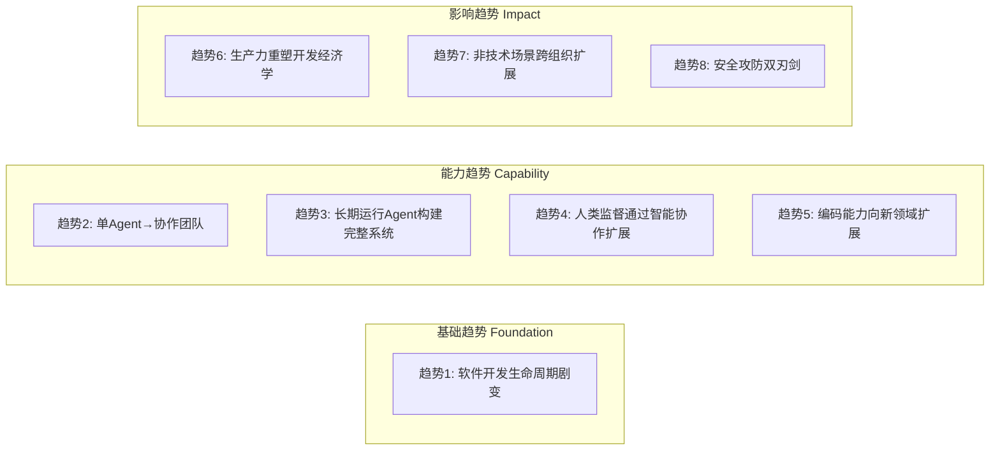
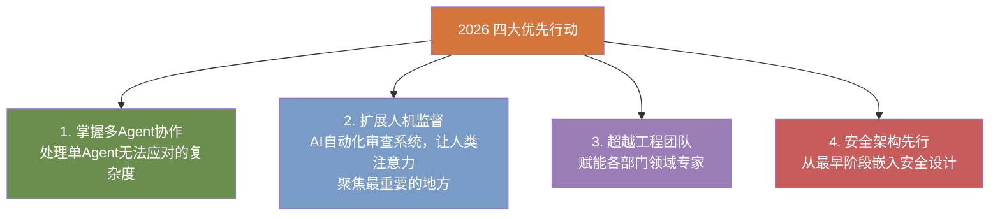

# Anthropic 2026 智能体编码趋势报告深度解读：软件开发的范式革命

> **报告来源**：[Anthropic 官方 PDF](https://resources.anthropic.com/hubfs/2026%20Agentic%20Coding%20Trends%20Report.pdf?hsLang=en) · 18页 · 2026年1月发布
>
> **一句话总结**：开发者不再是代码编写者，而是智能体编排者。编程革命已经到来。

*Anthropic 官方发布的《2026 Agentic Coding Trends Report》封面*

## 报告背景：从辅助到协作的跃迁

2025年，AI编码智能体从实验工具变成了生产系统，能完成真实的特性开发：写测试、调试错误、生成文档、导航复杂代码库。而2026年，变化将远超「工具升级」的范畴——我们正在经历**自图形用户界面发明以来最大的一次范式转移**。

报告的核心结论可以浓缩为一句话：

> **开发者正在从代码编写者转变为智能体编排者（Agent Orchestrators）**——聚焦架构设计和战略决策，而非逐行敲代码。

但这里有一个关键的细微差别：虽然开发者在工作中约 **60%** 使用了AI，但他们报告只能**完全委派 0-20%** 的任务。这说明AI不是替代者，而是**持续的协作伙伴**——有效使用它需要主动的监督、验证和人类判断。

## 报告结构：三大类八大趋势

报告识别了8个关键趋势，分为三大类：

---

## 一、基础趋势：构造板块级的巨变

*报告用"构造板块级巨变（Tectonic Shift）"来形容这一基础性转变*

### 趋势1：软件开发生命周期正在剧变

从机器码到汇编，从C到Python，每一层抽象都在缩小人类思维和机器执行之间的鸿沟。**现在，最新的一层抽象就是——人类和AI的自然语言对话。**

报告给出了传统SDLC vs 智能体SDLC的对比图，这是整份报告中最关键的可视化之一：

*报告第5页：传统软件开发生命周期 vs Agentic SDLC 对比。传统SDLC各阶段以周/月计，而智能体驱动后压缩为小时/天级别*

#### 报告的三大预测

1. **抽象层再升级**：写代码、调试、维护这些「战术工作」转移给AI，工程师聚焦架构设计和战略决策
2. **工程师角色大转型**：做软件 ≠ 写代码。工程师越来越多地变成「编排智能体写代码」的角色——评估输出、提供方向、确保系统正确
3. **入职速度革命**：传统熟悉新代码库需要数周，现在压缩到数小时。企业可以实现「动态突击编队」，按需调配工程师到特定任务

#### 协作的本质

报告特别强调，工程师不是被取代了，而是变得更加「全栈化」。AI填补了知识差距，工程师可以在前端、后端、数据库、基础设施之间自如切换——这些领域他们以前可能缺乏专业知识。

> 💡 **案例：Augment Code**  
> 一位企业客户使用 Augment Code（基于Claude构建）完成了CTO最初估计需要4-8个月的项目，**仅用了两周**。

---

## 二、能力趋势：智能体能做什么

*报告第7页：能力趋势章节——智能体能做什么*

### 趋势2：单Agent进化为协作团队

单一智能体的能力终究有限。2026年，多Agent协作模式成为主流：**主Agent拆解目标，专项子Agent各司其职，在独立的上下文窗口中并行推理**。

*报告第8页：单Agent架构 vs 多Agent层级架构对比。左侧：单一上下文、顺序处理、分钟级任务；右侧：编排Agent + 多个专项Agent，并行执行、天/周级项目*

报告对比了两种架构的关键特征：

| 特征 | 单Agent架构 | 多Agent层级架构 |
|------|-----------|---------------|
| 任务处理 | 线性顺序执行 | 并行任务执行 |
| 视角 | 单一视角 | 多元视角 |
| 上下文范围 | 有限上下文 | 多个独立上下文窗口 |
| 任务周期 | 分钟到小时 | 小时到天/周 |
| 适用场景 | 通用推理 | 角色特化、专项分工 |

> 💡 **案例：Fountain**  
> 人力管理平台 Fountain 使用 Claude 实现层级化多Agent编排，实现了 **50% 更快的筛选速度、40% 更快的入职流程、2倍候选人转化率**。一个物流客户将新配送中心的完整配员时间从1周+压缩到了72小时内。

### 趋势3：长期运行Agent构建完整系统

早期Agent处理的是「一次性」任务，耗时几分钟。到2025年底，Agent已经能花数小时完成完整功能。**2026年，Agent将能连续工作数天，以最少的人类干预构建完整的应用和系统**。

报告的关键预测：
- **任务时间线从分钟扩展到天/周**：Agent从离散任务进化到长期自主工作
- **应对软件开发的混乱现实**：长期Agent能规划、迭代、在数十个工作会话中保持连贯状态
- **开发经济学根本性改变**：以前「没人有时间搞」的技术债务，现在Agent可以系统性清除
- **产品上市路径加速**：从创意到部署的周期从月缩短到天

> 💡 **案例：Rakuten（乐天）**  
> 工程师测试了Claude Code在vLLM（一个拥有**1250万行代码**的大型开源项目）上实现特定功能的能力。Claude Code在**7小时的自主工作**中完成了整个任务，实现了**99.9%的数值准确率**。

### 趋势4：人类监督通过智能协作扩展

2026年最有价值的能力发展是：Agent学会了**什么时候该求助**，而非盲目尝试一切。人类只在必要时介入——这不是把人从流程中移除，而是让人类注意力集中在最重要的地方。

#### 协作悖论

报告揭示了一个重要模式：工程师报告使用AI完成约60%的工作并获得了显著的生产力提升，但同时也报告只能「完全委派」极少部分任务。这个表面矛盾的解释是：**有效的AI协作需要人类的主动参与**。

工程师倾向于委派那些「可以相对容易地快速验证正确性」的任务或低风险任务。概念越复杂、越依赖设计判断的任务，工程师越倾向于自己做或与AI协作完成。

> *"我主要在我知道答案应该是什么样子的场景中使用AI。我通过'硬编码'的方式学会了软件工程，才培养出了这种判断能力。"*  
> ——Anthropic 工程师

> 💡 **案例：CRED**  
> 印度金融科技平台 CRED（服务1500万+用户）在整个开发生命周期中部署了Claude Code，**将执行速度提升了2倍**——不是通过消除人类参与，而是将开发者转向更高价值的工作。

### 趋势5：编码能力向新领域和新用户扩展

早期的智能体编码主要帮助专业工程师在熟悉的环境中更快工作。2026年，它正在扩展到传统开发工具无法触及的场景。

- **语言障碍消失**：对COBOL、Fortran等遗留语言的支持扩展，使遗留系统维护成为可能
- **编码民主化超越工程团队**：网络安全、运营、设计、数据科学等领域的非传统开发者获得编码能力
- **「人人全栈」成为现实**：安全团队用AI分析不熟悉的代码，研究团队用AI构建前端可视化，非技术员工用AI调试网络问题

---

## 三、影响趋势：智能体将改变什么

*报告第12页：影响趋势——智能体在2026年可能带来的改变*

### 趋势6：生产力重塑软件开发经济学

*报告第13页：三重乘数效应驱动加速——Agent能力 × 编排改进 × 人类经验，产生阶梯式而非线性增长*

Anthropic内部研究揭示了一个有趣的生产力模式：工程师报告每项任务花费的时间**减少了**，但产出量**大幅增加**。这表明AI提升生产力的主要方式是**更多的产出**（更多特性发布、更多bug修复、更多实验），而非简单地更快完成同样的工作。

关键数据：
- 约**27%**的AI辅助工作是「原本不会做」的任务：扩展项目、构建Nice-to-have的工具、原本成本不合理的探索性工作
- 工程师报告修复了更多「纸割伤」（papercuts）——那些改善生活质量但通常被降低优先级的小问题

> 💡 **案例：TELUS**  
> 通信技术公司 TELUS 的团队创建了 **13,000+** 个定制AI解决方案，工程代码发布速度**提升30%**，累计节省超过 **50万小时**，平均每次AI交互节省40分钟。

### 趋势7：非技术场景跨组织扩展

2026年最重要的趋势之一是：**业务和职能团队开始用智能体编码自行创建解决方案**，无需工程团队介入。

- 销售、市场、法务、运营团队获得自动化工作流和构建工具的能力
- 领域专家直接实施解决方案，不再需要提工单然后等待开发团队
- 「不值得工程时间」的问题得到解决，实验性工作流变得微不足道

> 💡 **案例：Zapier**  
> AI编排平台 Zapier 实现了全组织 **89%** 的AI采用率，内部部署了 **800+** AI Agent。设计团队使用Claude在客户访谈中实时制作原型——这些原型正常情况下需要数周开发。

> 💡 **案例：Anthropic 法务团队**  
> Anthropic自己的法律团队将营销审核周期从2-3天缩短到24小时。一位**没有编程经验**的律师使用Claude Code构建了自助工具，在问题进入法律队列前自动分流，让律师能专注于战略性顾问工作。

### 趋势8：安全的双刃剑效应

智能体编码正在同时改变安全攻防两个方向。更强的模型让**任何工程师都能成为安全工程师**——进行深入的安全审查、加固和监控。但同样的能力也在帮助攻击者规模化他们的攻击。

---

## 数据洞察：Anthropic 经济指数

Anthropic 通过分析 **50万次** 编码相关交互（横跨Claude.ai和Claude Code），得出了以下关键数据洞察：

### 自动化 vs 增强

*来源：[Anthropic Economic Index](https://www.anthropic.com/research/impact-software-development)。Claude Code 的自动化率（79%）远高于 Claude.ai（49%），说明专业编码Agent更倾向于自动完成任务*

关键发现：
- **Claude Code 自动化率 79%** vs Claude.ai 的 49%——当Agent更专业时，自动化程度显著提升
- 「反馈循环」模式在Claude Code中占35.8%（Claude.ai仅21.3%）——Agent自主完成任务但通过人类验证修正
- 「指令式」对话在Claude Code中占43.8%（Claude.ai仅27.5%）——用户下达指令后最少交互
- 所有「增强」模式（学习、验证等）在Claude Code中都显著低于Claude.ai

### 开发者在用AI构建什么

*来源：Anthropic Economic Index。Top编码用例中，软件架构与代码设计排名第一，UI/UX组件开发紧随其后*

### 编程语言分布

*来源：Anthropic Economic Index。JavaScript和TypeScript合计占31%，HTML和CSS占28%，Web前端开发语言明显主导*

这些数据揭示了一个重要信号：**面向用户界面的应用开发可能比后端工作更早受到AI的深度影响**。随着「Vibe Coding」（氛围编码）进入主流，以构建简单应用和用户界面为核心的工作可能面临最直接的变革。

### 谁在使用AI编码

*来源：Anthropic Economic Index。Startup是Claude Code的主要早期采用者（33%），而Enterprise仅占13%*

初创公司是AI编码工具的主力用户，而大型企业明显滞后。这种模式与过去的技术转型一致：初创公司利用新工具获取竞争优势，传统企业则更谨慎、需要详细的安全审查。

---

## 企业采用数据

| 数据指标 | 数值 | 来源 |
|---------|------|------|
| 已采用AI Agent的组织 | 79% | 普华永道 2025年5月调查 |
| AI Agent创建与部署增长 | 119% | Salesforce 2025上半年 |
| Claude Code 开发者市场占有率 | 69% | ACTI 2026年1月调查 |
| 报告AI工具生产力提升的开发者 | 90% | ACTI 2026年1月调查 |
| 重度AI用户(76%+使用率)生产力增益 | 2.9× | ACTI 2026年1月调查 |

---

## 2026年四大优先行动

报告最后给出了组织在2026年需要立即关注的四个领域：

---

## 结论：游戏规则已经改变

> *"把智能体编码作为战略优先级的组织将定义什么是可能的；而把它当作增量生产力工具的组织将发现自己在用新规则竞争旧游戏。"*  
> ——Anthropic 2026 Agentic Coding Trends Report

这份报告最打动我的不是技术预测，而是一个深层洞察：**人类的角色不是在消退，而是在升级**。即使AI能力持续扩展，人类仍然是中心。变化只是从「写代码」转向「审查、指导和验证AI生成的代码」。

程序员不会消失，但「只会写代码」的程序员会消失。未来的软件工程师是编排者、架构师、决策者——他们指挥AI军团，而非逐行敲代码。而最关键的技能不再是语法和算法，而是**判断力、品味和对问题的深刻理解**。

---

## 参考资料

1. [Anthropic 2026 Agentic Coding Trends Report (官方PDF)](https://resources.anthropic.com/hubfs/2026%20Agentic%20Coding%20Trends%20Report.pdf?hsLang=en)
2. [Claude Blog: Eight trends defining how software gets built in 2026](https://claude.com/blog/eight-trends-defining-how-software-gets-built-in-2026)
3. [Anthropic Economic Index: AI's impact on software development](https://www.anthropic.com/research/impact-software-development)
4. [ACTI January 2026 Agentic Coding Survey](https://report.actiindex.org/January2026/)
5. [Sola Fide: Anthropic's 2026 Report Analysis](https://solafide.ca/blog/anthropic-2026-agentic-coding-trends-reshaping-software-development)
