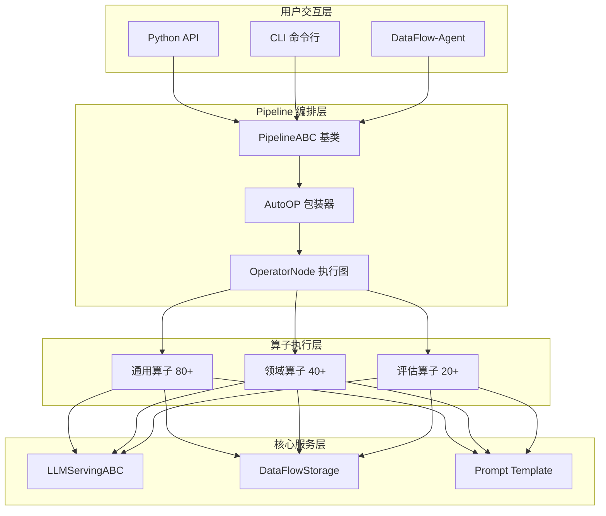
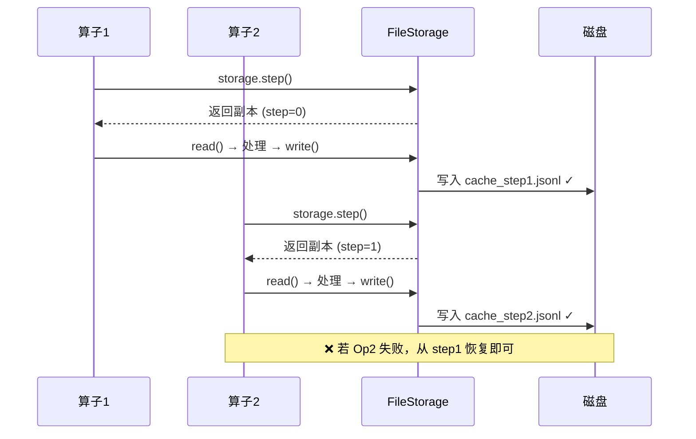

# DataFlow：LLM 驱动的统一数据准备框架

> 📄 论文：[DataFlow: An LLM-Driven Framework for Unified Data Preparation and Workflow Automation in the Era of Data-Centric AI](https://arxiv.org/abs/2512.16676)  
> 🏛️ 机构：北京大学、上海智算研究院、OpenDataLab、LLaMA-Factory 团队等  
> 🏆 荣誉：ICML 2025 自动数学推理挑战赛第一名、2025语言与智能挑战赛一等奖

---

## 一、为什么需要 DataFlow？

随着大模型从研究原型演进为基础设施，**数据质量**已成为决定模型性能的核心因素。Scaling Law 研究反复证明：数据的质量和数量与模型能力直接挂钩。

然而，当前的 LLM 数据准备依然处于**碎片化**状态：
- 大量临时脚本，缺乏统一抽象
- 流水线难以复现、扩展和比较
- 对模型驱动的数据合成支持有限
- 与现有大数据框架（Spark/Dask）在语义处理上存在鸿沟

DataFlow 正是为解决这些问题而生——它将 **LLM 驱动的数据合成**提升为一等公民，提供近 200 个可复用算子、6 条 SOTA 级 Pipeline，以及能自动编排流水线的 DataFlow-Agent。


---

## 二、系统设计理念

DataFlow 围绕六大核心目标构建：

| 设计目标 | 实现方式 |
|---------|---------|
| **易用性** | PyTorch 风格 API，IDE 友好，代码即文档 |
| **可扩展** | 模块化算子设计，插件式集成 |
| **统一范式** | 标准化抽象层，平衡通用性与定制化 |
| **高性能** | 官方 Pipeline 达到或超越 SOTA |
| **智能自动化** | DataFlow-Agent 支持自然语言编排 |
| **开源生态** | 统一协议，促进社区共享与复现 |

**核心定位**：DataFlow 是一个位于「数据处理 + 数据管理 + 知识工程」交集的技术框架，间接支撑数据治理，核心价值是**高质量、可复用、可扩展的知识化数据生成与加工**。

---

## 三、核心架构解析

### 3.1 四层架构设计

DataFlow 采用分层架构，从底向上依次为：



### 3.2 算子分类体系

DataFlow 将算子按**功能维度**划分为四类，对应「生成-评估-过滤-精炼」的数据合成范式：

| 类型 | 命名后缀 | 作用 | 示例 |
|-----|---------|-----|------|
| **Generate** | Generator/RowGenerator | 生成新字段或新行 | Text2QAGenerator |
| **Evaluate** | SampleEvaluator | 计算样本评分/标签 | DifficultyClassifier |
| **Filter** | Filter | 根据条件过滤行 | SQLExecutionFilter |
| **Refine** | Refiner | 修改字段内容 | URLRemover |

下图展示了不同 Pipeline 中样本数量随算子步骤的演变——生成阶段扩增、过滤阶段收缩：


### 3.3 PyTorch 风格的 Pipeline API

DataFlow 的 Pipeline 定义方式借鉴 PyTorch 的 `nn.Module`，在 `__init__` 中配置资源，在 `forward` 中声明执行顺序：

```python
from dataflow.core import PipelineABC
from dataflow.utils.storage import FileStorage
from dataflow.serving import APILLMServing_request
from dataflow.operators.core_text import Text2QAGenerator, Text2QASampleEvaluator

class QAPipeline(PipelineABC):
    def __init__(self):
        # 1. 配置存储（支持检查点）
        self.storage = FileStorage(
            first_entry_file_name="input.jsonl",
            cache_path="./cache",
            file_name_prefix="step"
        )
        # 2. 配置 LLM 服务
        self.llm = APILLMServing_request(
            api_url="https://api.openai.com/v1/chat/completions",
            model_name="gpt-4o"
        )
        # 3. 初始化算子
        self.qa_gen = Text2QAGenerator(self.llm)
        self.qa_eval = Text2QASampleEvaluator(self.llm)
        
    def forward(self):
        # 声明式定义流水线，AutoOP 自动捕获依赖
        self.qa_gen.run(
            storage=self.storage.step(),
            input_key="text",
            output_question_key="question",
            output_answer_key="answer"
        )
        self.qa_eval.run(
            storage=self.storage.step(),
            input_question_key="question",
            input_answer_key="answer",
            output_quality_key="quality_score"
        )

# 编译并执行
pipeline = QAPipeline()
pipeline.compile()   # 构建执行图、验证依赖
pipeline.forward()   # 执行流水线
```

### 3.4 检查点机制：storage.step()

大规模数据处理中，LLM 调用成本高昂。DataFlow 通过 `storage.step()` 实现**细粒度检查点**：



这意味着：如果流水线在步骤 5 失败，可直接从步骤 4 的缓存恢复，**无需重新运行昂贵的 LLM 处理**。

### 3.5 LLM 服务抽象层

`LLMServingABC` 屏蔽了底层模型差异，支持灵活切换：

| 后端类型 | 实现类 | 适用场景 |
|---------|-------|---------|
| **云端 API** | APILLMServing_request | OpenAI/Anthropic/Gemini |
| **本地推理** | LocalModelLLMServing_vllm | vLLM 高吞吐推理 |
| **本地推理** | LocalModelLLMServing_sglang | SGLang 数据并行 |

Pipeline 执行时会**自动管理 LLM 资源**：当切换模型时，系统自动调用 `cleanup()` 释放显存，再激活新模型。

---

## 四、DataFlow-Agent：自然语言编排流水线

DataFlow-Agent 是框架的智能编排层，能将**自然语言需求**转换为可执行的 Pipeline。


工作流程分为四个阶段：

1. **意图分解**：Intent Analysis Agent 将用户查询拆解为子任务序列
2. **算子合成**：从算子库检索匹配算子，必要时动态生成新算子代码
3. **Pipeline 装配**：将验证通过的算子组装为 DAG 执行图
4. **沙箱验证**：在隔离环境中测试，自动修复连接和参数错误

**与 Data-Juicer 的关键区别**：DataFlow-Agent 不仅能编排现有算子，还能**动态合成新算子代码**，实现真正的自适应流水线构建。

---

## 五、六大 Pipeline 实践

DataFlow 提供 6 条开箱即用的 SOTA 级 Pipeline：

### 5.1 Text Pipeline：从噪声文本挖掘 QA


从互联网爬取的低质量文本中提取高质量问答对，用于 SFT/RL 训练。

### 5.2 Reasoning Pipeline：推理链增强


为现有 QA 数据添加：(1) 链式思维推理、(2) 类别分类、(3) 难度评估。

### 5.3 Text-to-SQL Pipeline：SQL 数据合成


包含 SQL 生成、执行验证、问题生成、CoT 推理等完整链路，支持 MySQL/SQLite/PostgreSQL 多数据库。

### 5.4 AgenticRAG Pipeline：多跳推理数据

识别需要外部知识才能回答的 QA，用于训练 Agentic RAG 系统。

### 5.5 Knowledge Extraction Pipeline：知识库清洗

从 PDF、表格、文档中提取结构化知识，用于 RAG 或 QA 生成。

---

## 六、实验效果

### 6.1 数学推理（Reasoning Pipeline）

使用 NuminaMath 作为种子，合成 10K 推理数据微调 Qwen2.5-32B-Instruct：

| 训练数据 | AIME24@32 | AIME25@32 | 平均 |
|---------|:---------:|:---------:|:----:|
| Qwen2.5-32B-Instruct (基线) | 16.8 | 11.6 | 46.95 |
| + Open-R1-10k (2 epochs) | 51.0 | 40.7 | 54.2 |
| **+ DataFlow-Reasoning-10K** | **45.4** | **40.0** | **55.7** |

### 6.2 Text-to-SQL Pipeline

仅用 90K 合成数据，在多个基准上超越 2.5M 规模的 SynSQL：

| 训练数据 | Spider-test | BIRD-dev | EHRSQL | 平均 |
|---------|:-----------:|:--------:|:------:|:----:|
| SynSQL (2.5M) | 88.3 | 66.1 | 40.0 | 71.6 |
| **DataFlow-Text2SQL-90K** | **86.0** | **61.5** | **58.7** | **74.0** |

关键发现：在 EHRSQL 医疗领域基准上提升 **+18.7%**，体现领域迁移优势。

### 6.3 统一多领域数据（DataFlow-Instruct-10K）

将 Text/Math/Code 数据混合为 10K 样本训练，效果显著：

| 模型 | 训练数据 | Math-Avg | Code-Avg | Knowledge-Avg |
|-----|---------|:--------:|:--------:|:-------------:|
| Qwen2.5-7B-Base | Infinity-Instruct-1M | 33.3 | 78.0 | 75.8 |
| Qwen2.5-7B-Base | **DataFlow-Instruct-10K** | **46.7** | **78.6** | **76.2** |
| Qwen2.5-7B-Instruct (官方) | - | 49.8 | 80.6 | 75.7 |

**10K 样本即可逼近官方 Instruct 模型**，数据效率提升 100 倍。

---

## 七、总结

DataFlow 为数据中心化 AI 时代提供了一套完整的数据准备解决方案：

| 维度 | 贡献 |
|-----|------|
| **架构创新** | AutoOP 运行时捕获、细粒度检查点、LLM 资源自动管理 |
| **算子生态** | 近 200 个可复用算子，覆盖 Text/Math/Code/SQL/RAG/Knowledge |
| **智能编排** | DataFlow-Agent 支持自然语言 → 可执行 Pipeline |
| **效果验证** | 6 条 Pipeline 在多项基准达到或超越 SOTA |

**适用场景**：
- 🔄 LLM 预训练语料清洗
- 📚 领域 SFT 数据合成（医疗/金融/法律）
- 🧠 强化学习 CoT 数据生成
- 🔍 RAG 知识库清洗与向量化

---

**项目资源**：
- 📦 GitHub: [https://github.com/OpenDCAI/DataFlow](https://github.com/OpenDCAI/DataFlow)
- 📄 论文: [https://arxiv.org/abs/2512.16676](https://arxiv.org/abs/2512.16676)
- 📖 文档: [https://opendcai.github.io/DataFlow-Doc/](https://opendcai.github.io/DataFlow-Doc/)
- 🤗 数据集: [https://huggingface.co/datasets/OpenDCAI/dataflow-instruct-10k](https://huggingface.co/datasets/OpenDCAI/dataflow-instruct-10k)

