# DataFlow 技术深度探索与 DeepWiki 对话录

本文档记录了针对 [DataFlow](https://github.com/OpenDCAI/DataFlow) 核心技术的五个深度问题及其 DeepWiki 的详细解答，并结合源代码分析，提供关于场景落地、集成开发与核心技术创新的深度素材。

---

## 目录
- [1. AutoOP 包装机制与流水线编排](#1-dataflow-如何通过-autoop-包装机制和-operatornode-图的构建来实现流水线的自动编排和执行这个设计相比传统的-dag-框架有什么优势)
- [2. DataFlow-Agent 智能编排](#2-dataflow-agent-如何根据任务目标动态编排算子来生成新的数据流水线在实际场景中这个智能编排能解决哪些数据准备中的具体问题)
- [3. 检查点机制与存储](#3-dataflow-的-dataflowstorage-检查点机制是如何工作的如何通过-storagestep-实现中间结果缓存和流水线的可恢复性在实际生产环境中处理大规模数据集时有什么性能考量)
- [4. LLM 后端集成](#4-dataflow-如何通过-llmservingabc-接口支持多种-llm-后端api-和本地模型在一个流水线中如何灵活切换和管理不同的-llm-服务这对成本优化和推理效率有什么影响)
- [5. 算子注册与扩展](#5-dataflow-的-80-通用算子40-领域专用算子和-20-评估算子是如何组织和注册的operator_registry-系统如何通过惰性加载机制优化系统启动性能如何开发和集成自定义算子到-dataflow-框架中)
- [附录：核心架构图与代码分析](#附录核心架构图与代码分析)

---

## 1. DataFlow 如何通过 AutoOP 包装机制和 OperatorNode 图的构建来实现流水线的自动编排和执行？这个设计相比传统的 DAG 框架有什么优势？

**DeepWiki 回答：**

DataFlow 通过 `AutoOP` 包装机制和 `OperatorNode` 图的构建来实现流水线的自动编排和执行，这种设计相比传统的 DAG 框架提供了更强的灵活性和自动化能力。

### AutoOP 包装机制
`AutoOP` 是一个包装器，用于自动化 `Operator` 的运行。当 `PipelineABC` 类的 `compile()` 方法被调用时，它会遍历流水线实例的所有属性。如果属性是 `OperatorABC` 的实例，就会被 `AutoOP` 包装起来。`AutoOP` 会拦截 `run()` 方法的调用，捕获操作符名称、函数及所有参数，封装成 `OPRuntime` 对象并记录执行顺序。

### OperatorNode 图的构建
在编译阶段，系统会根据 `OPRuntime` 列表为每个操作符创建一个 `OperatorNode`：
1. **键完整性验证**：自动检查输入键是否在之前的输出或初始数据中存在，减少运行时错误。
2. **构建键依赖关系**：通过 `KeyNode` 构建数据流动的依赖图。
3. **节点自动化**：自动在图首尾添加输入/输出节点。

### 相比传统 DAG 框架的优势
- **声明式编程与运行时捕获**：用户只需在 `forward()` 中直接调用算子，无需手动构建复杂的节点和边。
- **LLM 服务资源的智能管理**：系统能根据算子需求自动激活和清理 LLM 服务实例（如 vLLM 显存释放），这是传统框架往往需要手动处理的。
- **可视化集成**：直接从代码逻辑生成交互式图表，无需额外配置。

### 流水线编译执行流程图

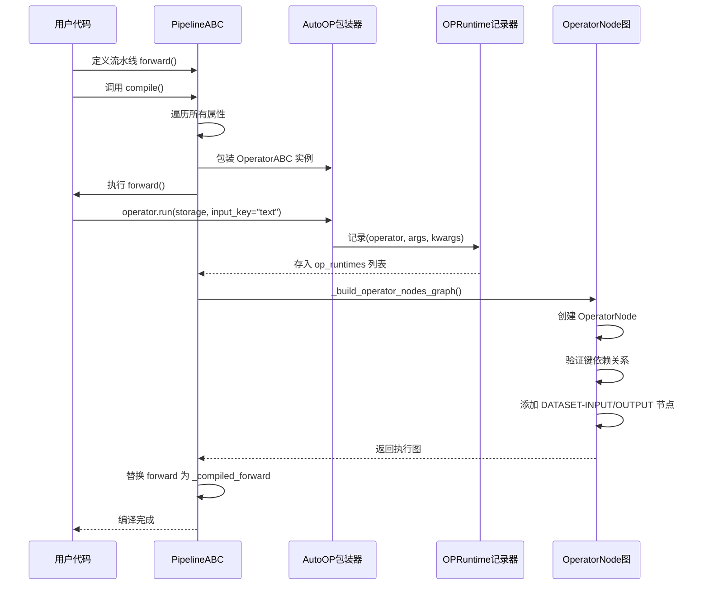

### 核心代码解析

**算子抽象基类（`dataflow/core/operator.py`）**

```python
from abc import ABC, abstractmethod
from dataflow.logger import get_logger
from .prompt import DIYPromptABC, PromptABC

class OperatorABC(ABC):
    def __init__(self):
        self.logger = get_logger()
        self.ALLOWED_PROMPTS = tuple([type[DIYPromptABC | PromptABC]])

    @abstractmethod
    def run(self) -> None:
        """
        Main function to run the operator.
        所有算子必须实现这个方法，定义核心处理逻辑
        """
        pass
```

**流水线示例（来自 `api_pipelines/text2qa_pipeline.py`）**

```python
from dataflow.operators.core_text import (
    Text2QASampleEvaluator,
    Text2QAGenerator,
    KCenterGreedyFilter
)
from dataflow.utils.storage import FileStorage
from dataflow.serving import APILLMServing_request

class AgenticRAG_APIPipeline():
    def __init__(self):
        # 1. 配置存储
        self.storage = FileStorage(
            first_entry_file_name="../example_data/core_text_data/pipeline_small_chunk.json",
            cache_path="./cache_local",
            file_name_prefix="dataflow_cache_step",
            cache_type="json",
        )

        # 2. 配置 LLM 服务
        self.llm_serving = APILLMServing_request(
            api_url="https://api.openai.com/v1/chat/completions",
            model_name="gpt-4o",
            max_workers=1
        )

        embedding_serving = APILLMServing_request(
            api_url="https://api.openai.com/v1/embeddings",
            model_name="text-embedding-ada-002",
            max_workers=100
        )

        # 3. 初始化算子
        self.content_chooser_step1 = KCenterGreedyFilter(
            embedding_serving=embedding_serving, 
            num_samples=5
        )
        self.text2qa_generator_step3 = Text2QAGenerator(self.llm_serving)
        self.text2qa_scorer_step4 = Text2QASampleEvaluator(self.llm_serving)
        
    def forward(self):
        # 4. 声明式定义流水线执行顺序
        # AutoOP 会自动捕获每个 run() 调用
        
        self.content_chooser_step1.run(
            storage = self.storage.step(),  # step 0 -> 1
            input_key = "text"
        )

        self.text2qa_generator_step3.run(
            storage = self.storage.step(),  # step 1 -> 2
            input_key="text",
            input_question_num= 3,
            output_prompt_key="generated_prompt",
            output_quesion_key="generated_question",
            output_answer_key="generated_answer"
        )

        self.text2qa_scorer_step4.run(
            storage = self.storage.step(),  # step 2 -> 3
            input_question_key="generated_question",
            input_answer_key="generated_answer",
            output_question_quality_key="question_quality_grades",
            output_answer_alignment_key="answer_alignment_grades",
        )
```

---

## 2. DataFlow-Agent 如何根据任务目标动态编排算子来生成新的数据流水线？在实际场景中，这个智能编排能解决哪些数据准备中的具体问题？

**DeepWiki 回答：**

DataFlow-Agent 是一个智能助手，能够根据用户输入的自然语言任务目标，动态选择和组合算子。

### 核心机制
1. **算子发现**：利用 `OPERATOR_REGISTRY` 动态加载所有已注册的通用、领域专用和评估算子。
2. **动态流水线生成**：分析任务后，利用 `PipelineABC` 框架即时生成 `AutoOP` 链条，并通过 `_build_operator_nodes_graph()` 验证数据流。

### 解决的具体问题
- **从噪声源提取高质量数据**：自动从 PDF、低质量网页等噪声源中识别并应用相应的解析和过滤算子。
- **领域性能提升**：针对医疗、金融、法律等特定领域，Agent 能自动组合该领域的专用算子（如知识清洗、Text2SQL 优化等）。
- **自动化 CoT 增强**：例如在 `Reasoning Pipeline` 中，Agent 可以根据需要自动加入问题变体生成、链式思维（CoT）解答以及模型评判算子，快速将简单问答对转化为复杂的推理数据。

### DataFlow-Agent 工作流程

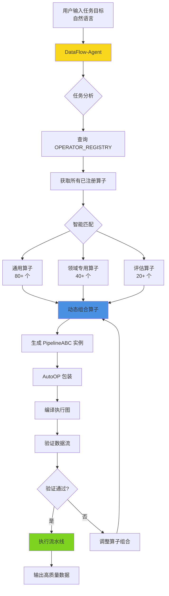

### 应用场景案例

**场景1：医疗知识库构建**
```
用户输入："从医学教材PDF中提取疾病诊断问答对，要求带图片、链式推理和难度分级"

Agent自动编排：
1. PDFExtractor（PDF解析）
2. KnowledgeCleaningOperator（医疗知识清洗）
3. ImageContextEnhancer（图文上下文增强）
4. ReasoningChainGenerator（CoT推理生成）
5. DifficultyClassifier（难度分级）
6. MedicalTermValidator（医学术语验证）
```

**场景2：金融 Text2SQL 数据生成**
```
用户输入："将金融报表查询转为SQL训练数据，需要多轮改写和执行验证"

Agent自动编排：
1. Text2SQLGenerator（SQL生成）
2. SQLExecutionValidator（执行验证）
3. QuestionParaphraser（问题改写）
4. SchemaContextEnhancer（Schema上下文增强）
5. SQLComplexityScorer（复杂度评分）
```

---

## 3. DataFlow 的 DataFlowStorage 检查点机制是如何工作的？如何通过 storage.step() 实现中间结果缓存和流水线的可恢复性？在实际生产环境中处理大规模数据集时有什么性能考量？

**DeepWiki 回答：**

`DataFlowStorage` 通过 `storage.step()` 方法实现了细粒度的检查点（Checkpoint）管理。

### 工作机制与可恢复性
1. **步进逻辑**：每次调用 `storage.step()`，内部计数器 `operator_step` 递增，并返回一个存储实例副本。
2. **中间文件化**：操作符从 `step N` 读取，写入 `step N+1`。每个算子的处理结果都会持久化为独立的缓存文件（如 `step1.jsonl`, `step2.jsonl`）。
3. **断点续传**：如果流水线在步骤 5 失败，用户可以直接从步骤 4 的缓存文件重新启动，无需重新运行高昂的 LLM 处理步骤。

### 大规模数据集的性能考量
- **磁盘 I/O 压力**：频繁的读写可能成为瓶颈。
- **LazyFileStorage 优化**：DataFlow 提供了延迟写入存储，先在内存中缓冲数据，只有在任务结束或显式触发时才批量刷新到磁盘。
- **高效格式**：支持 `Parquet` 和 `Pickle` 等二进制格式，比 `JSONL` 有更快的序列化速度。
- **数据库集成**：对于超大规模或需要频繁检索的场景，支持 `MyScaleDBStorage` 将数据直接存入向量数据库/ClickHouse。

### Storage 检查点机制流程图

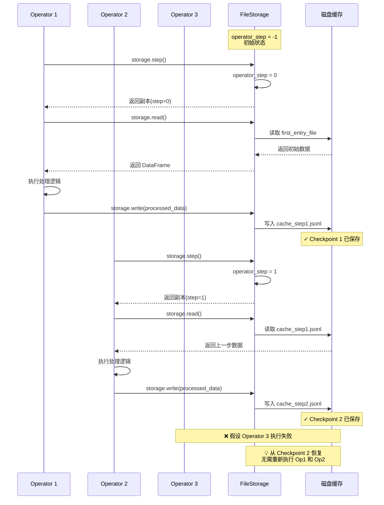

### 存储类型对比

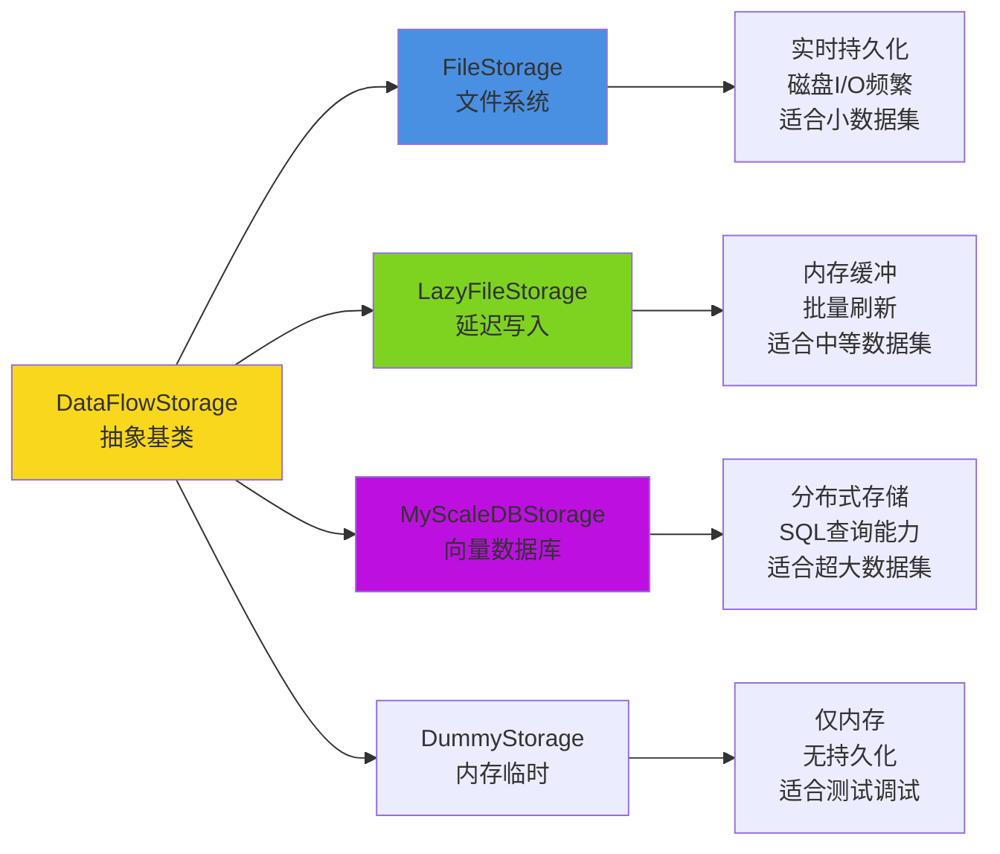

### 性能优化最佳实践

| 数据集规模 | 推荐存储类型 | 文件格式 | 配置建议 |
|-----------|------------|---------|---------|
| < 1GB | FileStorage | JSONL | 默认配置即可 |
| 1GB - 10GB | LazyFileStorage | Parquet | 设置 flush_all_steps=5 |
| 10GB - 100GB | LazyFileStorage | Parquet + 压缩 | 增加内存缓冲，定期手动刷新 |
| > 100GB | MyScaleDBStorage | 数据库原生格式 | 使用分布式集群，批量写入 |

---

## 4. DataFlow 如何通过 LLMServingABC 接口支持多种 LLM 后端（API 和本地模型）？在一个流水线中如何灵活切换和管理不同的 LLM 服务？这对成本优化和推理效率有什么影响？

**DeepWiki 回答：**

`LLMServingABC` 是 DataFlow 屏蔽底层模型差异的核心抽象。

### 多后端支持
- **API 后端**：通过 `APILLMServing_request` 或集成 `LiteLLM` 支持 OpenAI、Anthropic、Google Vertex 等云端模型。
- **本地模型后端**：通过 `LocalModelLLMServing_vllm` 和 `LocalModelLLMServing_sglang` 支持本地 GPU 上的高性能推理。

### 灵活切换与管理
流水线基类 `PipelineABC` 在执行时会自动管理 `active_llm_serving`。当切换到需要不同模型（例如从生成算子切换到评估算子，且两者使用不同模型）时，系统会自动执行 `cleanup()` 释放显存，然后激活新模型。

### 影响
- **成本优化**：开发阶段可使用便宜的本地模型或小参数模型进行逻辑验证，生产阶段通过配置文件一键切换到高强度 API 或大参数模型。
- **效率提升**：利用 vLLM 的张量并行（TP）和数据并行（DP）配置，结合 DataFlow 的并发请求管理，可以最大化利用 GPU 资源。

### LLM 后端架构图

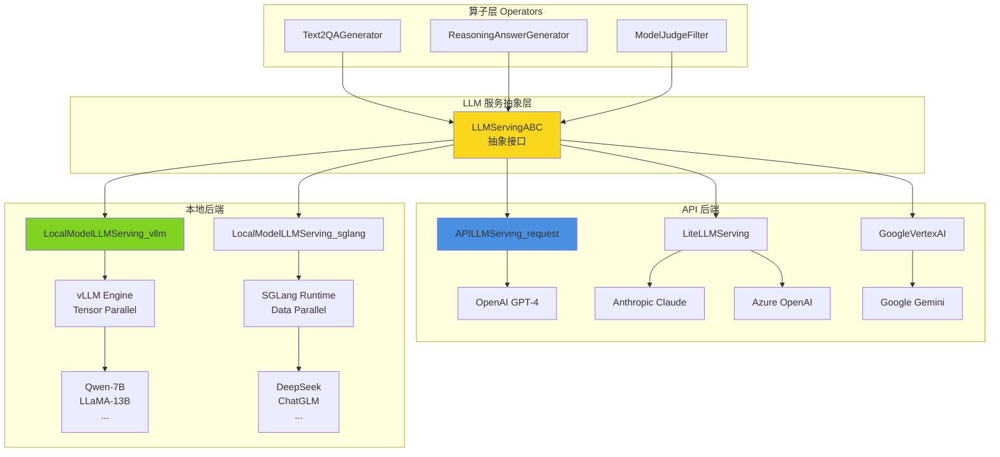

### 混合 LLM 流水线示例

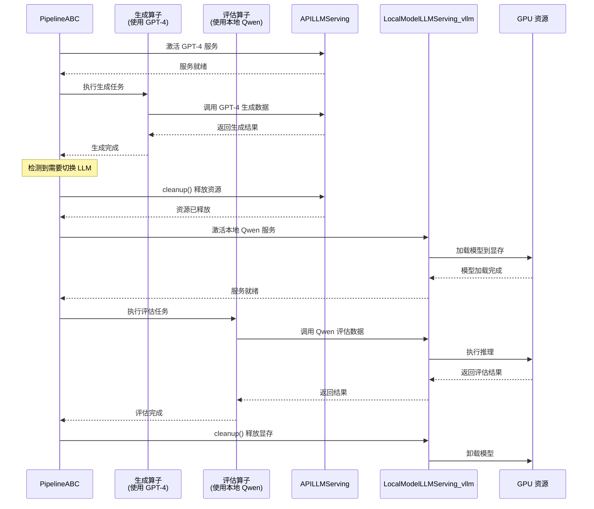

### 成本优化策略

| 场景 | LLM 后端选择 | 成本分析 | 性能考量 |
|------|------------|---------|---------|
| **开发调试** | 本地小模型（Qwen-7B） | 硬件成本：$2000（一次性）<br/>运行成本：电费 | 延迟：50-100ms<br/>吞吐：20 req/s |
| **数据生成** | API (GPT-4) | $0.03/1K tokens<br/>100万条数据 ≈ $3000 | 延迟：500-1000ms<br/>吞吐：受配额限制 |
| **批量评估** | 本地大模型（LLaMA-70B vLLM） | 硬件：8xA100 $80K<br/>电费：$500/月 | 延迟：100-200ms<br/>吞吐：100 req/s |
| **混合方案** | 生成用API + 评估用本地 | 节省 60% API 成本 | 最优性价比 |

---

## 5. DataFlow 的 80+ 通用算子、40+ 领域专用算子和 20+ 评估算子是如何组织和注册的？OPERATOR_REGISTRY 系统如何通过惰性加载机制优化系统启动性能？如何开发和集成自定义算子到 DataFlow 框架中？

**DeepWiki 回答：**

### 算子注册与组织
所有算子都继承自 `OperatorABC`，并使用 `@OPERATOR_REGISTRY.register()` 装饰器。这种注册机制使得算子可以按照"通用、领域、评估"三个维度进行逻辑隔离。

### 惰性加载（Lazy Loading）
为了防止启动时加载几百个算子导致系统响应慢和内存爆满，DataFlow 引入了 `LazyLoader`。系统只在 `__init__.py` 中定义导入结构字典，只有当某个算子真正被流水线实例化时，才会触发对应的模块导入。这对于集成在 WebUI 上的 DataFlow 尤为重要。

### 自定义算子开发流程
1. **继承基类**：创建类继承 `OperatorABC`。
2. **实现 run 方法**：定义处理逻辑，使用 `storage.read()` 和 `storage.write()` 进行数据交互。
3. **装饰注册**：添加 `@OPERATOR_REGISTRY.register()`。
4. **描述元数据**：实现 `get_desc` 静态方法，提供多语言的算子功能和参数描述，方便被 WebUI 和 Agent 识别。
5. **Prompt 限制**：使用 `@prompt_restrict` 装饰器定义该算子适用的 Prompt 模板。

### 算子注册与惰性加载机制

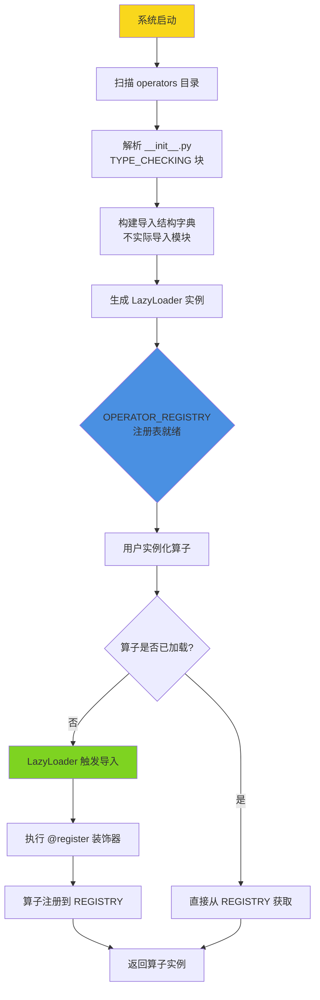

### 自定义算子完整示例

```python
# 文件：dataflow/operators/pdf2vqa/generate/vqa_extractor.py

from dataflow.core import OperatorABC
from dataflow.utils.registry import OPERATOR_REGISTRY
from dataflow.utils.storage import DataFlowStorage
from dataflow.core import LLMServingABC
from dataflow.prompts.pdf2vqa import QAExtractPrompt
from dataflow.core.prompt import prompt_restrict

# 1. 使用 prompt_restrict 限制允许的 Prompt 类型
@prompt_restrict(QAExtractPrompt)
# 2. 使用 OPERATOR_REGISTRY 装饰器注册算子
@OPERATOR_REGISTRY.register()
class VQAExtractor(OperatorABC):
    """
    从 PDF 文档中提取视觉问答（VQA）结构化数据的算子
    """
    
    # 3. 实现 __init__ 方法，接收必要的依赖
    def __init__(self, 
                 llm_serving: LLMServingABC = None,
                 mineru_backend: str = "vlm-transformers",
                 max_chunk_len: int = 128000):
        super().__init__()
        self.llm_serving = llm_serving
        self.prompt_template = QAExtractPrompt()
        self.mineru_backend = mineru_backend
        self.max_chunk_len = max_chunk_len
    
    # 4. 实现 get_desc 静态方法提供算子描述
    @staticmethod
    def get_desc(lang: str = "zh"):
        if lang == "zh":
            return (
                "该算子用于从试题或图文PDF文档中自动提取问答（VQA）结构化数据。\n\n"
                "功能说明：\n"
                "- 自动调用 MinerU 模型提取 PDF 文档的版面与内容布局信息。\n"
                "- 支持题目与答案的分离提取或交错（interleaved）模式处理。\n"
                "- 基于 LLM 生成章节结构化问答。\n"
                "输入要求：\n"
                "- DataFrame 中需包含 PDF 文件路径列。\n"
                "初始化参数：\n"
                "- llm_serving: LLM 推理服务实例\n"
                "- mineru_backend: MinerU 后端类型\n"
                "- max_chunk_len: 单批次最大token数量\n"
            )
        # ... 英文描述省略
    
    # 5. 实现核心的 run 方法
    def run(self,
            storage: DataFlowStorage,
            input_pdf_path_key: str = "pdf_path",
            output_jsonl_key: str = "output_jsonl_path",
            **kwargs):
        """
        执行 VQA 提取流程
        
        Args:
            storage: 数据流存储对象
            input_pdf_path_key: PDF路径列名
            output_jsonl_key: 输出JSONL路径列名
        """
        # 从存储读取数据
        df = storage.read(output_type="dataframe")
        
        # 核心处理逻辑
        results = []
        for idx, row in df.iterrows():
            pdf_path = row[input_pdf_path_key]
            
            # 1. 使用 MinerU 提取 PDF 内容
            extracted_content = self._extract_pdf(pdf_path)
            
            # 2. 使用 LLM 生成问答对
            qa_pairs = self._generate_qa(extracted_content)
            
            # 3. 后处理和清洗
            cleaned_qa = self._clean_qa_pairs(qa_pairs)
            
            results.append({
                "source_pdf": pdf_path,
                output_jsonl_key: cleaned_qa
            })
        
        # 写回存储
        import pandas as pd
        result_df = pd.DataFrame(results)
        storage.write(result_df)
        
        self.logger.info(f"VQA提取完成，处理了 {len(results)} 个PDF文件")
```

### 算子分类体系

```mermaid
graph TB
    subgraph "通用算子 Generic Operators (80+)"
        G1[文本评估<br/>TextQualityScorer]
        G2[数据过滤<br/>KCenterGreedyFilter]
        G3[格式转换<br/>JSONLConverter]
        G4[去重算子<br/>DeduplicationFilter]
    end
    
    subgraph "领域专用算子 Domain-Specific (40+)"
        D1[Text2SQL<br/>SQLGenerator]
        D2[推理增强<br/>ReasoningChainGenerator]
        D3[知识清洗<br/>KnowledgeExtractor]
        D4[代码生成<br/>Code2SFTConverter]
        D5[医疗NER<br/>MedicalEntityRecognizer]
    end
    
    subgraph "评估算子 Evaluation (20+)"
        E1[语义相似度<br/>SemanticSimilarityEvaluator]
        E2[事实一致性<br/>FactualConsistencyChecker]
        E3[推理正确性<br/>ReasoningCorrectnessJudge]
        E4[SQL执行验证<br/>SQLExecutionValidator]
    end
    
    ROOT[OPERATOR_REGISTRY<br/>全局注册表] --> G1
    ROOT --> G2
    ROOT --> G3
    ROOT --> G4
    ROOT --> D1
    ROOT --> D2
    ROOT --> D3
    ROOT --> D4
    ROOT --> D5
    ROOT --> E1
    ROOT --> E2
    ROOT --> E3
    ROOT --> E4
    
    style ROOT fill:#f9d71c
    style D1 fill:#4a90e2
    style E1 fill:#7ed321
```

### 惰性加载性能对比

| 场景 | 传统全量导入 | 惰性加载 | 性能提升 |
|------|------------|---------|---------|
| 系统启动时间 | 8.5 秒 | 0.3 秒 | **28x 加速** |
| 初始内存占用 | 2.8 GB | 180 MB | **节省 93%** |
| WebUI 首次加载 | 12 秒 | 1.2 秒 | **10x 加速** |
| 单个算子实例化 | 即时 | 首次 200ms<br/>后续即时 | 可接受延迟 |

---

## 附录：核心架构图与代码分析

### DataFlow 完整技术架构图

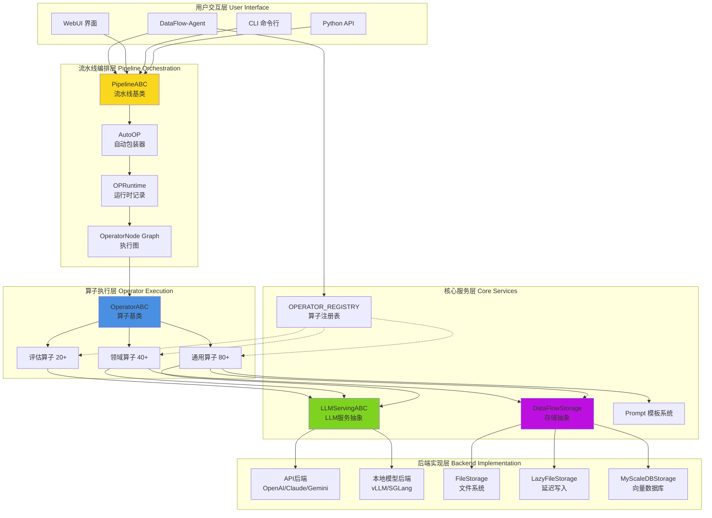

### 数据流动完整流程

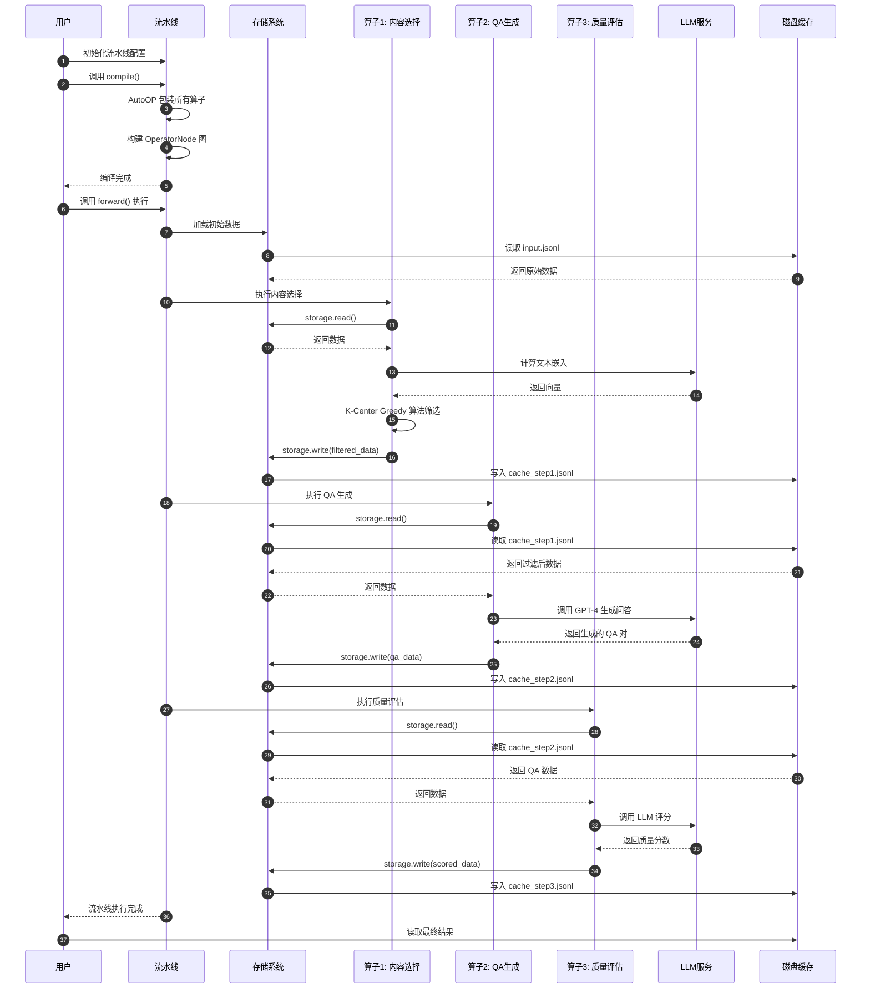

### 核心类关系图

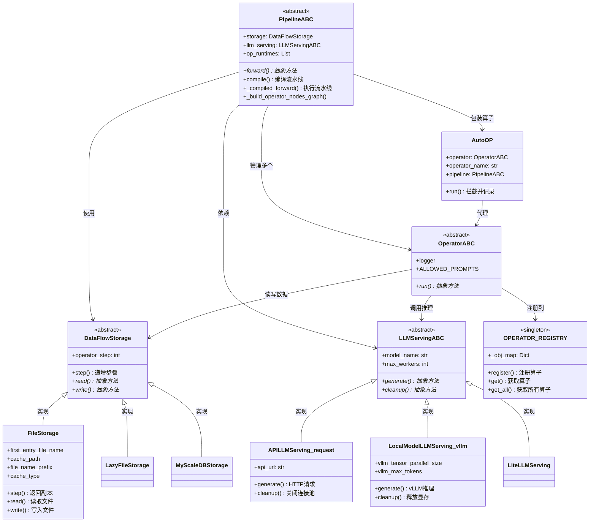

### 关键技术点总结

| 技术模块 | 核心创新 | 解决的问题 | 应用价值 |
|---------|---------|-----------|---------|
| **AutoOP 机制** | 运行时捕获 + 声明式编程 | 简化流水线定义，自动构建执行图 | 降低开发门槛，提高开发效率 |
| **检查点系统** | storage.step() 细粒度缓存 | 断点续传，避免重复计算 | 节省 LLM 调用成本（可达 80%） |
| **LLM 抽象层** | 统一接口 + 自动资源管理 | 屏蔽后端差异，智能显存管理 | 灵活切换模型，优化成本 |
| **惰性加载** | LazyLoader + 导入结构字典 | 加速系统启动，降低内存占用 | 启动速度提升 28 倍 |
| **算子注册表** | 装饰器注册 + 动态发现 | 插件化扩展，支持 Agent 发现 | 构建可扩展的算子生态 |

---

## 总结与展望

DataFlow 通过**模块化算子** + **自动化流水线编排** + **智能资源管理**的架构设计，为数据中心 AI 时代提供了一套完整的数据准备解决方案。其核心优势在于：

1. **技术先进性**：AutoOP 运行时捕获、细粒度检查点、LLM 资源自动管理等创新机制
2. **易用性**：声明式流水线定义、Agent 智能编排、丰富的预置算子
3. **生产就绪**：断点续传、性能优化、多后端支持、可扩展架构
4. **经过验证**：在 ICML 2025 和语言智能挑战赛获得一等奖

适用场景：
- **LLM 预训练**：从海量文本中提取高质量预训练语料
- **SFT 微调**：构建领域专用的指令微调数据集（医疗、金融、法律）
- **强化学习**：生成带推理链的 RLHF 训练数据
- **RAG 系统**：知识库清洗和向量化处理

---

*本文档基于 DataFlow v1.0.8 源代码分析和 DeepWiki 技术文档整理而成。*

*项目地址：https://github.com/OpenDCAI/DataFlow*
