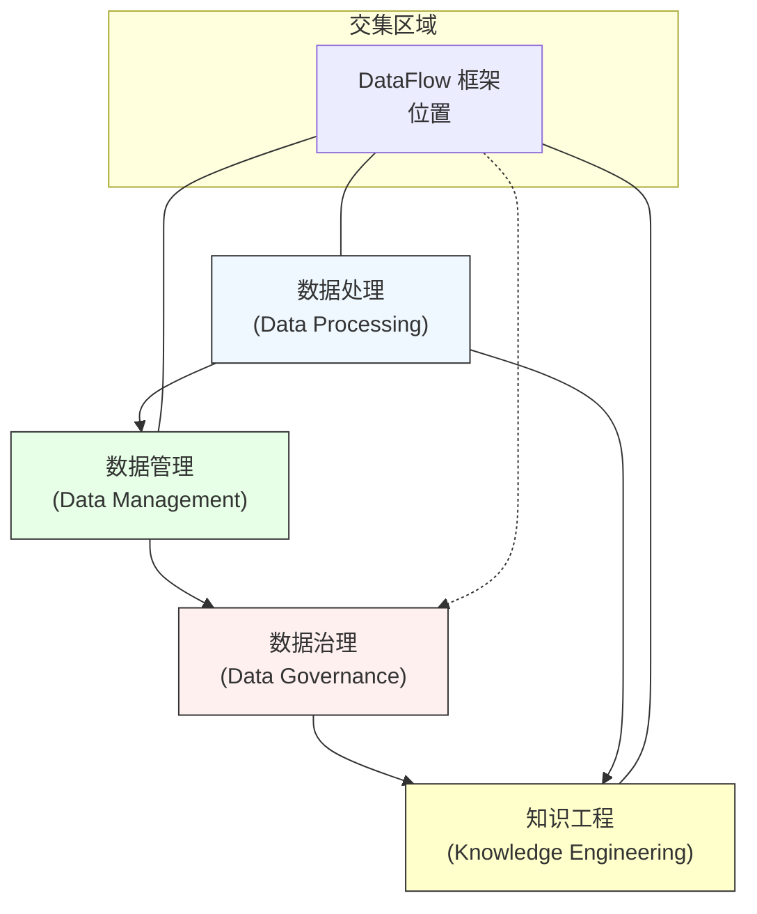

# 我问
你觉得数据处理、数据管理、数据治理，知识工程，的区别是啥？然后论文标题「DataFlow：在数据中心化 AI 时代，为统一数据准备和工作流自动化而打造的LLM驱动框架」应该属于什么？还是他们之间的交集？你可以用mermaid展示下

# gpt5
好的，我已经仔细通读了你贴的 **DataFlow** 论文内容，这个框架的功能和定位非常清楚，所以现在我可以更精准地回答你这个问题，并且用 mermaid 可视化它与 **数据处理 / 数据管理 / 数据治理 / 知识工程** 的关系，以及它在这些概念交集中的位置。

---

## 1️⃣ 四个概念的精准区别（结合论文内容）

### **数据处理 (Data Processing)**
- **定义**：具体的数据操作与转换过程，直接对原始数据进行清洗、转换、生成、评估等。
- **在 DataFlow 中**：几乎所有的 Operator（generate / evaluate / filter / refine）都属于典型的数据处理行为，如生成 SQL、过滤错误数据、清理文本等。
- **粒度**：是最细的“操作层”。

---

### **数据管理 (Data Management)**
- **定义**：面向技术实现的数据全生命周期管理（组织、存储、访问、版本、元数据等）。
- **在 DataFlow 中**：
  - Global Storage Abstraction（统一表格结构，read/write API）
  - Pipeline Composition（DAG编排、依赖管理、复用）
  - Backend-agnostic Serving（统一 LLM 推理 API）
  这些是对数据进行系统化管理的能力。
- **粒度**：是“系统层”，关注数据在系统中如何被组织和可用。

---

### **数据治理 (Data Governance)**
- **定义**：组织层面的策略与标准制定，确保数据质量、安全、合规以及一致性。强调“制度”和“规则”。
- **在 DataFlow 中**：
  - 并没有显式的策略/权限/合规模块，但它的高质量 pipeline（自动验证、过滤、质量评估）是**数据治理中“数据质量保障”部分的技术支撑**。
  - 如果一个机构将 DataFlow 的 pipelines + agent orchestration 放入数据生产流程，并制定统一标准，那它就是数据治理实施的一部分工具。
- **粒度**：是“组织治理层”，技术只是手段。

---

### **知识工程 (Knowledge Engineering)**
- **定义**：获取、表示和应用知识，让机器能够推理和执行任务。包含知识建模、知识图谱、规则系统等。
- **在 DataFlow 中**：
  - 大量的任务是**知识获取与知识构建**（例如文本到 SQL 的语义映射、Math reasoning chain-of-thought、AgenticRAG 的多跳推理数据）
  - 这些本质是**领域知识的形式化表达**（结构化 SQL、推理链条），以及用 LLM 提取、生成这种知识
  - DataFlow-Agent 可以被认为是一个自动化的知识获取与建模助手（将自然语言转成可执行的 pipeline）。
- **粒度**：是“知识层”，与 AI 密切相关。

---

## 2️⃣ DataFlow 标题归属判断

**标题**：
> DataFlow: An LLM-Driven Framework for Unified Data Preparation and Workflow Automation in the Era of Data-Centric AI

结合论文内容：
- **数据处理**：几乎涵盖所有 Operator 对数据的微观加工（Generate/Evaluate/Filter/Refine）。
- **数据管理**：提供抽象的存储、统一 API、pipeline 管理与复用。
- **数据治理**：间接支撑数据质量提升与标准化，但不包含策略制定环节。
- **知识工程**：明确涉及知识获取（如结构化 SQL、推理链）、知识表示（链路化 prompt、CoT）和任务化应用。

💡 **结论**：
- 它是 **数据处理 + 数据管理 + 知识工程** 的深度交集，数据治理是外围受益层。
- 更确切定位：**技术型数据准备系统，侧重知识工程化的数据生成与加工**。

---

## 3️⃣ Mermaid 可视化关系与交集

**图解**：
- **数据处理 & 数据管理**：DataFlow 是底层和系统层的技术结合——它既做微观加工，又提供管理抽象。
- **知识工程**：它用 LLM 驱动知识的生成/提炼/表示，是知识工程的技术体现。
- **数据治理**：虽然不是直接目标，但它的高质量标准化数据管道能成为治理实施环节的工具。

---

## 4️⃣ 总结一句话定位

> **DataFlow 是一个 LLM 驱动的统一数据准备与流程自动化平台，位于“数据处理 + 数据管理 + 知识工程”的交集，间接支撑数据治理，核心价值是高质量、可复用、可扩展的知识化数据生成与加工。**