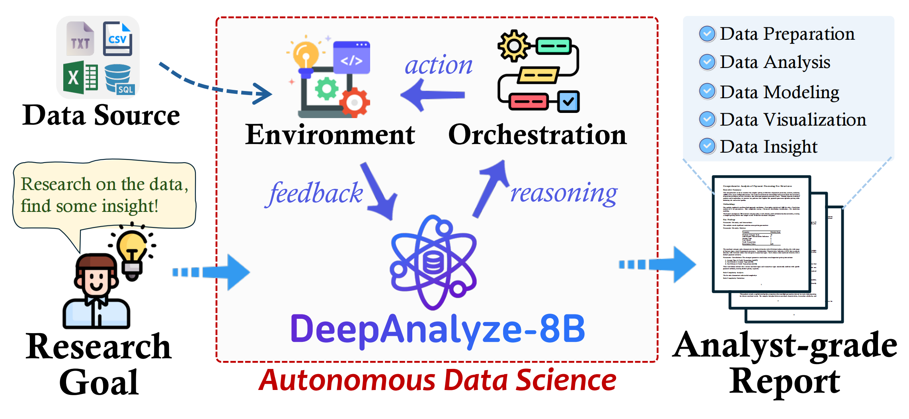
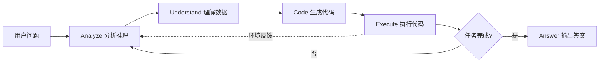
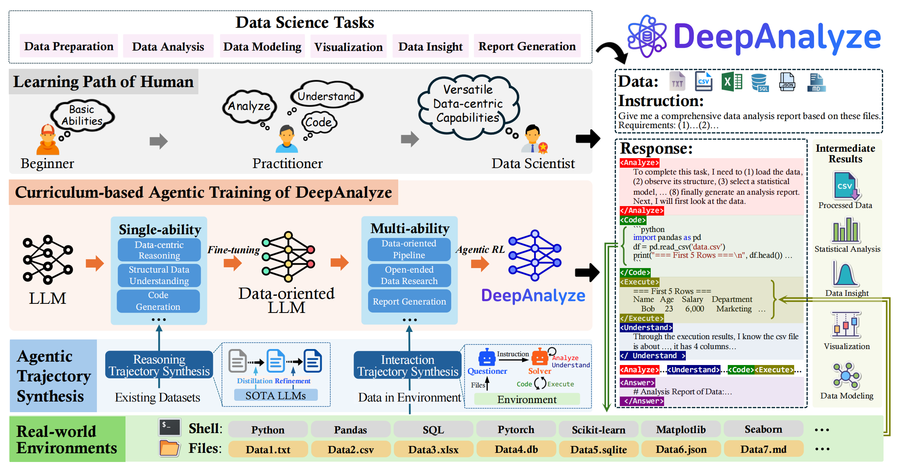
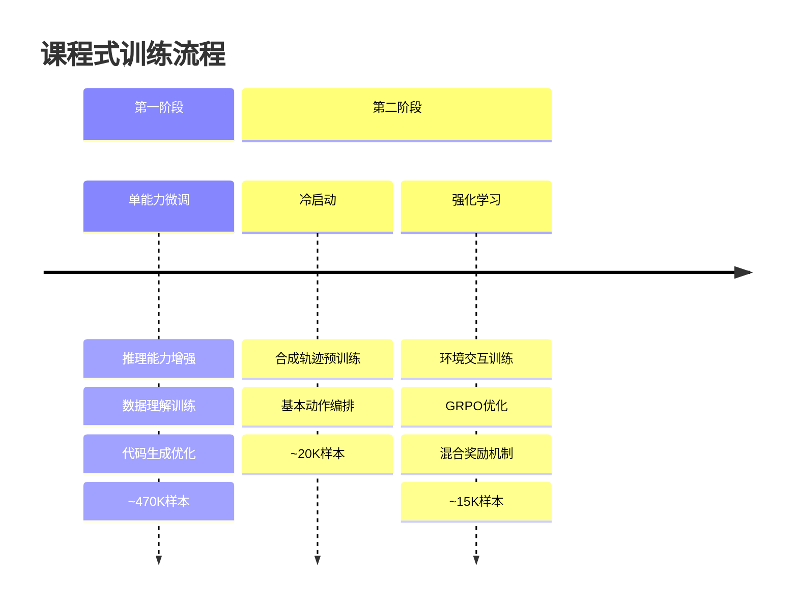
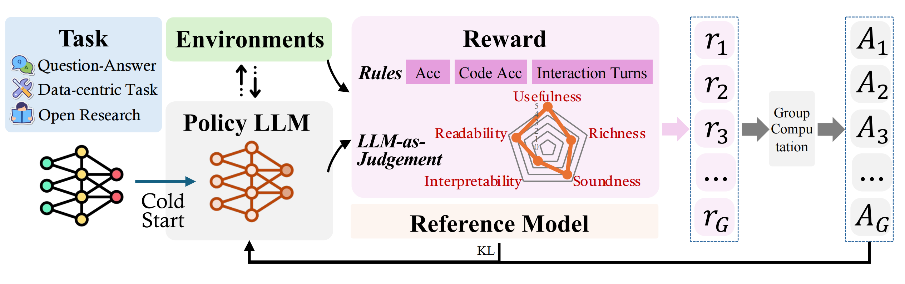
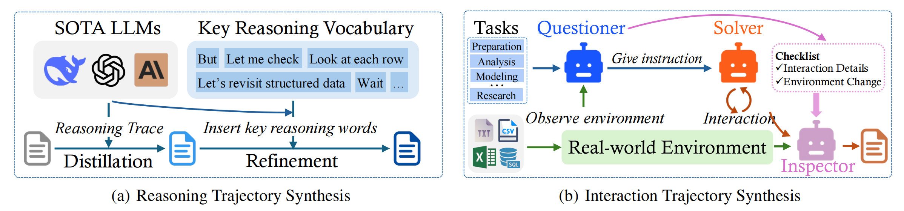
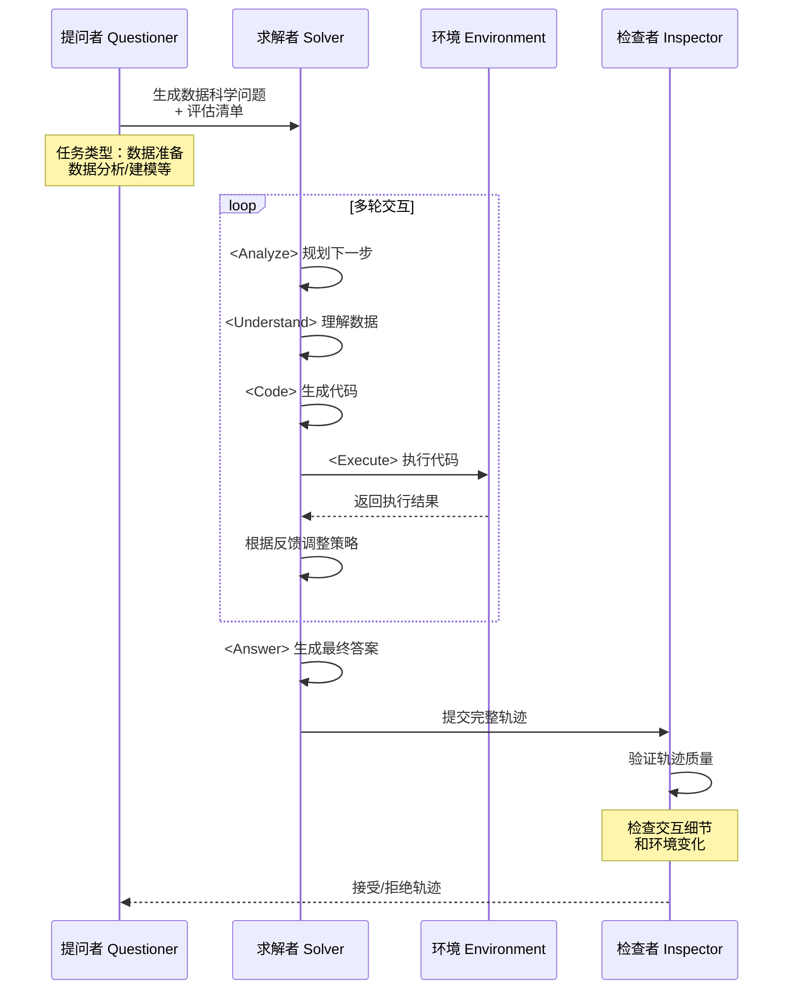
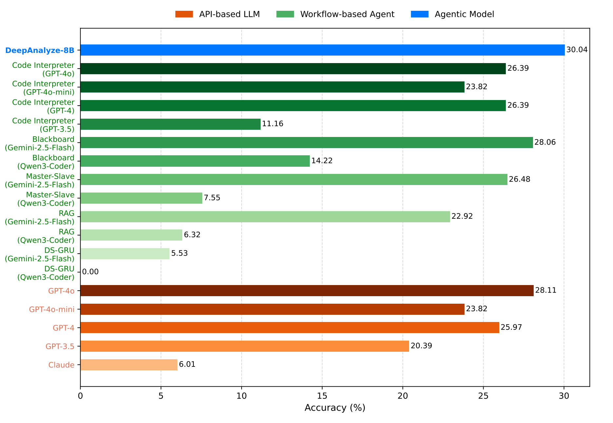
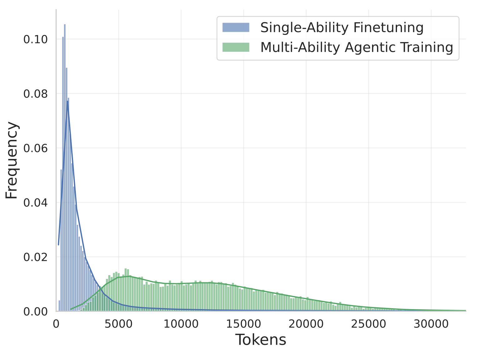

# DeepAnalyze：首个面向自主数据科学的智能体大模型

## 引言

从原始数据到分析师级别的深度研究报告，这是数据科学领域长期以来的核心目标。然而现有方案存在两大局限：**领域专用LLM**仅能处理单一任务，缺乏自主协调能力；**基于工作流的智能体**依赖预定义流程，无法真正实现自主性。

人民大学和清华大学联合推出的**DeepAnalyze-8B**，是首个面向自主数据科学的端到端智能体大模型。仅用80亿参数，它就能完成从数据源到分析报告的完整流程，在12个基准测试中超越大多数先进的专有LLMs。



## 核心设计：五大动作编排数据科学流程

DeepAnalyze通过**五大核心动作**实现对复杂数据科学任务的自主编排：



- **`<Analyze>`** - 文本分析能力，包括任务规划、推理、反思等认知活动
- **`<Understand>`** - 专门设计的结构化数据理解动作，独立于推理过程
- **`<Code>`** - 生成与数据交互的Python代码
- **`<Execute>`** - 执行代码并收集环境反馈
- **`<Answer>`** - 生成最终的分析报告或答案

这种设计的独特之处在于，**将结构化数据理解能力从推理过程中解耦**。消融实验表明，移除`<Understand>`动作会导致WikiTQ和MultiHiertt等数据理解任务性能明显下降。



## 课程式智能体训练：模拟人类学习路径

DeepAnalyze采用**课程式智能体训练范式**，模拟人类数据科学家的成长过程：



### 第一阶段：单能力微调

使用约47万个带推理轨迹的长链思维数据，针对性强化：
- **推理能力**（对应`<Analyze>`）
- **结构化数据理解**（对应`<Understand>`）  
- **代码生成**（对应`<Code>`）

### 第二阶段：多能力智能体训练

1. **冷启动阶段**：在合成的交互轨迹上微调，学习基本动作编排
2. **强化学习阶段**：使用GRPO算法在真实环境中训练，通过混合奖励机制优化策略

实验证明，这种渐进式训练比直接混合训练（One-stage Training）更有效。仅进行单能力训练的模型在DABStep复杂任务上仅得15.34分，而完整课程式训练达到38.88分。



## 数据合成框架：破解高质量数据稀缺难题

高质量训练数据的稀缺是训练数据科学智能体的核心挑战。DeepAnalyze提出**数据驱动的轨迹合成框架**，包括推理轨迹合成和交互轨迹合成两大机制。



### 推理轨迹合成：从简单答案到深度推理

现有TableQA数据集通常只包含问题和答案，缺少中间推理过程。推理轨迹合成通过**两步法**解决这一问题：

**1. 蒸馏步骤（Distillation）**

使用SOTA闭源LLM（如GPT-4o）作为教师模型，从原始数据中提取推理轨迹：

```python
# 原始数据示例
{
    "question": "表格中第二季度销售额增长了多少？",
    "answer": "15%"
}

# 蒸馏后数据
{
    "question": "...",
    "reasoning": [
        "首先查看数据表结构，发现包含季度、销售额列",
        "计算每个季度的销售额总和",
        "注意到Q2销售额从Q1的100万增加到115万，增长15%",
        "验证数据完整性，确保没有缺失值"
    ],
    "answer": "15%"
}
```

**2. 关键词引导的精炼步骤（Refinement）**

闭源LLM虽然推理能力强，但并未专门针对结构化数据训练，容易忽略数据细节。通过插入**推理关键词**引导模型关注结构化数据：

```python
# 构建关键推理词汇表
reasoning_keywords = [
    "What happens at the boundaries?",
    "Let's review the prior reasoning",
    "Let's take a closer look at the table",
    "Wait, let me verify...",
    "But we should check..."
]

# 精炼后的推理轨迹
refined_reasoning = [
    "首先查看数据表结构",
    "**But let's take a closer look at the table** - 发现Q2数据",
    "计算增长率为15%",
    "**Wait, let me verify** - 检查是否有异常值",
    "**Let's review the prior reasoning** - 确认计算正确"
]
```

下图展示了关键词精炼前后的效果对比。可以看到，精炼后的推理轨迹展现出**更强的数据检查和反思能力**。

.png)
.png)
.png)

### 交互轨迹合成：多智能体协同生成

多轮环境交互数据极其稀缺，DeepAnalyze设计了**三角色多智能体系统**从NL2SQL数据集（Spider、BIRD）合成完整交互轨迹：



**提问者（Questioner）** 的职责：
- 观察环境中的数据源
- 根据任务类型（数据准备、分析、建模、洞察、开放研究）生成问题
- 制定评估清单（交互约束、环境约束）

**求解者（Solver）** 使用五大动作与环境交互：

```python
# 交互轨迹示例
trajectory = [
    {
        "action": "Analyze",
        "content": "需要先了解数据结构和质量"
    },
    {
        "action": "Understand", 
        "content": "检查sales_data.csv的表结构",
        "observation": "数据包含1000行，5列：date, product, region, sales, price"
    },
    {
        "action": "Code",
        "content": "import pandas as pd\ndata = pd.read_csv('sales_data.csv')\nprint(data.describe())"
    },
    {
        "action": "Execute",
        "result": "统计结果显示无缺失值，sales范围100-5000"
    },
    {
        "action": "Analyze",
        "content": "发现需要进行季节性分析"
    },
    # ... 更多交互轮次
    {
        "action": "Answer",
        "content": "完成季节性分析和销售额预测，已生成prediction.csv"
    }
]
```

**检查者（Inspector）** 进行质量控制：
- 验证是否符合检查清单
- 检查环境变化（如是否生成了指定文件）
- 决定接受或拒绝轨迹

这种**基于交互细节和环境变化的双重过滤机制**，显著提高了合成数据的质量。

## 性能评估：全面超越工作流智能体

DeepAnalyze-8B在多个基准测试上展现出卓越性能：

### 数据分析与建模能力

在DataSciBench的数据建模任务上，DeepAnalyze-8B达到**38.88%**的准确率，超越了基于Claude-3.5-Sonnet的I2l-Agent（36.44%）。特别是在困难级别任务中，DeepAnalyze-8B得分**32.80%**，远超GPT-4.1的12.43%。



### TableQA能力

在7个TableQA基准测试上，DeepAnalyze-8B平均得分**64.47%**，超过DeepSeek-R1-0528（60.22%）和GPT-4o（58.96%）。

消融实验证实了两阶段训练的重要性：
- 仅单能力训练：54.80%（DS-1000）
- 仅多能力训练：53.20%（DS-1000）
- **课程式完整训练：61.70%**（DS-1000）

### 开放式数据研究

在新构建的DABStep-Research基准上，DeepAnalyze-8B在所有五个类别（数据准备、分析、洞察、报告生成、开放研究）中均取得**最佳性能**。

特别值得注意的是，基于专有LLM的智能体在开放式研究任务上表现明显下滑，而DeepAnalyze-8B由于在真实环境中训练，能有效处理**无预定义指令的完全开放研究**。

## 训练数据与计算资源

DeepAnalyze开源了完整的训练数据集**DataScience-Instruct-500K**：

- 单能力微调：470K样本
- 多能力冷启动：20K样本  
- 强化学习：15K样本

数据长度分布显示，单能力阶段序列长度集中在8K tokens，多能力阶段达到32K tokens，充分体现了数据科学任务的复杂性。



训练基础：
- 基座模型：DeepSeek-R1-0528-Qwen3-8B
- 训练框架：ms-swift + SkyRL
- 硬件环境：NVIDIA A800 GPU

## 核心代码实现

### 轨迹生成核心流程

```python
async def agent_loop(
    self,
    prompt: ConversationType,
    env_class: str,
    env_extras: Dict[str, Any],
    max_tokens: int,
) -> Tuple[List[int], float, str, List[int]]:
    """多轮生成循环，执行单个轨迹"""
    
    # 创建环境实例
    env = skyrl_gym.make(env_class, env_config=env_config, extras=env_extras)
    chat_history = copy.deepcopy(prompt)
    done = False
    
    # 初始化环境
    chat_history, _ = env.init(chat_history)
    
    # 多轮交互循环
    while not done:
        # 调用推理引擎生成输出
        engine_output = await self.inference_engine_client.generate(
            InferenceEngineInput(
                prompts=[chat_history],
                sampling_params=sampling_params
            )
        )
        output = engine_output["responses"][0]
        
        # 环境执行动作
        env_step_output = env.step(output)
        new_obs = env_step_output["observations"]
        reward = env_step_output["reward"]
        done = env_step_output["done"]
        
        # 更新对话历史
        chat_history = self._update_chat_history(
            chat_history, output, new_obs
        )
        
        if len(input_ids) > max_input_length:
            break
    
    return response_ids, reward, stop_reason, loss_mask
```

### 多智能体轨迹合成

```python
class TrajectoryResult:
    """轨迹结果数据结构"""
    instance_id: str
    trajectory_id: str
    messages: List[Dict[str, str]]  # OpenAI格式消息
    state: Any                       # 运行时状态
    results: Optional[Dict]          # 任务结果
    error: Optional[str]             # 错误信息
    finish: bool                     # 完成标志
    finish_reason: str               # 完成原因
    reward: Optional[float]          # 奖励值

async def generate_trajectory(self):
    """生成单条交互轨迹"""
    agent = self.agent
    runtime = agent.runtime
    
    # 运行控制器执行Agent循环
    state = await run_controller(
        config=agent.app_config,
        initial_user_action=agent.instruction,
        runtime=runtime,
        agent=agent,
    )
    
    # 获取最终消息和结果
    final_messages = agent.get_final_messages(state)
    result = await self.task.complete_runtime(runtime, instance)
    
    # 构建轨迹结果
    return TrajectoryResult({
        'instance_id': self.instance_id,
        'trajectory_id': self.trajectory_id,
        'messages': final_messages,
        'state': state,
        'results': result,
        'finish': finish,
        'finish_reason': finish_reason,
    })
```

## 总结与展望

DeepAnalyze-8B标志着**从基于工作流的智能体向可训练智能体模型的范式转变**。其核心贡献包括：

1. **架构创新**：五大动作设计，将数据理解从推理中解耦
2. **训练范式**：课程式智能体训练，模拟人类学习路径
3. **数据合成**：关键词引导的推理轨迹精炼 + 多智能体交互轨迹合成
4. **实际效果**：仅80亿参数即可完成端到端自主数据科学

未来方向包括：
- 扩展到更多数据类型（时序数据、图数据等）
- 增强多模态数据处理能力
- 在数据治理、数据发现等领域的应用

DeepAnalyze的模型、代码和训练数据已完全开源，为下一代智能数据系统铺平了道路。

---

**参考资源**：
- 论文：*DeepAnalyze: Agentic Large Language Models for Autonomous Data Science*
- 项目主页：[ruc-deepanalyze.github.io](https://ruc-deepanalyze.github.io)
- GitHub：[ruc-datalab/DeepAnalyze](https://github.com/ruc-datalab/DeepAnalyze)
- RL框架：[SkyRL](https://github.com/NovaSky-AI/SkyRL)
- 模型下载：DeepAnalyze-8B
- 数据集：DataScience-Instruct-500K

