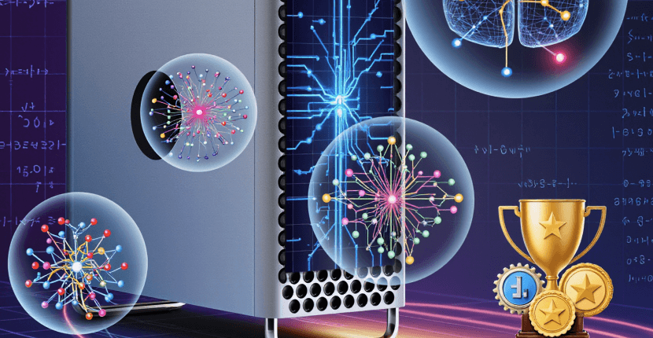
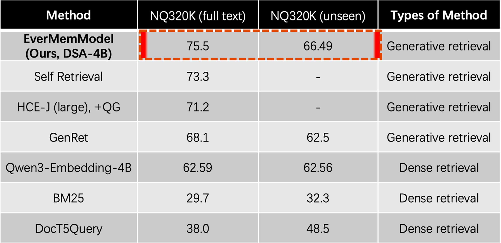
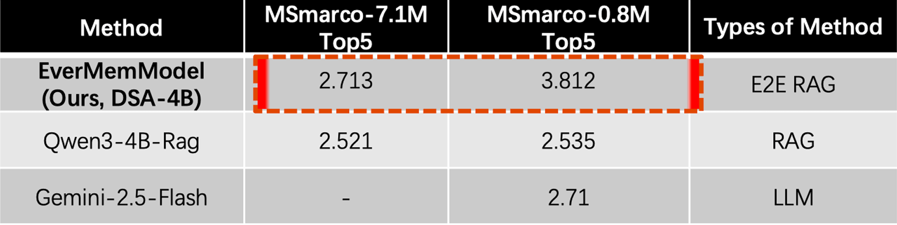

# Beyond RAG：EverMemModel Achieves SOTA by Ingesting Entire Databases at Once | EverMind Blog

原文链接: https://everm.ai/blog/beyound_rag_evermemmmodel_achieves_sota_by_ingesting_entire_databases_at_once/

# Beyond RAG：EverMemModel Achieves SOTA by Ingesting Entire Databases at Once

EverMind researchers

Published at October 18, 2025

About 1 minutes to read

#SOTA 
#long-term memory 
#retrieval 
#QA 
#NQ320K

The EverMemModel has achieved SOTA performance both on retrieval task and QA task.

 

The EverMemModel achieves a technological breakthrough by allowing users to input the entire retrieval database along with their query into the model, which then rapidly returns reference document IDs and answers.

**Retrieval Task**: On NQ320K (full text), it achieves a Recall@1 of 75.5. For the unseen test set, the Recall@1 metric reaches 66.49, ultimately achieving SOTA on both NQ320K leaderboards.

**QA Task**: The DSA method performs QA directly on contexts up to 7.1M in length without relying on Embedding retrieval. When compared to the RAG method based on Qwen3-Embedding-4B + Qwen3-4B-Instruct and the Gemini 2.5 Flash method, it outperforms both (the metric in the table is the LLM Judgment score for Gemini 2.5).

