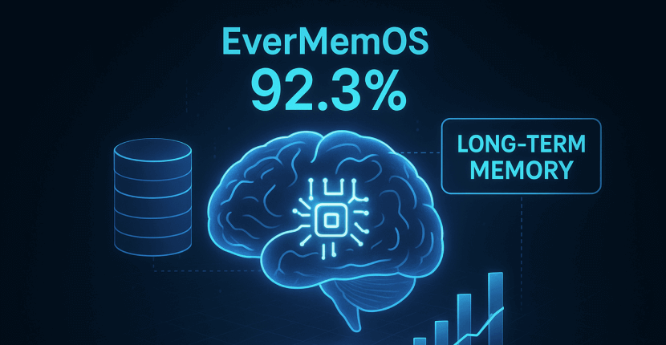
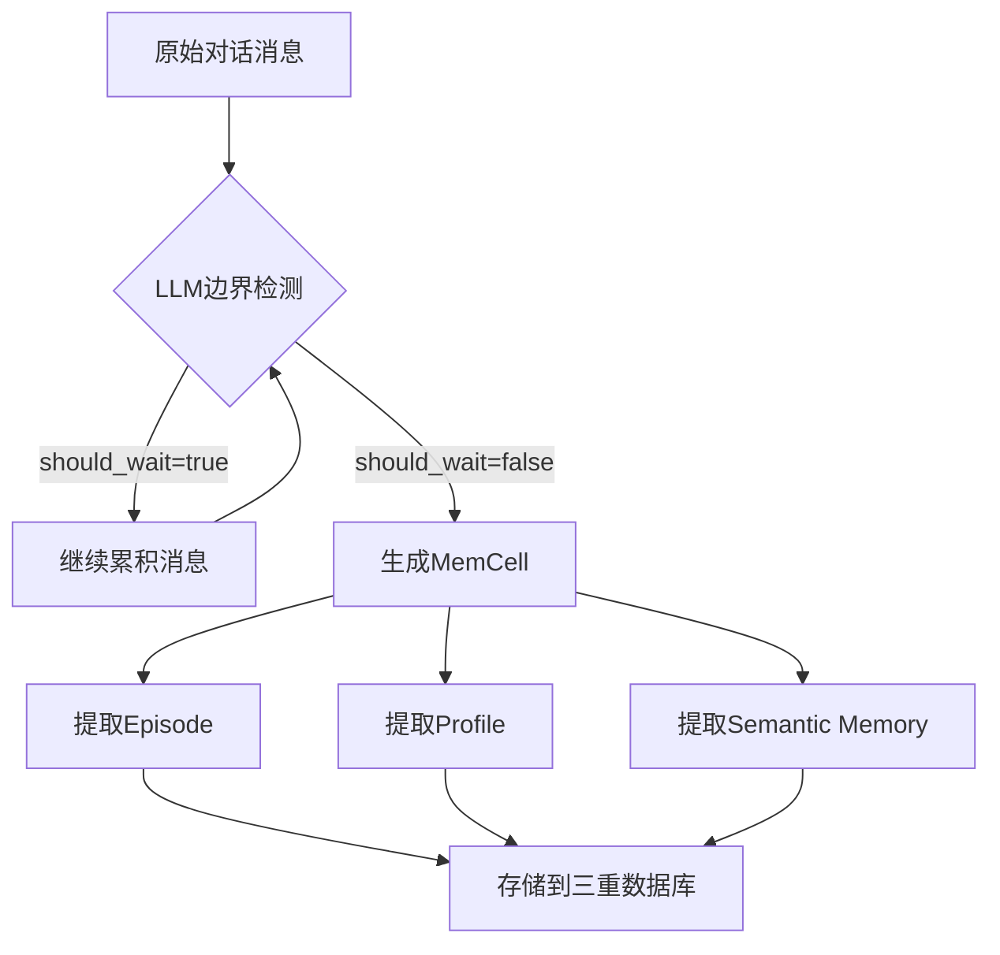
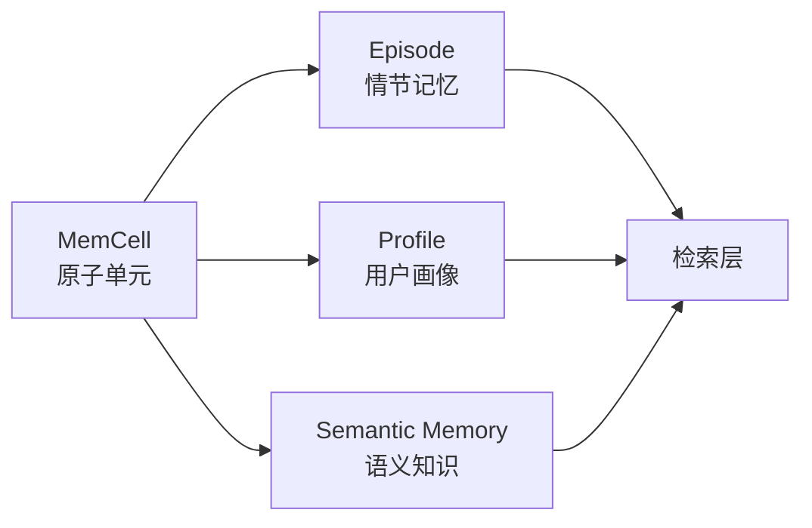
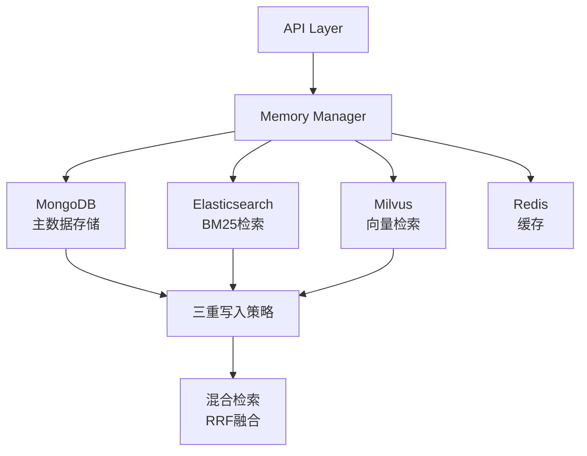
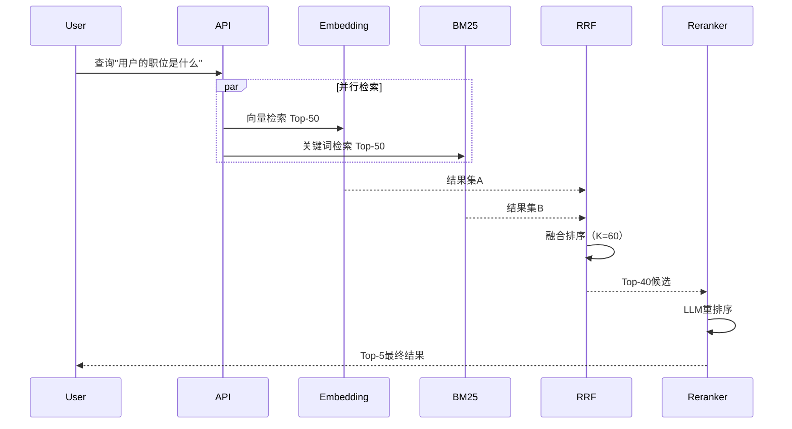
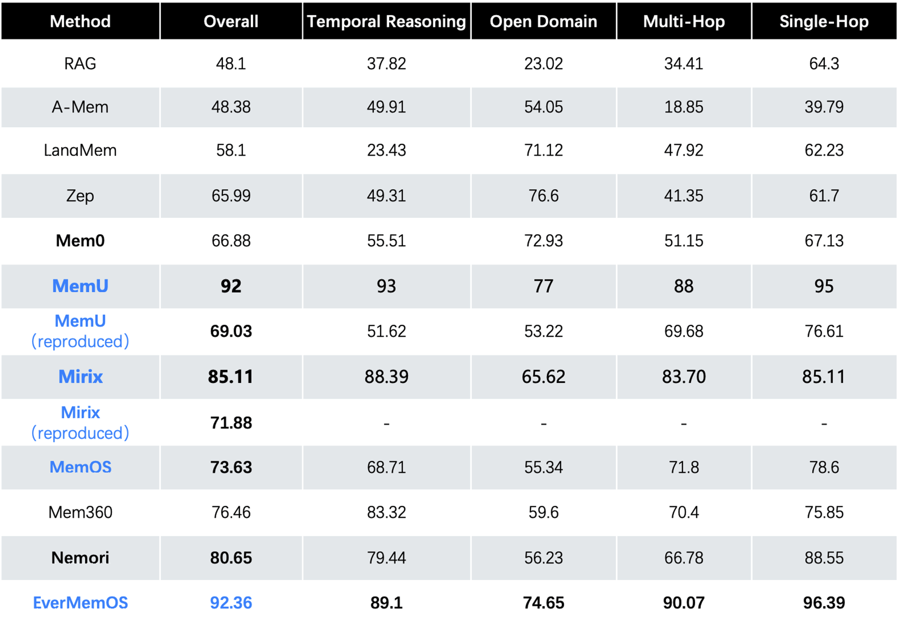
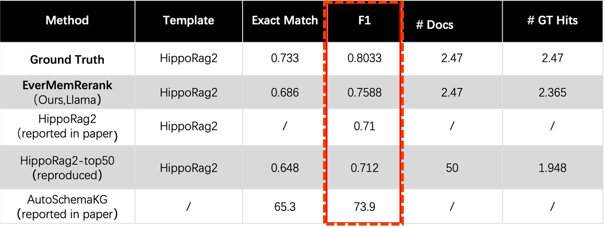
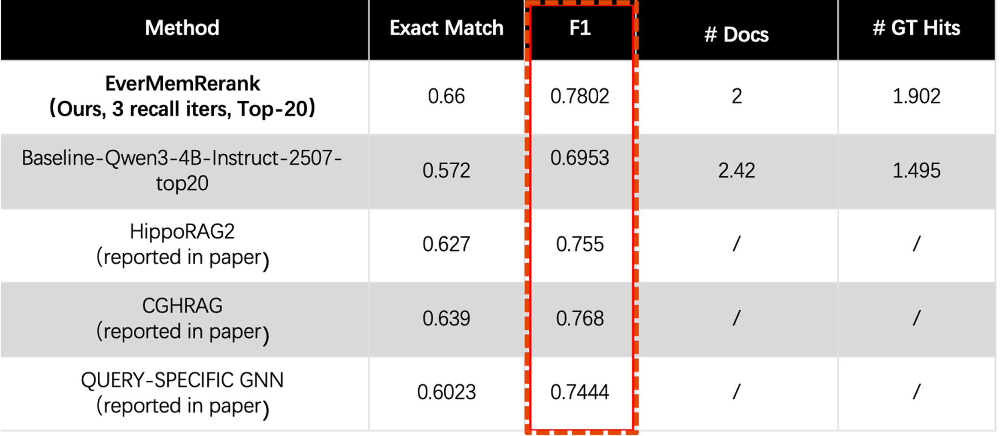

# EverMemOS：重新定义AI长期记忆系统

> 一个在多个SOTA基准测试中表现卓越的企业级长期记忆操作系统

## 引言

在AI Agent时代，记忆不再是简单的"存储与检索"，而是需要**理解、推理和演化**的能力。EverMemOS（EverMind Memory Operating System）作为一个智能记忆操作系统，在多个权威基准测试中取得了突破性成绩：

- **NQ320K检索任务**：Recall@1达到75.5%，刷新SOTA记录
- **LoCoMo推理基准**：92.3%准确率，超越现有方法
- **2wiki & Hotpotqa**：ReRank模型分别达到0.758和0.7802的F1分数

更重要的是，EverMemOS提出了全新的记忆构建范式——从传统RAG的机械切分，转向**LLM驱动的语义完整性记忆单元**，让AI真正拥有"记忆"而非"缓存"。



## 一、核心创新：层次化记忆架构

### 1.1 MemCell：智能记忆的基石

与传统RAG系统按固定长度（如512 tokens）机械切分文本不同，EverMemOS引入了**MemCell（记忆单元）**概念。MemCell不是简单的文本片段，而是一个**语义完整的结构化对象**：

```python
@dataclass
class MemCell:
    event_id: str                          # 唯一标识
    user_id_list: List[str]                # 参与用户
    original_data: List[Dict[str, Any]]    # 原始对话（含speaker、content等）
    timestamp: datetime                     # 时间戳
    summary: str                            # 摘要（必需）
    episode: Optional[str]                  # 情景记忆内容
    keywords: Optional[List[str]]           # 关键词
    semantic_memories: Optional[List]       # 语义联想预测
    event_log: Optional[Any]                # 事件日志
```

**关键特性**：

1. **LLM驱动的边界检测**：通过prompt引导LLM判断对话是否形成完整主题，返回`should_wait`标志决定是否累积更多消息
2. **保留对话上下文**：`original_data`存储完整消息列表，包含speaker_id、speaker_name等元信息
3. **前瞻性语义联想**：`semantic_memories`字段预测用户未来行为变化（如"用户下周需要调整饮食习惯"）



### 1.2 层次化记忆构建

EverMemOS采用**三层记忆架构**，每一层承担不同的认知职责：



| 记忆类型 | MongoDB Collection | 作用 | 典型场景 |
|---------|-------------------|------|---------|
| **MemCell** | `memcells` | 原子记忆单元 | 构建材料，不直接检索 |
| **Episode** | `episodic_memories` | 事件摘要 | "上周讨论了项目进度" |
| **Profile** | `core_memories` | 用户特征 | "擅长Python，偏好敏捷开发" |
| **Semantic Memory** | `semantic_memories` | 知识推理 | "用户可能在下个月关注晋升机会" |

**与传统RAG的本质区别**：

- **传统RAG**：文本 → 机械切分 → Chunk → 直接检索
- **EverMemOS**：对话 → LLM边界检测 → MemCell → 聚合成Episode → 检索Episode

这种设计使得检索结果不再是碎片化的文本块，而是**语义完整、结构化的记忆片段**。

## 二、系统架构：四数据库协同设计

EverMemOS采用**多数据库协同架构**，每个数据库承担特定职责：



### 2.1 三重写入策略

核心记忆类型（Episode、Profile等）采用**同步写入**MongoDB、Elasticsearch和Milvus：

```python
async def save_episodic_memory(episode: EpisodicMemory):
    # 1. 生成向量
    vector = await vectorize_service.get_embedding(episode.episode)
    episode.vector = vector
    
    # 2. 写入MongoDB
    await mongodb_repo.insert(episode)
    
    # 3. 写入Elasticsearch（BM25索引）
    await es_repo.index(episode)
    
    # 4. 写入Milvus（向量索引）
    await milvus_repo.insert(episode)
```

**优势**：
- **MongoDB**：灵活的文档存储，支持复杂查询和事务
- **Elasticsearch**：高效的BM25关键词检索，处理精确匹配
- **Milvus**：高性能向量检索，支持语义相似度搜索

### 2.2 混合检索：RRF融合

EverMemOS采用**Reciprocal Rank Fusion（RRF）**融合Embedding和BM25结果，K值统一设置为**60**：

```python
def reciprocal_rank_fusion(
    emb_results: List[Tuple[dict, float]],
    bm25_results: List[Tuple[dict, float]],
    k: int = 60  # 工业界验证的最优值
) -> List[Tuple[dict, float]]:
    """
    RRF公式: RRF_score(doc) = Σ(1 / (k + rank_i))
    
    优势：
    1. 无需归一化分数（Embedding和BM25分数范围不同）
    2. 对头部结果更敏感
    3. 无需调参
    """
    doc_rrf_scores = {}
    
    # 累加Embedding排名分数
    for rank, (doc, score) in enumerate(emb_results, start=1):
        doc_id = doc.get("event_id")
        doc_rrf_scores[doc_id] = 1.0 / (k + rank)
    
    # 累加BM25排名分数
    for rank, (doc, score) in enumerate(bm25_results, start=1):
        doc_id = doc.get("event_id")
        doc_rrf_scores[doc_id] = doc_rrf_scores.get(doc_id, 0) + 1.0 / (k + rank)
    
    # 按RRF分数降序排序
    return sorted(doc_rrf_scores.items(), key=lambda x: x[1], reverse=True)
```

**检索流程**：



## 三、突破性能表现

### 3.1 NQ320K：整库直接输入的检索革命

EverMemModel实现了**将整个检索数据库连同查询一起输入模型**的技术突破，在NQ320K（全文本）上达到：

- **Recall@1**: 75.5%（训练集）
- **Recall@1**: 66.49%（未见测试集）


**QA任务表现**：DSA方法直接在7.1M长度上下文中进行QA，无需Embedding检索，超越了Qwen3-Embedding-4B + Qwen3-4B-Instruct的RAG方法：


### 3.2 LoCoMo：92.3%的推理准确率

基于EverMemOS框架和GPT-4.1-mini模型，在LoCoMo数据集上实现**92.3%的推理准确率**（LLM-Judge评估），体现了三大核心优势：



**🔗 Coherent Narrative（连贯叙事）**
- 自动链接对话片段形成完整主题上下文
- 区分"项目A进度讨论"和"团队B战略规划"
- 从碎片化短语到完整故事线

**🧠 Evidence-Based Perception（基于证据的感知）**
- 主动捕获记忆与任务的深层关联
- 示例：用户提问"推荐餐厅" → 系统回忆"两天前拔牙手术" → 推荐软食餐厅
- 这是真正的**情境感知**

**💾 Living Profiles（动态演化画像）**
- 实时更新用户画像，而非静态标签
- 偏好、语气、关注领域随交互自然演化
- 不只是"记住你说过什么"，而是"学习你是谁"

### 3.3 ReRank模型：刷新多跳推理SOTA

EverMemReRank在两个多跳推理基准上达到SOTA：


| 基准 | EverMemReRank | HippoRag2 | 提升 |
|-----|--------------|-----------|-----|
| **2wiki** | 0.758 | 0.710 | +4.8% |
| **Hotpotqa** | 0.7802 | 0.755 | +2.5% |

**核心技术**：Event Log的多行格式化策略，将atomic_fact逐行展开：

```python
# 传统格式（单行）
episode = "用户喜欢吃川菜，最爱麻婆豆腐，不喜欢太辣"

# Event Log格式（多行）
formatted_text = """
2024-10-31 14:30:00
用户喜欢吃川菜
用户最喜欢的川菜是麻婆豆腐
用户不喜欢太辣的菜
"""
```

这种格式使Reranker能够**精确匹配到具体的原子事实**，避免语义稀释。





## 四、生产部署实践

### 4.1 本地模型替换

EverMemOS支持将DeepInfra API替换为本地部署模型：

**Embedding替换（BGE-M3）**：

```bash
# 方式1：OpenAI兼容API（推荐）
DEEPINFRA_BASE_URL=http://localhost:8000/v1
DEEPINFRA_EMBEDDING_MODEL=BAAI/bge-m3
DEEPINFRA_DIMENSIONS=1024

# 方式2：使用Xinference部署
xinference launch --model-name bge-m3 --model-type embedding
```

**Reranker替换（bge-reranker-v2）**：

```python
from FlagEmbedding import FlagReranker

class BGERerankerService:
    def __init__(self):
        self.model = FlagReranker("BAAI/bge-reranker-v2-m3", use_fp16=True)
    
    async def rerank(self, query: str, documents: List[str]):
        scores = self.model.compute_score([[query, doc] for doc in documents])
        return sorted(enumerate(scores), key=lambda x: x[1], reverse=True)
```

**LLM替换（vLLM部署的Qwen）**：

```bash
# 启动vLLM
vllm serve Qwen/Qwen2.5-7B-Instruct --port 8000

# 修改.env
CONV_MEMCELL_LLM_BASE_URL=http://localhost:8000/v1
CONV_MEMCELL_LLM_MODEL=Qwen/Qwen2.5-7B-Instruct
```

### 4.2 向量数据迁移

更换Embedding模型后，必须重新生成向量数据：

```bash
# 重新生成所有EpisodicMemory的向量
python src/bootstrap.py \
  src/devops_scripts/data_fix/mongo_fix_episodic_memory_missing_vector.py \
  --limit 100000 \
  --batch 500 \
  --concurrency 10
```

**迁移脚本核心逻辑**：

```python
async def regenerate_vectors(batch_size: int, concurrency: int):
    semaphore = asyncio.Semaphore(concurrency)
    
    async def process_batch(docs):
        async with semaphore:
            # 批量生成新向量
            texts = [doc.episode for doc in docs]
            embeddings = await vectorize_service.get_embeddings(texts)
            
            # 更新MongoDB和Milvus
            for doc, emb in zip(docs, embeddings):
                doc.vector = emb
                doc.vector_model = "BAAI/bge-m3"
                await doc.save()
                await milvus_repo.upsert(doc)
    
    # 分批处理
    while True:
        docs = await fetch_documents_without_vector(batch_size)
        if not docs:
            break
        await process_batch(docs)
```

### 4.3 多租户改造建议

当前系统缺少`tenant_id`字段，企业部署需要以下改造：

**1. 数据模型添加租户字段**：

```python
class EpisodicMemory(DocumentBase):
    tenant_id: str = Field(..., description="租户ID")  # 新增
    user_id: str = Field(..., description="用户ID")
    # ... 其他字段
```

**2. MongoDB索引调整**：

```python
IndexModel(
    [("tenant_id", ASCENDING), ("user_id", ASCENDING), ("timestamp", DESCENDING)],
    name="idx_tenant_user_timestamp"
)
```

**3. API认证中间件**：

```python
async def verify_tenant(x_tenant_id: str = Header(...), 
                       x_api_key: str = Header(...)):
    if not is_valid_api_key(x_tenant_id, x_api_key):
        raise HTTPException(status_code=403)
    return x_tenant_id

@app.post("/api/v3/agentic/retrieve")
async def retrieve(request: RetrieveRequest, 
                  tenant_id: str = Depends(verify_tenant)):
    request.tenant_id = tenant_id  # 强制注入
    # ... 检索逻辑
```

## 五、总结与展望

EverMemOS通过**层次化记忆架构**、**LLM驱动的边界检测**和**混合检索策略**，重新定义了AI长期记忆系统的设计范式。它不仅在多个SOTA基准测试中证明了技术实力，更提供了开箱即用的企业级解决方案。

**核心优势**：
- ✅ **语义完整性**：告别机械切分，拥抱智能记忆单元
- ✅ **层次化构建**：从原子MemCell到高阶记忆的自然演化
- ✅ **混合检索**：RRF融合结合精确匹配与语义理解
- ✅ **灵活部署**：支持本地模型替换，降低成本
- ✅ **SOTA性能**：在NQ320K、LoCoMo、2wiki等多个基准领先

**未来方向**：
- 🔮 原生多租户支持与权限管理
- 🔮 动态查询策略（根据查询类型自适应选择检索方式）
- 🔮 更丰富的记忆类型（任务记忆、关系网络等）
- 🔮 自动化评估框架与业务数据集成

EverMemOS正在改变AI Agent与记忆交互的方式——从"检索数据库"到"对话记忆系统"，让AI真正拥有**记忆力**而非**存储器**。

---

**项目地址**：[EverMind-AI/EverMemOS](https://github.com/EverMind-AI/EverMemOS)  
**官方博客**：[everm.ai/blog](https://everm.ai/blog/)

