# 生产环境中的智能体评估（MAP）：首个大规模AI智能体实证研究

> **关键词**：AI智能体 | 生产部署 | 实证研究 | 问卷调查方法论 | B端落地

## 一、论文基础信息

- **中文标题**：生产环境中智能体的实测研究
- **英文标题**：Measuring Agents in Production（MAP）
- **发布日期**：2025年12月
- **发布机构**：加州大学伯克利分校（UC Berkeley）、斯坦福大学、IBM研究院、Intesa Sanpaolo、伊利诺伊大学厄巴纳-香槟分校（UIUC）
- **论文地址**：https://arxiv.org/pdf/2512.04123

## 二、论文摘要与研究意义

该研究是**AI智能体领域首个大规模系统性实证研究**，旨在填补学术研究与产业实践之间的认知空白，揭示生产环境中AI智能体的真实部署现状、技术策略与核心挑战。

研究采用"**大规模调查+深度案例**"双重方法论，收集了**306名从业者的问卷反馈**，并对**20个企业级部署案例**进行深度访谈，覆盖金融、医疗、科技等**26个行业**，聚焦已落地的生产或试点阶段系统。

核心研究发现显示：
- **生产力提升（73%）是企业部署智能体的首要驱动力**，而非复杂的自主能力展示
- 技术选择呈现"**极简主义**"特征——85%依赖闭源模型、70%拒绝模型微调、68%的系统在10步内需人工干预
- **85%的团队选择自研架构**而非第三方框架，通过严格约束自主性保障可靠性
- 评估方面，**75%放弃通用基准测试**，74.2%以人工循环验证为核心

研究明确指出，**可靠性是当前生产级智能体的最大瓶颈**，而"约束性部署"（如只读操作、沙盒环境、预定义工作流）是企业落地的核心成功模式。

## 三、方法论创新：如何设计科学的智能体调查问卷？

### 3.1 为什么问卷设计对B端AI落地至关重要？

对于企业服务（B端）AI智能体的落地，**如何系统性地收集真实需求、技术痛点和部署经验**是一个长期被忽视的问题。传统的用户调研往往流于表面，难以捕捉技术细节和工程决策背后的深层逻辑。

MAP研究团队设计了一套**动态分支逻辑问卷**，通过精心设计的47个问题，系统性地收集了生产智能体的完整技术画像。这套方法论对B端AI产品经理、技术负责人和研究者具有重要参考价值。

### 3.2 调查问卷的核心设计理念

#### 设计理念1：**动态分支逻辑，避免无效问题**

论文使用Qualtrics实现了动态问卷，根据前序回答自动跳转问题路径。例如：
- 只有确认"选择智能体方案而非非智能体方案"的受访者，才会看到"智能体带来的具体收益"问题
- 只有部署在生产/试点阶段的系统，才会进入详细的技术架构问题

这种设计避免了受访者回答不相关问题，大幅提升了问卷完成率和数据质量。

#### 设计理念2：**严格筛选，聚焦真实生产系统**

论文对306份回复进行了严格筛选，最终提取**86份生产/试点阶段**的系统数据进行主体分析。筛选标准包括：
- **生产系统（Production）**：完全部署，目标用户在真实运营环境中使用
- **试点系统（Pilot）**：部署到受控用户组，用于评估、分阶段推出或安全测试

这种筛选策略确保了数据反映的是"**真正跑起来的智能体**"，而非停留在PPT或Demo阶段的概念验证。

### 3.3 问卷流程设计详解：图26与图27的深度解读

#### 图26：核心问卷流程——如何系统性捕捉智能体全貌

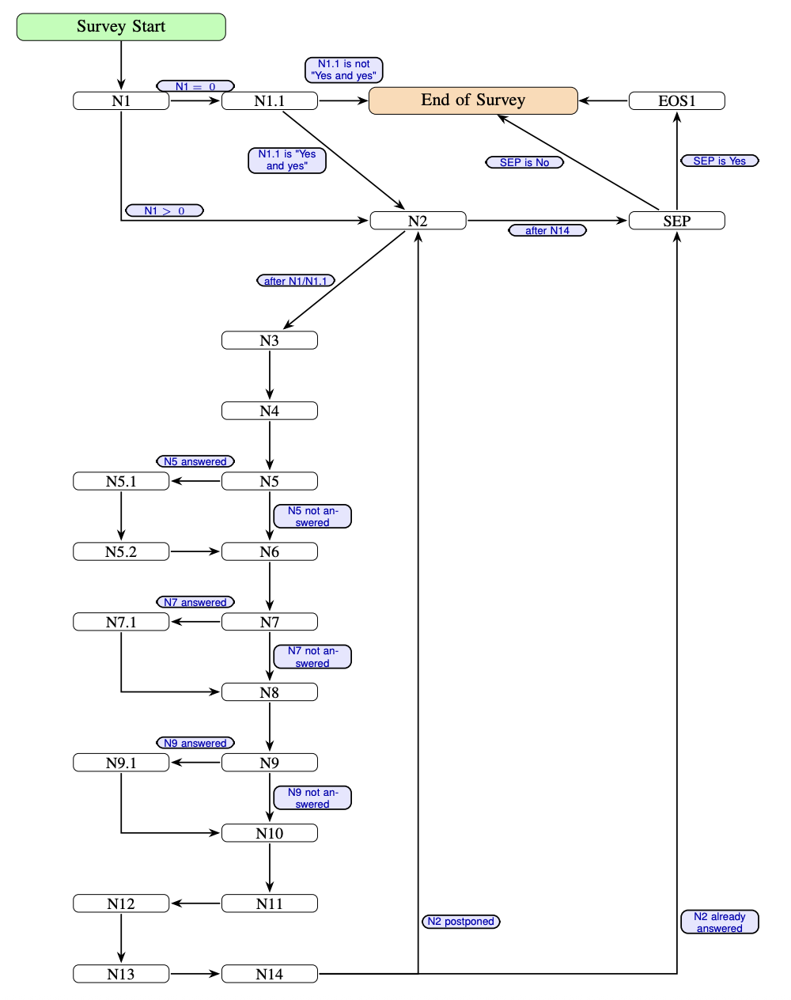

**图26展示了调查问卷的主流程分支逻辑**，这是整个研究的核心方法论创新。下面用 Mermaid 流程图完整还原每个问题节点：

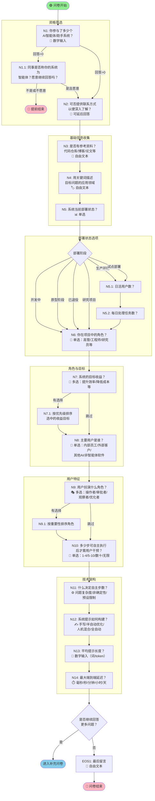

**核心问卷的设计逻辑解读**：

| 阶段 | 问题编号 | 设计目的 |
|------|----------|----------|
| **资格筛选** | N1-N1.1 | 快速过滤非目标受访者，仅保留有实战经验的从业者 |
| **基础信息** | N2-N5 | 收集系统元数据，N5是核心筛选维度 |
| **角色与目标** | N6-N7 | 理解受访者视角和业务驱动力 |
| **用户特征** | N8-N9 | 明确智能体的服务对象和人机交互模式 |
| **技术架构** | N10-N14 | 量化自主性边界、提示工程、延迟要求等关键技术指标 |

---

#### 图27：补充问卷流程——如何深挖技术决策细节

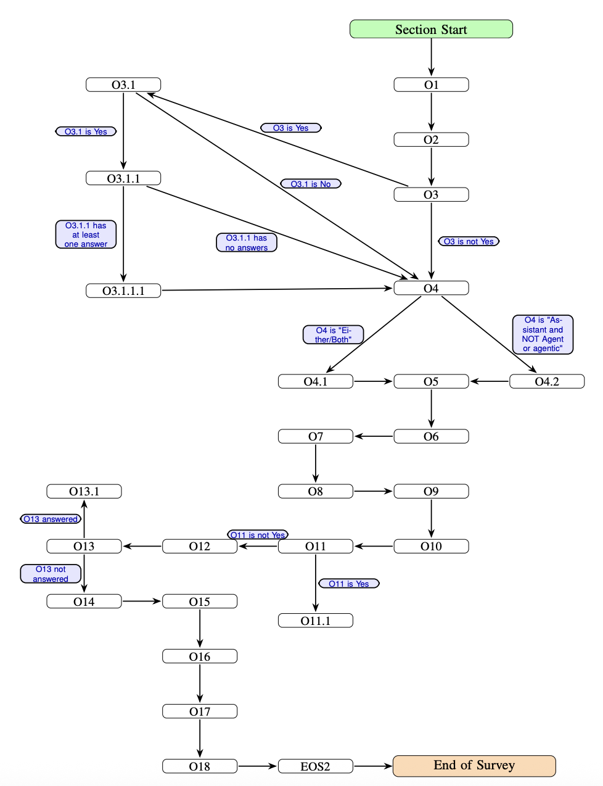

**图27展示了补充问卷的分支逻辑**，通过条件触发深挖特定技术决策。以下是完整的 Mermaid 流程图：

```mermaid
flowchart TD
    SECTION_START([🟢 补充问卷开始]) --> O1

    subgraph 质量保证方法
        O1[O1: 使用哪些方法确保<br>系统输出高质量？<br>✅ 多选：人工审核/LLM-as-Judge/<br>规则检查/知识图谱验证等]
        O1 --> O2[O2: 按重要性排序<br>以下开发挑战类别<br>📊 拖拽排序]
    end

    subgraph 方案对比分析
        O2 --> O3{O3: 是否与非智能体<br>方案做过对比？}
        O3 -->|是，做过对比| O3_1{O3.1: 如果由你决定<br>会选择智能体方案吗？}
        O3 -->|否，可能有替代方案| O4
        O3 -->|否，无替代方案| O4

        O3_1 -->|是| O3_1_1[O3.1.1: 为什么选择智能体？<br>🎯 多选：自动化提升/易用性/<br>可扩展性/性能/集成能力等]
        O3_1_1 -->|有选择| O3_1_1_1[O3.1.1.1: 按优先级<br>排序选中的原因]
        O3_1_1_1 --> O4
        O3_1_1 -->|跳过| O4
        O3_1 -->|否| O4
    end

    subgraph 智能体定义辨析
        O4{O4: 你称它为助手<br>还是智能体？}
        O4 -->|两者皆可/智能体| O4_1[O4.1: 为什么称为智能体？<br>什么特性让它具有智能体属性？<br>📝 自由文本]
        O4 -->|仅助手，非智能体| O4_2[O4.2: 为什么不称为智能体？<br>助手和智能体的区别是？<br>📝 自由文本]
        O4_1 --> O5
        O4_2 --> O5
    end

    subgraph 用户与业务指标
        O5[O5: 目标用户的最低<br>专业水平要求？<br>👤 高级专家/资深从业者/<br>普通教育/无门槛]
        O5 --> O6_CHECK{N5是否为<br>生产环境？}
        O6_CHECK -->|是| O6[O6: ROI投资回报率评估？<br>💰 >150%/125-150%/90-124%/<br>60-89%/<60%]
        O6 --> O7
        O6_CHECK -->|否| O7
    end

    subgraph 技术细节深挖
        O7[O7: 提示长度变化范围？<br>📏 几十/几百/几千/上万token]
        O7 --> O8[O8: 延迟对部署的影响？<br>⏱️ 无影响/可接受/阻塞性问题]
        O8 --> O9[O9: 单步最大延迟目标？<br>⚡ 微秒/亚秒/1-10秒/分钟级]
        O9 --> O10[O10: 单任务最多用<br>几个不同模型？<br>🔢 数字输入]
    end

    subgraph 推理扩展技术
        O10 --> O11{O11: 是否使用<br>推理时扩展技术？}
        O11 -->|是| O11_1[O11.1: 每次查询<br>调用多少次模型？<br>🔄 几十/几百/几千/更多]
        O11_1 --> O12
        O11 -->|否/不清楚| O12
    end

    subgraph 数据模态规划
        O12[O12: 当前处理哪些数据模态？<br>📊 多选：文本/表格/代码/<br>图像/视频/科学数据]
        O12 --> O13[O13: 未来计划支持哪些<br>新的数据模态？<br>🔮 多选同上]
        O13 -->|有选择| O13_1[O13.1: 当前不支持的障碍？<br>按重要性排序]
        O13_1 --> O14
        O13 -->|跳过| O14
    end

    subgraph 框架与工具选择
        O14[O14: 数据处理功能？<br>💾 多选：实时用户输入/数据库/<br>公开数据/私密数据]
        O14 --> O15{O15: 是否使用<br>开源智能体框架？}
        O15 -->|是| O16[O16: 使用哪个框架？<br>🛠️ LangChain/CrewAI/Autogen/<br>LlamaIndex/BeeAI/其他]
        O16 --> O17
        O15 -->|否/仅内部方案| O17
    end

    subgraph 时间投入
        O17[O17: 项目启动至今多久？<br>📅 <3月/3-6月/6-12月/<br>1-2年/2-5年/>5年]
        O17 --> O18[O18: 你参与多久了？<br>👤 同上选项]
    end

    O18 --> EOS2[EOS2: 感谢参与！<br>最后留言 📝]
    EOS2 --> END([🔴 问卷结束])

    style SECTION_START fill:#87CEEB
    style END fill:#FFB6C1
```

**补充问卷的分支逻辑亮点**：

| 分支点 | 触发条件 | 设计目的 |
|--------|----------|----------|
| **O3→O3.1** | 做过方案对比 | 深挖选择智能体的决策依据 |
| **O3.1→O3.1.1** | 倾向智能体方案 | 量化具体优势 |
| **O4分叉** | 自我定义 | 理解从业者对"智能体"概念的认知边界 |
| **O6触发** | N5=生产环境 | 仅对真实上线系统询问ROI |
| **O11→O11.1** | 使用推理扩展 | 量化模型调用密度 |
| **O13→O13.1** | 有未来模态计划 | 识别技术扩展障碍 |
| **O15→O16** | 使用开源框架 | 追踪框架生态采用情况 |

---

**两个流程图的核心设计原则总结**：

1. **渐进式深挖**：从宏观（部署状态）到微观（单步延迟），逐层递进
2. **条件触发**：避免无关问题，只展示与受访者相关的分支
3. **量化+定性结合**：数字输入（N1/N13/O10）+ 自由文本（N4/O4.1）+ 排序（N7.1/O2）
4. **双重验证**：核心问卷收集事实，补充问卷挖掘原因和细节

### 3.4 对B端AI产品落地的启示

基于图26和图27的设计理念，我们可以总结出以下**可复用的问卷设计原则**：

**原则1：用"部署阶段"作为第一筛选维度**
- 明确区分概念验证（POC）、试点（Pilot）、生产（Production）三个阶段
- 不同阶段关注的问题完全不同：POC关注可行性，Pilot关注稳定性，Production关注可靠性和成本

**原则2：用"技术选择"作为分支触发器**
- 使用开源模型 vs 闭源模型 → 关注点分别是定制化能力 vs API稳定性
- 人工提示工程 vs 自动优化 → 关注点分别是可控性 vs 泛化性

**原则3：用"对比基准"挖掘真实价值**
- 必须追问"如果不用智能体，你会怎么做？"
- 对比维度包括：人工成本、响应时间、错误率、用户满意度

**原则4：用"失败案例"识别隐藏风险**
- 不仅问"成功经验"，更要问"哪些尝试失败了？"
- 失败原因往往揭示了技术边界和未被满足的需求

## 四、核心研究发现：生产智能体的真实画像

### 4.1 RQ1：为什么要部署智能体？

#### 发现1：生产力提升是首要驱动力（73%）

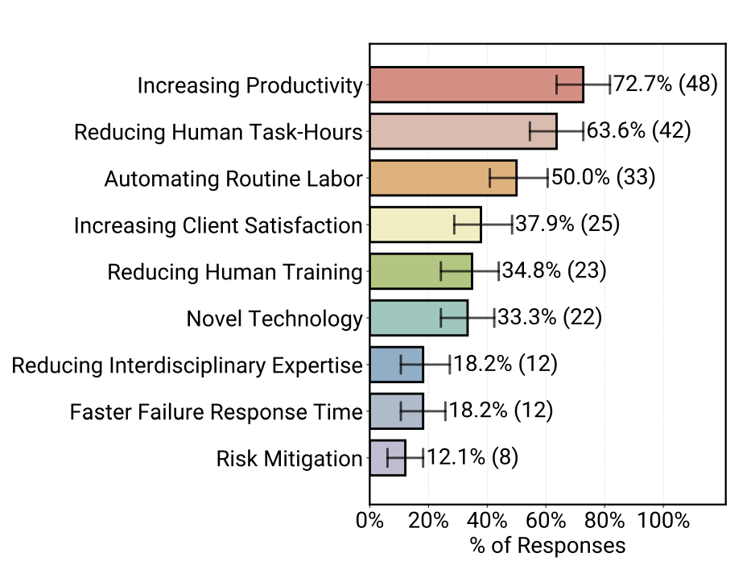

**图1**展示了从业者部署智能体的核心原因（N=66，多选题）：
- **提升生产力（Increasing Productivity）**：72.7%，排名第一
- **减少人工工时（Reducing Human Task-Hours）**：63.6%
- **自动化常规劳动（Automating Routine Labor）**：50.0%

**关键洞察**：企业并非追求炫酷的"完全自主智能体"，而是用智能体解决**专家稀缺、人力不足**的实际问题。例如：
- 护士使用保险授权智能体，将审批时间从2天缩短到5分钟
- 工程师使用故障诊断智能体，将跨系统排查从8小时压缩到1小时

相比之下，**风险缓解（Risk Mitigation）仅12.1%**，因为收益难以量化，且需要长期验证。

#### 发现2：应用领域已远超编程助手

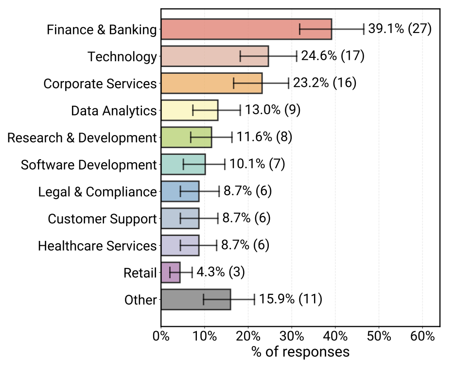

**图2**显示智能体已覆盖**26个行业**（N=69，多分类题）：
- **金融与银行（Finance & Banking）**：39.1%
- **科技行业（Technology）**：24.6%（包括但不限于软件开发）
- **企业服务（Corporate Services）**：23.2%
- **长尾领域**：数据分析、医疗、法律、零售等

**关键洞察**：智能体已突破"代码助手"的刻板印象，深入到**保险理赔、医疗工作流、化学数据探索**等非技术领域。

#### 补充数据：全样本 vs 已部署系统对比

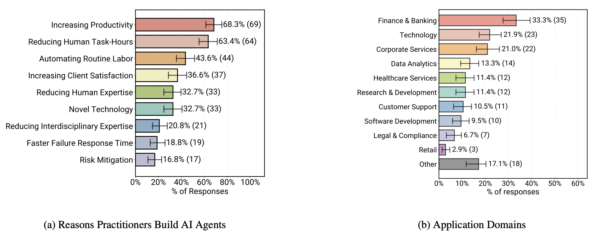

**图14**展示了全样本（包含原型、研究阶段）与已部署系统的对比：
- **(a) 构建动机**（N=101）：全样本中"提升生产力"依然排名第一（68.3%），与已部署系统趋势一致
- **(b) 应用领域**（N=105）：全样本的领域分布更加多元化，"其他"类别占比更高（17.1%）

**关键洞察**：已部署系统更集中在金融、科技等成熟领域，而原型/研究系统在更多实验性领域探索。

### 4.2 RQ2：智能体是如何构建的？

#### 发现3：技术栈呈现"极简主义"特征

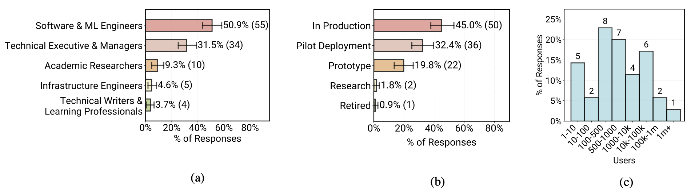

**图4**展示了调查样本的代表性：
- **(a) 角色分布**（N=108）：50.9%为软件/ML工程师，31.5%为技术高管
- **(b) 部署阶段**（N=111）：45%已在生产环境，32.4%处于试点阶段
- **(c) 用户规模**（N=35）：42.9%服务数百用户，25.7%服务数万至百万级用户

#### 发现4：85%依赖闭源模型，70%不微调

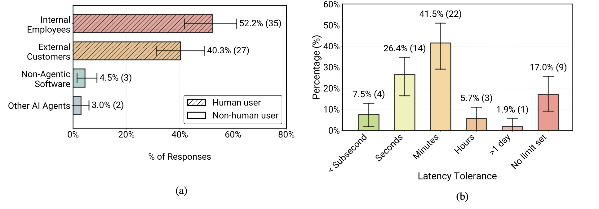

**图5**揭示了部署特征：
- **(a) 主要用户**（N=67）：52.2%服务内部员工，40.3%服务外部客户
- **(b) 延迟容忍度**（N=53）：41.5%允许分钟级响应，34.2%允许秒级

**关键洞察**：
1. **内部优先策略**：企业先在内部部署智能体，利用员工的容错能力和专业判断降低风险
2. **延迟换质量**：66%的系统允许分钟级甚至更长响应时间，因为对比基线是"人工处理需要数小时"

#### 补充数据：全样本的用户与延迟特征

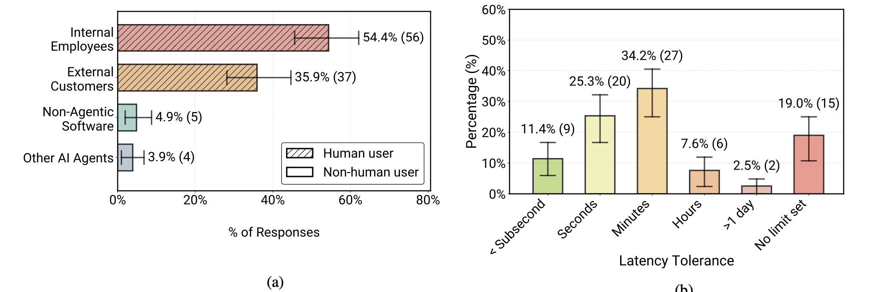

**图15**展示了全样本数据（N=103/84）：
- **(a) 用户分布**：54.4%服务内部员工，35.9%服务外部客户，与已部署系统趋势一致
- **(b) 延迟容忍度**：34.2%允许分钟级，25.3%允许秒级，19.0%未设限

**关键洞察**：无论处于何种开发阶段，智能体系统普遍呈现"内部用户优先+宽松延迟"的特征，这是B端落地的通用模式。

#### 发现5：68%的智能体在10步内需人工干预

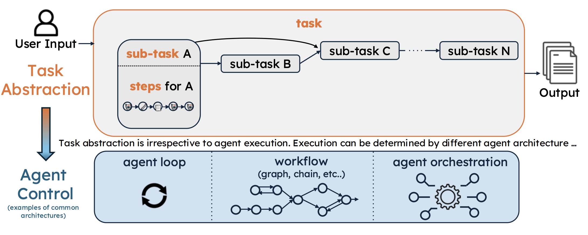

**图22**展示了智能体的任务分解逻辑：
- **任务抽象层（Task Abstraction）**：用户输入 → 子任务A/B/C → 输出
- **智能体控制层（Agent Control）**：实际执行可能采用agent loop、workflow或orchestration

**关键洞察**：生产智能体遵循**预定义工作流**，而非开放式自主规划。例如：
- 保险智能体：固定流程为"查询覆盖范围 → 医疗必要性审查 → 风险识别"
- 每个子任务内部有自主性，但高层流程固定

#### 补充数据：模型配置与自主性边界

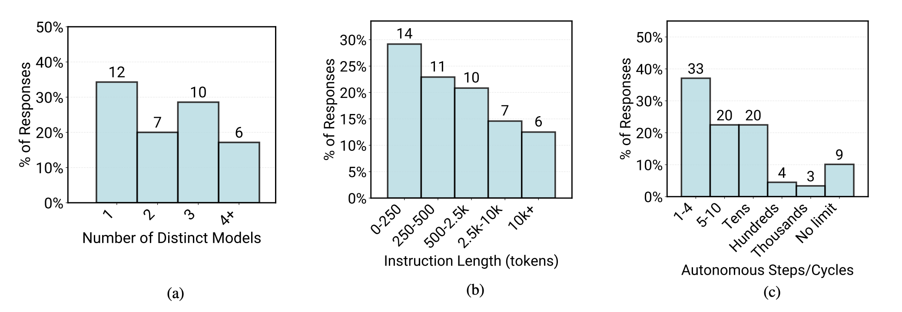

**图16**揭示了已部署系统的核心配置参数：
- **(a) 模型数量**（N=22）：34.3%使用单一模型，28.6%使用3个模型，18.2%使用4个以上
- **(b) 提示长度**（N=33）：28.6%在250-500 token，22.4%在500-2.5k token，12.1%超过10k token
- **(c) 自主步数**（N=60）：35.6%限制在1-4步，21.7%在5-10步，仅9.8%无限制

**关键洞察**：
1. **多模型组合**成为主流（65.7%），用于成本优化和多模态处理
2. **提示长度呈长尾分布**：复杂系统的提示可超过10k token
3. **严格的自主性边界**：超过半数系统在10步内必须人工干预

#### 发现6：85%自研架构，放弃第三方框架

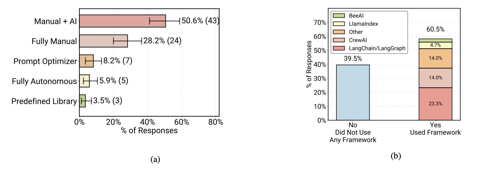

**图17**展示了智能体的工作流选择：
- **(a) 构建方式**（N=85）：50.6%采用人工+AI混合，28.2%纯人工，仅5.9%完全自主
- **(b) 框架使用**（N=43）：60.5%使用了BeeAI、LlamaIndex等框架

**关键矛盾**：调查数据显示61%使用框架，但深度访谈发现85%（17/20）的生产团队**最终放弃框架**，转向自研。

**原因分析**：
1. **灵活性需求**：生产智能体需要深度定制，框架抽象层成为阻碍
2. **依赖管理成本**：框架更新可能破坏现有系统稳定性
3. **安全合规要求**：企业禁止引入未经审计的外部库

### 4.3 RQ3：智能体如何评估？

#### 发现7：74%依赖人工验证，75%放弃基准测试

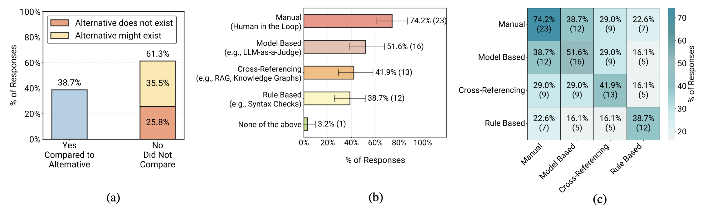

**图10**揭示了评估实践：
- **(a) 基线对比**（N=31）：38.7%与非智能体方案对比，61.3%未对比（其中25.8%因无可比基线）
- **(b) 评估方法**（N=31，多选）：
  - **人工验证（Manual/Human-in-the-Loop）**：74.2%
  - **模型评估（LLM-as-a-Judge）**：51.6%
  - **交叉验证（Cross-Referencing）**：41.9%
  - **规则验证（Rule Based）**：38.7%
- **(c) 方法组合**：人工验证与所有其他方法的重叠度最高

**关键洞察**：
1. **LLM-as-a-Judge不是替代品**：所有使用LLM评估的团队都结合人工抽样
2. **置信度分层策略**：
   - LLM Judge评分 > 阈值 → 自动通过
   - 评分 < 阈值 → 人工审核
   - 即使高分也抽样5%进行人工验证

#### 发现8：自定义基准耗时6个月，覆盖100个场景

**基准构建的三大挑战**（来自深度访谈）：
1. **领域数据缺失**：保险核保等监管领域无公开数据
2. **标注成本高**：某团队花费数月才构建40个高质量测试场景
3. **客户定制化**：语音智能体的客户专属工具集和对话风格无法标准化

**解决方案**：75%的团队放弃离线基准，转向A/B测试和用户反馈驱动的在线评估。

#### 补充数据：全样本评估实践对比

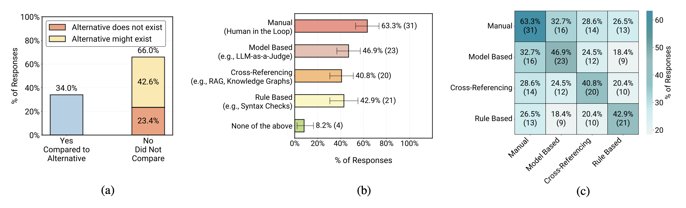

**图18**展示了全样本（N=49）的评估实践：
- **(a) 基线对比**：34.0%与非智能体方案对比，66.0%未对比（42.6%因可能无基线）
- **(b) 评估方法**：人工验证（63.3%）、LLM-as-a-Judge（46.9%）、规则验证（42.9%）、交叉验证（40.8%）
- **(c) 方法组合热力图**：人工验证与其他方法的组合最频繁

**关键洞察**：无论是已部署还是原型系统，**人工验证始终是核心**。规则验证在全样本中占比更高（42.9% vs 38.7%），可能因为原型阶段更容易实现简单规则检查。

### 4.4 RQ4：最大的挑战是什么？

#### 发现9：可靠性是头号未解难题

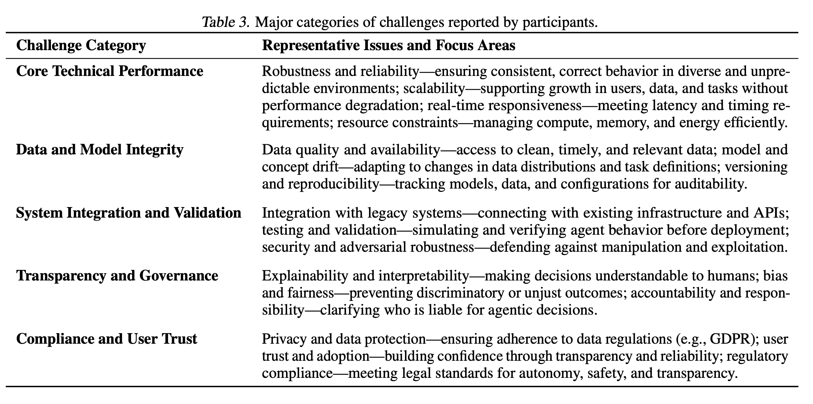

**表3**总结了五大挑战类别：
1. **核心技术性能（Core Technical Performance）**：
   - 健壮性与可靠性——确保多样化、不可预测环境中的正确行为
   - 可扩展性——支持用户、数据和任务增长而不降级
   - 实时响应——满足延迟和时序要求
   
2. **数据与模型完整性（Data and Model Integrity）**：
   - 数据质量与可用性——获取干净、及时、相关的数据
   - 模型与概念漂移——适应数据分布和任务定义变化
   
3. **系统集成与验证（System Integration and Validation）**：
   - 与遗留系统集成——连接现有基础设施和API
   - 测试与验证——在部署前模拟和验证智能体行为
   
4. **透明性与治理（Transparency and Governance）**：
   - 可解释性——让人类理解决策
   - 偏见与公平性——防止歧视性结果
   
5. **合规与用户信任（Compliance and User Trust）**：
   - 隐私与数据保护——遵守GDPR等法规
   - 用户信任与采纳——通过透明性和可靠性建立信心

#### 发现10：延迟仅影响15%的系统

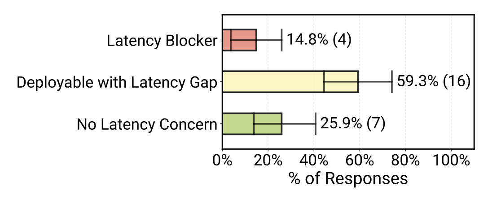

**图11**显示延迟挑战程度（N=27）：
- 仅14.8%认为是"阻塞性问题"（Latency Blocker）
- 59.3%认为是"可部署但有改进空间"（Deployable with Latency Gap）
- 25.9%完全不关注延迟（No Latency Concern）

**关键洞察**：
- **异步优先**：15/20的案例采用异步执行（后台批处理、定时任务、人工审核流程）
- **实时交互是例外**：仅2/20的语音和聊天系统需要毫秒级响应

## 五、深度洞察：约束性部署是成功的关键

### 5.1 悖论：可靠性是最大挑战，为何系统仍能上线？

论文揭示了一个核心悖论：
- 40%的从业者将可靠性视为首要挑战
- 但82%的系统已成功部署到生产或试点阶段

**答案**：通过**严格约束自主性**实现可靠性。

### 5.2 四种约束策略

**策略1：只读模式**
- 案例：SRE故障诊断智能体仅生成问题报告和建议，由人工工程师执行修复操作
- 原理：避免智能体直接修改生产状态

**策略2：沙盒环境**
- 案例：代码迁移智能体在镜像环境中测试，通过CI/CD验证后才合并代码
- 原理：隔离生产系统，降低错误影响

**策略3：抽象层隔离**
- 案例：某团队构建Wrapper API限制智能体可调用的工具范围
- 原理：隐藏内部细节，防止权限越界

**策略4：有界工作流**
- 案例：保险智能体限制在预定义的检索-审查-决策流程内
- 原理：用确定性流程替代开放式规划

### 5.3 对未来的启示

**开放问题**：如何在扩大自主性的同时保持可靠性？

**潜在方向**：
1. **任务解耦**：将逻辑子任务合并为单一执行流（例如Anthropic Claude Code的"编码+测试"一体化）
2. **测试驱动开发（TDD）**：用强验证信号（编译、单测）替代人工判断
3. **分层可靠性指标**：不仅关注"正确性"，还要引入"五个9"等SLA指标

## 六、对B端AI智能体落地的实践建议

### 6.1 产品定位建议

**✅ DO（推荐）**：
1. **聚焦可量化收益**：选择人工成本高、流程标准化的场景（如客服、数据分析、文档处理）
2. **内部先行**：在容错环境中试错，由专业人员监督纠错
3. **延迟换质量**：针对非实时任务，用充足的推理时间保证输出质量

**❌ DON'T（避免）**：
1. **追求完全自主**：现阶段强行去掉人工干预会导致不可控风险
2. **忽视评估体系**：不要假设通用基准适用，必须构建领域专属评估集
3. **过早外部部署**：在可靠性未验证前向C端用户开放

### 6.2 技术选型建议

**模型选择**：
- 优先闭源前沿模型（GPT-4o、Claude 3.5 Sonnet），除非成本或合规要求必须用开源
- 多数场景下不需要微调，prompt engineering已足够

**架构设计**：
- 自研轻量级框架 > 重度依赖LangChain等第三方库
- 预定义工作流 > 开放式agent loop

**评估策略**：
- 人工验证 + LLM-as-a-Judge 混合模式
- 建立"黄金问答集"（Golden QA Set），持续扩充

### 6.3 问卷调研工具包

基于MAP研究的方法论，我们提炼出一套**B端AI需求调研模板**：

**第一部分：资格筛选**
1. 您的组织是否已部署或计划部署AI智能体？
2. 您在项目中的角色？（技术负责人/产品经理/工程师/最终用户）

**第二部分：场景特征**
3. 智能体替代的现有方案是什么？（人工处理/传统软件/无替代方案）
4. 核心痛点是什么？（成本/速度/质量/专家稀缺）
5. 可接受的错误率是多少？（0.1%/1%/5%/10%）

**第三部分：技术约束**
6. 延迟容忍度？（毫秒/秒/分钟/小时）
7. 数据敏感性？（公开/内部/监管级）
8. 现有技术栈？（云服务商/私有化部署/混合）

**第四部分：成功标准**
9. 如何衡量ROI？（人力节省/响应时间/客户满意度）
10. 验收标准是什么？（对比人工基线的准确率/通过率）

## 七、未来研究方向

### 7.1 短期（1-2年）：工程化成熟

1. **故障模式研究**：建立智能体"静默失败"（Silent Failure）的检测机制
2. **高效后训练**：样本效率更高的SFT/RL方法，适配模型升级
3. **可观测性工具**：追踪智能体决策链路，实时识别异常

### 7.2 中期（3-5年）：能力边界扩展

1. **多模态智能体**：从文本扩展到图像、视频、3D空间数据
2. **推理时计算扩展**：Generate-Verify-Search范式在生产环境的适配
3. **软件级智能体**：从"辅助人"转向"直接操作软件"（如自动化测试、基础设施维护）

### 7.3 长期（5年+）：范式革命

1. **五个9的智能体**：引入传统软件工程的SLA标准
2. **智能体工程学科化**：建立专业认证、最佳实践库、标准化工具链
3. **智能体互操作性**：不同厂商的智能体通过标准协议协同工作

## 八、结论

MAP研究为AI智能体的生产落地提供了**第一份系统性的田野调查报告**。其核心贡献不仅是揭示现状，更是提供了一套可复用的**研究方法论**和**工程实践指南**。

**对研究者的价值**：
- 明确了真实世界的技术瓶颈（可靠性 > 延迟 > 安全）
- 指出了被高估的方向（微调、自动prompt优化）和被低估的方向（人机协同、有界自主性）

**对实践者的价值**：
- 验证了"简单但可控"的技术路线可行性
- 提供了跨行业的可复用部署模式（只读、沙盒、预定义流程）

**对产品经理的价值**：
- 强调了"生产力提升"比"技术炫酷"更重要
- 展示了如何通过科学问卷设计捕捉真实需求

最重要的是，**图26和图27的问卷设计方法论**为B端AI产品的需求调研提供了可直接借鉴的模板。通过动态分支逻辑、严格筛选和多层嵌套问题，我们可以系统性地理解用户的技术选择、痛点和成功标准，从而大幅提升AI智能体在企业服务场景中的落地成功率。

## 参考资料

1. 论文原文：https://arxiv.org/pdf/2512.04123
2. GitHub项目：https://github.com/stanford-futuredata/measuring-agents-in-production
3. 伯克利RDI智能体峰会（2025）：https://rdi.berkeley.edu/events/agentic-ai-summit
4. LangChain智能体现状报告（2025）：https://www.langchain.com/stateofaiagents