# Measuring Agents in Production

Melissa Z. Pan  $^{1*}$  Negar Arabzadeh  $^{1*}$  Riccardo Cogo  $^{2}$  Yuxuan Zhu  $^{3}$  Alexander Xiong  $^{1}$  Lakshya A Agrawal  $^{1}$  Huanzhi Mao  $^{1}$  Emma Shen  $^{1}$  Sid Pallerla  $^{1}$  Liana Patel  $^{4}$  Shu Liu  $^{1}$  Tianneng Shi  $^{1}$  Xiaoyuan Liu  $^{1}$  Jared Quincy Davis  $^{4}$  Emmanuele Lacavalla  $^{2}$  Alessandro Basile  $^{2}$  Shuyi Yang  $^{2}$  Paul Castro  $^{5}$  Daniel Kang  $^{3}$  Joseph E. Gonzalez  $^{1}$  Koushik Sen  $^{1}$  Dawn Song  $^{1}$  Ion Stoica  $^{1}$  Matei Zaharia  $^{1*}$  Marquita Ellis  $^{5*}$  UC Berkeley  $^{2}$  Intesa Sanpaolo  $^{3}$  UIUC  $^{4}$  Stanford University  $^{5}$  IBM Research

# Abstract

AI agents are already operating in production across many industries, yet there is limited public understanding of the technical strategies that make deployments successful. We present the first large-scale systematic study of AI agents in production, surveying 306 practitioners and conducting 20 in-depth case studies via interviews across 26 domains. We investigate why organizations build agents, how they build them, how they evaluate them, and what the top development challenges are. We find that production agents are typically built using simple, controllable approaches:  $68\%$  execute at most 10 steps before requiring human intervention,  $70\%$  rely on prompting off-the-shelf models instead of weight tuning, and  $74\%$  depend primarily on human evaluation. Reliability remains the top development challenge, driven by difficulties in ensuring and evaluating agent correctness. Despite these challenges, simple yet effective methods already enable agents to deliver impact across diverse industries. Our study documents the current state of practice and bridges the gap between research and deployment by providing researchers visibility into production challenges while offering practitioners patterns emerging from successful deployments.

# 1. Introduction

Large language models (LLMs) have enabled a new class of software systems: AI Agents. We define AI agents as systems that combine foundation models with optional tools, memory, and reasoning capabilities to autonomously execute multi-step tasks [1-5]. Recent research has demonstrated exciting potential for AI agents across domains from drug discovery [6-8], algorithmic innovation [9-11] to gen

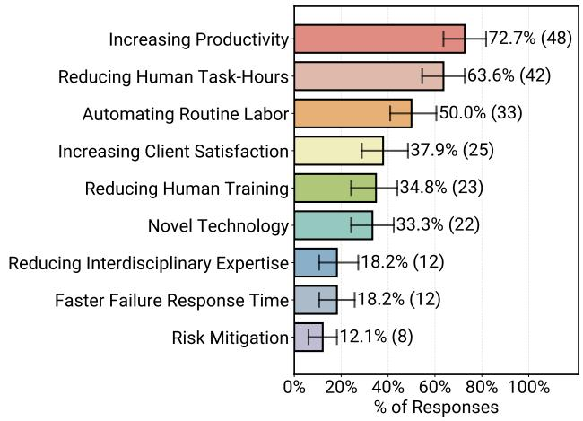  
Figure 1. Reasons practitioners build and deploy AI agents  $(N = 66)$ : increasing speed of task completion over the previous non-agentic (human or non-LLM automation) system (Increasing Productivity) is most often selected  $(73\%)$ , while improving operational stability (mitigating risk and accelerating failure recovery) is least often selected. Exact question and option descriptions are given in Appendix E.3 (N7).  $N = 66$  reflects the filtered subset of survey participants working on deployed agents who answered this question. Error bars indicate 95th-percentile intervals estimated from 1,000 bootstrap samples with replacements. The question was multi-select so participants were asked to select all/any benefits that applied to them and thus the proportions do not sum to 1.

eral AI scientist [12-14]. This excitement extends beyond research prototypes to production systems. Companies report agents actively running in diverse domains far beyond the initial coding focus [15-18], including finance [19-22], insurance [23-26], and education [27-29].

However, despite widespread excitement about agent potential [30-33], many question their real value and success in production [34-37]: whether agents can deliver on their promise and where their future lies. For example, a recent study reports that  $95\%$  of agent deployments fail [37]. This stark contrast between the promise of agents and their high failure rate raises fundamental questions about what separates successful deployments from failures.

Unfortunately, little information is publicly available on how production agents are built. Why do some agents succeed while others fail? What requirements must agents meet for production deployment? We lack a systematic understanding of what methods enable successful agents in the real world. Researchers have little visibility into real-world constraints and practices. Are agents failing because models are not capable enough, or are there other factors at play? Without understanding how agents actually work in production, researchers risk addressing the wrong problems. Meanwhile, practitioners lack consensus on how to build reliable agents and would benefit from understanding how the industry approaches these fast-evolving systems.

To address this knowledge gap, we present Measuring Agents in Production (MAP), the first large-scale systematic study of AI agents in production. We study the practices of developers and teams behind successful real-world systems via four research questions ( $\mathcal{R}\mathcal{Q}\mathcal{S}$ ):

$\mathcal{RQ1}$ . What are the applications, users, and requirements of agents?  
$\mathcal{RQ2}$ . What models, architectures, and techniques are used to build deployed agents?  
$\mathcal{RQ3}$ . How are agents evaluated for deployment?  
$\mathcal{RQ4}$ . What are the top challenges in building deployed agents?

We answer these questions through an online survey with 306 responses and 20 in-depth interviews with agent development teams, capturing technical details of production agent development. Our survey respondents are practitioners actively building AI agents (Figure 4a) across 26 domains, from finance and healthcare to legal (Figure 2). We filter the survey data to 86 responses that explicitly reported systems in production or pilot phases,\* which we denote as deployed agents, for the results in the main paper. The full dataset with all 306 responses appears in Appendix A. For in-depth interviews, we study 20 cases from teams building deployed agents with real users, spanning organizations from global enterprises to startups (Figure 3). Our case studies and survey capture deployed agent systems serving user bases ranging from hundreds to millions of daily users (Figure 4c), providing visibility into high-impact deployments. This dual approach provides the first empirically grounded view of the technical methods, architectural patterns, and operational practices behind AI agents in production.

To provide first-hand data on working practices and real-world constraints, our study focuses on practitioners actively

*Production systems are fully deployed and used by target end users in live operational environments. Pilot systems are deployed to controlled user groups for evaluation, phased rollout, or safety testing. Definitions for other stages appear in Appendix E.2 N5.

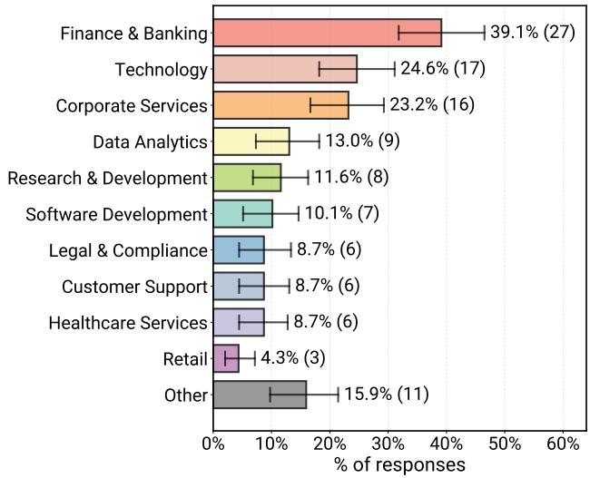  
Figure 2. Application domains where practitioners build and deploy Agentic AI systems ( $N = 69$ ). Deployments span a broad range of industries, with the highest concentrations in finance, technology (including but not limited to software development), and corporate services. Additional lower-frequency domains ("other") are listed in Table 2, totaling roughly 26 distinct domains. Note that this is a multi-class classification question where each system may be assigned to multiple domain categories.

building agents already deployed in production that serve users and deliver measurable value (Figure 1). This naturally biases toward successful deployments and experienced practitioners. Our data capture what works today, providing insight into how the field is developing.

Our study reveals key findings for each research question:

$\mathcal{RQ}1$ : Productivity gains drive agent adoption. We find that  $73\%$  of practitioners deploy agents primarily to increase efficiency and decrease time spent on manual tasks (Figure 1). Most systems  $(93\%)$  serve human users rather than other agents or systems (Figure 5a). Regarding requirements, teams prioritize output quality over real-time responsiveness:  $66\%$  allow response times of minutes or longer, compared to  $34\%$  requiring sub-minute latency (Figure 5b). In-depth interviews reveal that organizations tolerate this latency because agents that take minutes to execute still outperform human baselines.

$\mathcal{RQ2}$ : Simple methods and workflows dominate.  $70\%$  of interview cases use off-the-shelf models without weight tuning (Figure 6), relying instead on prompting. Teams predominantly select the most capable, expensive frontier models available, as the cost and latency remain favorable compared to human baselines. We find that  $79\%$  of surveyed deployed agents rely heavily on manual prompt construction (Figure 7), and production prompts can exceed 10,000 tokens. Production agents favor well-scoped, static work

flows:  $68\%$  execute at most ten steps before requiring human intervention, with  $47\%$  executing fewer than five steps. Furthermore,  $85\%$  of detailed case studies forgo third-party agent frameworks, opting instead to build custom agent application from scratch. Organizations deliberately constrain agent autonomy to maintain reliability.

$\mathcal{RQ3}$ : Human verification remains central to evaluation. The majority of deployed survey agents (74%) rely primarily on human-in-the-loop evaluation, and 52% use LLM-as-a-judge (Figure 10b). Notably, every interviewed team utilizing LLM-as-a-judge also employs human verification. Because production tasks are highly domain-specific, public benchmarks are rarely applicable. Consequently, 25% of teams construct custom benchmarks from scratch, while the remaining 75% evaluate their agents without formal benchmarks, relying instead on online-tests such as A/B testing or direct expert/user feedback. This pattern reflects the difficulty of automated evaluation for bespoke production tasks.

$\mathcal{RQ4}$ : Reliability is an unsolved challenge. Practitioners focus most on ensuring agent reliability, spanning correctness, latency, and security. The evaluation challenges described in  $\mathcal{RQ3}$  directly impact the ability to verify correctness to achieve reliable deployments. Latency impacts only a small subset (15%) of applications as a deployment blocker, and security represents a manageable concern that most deployed agents mitigate through action and environment constraints.

Our findings reveal that reliability concerns drive practitioners toward simple yet effective solutions with high controllability, including restricted environments, limited autonomy, and human oversight. For example, developers choose human-in-the-loop evaluation over fully automated techniques and manual prompt engineering over automated methods because these approaches offer control, transparency and trustworthiness. Practitioners deliberately trade-off additional agent capability for production reliability, and this design pattern already enables a broad spectrum of applications delivering real-world value (Figure 1). Production agents represent an emerging engineering discipline. Our study documents the current state of practice and bridges the gap between research and deployment: we provide researchers visibility into real-world constraints and opportunities while offering practitioners proven patterns from successful deployments across industries.

# 2. Related Work

To our knowledge, we offer the first technical characterization of how agents running in production are built.

Table 1. Overview of application and their domains from our 20 case studies. To maintain clarity and confidentiality, similar use cases are aggregated into representative descriptions.  

<table><tr><td>Business Operations</td></tr><tr><td>Insurance claims workflow automation</td></tr><tr><td>Customer care internal operations assistance</td></tr><tr><td>Human resources information retrieval and task assistance</td></tr><tr><td>Communication Tech, Multi-lingual Multi-dialect</td></tr><tr><td>Communication automation services</td></tr><tr><td>Automotive communication services</td></tr><tr><td>Scientific Discovery</td></tr><tr><td>Biomedical sciences workflow automation</td></tr><tr><td>Materials safety and regulatory analysis automation</td></tr><tr><td>Chemical data interactive exploration</td></tr><tr><td>Software &amp; Business Operations</td></tr><tr><td>Data analysis and visualization</td></tr><tr><td>Enterprise cloud engineer and business assistance</td></tr><tr><td>Site reliability incident diagnoses and resolution</td></tr><tr><td>Software products technical question answering</td></tr><tr><td>Software DevOps</td></tr><tr><td>Spark version code and runtime migration</td></tr><tr><td>Software development life cycle assistance end-to-end</td></tr><tr><td>Software engineer/developer slack support</td></tr><tr><td>SQL optimization</td></tr><tr><td>Code auto-completion and syntax error correction</td></tr></table>

Commercial Agent Surveys. Several prior efforts examine AI (agent) adoption in production from adjacent perspectives. MIT Media Lab and NANDA Initiative [37] and Challapally et al. [38] study economic viability and executive views on return-on-investment from companies attempting to integrate agents. Shome et al. [36] analyze marketing materials for 102 commercial agents and conduct user studies with 31 participants, revealing gaps between promised and realized capabilities. Industry reports [33, 39-42] focus on organizational readiness and market trends. LangChain [43] surveyed over 1,300 professionals on agent motivations, characteristics, and challenges.

Our work differs in two key ways: (i) Scope: we study agents actively operating in production; and (ii) Focus: we collect engineering-level technical data from practitioners. Our study complements these prior works and offers a new perspective into successful agents, providing insights into where the field is heading.

Research Agent Literature Survey. Many prior work examine LLM-powered agents from an academic perspective [44-49], providing valuable taxonomies of agent designs and tracing the evolution of key techniques. Other agent surveys focus on specific aspects: evaluation methodologies [50, 51], security concerns [52], and multi-agent systems [53]. In contrast, our work is an empirical study that collects primary data directly from practitioners building and operating deployed agents. We do not synthesize published research via literature reviews; instead, we conduct original survey data collection and in-depth case study

interviews to document production practices.

Single-System Studies. Companies publish papers and technical blogs on agentic systems [54-62] and open-source agent implementations [63-67], offering glimpses into production-related agents. Each paper naturally focuses on a single system or domain, creating an information gap: we lack understanding of common patterns, shared challenges, and design principles across deployments. We address this gap by surveying professionals across diverse industries to identify recurring engineering practices, architectural decisions, and challenges.

# 3. Methodology

To understand how production AI agents are built and deployed, we conducted two complementary studies: a large-scale public survey and 20 in-depth case study interviews. We detail our survey design and distribution in Section 3.1, describe our interview protocol and case study selection in Section 3.2, and outline our data processing pipeline in Section 3.3.

# 3.1. Public Online Survey

We designed and conducted a survey for practitioners building AI agents, with a strong focus on the technical details of their systems. The survey covers system architecture, evaluation, deployment, and operational challenges through 47 questions (listed in full in Appendix E). To capture AI Agents as practitioners understand them, we invited respondents to describe systems they refer to as AI Agents or Agentic AI without imposing a prescriptive definition.

To ensure relevance, we implemented the survey with dynamic branching logic in Qualtrics, where certain questions only appear based on previous responses. For example, the question about the realized benefits of using agents is only shown to respondents who confirmed they chose agentic over non-agentic solutions (O3.1.1 and O3.1 in Appendix E.3). This adaptive structure, combined with the optional nature of all questions, means each question receives a different number of responses. We report the specific sample size (N) for each result throughout Sections 4-7 in figure captions. We asked participants to focus their responses on a single system if they contributed to more than one agent system (Acknowledgment E.1). Full questionnaire details are available in Appendix E, including the branching logic in Figures 26 and 27.

We distributed the survey through multiple channels to reach practitioners across the AI agent ecosystem: the Berkeley RDI Agentic AI Summit [68], the AI Alliance Agents-in-Production Meetup [69], the UC Berkeley Sky Retreat [70], and professional networks including LinkedIn, Discord, and X. We release the survey on July 28, 2025, with data collec

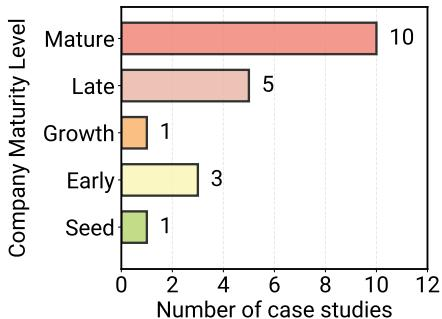  
Figure 3. The distribution of source institution maturities across in-depth interview-based case studies. The minority (5/20) are from seed-stage startups (validating product-market fit), early-stage startups (proving scalable business models), and growth-stage startups (rapidly expanding market share and operations). The majority (15/20) are from late-stage and mature institutions (with established market positions). The stages are approximated from limited public information e.g. size, sector, and annual recurring revenue.

tion for this paper ending October 29, 2025.

We received 306 valid responses. 294 participants indicated that they have directly contributed to the building and designing of at least one agent system. Our survey respondents are predominantly technical professionals such as software and machine learning engineers (Figure 4a). Among 111 respondents who reported their system's deployment stage,  $82\%$  indicated their systems are in production or pilot phases (Figure 4b), demonstrating rapid transition from experimental prototypes to real-world deployments.

To maintain focus on production systems, we filtered the data to 86 responses that explicitly reported their systems as being in production or pilot phases. Production systems are fully deployed and used by target end users in live operational environments, while pilot systems are deployed to controlled user groups for evaluation, phased rollout, or safety testing. This filtering excludes development prototypes, research artifacts, and retired systems, as well as participants who did not report their deployment stage. The definitions for all deployment stages appear in Appendix E.2 N5. We denote production and pilot systems as deployed agents. All survey statistics presented in this paper refer to deployed agents unless otherwise stated. Complete data for 306 valid responses across all deployment stages appears in Appendix A.

# 3.2. In-depth Case Studies

To add qualitative depth to our survey findings, we conducted 20 in-depth case studies through interviews with teams building deployed agents across a diverse range of organizations.

We carefully selected our 20 cases to achieve representative

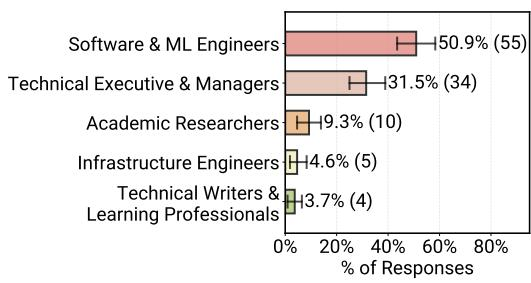  
(a)

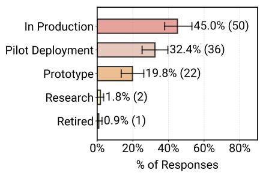  
(b)

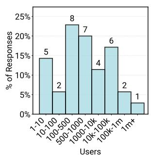  
(c)  
Figure 4. Overview of survey respondent and system characteristics across all agents the survey data: (a) roles of survey participants by primary contribution area  $(N = 108)$ , (b) deployment stages of Agentic AI systems  $(N = 111)$  that survey participants contributed to, and (c) reported number of end users  $(N = 35)$  for the Agentic systems survey participants contributed to.

samples across application diversity, organizational maturity, and global reach. We only interviewed systems with real-world users: 14 cases are in full production and 6 cases are in final pilot phases. The cases span five key sectors: business operations (3 cases), software development and operations (7 cases), integrated business and software operations (5 cases), scientific discovery (3 cases), and communication services (2 cases). Notably, these deployments extend well beyond commonly known coding agents or general chatbots, demonstrating the breadth of production agent applications. The systems target both internal employees (5 cases) and external enterprise consumers (15 cases). Our selection includes organizations across maturity levels, from seed-stage startups to large enterprises with global footprints (Figure 3). For companies with multiple agent deployments, we presented only distinct use cases to maximize application diversity. The anonymized case studies and their application domains appear in Table 1, with additional details in Appendix D.

Each interview lasted 30 to 90 minutes and was conducted by teams of 2 to 5 organizationally neutral interviewers. We followed a semi-structured interview protocol covering 11 topic areas (detailed in Appendix D.1), including system architecture, evaluation mechanisms, deployment challenges, operational requirements, and measurable agent values. We anonymized and recorded interviews based on participant preferences, with human note-takers capturing insights. To ensure accuracy, we cross-validated final summaries among all interviewers. Per our confidentiality agreements, we anonymized all data and present findings in aggregate.

# 3.3. Data Processing

Most survey questions use structured formats (single-select, multi-select, or numeric), requiring minimal postprocessing. For the free-text domain keyword responses used in Figure 2, we used LOTUS [71], a state-of-the-art unstructured data processing tool, to identify common do

main categories and perform classification. This allowed us to normalize phrases from survey responses to representative label sets. For instance, we grouped responses like "healthcare," "medical," and "patient monitoring" under a unified "healthcare" category. Details of this normalization process appear in Appendix B.1. All other figures present results from structured survey questions or interview data without requiring automated processing.

As described in Section 3.1, our survey data in the main paper are filtered to deployed (production and pilot) agents, and our interviews specifically select teams building deployed agents. All results presented in Sections 4-7 refer to deployed agents from either survey responses or interviews, which we explicitly denote throughout the paper. Refer to Appendix A for unfiltered full data.

For all figures that include error bars, we report  $95\%$  confidence intervals computed using 1,000 bootstrap samples with replacement.

# 4.  $\mathcal{R}\mathcal{Q}1$  Results: What Are The Applications, Users, and Requirements of Agents?

We now present findings from our survey and case study interviews across four central research questions. We start by examining motivations for agent adoption (Section 4.1), which agent applications successfully reach deployment (Section 4.2), who uses these systems (Section 4.3), and what latency requirements shape their design (Section 4.4). Understanding these patterns reveals where agentic systems deliver practical value and how they transform real-world applications.

# 4.1. Motivations for Choosing Agents

Among practitioners with deployed agents who evaluated alternatives,  $82.6\%$  prefer the agentic solution for deployment. We define non-agentic alternatives as existing software sys

tems, traditional approaches, or human execution. Figure 1 details the specific benefits reported by these practitioners. The top three drivers all target the reduction of human effort: increasing productivity and efficiency (72.7%), reducing human hours (63.6%), and automating routine labor (50.0%). Conversely, qualitative benefits rank lower. Increasing user satisfaction ranks in the middle tier (37.9%), followed by reducing required human expertise and training (34.8%) and enabling novel technology (33.3%). Accelerating failure response times (18.2%), reducing interdisciplinary knowledge requirements (18.2%), and risk mitigation (12.1%) rank last.

These priorities reflect pragmatic deployment realities. Organizations adopt agents to solve immediate operational problems, such as expert-expensive manual work and insufficient staffing capacity. Productivity gains are straightforward to quantify through human-hour reductions, whereas safety improvements and risk mitigation are harder to verify. This focus aligns with our findings on internal deployments (Section 4.3), where organizations tolerate higher error rates by maintaining human oversight to catch these errors.

The top reported reasons for using agents reveal a trend where certain objectives are more verifiable and measurable. For example, time to complete a task (productivity) is concrete and quantifiable, while risk mitigation benefits takes longer to verify. We examine this measurement gap and its implications for deployed agents in Section 7.1.

$\mathcal{RQ1}$  Finding #1: Productivity gains through automating routine human tasks drive agent adoption  $(73\%)$ , while harder-to-verify applications like risk mitigation are less common.

# 4.2. Application Domains

We find that agents operate in diverse industries well beyond software engineering. Figure 2 shows that the three domains with the highest number of reported deployments in survey are Finance & Banking (39.1%), Technology (24.6%), and Corporate Services (23.2%). We also observe a long tail of applications in Data Analytics (13.0%), Research & Development (11.6%), and other specialized domains (15.9%). This distribution demonstrates that agentic systems deliver practical value across fundamentally different industries.

$\mathcal{RQ1}$  Finding #2: Deployed agents already operate across 26 diverse domains, well beyond math and coding that are popular in research, demonstrating value across different industries.

# 4.3. Users of Agents

We find that deployed agents primarily serve human users directly. Survey data indicates that  $92.5\%$  of deployed sys

tems serve humans rather than other agents or software systems. As shown in Figure 5a, internal employees are the primary user base (52.2%), followed by external customers (40.3%). Only 7.5% of deployed systems serve non-human consumers.

The focus on internal users is a deliberate deployment choice. Detailed case studies reveal that organizations restrict deployments to internal environments to mitigate unsolved reliability and security concerns. Internal users operate within organizational boundaries where agent mistakes have lower consequences and human oversight is readily available. An example from our case study, internal Pager-Duty agents respond to employee requests, while human engineers can take over when needed.

Furthermore, most systems—including external-facing applications—require domain-specific knowledge to operate. For example, insurance authorization agents support nurses, and incident response agents support site reliability engineers. This reflects a pattern where agents function as tools that augment domain experts rather than replace them. This paradigm also enables human users to serve as the final verifiers of agent outputs, which we discuss further in Section 6.2.

Beyond user type, we examine the scale of the user base. We find that end-user counts for deployed systems vary significantly. As shown in Figure 4c,  $42.9\%$  of deployments serve user bases in the hundreds. However, we also observe high-traffic deployments  $(25.7\%)$  serving tens of thousands to over 1 million users daily, representing substantial user impact or possibly mature systems.

$\mathcal{RQ1}$  Finding #3: Deployed agents primarily serve human end-users  $(92.5\%)$ , which enables close human-oversight.

# 4.4. Latency Requirements

Relaxed latency requirements are common among deployed agents. Figure 5b shows the distribution of maximum allowable end-to-end latency. Minutes is the most common target, followed by seconds. Notably,  $17.0\%$  report no defined limit yet, and  $1.9\%$  allow hours to days.

The latency tolerance reflects the productivity focus from Section 4.1. Agents are often used to automate tasks that typically take humans hours to complete. Consequently, an agent taking multiple minutes to respond remains orders of magnitude faster than non-agentic baselines. Interview participants emphasized this advantage: even if an agent takes five minutes, that remains more than  $10 \times$  faster than assigning the task to a person on the team, especially when staffing shortages exist and the task is secondary to the user's core responsibilities. Examples include nurses examining

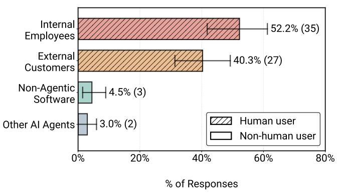  
(a)

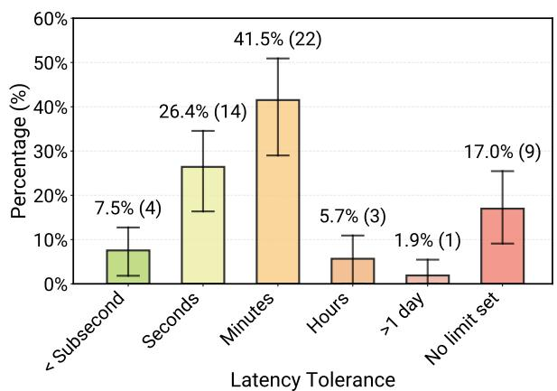  
(b)  
Figure 5. Overview of Agentic AI deployment characteristics in terms of primary end users and latency requirements: (a) Distribution of primary end users  $(N = 67)$ , where hatched bars  $/ / /$  denote human end-users and solid bars denote non-human end-users; and (b) Reported tolerable end-to-end response latency for deployed systems  $(N = 53)$ . Over  $92\%$  of deployed agents primarily serve human users, and most systems tolerate response times on the order of minutes rather than requiring strict real-time responsiveness.

insurance details and software engineers responding to internal pager duty. Some deployed agents from case studies even batch requests hourly or overnight, further indicating latency is not a primary constraint.

However, this pattern breaks for real-time interactive applications. For example, practitioners building voice-driven systems report latency as their top challenge (Section 7.2) during detailed case study. These systems compete against human conversation speeds rather than task completion baselines. Among our 20 detailed case studies, only 5 require real-time responsiveness. The remaining 15 cases tolerate extended processing times: 7 involve human review with relaxed timing, 5 operate as asynchronous background processes, and 3 have hybrid operation patterns. For these systems, processing times of minutes remain acceptable because the alternative is days of human effort.

$\mathcal{RQ1}$  Finding #4: Development teams prioritize agent output quality and capability by concentrating on latency-relaxed applications.

# 5.  $\mathcal{RQ2}$  Results: What Models, Architectures, And Techniques Are Used To Build Agents?

Having established what problems practitioners target with agentic systems, we now address how these systems are built. We examine five critical implementation decisions: model selection, model weights tuning, prompt construction, agent architectures, and development frameworks.

Overall, practitioners favor established, straightforward methods over stochastic or training-intensive techniques. We find that methods popular in research—such as fine

tuning, reinforcement learning, and automated prompt optimization—remain uncommon in deployment. Instead, teams prioritize control, maintainability, and iteration speed.

# 5.1. Model Selection

We find that deployed agents rely heavily on proprietary models. Only 3 of 20 detailed case studies use open-source models (LLaMA 3 [72], Qwen [73], and GPT-OSS [74]), while the remaining 17 rely on closed-source frontier models (Figure 6). Of the teams using closed-source models, 10 explicitly confirm using the Anthropic Claude [75] or OpenAI GPT [76] families. Specific models mentioned during interviews include Anthropic Claude Sonnet 4 and Opus 4.1, and OpenAI o3, each representing the state-of-the-art model from each provider at the time of the interview. While other participants did not disclose specific models, most interviewees followed the pattern of using the largest and most capable state-of-the-art models as the primary model for their agents from each model family.

We find that open-source adoption is rare and is driven by specific constraints rather than general preference. Among the three cases using open-source models, motivations include high-volume workloads where inference costs at scale are prohibitive, and regulatory requirements preventing data sharing with external providers. For example, one team from detailed case study serve continuous infrastructure maintenance agent leverages the company's existing internal compute resources (e.g., GPUs) to serve a fine-tuned open-source model to meet cost constraints.

For the majority of cases, model selection follows a pragmatic, empirical approach focused on downstream performance. Interviewees report that they test the top accessible

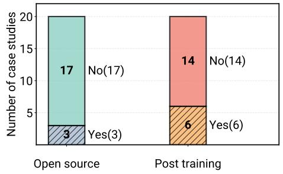  
Figure 6. Distribution of model characteristics of case-study systems from our interviews  $(N = 20)$ . The left bar chart shows model source openness; "Yes" indicates open-source model usage while "No" indicates closed-source or non-disclosed model usage. The right bar chart shows whether post-training (e.g. fine-tuning, reinforcement learning) is utilized ("Yes"); "No" labels non-use or non-disclosure. Overall, most case-study systems rely on off-the-shelf closed-source models, with comparatively fewer teams using open-source models or performing additional post-training.

state-of-the-art models for each task and select based on performance. Unlike the high-volume open-source use cases, these teams note that runtime costs are negligible compared to the human experts (e.g., medical professionals, senior engineers) that the agent augments. Consequently, they default to the best-performing closed-source models regardless of inference cost. $^{\dagger}$  Additionally, 4 out of 20 detailed case studies combine LLMs with specialized off-the-shelf models (e.g., text-to-speech, chemistry foundation models) to handle specific modalities.

$\mathcal{RQ2}$  Finding #1: Deployed agents predominantly rely on proprietary frontier models; open-source models are used primarily to satisfy cost or regulatory constraints.

Number of Distinct Models. While a substantial portion rely on a single model, the majority coordinate multiple models to meet functional or operational needs. Survey results show that  $40.9\%$  of deployed agents use exactly one model, while  $27.3\%$  use two,  $18.2\%$  use three, and  $13.6\%$  use four or more. Among detailed case studies, 10 out of 20  $(50\%)$  combine models to address specific functional needs. We identify two drivers: cost optimization and modality. First, teams combine models of varying sizes to balance latency, cost, and quality. For example, one agent workflow from case study routes simple subtasks like pattern recognition to smaller models while reserving larger models for subtasks requiring higher reasoning capabilities. Second, teams integrate models to handle distinct data modalities. Communication agents leverage text-to-speech models alongside LLMs, while scientific agents employ domain-specific foundation models (e.g., chemistry) alongside general-purpose

reasoning models.

Operational constraints also drive multi-model adoption. We find that multi-model architectures can emerge from lifecycle management needs rather than complex reasoning requirements for the agent task. Detailed case studies reveal that teams maintain multiple models to manage agent's behavioral shifts from model migration. Organizations often run legacy models alongside newer versions because agent scaffolds and evaluation suites depend on the specific behaviors of the older model, where sudden updates might degrade output quality. Additionally, governance policies enforce teams to route subtasks to different model endpoints based on user or developer access levels. Thus, architectural complexity often reflects strategic operations rather than task difficulty.

Interestingly, we observe a heavier tail towards agents using more distinct models when we examine the full survey data, including prototyping and research agents that have not yet been deployed (Figure 16a). Deployed agents are more likely to converge on fewer number of distinct models compared to non-deployed agents, suggesting that teams explore richer multi-model combinations during early experimentation but consolidate onto a smaller set of models as they move toward deployment. We hypothesize this might be also reflecting the additional operational burden of maintaining many distinct model endpoints.

$\mathcal{RQ2}$  Finding #2: The majority of agents coordinate multiple models, driven not only by functional needs like modality but also by operational requirements such as model migration.

# 5.2. Model Weights Tuning

We observe a strong preference for prompting over model weight updates in deployed agents. We find that 14 out of 20 (70%) detailed case studies rely solely on off-the-shelf models without supervised fine-tuning (SFT) or reinforcement learning (RL) (Figure 6). Additionally, 2 teams from detailed case studies explicitly report that foundation model capabilities already meet their target use case, making fine-tuning unnecessary.

Only 5 of 20 detailed case studies actively use SFT. These teams target deployment in business-specific corporate contexts where leveraging highly contextual information improves downstream performance. For example, customer product support agents benefit from fine-tuning on specific product offerings and policies. However, performance gains do not always justify the development overhead. Among the 5 detailed case studies actively using fine-tuned models, 3 consider SFT essential, while 2 apply it selectively for enterprise clients where customization requirements justify the additional cost. Three additional teams from interview

case studies express strong interest in future adoption for similar reasons. Notably, we find that 4 of the 5 detailed case studies that employ SFT do so in combination with off-the-shelf LLMs, rather than relying on fine-tuned models exclusively.

Regarding reinforcement learning (RL), only 1 scientific discovery case from our interviews uses an RL post-trained model. Three other teams express interest in exploring RL for software testing in future development cycles.

This data, however, does not diminish the value of posttraining models for agent applications. Interviews show that SFT and RL is challenging to implement and brittle to model upgrades. Given that off-the-shelf base models can already do most of what the agent applications need, teams prefer methods with lower integration overhead that do not increase already high development and maintenance burdens.

$\mathcal{RQ2}$  Finding #3: Practitioners rarely post-train models. When they do, they selectively apply SFT/RL to specific subtasks or clients, typically in combination with general LLMs. Teams find prompt engineering with frontier models sufficient for many target use-cases already.

# 5.3. Prompting Strategies

We find that humans dominate system-prompt construction in production systems. Our survey data reveals that  $33.9\%$  of deployed agents use fully manual methods with hardcoded strings. Another  $44.6\%$  use a hybrid approach where humans manually draft prompts and then use an LLM to augment or refine them, and  $3.6\%$  rely on utilizing predefined prompt templates. Only  $8.9\%$  of respondents use a prompt optimizer (e.g., DSPy [77]) to improve their agent systems, and just  $3.6\%$  report letting agents autonomously generate their own prompts.

Our detailed case studies confirm this pattern. Only 1 out of 20 (5%) detailed case studies has explored automated prompt optimization. The remaining cases rely on primary human construction, sometime using LLMs for augmentation. While recent research [77-79] proposes automating prompts into parametric optimizations, we find these methods rare in deployment. We speculate from interview conversations with practitioners that they prioritize controllable, interpretable methods that allow for fast iteration and debugging over automated or "black-box" methods that requires additional engineering overhead.

$\mathcal{RQ2}$  Finding #4: Human dominates prompt construction as teams prioritize controllability. LLMs are used as secondary tools to augment human-crafted prompts, while automated prompt optimization remains rare.

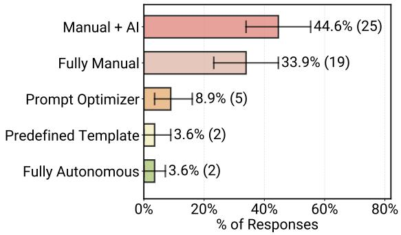  
Figure 7. Distribution of prompt construction strategies across deployed Agentic AI systems ( $N = 53$ ). Overall, the prompting patterns indicate that humans remain central to prompt crafting. This was a multi-select question, so respondents could choose all prompt construction strategies that applied.

We find that prompt complexity increases with system maturity. Among deployed agents from survey, we observe a wide distribution: while  $51.5\%$  of systems use short instructions under 500 tokens, there is a long tail of massive prompts (Figure 8b). Specifically,  $24.2\%$  of deployed agents use prompts between 500 and 2,500 tokens,  $12.1\%$  use between 2,500 to 10,000. Notably, another  $12.1\%$  even exceed 10,000 tokens.

$\mathcal{RQ2}$  Finding #5: Deployment prompt lengths vary widely: while half are short (<500 tokens), a significant long tail (12%) exceeds 10,000 tokens to handle complex contexts.

# 5.4. Agent Architecture

We explore the core architectural patterns that support production deployment. To ensure clarity, we adopt the terminologies visualized in Figure 22: an agent completes a high-level task, which decomposes into logical subtasks, consisting of granular atomic steps (e.g., model calls, tool use).

Number of Steps. We find that production agents tend to follow structured workflows with bounded autonomy. We ask survey participants how many steps their deployed systems execute within a subtask before requiring human input. Most systems operate within tight bounds:  $46.7\%$  of deployed survey agents complete only 1-4 steps, and an additional  $21.7\%$  perform 5-10 steps (Figure 8c). A smaller subset  $(16.7\%)$  extends to tens of steps, while only  $6.7\%$  report systems with no explicit step limit. Interestingly when we expand the analysis to include all agents including both deployed and not yet deployed agents in Figure 16c, the distribution shifts toward substantially higher step counts. This indicates that prototypes and research systems are more likely to run tens of steps or have no explicit limit on au

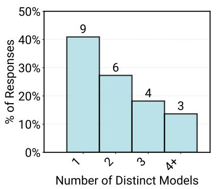  
(a)

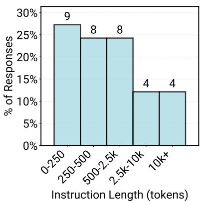  
(b)

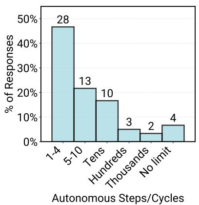  
(c)  
Figure 8. Overview of core components configurations and architectures in deployed Agentic AI systems: (a) Number of distinct models combined to solve a single logical task  $(N = 22)$ ; (b) Distribution of prompt lengths in temrs of tokens  $(N = 33)$  and (c) Number of autonomous execution steps before user intervention  $(N = 60)$ .

tonomous cycles, reflecting more aggressive exploration of open-ended autonomy during early development.

Practical constraints drive this design choice. Case study participants identify problem complexity, non-determinism in agent self-planning, and latency requirements as key limiting factors. Practitioners intentionally impose limits on reasoning steps to maintain reliability and manage computational time and costs. This simplicity reflects a broader preference for predictable, controllable workflows over experimental open-ended autonomy in production environment.

Number of Model Calls. While distinct from logical steps (which often include non-inference actions like tool execution), we specifically analyze model calls to gauge the inference intensity of deployment systems. We observe that within a single subtask, deployment systems typically execute model calls on the order of tens or less. The majority  $(66.7\%)$  of deployed survey agents use fewer than 10 calls per subtask, with  $46.7\%$  using fewer than 5 calls. This is followed by  $33.3\%$  using tens of calls,  $9.0\%$  in the hundreds, and  $6.1\%$  in the thousands. Interestingly, another  $12.1\%$  do not set explicit limits. This aligns with our detailed case studies, where 3 teams confirm executing tens of model calls per subtask (up to 40-50 calls).

Experimental systems are far more likely to sit in the long tail, with many agents routinely making tens of calls. In contrast, deployed agents concentrate in the lower-call regime, suggesting that teams aggressively cap or refactor call budgets as they move from experimentation to deployment to probably control cost, latency, and failure amplification.

Despite the pattern of limited model calls,  $31\%$  of deployed survey agents already use various inference-time scaling techniques, compared to  $44\%$  in experimental sys

tems. While this figure currently includes simpler methods like composing outputs from multiple models (Section 5.1), future work may determine how advanced techniques—such as self-planning, search-based reasoning, and self-verification—perform in production, as these approaches may then lead to higher numbers of model calls and steps before human intervention.

$\mathcal{RQ2}$  Finding #6: Agents operate with tightly bounded autonomy:  $68\%$  of systems execute fewer than ten steps and  $46.7\%$  with less than 5 model calls before requiring human intervention.

Agent Control Flow. We observe that production agents favor predefined static workflows over full open-ended autonomy. We find that  $80\%$  of our detailed case studies utilize a structured control flow. These agents operate within well-scoped action spaces rather than freely exploring the environment to self-determine objectives.

Detailed case studies provide insight into these control flow patterns. Nine cases utilize various forms of agentic Retrieval-Augmented Generation (RAG) pipelines, ranging from single agents retrieving information via tool calls to sophisticated pipelines with over 20 subtasks that explicitly configure retrieval at certain steps. For example, one insurance agent follows a fixed sequence: coverage lookup, medical necessity review, and risk identification. While the agent possesses autonomy to complete each subtask (e.g., deciding if a case needs human intervention for risk identification), the high-level objective and expected output of each subtask remain fixed.

Open-ended autonomy remains rare. We observe only one

case where agents operate with unconstrained exploration. Notably, this system runs exclusively in a sandbox environment with rigorous CI/CD verification on the final outputs, avoiding direct interaction with production environment.

However, we identify a growing interest in expanding autonomy. Four detailed case studies employ a planning and routing agent to decompose input requests and dispatch them to task-specialized agents. Another team specializes agents into generators and verifiers, enabling greater autonomy through automated verification. Several teams share that they are experimenting with flexible workflows by allowing agents to make autonomous decisions about next steps or by using planning and orchestration agents.

RQ2 Finding #7: Deployment architectures favor predefined, structured workflows over open-ended autonomous planning to ensure reliability.

# 5.5. Agentic Frameworks

We find a divergence in framework adoption between survey respondents and interview case studies. Among deployed agents from the survey, two-thirds (60.7%) use third-party agentic frameworks. Reliance concentrates around three primary frameworks: LangChain/LangGraph [80, 81] leads with  $25.0\%$ , followed by CrewAI [82] at  $10.7\%$ , with LLaMAIndex [83] and OpenAI Swarm [84] both at  $3.6\%$  (Figure 9).

In sharp contrast, our detailed case studies reveal a strong preference for custom in-house agent implementations. Only 3 of 20 (15%) detailed case studies rely on external agent frameworks (2 use LangChain, 1 uses BeeAI). The remaining 17 teams (85%) build their agent application entirely in-house with direct model API calls. For example, one interview case explicitly shared that their agents are their own implementation of ReAct loops. Notably, two additional teams report starting with frameworks like CrewAI during the experimental prototyping phase but migrating to custom in-house solutions for production deployment to reduce dependency overhead.

We identify three core motivations for building custom solutions from the detailed case studies. First, flexibility and control are critical. Deployed agents often require vertical integration with proprietary infrastructure and customized data pipelines that rigid frameworks struggle to support. For example, one agent-native company deploys customer-facing agents across varied client environments, necessitating a bespoke orchestration layer. Second, simplicity drives the decision. Practitioners report that core agent loops are straightforward to implement using direct API calls. They prefer building minimal, purpose-built scaffolds rather than managing the dependency bloat and abstraction layers of large frameworks. Third, security and privacy poli

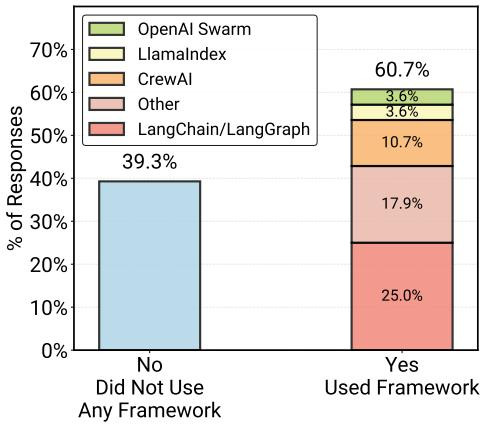  
Figure 9. Frameworks reported to support critical functionality among those using open frameworks for production systems ( $N = 29$ ). Additional framework options were provided in the survey; see Appendix E.3 for the complete question and options.

cies sometime prohibit the use of certain external libraries in enterprise environments, compelling teams to develop compliant solutions internally.

$\mathcal{RQ2}$  Finding #8: Framework adoption varies significantly between survey and case study. While third-party frameworks get broad adoption in the survey (61%), interviewed teams predominantly build custom in-house implementations (85%) to maximize control and minimize dependency bloat.

# 6.  $\mathcal{R}\mathcal{Q}3$  Results: How Are Agents Evaluated For Deployment?

Evaluation practices shape which agentic systems reach production and how teams iterate on deployed systems. We investigate how practitioners evaluate and test their agents to meet production deployment requirements, examining both offline evaluation during development and online evaluation in production environments. Specifically, we examine two aspects: what practitioners compare their systems against (baselines and benchmarks), and what methods they use to verify system outputs (evaluation methods).

Our findings reveal that evaluation practices vary widely across production agents, even within the same application domain, shaped by the specific requirements of each deployment context and the availability of ground truth data. Notably, practitioners currently focus on agent output quality and correctness rather than traditional software reliability metrics. Based on 20 detailed case studies, no team reports applying standard production reliability metrics such as five 9s availability to their agent systems. Instead, evaluation centers on whether agents produce correct, high-quality responses.

# 6.1. Baselines and Benchmarks

During development, teams conduct offline evaluation to assess agent performance before deployment. Figure 10a shows that  $38.7\%$  of survey respondents compare their deployed agentic systems against non-agentic baselines such as existing software systems, traditional approaches, or human execution. The remaining  $61.3\%$  do not perform baseline comparisons. Among these,  $25.8\%$  report their systems are truly novel with no meaningful baseline for comparison. While we do not know reasons behind why the remaining  $35.5\%$  did not conduct the comparison, in-depth interviews reveal that baseline comparison is often challenging even when alternatives exist. One reason is that non-agentic baselines frequently combine multiple components, making systematic technical comparison difficult. The HR support agent development team illustrates that agent solution replace a baseline process combining company document lookup, human procedures, and non-LLM HR software. While outcomes such as task completion time are measurable, isolating technical performance for comparison is challenging.

Beyond baseline comparison, teams employ benchmark evaluations. We refer to benchmark here as a curated set of tasks or questions with known correct answers. Among 20 teams, 5 build custom benchmarks. One team builds benchmarks from scratch, collecting ground truth labels through collaboration with domain experts. Four teams synthesize existing data to curate benchmarks, drawing from past test cases, system logs, pull requests, and support tickets. One team also leverages public benchmarks during early development. The remaining 15 teams  $(75\%)$  evaluate their agents without benchmark sets, using alternative methods such as A/B testing, user feedback, and production monitoring.

Among the 5 teams building custom benchmarks, our interviews reveal a prevalent evaluation pattern despite diverse domains and organizations (e.g., human resources, cloud infrastructure, and business analytics). Teams establish a golden question-and-answer set, collect user interaction and feedback data, then work with subject matter experts to examine quality and expand the golden set. This process extends into production runtime, enabling LLM-as-a-judge online evaluation pipelines. Based on our analysis, the convergence of nearly identical pipelines across diverse contexts suggests research and development opportunities in reusable data ingestion pipelines, curation methods for golden sets, and synthetic generation techniques for evaluation datasets.

$\mathcal{RQ3}$  Finding #1: Many agentic systems lack standardized benchmarks or baselines. Teams build custom evaluation frameworks from scratch, often creating ground truth data for the first time.

# 6.2. Evaluation Methods

We ask participants which evaluation strategies they employ, allowing multiple selections. These methods apply to both offline evaluation during development and online evaluation in production environments. Four methods dominate responses: human-in-the-loop evaluation, model-based evaluation, rule-based evaluation (heuristics or syntactic checks), and cross-referencing evaluation (verification against knowledge bases or reference datasets). The exact question and method descriptions appear in Appendix E.

Human-in-the-loop verification. The majority  $(74.2\%)$  rely on manual, human-in-the-loop evaluation (Figure 10b. These evaluations typically involve domain experts, operators, or end-users directly inspecting, testing, or validating system outputs to ensure correctness, safety, and reliability.

Human experts play a critical role during development for offline evaluations. Agent developers work directly with domain experts or target users to validate system responses. For example, medical professionals are directly involved when testing and evaluating the correctness of healthcare agent systems. In one case, a company even forgoes automated evaluation methods entirely, relying instead on human experts to provide feedback to hand-tune agent configurations for each client's deployment environment.

Human experts also serve as verifiers during agent execution for online evaluation. Teams commonly have human experts perform final actions based on agent output, serving as a layer of guardrails. For example, one site reliability engineering agent suggests actions based on analysis across system stacks, but human experts make the final decision on what to execute. The agent does not directly modify the production environment.

Model-based evaluation. Model-based evaluation methods such as LLM-as-a-judge are the second most common approach, used by  $51.6\%$  of respondents (Figure 10b). While this evaluation method applies for both offline development time and online runtime evaluation, 7 of 20 interview case studies use LLM judges for online evaluation during agent execution.

Model-based evaluation does not eliminate human involvement. Figure 10c shows the co-occurrence of different evaluation strategies, revealing that among the  $51.6\%$  of survey respondents who use model-based evaluation, a substantial portion  $(38.7\%)$  also employ Human-in-the-Loop verification. In detailed case studies, all interviewed teams using LLM-as-a-judge combine it with human review. Specifically, these teams use LLM judges to evaluate confidence in every final response, combined with human subsampling. An LLM judge continuously assesses each agent's final response. If the judge scores above a preset confidence threshold, the output is accepted automatically. Otherwise,

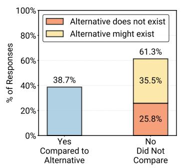  
(a)

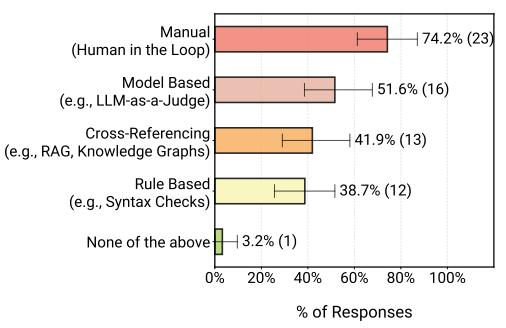  
(b)

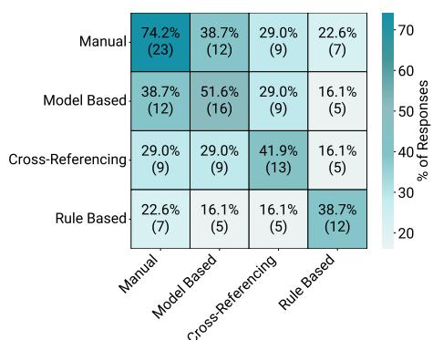  
(c)  
Figure 10. Evaluation Practices in Agentic AI Systems: (a) Comparison to Alternatives: Shows whether participants explicitly compared their deployed agent against a non-agentic baseline (e.g., existing software, traditional workflows, etc). (b) Evaluation Methods Distribution: Distribution of evaluation methods reported by practitioners  $(N = 31)$ . The question was multi-select, so respondents could choose multiple methods. (c) Evaluation Strategies Co-occurrence: Visualizes the pairwise overlap between evaluation strategies. Manual human-in-the-loop evaluation has the highest overlap with other strategies, suggesting that teams commonly rely on manual review to complement automated checks.

the request routes to human experts. Additionally, human experts sample a preset percentage (e.g.,  $5\%$ ) of production runs even when the LLM judge expresses high confidence, verifying correctness to ensure consistent alignment at runtime. Development teams update prompt instructions and agent configurations based on this production feedback.

Other methods. Rule-based evaluation methods and cross-referencing strategies show comparable adoption rates (41.9% and 38.7% respectively). Rule-based evaluation consists of simple logic checks such as grammar and syntax verification or domain-specific rules. For example, coding agents verify outputs through compilation checks and test suites, while analytical agents may apply domain-specific rubrics to assess output quality. Cross-referencing evaluation uses external sources for grounding and fact-checking to verify the accuracy and quality of generated answers or solutions. This includes retrieving supporting evidence from trusted knowledge bases or comparing outputs against reference datasets.

Evaluation method patterns. Co-occurrence analysis reveals that human-in-the-loop evaluation is the most common method used together with other evaluation strategies (Figure 10c). Practitioners anchor automated, rule-based, and cross-referencing methods around human judgment rather than relying on them in isolation.

Notably, human-in-the-loop (74.2%) and LLM-as-a-judge (51.6%) dominate compared to rule-based verification (42.9%). Based on our analysis, this pattern may suggests that production agents already handle complex tasks beyond classification, entity resolution, or pattern matching. These agents operate in domains requiring nuanced judgment where rule-based methods prove insufficient. For example, customer support voice assistance and human re

source operations demand expertise beyond pattern matching, explaining why practitioners require human and LLM verification to assess output correctness.

$\mathcal{R}\mathcal{Q}3$  Finding #2: Human judgment dominates evaluation  $(74.2\%)$ . LLM-as-a-judge emerges as a complementary automated approach  $(51.6\%)$ , typically combined with human verification.

# 7.  $\mathcal{RQ4}$  Results: What Are The Top

# Challenges In Building Production Agents?

AI agents are deployed at scale, yet significant challenges remain. We investigate the friction points practitioners face most when building production agents. Our survey and detailed case studies reveal that reliability remains the primary bottleneck. Survey respondents at all agent stages rank "Core Technical Focus" as their top challenge (37.9%), far outweighing governance (3.4%) or compliance (17.2%) (see Appendix B.3). Core technical focus encompasses reliability, robustness, and scalability. This prioritization signals that practitioners currently focus on making agents work consistently and correctly.

$\mathcal{RQ4}$  Finding #1: Reliability remains unsolved. It represent the top development focus for agents in all stages including ones in deployment.

We detail the three specific dimensions of these challenges: evaluation (Section 7.1), latency (Section 7.2), and security (Section 7.3). This gap highlights research opportunities to advance agents from bounded use cases toward broader applications.

# 7.1. Evaluation Challenges

Difficulties creating benchmarks. As defined in Section 6.1, benchmarks are curated sets of tasks or questions with known correct answers used for offline evaluation during development. Among interviewed teams, 5 build custom benchmarks. However, benchmark creation proves challenging for three reasons based on our case study interviews.

First, specific domains lack accessible public data. In regulated fields like insurance underwriting, the absence of public data forces teams to handcraft benchmark datasets from scratch through collaboration with domain experts and target users. Second, creating high-quality benchmarks at scale is resource-intensive and time-consuming. One interviewed team reported spending months creating an initial set of approximately 40 unique environment-problem-solution scenarios, followed by another six months to scale the dataset to roughly 100 examples. Third, benchmark creation is nearly infeasible for agent applications focused on highly customized client integrations. One interviewed voice agent team illustrates this challenge: while core features are straightforward to test without extensive data, the primary engineering effort involves client-specific customizations such as proprietary toolsets, product offerings, and localized dialogue tuning. Creating standardized benchmarks for every possible client configuration is impractical. Given these challenges,  $75\%$  of interviewed teams forgo benchmark creation entirely, instead relying on A/B testing or direct client collaboration to iterate based on human feedback until expectations are met.

Agent behavior breaks traditional software testing. Three case study teams report attempting but struggling to integrate agents into existing CI/CD pipelines. The challenge stems from agent nondeterminism and the difficulty of judging outputs programmatically. Despite having various forms of existing regression tests from baseline systems, these teams have not yet identified effective methods to adapt them for nondeterministic agent behavior to create test set that cover sufficient runtime scenarios with different nuances.

Verification mechanisms and benefit quantification. Based on the interview case studies, we observe that agent faces two broader evaluation challenges. First, robust verification mechanisms do not always exist. Coding-related agents benefit from strong correctness signals through compilation and test suites, such as software migration agents and site reliability agents in Table 1. However, many agents operate in settings without robust and fast verification. For example, insurance agents receive true signals only through real consequences such as financial losses or delayed patient approvals. These signals arrive slowly and in forms difficult to automate for evaluation. Second, the final benefits of using agents are not always easy to measure. Section 4.1

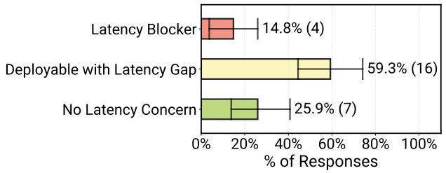  
Figure 11. Degree to which latency causes problems for deployment of Agentic AI systems ( $N = 27$ ). These responses suggest that latency is rarely a strict blocker for deploying most agentic AI systems.

shows agents target productivity gains because end-to-end time and human hours quantify straightforwardly. Applications with harder-to-measure benefits remain less explored. For example, we observe fewer cases of agents reducing cross-domain knowledge needs or mitigating risks, potentially because benefits manifest indirectly or over longer timeframes.

# 7.2. Latency Challenges

We examine the degree to which agent execution latency hinders deployment. Survey results indicate that latency represents a manageable friction rather than a hard stop for most teams. Figure 11 shows that only  $14.8\%$  of deployed survey agents identify latency as a critical deployment blocker requiring immediate resolution, while the majority  $(59.3\%)$  report it as a marginal issue, where current latency is suboptimal but sufficient for deployment. We suspect that this tolerance may correlates with the prevalence (15/20 in detailed interview case studies) of asynchronous agent execution paradigm (Section 4.4) and  $(52.2\%)$  from survey) internal user bases (Section 4.3). Notably, we observe a consistent latency distribution across the full survey dataset, including experimental systems (Figure 19b). We believe this consistency signals a broader preference for building offline agents, as discussed in Section 4.4.

Interactive agent latency requirements. While latency is not a critical challenge for most agent applications, it remains a critical bottleneck for real-time interactive agents. Two interviewed teams, building voice and specialized chat agents, report continuous engineering efforts to match human conversational speeds. Unlike asynchronous workflows, these systems require seamless turn-taking where delays disrupt the user experience. Achieving fluid real-time responsiveness beyond rigid turn-based exchanges remains an open research question and development challenge.

Practical latency management. Interview participants describe two approaches to managing latency. First, teams commonly implement hard limits on maximum steps or

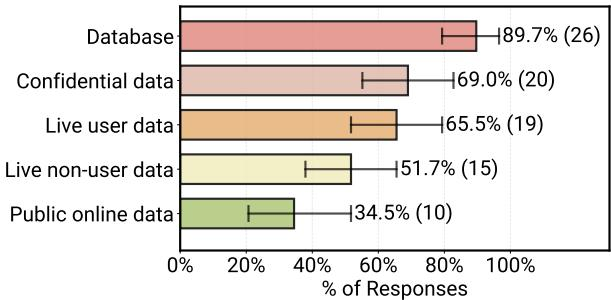  
Figure 12. Overview of data handling capabilities: Types and modes of data ingestion and handling in deployed agent systems  $(N = 29)$ . The question was multi-select i.e., allowing participants to indicate all/any data handling methods currently integrated into their deployed agentic systems. The data illustrates how agents source information, showing a strong reliance on internal infrastructure over public sources.

model inference calls, typically derived from heuristics. Second, one team adopts a creative solution by pre-building a database of request types and agent actions (tool calls), then employing semantic similarity search at runtime to identify similar requests and serve prebuilt actions, reducing response times by orders of magnitude compared to reasoning and generating new responses. These workarounds demonstrate that practitioners currently rely on system-level engineering to bypass the inherent latency costs of foundation models.

# 7.3. Security and Privacy Challenges

Security and privacy consistently rank as secondary concerns in both of our survey and interviews, with practitioners prioritizing output quality and correctness. Figure 21a shows that Compliance and User Trust ranks fourth among challenge categories. Given that Section 4.3 shows  $52.2\%$  of systems serve internal employees and many systems with human supervision, this prioritization reflects current deployment environments and requirements rather than dismissing security's importance.

Data ingestion and handling. Survey results in Figure 12 show that  $89.7\%$  of systems ingest information from databases,  $65.5\%$  ingest real-time user input, and  $51.7\%$  ingest other real-time signals. Notably,  $69.0\%$  of systems retrieve confidential or sensitive data, while only  $34.5\%$  retrieve persistent public data. Given the high prevalence of sensitive data usage and user inputs, preserving privacy is critical. Our interview case studies reveal that teams address this through legal methods. For example, a team building healthcare agents report relying on standard data-handling practices and strict contractual agreements with model providers to prevent training on their user data.

Security practices. In-depth interview participants describe

four approaches to managing security risks through constrained agent design. First, six teams restrict agents to "read-only" operations to prevent state modification. For example, one SRE agent case study generate bug reports and proposes action plans, but leaves the final execution to human engineers. Second, three teams deploy agents in sandboxed or simulated environments to isolate live systems. In one instance, a code migration agent generates and tests changes in a mirrored sandbox, merging code only after software verification. Third, one team builds an abstraction layer between agents and production environments. This team constructs wrapper APIs around production tools, restricting the agent to this intermediate layer and hiding internal function details. Finally, one team attempt to enforce role-based access controls that mirror agent user's permissions. However, the agent team reports this remains challenging, as agents can bypass these configurations when accessing tools or documents with conflicting fine-grained permissions.

# 8. Discussion

Building on the quantitative findings in Sections 4-7, we discuss three key trends that characterize the current state of agent engineering. We first examine how practitioners achieve production reliability through architectural constraints (Section 8.1). Next, we highlight how current model capabilities already drive substantial value, revealing additional adoption opportunities (Section 8.2). Finally, we outline concrete open research directions for agent development (Section 8.3).

# 8.1. Reliability Through Constrained Deployment

A paradox emerges from our data: while nearly  $40\%$  of practitioners identify reliability, robustness, and scalability as their primary development concern (Section 7), these systems have successfully reached deployments in production or pilot stages (Section 4). This raises a critical question: how do agents reach production if reliability remains an unsolved challenge? We observe that practitioners ensure reliability via deploying agents with strict constraints on both execution environments and agent autonomy, often combined with close human supervision.

Our in-depth case studies reveals several deployment environment patterns. Some agents operate in read-only mode, never modifying production state directly. For example, SRE agents perform debugging then generate detailed bug reports that engineers review and action. Other agents serve internal users where errors carry lower consequences and human experts remain readily available to correct mistakes (Section 4.3): for example, Slack bot response automation for internal tickets. Systems with write access deploy through sandbox environments where outputs undergo

rule-based verification before production integration. Some teams combine read-only access with sandboxes mirroring production environments to further mitigate risk. We observe that these patterns shift the reliability challenge from ensuring correct autonomous agent actions at each step to verifying that final outputs meet acceptable quality thresholds.

Section 5.4 shows  $68\%$  of production agents execute fewer than ten steps before requiring human intervention. Organizations deliberately bound agent behavior within specific action spaces through prompting and limited tooling. External-facing systems use particularly restricted agent workflows where customer trust and economic consequences demand tighter control. For example, rather than allowing an agent to autonomously decide if and where to search via tool call, teams employ agentic RAG architectures with predetermined retrieval steps that restrict the agent to specific document store. We believe this pattern reveals a deliberate engineering trade-off. Production teams balance capability with controllability such that these systems deliver value through well-scoped automation while maintaining reliability guarantees.

An open question remains: how can future agents expand autonomy while maintaining production-level reliability? The field has not established clear pathways for systematically relaxing these constraints while preserving safety guarantees. We observe that one emerging pattern to achieve this goal is the merging of distinct subtasks into a single task. For example, commercial coding assistants adopt test-driven development by merging coding and testing into a unified agent execution flow [16, 85]. We believe this pattern of decoupling logical task abstraction from agent execution steps has potential to extend to other domains. The way humans break down tasks into subtasks might not be the right way to organize agent control flow (Figure 22). Progress requires advances in two areas: agent evaluation must move beyond correctness metrics to assess other aspects of reliability (e.g.: five 9s) under varying autonomy levels, and engineering practices that systematically specify and verify bounded operations at different abstraction levels.

# 8.2. Rich Agent Application Opportunities

Our study reveals an encouraging finding: production agents already operate across more than 26 domains (Figure 2), extending well beyond coding-related agents and chatbots. We find that practitioners extract real value from current model and agent capabilities (Figure 1).

Our detailed case studies show that current frontier models, utilizing prompting strategies alone, already possess sufficient capabilities to cover a diverse range of production use cases. Section 5.1 shows that  $70\%$  of deployed survey agents rely on off-the-shelf models without any fine-tuning.

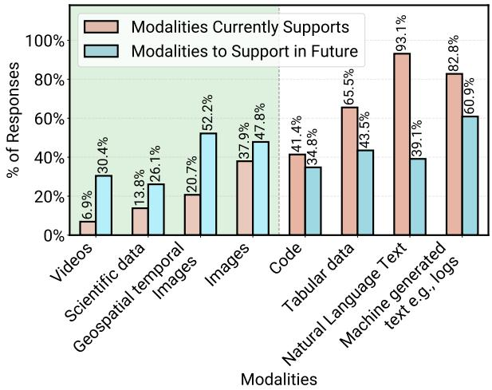  
Figure 13. Data modalities already supported (red) versus modalities planned for future support (blue) in production agent systems  $(N = 29)$ . Bars to the left of the dashed line indicate modalities with expected increases in future support, whereas modalities to the right are already widely supported with limited planned expansion. Interestingly, the modalities with the largest planned growth are all non-textual, pointing toward increasingly multimodal agent systems.

This data pattern demonstrates that practitioners enable substantial deployment by leveraging existing model capabilities within well-scoped applications rather than waiting for model improvements. We already see diverse implementations where agents support healthcare workflows, manage business operations, and accelerate scientific discovery in production (Table 1).

Figure 5a and our case interviews reveal that relatively little attention has been given to applying agents to software-facing rather than human-facing problems. Most production agents interface directly with users through chat, voice, or interactive workflows. We observe fewer deployments for direct software operation, maintenance, and optimization tasks. We believe opportunities to improve automation in these software-integrated systems remain under-explored, though realizing this potential requires addressing the reliability challenges discussed in Section 8.1.

# 8.3. Open Research Questions

Beyond the directions we highlight in prior sections, we identify additional research questions based on deployment patterns in RQ1-4.

We show that agents often operate without clean and fast correctness signals in the real-world (Section 7.1). We observe an analogy with silent failures, where catching errors during runtime is challenging and success signals arrive through real consequences like financial loss or customer dissatis-

faction. Engineers dedicate substantial effort ensuring agent quality through close human oversight, demonstrating effective practices that enable current deployments. However, the field has yet to reach consensus on effective ways to identify what and when errors or low-quality responses occur. We believe understanding agent failure modes [86], developing agent observability tools, and advancing runtime failure mitigation techniques represent important open research directions in addition to benchmarking and CI/CD integration (Section 7.1).

Significant evidence shows interest in post-training for agents [6, 87-93], yet Section 5.1 shows fine-tuning and reinforcement learning remain uncommon in deployment despite potential benefits. Our interviews reveal development effort currently prioritizes making agents work reliably over improving model capabilities for preference optimization, specialization, or cost trade-offs. We speculate this pattern emerges for two reasons: first, supervised fine-tuning and reinforcement learning impose barriers to entry, requiring large amounts of representative data or environments alongside with specialized ML expertise; second, model upgrades introduce complexity when fine-tuned models must adapt to new base versions. We believe the field needs more sample-efficient post-training approaches that remain robust to model upgrades and translate into repeatable engineering practices.

We find in Section 5.4 that  $30\%$  of deployed survey agents already adopt inference-time scaling techniques, with the use of multiple models being most popular. From detailed case studies, we find these are commonly simple methods, such as routing distinct subtasks to specialized models. We believe recent advances in generate-verify-search approaches [10, 94] have significant potential for non-science agent applications as well because they provide stronger reliability guarantees while maintaining controllability and explainability. However, realizing this potential may requires infrastructural support and redesign, such as building simulators and designing verifier. How to adapt agent runtime environments to support such inference-time search technique, and how to effectively utilize them in an online execution settings, are open research questions.

We show in Figure 13 that  $93\%$  of current production agents take text or speech in natural language as inputs. Both our survey trends and interviews show high interest in expanding agent modalities to include images, spatiotemporal sequences, video, and scientific data. Interview participants suggest that teams currently focus on applications that are easy to measure and validate. We believe that once these initial deployments work reliably, agent features and capabilities will expand to handle richer input modalities.

# 9. Conclusion

We present MAP, the first large-scale systematic study characterizing the engineering practices and technical methods behind AI agents actively deployed in production. We analyze data from agent practitioners across 26 domains to answer four research questions regarding the state of real-world agent development:

- RQ1: Why build agents? Productivity drives adoption. Organizations deploy agents primarily to automate routine tasks and reduce human task hours, prioritizing measurable efficiency gains over novel capabilities.  
- RQ2: How are agents built? Simplicity and controllability dominate. Production systems favor closed-source models utilizing manual prompting rather than weight tuning. Architecturally, these systems rely on structured workflows with bounded autonomy and typically execute limited steps before human intervention.  
- RQ3: How are agents evaluated? Human verification remains the primary method. Practitioners rely heavily on human-in-the-loop evaluation because clean baselines and ground truth datasets are scarce. Automated techniques like LLM-as-a-judge complement human review rather than replace it.  
- RQ4: What are the challenges? Reliability represents the central development focus. The difficulty of ensuring correctness and evaluating non-deterministic agent outputs drives this friction. Latency and security typically act as manageable constraints rather than hard blockers as engineering workarounds and restricted environments currently manage them.

As "agent engineering" emerges into a new discipline, MAP provides researchers with critical visibility into real-world constraints and opportunities while offering practitioners proven deployment patterns across industries.

# Acknowledgements

We thank our many anonymous participants without whom beginning this study would not be possible. This research was supported by gifts from Accenture, Amazon, AMD, Anyscale, Broadcom Inc., Google, IBM, Intel, Intesa Sanpaolo, Lambda, Mibura Inc, Samsung SDS, and SAP. We also thank Alex Dimakis, Drew Breunig, Tian Xia, and Shishir Patil for their valuable feedback and insightful discussions.

# References

[1] Lilian Weng. Lm powered autonomous agents. URL https://lilianweng.github.io/posts/2023-06-23-agent/.  
[2] OpenAI. Agents — openai api docs. URL https://platform.openai.com/docs/guides/agents.  
[3] Google Cloud. What are ai agents? definition, examples, and types. URL https://cloud.google.com/discover/what-are-ai-agents.  
[4] IBM. What are ai agents? URL https://www.ibm.com/think/topics/ai-agents.  
[5] Tanay Varshney. Introduction to llm agents. URL https://developer.nvidia.com/blog/introduction-to-llm-agents/.  
[6] Kexin Huang, Serena Zhang, Hanchen Wang, Yuanhao Qu, Yingzhou Lu, Yusuf Roohani, Ryan Li, Lin Qiu, Gavin Li, Junze Zhang, Di Yin, Shruti Marwaha, Jennefer N. Carter, Xin Zhou, Matthew Wheeler, Jonathan A. Bernstein, Mengdi Wang, Peng He, Jingtian Zhou, Michael Snyder, Le Cong, Aviv Regev, and Jure Leskovec. Biomni: A general-purpose biomedical ai agent. bioRxiv, 2025. doi: 10.1101/2025.05.30.656746. URL https://www.biorxiv.org/content/early/2025/06/02/2025.05.30.656746.  
[7] Kyle Swanson, Wesley Wu, Nash L. Bulaong, John E. Pak, and James Zou. The virtual lab of ai agents designs new sars-cov-2 nanobodies. Nature, 646:716-723, July 2025. doi: 10.1038/s41586-025-09442-9. URL https://www.nature.com/articles/s41586-025-09442-9.  
[8] Sizhe Liu, Yizhou Lu, Siyu Chen, Xiyang Hu, Jieyu Zhao, Yingzhou Lu, and Yue Zhao. Drugagent: Automating ai-aided drug discovery programming through llm multi-agent collaboration, 2025. URL https://arxiv.org/abs/2411.15692.  
[9] Alexander Novikov, Ngān Vū, Marvin Eisenberger, Emilien Dupont, Po-Sen Huang, Adam Zsolt Wagner, Sergey Shirobokov, Borislav Kozlovskii, Francisco J. R. Ruiz, Abbas Mehrabian, M. Pawan Kumar, Abigail See, Swarat Chaudhuri, George Holland, Alex Davies, Sebastian Nowozin, Pushmeet Kohli, and Matej Balog. Alphaevolve: A coding agent for scientific and algorithmic discovery, 2025. URL https://arxiv.org/abs/2506.13131.  
[10] Audrey Cheng, Shu Liu, Melissa Pan, Zhifei Li, Bowen Wang, Alex Krentsel, Tian Xia, Mert Cemri,

Jongseok Park, Shuo Yang, Jeff Chen, Lakshya Agrawal, Aditya Desai, Jiarong Xing, Koushik Sen, Matei Zaharia, and Ion Stoica. Barbarians at the gate: How ai is upending systems research, 2025. URL https://arxiv.org/abs/2510.06189.  
[11] Parshin Shojaee, Kazem Meidani, Shashank Gupta, Amir Barati Farimani, and Chandan K Reddy. Lmsr: Scientific equation discovery via programming with large language models, 2025. URL https://arxiv.org/abs/2404.18400.  
[12] Chris Lu, Cong Lu, Robert Tjarko Lange, Jakob Foerster, Jeff Clune, and David Ha. The ai scientist: Towards fully automated open-ended scientific discovery, 2024. URL https://arxiv.org/abs/2408.06292.  
[13] Juraj Gottweis, Wei-Hung Weng, Alexander Daryin, Tao Tu, Anil Palepu, Petar Sirkovic, Artiom Myaskovsky, Felix Weissenberger, Keran Rong, Ryutaro Tanno, Khaled Saab, Dan Popovici, Jacob Blum, Fan Zhang, Katherine Chou, Avinatan Hassidim, Burak Gokturk, Amin Vahdat, Pushmeet Kohli, Yossi Matias, Andrew Carroll, Kavita Kulkarni, Nenad Tomasev, Yuan Guan, Vikram Dhillon, Eeshit Dhaval Vaishnav, Byron Lee, Tiago R D Costa, Jose R Penades, Gary Peltz, Yunhan Xu, Annalisa Pawlosky, Alan Karthikesalingam, and Vivek Natarajan. Towards an ai co-scientist, 2025. URL https://arxiv.org/ abs/2502.18864.  
[14] Yutaro Yamada, Robert Tjarko Lange, Cong Lu, Shengran Hu, Chris Lu, Jakob Foerster, Jeff Clune, and David Ha. The ai scientist-v2: Workshop-level automated scientific discovery via agentic tree search, 2025. URL https://arxiv.org/abs/2504.08066.  
[15] Cursor Inc. Cursor: AI Coding Assistant. https://www.cursor.com/, 2024. Accessed: 2025-09-30.  
[16] Anthropic. Claude code: Agentic code assistant. https://www.anthropic.com/, 2025. Accessed: 2025-09-30.  
[17] OpenAI. Openai codex. https://openai.com/index/introducing-codex/, 2025. Accessed: 2025-09-30.  
[18] Windsurf. Windsurf. https://windsurf.com/, 2025. Accessed: 2025-09-30.  
[19] IACPM and McKinsey. Emerging generative ai use cases in credit: Research results, March 2025. URL https://iacpm.org/wp-content/uploads

ds/2025/03/IACPM-McKinsey-Gen-AI-W  
ebinar-2025.pdf. Deck dated March 2025;  
summarizes 2024 interviews and a December 2024  
flash survey of 44 unique institutions.  
[20] Alexander Verhagen, Angela Luget, Olivia Conjeaud, Vasiliki Stergiou, and Debanjan Banerjee. How agentic ai can change the way banks fight financial crime, August 2025. URL https://www.mckinsey.com/capabilities/risk-and-resilienc e/our-insights/how-agentic-ai-can-change-the-way-banks-fight-financial-crime. McKinsey & Company article.  
[21] Capgemini. Banks and insurers deploy ai agents to fight fraud and process applications, with plans for new roles to supervise the ai, November 2025. URL https://www.capgemini.com/us-en/news/press-releases/banks-and-insurers-deploy-ai-agents-to-fight-fraud-and-process-applications-with-plans-for-new-roles-to-supervise-the-ai/. Press release.  
[22] Prakul Sharma, Val Srinivas, and Abhinav Chauhan. How banks can supercharge intelligent automation with agentic ai. URL https://www.deloitte.com/us/en/insights/industry/financial-services/agentic-ai-banking.html. Deloitte Center for Financial Services; article, 15-min read.  
[23] Allianz SE. When the storm clears, so should the claim queue, November 2025. URL https://www.allianz.com/en/mediacenter/news/articles/251103-when-the-storm-clears-so-should-the-claim-queue.html. Allianz Media Center article.  
[24] Economist Impact. Underwriting the future: the role of artificial intelligence in insurance, 2025. URL https://assets.ctfassets.net/9crgcb5vlu43/2X4wMqL2pYjxzZaldIpwyj/ala54dab0e338b6d59953f0da377e1d2/underwriting_the_future_the-role_of_ARTificiaI_intellifence_ininsurance_roundtable_report_report.pdf. Roundtable summary report; sponsored by SAS.  
[25] KPMG. Intelligent insurance: A blueprint for creating value through ai-driven transformation, March 2025. URL https://kpmg.com/kpmg-us/content/dam/kpmg/pdf/2025/us-insurance-report-final.pdf. Landing page for the U.S. report; downloadable PDF dated March 2025.

[26] Everest Group. Agentic ai in insurance 2025, September 2025. URL https://www2.everestgrp.com/report/egr-2025-41-r-7520/. Includes a use-case prioritization matrix (impact vs. ease) and guidance on where to start and how to scale.  
[27] Emma Linsenmayer. Leveraging artificial intelligence to support students with special education needs. Technical Report 46, OECD, September 2025. URL https://www.oecd.org/content/dam/oecd/en/publications/reports/2025/09/leveraging-artificial-intelligence-to-support-students-with-special-education-needs_ebc80fc8/1e3dfffa9-en.pdf. Working paper.  
[28] Sandeep Kakar, Pratyusha Maiti, Karan Taneja, Alekhya Nandula, Gina Nguyen, Aiden Zhao, Vrinda Nandan, and Ashok Goel. Jill watson: Scaling and deploying an ai conversational agent in online classrooms. In Proceedings of the 20th International Conference on Intelligent Tutoring Systems (ITS 2024), 2024. URL https://dilab.gatech.edu/test/wp-content/uploads/2024/05/ITS2024_JillWatson_paper.pdf. To appear in ITS 2024 proceedings.  
[29] Michigan Ross School of Business. Google public sector helps enhance learning at the university of michigan with pioneering new agentic ai virtual teaching assistant, April 2025. URL https://michiganross.umich.edu/news/google-public-sector-helps-enhance-learning-university-michigan-pioneering-new-agentic-ai. School News / press release.  
[30] Lei Wang, Chen Ma, Xueyang Feng, Zeyu Zhang, Hao Yang, Jingsen Zhang, Zhiyuan Chen, Jiakai Tang, Xu Chen, Yankai Lin, Wayne Xin Zhao, Zhewei Wei, and Jirong Wen. A survey on large language model based autonomous agents. Frontiers of Computer Science, 18(6), March 2024. ISSN 2095-2236. doi: 10.1007/s11704-024-40231-1. URL http://dx.doi.org/10.1007/s11704-024-40231-1.  
[31] Nestor Masleh, Loredana Fattorini, Raymond Perrault, Yolanda Gil, Vanessa Parli, Njenga Kariuki, Emily Capstick, Anka Reuel, Erik Brynjolfsson, John Etchemendy, Katrina Ligett, Terah Lyons, James Manyika, Juan Carlos Niebles, Yoav Shoham, Russell Wald, Tobi Walsh, Armin Hamrah, Lapo Santarlasci, Julia Betts Lotufo, Alexandra Rome, Andrew Shi, and Sukrut Oak. Artificial intelligence index report 2025. Technical report, AI Index Steering Committee, Stanford Institute for Human-Centered Artificial Intelligence (HAI), Stanford University, April 2025. URL

https://hai.stanford.edu/assets/files/hai.ai_index_report_2025.pdf.AI Index Report.  
[32] Capgemini Research Institute. Rise of agentic ai: How trust is the key to human-ai collaboration, 2025. URL https://www.capgemini.com/gb-en/in sights/research-library/ai-agents/. Capgemini Research Library landing page for the re- port.  
[33] PwC. Pwc's ai agent survey. Tech Effect: AI & Analytics, PwC US, May 2025. URL https://www.pwc.com/us/en/tech-effect/ai-analytics/ai-agent-survey.html. Survey of 308 US executives conducted Apr 22-28, 2025.  
[34] Tianci Xue, Weijian Qi, Tianneng Shi, Chan Hee Song, Boyu Gou, Dawn Song, Huan Sun, and Yu Su. An illusion of progress? assessing the current state of web agents, 2025. URL https://arxiv.org/abs/2504.01382.  
[35] Reuters Staff. Over  $40\%$  of agentic ai projects will be scrapped by 2027, gartner says, June 2025. URL https://www.reuters.com/business/over-40-agentic-ai-projects-will-be-scrapped-by-2027-gartner-says-2025-06-25/. Reuters, citing Gartner forecast.  
[36] Pradyumna Shome, Sashreek Krishnan, and Sauvik Das. Why johnny can't use agents: Industry aspirations vs. user realities with ai agent software, 2025. URL https://arxiv.org/abs/2509.14528.  
[37] MIT Media Lab and NANDA Initiative. Nanda: The internet of ai agents. URL https://nanda.media.mit.edu/. Project site describing a decentralized "agentic web," with links to papers and events.  
[38] Aditya Challapally, Chris Pease, Ramesh Raskar, and Pradyumna Chari. The genai divide: State of ai in business 2025. Technical report, MLQ.ai and Project NANDA, July 2025. URL https://mlq.ai/media/quarterly_decks/v0.1_State_of_AI_in_Business_2025_Report.pdf. Preliminary findings from AI implementation research.  
[39] Capgemini Research Institute. Rise of agentic ai, July 2025. URL https://www.capgemini.com/wp-content/uploads/2025/07/Final-Web-Version-Report-AI-Agents.pdf. Global executive survey on AI agents; key findings summarized on the report landing page.

[40] PagerDuty. Agentic ai survey 2025. PagerDuty Report, March 2025. URL https://www.pagerduty.com/ assets / Agentic-AI-Survey-Report_FINAL.pdf. Survey by Wakefield Research of 1,000 IT and business executives (U.S., U.K., Australia, Japan) conducted Feb 27-Mar 6, 2025.  
[41] Alexander Sukharevsky, Dave Kerr, Klemens Hjartar, Lari Hamalainen, Stéphane Bout, and Vito Di Leo. Seizing the agentic ai advantage, June 2025. URL https://www.mckinsey.com/capabilities/quantumblack/our-insights/seizing-the-agentic-ai-advantage. 28-page report. With contributions from Guillaume Dagorret.  
[42] 2025: The year the frontier firm is born, April 2025. URL https://assets-c4akfrf5b4d3f4b7.z01.azurefd.net/assets/2025/04/WTI-2025-04-The-Year-the-Frontier-v13_68535917c7c2a.pdf. Global study combining surveys of 31,000 workers in 31 countries, LinkedIn labor-market trends, and Microsoft 365 productivity signals.  
[43] LangChain. State of ai agents, 2024. URL https://www.langchain.com/stateofaiagents. Survey of 1,300+ professionals on agent adoption, use cases, controls, and challenges.  
[44] Naveen Krishnan. Ai agents: Evolution, architecture, and real-world applications, 2025. URL https:// arxiv.org/abs/2503.12687.  
[45] Bang Liu, Xinfeng Li, Jiayi Zhang, Jinlin Wang, Tanjin He, Sirui Hong, Hongzhang Liu, Shaokun Zhang, Kaitao Song, Kunlun Zhu, Yuheng Cheng, Suyuchen Wang, Xiaogiang Wang, Yuyu Luo, Haibo Jin, Peiyan Zhang, Ollie Liu, Jiaqi Chen, Huan Zhang, Zhaoyang Yu, Haochen Shi, Boyan Li, Dekun Wu, Fengwei Teng, Xiaojun Jia, Jiawei Xu, Jinyu Xiang, Yizhang Lin, Tianming Liu, Tongliang Liu, Yu Su, Huan Sun, Glen Berseth, Jianyun Nie, Ian Foster, Logan Ward, Qingyun Wu, Yu Gu, Mingchen Zhuge, Xiangru Tang, Haohan Wang, Jiaxuan You, Chi Wang, Jian Pei, Qiang Yang, Xiaoliang Qi, and Chenglin Wu. Advances and challenges in foundation agents: From brain-inspired intelligence to evolutionary, collaborative, and safe systems, 2025. URL https://arxiv.org/abs/2504.01990.  
[46] Lei Wang, Chen Ma, Xueyang Feng, Zeyu Zhang, Hao Yang, Jingsen Zhang, Zhiyuan Chen, Jiakai Tang, Xu Chen, Yankai Lin, et al. A survey on large language model based autonomous agents. Frontiers of Computer Science, 18(6):186345, 2024.

[47] Junyu Luo, Weizhi Zhang, Ye Yuan, Yusheng Zhao, Junwei Yang, Yiyang Gu, Bohan Wu, Binqi Chen, Ziyue Qiao, Qingqing Long, Rongcheng Tu, Xiao Luo, Wei Ju, Zhiping Xiao, Yifan Wang, Meng Xiao, Chenwu Liu, Jingyang Yuan, Shichang Zhang, Yiqiao Jin, Fan Zhang, Xian Wu, Hanqing Zhao, Dacheng Tao, Philip S. Yu, and Ming Zhang. Large language model agent: A survey on methodology, applications and challenges, 2025. URL https://arxiv.org/abs/2503.21460.  
[48] Francesco Picciali, Diletta Chiaro, Sundas Sarwar, Donato Cerciello, Pian Qi, and Valeria Mele. Agentai: A comprehensive survey on autonomous agents in distributed ai for industry 4.0. Expert Systems with Applications, 291:128404, 2025. ISSN 0957-4174. doi: https://doi.org/10.1016/j.eswa.2025.128404. URL https://www.sciencedirect.com/science/article/pii/S0957417425020238.  
[49] Aske Plaat, Max van Duijn, Niki van Stein, Mike Preuss, Peter van der Putten, and Kees Joost Batenburg. Agentic large language models, a survey, 2025. URL https://arxiv.org/abs/2503.23037.  
[50] Asaf Yehudai, Lilach Eden, Alan Li, Guy Uziel, Yilun Zhao, Roy Bar-Haim, Arman Cohen, and Michal Shmueli-Scheuer. Survey on evaluation of llm-based agents, 2025. URL https://arxiv.org/abs/2503.16416.  
[51] Mahmoud Mohammadi, Yipeng Li, Jane Lo, and Wendy Yip. Evaluation and benchmarking of llm agents: A survey. In Proceedings of the 31st ACM SIGKDD Conference on Knowledge Discovery and Data Mining V.2, KDD '25, page 6129-6139. ACM, August 2025. doi: 10.1145/3711896.3736570. URL http://dx.doi.org/10.1145/3711896.3736570.  
[52] Feng He, Tianqing Zhu, Dayong Ye, Bo Liu, Wanlei Zhou, and Philip Yu. The emerged security and privacy of llm agent: A survey with case studies. ACM Comput. Surv., October 2025. ISSN 0360-0300. doi: 10.114 5/3773080. URL https://doi.org/10.1145/ 3773080. Just Accepted.  
[53] Taicheng Guo, Xiuying Chen, Yaqi Wang, Ruidi Chang, Shichao Pei, Nitesh V. Chawla, Olaf Wiest, and Xiangliang Zhang. Large language model based multi-agents: A survey of progress and challenges, 2024. URL https://arxiv.org/abs/2402.01680.  
[54] Juraj Gottweis, Wei-Hung Weng, Alexander Daryin, Tao Tu, Anil Palepu, Petar Sirkovic, Artiom

Myaskovsky, Felix Weissenberger, Keran Rong, Ryutaro Tanno, Khaled Saab, Dan Popovici, Jacob Blum, Fan Zhang, Katherine Chou, Avinatan Hassidim, Burak Gokturk, Amin Vahdat, Pushmeet Kohli, Yossi Matias, Andrew Carroll, Kavita Kulkarni, Nenad Tomasev, Vikram Dhillon, Eeshit Dhaval Vaishnav, Byron Lee, Tiago R D Costa, Jose R Penades, Gary Peltz, Yunhan Xu, Annalisa Pawlosky, Alan Karthikesalingam, and Vivek Natarajan. Towards an ai coscientist. https://storage.googleapis.com/coscientist_paper/ai_coscientist.pdf, Feb 2025.  
[55] Yongliang Shen, Kaitao Song, Xu Tan, Dongsheng Li, Weiming Lu, and Yueting Zhuang. Huggingppt: Solving ai tasks with chatgpt and its friends in hugging face, 2023. URL https://arxiv.org/abs/23.03.17580.  
[56] Sahana Chennabasappa, Cyrus Nikolaidis, Daniel Song, David Molnar, Stephanie Ding, Shengye Wan, Spencer Whitman, Lauren Deason, Nicholas Doucette, Abraham Montilla, Alekhya Gampa, Beto de Paola, Dominik Gabi, James Crnkovich, Jean-Christophe Testud, Kat He, Rashnil Chaturvedi, Wu Zhou, and Joshua Saxe. Llamafirewall: An open source guardrail system for building secure ai agents, 2025. URL https://arxiv.org/abs/2505.03574.  
[57] Akshara Prabhakar, Roshan Ram, Zixiang Chen, Silvio Savarese, Frank Wang, Caiming Xiong, Huan Wang, and Weiran Yao. Enterprise deep research: Steerable multi-agent deep research for enterprise analytics, 2025. URL https://arxiv.org/abs/2510.17797.  
[58] Saurabh Jha, Rohan Arora, Yuji Watanabe, Takumi Yanagawa, Yinfang Chen, Jackson Clark, Bhavya Bhavya, Mudit Verma, Harshit Kumar, Hirokuni Kitahara, Noah Zheutlin, Saki Takano, Divya Pathak, Felix George, Xinbo Wu, Bekir O. Turkkan, Gerard Vanloo, Michael Nidd, Ting Dai, Oishik Chatterjee, Pranjal Gupta, Suranjana Samanta, Pooja Aggarwal, Rong Lee, Pavankumar Murali, Jae wook Ahn, Debanjana Kar, Ameet Rahane, Carlos Fonseca, Amit Paradkar, Yu Deng, Pratibha Moogi, Prateeti Mohapatra, Naoki Abe, Chandrasekhar Narayanaswami, Tianyin Xu, Lav R. Varshney, Ruchi Mahindru, Anca Sailer, Laura Shwartz, Daby Sow, Nicholas C. M. Fuller, and Ruchir Puri. Itbench: Evaluating ai agents across diverse real-world it automation tasks, 2025. URL https://arxiv.org/abs/2502.05352.  
[59] Anthropic. Developing a computer use model. Anthropic News, October 2024. URL https://www.

anthropic.com/news/developing-computer-use.  
[60] Jacob Jackson, Phillip Kravtsov, and Shomil Jain. Improving cursor tab with online rl, September 2025. URL https://cursor.com/blog/tab-rl. Cursor Blog, Research.  
[61] Jacob Teo, Nikhil Jha, Connor Fogarty, Gary Chang, Theodor Marcu, Edison Zhang, Albert Tam, Sean Sullivan, Swyx, and Silas Alberti. Introducing swe1.5: Our fast agent model, October 2025. URL https://cognition.ai/blog/swe-1-5. Cognition AI Blog.  
[62] Anthropic Engineering Team. How we built our multi-agent research system, June 2025. URL https://www.anthropic.com/engineering/multi-agent-research-system. Anthropic Engineering Blog.  
[63] Block, Inc. goose: an open source ai agent built for developers, 2025. URL https://block.github.io/goose/. Project homepage.  
[64] OpenAI. Codex, 2025. URL https://openai.com/codex/. Product page.  
[65] Gemini CLI Maintainers. Welcome to gemini cli documentation, 2025. URL https://geminicli.com/docs/. Project documentation.  
[66] Cline Bot Inc. Cline: The open coding agent, 2025. URL https://cline.Bot/. Project homepage.  
[67] OpenHands. Openhands: The open platform for cloud coding agents, 2025. URL https://openhands.dev/. Project homepage.  
[68] UC Berkeley RDI. Agentic AI Summit 2025. Event page, August 2025. URL https://rdi.berkeley.edu/events/agentic-ai-summit. Event date Aug 2, 2025; UC Berkeley; livestream available.  
[69] The AI Alliance. AI Agent SF Meetup #5 - Agents in Production. Event page, August 2025. URL https://luma.com/x16vikh7. Event date Aug 5, 2025; Hosted by Bay Area AI; livestream available.  
[70] UC Berkeley Sky Computing Lab. Category: Retreats and camps, 2025. URL https://sky.cs.berkeley.edu/category/retreats-and-camps. News and event listings for UC Berkeley Sky Computing Lab retreats and camps.  
[71] Liana Patel, Siddharth Jha, Melissa Pan, Harshit Gupta, Parth Asawa, Carlos Guestrin, and Matei Zaharia. Semantic operators and their optimization:

Enabling llm-based data processing with accuracy guarantees in lotus. Proc. VLDB Endow., 18(11): 4171-4184, September 2025. ISSN 2150-8097. doi: 10.14778/3749646.3749685. URL https://doi.org/10.14778/3749646.3749685.  
[72] Llama Team, AI @ Meta. The llama 3 herd of models, 2024. URL https://arxiv.org/abs/2407.21783.  
[73] Qwen Team. Qwen3 technical report, 2025. URL https://arxiv.org/abs/2505.09388.  
[74] OpenAI. gpt-oss-120b & gpt-oss-20b model card, 2025. URL https://arxiv.org/abs/2508.10925.  
[75] Anthropic. Claude: AI Assistant for Next-Generation Tasks. www.anthropic.com, 2025.  
[76] OpenAI. OpenAI Platform Models. https://pl atform.openuai.com/docs/models, 2025. Accessed: December 5, 2025.  
[77] Omar Khattab, Keshav Santhanam, Tarun Reuel, Sara Saad-Falak, Jack Hall, Matei Zaharia, and Christopher Potts. Dspy: Compiling declarative language model pipelines into self-improving systems. In NeurIPS, 2024.  
[78] Qizheng Zhang, Changran Hu, Shubhangi Upasani, Boyuan Ma, Fenglu Hong, Vamsidhar Kamanuru, Jay Rainton, Chen Wu, Mengmeng Ji, Hanchen Li, Ur-mish Thakker, James Zou, and Kunle Olukotun. Agentic context engineering: Evolving contexts for self-improving language models, 2025. URL https://arxiv.org/abs/2510.04618.  
[79] Lakshya A Agrawal, Shangyin Tan, Dilara Soylu, Noah Ziems, Rishi Khare, Krista Opsahl-Ong, Arnav Singhvi, Herumb Shandilya, Michael J Ryan, Meng Jiang, Christopher Potts, Koushik Sen, Alexandros G. Dimakis, Ion Stoica, Dan Klein, Matei Zaharia, and Omar Khattab. Gepa: Reflective prompt evolution can outperform reinforcement learning, 2025. URL https://arxiv.org/abs/2507.19457.  
[80] Langchain. https://www.langchain.com/. Accessed: 26 November 2025.  
[81] LangChain Inc. Langgraph, 2025. URL https://www.langchain.com/langgraph. Product page for the LangGraph agentic framework.  
[82] crewAI. crewai: The leading multi-agent platform, 2025. URL https://www.crewai.com/. Product homepage.

[83] LlamaIndex. Llamaindex: Reddefine document workflows with ai agents, 2025. URL https://www.lla maaindex.ai/. Product homepage.  
[84] OpenAI. Swarm: Lightweight multi-agent orchestration, 2025. URL https://github.com/openai/swarm.GitHub repository.  
[85] Cursor Team. Cursor ide: Ai-powered development with rule-based control. https://cursor.com/docs, 2025. Last Accessed October 4, 2025.  
[86] Mert Cemri, Melissa Z. Pan, Shuyi Yang, Lakshya A. Agrawal, Bhavya Chopra, Rishabh Tiwari, Kurt Keutzer, Aditya Parameswaran, Dan Klein, Kannan Ramchandran, Matei Zaharia, Joseph E. Gonzalez, and Ion Stoica. Why do multi-agent llm systems fail?, 2025. URL https://arxiv.org/abs/2503.13657.  
[87] Cursor Team.Composer:Building a fast frontier model with rl,October 2025. URL https://currsor.com/blog/composer.Cursor Blog, Research.  
[88] Yuxiao Qu, Tianjun Zhang, Naman Garg, and Aviral Kumar. Recursive introspection: Teaching language model agents how to self-improve, 2024. URL https://arxiv.org/abs/2407.18219.  
[89] Shiyi Cao, Dacheng Li, Fangzhou Zhao, Shuo Yuan, Sumanth R. Hegde, Connor Chen, Charlie Ruan, Tyler Griggs, Shu Liu, Eric Tang, Richard Liaw, Philipp Moritz, Matei Zaharia, Joseph E. Gonzalez, and Ion Stoica. Skyrl-agent: Efficient rl training for multi-turn llm agent, 2025. URL https://arxiv.org/abs/2511.16108.  
[90] Siyu Yuan, Zehui Chen, Zhiheng Xi, Junjie Ye, Zhengyin Du, and Jiecao Chen. Agent-r: Training language model agents to reflect via iterative self-training, 2025. URL https://arxiv.org/abs/2501.11425.  
[91] Yifan Song, Weimin Xiong, Xiutian Zhao, Dawei Zhu, Wenhao Wu, Ke Wang, Cheng Li, Wei Peng, and Sujian Li. Agentbank: Towards generalized llm agents via fine-tuning on 50000+ interaction trajectories, 2024. URL https://arxiv.org/abs/24.10.07706.  
[92] Chanwoo Park, Seungju Han, Xingzhi Guo, Asuman Ozdaglar, Kaiqing Zhang, and Joo-Kyung Kim. Maporl: Multi-agent post-co-training for collaborative large language models with reinforcement learning, 2025. URL https://arxiv.org/abs/2502.18439.

[93] Hao Ma, Tianyi Hu, Zhiqiang Pu, Boyin Liu, Xiaolin Ai, Yanyan Liang, and Min Chen. Coevolving with the other you: Fine-tuning llm with sequential cooperative multi-agent reinforcement learning, 2025. URL https://arxiv.org/abs/2410.06101.  
[94] Alexander Novikov, Ngān Vū, Marvin Eisenberger, Emilien Dupont, Po-Sen Huang, Adam Zsolt Wagner, Sergey Shirobokov, Borislav Kozlovskii, Francisco J. R. Ruiz, Abbas Mehrabian, M. Pawan Kumar, Abigail See, Swarat Chaudhuri, George Holland, Alex Davies, Sebastian Nowozin, Pushmeet Kohli, and Matej Balog. AlphaEvolve: A coding agent for scientific and algorithmic discovery. arXiv preprint arXiv:2506.13131, 2025.

# Organization of Appendix

The appendix is organized as follows: in Appendix A we release the results on full survey dataset and report all statistics on the complete set of agent systems (not only the deployed subset used in the main paper), including comparisons between results on all agents and on deployed agents only; in Appendix B we provide additional analyses, such as our topic-normalization procedure for agent domains, the outlier domains where agents operate, and more detailed breakdowns of the challenges practitioners face when building agents. In Appendix C we unify our terminology for agents by defining what we mean by tasks, subtasks, and steps, and we provide an overview of the agent workflow schema used throughout the paper. In Appendix D we describe our interview protocol and present extended details of our case studies, including interview outlines and anonymized interviewee demographics. Finally, in Appendix E we provide the full survey questionnaire, including question wording and the branching logic that determines the survey flow.

# A. Results on All Survey Data

In the main body of the paper, we focused on results filtered exclusively to deployed agents in production or pilot phases, to highlight successful real-world practices under realistic operational constraints. In this appendix, we present the corresponding results computed over [All Data]: all 306 valid survey responses, regardless of deployment stage. This expanded view includes prototype, research, and legacy systems (sunset and retired), providing a broader perspective across the full agent development lifecycle.

For ease of comparison, each [All Data] figure mirrors a figure in the main text and uses the same layout and question wording. In the discussion below, we briefly summarize the key patterns in the full dataset and highlight how they compare to the deployed-only subset.

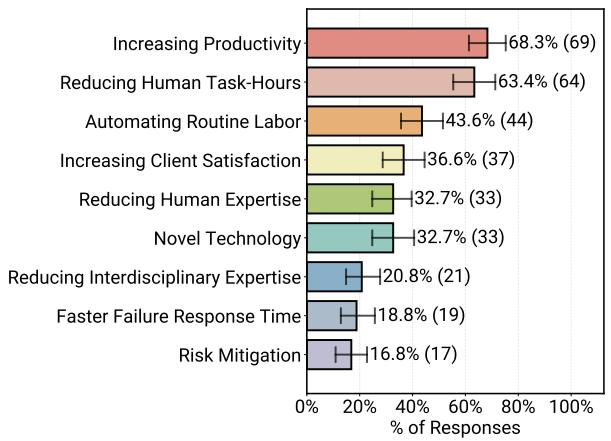  
(a) Reasons Practitioners Build AI Agents

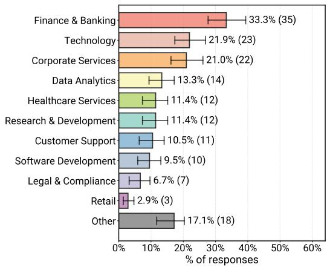  
(b) Application Domains  
Figure 14. [All Data] Overview of Agentic AI system motivations and domains across all development stages (Production, Pilot, Prototype, and Research). These figures correspond to Figure 1 (a) and Figure 2 (b) in the main text but include all survey data. (a) Reasons practitioners build AI agents ( $N = 101$ ). Increasing productivity remains the most selected benefit across the full dataset. (b) Application domains where practitioners build agents ( $N = 105$ ). Note that this is a multi-class classification question where each system may be assigned to multiple domain categories, and thus the proportions do not sum to 1.

# A.1. Applications, Users, and Requirements

Motivations and application domains. Figure 14a reproduces our analysis of motivations for using agents over non-agentic alternatives using all survey responses. We observe that the overall ranking of benefits is highly stable compared to deployed only agents as shown in Figure 1: increasing productivity and efficiency remains the most frequently selected reason for adopting agents, followed by reducing human task-hours and automating routine labor.

For application domains of agents, (Figure 14b) become even more diverse in the full dataset compared to deployed only agents (Figure 2). The same high-level industries i.e., finance and banking, technology, and corporate services remain prominent. However, the long tail of "other" domains grows, reflecting additional experimental and research systems in

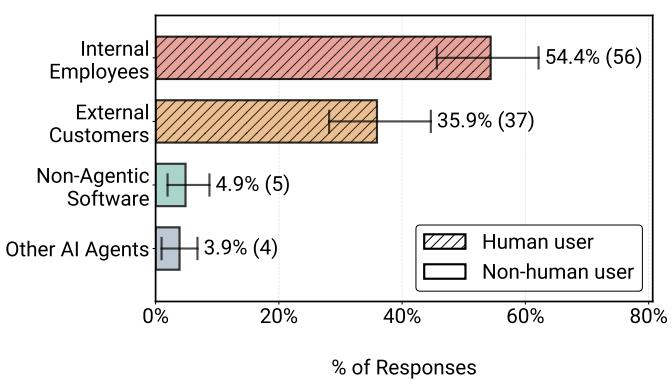  
(a)

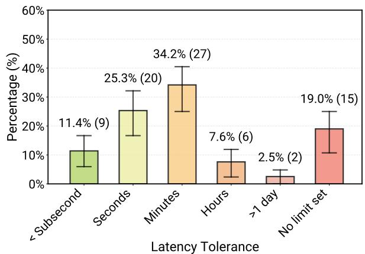  
Figure 15. [All Data] Overview of Agentic AI system characteristics across all development stages in terms of primary end users and latency requirements. This figure corresponds to Figure 5b in the main text but includes all survey data. (a) Distribution of primary end users  $(N = 103)$ , where hatched bars  $(//)$  denote human end-users; and (b) Reported tolerable end-to-end response latency for all systems  $(N = 84)$ . The high percentage of human end-users and tolerance for minute-level latency are consistent across the full dataset.

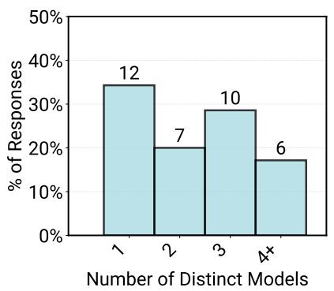  
(a)

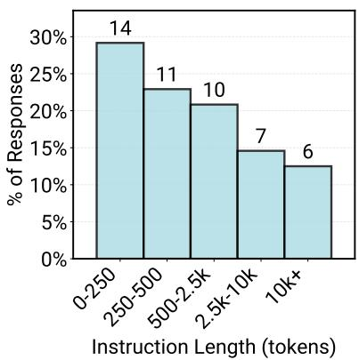  
(b)

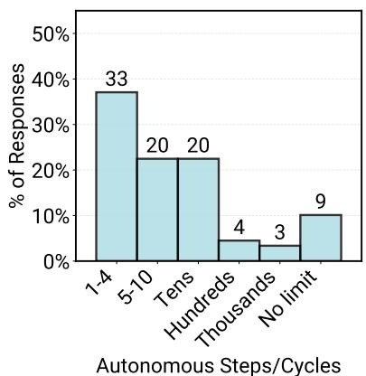  
(c)  
Figure 16. [All Data] Overview of core components configurations and architectures across all agents. This figure corresponds to Figure 8 in the main text but includes all survey data. (a) Number of distinct models combined to solve a single logical task ( $N = 35$ ). Deployed agents (Figure 8a) tend to use fewer models compared to all data, as the full dataset includes more experimental systems that utilize a higher number of distinct models; (b) Distribution of prompt lengths in terms of tokens ( $N = 48$ ). Prompt length remains pretty similar in both the deployed-only (Figure 8b) and all-data subsets; and (c) Number of autonomous execution steps before user intervention ( $N = 89$ ). Results on all survey data allows for a greater number of steps before human interference compared to deployed agents only (Figure 8c), reflecting the stricter need for control and monitoring in production environments.

areas such as education, creative tools, and scientific workflows that have not yet reached deployment.

End users and latency requirements. Consistent with the deployed-only subset, the vast majority of systems in the full dataset still target human users as shown in Figure 15a, with internal employees and external customers together comprising most end-user bases. The relative proportions shift only slightly when we include prototypes, suggesting that human-centric interaction remains the default even in early experimentation.

Latency requirements also similarly remain relaxed in the full dataset (Figure 15b compared to Figure 5b). Most teams still report tolerating response times on the order of minutes, with a non-trivial fraction indicating that no explicit latency limit has been set. Compared to deployed agents only, the fraction of agents with undefined latency budgets is slightly higher in [All Data], which is consistent with prototypes and research artifacts that have not yet been hardened with production SLOs. Overall, these figures confirm that the preference for latency-relaxed, quality-focused applications is not an artifact of our deployment filter.

# A.2. Models, Architectures, and Prompting

Core components and autonomy. Figure 16 summarizes core component configurations and agent architectures over the full dataset and corresponds to Figure 8 in the main text. Compared to deployed agents (Figure 8a), distribution of number of distinct models used exhibits a heavier tail: non-deployed and research systems are more likely to combine many distinct models, leading to a higher incidence of configurations with four or more models. This pattern aligns with our qualitative observation that teams explore richer multi-model setups during early experimentation, then consolidate to a smaller, more manageable set of models as they move toward deployment.

Prompt lengths remain broadly similar between the deployed-only (Figure 8b) and full datasets ((Figure 16b).

Comparison between Figure 8c and Figure 16c reveals a clearer separation in autonomy. When we include all agents, systems allow a greater number of autonomous steps or cycles before human intervention compared to deployed agents only. Experimental and research systems are more likely to sit in the "tens of steps" and "no explicit limit" regimes, whereas production deployments concentrate in the low-step regime to control cost, latency, and failure amplification. Taken together, these results reinforce our interpretation that bounded autonomy is a deliberate design choice for production reliability, while higher autonomy is more common in exploratory settings.

Prompt construction strategies and frameworks. Figure 17a reproduces our analysis of prompt construction and framework usage using all survey responses. The results show that human-crafted prompts remain central across the full dataset: fully manual and manual+LLM strategies are still the dominant modes. However, when we include non-deployed agents, we see a modest shift toward more automated prompting: fully manual prompting is slightly more common among deployed agents (Figure 7), while the [All Data] distribution shows somewhat higher use of "fully autonomous" prompting and prompt optimizers. This suggests that automated prompt construction is currently used more as an experimental technique and is less frequently adopted in production systems where controllability is critical.

Figure 17b compares framework usage across all agents and corresponds to Figure 17b in the main text. The overall split between using any framework vs. no framework remains nearly identical between the full dataset and deployed-only subset, indicating that teams decide early whether to invest in a framework-based stack or implement their own orchestration. Within the "framework" group, the Other category expands slightly in [All Data], reflecting experimentation with a broader variety of less common or homegrown frameworks during research and prototyping stages, beyond the dominant framework families.

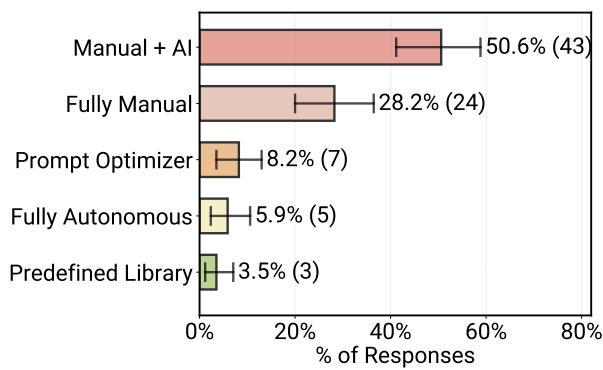  
(a)

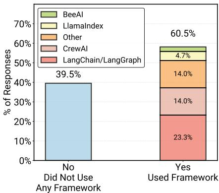  
(b)  
Figure 17. [All Data] Overview of core technical implementations: Prompt Construction and Framework Usage. The left and right figures correspond to Figure 7 and Figure 9 in the main text respectively but they include all survey data. (a) Distribution of prompt construction strategies across all agents  $(N = 85)$ . Human input remains central to prompt crafting, however, fully manual is slightly more common in deployed agents (Figure 7) compared to all data in the left plot. Similarly 'fully autonomous' prompting is more common in the All Data, suggesting that manual prompting is more favored for production systems. (b) Frameworks reported to support critical functionality  $(N = 43)$ . The percentage of practitioners using a framework versus not using one remains almost exactly the same between the full dataset (right plot) and the deployed-agents-only (Figure 9). The "other frameworks" category increases slightly in the full dataset compared to deployed agents only, likely reflecting more diverse experimentation in non-production systems.

# A.3. Evaluation Practices for All Agents

Figure 18 presents evaluation practices across all agents and mirrors Figure 10 in the main text. Figure 18a shows distribution of comparison against non-agentic baselines. When we include prototypes and research systems, the fraction of teams that explicitly compare their agents to alternative solutions is slightly lower than in the deployed-only subset (34% in all data vs.  $38.7\%$  in deployed agents in Figure 10a). This suggests that some experimental agents are perhaps still in early stages where rigorous baseline comparison has not yet been prioritized, or where teams are primarily exploring feasibility rather than relative gains.

Figure 18b reports the distribution of different evaluation methods. The ordering of methods remains unchanged: human-in-the-loop (manual) evaluation is still the most common strategy, followed by model-based evaluation (LLM-as-a-judge). However, manual evaluation is somewhat more prevalent among deployed agents (Figure 10b), whereas the [All Data] distribution shows a relatively higher share of automated methods. This is consistent with the idea that experimental and research systems may rely more on automated or lightweight checks, while production systems invest more heavily in human verification before and during deployment.

Figure 18c visualizes co-occurrence patterns between evaluation strategies. Human-in-the-loop evaluation remains the central hub in the evaluation graph, with high overlap with all other methods in the full dataset. At the same time, its co-occurrence with other strategies is slightly lower in [All Data] than in the deployed-only subset (Figure 10c), reflecting that some experimental systems use model-based or rule-based checks without consistently pairing them with human review. In contrast, deployed agents are more likely to combine automated evaluation with human verification perobably for higher assurance.

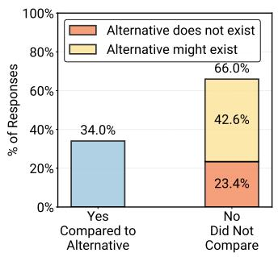  
(a)

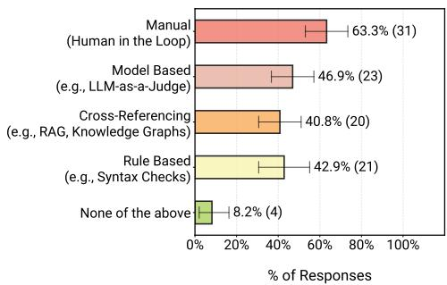  
(b)

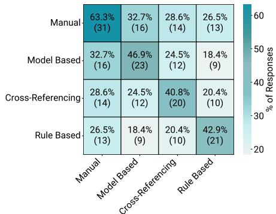  
(c)  
Figure 18. [All Data] Evaluation Practices in Agents. This figure corresponds to Figure 10 in the main text but includes all survey data  $(N = 47)$ . (a) Comparison to Alternatives: Shows whether participants explicitly compared their agent against a non-agentic baseline. Deployed agents (Figure 10a show a higher comparison rate (38.7% in deployed vs. 34% in all data) of comparison to alternative solutions, suggesting that experimental prototypes may not have invest as much on evaluation stages yet. (b) Evaluation Methods Distribution: Distribution of different evaluation strategies reported by survey participants. Manual evaluation (human-in-the-loop) is used more for deployed agents (Figure 10b) compared to the full dataset, which includes more experimental and research systems. Autonomous evaluation methods are relatively less common in deployed agents compared to the data for all agents in oru survey. (c) Evaluation Strategies Co-occurrence: Visualizes the pairwise overlap between evaluation strategies. Manual human-in-the-loop evaluation is still the central strategy, but its co-occurrence with other methods is slightly lower in the all-data subset compared to deployed agents (Figure 10c), indicating that autonomous evaluation methods have more complementary roles in deployed agents.

# A.4. Data Handling, Latency Challenges, and Modalities Across All Agents

Figure 19 corresponds to Figure 12 and Figure 11 in the main text but reports statistics across all survey responses.

Figure 19 shows distribution of data sources for agents which is remarkably stable when moving from deployed agents only (Figure 12) to [All Data] in Figure 19. This possibly indicates that the underlying data plumbing for agents is largely shared across lifecycle stages: teams tend to set up similar ingestion and handling pipelines during prototyping that then carry through to production with incremental hardening.

In addition, Figure 19b reports how often latency is described as a problem across all systems. The distribution changes only modestly when compared to the deployed-only subset (Figure 11), and we again see that latency is not the dominant blocker

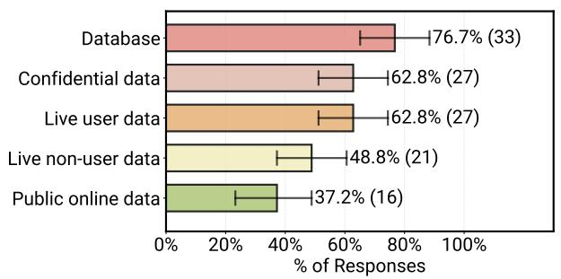  
(a)

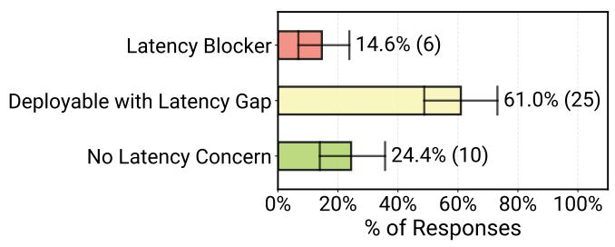  
(b)  
Figure 19. [All Data] The figures correspond to Figure 12 (a) and Figure 11 (b) in the main text but include all survey data. (a) Types and modes of data ingestion and handling in all agent  $N = 43$ . The distribution of data sources and handling methods did not change substantially when moving from deployed agents only to all survey data. (b) Degree to which latency causes problems for all agent systems  $N = 46$ . The distribution of problematic latency did not change substantially when moving from deployed agents only to all survey data, suggesting latency is not a primary deployment blocker across the development lifecycle.

for most agent deployments. This supports our broader conclusion that agents are currently concentrated in latency-relaxed settings where quality and correctness dominate over strict real-time responsiveness.

Finally, Figure 20 mirrors Figure 13 in the main text but includes all survey data. The overarching trend remains the same: growth is heavily concentrated in non-textual modalities, pointing towards increasingly multimodal agentic systems. Interestingly, the emphasis on future support for non-text modalities is even stronger than in the deployed-only subset, indicating that experimental and research agents are pushing more aggressively into multimodal directions (e.g., image, audio, and structured data) that may not yet have reached stable production deployment.

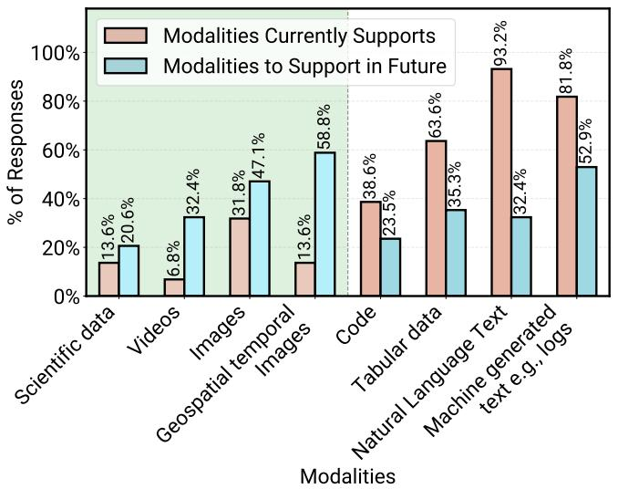  
Figure 20. [All Data] Data modalities already supported (red) versus modalities planned for future support (blue) across all agents. This figure corresponds to Figure 13 in the main text but includes all survey data. The trend of growth being heavily concentrated in non-textual modalities remains consistent, pointing toward increasingly multimodal agent systems. However, comparing this figure with the deployed-only subset shows that the full survey data in Figure 13 places an even stronger focus on non-textual modalities for future support.  $(N = 44)$

Table 2. Survey Responses Recorded as 'Other' For Domain Analysis and Topic Normalization.  

<table><tr><td>chemical supply chain travel entertainment &amp; gaming</td><td>proprietary-based networks food &amp; beverage industry Advertising film &amp; TV</td><td>Telco construction Beauty &amp; wellness social media</td><td>GTM Operations automotive Privacy Paint industry</td></tr></table>

# B. Analysis Details

# B.1. Topic Normalization for RQ1

We then normalized these responses using an LLM-based semantic aggregation to merge semantically similar responses and categorize the answers for conceptual consistency and to avoid repeated or redundant categories. The resulting categories were manually reviewed to confirm semantic alignment. We then perform an LLM-based semantic mapping over each survey response to assign one or more domain labels. For example, the Healthcare Services category includes answers such as health care, medical, medicine, biomedicine, patient monitoring, virtual nursing, and care navigation. We use LOTUS [71] to perform the semantic aggregation and semantic mapping and provide the relevant program snippets below. We use gpt-4o-2024-08-06 as the LLM for both.

# Domain Classification with LOTUS Semantic Map

```txt
df(sem_map( "Given the survey answer {N4 CQ}, and the provided classification labels, " + "answer with the list of labels that best categorize the survey answer.\n" + "You may ONLY choose labels from the list provided.\n" + "Provide your answer as a list of strings, e.g. ['label1', 'label2'].\n" + "Please respond with the answer only and include only valid labels from " + "the provided list.\n" "Only list 'Other' if no other label reasonably applies.\n" + f"Below are the classification labels: {categories_str}"
```

# Domain Normalization with LOTUS Semantic Aggregation

```txt
df(sem_agg( f"Given user answers to a survey question in {{N4 CQ}}), create a comprehensive bullet point list of answer categories. The survey question was: {header_map[" N4 CQ"]}.")
```

# B.2.Outlier Domains

Table 2 presents the domains that were mentioned only once across all reported Agentic AI use cases. These outlier domains highlight the long-tail diversity of applications where Agentic AI is being explored beyond the dominant sectors such as finance, technology, and enterprise.

# B.3. Challenge Details

We asked participants to rank the major categories of challenges they encounter during the development or operation of Agentic AI systems. Table 3 provides detailed descriptions of each challenge category identified in the survey, outlining the main technical and organizational issues practitioners reported when building Agentic AI systems. The five categories and their detailed definitions are provided in Table 3. Figure 21b illustrates how frequently each challenge category was assigned a given rank. For example, 'Core Technical Performance' was ranked as the most significant challenge (#1) by 16 respondents, by far more than any other category, indicating it remains the dominant source of difficulty in current Agentic AI system development. 'Core Technical Performance' encompasses a wide range of issues, including robustness, reliability,

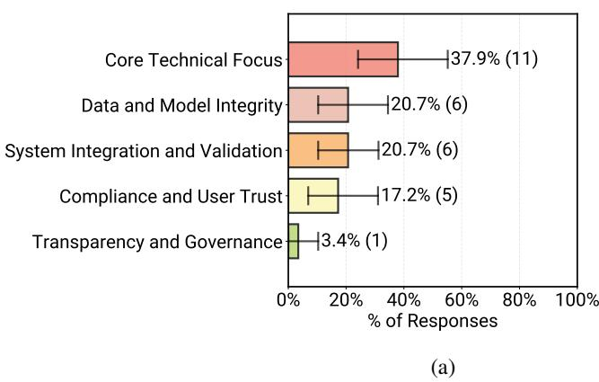  
Figure 21. Major challenge categories encountered across all Agentic AI systems ( $N = 29$ ). (a) Distribution of top-ranked (Rank 1) challenges for building agents in deployment. (b) Heatmap showing how frequently each category was assigned to different ranks of difficulty ( $1 =$  most challenging,  $5 =$  least challenging) across the deployed agents. Results show that Core Technical Performance remains the primary friction point.

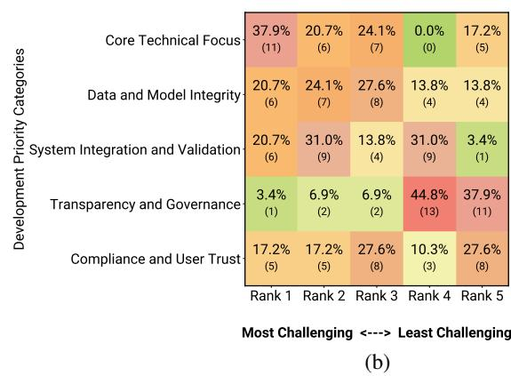

Table 3. Major categories of challenges reported by participants.  

<table><tr><td>Challenge Category</td><td>Representative Issues and Focus Areas</td></tr><tr><td>Core Technical Performance</td><td>Robustness and reliability—ensuring consistent, correct behavior in diverse and unpredictable environments; scalability—supporting growth in users, data, and tasks without performance degradation; real-time responsiveness—meeting latency and timing requirements; resource constraints—managing compute, memory, and energy efficiently.</td></tr><tr><td>Data and Model Integrity</td><td>Data quality and availability—access to clean, timely, and relevant data; model and concept drift—adapting to changes in data distributions and task definitions; versioning and reproducibility—tracking models, data, and configurations for auditability.</td></tr><tr><td>System Integration and Validation</td><td>Integration with legacy systems—connecting with existing infrastructure and APIs; testing and validation—simulating and verifying agent behavior before deployment; security and adversarial robustness—defending against manipulation and exploitation.</td></tr><tr><td>Transparency and Governance</td><td>Explainability and interpretability—making decisions understandable to humans; bias and fairness—preventing discriminatory or unjust outcomes; accountability and responsibility—clarifying who is liable for agentic decisions.</td></tr><tr><td>Compliance and User Trust</td><td>Privacy and data protection—ensuring adherence to data regulations (e.g., GDPR); user trust and adoption—building confidence through transparency and reliability; regulatory compliance—meeting legal standards for autonomy, safety, and transparency.</td></tr></table>

scalability, latency, and resource constraints. Its prevalence suggests that much of the community's current effort is devoted to ensuring that systems perform consistently and dependably under real-world conditions. Following closely were 'Data and Model Integrity' and 'System Integration and Validation', both of which were reported as persistent sources of friction when transitioning systems from research prototypes to production environments. In contrast, 'Transparency and Governance' and Compliance and User Trust were ranked as lower-priority concerns. As shown in Figure 21b, 'Transparency and Governance' was most frequently placed in the fifth position (14 occurrences), indicating that while practitioners recognize its long-term importance, it is not yet perceived as a primary bottleneck in current development cycles.

# C. Terminology

To ensure clarity and consistency, we established a hierarchical taxonomy for agent execution. Figure 22 provides a conceptual visualization of the key terminologies e.g., Task, Subtask, and Steps, as they are defined in our survey and applied throughout the paper. This mapping illustrates the relationship between high-level user goals and the granular autonomous actions taken by the agent.

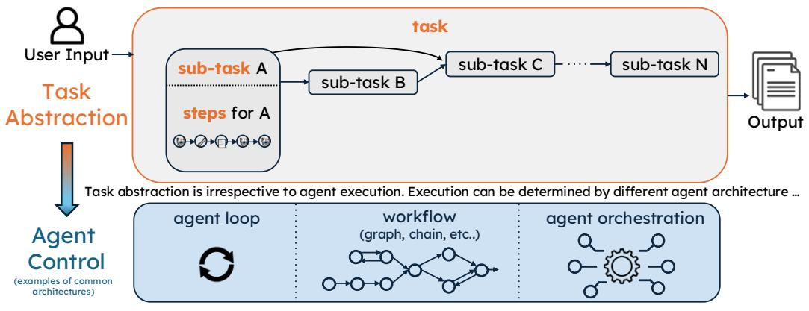  
Figure 22. Conceptual visualization of terminologies: "task", "subtask", "steps", used in Section 5 and how it maps to the survey definition.

# D. In-Depth Case Study Data

For building in-depth case studies, we arranged interviews with technical experts willing and able to supplement the published case study materials. Interviewers were selected to maintain organizational neutrality, assigned roles (lead, assistants, observers), and completed a series of pre-, post-, and in-interview procedures.

# D.1. Interview Outline

The structure of interviews was determined by a preset list of 11 topic groups (below), and the availability of respective answers from open sources that need only be verified via interview. In general, interviewers were advised to prioritize topics 1-5 first, then 6-8, and finally 9-11 as time allowed.

1. The root problem (benefit) the system is addressing (providing): What is the ultimate benefit? What is the system replacing and why?  
2. Key success metrics and evaluation mechanism: What tools, techniques, systems, etc. are used to ensure the system meets user and stakeholder objectives? Is data corresponding to the expected or past system behavior available for the evaluation?  
3. Key aspects of the system design and implementation: What programming framework was used? What is the general architecture? What are the steps, stages, and cycles? How are common components (e.g. routers, LLM-as-a-Judge, other verifiers, HIL) combined and why? What is the ratio of automation to human interaction and why—by design or limitation?  
4. The state of the system or its development: Is the system in production, or was it never meant for production (purely for AI research, learning, upskilling)? Was the system prototyped for production but abandoned—why, and what were the critical limitations? Were there surprises in the development or evaluation process? Did some things work better or worse than expected, and if so, what?  
5. Known constraints or requirements of end-users and stakeholders: What are the security, confidentiality, regulatory, latency, SLO/SLA, or other requirements?  
6. Advantage of an agentic AI system solution over alternative approaches: Do reasonable alternative solutions exist for this problem, or is this a novel solution made possible with Agentic AI? Against existing alternatives, has comparative analysis been conducted? What are the comparative benefits, costs, and return on investment (ROI)?  
7. System dependencies and complexity: what is the quantity, quality, and availability of tools and data for verification and generation?  
8. End-user quantity, expertise levels, and organizational domains. Is it a product for internal-use only or public external use? Does it support multiple institutions? Are there institution-specific or regulatory boundaries limiting the quantity of

users? Are target users domain experts or novices? How many of each user group are there and how many are targeted (order of magnitude)?...

9. Estimated cost versus value or benefit: What is the estimated cost (sunk and expected ongoing costs) of developing and operating the system versus the estimated value or benefit? Is the respondent aware? What is the value, how is ROI being calculated?  
10. System stakeholders: Who ultimately benefits from deployment? Who is impacted by safety, security, etc. failures and limitations? What is the expected impact on the company/institution (e.g. reduced hiring, retraining, broader user-base etc.)?  
11. Your role and activities: What is your role in the development of the agentic AI system(s) you are describing?

# D.2. Interviewees Demographics

To respect confidentiality agreements with case study sources, we present statistics on the sources in aggregate in Figure D.2.


  
Figure 23. Case study sources are present in one to hundreds of countries. This shows the distribution of cases by sources' country spread.  
Figure 24. Case study sources are present in 1 to 6 continents. This shows the distribution of cases by sources' continental spread.

# E. Survey Questionnaire Details

We crafted the questionnaire iteratively, refining it through early practitioner discussions. To facilitate broad participation, we limited the length, technical-depth, and disclosure-depth necessary to complete the questionnaire. All questions were optional and participation was entirely voluntary. Proceeding beyond certain questions required an answer or input however. For example, no participant could proceed without confirming they had read and understood Acknowledgement E.1-1. Figure 26 and Figure 27 shows the control-flows of the Core and Additional sections of the questionnaire respectively.

Further, all questions are intended for practitioners building AI Agents. Respondents who reported making technical contributions to more than 1 system (Table E.3 N1) were asked to focus all subsequent responses on 1 system of their choice (Acknowledgement E.1-2). Those who reported that they did not contribute to any systems they personally refer to as "AI agents" or "Agentic AI" systems were offered several options, such as commenting on terminology or their reason for starting the questionnaire, before being offered an early exit.

# E.1. Survey Acknowledgements

Acknowledgment 1 All participants were required to acknowledge the following statement.

You are invited to participate in a research study in which all data collected will be anonymized to protect your privacy. Your participation in this research is completely voluntary. The aim of the study is to understand key technical successes and challenges for deployment-track AI Agents and agentic systems, in order to steer further research and innovation in programming, runtime, and evaluation systems. We welcome as much or as little detail as you are willing to provide. Feedback on the survey/process itself is more than welcome. By proceeding with this survey, you acknowledge that you have read and understood the information provided above and consent to participate in this study. We sincerely appreciate your participation and value your contribution to this research. Thank you for your time and cooperation.

Acknowledgment 2 Further, all participants who stated they worked with more than 1 AI agent or agentic AI system were required to acknowledge the following statement before proceeding further.

To ensure consistency in your responses, please choose one agentic/assistant system to focus on throughout this survey. All your answers should relate to this same system. You may choose: * A system you are most familiar with, or * The system that is most developed among those you know — meaning closest to production with the most users. Please feel very, very welcome to submit additional survey responses for each system you are familiar with.

# E.2. Survey Questions

We designed the questions to avoid response priming and facilitate downstream quantitative analysis, resulting in the question-type distribution shown in Table 4.

# E.3. Participant Contribution Distribution

As shown in Figure 25, this plot presents the distribution of how many Agentic AI systems participants reported contributing to. Across the  $N = 306$  systems represented in the survey, most respondents contributed to only a single system, with fewer individuals reporting involvement in multiple systems. This distribution highlights the breadth of participation across distinct agent deployments rather than concentrated contributions from a small subset of practitioners.

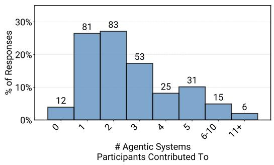  
Figure 25. Distribution of the number of Agentic AI systems that participants reported contributing to  $(N = 306)$ .

The exact survey questions and response choices are shown in the following sections.

<table><tr><td>Question Type</td><td>Frequency</td></tr><tr><td>MCSA</td><td>24</td></tr><tr><td>Free-Text</td><td>8</td></tr><tr><td>MCMA</td><td>7</td></tr><tr><td>Rank-order</td><td>5</td></tr><tr><td>Numerical Input</td><td>3</td></tr><tr><td>Total Questions</td><td>47</td></tr></table>

Table 4. Distribution of Question Types in Survey. Abbreviations: MCSA (Multiple-Choice Single-Answer), MCMA (Multiple-Choice Multiple-Answer).

Core Questions  

<table><tr><td>ID</td><td>Question</td><td>Response Choices</td></tr><tr><td>N1</td><td>How many systems do you contribute to that you would personally describe as &quot;AI agent(s)&quot;, &quot;agentic&quot;, or &quot;assistant(s)? Example Answer: 2. (Required)</td><td>Numerical Input —</td></tr><tr><td>N1.1</td><td>Do your colleagues or stakeholders call the systems you work on agentic, and if so, would you be willing to answer additional questions about the one with which you are most familiar? Only shown if answer for N1 is = 0</td><td>MCSA Yes and yes Yes and no, end questionnaire No and no, end questionnaire</td></tr><tr><td>N2</td><td>May we contact you or your colleagues to learn more about your agentic/assistant systems? If so, please provide contact information. It will not be shared beyond the collaborators of this study or used for any other purpose. The question can be postponed after N14.</td><td>Free-Text —</td></tr><tr><td>N3</td><td>With respect to the system you chose, are references available (code repositories, blogs, publications, training data, evaluation data, or benchmark links)? If so, please provide links.</td><td>Free-Text —</td></tr><tr><td>N4</td><td>List as many keywords as you can think of describing the domains in which the target problem (opportunity) arises.</td><td>Free-Text —</td></tr><tr><td>N5</td><td>Which of the following best describes the status of the agentic/assistant system on which you chose to focus your responses?</td><td>MCSA In active production – Fully deployed and used by target end-users in a live operational environment Pilot or limited deployment – Deployed to a controlled group of users or environments for evaluation, phased rollout, or safety/security Undergoing enterprise-grade development, not yet in pilot or production – Actively being built, tested, or integrated, but not yet piloted or deployed Prototype for potential development – A functional early version intended to (ideally) evolve into a production system Retired or sunset – Previously in use or prototyping but now decommissioned, cancelled, or replaced Research or education artifact – Experimental or demonstrative, never intended for production use Unknown – The status is unclear or the question is not understood</td></tr></table>

Continued on next page

<table><tr><td>ID</td><td>Question</td><td>Response Choices</td></tr><tr><td>N5.1</td><td>Approximately how many target end users are actively using this production agentic system daily on average? Only show if N5 answered.</td><td>MCSA0, 1-10, 10-49, 50-199, 200-499, 500-999, 1,000-9,999, 10,000-99,999, 100,000-999,999, 1,000,000 or more users, Not sure</td></tr><tr><td>N5.2</td><td>Approximately, how many tasks from target end-users is the system processing per day on average? Only show if N5 answered.</td><td>Free-Text—</td></tr><tr><td>N6</td><td>Which of the following best describes your primary role with respect to this agentic system?</td><td>MCSAOveright &amp; Strategy — Executive or Senior Leadership (e.g., CTO, VP, Director), Product or Program Manager, Project Manager or Scrum MasterIndustry Development, Engineering, Research — Basic or Advanced, Software Developer / Engineer, Machine Learning Engineer, Data Scientist or Analyst, Researcher or Scientist Academic Research &amp; Engineering — Scientists, Students, Life Long LearnersOperations &amp; Infrastructure — MLOps / DevOps / Platform Engineer, System Administrator or IT SupportQuality &amp; User Experience — Quality Assurance / Test Engineer, UX/UI Designer or Human Factors Specialist Communication &amp; Learning — Technical Writer or Documentation Specialist, Educator or Trainer, Student or Intern</td></tr><tr><td>N7</td><td>What are the ultimate target gains of enabling/deploying the system? Select the highest priority option(s). (Skip the question if you do not know.)</td><td>MCMAWorkforce adaptation: reducing human expertise-levels or training generally required for the tasksRemoving cross-domain, interdisciplinary knowledge requirements, skills or training requirementsIncreasing Productivity/Efficiency: increasing speed of task completion over the previous human/automated system Replacing time-consuming, low-skill, low-attention tasks with automationMitigating Risk: reducing otherwise high or highly variable risk or uncertaintyDecreasing human hours required regardless of skills, task complexity, workforce expectationsMitigating Failure/Loss: Decreasing time-to-intervention (security breach, system failure, customer loss)Increasing user engagement and/or increasing service quality Enabling completion of tasks not possible with the previous human/automated system</td></tr><tr><td>N7.1</td><td>Order the selected options according to their respective priority level. Only shown if N7 Answered.</td><td>Rank-orderAnswers from N7</td></tr></table>

Continued on next page

<table><tr><td>ID</td><td>Question</td><td>Response Choices</td></tr><tr><td>N8</td><td>Who (what) are the primary direct users or consumers of the agentic/assistant system? (Select one.)</td><td>MCSA
Other AI Agent(s)
Other NON-agentic software systems, tools, services
Humans operating INSIDE organizational boundaries (e.g. employees operating inside a company and not their external customers)
Human customers, general audience, operating OUTSIDE the org authoring the agentic AI / assistant system</td></tr><tr><td>N9</td><td>Referring to the previously selected description of direct users or consumers as &quot;user&quot; (human or non-human), what does the system require from users in terms of behavior(s), interaction(s), or role(s)? To the agent/assistant, the target end-user is an...</td><td>MCMA
Operator (user initiates tasks, provides guidance, and determines a task is finished)
Approver (without necessarily providing guidance to reach the solution, user approves a solutions generated by the agentic system)
Observer (user passively observes the agentic system is operating as expected)
Optimizer (user actively intervenes to provide correction or improve performance without necessarily being an Operator or Approver)</td></tr><tr><td>N9.1</td><td>Please sort the selected options with (1) as the primary intended role, (2) as a secondary role, and so on. Press and drag an option to sort. Only shown if N9 Answered.</td><td>Rank-order
—</td></tr><tr><td>N10</td><td>Using the previous definition of &quot;user&quot;, how many steps or cycles can execute autonomously until user input is required?</td><td>MCSA
Four or fewer; Ten or fewer; Tens; Hundreds; Thousands; Millions; More; There is no limit, potentially infinitely many steps could execute without user input or intervention</td></tr><tr><td>N11</td><td>What determines how many steps or cycles can execute before a user&#x27;s input is required?</td><td>MCSA
Problem complexity
Non-determinism in the agentic planning or decision-making
Preset limits e.g. in the configuration, parameters, or defaults I do not know, or I have not measured</td></tr><tr><td>N12</td><td>How are each agent&#x27;s system prompts (instructions) constructed?</td><td>MCSA
By hand, hard coded strings or templates e.g. LangChain templates Using semi-automatic prompt engineering or optimization e.g. DSPy Combination of manual and LLM or AI agents prompt creation and refinement
Fully autonomously by agents Using libraries or templates predefined by others e.g. open-source I don&#x27;t know</td></tr><tr><td>N13</td><td>What is the average (typical) estimated instruction length per agent in words or tokens? (Skip if you do not know.)</td><td>Numerical Input
—</td></tr></table>

Continued on next page

<table><tr><td>ID</td><td>Question</td><td>Response Choices</td></tr><tr><td>N14</td><td>What is the maximum allowable end-to-end result latency for the agentic/assistant system?</td><td>MCSA
I don’t know
No limit set yet, still in exploratory phase, not a latency-critical system
Microseconds
Subsecond
Seconds
Minutes
Hours
1–4 days
Weeks
Months
More</td></tr><tr><td>N2</td><td>May we contact you or your colleagues to learn more about your agentic/assistant systems? If so, please provide contact information. It will not be shared beyond the collaborators of this study or used for any other purpose. Only shown if question was postponed.</td><td>Free-Text
—</td></tr><tr><td>SEP</td><td>This is the end of the core questions. Would you like to answer further questions?</td><td>MCSA
Yes; No</td></tr><tr><td>EOS1</td><td>End of survey – any last comments or feedback can be shared here. Only shows if SEP is No.</td><td>Free-Text
—</td></tr></table>

Additional Questions  

<table><tr><td>ID</td><td>Question</td><td>Response Choices</td><td>Additional Context</td></tr><tr><td>O1</td><td>Select any/all of the following methods currently integrated into your system that give you confidence your agentic/assistant system is consistently producing high quality outputs, whatever &quot;high quality&quot; means in your context.</td><td>MCMA Manual (Human-in-the-loop): Expert Review Manual Citation Verification Crowdsourced Evaluation Red Teaming Automated Not-Model-Based Cross-Referencing: External Fact-Checking Knowledge Graph Validation Automated Citation Verification Automated Model- and Estimation-Based Methods: Self-Consistency Checks Internal Confidence Estimation Critique Models Red Teaming using models Cross-Model Validation LLM-as-a-Judge Automated Rule-Based Methods: Grammar and Syntax Checks Domain-Specific Rules Other: None of the above/below I am not confident the system consistently produces high quality output yet</td><td>Hover.click on the &quot;i&quot; for examples, definitions and descriptions. Definitions: Expert Review: Involve human specialists to validate content in high-stakes or sensitive domains Manual Citation Verification: User ensures cited sources are accurate and actually support the generated claims Crowdsourced Evaluation: Collect feedback from diverse human reviewers to assess quality and usefulness Red Teaming: Humans manually test robustness by probing with adversarial or misleading prompts or actions to expose weakness External Fact-Checking: Retrieve supporting evidence from trusted sources and validate claims e.g. using retrieval-augmented generation (RAG) Knowledge Graph Validation: Cross-check facts against structured data like Wikidata or domain-specific ontologies Automated Citation Verification: Ensure cited sources are accurate and actually support the generated claims Self-Consistency Checks: Generate multiple answers and compare for consistency, use majority voting to select the most common answer, and/or apply chain-of-thought reasoning to ensure logical consistency Internal Confidence Estimation: Score answers using log probabilities and/or estimate uncertainty with dropout or ensemble methods Critique Models: Use separate models to evaluate factuality, coherence, and overall quality of the output Red Teaming using models: Test robustness by probing with adversarial or misleading prompts to expose weakness Cross-Model Validation: Compare outputs from different AI models to identify consensus or discrepancies; Use Zero-Shot Critics, unrelated models to critique outputs without prior task-specific training Grammar and Syntax Checks: verify grammatical correctness and linguistic clarity with or without NLP models Domain-Specific Rules: Apply expert-defined rules for accuracy, tailored to specific fields like business, medicine, law or finance</td></tr></table>

Continued on next page

<table><tr><td>ID</td><td>Question</td><td>Response Choices</td><td>Additional Context</td></tr><tr><td>O2</td><td>Sort the following categories from most to least important for ongoing development and production deployment. Press and drag an option to sort.</td><td>Rank-orderData and Model Integrity:Data Quality and AvailabilityModel Drift and Concept DriftVersioning and ReproducibilityCore Technical Performance:Robustness and ReliabilityScalabilityReal-Time ResponsivenessResource ConstraintsSystem Integration and Validation:Integration with Legacy SystemsTesting and ValidationSecurity and Adversarial RobustnessTransparency and Governance:Explanability and InterpretabilityBias and fairnessAccountability and ResponsibilityCompliance and User Trust:Privacy and Data ProtectionUser Trust and AdoptionRegulatory Compliance</td><td>Hover/click on the &quot;i&quot; for examples and definitions.Definitions:Data Quality and Availability: Accessing clean, timely, and relevant data for decision-makingModel Drift and Concept Drift: Adapting to changes in data distributions and task definitionsVersioning and Reproducibility: Tracking models, data, and configurations for auditabilityRobustness and Reliability: Ensuring consistent, correct behavior in diverse and unpredictable environmentsScalability: Supporting growth in users, data, and tasks without performance degradationReal-Time Responsiveness: Meeting latency and timing requirements in dynamic contextsResource Constraints: Managing compute, memory, and energy efficientlyIntegration with Legacy Systems: Seamlessly connecting with existing infrastructure and APIsTesting and Validation: Simulating and verifying agent behavior before deploymentSecurity and Adversarial Robustness: Defending against manipulation and exploitationExplanability and Interpretability: Making decisions understandable to humansBias and fairness: Preventing discriminatory or unjust outcomesAccountability and Responsibility: Clarifying who is liable for agentic decisionsPrivacy and Data Protection: Ensuring compliance with data regulations (e.g. GDPR)User Trust and Adoption: Building confidence through transparency and reliabilityRegulatory Compliance: Meeting legal standards for autonomy, safety, and transparency</td></tr><tr><td>O3</td><td>Have you compared your agentic/assistant solution to a non-agentic solution, which of the following statements is most accurate?</td><td>MCSAYes; No, alternatives might exist but I have NOT formally compared them; No, alternates DO NOT exist, my system provides truly novel functionality</td><td>—</td></tr><tr><td>O3.1</td><td>If it were entirely up to you, would you choose the agentic solution over the alternatives? Only shown if answer for O3 is Yes</td><td>MCSAYesNo</td><td>—</td></tr></table>

Continued on next page

<table><tr><td>ID</td><td>Question</td><td>Response Choices</td><td>Additional Context</td></tr><tr><td rowspan="12">O3.1.1</td><td rowspan="12">You answered &quot;Yes&quot; to &quot;If it were entirely up to you, would you choose the agentic solution over the alternatives?&quot; Why, which of the following functional improvements does the new system offer compared to the previous solution? (Select all that apply.). Only shown if answer to O3.1 is Yes</td><td>MCMA</td><td>—</td></tr><tr><td>Increased automation or reduced manual effort</td><td></td></tr><tr><td>Enhanced user interface or usability</td><td></td></tr><tr><td>Scalability or support for more users</td><td></td></tr><tr><td>ONLY Ease of software design, maintenance, model use or integration</td><td></td></tr><tr><td>Improved performance or speed</td><td></td></tr><tr><td>For non-technical reasons ONLY, e.g. marketing/advertising, strategic planning, ...</td><td></td></tr><tr><td>Better integration with other systems</td><td></td></tr><tr><td>Improved data accuracy or consistency</td><td></td></tr><tr><td>Enhanced security or compliance</td><td></td></tr><tr><td>Expanded features or capabilities</td><td></td></tr><tr><td>None of the above</td><td></td></tr><tr><td rowspan="2">O3.1.1.1</td><td rowspan="2">Order all selected options according to their respective priority level. - Improved performance or speed (Options from O3.1.1). Only shown if answer to O3.1.1 has answers</td><td>Rank-order</td><td>—</td></tr><tr><td>Answers from O3.1.1</td><td></td></tr><tr><td rowspan="2">O4</td><td rowspan="2">Thinking about the state of the system you chose to focus on, in your personal opinion, would you call it an &quot;assistant&quot; but not an AI Agent or agentic?</td><td>MCSA</td><td>—</td></tr><tr><td>Either/Both; Assistant and NOT Agent or agentic</td><td></td></tr><tr><td rowspan="2">O4.1</td><td rowspan="2">Why do you refer to your system as AI agents or agentic? What makes it agentic in your opinion? Only shown if answer to O4 is Either/Both</td><td>Free-Text</td><td>—</td></tr><tr><td>—</td><td></td></tr></table>

Continued on next page

<table><tr><td>ID</td><td>Question</td><td>Response Choices</td><td>Additional Context</td></tr><tr><td>O4.2</td><td>Why do you refer to your systems or an &quot;assistant rather than an &quot;agent&quot; or &quot;agentic&quot;? What makes it an assistant rather than an agentic system in your opinion? You may go back and change your previous answer if you use any of these terms to describe your system. Only shown if answer to O4 is Assistant and NOT Agent or agentic</td><td>Free-Text</td><td>—</td></tr><tr><td rowspan="2">O5</td><td rowspan="2">What is the minimum level of expertise or training (knowledge and skills) expected from typical end-users? (Select the best option.)</td><td>MCSA</td><td>—</td></tr><tr><td>Highly skilled professionals — Advanced education and specialized knowledge (e.g., engineers, scientists, doctors); capable of complex tasks like coding, diagnostics, or system design Extensive domain experience — Deep practical knowledge from years of experience; having organizational or domain knowledge, skilled in nuanced tasks like troubleshooting or decision-making General education — High school level education with basic digital skills (e.g., using email, spreadsheets, or web apps) and standard subject matter knowledge Minimal expertise required — Little to no formal education; able to follow simple instructions or perform basic tasks (e.g., tapping buttons, entering data) Not sure</td><td></td></tr></table>

Continued on next page

<table><tr><td>ID</td><td>Question</td><td>Response Choices</td><td>Additional Context</td></tr><tr><td rowspan="6">O6</td><td rowspan="6">How would you rate the return on investment (ROI) of this agentic system relative to its total cost of development, operation, infrastructure and all other costs? (Please select the option that best reflects your assessment.) Only shown if answer to N5 is &quot;In active production - Fully deployed and used by target end-users in a live operational environment&quot;</td><td>MCSA</td><td rowspan="6">—</td></tr><tr><td>Exceptionally high ROI (ROI greater than 150%)</td></tr><tr><td>High ROI (ROI between 125%-150%)</td></tr><tr><td>Acceptable ROI (ROI between 90%-124%)</td></tr><tr><td>Low ROI (ROI between 60%-89%)</td></tr><tr><td>Poor ROI (ROI less than 60%)</td></tr><tr><td rowspan="6">O7</td><td rowspan="6">How much do each agent&#x27;s system prompt (instruction) lengths vary? (Skip if you do not know.)</td><td>MCSA</td><td rowspan="6">—</td></tr><tr><td>Tens of tokens</td></tr><tr><td>Hundreds of tokens</td></tr><tr><td>Thousands of tokens</td></tr><tr><td>Ten of Thousands of tokens</td></tr><tr><td>More</td></tr><tr><td rowspan="5">O8</td><td rowspan="5">Compared to the target latency for the system&#x27;s result turn-around, how problematic is the actual latency? (Select one.)</td><td>MCSA</td><td rowspan="5">—</td></tr><tr><td>I don&#x27;t know</td></tr><tr><td>I don&#x27;t understand the question Not problematic at all, the actual latency is better than expected and not a problem for deployment</td></tr><tr><td>Marginally problematic, but good enough for deployment</td></tr><tr><td>Very problematic, the system can&#x27;t be deployed without addressing the gap, or the highest priority post-deployment will be bringing down the latency</td></tr><tr><td rowspan="2">O9</td><td rowspan="2">What is the maximum target latency for determining a single action, step, or response? (Select one.)</td><td>MCSA</td><td rowspan="2">—</td></tr><tr><td>Microseconds; Subsecond; 1 to 10 seconds; 10 to 60 seconds; A few minutes; More; Less; I don&#x27;t know; I don&#x27;t understand the question</td></tr></table>

Continued on next page

<table><tr><td>ID</td><td>Question</td><td>Response Choices</td><td>Additional Context</td></tr><tr><td rowspan="2">O10</td><td rowspan="2">What is the maximum number of distinct models used together to solve a single logical task? Skip if you do not know; estimates are fine.</td><td>Numerical Input</td><td rowspan="2">—</td></tr><tr><td>—</td></tr><tr><td rowspan="2">O11</td><td rowspan="2">Are inference time scaling techniques used in your system?</td><td rowspan="2">MCSAYes; 0, No inference time scaling is used; I don&#x27;t know</td><td rowspan="2">Help: For the purposes of this question, “inference time scaling” a.k.a. “test time compute” refers to a family of techniques that call models multiple times or use a collection of models together, in place of a single model call and without modifying the weights or retraining any models, to answer a single question, choose a single next step, action, tool, etc...</td></tr><tr></tr><tr><td>O11.1</td><td>If inference time scaling techniques are used, approximately how many model calls are made per user query or task? Only shown if answer for O11 is Yes</td><td>MCSATensHundredsThousandsTens of thousandsHundreds of thousandsMillionsMore</td><td>—</td></tr><tr><td>O12</td><td>What data modalities does the system process now (today)?</td><td>MCMANatural Language TextTabular dataSoftware or machine generated text including system logs, events, etc.CodeImagesVideosImage sequences or batches with additional channels or metadata e.g.geospatial, NMR scansScientific data not listed above</td><td>—</td></tr><tr><td>O13</td><td>What data modalities will or should the system process in future (that it does NOT process now)?</td><td>MCMASame as O12</td><td>—</td></tr></table>

Continued on next page

<table><tr><td>ID</td><td>Question</td><td>Response Choices</td><td>Additional Context</td></tr><tr><td>O13.1</td><td>You have selected the following option(s) for the question &quot;What data modalities will or should the system process in future (that it does NOT process now)?&quot;: What are the barriers to processing them now? Sort the options from most to least important; press and drag an option to sort. Only shown if O13 is answered. If you don&#x27;t know, skip the question. - No barriers, just a matter of development time</td><td>Rank-order
Answers selected from O13</td><td>—</td></tr><tr><td>O14</td><td>Which describes the data handling functions the system(s) perform? Select all that apply and use the &quot;Other&quot; box to detail.</td><td>MCMA
Ingests direct user input in real-time
Ingests other real-time information as well as direct user input
Ingests information from other systems, e.g. databases, at most indirectly from end-users
Retrieves persistent data from public external sources (e.g. the web)
Retrieves non-public, confidential, or otherwise federated data
Other</td><td>—</td></tr><tr><td>O15</td><td>Are you using an openly (commercially or non-commercially) available agent-focused programming framework (e.g. LangChain, CrewAI, Autogen,...) to implement your system?</td><td>MCSA
Yes
No, only an in-house not openly available solution, or only standard programming languages and tools e.g. Python, Java (not-agent-focused)
I don&#x27;t know</td><td>—</td></tr></table>

Continued on next page

<table><tr><td>ID</td><td>Question</td><td>Response Choices</td><td>Additional Context</td></tr><tr><td rowspan="8">O16</td><td rowspan="8">From experimental observations, which of the following supports most of your assistant/agentie system functionality or design? Only shown if answer to O15 is Yes</td><td>MCSA</td><td>—</td></tr><tr><td>OpenAI Swarm</td><td></td></tr><tr><td>CrewAI</td><td></td></tr><tr><td>LangChain or LangGraph</td><td></td></tr><tr><td>BeeAI</td><td></td></tr><tr><td>Autogen or AG2</td><td></td></tr><tr><td>LlammaIndex</td><td></td></tr><tr><td>Other:</td><td></td></tr><tr><td rowspan="2">O17</td><td rowspan="2">How long has it been since active prototyping or initial development started on this agentie/assistant system?</td><td>MCSA</td><td>—</td></tr><tr><td>Less than 3 months; 3–6 months; 6–12 months; 1–2 years; 2–5 years; More than 5 years; I don’t know or prefer not to say</td><td></td></tr><tr><td rowspan="2">O18</td><td rowspan="2">How long have you been working on this agentie/assistant system?</td><td>MCSA</td><td>—</td></tr><tr><td>Same as O17</td><td></td></tr><tr><td rowspan="2">EOS2</td><td rowspan="2">Thank you, this completes our questionnaire. Go back to change any of your answers, or click END to finalize them and exit. Any last comments or feedback can be shared here.</td><td>Free-Text</td><td>—</td></tr><tr><td>—</td><td></td></tr></table>

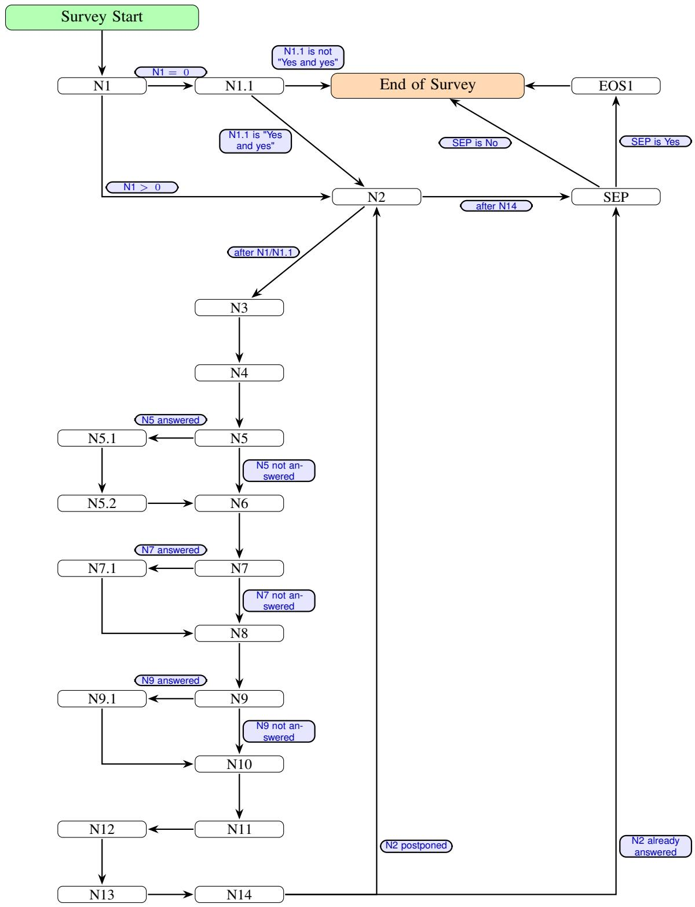  
Figure 26. Survey flow: core questions

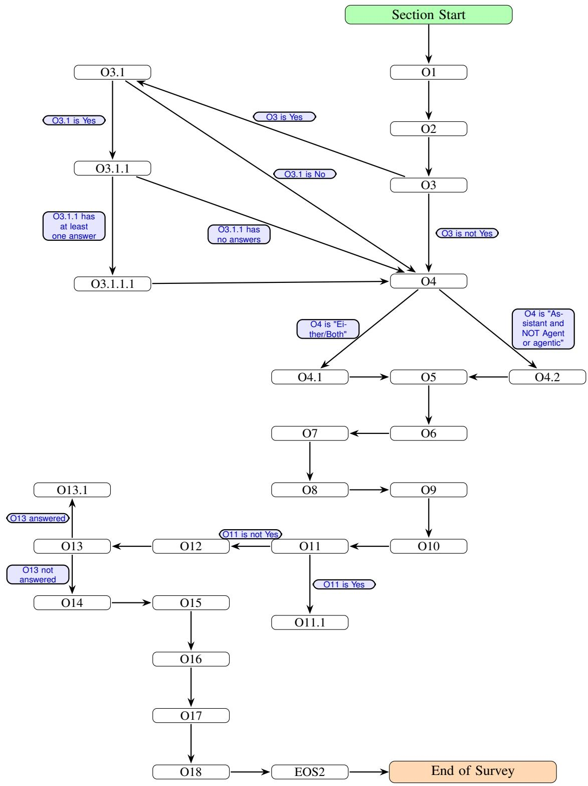  
Figure 27. Survey flow: additional questions