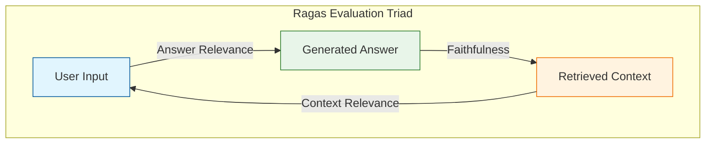
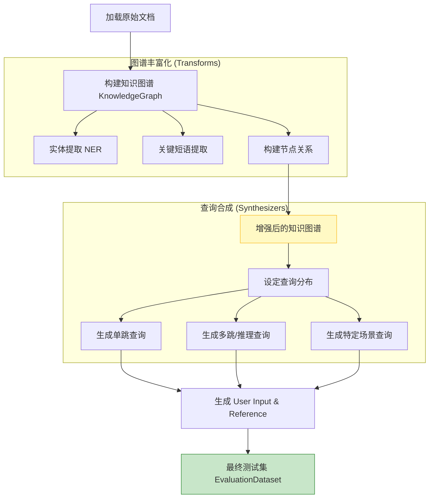
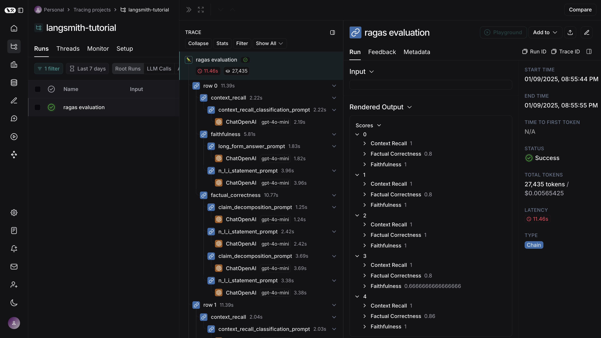
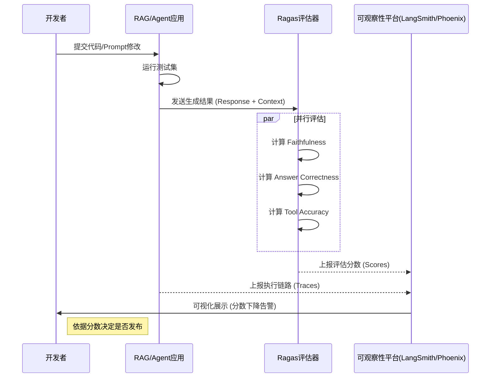

# Ragas 深度指南：从合成数据到 Agent 多轮对话评测的进阶之路

在大模型应用开发中，构建 RAG（检索增强生成）流水线往往只是第一步，真正的挑战在于**评估**。如何知道你的 RAG 系统是变好了还是变坏了？如何评估一个会调用工具的 Agent？

本文将基于 Ragas 最新版本（v0.3.9），结合业界的多轮对话评测理论，深入探讨如何构建一个可量化、可复现的评估体系。

---

## 一、核心理念：实验优先 (Experiments-first)

在 Ragas v0.3.9 的更新中，官方明确提出了 **"Experiments-first"** 的范式。评估不应该是一次性的脚本运行，而是一个持续迭代的过程：**修改 -> 运行评估 -> 观测结果 -> 提出假设 -> 再次修改**。


*(图1：Ragas 的核心评估三角：Faithfulness, Context Relevance, Answer Relevance)*

## 二、打破数据荒：基于知识图谱的合成数据生成

在实际业务中，我们往往只有文档，没有“问题-答案”对（Ground Truth）。Ragas 的 `TestsetGenerator` 是解决这一痛点的杀手锏。

与简单的 LLM 生成不同，Ragas 引入了 **知识图谱 (Knowledge Graph)** 技术。它不仅提取文档片段，还通过 NER（命名实体识别）和关键短语提取，建立跨文档的实体关系，从而生成包含**多跳推理 (Multi-hop reasoning)** 的复杂测试题。

### 2.1 测试数据生成流水线

以下是 Ragas 生成高质量测试数据的内部流转机制：



### 2.2 核心代码实现

生成一个包含 50 条测试数据的集合，且包含多跳推理题：

```python
from ragas.testset import TestsetGenerator
from ragas.testset.synthesizers import default_query_distribution
from langchain_community.document_loaders import DirectoryLoader

# 1. 加载文档
loader = DirectoryLoader("./docs", glob="**/*.md")
docs = loader.load()

# 2. 初始化生成器 (自动构建 KG)
generator = TestsetGenerator(llm=generator_llm, embedding_model=generator_embeddings)

# 3. 生成测试集
# query_distribution 默认包含单跳、多跳抽象、多跳具体等多种类型
dataset = generator.generate_with_langchain_docs(
    docs, 
    testset_size=50
)

# 4. 导出为 Pandas 或 HuggingFace Dataset
test_df = dataset.to_pandas()
```

---

## 三、从 RAG 到 Agent：多轮对话评测

随着 Agent 的兴起，单轮问答评测已无法满足需求。参考[多轮对话评测理论](https://zhuanlan.zhihu.com/p/24142922311)，我们需要关注 **上下文理解**、**连贯性**、**任务完成度** 等维度。

Ragas v0.3.7+ 引入了 `MultiTurnSample` 和一系列 Agent 专属指标，涵盖了上述大部分需求。

### 3.1 核心指标映射

| 评估维度 | 理论定义 (知乎) | Ragas 对应指标 (v0.3.9) | 适用场景 |
| :--- | :--- | :--- | :--- |
| **上下文理解** | 准确跟踪对话历史，正确引用上下文 | `ContextRecall`, `ContextPrecision` | RAG 检索质量评估 |
| **任务完成度** | 针对任务型对话，评估目标达成情况 | **`AgentGoalAccuracy`** | 订票、API 操作等 Agent |
| **工具调用** | (特有维度) API 调用参数准确性 | **`ToolCallAccuracy`**, `ToolCallF1` | Function Calling 评估 |
| **话题控制** | 连贯性/一致性 | **`TopicAdherenceScore`** | 客服机器人、角色扮演 |
| **文本质量** | 语义相似度、自然度 | `SemanticSimilarity`, `BLEU`, `ROUGE` | 基础文本生成质量 |

### 3.2 评测工具调用 (Tool Call) 的代码示例

评估一个 Agent 是否正确调用了天气查询工具：

```python
from ragas.dataset_schema import MultiTurnSample
from ragas.metrics import ToolCallAccuracy
import ragas.messages as r

# 构建多轮对话样本
sample = MultiTurnSample(
    user_input=[
        r.HumanMessage(content="帮我查下北京的天气"),
        r.AIMessage(
            content="",
            # 模型的实际调用
            tool_calls=[r.ToolCall(name="get_weather", args={"city": "Beijing"})]
        )
    ],
    # 预期的正确调用 (Ground Truth)
    reference_tool_calls=[
        r.ToolCall(name="get_weather", args={"city": "Beijing"})
    ]
)

# 计算准确率
scorer = ToolCallAccuracy(llm=evaluator_llm)
score = await scorer.multi_turn_ascore(sample)
print(f"Tool Call Accuracy: {score}") 
# 输出 1.0 表示参数和函数名完全匹配
```

---

## 四、可观察性与持续集成

评估不应是黑盒。在生产环境中，我们需要将 Ragas 的评估结果与 Tracing（链路追踪）工具结合，实现全链路的可观察性。

### 4.1 集成 LangSmith / Phoenix

Ragas 可以无缝集成到 LangSmith 或 Arize Phoenix 中。通过 OpenTelemetry 或 LangChain 的回调机制，每一条评估分数都会被标记在对应的 Trace 上。


*(图2：LangSmith 控制台展示 Ragas 评估结果，每一行 Trace 都附带了 Faithfulness 和 Correctness 分数)*

### 4.2 完整的评估流程序列图

一个典型的 "DevOps for LLM" 流程如下：



## 五、总结与展望

Ragas 正在从一个简单的 RAG 评分工具演变为**全栈的大模型评估框架**。

1.  **数据为王**：利用 `TestsetGenerator` 和知识图谱生成高难度的合成数据，解决冷启动问题。
2.  **场景细分**：针对 Agent 场景，使用 `ToolCallAccuracy` 和 `AgentGoalAccuracy` 替代单一的文本相似度指标。
3.  **闭环迭代**：配合 LangSmith/Phoenix，建立 "实验 -> 评估 -> 监控" 的完整闭环。

虽然在**对抗性测试**和**长程一致性**（如角色扮演中的长期记忆）方面，Ragas 目前的支持还比较基础，但通过自定义指标（如 `AspectCritic`）和 `MultiTurnSample` 的灵活性，我们完全可以构建出符合特定业务需求的评估体系。

---

*参考资料：*
*   *Ragas Documentation v0.3.9*
*   *Arize Phoenix & LangSmith Integration Guides*
*   *知乎：大模型评测系列2-多轮对话评测*

