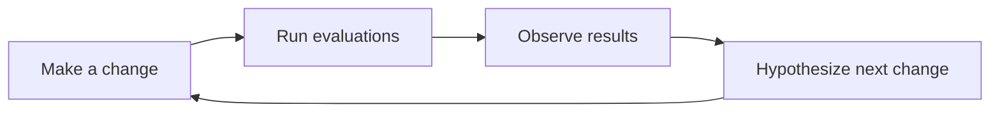

# 我问
下面内容、方法、流程，ragas都实现了吗？ # 大模型多轮对话评测核心内容简化总结 ## 一、核心评价维度（5个） 1. 上下文理解：能跟踪对话历史，正确关联过往信息（如用户问完巴黎所属国家后，再问地标能对应“巴黎”回答）。 2. 连贯性：对话逻辑自然，不随意跳题、不混淆人称/实体。 3. 任务完成度：任务型对话（订票、订餐等）中，关键信息提取准、流程步骤完整。 4. 长期一致性：长对话中，事实、角色设定不矛盾（如设定“是猫”就不以人类身份回答）。 5. 错误恢复能力：用户输入模糊/错误时，能主动澄清而非强行回答。 ## 二、3类评价方法 1. **自动评估（定量）**：用数据和模型算指标，含代码实现 - 关键指标：上下文匹配度（测回答与历史对话相关性）、重复率（避免内容反复）、BERTScore（比回答与参考文本的语义相似度）、困惑度（测回答自然度，越低越好）。 - 可整合为统一评估工具，一键输出多指标结果。 2. **人工评估（定性）**：人按1-5分制打分 - 评分维度：相关性、信息准确性、逻辑连贯性、用户友好性、主动性。 - 流程：设计多场景（闲聊、任务等）、招募标注员、多人交叉验证确保一致。 3. **对抗性测试（压力测试）**：模拟极端情况 - 测试方式：突然换话题、插入矛盾信息（如“喜欢苹果却讨厌水果”）、多轮后追问早期细节。 ## 三、评估流程（3步） 1. 数据准备：建测试集（真实对话日志+人工造边缘案例）、明确指标权重。 2. 执行测试：用工具（如DialoFlow）模拟多轮对话，随机加干扰轮次。 3. 结果迭代：分类错误案例（指代错、事实错等）、针对性优化模型、A/B测试对比新旧版本。

# deepwiki答
根据您提供的多轮对话评测需求,我来分析Ragas是否实现了这些功能。<cite />

## 实现情况总结

Ragas **部分实现**了您提到的多轮对话评测能力,但并非完全覆盖所有维度和方法。<cite />

## 一、核心评价维度实现情况

### 已实现的维度

**1. 上下文理解 & 任务完成度** [1](#0-0) 
- Ragas提供了`TopicAdherenceScore`来评估AI是否遵循预定义主题 [2](#0-1) 
- `AgentGoalAccuracy`用于评估代理是否达成用户目标 [3](#0-2) 
- `ToolCallAccuracy`评估工具调用的准确性 [4](#0-3) 

**2. 连贯性(部分)**<cite />
- Ragas支持`MultiTurnSample`数据结构来处理多轮对话 [5](#0-4) 
- 可以通过`convert_to_ragas_messages`转换对话历史进行评估 [6](#0-5) 

### 未明确实现的维度

**3. 长期一致性**<cite />
- 代码中没有发现专门针对长对话中事实/角色一致性的指标

**4. 错误恢复能力**<cite />
- 没有发现专门评估澄清能力或错误处理的指标

## 二、评价方法实现情况

### 1. 自动评估(定量) - ✅ 已实现

Ragas提供了丰富的自动评估指标: [7](#0-6) 

**已实现的指标类型:**
- **语义相似度**: `SemanticSimilarity` [8](#0-7) 
- **传统NLP指标**: `BLEUScore`, `ROUGEScore` [9](#0-8) 
- **上下文相关性**: `ContextPrecision`, `ContextRecall` [10](#0-9) 
- **忠实度**: `Faithfulness` [11](#0-10) 

**但缺少:**
- 重复率指标(没有发现专门的重复检测指标)
- 困惑度指标(没有发现perplexity相关实现)

### 2. 人工评估(定性) - ⚠️ 部分支持

Ragas支持自定义评分标准:<cite />
- `RubricsScore`允许定义1-5分的评分规则 [12](#0-11) 
- `AspectCritic`可以定义自定义评估维度 [13](#0-12) 

**但不包括:**
- 多人标注员管理
- 交叉验证流程
- 一致性检查工具

### 3. 对抗性测试 - ❌ 未实现

代码中没有发现专门的对抗性测试或压力测试功能。<cite />

## 三、评估流程实现情况

### 已实现的流程

**1. 数据准备** - ✅ [14](#0-13) 
- 支持`SingleTurnSample`和`MultiTurnSample`数据结构 [15](#0-14) 
- 支持`EvaluationDataset`管理测试集 [16](#0-15) 

**2. 执行测试** - ✅<cite />
- 提供`evaluate()`函数批量评估 [17](#0-16) 
- 支持异步评估`ascore()` [18](#0-17) 

**3. 结果分析** - ⚠️ 基础支持<cite />
- 可以导出CSV结果 [19](#0-18) 
- 但没有发现自动错误分类或A/B测试对比工具

## Notes

Ragas主要聚焦于RAG系统和Agent评估,对多轮对话的支持通过`MultiTurnSample`实现,但不是专门为对话系统设计的完整评测框架。<cite /> 它缺少您提到的DialoFlow这类专门的对话模拟工具,也没有内置的对抗性测试和人工标注管理功能。<cite /> 如果需要完整的多轮对话评测,可能需要结合Ragas的指标系统与其他专门的对话测试工具。<cite />

Wiki pages you might want to explore:
- [Installation & Quick Start (explodinggradients/ragas)](/wiki/explodinggradients/ragas#1.1)

### Citations

**File:** docs/concepts/metrics/available_metrics/agents.md (L1-3)
```markdown
# Agentic or Tool use

Agentic or tool use workflows can be evaluated in multiple dimensions. Here are some of the metrics that can be used to evaluate the performance of agents or tools in a given task.
```

**File:** docs/concepts/metrics/available_metrics/agents.md (L6-10)
```markdown
## Topic Adherence

AI systems deployed in real-world applications are expected to adhere to domains of interest while interacting with users but LLMs sometimes may answer general queries by ignoring this limitation. The topic adherence metric evaluates the ability of the AI to stay on predefined domains during the interactions. This metric is particularly important in conversational AI systems, where the AI is expected to only provide assistance to queries related to predefined domains.

`TopicAdherenceScore` requires a predefined set of topics that the AI system is expected to adhere to which is provided using `reference_topics` along with `user_input`. The metric can compute precision, recall, and F1 score for topic adherence, defined as
```

**File:** docs/howtos/integrations/_langgraph_agent_evaluation.md (L278-278)
```markdown
To convert a list of LangChain messages into a format suitable for Ragas evaluation, Ragas provides the function [convert_to_ragas_messages][ragas.integrations.langgraph.convert_to_ragas_messages], which can be used to transform LangChain messages into the format expected by Ragas.
```

**File:** docs/howtos/integrations/_langgraph_agent_evaluation.md (L309-309)
```markdown
- [Tool call Accuracy](https://docs.ragas.io/en/stable/concepts/metrics/available_metrics/agents/#tool-call-accuracy):ToolCallAccuracy is a metric that can be used to evaluate the performance of the LLM in identifying and calling the required tools to complete a given task.
```

**File:** docs/howtos/integrations/_langgraph_agent_evaluation.md (L311-311)
```markdown
- [Agent Goal accuracy](https://docs.ragas.io/en/stable/concepts/metrics/available_metrics/agents/#agent-goal-accuracy): Agent goal accuracy is a metric that can be used to evaluate the performance of the LLM in identifying and achieving the goals of the user. This is a binary metric, with 1 indicating that the AI has achieved the goal and 0 indicating that the AI has not achieved the goal.
```

**File:** docs/howtos/integrations/amazon_bedrock.md (L659-660)
```markdown
# Initialize MultiTurnSample objects.
# MultiTurnSample is a data type defined in Ragas that encapsulates conversation
```

**File:** docs/howtos/integrations/amazon_bedrock.md (L789-792)
```markdown
result = evaluate(
    dataset=EvaluationDataset(samples=[sample_3, sample_4, sample_5]),
    metrics=[recommendations],
)
```

**File:** docs/concepts/metrics/available_metrics/index.md (L1-5)
```markdown
# List of available metrics

Ragas provides a set of evaluation metrics that can be used to measure the performance of your LLM application. These metrics are designed to help you objectively measure the performance of your application. Metrics are available for different applications and tasks, such as RAG and Agentic workflows. 

Each metric are essentially paradigms that are designed to evaluate a particular aspect of the application. LLM Based metrics might use one or more LLM calls to arrive at the score or result. One can also modify or write your own metrics using ragas.
```

**File:** docs/concepts/metrics/available_metrics/index.md (L32-32)
```markdown
- [Semantic Similarity](semantic_similarity.md)
```

**File:** docs/concepts/metrics/available_metrics/index.md (L34-36)
```markdown
- [BLEU Score](traditional.md#bleu-score)
- [CHRF Score](traditional.md#chrf-score)
- [ROUGE Score](traditional.md#rouge-score)
```

**File:** mkdocs.yml (L31-32)
```yaml
                  - Context Precision: concepts/metrics/available_metrics/context_precision.md
                  - Context Recall: concepts/metrics/available_metrics/context_recall.md
```

**File:** mkdocs.yml (L36-36)
```yaml
                  - Faithfulness: concepts/metrics/available_metrics/faithfulness.md
```

**File:** docs/concepts/metrics/available_metrics/general_purpose.md (L64-64)
```markdown
# Setup
```

**File:** docs/concepts/metrics/available_metrics/general_purpose.md (L151-151)
```markdown
The Rubric-Based Criteria Scoring Metric is used to do evaluations based on user-defined rubrics. Each rubric defines a detailed score description, typically ranging from 1 to 5. The LLM assesses and scores responses according to these descriptions, ensuring a consistent and objective evaluation.
```

**File:** docs/getstarted/evals.md (L51-51)
```markdown
1. **Load Dataset** - Define your test cases with `SingleTurnSample`
```

**File:** docs/getstarted/quickstart.md (L160-160)
```markdown
from ragas.dataset_schema import SingleTurnSample
```

**File:** docs/getstarted/quickstart.md (L180-180)
```markdown
    dataset = EvaluationDataset(samples=data_samples)
```

**File:** docs/getstarted/quickstart.md (L191-191)
```markdown
- `save_results_to_csv()` - Export results to CSV
```

**File:** README.md (L123-126)
```markdown
score = await metric.ascore(
    user_input=test_data["user_input"],
    response=test_data["response"]
)
```

# 我问
给一个详细具体的例子，告诉我如何使用ragas，要求这个例子至少覆盖80%的核心模块、组件、功能的使用

# deepwiki答
我将为您提供一个全面的Ragas使用示例,覆盖其核心模块和功能。<cite/>

## 完整的Ragas评估示例

这个示例将演示如何评估一个RAG系统,涵盖数据准备、多种指标、多轮对话、自定义指标等核心功能。<cite/>

### 1. 环境设置与LLM配置

```python
from ragas.llms import llm_factory
from ragas.embeddings import embedding_factory

# 配置评估用的LLM和嵌入模型
evaluator_llm = llm_factory("gpt-4o-mini")
evaluator_embeddings = embedding_factory("text-embedding-3-small")
``` [1](#1-0) 

### 2. 单轮评估 - RAG系统评估

```python
from ragas.dataset_schema import SingleTurnSample, EvaluationDataset
from ragas.metrics import (
    Faithfulness,           # 忠实度
    ContextPrecision,       # 上下文精确度
    ContextRecall,          # 上下文召回率
    ResponseRelevancy,      # 响应相关性
    SemanticSimilarity,     # 语义相似度
)
from ragas import evaluate

# 创建单轮样本
single_turn_samples = [
    SingleTurnSample(
        user_input="What is the capital of Germany?",
        retrieved_contexts=[
            "Berlin is the capital and largest city of Germany.",
            "Germany is a country in Central Europe."
        ],
        response="The capital of Germany is Berlin.",
        reference="Berlin"
    ),
    SingleTurnSample(
        user_input="Who wrote Pride and Prejudice?",
        retrieved_contexts=["Pride and Prejudice is a novel by Jane Austen."],
        response="Pride and Prejudice was written by Jane Austen.",
        reference="Jane Austen"
    ),
]

# 创建评估数据集
dataset = EvaluationDataset(samples=single_turn_samples)
``` [2](#1-1) 

```python
# 初始化指标
metrics = [
    Faithfulness(llm=evaluator_llm),
    ContextPrecision(llm=evaluator_llm),
    ContextRecall(llm=evaluator_llm),
    ResponseRelevancy(llm=evaluator_llm, embeddings=evaluator_embeddings),
    SemanticSimilarity(embeddings=evaluator_embeddings),
]

# 执行评估
result = evaluate(
    dataset=dataset,
    metrics=metrics,
    llm=evaluator_llm,
    embeddings=evaluator_embeddings,
)

# 查看结果
print(result)
result_df = result.to_pandas()
print(result_df)
``` [3](#1-2) 

### 3. 多轮对话评估 - Agent评估

```python
from ragas.dataset_schema import MultiTurnSample
from ragas.metrics import (
    ToolCallAccuracy,       # 工具调用准确性
    AgentGoalAccuracy,      # Agent目标达成度
)
import ragas.messages as r

# 创建多轮对话样本
multi_turn_sample = MultiTurnSample(
    user_input=[
        r.HumanMessage(content="What is the price of copper?"),
        r.AIMessage(
            content="",
            tool_calls=[r.ToolCall(name="get_metal_price", args={"metal_name": "copper"})]
        ),
        r.ToolMessage(content="0.0098"),
        r.AIMessage(content="The price of copper is $0.0098 per gram.")
    ],
    reference_tool_calls=[
        r.ToolCall(name="get_metal_price", args={"metal_name": "copper"})
    ]
)

# 评估工具调用准确性
tool_accuracy_metric = ToolCallAccuracy(llm=evaluator_llm)
tool_score = await tool_accuracy_metric.multi_turn_ascore(multi_turn_sample)
print(f"Tool Call Accuracy: {tool_score}")
``` [4](#1-3) 

### 4. 自定义指标 - Rubrics评分

```python
from ragas.metrics import RubricsScore

# 定义自定义评分标准
custom_rubrics = {
    "score1_description": "响应完全不相关或错误",
    "score2_description": "响应部分相关但有重大错误",
    "score3_description": "响应基本准确但缺少细节",
    "score4_description": "响应准确清晰,仅有小瑕疵",
    "score5_description": "响应完全准确、清晰且全面",
}

rubrics_scorer = RubricsScore(
    rubrics=custom_rubrics,
    llm=evaluator_llm
)

sample = SingleTurnSample(
    response="The Earth is flat.",
    reference="The Earth is a spherical planet."
)

score = await rubrics_scorer.single_turn_ascore(sample)
print(f"Rubrics Score: {score}")
``` [5](#1-4) 

### 5. 自定义Aspect Critic指标

```python
from ragas.metrics import AspectCritic

# 创建自定义评估维度
summary_accuracy = AspectCritic(
    name="summary_accuracy",
    definition="验证摘要是否准确捕获关键信息",
    llm=evaluator_llm
)

test_sample = {
    "user_input": "总结以下文本\n公司Q3季度增长8%,主要由亚洲市场推动...",
    "response": "公司Q3增长8%,得益于有效的营销策略和产品适配..."
}

score = await summary_accuracy.ascore(**test_sample)
print(f"Summary Accuracy: {score.value}")
print(f"Reason: {score.reason}")
``` [6](#1-5) 

### 6. 批量评估与结果导出

```python
# 从HuggingFace加载数据集
from datasets import load_dataset

hf_dataset = load_dataset("explodinggradients/amnesty_qa", "english_v3")
eval_dataset = EvaluationDataset.from_hf_dataset(hf_dataset["eval"])

# 批量评估
result = evaluate(
    dataset=eval_dataset,
    metrics=metrics,
    llm=evaluator_llm,
    batch_size=10,  # 批处理大小
    show_progress=True,
)

# 导出结果
result.to_pandas().to_csv("evaluation_results.csv", index=False)
``` [7](#1-6) 

### 7. 成本追踪与执行控制

```python
from ragas.cost import CostCallbackHandler
from ragas.run_config import RunConfig

# 配置运行参数
run_config = RunConfig(
    max_workers=4,      # 并行worker数量
    timeout=60,         # 超时时间
    max_retries=3,      # 最大重试次数
)

# 成本追踪
cost_handler = CostCallbackHandler()

result = evaluate(
    dataset=dataset,
    metrics=metrics,
    run_config=run_config,
    callbacks=[cost_handler],
    token_usage_parser=cost_handler,
)

# 查看成本
print(f"Total tokens: {result.total_tokens()}")
print(f"Total cost: ${result.total_cost()}")
``` [8](#1-7) 

### 8. 异步评估与取消控制

```python
# 异步评估
from ragas import aevaluate

async def run_evaluation():
    result = await aevaluate(
        dataset=dataset,
        metrics=metrics,
        llm=evaluator_llm,
        return_executor=True,  # 返回executor以便取消
    )
    
    # 如需取消
    # result.cancel()
    
    # 获取结果
    final_result = result.results()
    return final_result

# 运行
import asyncio
result = asyncio.run(run_evaluation())
``` [9](#1-8) 

## 核心模块覆盖总结

此示例覆盖了以下核心功能:<cite/>

1. **数据结构**: `SingleTurnSample`, `MultiTurnSample`, `EvaluationDataset` [10](#1-9) 
2. **RAG指标**: `Faithfulness`, `ContextPrecision`, `ContextRecall`, `ResponseRelevancy` [11](#1-10) 
3. **Agent指标**: `ToolCallAccuracy`, `AgentGoalAccuracy` [12](#1-11) 
4. **通用指标**: `SemanticSimilarity`, `RubricsScore`, `AspectCritic` [13](#1-12) 
5. **LLM配置**: `llm_factory`, 自定义LLM [1](#1-0) 
6. **评估执行**: `evaluate()`, `aevaluate()`, 批处理 [14](#1-13) 
7. **结果管理**: CSV导出, 成本追踪 [15](#1-14) 
8. **运行控制**: `RunConfig`, 异步执行, 取消机制 [16](#1-15) 

## Notes

这个示例展示了Ragas的主要评估流程,但未包含测试数据生成功能(`TestsetGenerator`)。<cite/>如需生成合成测试数据,可参考文档中的testset generation部分。 [17](#1-16) 此外,Ragas还支持与LangChain、LlamaIndex等框架的集成,可通过`convert_to_ragas_messages`等工具函数进行转换。 [18](#1-17) 

Wiki pages you might want to explore:
- [Introduction to Ragas (explodinggradients/ragas)](/wiki/explodinggradients/ragas#1)

### Citations

**File:** docs/getstarted/evals.md (L79-90)
```markdown
### Choosing Your LLM Provider

Your quickstart project initializes the OpenAI LLM by default in the `_init_clients()` function. You can easily swap to any provider through the `llm_factory`:

=== "OpenAI"
    Set your OpenAI API key:

    ```sh
    export OPENAI_API_KEY="your-openai-key"
    ```

    In your `evals.py` `_init_clients()` function:
```

**File:** docs/concepts/components/eval_dataset.md (L13-16)
```markdown
An evaluation dataset consists of:

- **Samples**: A collection of [SingleTurnSample](eval_sample.md#singleturnsample) or [MultiTurnSample](eval_sample.md#multiturnsample) instances. Each sample represents a unique interaction or scenario.
- **Consistency**: All samples within the dataset should be of the same type (either all single-turn or all multi-turn samples) to maintain consistency in evaluation.
```

**File:** docs/concepts/components/eval_dataset.md (L44-76)
```markdown
```python
# Sample 1
sample1 = SingleTurnSample(
    user_input="What is the capital of Germany?",
    retrieved_contexts=["Berlin is the capital and largest city of Germany."],
    response="The capital of Germany is Berlin.",
    reference="Berlin",
)

# Sample 2
sample2 = SingleTurnSample(
    user_input="Who wrote 'Pride and Prejudice'?",
    retrieved_contexts=["'Pride and Prejudice' is a novel by Jane Austen."],
    response="'Pride and Prejudice' was written by Jane Austen.",
    reference="Jane Austen",
)

# Sample 3
sample3 = SingleTurnSample(
    user_input="What's the chemical formula for water?",
    retrieved_contexts=["Water has the chemical formula H2O."],
    response="The chemical formula for water is H2O.",
    reference="H2O",
)
```

**Step 3:** Create the EvaluationDataset

Create an EvaluationDataset by passing a list of SingleTurnSample instances.

```python
dataset = EvaluationDataset(samples=[sample1, sample2, sample3])
``` 
```

**File:** docs/concepts/components/eval_dataset.md (L78-90)
```markdown
## Loading an Evaluation Dataset from Hugging Face Datasets

In practice, you may want to load an evaluation dataset from an existing dataset source, such as the Hugging Face Datasets library. The following example demonstrates how to load an evaluation dataset from a Hugging Face dataset and convert it into an EvaluationDataset instance.

Ensure that the dataset contains the necessary fields for evaluation, such as user inputs, retrieved contexts, responses, and references.

```python
from datasets import load_dataset
dataset = load_dataset("explodinggradients/amnesty_qa","english_v3")
```

Load the dataset into a Ragas EvaluationDataset object.

```

**File:** src/ragas/evaluation.py (L353-430)
```python
    """
    Perform the evaluation on the dataset with different metrics

    Parameters
    ----------
    dataset : Dataset, EvaluationDataset
        The dataset used by the metrics to evaluate the RAG pipeline.
    metrics : list[Metric], optional
        List of metrics to use for evaluation. If not provided, ragas will run
        the evaluation on the best set of metrics to give a complete view.
    llm : BaseRagasLLM, optional
        The language model (LLM) to use to generate the score for calculating the metrics.
        If not provided, ragas will use the default
        language model for metrics that require an LLM. This can be overridden by the LLM
        specified in the metric level with `metric.llm`.
    embeddings : BaseRagasEmbeddings, optional
        The embeddings model to use for the metrics.
        If not provided, ragas will use the default embeddings for metrics that require embeddings.
        This can be overridden by the embeddings specified in the metric level with `metric.embeddings`.
    experiment_name : str, optional
        The name of the experiment to track. This is used to track the evaluation in the tracing tool.
    callbacks : Callbacks, optional
        Lifecycle Langchain Callbacks to run during evaluation.
        Check the [Langchain documentation](https://python.langchain.com/docs/modules/callbacks/) for more information.
    run_config : RunConfig, optional
        Configuration for runtime settings like timeout and retries. If not provided, default values are used.
    token_usage_parser : TokenUsageParser, optional
        Parser to get the token usage from the LLM result.
        If not provided, the cost and total token count will not be calculated. Default is None.
    raise_exceptions : False
        Whether to raise exceptions or not. If set to True, the evaluation will raise an exception
        if any of the metrics fail. If set to False, the evaluation will return `np.nan` for the row that failed. Default is False.
    column_map : dict[str, str], optional
        The column names of the dataset to use for evaluation. If the column names of the dataset are different from the default ones,
        it is possible to provide the mapping as a dictionary here. Example: If the dataset column name is `contexts_v1`, it is possible to pass column_map as `{"contexts": "contexts_v1"}`.
    show_progress : bool, optional
        Whether to show the progress bar during evaluation. If set to False, the progress bar will be disabled. The default is True.
    batch_size : int, optional
        How large the batches should be. If set to None (default), no batching is done.
    return_executor : bool, optional
        If True, returns the Executor instance instead of running evaluation.
        The returned executor can be used to cancel execution by calling executor.cancel().
        To get results, call executor.results(). Default is False.
    allow_nest_asyncio : bool, optional
        Whether to allow nest_asyncio patching for Jupyter compatibility.
        Set to False in production async applications to avoid event loop conflicts. Default is True.

    Returns
    -------
    EvaluationResult or Executor
        If return_executor is False, returns EvaluationResult object containing the scores of each metric.
        If return_executor is True, returns the Executor instance for cancellable execution.

    Raises
    ------
    ValueError
        if validation fails because the columns required for the metrics are missing or
        if the columns are of the wrong format.

    Examples
    --------
    the basic usage is as follows:
    ```
    from ragas import evaluate

    >>> dataset
    Dataset({
        features: ['question', 'ground_truth', 'answer', 'contexts'],
        num_rows: 30
    })

    >>> result = evaluate(dataset)
    >>> print(result)
    {'context_precision': 0.817,
    'faithfulness': 0.892,
    'answer_relevancy': 0.874}
    ```
    """
```

**File:** docs/howtos/integrations/_langgraph_agent_evaluation.md (L274-278)
```markdown
Ragas uses its own format to evaluate agent interactions. So, if you're using LangGraph, you will need to convert the LangChain message objects into Ragas message objects. This allows you to evaluate your AI agents with Ragas’ built-in evaluation tools.

**Goal:** Convert the list of LangChain messages (e.g., HumanMessage, AIMessage, and ToolMessage) into the format expected by Ragas, so the evaluation framework can understand and process them properly.

To convert a list of LangChain messages into a format suitable for Ragas evaluation, Ragas provides the function [convert_to_ragas_messages][ragas.integrations.langgraph.convert_to_ragas_messages], which can be used to transform LangChain messages into the format expected by Ragas.
```

**File:** docs/howtos/integrations/_langgraph_agent_evaluation.md (L319-330)
```markdown
```python
from ragas.metrics import ToolCallAccuracy
from ragas.dataset_schema import MultiTurnSample
from ragas.integrations.langgraph import convert_to_ragas_messages
import ragas.messages as r


ragas_trace = convert_to_ragas_messages(
    messages=result["messages"]
)  # List of Ragas messages converted using the Ragas function

sample = MultiTurnSample(
```

**File:** docs/concepts/metrics/available_metrics/general_purpose.md (L156-181)
```markdown
```python
from ragas.dataset_schema import SingleTurnSample
from ragas.metrics import RubricsScore

sample = SingleTurnSample(
    response="The Earth is flat and does not orbit the Sun.",
    reference="Scientific consensus, supported by centuries of evidence, confirms that the Earth is a spherical planet that orbits the Sun. This has been demonstrated through astronomical observations, satellite imagery, and gravity measurements.",
)

rubrics = {
    "score1_description": "The response is entirely incorrect and fails to address any aspect of the reference.",
    "score2_description": "The response contains partial accuracy but includes major errors or significant omissions that affect its relevance to the reference.",
    "score3_description": "The response is mostly accurate but lacks clarity, thoroughness, or minor details needed to fully address the reference.",
    "score4_description": "The response is accurate and clear, with only minor omissions or slight inaccuracies in addressing the reference.",
    "score5_description": "The response is completely accurate, clear, and thoroughly addresses the reference without any errors or omissions.",
}


scorer = RubricsScore(rubrics=rubrics, llm=evaluator_llm)
await scorer.single_turn_ascore(sample)
```

Output
```
1
```
```

**File:** README.md (L102-120)
```markdown
```python
import asyncio
from ragas.metrics.collections import AspectCritic
from ragas.llms import llm_factory

# Setup your LLM
llm = llm_factory("gpt-4o")

# Create a metric
metric = AspectCritic(
    name="summary_accuracy",
    definition="Verify if the summary is accurate and captures key information.",
    llm=llm
)

# Evaluate
test_data = {
    "user_input": "summarise given text\nThe company reported an 8% rise in Q3 2024, driven by strong performance in the Asian market. Sales in this region have significantly contributed to the overall growth. Analysts attribute this success to strategic marketing and product localization. The positive trend in the Asian market is expected to continue into the next quarter.",
    "response": "The company experienced an 8% increase in Q3 2024, largely due to effective marketing strategies and product adaptation, with expectations of continued growth in the coming quarter.",
```

**File:** mkdocs.yml (L31-36)
```yaml
                  - Context Precision: concepts/metrics/available_metrics/context_precision.md
                  - Context Recall: concepts/metrics/available_metrics/context_recall.md
                  - Context Entities Recall: concepts/metrics/available_metrics/context_entities_recall.md
                  - Noise Sensitivity: concepts/metrics/available_metrics/noise_sensitivity.md
                  - Response Relevancy: concepts/metrics/available_metrics/answer_relevance.md
                  - Faithfulness: concepts/metrics/available_metrics/faithfulness.md
```

**File:** mkdocs.yml (L44-46)
```yaml
                    - Tool Call Accuracy: concepts/metrics/available_metrics/agents/#tool-call-accuracy
                    - Tool Call F1: concepts/metrics/available_metrics/agents/#tool-call-f1
                    - Agent Goal Accuracy: concepts/metrics/available_metrics/agents/#agent-goal-accuracy
```

**File:** mkdocs.yml (L49-66)
```yaml
                  - Semantic Similarity: concepts/metrics/available_metrics/semantic_similarity.md
                  - Traditional non LLM metrics:
                    - concepts/metrics/available_metrics/traditional.md
                    - Non LLM String Similarity: concepts/metrics/available_metrics/traditional/#non-llm-string-similarity
                    - BLEU Score: concepts/metrics/available_metrics/traditional/#bleu-score
                    - CHRF Score: concepts/metrics/available_metrics/traditional/#chrf-score
                    - ROUGE Score: concepts/metrics/available_metrics/traditional/#rouge-score
                    - String Presence: concepts/metrics/available_metrics/traditional/#string-presence
                    - Exact Match: concepts/metrics/available_metrics/traditional/#exact-match
              - SQL:
                  - concepts/metrics/available_metrics/sql.md
                  - Execution based Datacompy Score: concepts/metrics/available_metrics/sql/#execution-based-metrics
                  - SQL Query Equivalence: concepts/metrics/available_metrics/sql/#sql-query-semantic-equivalence
              - General Purpose:
                  - concepts/metrics/available_metrics/general_purpose.md
                  - Aspect Critic: concepts/metrics/available_metrics/general_purpose/#aspect-critic
                  - Simple Criteria Scoring: concepts/metrics/available_metrics/general_purpose/#simple-criteria-scoring
                  - Rubrics Based Scoring: concepts/metrics/available_metrics/general_purpose/#rubrics-based-criteria-scoring
```

**File:** mkdocs.yml (L70-77)
```yaml
      - Test Data Generation:
          - concepts/test_data_generation/index.md
          - RAG:
              - concepts/test_data_generation/rag.md
              - KG Building: concepts/test_data_generation/rag/#knowledge-graph-creation
              - Scenario Generation: concepts/test_data_generation/rag/#scenario-generation
          - Agents or tool use:
              - concepts/test_data_generation/agents.md
```

**File:** mkdocs.yml (L92-94)
```yaml
              - Run Config: howtos/customizations/_run_config.md
              - Caching: howtos/customizations/_caching.md
              - Cancelling Tasks: howtos/customizations/cancellation.md
```

**File:** docs/getstarted/quickstart.md (L190-191)
```markdown
- `display_results()` - Show results in the console
- `save_results_to_csv()` - Export results to CSV
```


# 我问
我看到官方文档有： 测试集生成 Schema - 测试数据结构 图 - 知识图谱创建和管理 转换 - 数据转换工具 合成器 - 测试数据生成组件 生成 - 测试数据生成 API 你举详细例子说明具体是怎么生成各种测试数据的，尤其是多轮对话，或者自定义的数据集（比如query优化的数据集）。而且生成测试数据的过程是怎么样（给个mermaid流程图）？能否结合多份文档去生成跨文档的测试数据


# deepwiki答
我将详细说明Ragas如何生成各种测试数据,包括多轮对话和自定义数据集。<cite/>

## 测试数据生成流程图

```mermaid
graph TB
    Start["开始: 加载文档"] --> CreateKG["创建知识图谱 KnowledgeGraph"]
    CreateKG --> AddNodes["添加文档节点 Node(type=DOCUMENT)"]
    AddNodes --> ApplyTransforms["应用转换 apply_transforms()"]
    
    ApplyTransforms --> Extractors["提取器 Extractors"]
    Extractors --> NER["命名实体识别 NERExtractor"]
    Extractors --> Keyphrase["关键短语 KeyphraseExtractor"]
    Extractors --> Summary["摘要提取 SummaryExtractor"]
    
    NER --> BuildRel["构建关系 RelationshipBuilder"]
    Keyphrase --> BuildRel
    Summary --> BuildRel
    
    BuildRel --> EnrichedKG["丰富的知识图谱<br/>nodes + relationships"]
    
    EnrichedKG --> Generator["TestsetGenerator"]
    Generator --> QueryDist["定义查询分布 QueryDistribution"]
    
    QueryDist --> Synthesizers["查询合成器 QuerySynthesizer"]
    Synthesizers --> SingleHop["单跳查询<br/>SingleHopSpecificQuerySynthesizer"]
    Synthesizers --> MultiHop["多跳查询<br/>MultiHopAbstractQuerySynthesizer"]
    
    SingleHop --> GenScenarios["生成场景 generate_scenarios()"]
    MultiHop --> GenScenarios
    
    GenScenarios --> Scenarios["场景列表<br/>nodes + query_style + length + persona"]
    Scenarios --> GenSamples["生成样本 generate_sample()"]
    
    GenSamples --> Testset["测试集 Testset<br/>SingleTurnSample / MultiTurnSample"]
    
    style Start fill:#e1f5ff
    style Testset fill:#c8e6c9
    style EnrichedKG fill:#fff9c4
``` [1](#2-0) 

## 1. 基础RAG测试数据生成

### 完整示例:从文档到测试集

```python
from langchain_community.document_loaders import DirectoryLoader
from ragas.testset import TestsetGenerator
from ragas.llms import llm_factory
from ragas.embeddings import embedding_factory

# 1. 加载文档
loader = DirectoryLoader("./docs", glob="**/*.md")
docs = loader.load()

# 2. 配置LLM和嵌入模型
generator_llm = llm_factory("gpt-4o-mini")
generator_embeddings = embedding_factory("text-embedding-3-small")

# 3. 创建生成器并生成测试集
generator = TestsetGenerator(
    llm=generator_llm, 
    embedding_model=generator_embeddings
)

# 一键生成(内部自动创建KG和应用transforms)
dataset = generator.generate_with_langchain_docs(
    docs, 
    testset_size=10
)

# 查看结果
dataset.to_pandas()
``` [2](#2-1) 

这个简单方法内部会自动:<cite/>
1. 创建知识图谱 [3](#2-2) 
2. 应用默认转换 [4](#2-3) 
3. 生成测试样本 [5](#2-4) 

## 2. 手动控制知识图谱构建

### 步骤1: 创建知识图谱

```python
from ragas.testset.graph import KnowledgeGraph, Node, NodeType

# 创建空知识图谱
kg = KnowledgeGraph()

# 手动添加文档节点
for doc in docs:
    kg.nodes.append(
        Node(
            type=NodeType.DOCUMENT,
            properties={
                "page_content": doc.page_content,
                "document_metadata": doc.metadata
            }
        )
    )
``` [6](#2-5) 

### 步骤2: 应用转换提取信息

```python
from ragas.testset.transforms import (
    default_transforms, 
    apply_transforms,
    NERExtractor,
    KeyphraseExtractor,
    Parallel
)

# 方式1: 使用默认转换
transforms = default_transforms(
    documents=docs,
    llm=generator_llm,
    embedding_model=generator_embeddings
)
apply_transforms(kg, transforms)

# 方式2: 自定义转换(并行执行)
custom_transforms = [
    Parallel(
        NERExtractor(llm=generator_llm),
        KeyphraseExtractor(llm=generator_llm)
    ),
    # 添加更多转换...
]
apply_transforms(kg, custom_transforms)

# 保存知识图谱
kg.save("knowledge_graph.json")
``` [7](#2-6) [8](#2-7) 

## 3. 自定义查询分布生成

### 单跳vs多跳查询

```python
from ragas.testset.synthesizers import default_query_distribution
from ragas.testset.synthesizers.single_hop.specific import (
    SingleHopSpecificQuerySynthesizer
)
from ragas.testset.synthesizers.multi_hop.specific import (
    MultiHopSpecificQuerySynthesizer
)
from ragas.testset.synthesizers.multi_hop.abstract import (
    MultiHopAbstractQuerySynthesizer
)

# 默认分布
query_distribution = default_query_distribution(generator_llm)
# 输出: [
#   (SingleHopSpecificQuerySynthesizer, 0.5),
#   (MultiHopAbstractQuerySynthesizer, 0.25),
#   (MultiHopSpecificQuerySynthesizer, 0.25)
# ]

# 自定义分布
custom_distribution = [
    (SingleHopSpecificQuerySynthesizer(llm=generator_llm), 0.6),
    (MultiHopSpecificQuerySynthesizer(llm=generator_llm), 0.4),
]

# 使用自定义分布生成
testset = generator.generate(
    testset_size=50,
    query_distribution=custom_distribution
)
``` [9](#2-8) 

## 4. 多轮对话测试数据生成

虽然当前文档主要展示单轮RAG生成,但可以通过自定义`QuerySynthesizer`生成多轮对话:<cite/>

```python
from dataclasses import dataclass
from ragas.testset.synthesizers.base_query import QuerySynthesizer
from ragas.dataset_schema import MultiTurnSample
import ragas.messages as r

@dataclass
class MultiTurnConversationSynthesizer(QuerySynthesizer):
    
    async def _generate_scenarios(self, n, knowledge_graph, callbacks):
        """
        从KG中查询相关节点对
        创建多轮对话场景
        """
        scenarios = []
        # 查询KG获取相关节点
        related_nodes = knowledge_graph.find_related_nodes(
            relationship_type="entity_similarity",
            limit=n
        )
        
        for nodes in related_nodes:
            scenario = {
                "nodes": nodes,
                "turns": 3,  # 3轮对话
                "style": "conversational",
                "persona": "curious_user"
            }
            scenarios.append(scenario)
        
        return scenarios
    
    async def _generate_sample(self, scenario, callbacks):
        """
        生成多轮对话样本
        """
        nodes = scenario["nodes"]
        
        # 第1轮: 初始问题
        turn1_query = await self.llm.generate(
            f"基于以下内容生成一个问题:\n{nodes[0].properties['page_content']}"
        )
        
        # 第2轮: 追问
        turn2_query = await self.llm.generate(
            f"基于前一个问题,生成一个追问"
        )
        
        # 第3轮: 深入探讨
        turn3_query = await self.llm.generate(
            f"生成一个需要综合前两轮信息的问题"
        )
        
        # 构建多轮样本
        user_input = [
            r.HumanMessage(content=turn1_query),
            r.AIMessage(content="[第1轮回答]"),
            r.HumanMessage(content=turn2_query),
            r.AIMessage(content="[第2轮回答]"),
            r.HumanMessage(content=turn3_query),
        ]
        
        return MultiTurnSample(
            user_input=user_input,
            reference="[参考答案]"
        )
``` [10](#2-9) 

## 5. 自定义数据集:Query优化场景

### 生成Query改写/优化数据集

```python
from ragas.testset.synthesizers.base_query import QuerySynthesizer

@dataclass
class QueryOptimizationSynthesizer(QuerySynthesizer):
    """
    生成query优化训练数据:
    - 原始query(模糊/冗长)
    - 优化后query(清晰/简洁)
    - 相关文档
    """
    
    async def _generate_scenarios(self, n, knowledge_graph, callbacks):
        scenarios = []
        nodes = knowledge_graph.get_nodes_by_type(NodeType.DOCUMENT)
        
        for i in range(min(n, len(nodes))):
            scenarios.append({
                "node": nodes[i],
                "optimization_type": random.choice([
                    "clarify_ambiguity",    # 消除歧义
                    "add_specificity",      # 增加具体性
                    "remove_redundancy",    # 去除冗余
                    "fix_grammar"           # 修正语法
                ])
            })
        
        return scenarios
    
    async def _generate_sample(self, scenario, callbacks):
        node = scenario["node"]
        opt_type = scenario["optimization_type"]
        
        # 生成原始query(故意制造问题)
        if opt_type == "clarify_ambiguity":
            prompt = f"基于以下内容生成一个模糊的问题:\n{node.properties['page_content']}"
        elif opt_type == "add_specificity":
            prompt = f"生成一个过于宽泛的问题"
        # ... 其他类型
        
        poor_query = await self.llm.generate(prompt)
        
        # 生成优化后的query
        optimized_query = await self.llm.generate(
            f"优化以下问题使其更清晰:\n{poor_query}"
        )
        
        return SingleTurnSample(
            user_input=poor_query,
            reference=optimized_query,
            retrieved_contexts=[node.properties['page_content']]
        )

# 使用
query_opt_synthesizer = QueryOptimizationSynthesizer(llm=generator_llm)
query_distribution = [(query_opt_synthesizer, 1.0)]

testset = generator.generate(
    testset_size=100,
    query_distribution=query_distribution
)
``` [11](#2-10) 

## 6. 跨文档测试数据生成

### 使用多个文档源

```python
from langchain_community.document_loaders import DirectoryLoader

# 加载多个文档源
docs_source1 = DirectoryLoader("./docs/api", glob="**/*.md").load()
docs_source2 = DirectoryLoader("./docs/guides", glob="**/*.md").load()
docs_source3 = DirectoryLoader("./docs/examples", glob="**/*.md").load()

# 合并所有文档
all_docs = docs_source1 + docs_source2 + docs_source3

# 创建知识图谱(会自动建立跨文档关系)
kg = KnowledgeGraph()
for doc in all_docs:
    kg.nodes.append(
        Node(
            type=NodeType.DOCUMENT,
            properties={
                "page_content": doc.page_content,
                "document_metadata": doc.metadata,
                "source": doc.metadata.get("source", "unknown")
            }
        )
    )

# 应用转换(会建立跨文档的实体关系)
transforms = default_transforms(
    documents=all_docs,
    llm=generator_llm,
    embedding_model=generator_embeddings
)
apply_transforms(kg, transforms)

# 生成跨文档查询
generator = TestsetGenerator(
    llm=generator_llm,
    embedding_model=generator_embeddings,
    knowledge_graph=kg
)

# 使用多跳查询合成器(会自动利用跨文档关系)
query_distribution = [
    (MultiHopSpecificQuerySynthesizer(llm=generator_llm), 0.5),
    (MultiHopAbstractQuerySynthesizer(llm=generator_llm), 0.5),
]

testset = generator.generate(
    testset_size=50,
    query_distribution=query_distribution
)
``` [12](#2-11) 

跨文档关系通过以下方式建立:<cite/>
1. **实体相似度**: `NERExtractor`提取实体后,`RelationshipBuilder`计算实体Jaccard相似度<cite repo="explodinggradients/ragas"

Wiki pages you might want to explore:
- [Introduction to Ragas (explodinggradients/ragas)](/wiki/explodinggradients/ragas#1)

### Citations

**File:** docs/concepts/test_data_generation/rag.md (L63-71)
```markdown
## Knowledge Graph Creation

Given that we want to manufacture different types of queries from the given set of documents, our major challenge is to identify the right set of chunks or documents to enable LLMs to create the queries. To solve this problem, Ragas uses a Knowledge Graph based approach to Test set Generation.

<figure markdown="span">
  {width="auto"}
  <figcaption>knowledge graph creation</figcaption>
</figure>

```

**File:** docs/concepts/test_data_generation/rag.md (L206-219)
```markdown
```python
from ragas.testset.transforms import KeyphraseExtractor, NERExtractor
from ragas.testset.transforms import apply_transforms, Parallel

tranforms = [
    Parallel(
        KeyphraseExtractor(),
        NERExtractor()
    ),
    rel_builder
]

apply_transforms(kg,transforms)
```
```

**File:** docs/concepts/test_data_generation/rag.md (L241-277)
```markdown
### Query Synthesizer

The `QuerySynthesizer` is responsible for generating different scenarios for a single query type. The `generate_scenarios` method is used to generate the scenarios for a single query type. The `generate_sample` method is used to generate the query and reference answer for a single scenario. Let's understand this with an example.

#### Example

In the previous example, we have created a knowledge graph that contains two nodes that are related to each other based on the entity similarity. Now imagine that you have 20 such pairs of nodes in your KG that are related to each other based on the entity similarity.

Imagine your goal is to create 50 different queries where each query is about some abstract question comparing two entities. We first have to query the KG to get the pairs of nodes that are related to each other based on the entity similarity. Then we have to generate the scenarios for each pair of nodes until we get 50 different scenarios. This logic is implemented in `generate_scenarios` method.


```python
from dataclasses import dataclass
from ragas.testset.synthesizers.base_query import QuerySynthesizer

@dataclass
class EntityQuerySynthesizer(QuerySynthesizer):

    async def _generate_scenarios( self, n, knowledge_graph, callbacks):
        """
        logic to query nodes with entity
        logic describing how to combine nodes,styles,length,persona to form n scenarios
        """

        return scenarios

    async def _generate_sample(
        self, scenario, callbacks
    ):

        """
        logic on how to use tranform each scenario to EvalSample (Query,Context,Reference)
        you may create singleturn or multiturn sample
        """

        return SingleTurnSample(user_input=query, reference_contexs=contexts, reference=reference)
```

**File:** docs/getstarted/rag_testset_generation.md (L24-56)
```markdown
```python
from langchain_community.document_loaders import DirectoryLoader

path = "Sample_Docs_Markdown/"
loader = DirectoryLoader(path, glob="**/*.md")
docs = loader.load()
```

### Choose your LLM

You may choose to use any [LLM of your choice](./../howtos/customizations/customize_models.md)
--8<--
choose_generator_llm.md
--8<--

### Generate Testset

Now we will run the test generation using the loaded documents and the LLM setup. If you have used `llama_index` to load documents, please use `generate_with_llama_index_docs` method instead.

```python
from ragas.testset import TestsetGenerator

generator = TestsetGenerator(llm=generator_llm, embedding_model=generator_embeddings)
dataset = generator.generate_with_langchain_docs(docs, testset_size=10)
```

### Analyzing the testset

Once you have generated a testset, you would want to view it and select the queries you see fit to include in your final testset. You can export the testset to a pandas DataFrame and do various analysis on it.

```python
dataset.to_pandas()
```
```

**File:** docs/getstarted/rag_testset_generation.md (L80-105)
```markdown
from ragas.testset.graph import KnowledgeGraph

kg = KnowledgeGraph()
```
Output
```
KnowledgeGraph(nodes: 0, relationships: 0)
```

and then add the documents to the knowledge graph.

```python
from ragas.testset.graph import Node, NodeType

for doc in docs:
    kg.nodes.append(
        Node(
            type=NodeType.DOCUMENT,
            properties={"page_content": doc.page_content, "document_metadata": doc.metadata}
        )
    )
```
Output
```
KnowledgeGraph(nodes: 10, relationships: 0)
```
```

**File:** docs/getstarted/rag_testset_generation.md (L110-134)
```markdown
```python
from ragas.testset.transforms import default_transforms, apply_transforms


# define your LLM and Embedding Model
# here we are using the same LLM and Embedding Model that we used to generate the testset
transformer_llm = generator_llm
embedding_model = generator_embeddings

trans = default_transforms(documents=docs, llm=transformer_llm, embedding_model=embedding_model)
apply_transforms(kg, trans)
```

Now we have a knowledge graph with additional information. You can save the knowledge graph too.

```python
kg.save("knowledge_graph.json")
loaded_kg = KnowledgeGraph.load("knowledge_graph.json")
loaded_kg
```

Output
```
KnowledgeGraph(nodes: 48, relationships: 605)
```
```

**File:** docs/getstarted/rag_testset_generation.md (L146-168)
```markdown
We can also define the distribution of queries we would like to generate. Here lets use the default distribution.

```python
from ragas.testset.synthesizers import default_query_distribution

query_distribution = default_query_distribution(generator_llm)
```

Output
```
[
    (SingleHopSpecificQuerySynthesizer(llm=llm), 0.5),
    (MultiHopAbstractQuerySynthesizer(llm=llm), 0.25),
    (MultiHopSpecificQuerySynthesizer(llm=llm), 0.25),
]
```

Now we can generate the testset.

```python
testset = generator.generate(testset_size=10, query_distribution=query_distribution)
testset.to_pandas()
```
```

**File:** src/ragas/testset/synthesizers/generate.py (L173-178)
```python
        if not transforms:
            transforms = default_transforms(
                documents=list(documents),
                llm=transforms_llm or self.llm,
                embedding_model=transforms_embedding_model or self.embedding_model,
            )
```

**File:** src/ragas/testset/synthesizers/generate.py (L180-196)
```python
        # convert the documents to Ragas nodes
        nodes = []
        for doc in documents:
            node = Node(
                type=NodeType.DOCUMENT,
                properties={
                    "page_content": doc.page_content,
                    "document_metadata": doc.metadata,
                },
            )
            nodes.append(node)

        kg = KnowledgeGraph(nodes=nodes)

        # apply transforms and update the knowledge graph
        apply_transforms(kg, transforms)
        self.knowledge_graph = kg
```

**File:** src/ragas/testset/synthesizers/generate.py (L198-207)
```python
        return self.generate(
            testset_size=testset_size,
            query_distribution=query_distribution,
            run_config=run_config,
            callbacks=callbacks,
            token_usage_parser=token_usage_parser,
            with_debugging_logs=with_debugging_logs,
            raise_exceptions=raise_exceptions,
            return_executor=return_executor,
        )
```


# 我问
知识图谱的生成有依赖什么第三方工具吗？


# deepwiki答

根据代码库的分析,Ragas的知识图谱生成**依赖以下第三方工具**:<cite/>

## 核心依赖

### 1. NetworkX - 图结构处理

Ragas使用`networkx`库来处理图结构和执行图算法。 [1](#3-0) 在`find_indirect_clusters`方法中,NetworkX用于图的遍历和路径查找。 [2](#3-1) 

### 2. scikit-network - 社区检测

知识图谱使用`sknetwork`库的Leiden算法进行节点聚类和社区检测。 [3](#3-2) 

具体使用:<cite/>
- `from_edge_list`: 从边列表创建图数据结构 [4](#3-3) 
- `Leiden`: 执行Leiden聚类算法 [5](#3-4) 

### 3. tiktoken - 文本分词

在转换(transforms)过程中,使用`tiktoken`进行文本分词和token计数。 [6](#3-5) 

默认使用`o200k_base`编码器: [7](#3-6) 

### 4. LangChain/LlamaIndex - 文档加载(可选)

虽然不是知识图谱本身的依赖,但文档加载阶段通常使用:<cite/>
- `langchain_community.document_loaders.DirectoryLoader` [8](#3-7) 
- `langchain_core.documents.Document` [9](#3-8) 

## 内部组件(非第三方)

知识图谱的核心数据结构是Ragas自己实现的:<cite/>
- `KnowledgeGraph`: 主图类 [10](#3-9) 
- `Node`: 节点类 [11](#3-10) 
- `Relationship`: 关系类 [12](#3-11) 

## 转换器(Transforms)依赖

转换器使用LLM进行信息提取,依赖:<cite/>
- `NERExtractor`: 命名实体识别 [13](#3-12) 
- `HeadlinesExtractor`: 标题提取 [14](#3-13) 
- `SummaryExtractor`: 摘要提取 [15](#3-14) 
- `EmbeddingExtractor`: 嵌入向量提取 [16](#3-15) 

这些提取器需要LLM和嵌入模型,但通过Ragas的抽象层(`BaseRagasLLM`, `BaseRagasEmbeddings`)使用,不直接依赖特定的LLM提供商。 [17](#3-16) 

## Notes

知识图谱的生成是一个多阶段流程: [18](#3-17) 首先创建基础图结构,然后通过transforms应用各种提取器和关系构建器来丰富图谱。 [19](#3-18) 核心的图算法依赖(NetworkX和scikit-network)主要用于后续的节点聚类和查询生成阶段,而不是图的基础构建。<cite/>

Wiki pages you might want to explore:
- [Core Concepts & Architecture (explodinggradients/ragas)](/wiki/explodinggradients/ragas#1.2)

### Citations

**File:** src/ragas/testset/graph.py (L276-303)
```python
    def find_indirect_clusters(
        self,
        relationship_condition: t.Callable[[Relationship], bool] = lambda _: True,
        depth_limit: int = 3,
    ) -> t.List[t.Set[Node]]:
        """
        Finds "indirect clusters" of nodes in the knowledge graph based on a relationship condition.
        Uses Leiden algorithm for community detection and identifies unique paths within each cluster.

        NOTE: "indirect clusters" as used in the method name are
        "groups of nodes that are not directly connected
        but share a common relationship through other nodes",
        while the Leiden algorithm is a "clustering" algorithm that defines
        neighborhoods of nodes based on their connections --
        these definitions of "cluster" are NOT equivalent.

        Parameters
        ----------
        relationship_condition : Callable[[Relationship], bool], optional
            A function that takes a Relationship and returns a boolean, by default lambda _: True
        depth_limit : int, optional
            The maximum depth of relationships (number of edges) to consider for clustering, by default 3.

        Returns
        -------
        List[Set[Node]]
            A list of sets, where each set contains nodes that form a cluster.
        """
```

**File:** src/ragas/testset/graph.py (L305-305)
```python
        import networkx as nx
```

**File:** src/ragas/testset/graph.py (L312-313)
```python
            from sknetwork.clustering import Leiden
            from sknetwork.data import Dataset as SKDataset, from_edge_list
```

**File:** src/ragas/testset/graph.py (L318-321)
```python
            graph: SKDataset = from_edge_list(  # type: ignore
                [(rel.source.id.hex, rel.target.id.hex) for rel in relationships],
                directed=True,
            )
```

**File:** src/ragas/testset/graph.py (L324-325)
```python
            leiden = Leiden(random_state=42)
            cluster_labels: np.ndarray = leiden.fit_predict(graph["adjacency"])
```

**File:** src/ragas/testset/transforms/base.py (L6-7)
```python
import tiktoken
from tiktoken.core import Encoding
```

**File:** src/ragas/testset/transforms/base.py (L16-16)
```python
DEFAULT_TOKENIZER = tiktoken.get_encoding("o200k_base")
```

**File:** docs/getstarted/rag_testset_generation.md (L25-29)
```markdown
from langchain_community.document_loaders import DirectoryLoader

path = "Sample_Docs_Markdown/"
loader = DirectoryLoader(path, glob="**/*.md")
docs = loader.load()
```

**File:** docs/getstarted/rag_testset_generation.md (L68-71)
```markdown
At the core there are 2 main operations that are performed to generate a testset.

1. **KnowledgeGraph Creation**: We first create a [KnowledgeGraph][ragas.testset.graph.KnowledgeGraph] using the documents you provide and use various [Transformations][ragas.testset.transforms.base.BaseGraphTransformation] to enrich the knowledge graph with additional information that we can use to generate the testset. You can learn more about this from the [core concepts section](../concepts/test_data_generation/rag.md#knowledge-graph-creation).
2. **Testset Generation**: We use the [KnowledgeGraph][ragas.testset.graph.KnowledgeGraph] to generate a set of [scenarios][ragas.testset.synthesizers.base.BaseScenario]. These scenarios are used to generate the [testset][ragas.testset.synthesizers.generate.Testset]. You can learn more about this from the [core concepts section](../concepts/test_data_generation/rag.md#scenario-generation).
```

**File:** docs/getstarted/rag_testset_generation.md (L80-82)
```markdown
from ragas.testset.graph import KnowledgeGraph

kg = KnowledgeGraph()
```

**File:** docs/getstarted/rag_testset_generation.md (L92-92)
```markdown
from ragas.testset.graph import Node, NodeType
```

**File:** docs/getstarted/rag_testset_generation.md (L109-121)
```markdown

```python
from ragas.testset.transforms import default_transforms, apply_transforms


# define your LLM and Embedding Model
# here we are using the same LLM and Embedding Model that we used to generate the testset
transformer_llm = generator_llm
embedding_model = generator_embeddings

trans = default_transforms(documents=docs, llm=transformer_llm, embedding_model=embedding_model)
apply_transforms(kg, trans)
```
```

**File:** src/ragas/testset/transforms/default.py (L7-7)
```python
    EmbeddingExtractor,
```

**File:** src/ragas/testset/transforms/default.py (L8-8)
```python
    HeadlinesExtractor,
```

**File:** src/ragas/testset/transforms/default.py (L9-9)
```python
    SummaryExtractor,
```

**File:** src/ragas/testset/transforms/default.py (L11-11)
```python
from ragas.testset.transforms.extractors.llm_based import NERExtractor, ThemesExtractor
```

**File:** src/ragas/testset/transforms/default.py (L23-31)
```python
    from ragas.embeddings.base import BaseRagasEmbeddings
    from ragas.llms.base import InstructorBaseRagasLLM

    from .engine import Transforms

from langchain_core.documents import Document as LCDocument

from ragas.embeddings.base import BaseRagasEmbeddings
from ragas.llms.base import BaseRagasLLM
```

**File:** docs/concepts/test_data_generation/rag.md (L159-159)
```markdown
from ragas.testset.graph import KnowledgeGraph
```

# 我问
把所有指标都分维度汇总整理成一个表格，定义是啥，公式是啥，代码层面的输入输出是啥，以及每个指标的使用场景是啥

# deepwiki答
根据您的要求,我将Agent & Multi-Turn Metrics的所有指标按维度整理成表格。<cite/>

## Agent & Multi-Turn 指标汇总表

| 指标名称 | 维度分类 | 定义 | 公式 | 代码输入 | 代码输出 | 使用场景 |
|---------|---------|------|------|---------|---------|---------|
| **Topic Adherence** | 对话主题控制 | 评估多轮对话是否保持在指定主题范围内 | Precision: `TP/(TP+FP+1e-10)`<br>Recall: `TP/(TP+FN+1e-10)`<br>F1: `2*(P*R)/(P+R+1e-10)` | `user_input`: List[Message]<br>`reference_topics`: List[str] | float (0-1) | 评估Agent是否偏离预期主题,如客服机器人是否回答了无关问题 |
| **Tool Call Accuracy** | 工具调用准确性 | 评估Agent是否按正确顺序调用了所需工具 | 精确匹配(顺序敏感) | `user_input`: List[Message]<br>`reference_tool_calls`: List[ToolCall] | float (0或1) | 验证Agent工具调用的完整性和顺序正确性 |
| **Tool Call F1** | 工具调用准确性 | 基于precision和recall评估工具调用,不考虑顺序 | Precision: `匹配的工具调用/(匹配+额外调用)`<br>Recall: `匹配的工具调用/(匹配+遗漏调用)`<br>F1: `2*P*R/(P+R)` | `user_input`: List[Message]<br>`reference_tool_calls`: List[ToolCall] | float (0-1) | 软性评估工具调用,允许部分正确,适合迭代优化 |
| **Agent Goal Accuracy (With Reference)** | 目标达成 | 评估Agent是否达成用户目标(有参考答案) | 二元判断 | `user_input`: List[Message]<br>`reference`: str | float (0或1) | 验证Agent是否完成了预期任务,如订餐、预订等 |
| **Agent Goal Accuracy (Without Reference)** | 目标达成 | 从对话中推断用户目标并评估是否达成(无参考答案) | 二元判断 | `user_input`: List[Message] | float (0或1) | 无标注数据时评估Agent目标达成情况 | [1](#0-0) 

## 详细说明

### Topic Adherence
该指标通过三个步骤计算: [2](#0-1) 
1. 从对话中提取实际讨论的主题
2. 判断每个主题是否被回答
3. 将提取的主题与参考主题分类比较

支持三种模式:`precision`、`recall`、`f1`,通过`mode`参数设置。 [3](#0-2) 

### Tool Call Accuracy vs Tool Call F1
- **Tool Call Accuracy**: 严格匹配,要求工具名称、参数和调用顺序完全一致 [4](#0-3) 
- **Tool Call F1**: 无序匹配,只关注工具调用的存在性和正确性,不考虑顺序 [5](#0-4) 

### Agent Goal Accuracy
两个变体的区别: [6](#0-5) 
- **With Reference**: 使用人工标注的`reference`作为理想结果进行比较
- **Without Reference**: 从对话历史中推断用户目标和最终状态,无需人工标注 [7](#0-6) 

## 代码层面实现

所有这些指标都继承自`MultiTurnMetric`基类,使用`multi_turn_ascore()`方法进行评估: [8](#0-7) 

```python
from ragas.metrics import TopicAdherenceScore
from ragas.dataset_schema import MultiTurnSample

scorer = TopicAdherenceScore(llm=evaluator_llm, mode="f1")
score = await scorer.multi_turn_ascore(sample)
```

输入必须是`MultiTurnSample`对象,包含`user_input`(消息列表)和可选的参考字段。<cite/>

## Notes

这些指标专门设计用于评估多轮对话和Agent系统,与单轮RAG指标(如Faithfulness、Context Precision)不同。<cite/>所有LLM-based指标都继承自`MetricWithLLM`类,需要设置LLM才能使用。 [9](#0-8) Tool Call相关指标支持自定义比较函数,可使用语义相似度而非精确匹配。 [10](#0-9) 

Wiki pages you might want to explore:
- [Metric Architecture & Base Classes (explodinggradients/ragas)](/wiki/explodinggradients/ragas#3.1)

### Citations

**File:** docs/concepts/metrics/available_metrics/agents.md (L24-46)
```markdown
### Example

```python
import asyncio

from ragas.dataset_schema import  SingleTurnSample, MultiTurnSample, EvaluationDataset
from ragas.messages import HumanMessage,AIMessage,ToolMessage,ToolCall
from ragas.metrics import TopicAdherenceScore
from ragas.llms import LangchainLLMWrapper
from langchain_openai import ChatOpenAI


evaluator_llm = LangchainLLMWrapper(ChatOpenAI(model="gpt-4o"))


async def evaluate_topic_adherence():

    sample_input_4 = [
        HumanMessage(
            content="Can you provide me with details about Einstein's theory of relativity?"
        ),
        AIMessage(
            content="Sure, let me retrieve the relevant information for you.",
```

**File:** docs/concepts/metrics/available_metrics/agents.md (L94-120)
```markdown
    scorer = TopicAdherenceScore(llm=evaluator_llm, mode="precision")
    score = await scorer.multi_turn_ascore(sample)
    print(score)


if __name__ == "__main__":

    asyncio.run(evaluate_topic_adherence())


```
Output
```
0.6666666666444444
```


To change the mode to recall, set the `mode` parameter to `recall`.

```python
scorer = TopicAdherenceScore(llm = evaluator_llm, mode="recall")
```
Output
```
0.99999999995
```
```

**File:** docs/concepts/metrics/available_metrics/agents.md (L124-181)
```markdown
## Tool call Accuracy

`ToolCallAccuracy` is a metric that can be used to evaluate the performance of the LLM in identifying and calling the required tools to complete a given task. This metric needs `user_input` and `reference_tool_calls` to evaluate the performance of the LLM in identifying and calling the required tools to complete a given task. The metric is computed by comparing the `reference_tool_calls` with the Tool calls made by the AI. The values range between 0 and 1, with higher values indicating better performance.

```python

import asyncio

from ragas.dataset_schema import MultiTurnSample
from ragas.messages import AIMessage, HumanMessage, ToolCall, ToolMessage
from ragas.metrics import ToolCallAccuracy


async def evaluate_tool_call_accuracy():
    sample = [
        HumanMessage(content="What's the weather like in New York right now?"),
        AIMessage(
            content="The current temperature in New York is 75°F and it's partly cloudy.",
            tool_calls=[ToolCall(name="weather_check", args={"location": "New York"})],
        ),
        HumanMessage(content="Can you translate that to Celsius?"),
        AIMessage(
            content="Let me convert that to Celsius for you.",
            tool_calls=[
                ToolCall(
                    name="temperature_conversion", args={"temperature_fahrenheit": 75}
                )
            ],
        ),
        ToolMessage(content="75°F is approximately 23.9°C."),
        AIMessage(content="75°F is approximately 23.9°C."),
    ]

    sample = MultiTurnSample(
        user_input=sample,
        reference_tool_calls=[
            ToolCall(name="weather_check", args={"location": "New York"}),
            ToolCall(
                name="temperature_conversion", args={"temperature_fahrenheit": 75}
            ),
        ],
    )

    scorer = ToolCallAccuracy()
    score = await scorer.multi_turn_ascore(sample)
    print(score)


if __name__ == "__main__":
    asyncio.run(evaluate_tool_call_accuracy())

```
Output
```
1.0
```

The tool call sequence specified in `reference_tool_calls` is used as the ideal outcome. If the tool calls made by the AI does not match the order or sequence of the `reference_tool_calls`, the metric will return a score of 0. This helps to ensure that the AI is able to identify and call the required tools in the correct order to complete a given task.
```

**File:** docs/concepts/metrics/available_metrics/agents.md (L183-191)
```markdown
By default, the tool names and arguments are compared using exact string matching. But sometimes this might not be optimal, for example if the args are natural language strings. You can also use any ragas metrics (values between 0 and 1) as distance measure to identify if a retrieved context is relevant or not. For example,

```python
from ragas.metrics._string import NonLLMStringSimilarity
from ragas.metrics._tool_call_accuracy import ToolCallAccuracy

metric = ToolCallAccuracy()
metric.arg_comparison_metric = NonLLMStringSimilarity()
```
```

**File:** docs/concepts/metrics/available_metrics/agents.md (L192-221)
```markdown
## Tool Call F1

`ToolCallF1` is a metric that return F1-score based on precision and recall of tool calls made by an agent, comparing them to a set of expected calls (`reference_tool_calls`). While `ToolCallAccuracy` provides a binary score based on exact order and content match, `ToolCallF1` complements it by offering a softer evaluation useful for onboarding and iteration. It helps quantify how close the agent was to the expected behavior even if it over- or under-calls.

### Formula

ToolCallF1 is based on classic IR metrics.  It uses unordered matching: the order in which the tools are called does not impact the result, only the presence and correctness of tool names and parameters are considered.

$$
\text{Precision} = \frac{\text{tool calls that match both name and parameters}}{\text{tool calls that match both name and parameters} + \text{extra tool calls that were not expected}}
$$

$$
\text{Recall} = \frac{\text{tool calls that match both name and parameters}}{\text{tool calls that match both name and parameters} + \text{expected tool calls that were not made}}
$$

$$
\text{F1} = \frac{2 \cdot \text{Precision} \cdot \text{Recall}}{\text{Precision} + \text{Recall}}
$$

### How is it different from Topic Adherence?

While both `ToolCallF1` and `TopicAdherenceScore` uses precision, recall, and F1-score, they evaluate different aspects:

| Metric                | Evaluates                               | Based on                     |
| --------------------- | --------------------------------------- | ---------------------------- |
| `ToolCallF1`          | Correctness of tool executions          | Structured tool call objects |
| `TopicAdherenceScore` | Whether the conversation stays on-topic | Comparison of domain topics  |

Use `ToolCallF1` when you want to track whether the agent correctly **executed tools**. Use `TopicAdherenceScore` when evaluating whether the **content or intention** stays within allowed topics.
```

**File:** docs/concepts/metrics/available_metrics/agents.md (L294-371)
```markdown
## Agent Goal accuracy


Agent goal accuracy is a metric that can be used to evaluate the performance of the LLM in identifying and achieving the goals of the user. This is a binary metric, with 1 indicating that the AI has achieved the goal and 0 indicating that the AI has not achieved the goal.

### With reference

Calculating `AgentGoalAccuracyWithReference` with reference needs `user_input` and `reference` to evaluate the performance of the LLM in identifying and achieving the goals of the user. The annotated `reference` will be used as ideal outcome. The metric is computed by comparing the `reference` with the goal achieved by the end of workflow.


```python
import asyncio

from langchain_openai import ChatOpenAI
from ragas.dataset_schema import MultiTurnSample
from ragas.llms import LangchainLLMWrapper
from ragas.messages import AIMessage, HumanMessage, ToolCall, ToolMessage
from ragas.metrics import AgentGoalAccuracyWithReference

evaluator_llm = LangchainLLMWrapper(ChatOpenAI(model="gpt-4o"))


async def evaluate_agent_goal_accuracy_with_reference():
    sample = MultiTurnSample(
        user_input=[
            HumanMessage(
                content="Hey, book a table at the nearest best Chinese restaurant for 8:00pm"
            ),
            AIMessage(
                content="Sure, let me find the best options for you.",
                tool_calls=[
                    ToolCall(
                        name="restaurant_search",
                        args={"cuisine": "Chinese", "time": "8:00pm"},
                    )
                ],
            ),
            ToolMessage(
                content="Found a few options: 1. Golden Dragon, 2. Jade Palace"
            ),
            AIMessage(
                content="I found some great options: Golden Dragon and Jade Palace. Which one would you prefer?"
            ),
            HumanMessage(content="Let's go with Golden Dragon."),
            AIMessage(
                content="Great choice! I'll book a table for 8:00pm at Golden Dragon.",
                tool_calls=[
                    ToolCall(
                        name="restaurant_book",
                        args={"name": "Golden Dragon", "time": "8:00pm"},
                    )
                ],
            ),
            ToolMessage(content="Table booked at Golden Dragon for 8:00pm."),
            AIMessage(
                content="Your table at Golden Dragon is booked for 8:00pm. Enjoy your meal!"
            ),
            HumanMessage(content="thanks"),
        ],
        reference="Table booked at one of the chinese restaurants at 8 pm",
    )

    scorer = AgentGoalAccuracyWithReference(llm=evaluator_llm)
    score = await scorer.multi_turn_ascore(sample)
    print(score)


if __name__ == "__main__":
    asyncio.run(evaluate_agent_goal_accuracy_with_reference())
```
Output
```
1.0
```

### Without reference

`AgentGoalAccuracyWithoutReference` works in without reference mode, the metric will evaluate the performance of the LLM in identifying and achieving the goals of the user without any reference. Here the desired outcome is inferred from the human interactions in the workflow.
```

**File:** src/ragas/metrics/_topic_adherence.py (L152-239)
```python
    async def _multi_turn_ascore(
        self, sample: MultiTurnSample, callbacks: Callbacks
    ) -> float:
        assert self.llm is not None, "LLM must be set"
        assert isinstance(sample.user_input, list), "Sample user_input must be a list"
        assert isinstance(sample.reference_topics, list), (
            "Sample reference_topics must be a list"
        )
        user_input = sample.pretty_repr()

        prompt_input = TopicExtractionInput(user_input=user_input)
        response = await self.topic_extraction_prompt.generate(
            data=prompt_input, llm=self.llm, callbacks=callbacks
        )
        topics = response.topics

        topic_answered_verdict = []
        for topic in topics:
            prompt_input = TopicRefusedInput(user_input=user_input, topic=topic)
            response = await self.topic_refused_prompt.generate(
                data=prompt_input, llm=self.llm, callbacks=callbacks
            )
            topic_answered_verdict.append(response.refused_to_answer)
        topic_answered_verdict = np.array(
            [not answer for answer in topic_answered_verdict], dtype=bool
        )

        prompt_input = TopicClassificationInput(
            reference_topics=sample.reference_topics, topics=topics
        )
        topic_classifications_response = (
            await self.topic_classification_prompt.generate(
                data=prompt_input, llm=self.llm, callbacks=callbacks
            )
        )

        # Ensure safe conversion to boolean array to avoid TypeError in bitwise operations
        def safe_bool_conversion(classifications):
            """Safely convert classifications to boolean array regardless of input type"""
            classifications_array = np.array(classifications)

            if classifications_array.dtype == bool:
                return classifications_array
            elif classifications_array.dtype in [
                int,
                np.int64,
                np.int32,
                np.int16,
                np.int8,
            ]:
                return classifications_array.astype(bool)
            elif classifications_array.dtype.kind in [
                "U",
                "S",
                "O",
            ]:  # Unicode, byte string, or object
                # String/object arrays
                bool_list = []
                for item in classifications_array:
                    if isinstance(item, bool):
                        bool_list.append(item)
                    elif isinstance(item, (int, np.integer)):
                        bool_list.append(bool(item))
                    elif isinstance(item, str):
                        # String representations of booleans
                        bool_list.append(item.lower() in ["true", "1", "yes"])
                    else:
                        bool_list.append(bool(item))
                return np.array(bool_list, dtype=bool)
            else:
                return classifications_array.astype(bool)

        topic_classifications = safe_bool_conversion(
            topic_classifications_response.classifications
        )

        true_positives = sum(topic_answered_verdict & topic_classifications)
        false_positives = sum(topic_answered_verdict & ~topic_classifications)
        false_negatives = sum(~topic_answered_verdict & topic_classifications)

        if self.mode == "precision":
            return true_positives / (true_positives + false_positives + 1e-10)
        elif self.mode == "recall":
            return true_positives / (true_positives + false_negatives + 1e-10)
        else:
            precision = true_positives / (true_positives + false_positives + 1e-10)
            recall = true_positives / (true_positives + false_negatives + 1e-10)
            return 2 * (precision * recall) / (precision + recall + 1e-10)
```

**File:** src/ragas/metrics/_goal_accuracy.py (L165-185)
```python
    async def _ascore(self, row: t.Dict, callbacks: Callbacks) -> float:
        raise NotImplementedError

    async def _multi_turn_ascore(
        self,
        sample: MultiTurnSample,
        callbacks: Callbacks,
    ) -> float:
        assert self.llm is not None, "LLM is not set"

        prompt_input = WorkflowInput(workflow=sample.pretty_repr())
        response = await self.workflow_prompt.generate(
            data=prompt_input, llm=self.llm, callbacks=callbacks
        )
        prompt_input = CompareOutcomeInput(
            desired_outcome=response.user_goal, arrived_outcome=response.end_state
        )
        response = await self.compare_outcome_prompt.generate(
            data=prompt_input, llm=self.llm, callbacks=callbacks
        )
        return float(response.verdict)
```

**File:** docs/concepts/metrics/overview/index.md (L55-64)
```markdown
&nbsp;&nbsp;&nbsp;&nbsp; **LLM-based metrics**: These metrics use LLM underneath to do the evaluation. There might be one or more LLM calls that are performed to arrive at the score or result. These metrics can be somewhat non-deterministic as the LLM might not always return the same result for the same input. On the other hand, these metrics has shown to be more accurate and closer to human evaluation.

All LLM based metrics in ragas are inherited from `MetricWithLLM` class. These metrics expects a LLM object to be set before scoring.

```python
from ragas.metrics import FactualCorrectness
scorer = FactualCorrectness(llm=evaluation_llm)
```

Each LLM based metrics also will have prompts associated with it written using [Prompt Object](./../../components/prompt.md).
```

**File:** docs/concepts/metrics/overview/index.md (L82-90)
```markdown
&nbsp;&nbsp;&nbsp;&nbsp; **Multi-turn metrics**: These metrics evaluate the performance of the AI application based on multiple turns of interaction between the user and the AI. All metrics in ragas that supports multi turn evaluation are inherited from [MultiTurnMetric][ragas.metrics.base.MultiTurnMetric] class and scored using `multi_turn_ascore` method. It also expects a [Multi Turn Sample][ragas.dataset_schema.MultiTurnSample] object as input.

```python
from ragas.metrics import AgentGoalAccuracy
from ragas import MultiTurnSample

scorer = AgentGoalAccuracy()
await scorer.multi_turn_ascore(sample)
```

# 我问
「文档结构调整为以实验优先 (experiments-first) 的范式」 这个怎么体现？

# deepwiki答
"实验优先"(experiments-first)范式在Ragas中主要体现在以下几个方面:<cite/>

## 1. 文档结构以实验为核心

在主文档页面中,实验被作为第一个核心特性突出展示: [1](#0-0) 

文档明确指出"Experiments-first approach"是Ragas的关键特性,强调通过实验来持续评估和改进LLM应用。 [2](#0-1) 

## 2. `@experiment` 装饰器作为核心API

Ragas提供了`@experiment`装饰器作为创建实验的主要方式: [3](#0-2) 

这个装饰器将普通函数转换为可以在数据集上运行的实验,自动处理执行、结果收集和存储。 [4](#0-3) 

## 3. 实验工作流程设计

实验的执行流程体现了"实验优先"的理念: [5](#0-4) 

这个迭代循环(做出改变→运行评估→观察结果→假设下一步改变)是整个框架的核心设计思想。<cite/>

## 4. CLI命令以实验为中心

CLI工具提供了`evals`命令来运行实验: [6](#0-5) 

命令行接口直接支持实验的运行、基线对比和结果管理,使实验成为日常工作流程的一部分。<cite/>

## 5. 实际应用示例

在实际应用指南中,所有教程都围绕实验展开。例如在prompt迭代教程中: [7](#0-6) 

每个改进都通过实验来验证,结果自动保存到`experiments/`目录,便于对比分析。 [8](#0-7) 

## 6. 实验结果的系统化管理

实验结果会自动保存为带时间戳的CSV文件,支持版本控制和对比: [9](#0-8) 

这种设计确保每次实验都有完整的记录,支持长期的迭代改进。<cite/>

## Notes

"实验优先"范式的核心思想是将评估从一次性任务转变为持续的迭代过程。<cite/>通过`@experiment`装饰器、自动化的结果管理和CLI工具,Ragas让开发者能够系统地测试假设、对比结果,并基于数据做出改进决策。<cite/>这种方法论在文档结构、API设计和实际应用示例中都得到了一致的体现。<cite/>

Wiki pages you might want to explore:
- [Installation & Quick Start (explodinggradients/ragas)](/wiki/explodinggradients/ragas#1.1)

### Citations

**File:** docs/index.md (L11-11)
```markdown
- **Experiments-first approach**: Evaluate changes consistently with `experiments`. Make changes, run evaluations, observe results, and iterate to improve your LLM application.
```

**File:** docs/index.md (L26-26)
```markdown
    Understand experiments, metrics, and datasets—the building blocks of effective evaluation.
```

**File:** docs/concepts/experimentation.md (L14-20)
```markdown

```

**File:** docs/concepts/experimentation.md (L44-61)
```markdown
from ragas import experiment
import asyncio

@experiment()
async def my_experiment(row):
    # Process the input through your system
    response = await asyncio.to_thread(my_system_function, row["input"])
    
    # Return results for evaluation
    return {
        **row,  # Include original data
        "response": response,
        "experiment_name": "baseline_v1",
        # Add any additional metadata
        "model_version": "gpt-4o",
        "timestamp": datetime.now().isoformat()
    }
```
```

**File:** src/ragas/experiment.py (L87-104)
```python
class ExperimentWrapper:
    """Wrapper class that implements ExperimentProtocol for decorated functions."""

    def __init__(
        self,
        func: t.Callable,
        experiment_model: t.Optional[t.Type[BaseModel]] = None,
        default_backend: t.Optional[t.Union[BaseBackend, str]] = None,
        name_prefix: str = "",
    ):
        self.func = func
        self.experiment_model = experiment_model
        self.default_backend = default_backend
        self.name_prefix = name_prefix
        # Preserve function metadata
        self.__name__ = getattr(func, "__name__", "experiment_function")
        self.__doc__ = getattr(func, "__doc__", None)

```

**File:** src/ragas/experiment.py (L112-169)
```python
    async def arun(
        self,
        dataset: Dataset,
        name: t.Optional[str] = None,
        backend: t.Optional[t.Union[BaseBackend, str]] = None,
        *args,
        **kwargs,
    ) -> "Experiment":
        """Run the experiment against a dataset."""
        # Generate name if not provided
        if name is None:
            name = memorable_names.generate_unique_name()
        if self.name_prefix:
            name = f"{self.name_prefix}-{name}"

        # Resolve backend
        experiment_backend = backend or self.default_backend
        if experiment_backend:
            resolved_backend = Experiment._resolve_backend(experiment_backend)
        else:
            resolved_backend = dataset.backend

        # Create experiment
        experiment_view = Experiment(
            name=name,
            data_model=self.experiment_model,
            backend=resolved_backend,
        )

        # Create tasks for all items
        tasks = []
        for item in dataset:
            tasks.append(self(item, *args, **kwargs))

        progress_bar = None
        try:
            progress_bar = tqdm(total=len(dataset), desc="Running experiment")

            # Process all items
            for future in asyncio.as_completed(tasks):
                try:
                    result = await future
                    if result is not None:
                        experiment_view.append(result)
                except Exception as e:
                    # Log individual task failures but continue
                    print(f"Warning: Task failed with error: {e}")
                finally:
                    progress_bar.update(1)

        finally:
            if progress_bar:
                progress_bar.close()

        # Save experiment
        experiment_view.save()

        return experiment_view
```

**File:** src/ragas/cli.py (L370-386)
```python
@app.command()
def evals(
    eval_file: str = typer.Argument(..., help="Path to the evaluation file"),
    dataset: str = typer.Option(
        ..., "--dataset", help="Name of the dataset in the project"
    ),
    metrics: str = typer.Option(
        ..., "--metrics", help="Comma-separated list of metric field names to evaluate"
    ),
    baseline: Optional[str] = typer.Option(
        None, "--baseline", help="Baseline experiment name to compare against"
    ),
    name: Optional[str] = typer.Option(
        None, "--name", help="Name of the experiment run"
    ),
):
    """Run evaluations on a dataset."""
```

**File:** docs/howtos/applications/iterate_prompt.md (L126-154)
```markdown

```python
# examples/iterate_prompt/evals.py
import asyncio, json
from ragas import experiment
from run_prompt import run_prompt

@experiment()
async def support_triage_experiment(row, prompt_file: str, experiment_name: str):
    response = await asyncio.to_thread(run_prompt, row["text"], prompt_file=prompt_file)
    try:
        parsed = json.loads(response)
        predicted_labels = ";".join(parsed.get("labels", [])) or ""
        predicted_priority = parsed.get("priority")
    except Exception:
        predicted_labels, predicted_priority = "", None

    return {
        "id": row["id"],
        "text": row["text"],
        "response": response,
        "experiment_name": experiment_name,
        "expected_labels": row["labels"],
        "predicted_labels": predicted_labels,
        "expected_priority": row["priority"],
        "predicted_priority": predicted_priority,
        "labels_score": labels_exact_match.score(prediction=response, expected_labels=row["labels"]).value,
        "priority_score": priority_accuracy.score(prediction=response, expected_priority=row["priority"]).value,
    }
```

# 我问
上下文召回率这个怎么计算的，就我想知道，给你一批文档，你怎么构建上下文数据，然后去测算这个召回率的

# deepwiki答
# Answer

您询问的是**上下文召回率(Context Recall)**的计算方法。<cite/>这个指标用于评估检索系统是否成功召回了所有相关信息。<cite/>

## 计算原理

上下文召回率的核心公式是:<cite/>

$$
\text{Context Recall} = \frac{\text{参考答案中被检索上下文支持的声明数量}}{\text{参考答案中的总声明数量}}
$$ [1](#1-0) 

## 具体计算流程

Ragas提供了基于LLM的实现方式,主要分为两个步骤:<cite/>

### 步骤1: 将参考答案分解为声明(Claims)

首先,LLM会将`reference`(参考答案)分解为多个独立的声明。 [2](#1-1) 

### 步骤2: 判断每个声明是否可归因

对于每个声明,使用LLM判断它是否能从`retrieved_contexts`(检索到的上下文)中推导出来。 [3](#1-2) 

具体实现中,使用`ContextRecallClassificationPrompt`对每个声明进行分类: [4](#1-3) 

每个声明会得到一个`attributed`字段(1表示可归因,0表示不可归因)。 [5](#1-4) 

### 步骤3: 计算最终分数

最终分数 = 可归因声明数 / 总声明数。 [5](#1-4) 

## 使用示例

```python
from ragas.metrics import LLMContextRecall
from ragas.dataset_schema import SingleTurnSample

sample = SingleTurnSample(
    user_input="Where is the Eiffel Tower located?",
    retrieved_contexts=["Paris is the capital of France."],
    reference="The Eiffel Tower is located in Paris."
)

context_recall = LLMContextRecall(llm=evaluator_llm)
score = await context_recall.single_turn_ascore(sample)
``` [6](#1-5) 

## 非LLM实现方式

如果您有标注好的`reference_contexts`(参考上下文),可以使用`NonLLMContextRecall`,它通过字符串相似度比较来判断: [7](#1-6) 

对于每个参考上下文,计算它与所有检索上下文的相似度,取最大值,如果超过阈值(默认0.5)则认为被召回。 [8](#1-7) 

## Notes

上下文召回率的关键在于使用`reference`(参考答案)作为评估标准,而不需要人工标注`reference_contexts`。<cite/>这使得评估更加实用,因为标注参考上下文非常耗时。 [2](#1-1) 如果您有文档ID系统,还可以使用`IDBasedContextRecall`直接比较ID集合。 [9](#1-8) 

Wiki pages you might want to explore:
- [Metrics System (explodinggradients/ragas)](/wiki/explodinggradients/ragas#3)

### Citations

**File:** docs/concepts/metrics/available_metrics/context_recall.md (L5-5)
```markdown
Since it is about not missing anything, calculating context recall always requires a reference to compare against. The LLM-based Context Recall metric uses `reference` as a proxy to `reference_contexts`, which makes it easier to use as annotating reference contexts can be very time-consuming. To estimate context recall from the `reference`, the reference is broken down into claims, and each claim is analyzed to determine whether it can be attributed to the retrieved context or not. In an ideal scenario, all claims in the reference answer should be attributable to the retrieved context.
```

**File:** docs/concepts/metrics/available_metrics/context_recall.md (L10-11)
```markdown
\text{Context Recall} = \frac{\text{Number of claims in the reference supported by the retrieved context}}{\text{Total number of claims in the reference}}
$$
```

**File:** docs/concepts/metrics/available_metrics/context_recall.md (L59-76)
```markdown
from ragas.dataset_schema import SingleTurnSample
from ragas.metrics import LLMContextRecall

sample = SingleTurnSample(
    user_input="Where is the Eiffel Tower located?",
    response="The Eiffel Tower is located in Paris.",
    reference="The Eiffel Tower is located in Paris.",
    retrieved_contexts=["Paris is the capital of France."],
)

context_recall = LLMContextRecall(llm=evaluator_llm)
await context_recall.single_turn_ascore(sample)
```

Output:
```
1.0
```
```

**File:** src/ragas/metrics/_context_recall.py (L114-123)
```python
    def _compute_score(self, responses: t.List[ContextRecallClassification]) -> float:
        response = [1 if item.attributed else 0 for item in responses]
        denom = len(response)
        numerator = sum(response)
        score = numerator / denom if denom > 0 else np.nan

        if np.isnan(score):
            logger.warning("The LLM did not return a valid classification.")

        return score
```

**File:** src/ragas/metrics/_context_recall.py (L134-156)
```python
        # run classification
        classifications_list: t.List[
            ContextRecallClassifications
        ] = await self.context_recall_prompt.generate_multiple(
            data=QCA(
                question=row["user_input"],
                context="\n".join(row["retrieved_contexts"]),
                answer=row["reference"],
            ),
            llm=self.llm,
            callbacks=callbacks,
        )
        classification_dicts = []
        for classification in classifications_list:
            classification_dicts.append(
                [clasif.model_dump() for clasif in classification.classifications]
            )

        ensembled_clasif = ensembler.from_discrete(classification_dicts, "attributed")

        return self._compute_score(
            [ContextRecallClassification(**clasif) for clasif in ensembled_clasif]
        )
```

**File:** src/ragas/metrics/_context_recall.py (L193-223)
```python
    async def _single_turn_ascore(
        self, sample: SingleTurnSample, callbacks: Callbacks
    ) -> float:
        retrieved_contexts = sample.retrieved_contexts
        reference_contexts = sample.reference_contexts
        assert retrieved_contexts is not None, "retrieved_contexts is empty"
        assert reference_contexts is not None, "reference_contexts is empty"

        scores = []
        for ref in reference_contexts:
            scores.append(
                max(
                    [
                        await self.distance_measure.single_turn_ascore(
                            SingleTurnSample(reference=rc, response=ref), callbacks
                        )
                        for rc in retrieved_contexts
                    ]
                )
            )
        return self._compute_score(scores)

    async def _ascore(self, row: t.Dict, callbacks: Callbacks) -> float:
        return await self._single_turn_ascore(SingleTurnSample(**row), callbacks)

    def _compute_score(self, verdict_list: t.List[float]) -> float:
        response = [1 if score > self.threshold else 0 for score in verdict_list]
        denom = len(response)
        numerator = sum(response)
        score = numerator / denom if denom > 0 else np.nan
        return score
```

**File:** src/ragas/metrics/_context_recall.py (L253-279)
```python
    async def _single_turn_ascore(
        self, sample: SingleTurnSample, callbacks: Callbacks
    ) -> float:
        retrieved_context_ids = sample.retrieved_context_ids
        reference_context_ids = sample.reference_context_ids
        assert retrieved_context_ids is not None, "retrieved_context_ids is empty"
        assert reference_context_ids is not None, "reference_context_ids is empty"

        # Convert all IDs to strings to ensure consistent comparison
        retrieved_ids_set = set(str(id) for id in retrieved_context_ids)
        reference_ids_set = set(str(id) for id in reference_context_ids)

        # Calculate how many reference IDs appear in retrieved IDs
        hits = sum(
            1 for ref_id in reference_ids_set if str(ref_id) in retrieved_ids_set
        )

        # Calculate recall score
        total_refs = len(reference_ids_set)
        score = hits / total_refs if total_refs > 0 else np.nan

        if np.isnan(score):
            logger.warning(
                "No reference context IDs provided, cannot calculate recall."
            )

        return score
```
