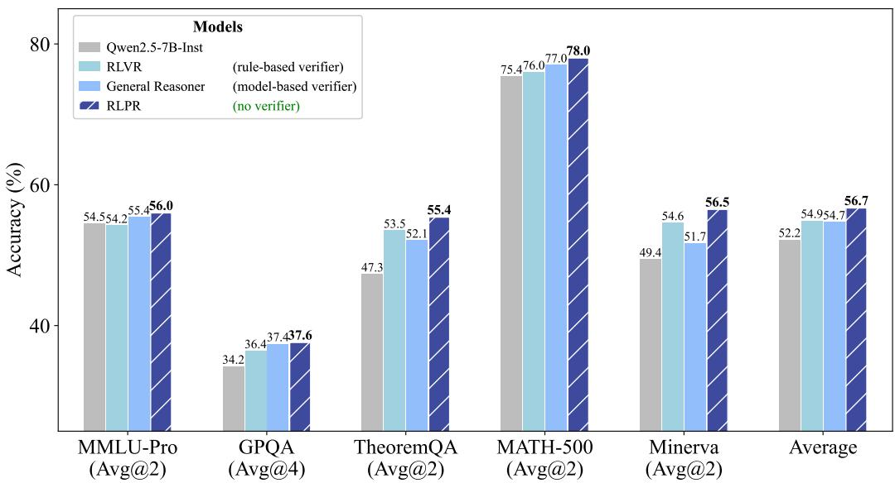
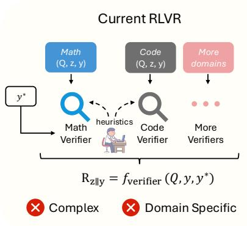
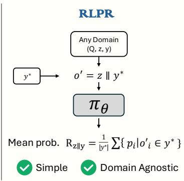
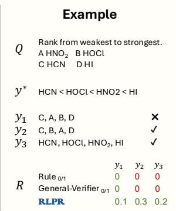
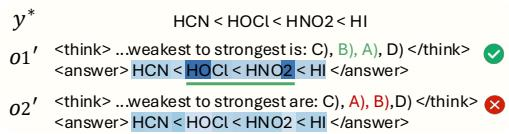
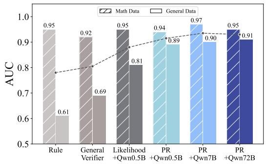
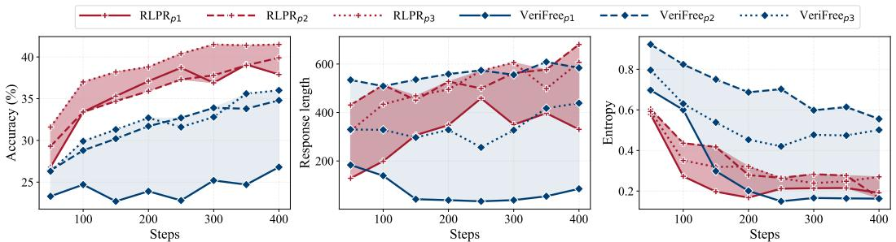

# RLPR: EXTRAPOLATING RLVR TO GENERAL DOMAINS WITHOUT VERIFIERS

Tianyu Yu  $^{1\dagger}$  * Bo Ji  $^{2\dagger}$  Shouli Wang  $^{4\dagger}$  Shu Yao  $^{5\dagger}$  Zefan Wang  $^{1\dagger}$

Ganqu Cui $^{1}$  Lifan Yuan $^{6}$  Ning Ding $^{1}$  Yuan Yao $^{2,3\ddagger}$  Zhiyuan Liu $^{1\ddagger}$  Maosong Sun $^{1}$  Tat-Seng Chua $^{2}$

$^{1}$ Tsinghua University  $^{2}$ National University of Singapore  $^{3}$ Shanghai Qi Zhi Institute

$^{4}$ Harbin Institute of Technology  $^{5}$ Beijing University of Posts and Telecommunications

6University of Illinois Urbana-Champaign

yiranytianyu@gmail.com yaoyuanthu@gmail.com

  
RLPR Code  
RLPR Dataset  
RLPR Models  
Figure 1: Overall performance on general-domain and mathematical reasoning benchmarks. By simply replacing the rule-based verifier reward of RLVR with the proposed LLM's intrinsic probability reward, RLPR achieves consistent improvements in both mathematical and general domains, even outperforming strong RL methods driven by model-based verifier reward. Average: average accuracy of five benchmarks. Verifier requirements of different methods are listed in parentheses.

# ABSTRACT

Reinforcement Learning with Verifiable Rewards (RLVR) demonstrates promising potential in advancing the reasoning capabilities of LLMs. However, its success remains largely confined to mathematical and code domains. This primary limitation stems from the heavy reliance on domain-specific verifiers, which results in prohibitive complexity and limited scalability. To address the challenge, our key observation is that LLM's intrinsic probability of generating a correct free-form answer directly indicates its own evaluation of the reasoning reward (i.e., how well the reasoning process leads to the correct answer). Building on this insight, we propose RLPR, a simple verifier-free framework that extrapolates RLVR to broader general domains. RLPR uses the LLM's own token probability scores for reference answers as the reward signal and maximizes the expected

reward during training. We find that addressing the high variance of this noisy probability reward is crucial to make it work, and propose prob-to-reward and stabilizing methods to ensure a precise and stable reward from LLM intrinsic probabilities. Comprehensive experiments in four general-domain benchmarks and three mathematical benchmarks show that RLPR consistently improves reasoning capabilities in both areas for Gemma, Llama, and Qwen based models. Notably, RLPR outperforms concurrent VeriFree by 7.6 points on TheoremQA and 7.5 points on Minerva, and even surpasses strong verifier-model-dependent approaches General-Reasoner by 1.6 average points across seven benchmarks.

# 1 INTRODUCTION

Large-scale Reinforcement Learning with Verifiable Rewards (RLVR) has emerged as a promising paradigm to advance the reasoning capabilities of Large Language Models (LLMs) (Jaech et al., 2024; DeepSeek-AI et al., 2025; Hu et al., 2025b; Luo et al., 2025a). This paradigm not only shows the power of scaling test-time computation for addressing complex problems, but also sheds valuable light on paths to AGI with incentivized exploration and evolution.

However, in contrast to the pretraining of LLMs that can learn foundational capabilities from general domain data, most RLVR methods are confined to mathematics (Hu et al., 2025b; Liu et al., 2025b; Zeng et al., 2025; Yu et al., 2025) and code generation (Luo et al., 2025a; He et al., 2025; Cui et al., 2025a). The primary reason is that existing RLVR methods heavily rely on domain-specific verifiers to obtain reward, as shown in Figure 2. The most widely adopted verifiers are handcrafted rules (Hu et al., 2025b; Liu et al., 2025b; Zeng et al., 2025). Extending these rule-based reward systems to new models and domains typically requires prohibitive heuristic engineering. Moreover, for general-domain reasoning with free-form answers, it is even impossible to devise rule-based verifiers due to the high diversity and complexity of natural language. Recent works attempt to address this problem by training specialized LLMs as verifier models (Ma et al., 2025). However, training LLMs for general reward evaluation requires non-trivial and extensive data annotation, which often leads to unsatisfactory reward quality in practice. Involving separate verifier models also complicates the RL training framework and introduces additional computation cost. As a result, this scalability problem prevents existing RLVR methods from utilizing rich general-domain data and limits the potential of broader reasoning capabilities.

To address the problem, we propose the RLPR framework (Reinforcement Learning with Reference Probability Reward) that extrapolates general-domain RLVR without external verifiers. The basic insight is that LLM's intrinsic probability of generating a correct answer directly indicates its own evaluation of the reasoning reward (i.e., how well the reasoning process leads to the correct answer). It also reflects the policy by measuring how likely the LLM is to take the correct action. Therefore, we can directly leverage this probability signal as a reward to incentivize reasoning for the correct answer in general domains. Since this probability score is a natural built-in of LLM's foundational capabilities, it offers good coverage and potential for reward evaluation even without any specialized fine-tuning. It can also better deal with the complexity and diversity of free-form natural language answers, giving reasonable reward even to partially correct answers.

Specifically, RLPR introduces two key innovations: (1) At the reward modeling level, we propose a simple and scalable alternative to the explicit reward from external verifiers with an intrinsic Probability-based Reward (PR), calculated by the average decoding probabilities of the reference answer tokens. Compared with naive sequence likelihood as reward (Zhou et al., 2025), the proposed PR shows better robustness and higher reward quality on quantitative examinations (see Figure 4). Moreover, we propose a simple debiasing method to eliminate the reward bias from text by optimizing the reward advantage over the same prompt without reasoning. (2) At the training level, we propose an adaptive curriculum learning mechanism to stabilize training. We adaptively remove prompts yielding low reward standard deviation (indicating prompts that are too easy or too complex), using a dynamic threshold based on the exponential moving average of past rewards' standard deviation. We find that this approach can well keep up with the reward distribution shifts during training, and improves both the training stability and final performance.

Comprehensive experiments on seven benchmarks show that, without any external verifiers, RLPR substantially enhances reasoning capabilities in both mathematical and general domains.

  
Figure 2: Existing RLVR methods rely on specialized verifiers for each domain, suffering from high complexity and limited scalability. We propose the RLPR framework, which replaces the complex verifier-based reward with a simple probability-based reward generated by the policy model  $\pi_{\theta}$ .  $Q$ : input question,  $z$ : generated reasoning content before final answer,  $y$ : generated final answer,  $y^{*}$ : reference answer. As shown in the example on the right side, rules and verifier models wrongly label both  $y_{2}$  and  $y_{3}$  as incorrect due to their limited capability of handling natural language complexity.

Leveraging Qwen2.5-7B (Team, 2024) as base model, RLPR achieves 56.0 on MMLU-Pro and 55.4 on TheoremQA, even surpassing the strong General Reasoner-7B (Ma et al., 2025) that utilizes a specially trained 1.5B verifier model. Furthermore, compared with VeriFree (Zhou et al., 2025), a concurrent verifier-free approach, RLPR achieves significant improvement of 7.6 on TheoremQA and 7.5 on Minerva. We also evaluate RLPR on models from Llama3.1 Grattafori et al. (2024) and Gemma2 Team et al. (2024), achieving improvements of 6.4 and 6.1 average points across seven benchmarks respectively.

The contribution of this work can be summarized as fourfold: (1) We present RLPR, a simple and scalable framework that extends RLVR to general domains without using external verifiers. (2) We propose a novel probability reward that eliminates the need for external verifiers and achieves better reward quality than naive likelihood as a reward. (3) We introduce a novel standard deviation filtering strategy that effectively stabilizes training by removing samples with low reward standard deviation. (4) We conduct comprehensive experiments to demonstrate the effectiveness of the proposed framework on various base models from Qwen, Llama and Gemma. All the codes, data, and model weights are released to facilitate future research.

# 2 RLPR

In this section, we first introduce the fundamentals of RLVR and describe the procedure to calculate the probability reward for RLPR. Then we introduce the debiasing method and the standard deviation filtering approach.

# 2.1 REINFORCEMENT LEARNING FROM VERIFIABLE REWARDS

Reinforcement learning from verifiable reward (RLVR) is a general post-training paradigm in which a rule-based verifier assigns a scalar reward score to each generated response. Specifically, given a prompt  $x$ , the policy  $\pi_{\theta}$  produces reasoning content  $z$  and the final answer  $y$ . Then the expected verifier score is optimized:

$$
\mathcal {J} (\theta) = \mathbb {E} _ {z, y \sim \pi_ {\theta} (\cdot | x)} \left[ f _ {\text {v e r i f i e r}} (y, y ^ {*}) \right], \tag {1}
$$

where  $f_{\text{verifier}}$  is a task-specific, rule-based verifier checking whether the generated answer  $y$  passes the test defined by ground truth  $y^*$ . Common instantiations include symbolic verifiers (Hynek & Greg, 2025) for mathematical problems or sandboxed execution (Bytedance-Seed-Foundation-Code-Team et al., 2025) for code generation. However, building rule-based verifiers is a laborious, systematic effort that involves designing handcrafted rules and edge case handling. This restricts the application of RLVR to new domains.

# 2.2 PROBABILITY REWARD

Motivated by the observation that the LLM's intrinsic probability of generating a correct answer directly indicates its internal evaluation of the reasoning quality, we use per-token decoding probabilities of the reference answer as the reward signal. Unlike existing methods that rely on domain-specific verifiers (Cui et al., 2025a; Luo et al., 2025a), which require substantial manual heuristics and engineering effort for the construction of verifiers, our reward computation process involves only the model itself. An overview of the process is illustrated in Figure 2.

We denote each response to question  $Q$  with  $o = (o_0, \dots, o_N)$ , where  $o_i$  is an individual token in the response. To obtain probabilities, we first extract the generated answer  $y$  from the full response sequence and denote the remaining content as reasoning  $z$ . We then construct a modified sequence  $o' = (o_0', \dots, o_{N'}')$  by replacing the generated answer with the reference from the training data. This sequence is fed to the policy model to get probabilities  $(p_0, \dots, p_{N'})$ . The probability reward is computed as:

$$
r = f _ {\text {s e q}} \left(\left\{p _ {i} \mid o _ {i} ^ {\prime} \in y ^ {*} \right\}\right), \tag {2}
$$

where  $f_{\mathrm{seq}}$  aggregates per-token probabilities into a single reward scalar for the response  $o$ . While using  $f_{\mathrm{seq}} = \sqrt[n]{\prod}$  (the normalized product of probabilities, i.e., sequence likelihood) reflects the overall likelihood of the reference answer, we observe that it introduces high variance and is overly sensitive to minor variations, such as synonyms. For instance, the token probability sequences (0.01, 0.7, 0.9) and (0.05, 0.7, 0.9) yield vastly different scores under the product, despite only a small difference on the first token. To address this issue, we instead adopt  $f_{\mathrm{seq}} = \frac{1}{|y^{*}|}\sum$  (mean probabilities), which yields a more robust reward signal and demonstrates superior correlation with answer quality in our analyses (see Fig 4). We observe that probability reward values are highly consistent with the quality of generated answer  $y$ , where high rewards are gained when the predicted answer is semantically similar to the reference answer and low rewards are assigned otherwise. Note that the length-normalization step is redundant for GRPO (Shao et al., 2024) but could be crucial for algorithms like REINFORCE++ (Hu et al., 2025a) which do not include group-normalization.

# 2.3 REWARD DEBIASING

Although the probability-based rewards correlate strongly with response quality, they are also influenced by various latent factors. We denote the contributors to the probability reward  $r$  as  $U_{r}$ , which can be essentially decomposed into two latent factors:

$$
U _ {r} = U _ {z} + U _ {\text {o t h e r s}}, \tag {3}
$$

where  $U_{z}$  represents the effects of the reasoning content, and  $U_{\mathrm{others}}$  captures the characteristics of other related factors, including the question and reference answer. Using  $r$  directly as a reward introduces bias associated with the unobserved factor  $U_{\mathrm{other}}$ , potentially degrading the reward quality. To mitigate this, we introduce a base score  $r'$  by computing the probability score of directly decoding the reference answer  $y^{*}$ , without intermediate reasoning  $z$ , using Eq 2. This gives  $U_{z} = U_{r} - U_{r'}$ , and the debiased probability reward is then calculated as with:

$$
\hat {r} = \operatorname {c l i p} \left(0, 1, r - r ^ {\prime}\right), \tag {4}
$$

where the clipping operation ensures that the reward remains within a favorable numeric range [0, 1]. This formulation effectively removes the potential bias from  $U_{Q}$  and  $U_{y^{*}}$  and models PR as the improvement in probability given the generated reasoning  $z$ . We observe this debiasing step stabilizes training and enhances reward robustness. The final gradient estimator of our objective function is:

$$
\begin{array}{l} \nabla \mathcal {J} _ {\mathrm {R L P R}} (\theta) = \nabla \mathbb {E} _ {o \sim \pi_ {\theta} (\cdot | x)} [ \hat {r} ] \\ = \sum_ {o} \hat {r} \pi_ {\theta} (o | x) \nabla \log \pi_ {\theta} (o | x) \\ = \mathbb {E} _ {o \sim \pi_ {\theta} (\cdot | x)} [ \hat {r} \nabla \log \pi_ {\theta} (o | x) ], \tag {5} \\ \end{array}
$$

where we optimize the expected reward on the whole response  $o = z||y$ .

# 2.4 STANDARD DEVIATION FILTERING

Existing RLVR methods employ accuracy filtering (Cui et al., 2025a) to stabilize training by excluding too difficult and too easy prompts. Typically, this involves filtering entirely correct or incorrect prompts. However, the continuous nature of PR makes it challenging to directly apply accuracy filtering since it is hard to set a universal threshold for response correctness.

Through the analysis of accuracy filtering, we observe that filtering prompts with low standard deviation in reward values can effectively achieve a similar effect. Specifically, prompts that consistently yield all high or all low scores exhibit low standard deviation due to the boundedness of PR (i.e., all reward values lie within [0, 1]). Meanwhile, the overall standard deviation distribution continuously shifts during training, and a fixed threshold may cause either too strict or loose filtering at different training stages. To address this, we adopt an exponential moving average to dynamically update the filtering threshold  $\beta$  using the average standard deviation of each training step. By filtering the prompts whose reward standard deviation is less than  $\beta$ , we introduce an adaptive curriculum learning mechanism to improve both the training stability and final performance.

# 3 EXPERIMENTS

In this section, we empirically investigate the effectiveness of RLPR in enhancing LLM reasoning capabilities. In addition to evaluating model performance, we also analyze reward quality of our proposed PR, the efficacy of different components, and the potential of applying RLPR to verifiable domains such as mathematics.

# 3.1 EXPERIMENTAL SETUP

Models. We conduct experiments on Gemma2 Team et al. (2024), Llama3.1 Grattafiori et al. (2024) and Qwen2.5 (Team, 2024) series models for fair comparison with most existing methods and thorough evaluation. Unless otherwise specified, experiments are conducted on Qwen2.5-7B-Base.

Training Data. We adopt the collection of prompts released by (Ma et al., 2025), which includes high-quality reasoning questions across multiple complex domains. To focus on the effectiveness of RLPR in general domains, we only use non-mathematics prompts from the data. We ask GPT-4.1 (OpenAI, 2025) to filter out prompts that are too easy and finally get  $77\mathrm{k}$  prompts for training.

Evaluation. We evaluate the reasoning capabilities with multiple general reasoning and mathematical benchmarks. For math reasoning, we include MATH-500 (Cobbe et al., 2021), Minerva (Lewkowycz et al., 2022), and AIME24. For general domains, we adopt four benchmarks:

- MMLU-Pro (Wang et al., 2024) is a widely used multitask language understanding benchmark that includes challenging, reasoning-intensive questions across diverse domains. We randomly sample 1000 prompts from the benchmark to strike a balance between efficiency and variance.  
- GPQA (Rein et al., 2023) includes graduate-level questions from multiple disciplines, including physics, chemistry, etc. We use the highest-quality GPQA-diamond subset for evaluation.  
- TheoremQA (Chen et al., 2023) assesses a model's ability to apply theorems to solve complex science problems. This benchmark includes 800 high-quality questions covering 350 theorems from domains including Math, Physics, etc. We remove the 53 multimodal instructions.  
- WebInstruct. We hold out a validation split from WebInstruct (Ma et al., 2025) as a more accessible benchmark for medium-sized models. Unlike the aforementioned benchmarks, this benchmark is designed to be less challenging while still assessing multidisciplinary reasoning. We uniformly sample 1k prompts from the training set and remove potential data contamination by applying 10-gram dedduplication, resulting in 638 distinct questions.

Baselines. We compare our approach with the following established and contemporaneous methods: (1) Base models and Instruct models. We include the Qwen2.5 (Team, 2024) model family for comparison, reporting results for both Qwen2.5-7B and Qwen2.5-7B-Instruct. We also compare with Gemma2-2B-it and Llama3.1-8B-Inst. (2) PRIME (Cui et al., 2025a) enhances the mathematical and code reasoning capabilities using implicit rewards. (3) SimpleRL-Zoo (Zeng et al., 2025) trains the model using rule-based rewards. We report both results of the Qwen2.5-Math and Qwen2.5-7B

<table><tr><td>Model</td><td>Base</td><td>Verifier</td><td>MMLU-Pro Avg@2</td><td>GPQA Avg@4</td><td>TheoremQA Avg@2</td><td>WebInst. Avg@2</td><td>MATH-500 Avg@2</td><td>Minerva Avg@2</td><td>AIME 24 Avg@16</td><td>General -</td><td>All -</td></tr><tr><td colspan="12">Gemma Models</td></tr><tr><td>Gemma2-2B-it</td><td>Base</td><td>-</td><td>27.9</td><td>19.3</td><td>16.4</td><td>33.5</td><td>26.6</td><td>15.9</td><td>0.0</td><td>24.3</td><td>19.9</td></tr><tr><td>RLVR</td><td>Inst</td><td>Rule</td><td>31.6</td><td>25.8</td><td>20.1</td><td>52.3</td><td>30.7</td><td>16.5</td><td>0.2</td><td>32.4</td><td>25.3</td></tr><tr><td>RLPR</td><td>Inst</td><td>X</td><td>33.5</td><td>28.5</td><td>21.2</td><td>52.0</td><td>30.4</td><td>17.1</td><td>0.2</td><td>33.8</td><td>26.0</td></tr><tr><td colspan="12">Llama Models</td></tr><tr><td>Llama3.1-8B-Inst</td><td>Base</td><td>-</td><td>46.4</td><td>31.6</td><td>31.3</td><td>54.7</td><td>50.1</td><td>32.7</td><td>4.2</td><td>40.5</td><td>35.6</td></tr><tr><td>RLVR</td><td>Inst</td><td>Rule</td><td>49.3</td><td>36.0</td><td>32.0</td><td>60.2</td><td>51.9</td><td>35.2</td><td>4.6</td><td>44.4</td><td>38.5</td></tr><tr><td>RLPR</td><td>Inst</td><td>X</td><td>53.6</td><td>36.5</td><td>35.5</td><td>68.5</td><td>54.1</td><td>39.0</td><td>8.8</td><td>48.5</td><td>42.3</td></tr><tr><td colspan="12">Qwen Models</td></tr><tr><td>Qwen2.5-7B</td><td>-</td><td>-</td><td>45.3</td><td>32.4</td><td>41.4</td><td>60.4</td><td>63.0</td><td>37.6</td><td>6.5</td><td>44.9</td><td>40.9</td></tr><tr><td>Qwen2.5-7B-Inst</td><td>Base</td><td>-</td><td>54.5</td><td>34.2</td><td>47.3</td><td>72.6</td><td>75.4</td><td>49.4</td><td>9.4</td><td>52.2</td><td>49.0</td></tr><tr><td>Oat-Zero</td><td>Math</td><td>Rule</td><td>45.8</td><td>38.8</td><td>53.3</td><td>71.5</td><td>80.8</td><td>52.1</td><td>29.8</td><td>52.4</td><td>53.2</td></tr><tr><td>PRIME</td><td>Math</td><td>Rule</td><td>39.5</td><td>32.1</td><td>47.7</td><td>54.5</td><td>76.4</td><td>45.5</td><td>20.4</td><td>43.4</td><td>45.2</td></tr><tr><td>SimpleRL-Zoo</td><td>Math</td><td>Rule</td><td>46.9</td><td>38.4</td><td>51.1</td><td>70.3</td><td>77.1</td><td>51.0</td><td>26.5</td><td>51.7</td><td>51.6</td></tr><tr><td>TTRL</td><td>Base</td><td>Rule</td><td>51.1</td><td>34.1</td><td>48.8</td><td>68.0</td><td>82.1</td><td>52.8</td><td>15.8</td><td>50.5</td><td>50.4</td></tr><tr><td>SimpleRL-Zoo</td><td>Base</td><td>Rule</td><td>54.1</td><td>36.2</td><td>49.5</td><td>70.7</td><td>76.3</td><td>49.2</td><td>14.8</td><td>52.6</td><td>50.1</td></tr><tr><td>RLVR</td><td>Base</td><td>Rule</td><td>55.1</td><td>36.2</td><td>52.2</td><td>75.3</td><td>76.5</td><td>54.9</td><td>17.7</td><td>54.7</td><td>52.6</td></tr><tr><td>General Reasoner</td><td>Base</td><td>Model</td><td>55.4</td><td>37.4</td><td>52.1</td><td>74.5</td><td>77.0</td><td>51.7</td><td>16.0</td><td>54.8</td><td>52.0</td></tr><tr><td>VeriFree</td><td>Base</td><td>X</td><td>53.8</td><td>36.7</td><td>47.6</td><td>72.5</td><td>73.5</td><td>49.0</td><td>12.5</td><td>52.6</td><td>49.4</td></tr><tr><td>RLPR</td><td>Base</td><td>X</td><td>56.0</td><td>37.6</td><td>55.4</td><td>75.5</td><td>78.0</td><td>56.5</td><td>16.3</td><td>56.1</td><td>53.6</td></tr></table>

Table 1: Overall performance on seven reasoning benchmarks. WebInst.: held-out evaluation set from WebInstruct. General: Average of MMLU-Pro, GPQA, TheoremQA and WebInst.

as the base model. (4) Oat-Zero (Liu et al., 2025b) proposes to remove the standard deviation and token-level normalization in GRPO. (5) TTRL (Zuo et al., 2025) eliminates the reliance on labeled reference answers and instead uses majority voting to assign pseudo-labels to sampled responses. We report the result of the model trained on MATH-500 (Zuo et al., 2025) prompts. (6) General Reasoner (Ma et al., 2025) conducts RLVR in multiple domains by introducing an additional verifier model, which is distilled from Gemini 2.0 (Google DeepMind, 2024) to verify general-domain responses. (7) VeriFree (Zhou et al., 2025) is a concurrent work that uses the likelihood of reference answers (for those shorter than 7-tokens) as the reward signal and incorporates an auxiliary finetuning loss. As results were only released for the Qwen3 (Team, 2025a) model series, we reproduce their method on Qwen2.5-7B using the official repository. For fair comparison, we evaluate both their provided prompt and our training prompt, finding that the original prompt yields better results. Therefore, we adopt this configuration for this baseline.

Implementation Details. We adopt the verl (Sheng et al., 2024) framework for efficient training. In each rollout step, we sample eight responses per prompt for a batch of 768 prompts using a temperature of 1, and subsequently perform 4 policy updates on the collected responses. The scale  $\beta$  used for filtering is set to 0.5. The clip threshold in PPO loss is set to (0.8, 1.27) to prevent entropy collapse (Yu et al., 2025; Cui et al., 2025b). During evaluation, we set the rollout temperature to 1. To reduce the evaluation variance, we evaluate the model on each benchmark multiple times and report the final Avg@k results. The max generation length for training and evaluation is 3072, with minimal truncation observed. For baseline evaluation, we adopt the default generation temperature from the original papers. For baseline evaluation, we follow the corresponding papers to select generation parameters and use our setup if the original paper uses greedy decoding. For reliable answer extraction, we adopt the "<think></think><answer></answer>" template of R1 (Liu et al., 2025b) during training and use the striped content inside answer tags as the generated answer. For experiments on Gemma and Llama, we change the training and evaluation temperature to 0.6 and remove the <think> part in templates to prevent generation degradation. We observe that rule-based scoring scripts introduce errors in benchmarks containing question formats beyond multiple-choice. To address this, we deploy a Qwen2.5-7B-Inst model server for evaluation, and additionally leverage GPT-4.1 for more complex benchmarks, such as TheoremQA and Minerva.

# 3.2 MAIN RESULTS

The main experimental results are reported in Table 1, from which we observe that: (1) RLPR significantly improves general-domain reasoning performance. Without any external verifier, our method

improves the average performance on four general-domain reasoning benchmarks by  $24.9\%$  on Qwen2.5-7B. (2) RLPR exceeds the RLVR baseline on Qwen, Llama and Gemma. Specifically, we achieve larger general reasoning performance improvement over RLVR for 1.4, 3.9 and 1.4 average points on Gemma, Llama and Qwen respectively. (3) RLPR enhances mathematical reasoning capability on par with frameworks dedicated to math reasoning. Though we removed the mathematical category from the original WebInstrut dataset during training, we find the performance on multiple mathematical benchmarks is significantly improved and the score on Minerva surpasses Oat-Zero and SimpleRL-Zoo. (4) RLPR exhibits even better performance compared with methods that require trained verifier models, surpassing General Reasoner, which uses a trained 1.5B-parameter verifier model to judge each sampled response, by 1.6 on average across all seven reasoning benchmarks. (5) RLPR achieves a significant performance advantage compared with concurrent verifier-free methods, with improvement of 7.6 points on TheoremQA and 7.5 points on Minerva over VeriFree (Zhou et al., 2025).

# 3.3 PROBABILITY-BASED REWARD ANALYSIS

We first illustrate a token-level probability example in Figure 3, where response sequence  $o2$  receives a substantially lower score on the "HO" token, precisely reflecting the error made by response sequence  $o2$  (i.e., placing option A before option B). For quantitative analysis of the Probability-based Reward (PR) quality, we sample eight responses for each prompt from the WebInstruct (Ma et al., 2025) and DeepScale (Luo et al., 2025b) datasets. To ensure a fair evaluation, we use the publicly released model from (Hu et al., 2025b). Human annotators then evaluate the correctness of each response. To maintain robustness and control labeling costs, we randomly keep 50 prompts from each dataset that contain both correct and incorrect responses.

# PR discriminates correct responses better than the rule-based verifier on general data.

To evaluate the ability of different reward to distinguish between correct and incorrect responses (i.e., assign higher rewards to correct responses), we rank responses for each prompt according to the respective rewards and compute the ROC-AUC (Bradley, 1997) metric using human annotations as ground truth. Higher AUC values indicate stronger discrimination capability. As shown in Figure 4, while the rule-based verifier achieves reasonable performance on mathematical prompts, it struggles on

general-domain prompts, achieving an AUC of only 0.61. The primary flaw of the rule-based verifier in general domains is that it overlooks correct responses due to its limited capability of processing natural language complexity. We show an example in Figure 2 to illustrate the phenomenon. In contrast, PR consistently delivers high-quality rewards across both mathematical and general domains.

# PR outperforms verifier models across both mathematical and general domains.

While the General-Verifier achieves improvement over rule-based reward on general data  $(0.61\rightarrow 0.69)$ , its performance declines on mathematical prompts  $(0.95\rightarrow 0.92)$  as shown in Figure 4. We attribute this limitation to the finetuning-based paradigm, which requires extensive task-specific data and struggles to generalize across domains. In contrast, our proposed PR achieves improvements of at least  $2\%$  on mathematical data and  $20\%$  on general-domain data compared with the verifier model. Upon analyzing the General-Verifier's judgments, we find that its main errors stem from limited comprehension of complex responses and challenges in output parsing. By leveraging

  
Figure 3: Token-level probability visualization, where deeper colors represent higher values. The underlined part highlights that probabilities precisely reflect that response sequence  $o2$  incorrectly place option B after A, resulting lower scores at the corresponding positions in the reference answer. The question is shown in Figure 2.

  
Figure 4: Reward quality comparison. We report the AUC on both math data and general data, and highlight the average score with the dashed line. Qwn: Qwen2.5 models.

ing the intrinsic capabilities of LLMs, PR directly produces high-quality reward scores in a single forward pass, also eliminating the need for any text post-processing.

PR is effective with even small-scale models. We compare the quality of PR using models of varying sizes. As shown in Figure 4, even the smallest Qwen2.5-0.5B outperforms the specifically trained General-Verifier on both mathematical and general data. While increasing the model size further improves the performance on general-domain data, gains on mathematical data are marginal due to the already high absolute scores.

PR is robust over entropy and length distribution. We also analyze the robustness of PR by analyzing the correlation between PR values and factors, including length and decoding entropy of generated responses. For each prompt, we calculate the Spearman correlation coefficient and p-value. We observe that only  $8\%$  prompts get a p-value smaller than 0.05, and the average coefficient is -0.060 for length and 0.059 for entropy. These results indicate that the probability reward values show negligible This indicates that our proposed reward serves as a robust

<table><tr><td>Data</td><td>Verifier</td><td>TheoremQA Avg@2</td><td>Minerva Avg@2</td></tr><tr><td>DAPO</td><td>Rule</td><td>50.3</td><td>50.6</td></tr><tr><td rowspan="2">WebInstruct</td><td rowspan="2">Rule ✘</td><td>52.2</td><td>54.9</td></tr><tr><td>55.4</td><td>56.5</td></tr></table>

PR is essential for utilizing general-domain data. We compare the performance of models trained exclusively on mathematical prompts Yu et al. (2025) versus those trained on general-domain prompts, as shown in Table 2. The results demonstrate that general-domain data enhances the performance on both benchmarks (+1.9 on TheoremQA, +4.3 on Minerva). However, general-domain data also includes additional challenges for rule-based verifiers. Consequently, directly adopting existing rule-based verifiers gives obvious diminished performance.

# 3.4 ABLATION STUDY

To investigate the contribution of different design choices in RLPR, we perform an ablation study.

Effect of per-token probability as reward. We compare our per-token probability-based reward with naive sequence likelihood as the reward signal. In the calculation of likelihood, low-probability tokens can dramatically affect the final reward. For instance, probabilities of  $1\mathrm{e}^{-4}$  versus  $1\mathrm{e}^{-5}$  can lead to a tenfold difference in reward, despite their small absolute difference. This issue becomes more pronounced for longer reference answers, which are more likely to contain at least one low-probability token. (Zhou et al., 2025) addresses this instability by filtering out prompts whose reference answers exceed seven tokens. However, this also significantly limits the data diversity. In contrast, using the mean per-token probability is much more robust and yields better performance, as shown in Table 3. We also compare the reward quality of the likelihood reward and our proposed PR in Figure 4, where PR consistently achieves better results on both domains.

Effect of reward debiasing and standard deviation filtering. We compare our final debiased reward  $\hat{r}$  with directly using the reward in Eq 2. Results in Table 3 show that the performance on both benchmarks is worse with original reward, demonstrating the effectiveness of the debiasing operation. To quantify the effectiveness of the standard deviation filtering approach, we also train a model without any filtering mechanism. The results in Table 3 show that the filtering strategy is important for the final performance of models by removing prompts that do not get diverse responses.

Table 2: Effect of different RLVR training data and reward mechanisms.  

<table><tr><td>Method</td><td>TheoremQA</td><td>Minerva</td></tr><tr><td>RLPR</td><td>55.4</td><td>56.5</td></tr><tr><td>w/o debiasing</td><td>52.7-2.7</td><td>54.1-2.4</td></tr><tr><td>w/o std-filtering</td><td>52.5-2.9</td><td>55.1-1.4</td></tr><tr><td>w/o token prob.</td><td>33.5-21.9</td><td>34.2-22.3</td></tr></table>

Table 3: Ablation experimental results. Token prob.: token probability average. Avg@2 results are reported.  

<table><tr><td>Reward</td><td>TheoremQA</td><td>Minerva</td></tr><tr><td>Rule-based</td><td>44.8</td><td>50.0</td></tr><tr><td>Rule-based + PR</td><td>48.8</td><td>49.0</td></tr></table>

Table 4: Experimental results of different rewards on mathematical data. Avg@2 results are reported. We combine rule-based reward and PR by summarizing advantages.

  
Figure 5: Robustness across different training prompt templates. RLPR yields consistently higher performance compared with VeriFree. Left: average performance on seven benchmarks. Middle: response length. Right: response entropy during training.

# 3.5 RLPR ON VERIFIABLE DOMAINS

We study the effectiveness of RLPR on domains where verifiers are already available. In this section, we use the mathematical training data of PRIME (Cui et al., 2025b) as a representative mathematical RLVR dataset. Though rule-verifiers already give a reliable correctness label on mathematical data, we observe that such a binary correctness label lacks fine-grained discrimination capability on different responses sharing the same correctness. For example, given reference answer "200" for a question, "199" is generally better than "1". We argue that such fine-grained discrimination can be helpful for the model to get a more comprehensive understanding of the qualities of sampled responses and thus improve its performance. We combine the rule-based verifier scores and our proposed PR to train the model and report results in Table 4. Results show that our proposed probability reward can also improve the utilization of data from verifiable domains like mathematics.

# 3.6 ROBUSTNESS ANALYSIS

Compared with rule-based rewards, the distribution of our proposed probability-based reward (PR) may be influenced by variations in training prompt templates. To evaluate the robustness of RLPR with different templates, we consider three prompt settings:  $p_1$  from VeriFree Zhou et al. (2025),  $p_2$  used in DeepSeek-R1 DeepSeek-AI et al. (2025) and  $p_3$  which moves the format requirement to user prompt. To reduce training costs, we switch the base model to Qwen2.5-3B, decrease the batch size to 128, and apply a single update per training step. For fair comparison, we adopt the origin dataset from VeriFree for this experiment. Figure 5 presents the comparison of performances, response length, and entropy across different training steps. We observe that RLPR maintains consistent performance regardless of prompt choice, while VeriFree exhibits high sensitivity, with a notable performance drop of by 8.0 at step-400 when using  $p_1$ . Furthermore, the response length of RLPR under all prompts converges to a similar level, and the entropy remains within a reasonable range with no signs of entropy collapse Cui et al. (2025b).

# 4 RELATED WORKS

Reinforcement Learning with Verifiable Rewards. Reinforcement learning from binary verifiable rewards (Cui et al., 2025a; Yu et al., 2025; Luo et al., 2025c; Team, 2025b; DeepSeek-AI et al., 2025) recently demonstrates strong reasoning capabilities on math and code tasks, and has emerged as a common practice. These practices utilize verifiers such as Math-Verify (Hynek & Greg, 2025), SandboxFusion (Bytedance-Seed-Foundation-Code-Team et al., 2025), and custom implemented ones (Cui et al., 2025a), which effectively judge the correctness of model rollouts and forgo the need for preference annotations. However, this paradigm is restricted to domains where robust verifiers are available. Moreover, existing implementations of verifiers show inconsistencies (He et al., 2025) since the complexity for rule-based verifiers to handle edge cases is nontrivial. In this work, we propose to extend RLVR practices to domains without robust verifiers.

Reasoning in General Domains Previous research explores reasoning in general domains, a vital part of which is how to obtain reliable reward signals. One line of work is generative reward models (Mahan et al., 2024), where another generative model judges the quality of rollouts. This concept has been extended to the implementation of verifiers based on a generative model (Ma et al., 2025; Liu et al., 2025a) and enhancements of the judge model itself as a reasoner (Chen et al., 2025). In

this work, we demonstrate that reinforcement learning for general-domain reasoning can rely on the decoding probability of the reference answer as a reward signal. Concurrent to our work, (Zhou et al., 2025) utilizes policy likelihood for reference answer as rewards, while limited to short answers less than 7 tokens and requires a auxiliary fine-tuning-based objective. Instead, we observe the robustness of per-token probability as a reward signal and extend RLVR to general domains without length constraints.

Self-Reward Optimization Unsupervised reinforcement learning on language models using the policy model itself as a reward has recently emerged as an embarrassingly effective approach (Zuo et al., 2025; Zhao et al., 2025). The common idea behind the practice of self-reward is raising the probability of consistent answers (Zuo et al., 2025), intuitively from the observation that concentrating on the majority brings free improvements (Wang et al., 2022). Recent literature (Agarwal et al., 2025) shows that entropy minimization, which naively degrades generation diversity, is a sugar for reasoning tasks, though restricted to certain model families. However, such practice might be problematic for restricting exploration (Cui et al., 2025b; Hochlehnert et al., 2025; Yu et al., 2025). In contrast to self-rewarding methods that remove diversity to exploit existing reasoning ability, our approach builds the reward based on the reference answer, yielding reasoning performance with healthy token entropy from the clip-high trick (Yu et al., 2025).

# 5 CONCLUSION

RLVR shows the power of scaling test-time computation for addressing complex problems and sheds valuable light on paths to AGI. In this work, we present RLPR, a novel framework that extends this paradigm to broader general domains. Comprehensive experimental results on Gemma, Llama and Qwen show that our method achieves significant improvement on both general and mathematical reasoning tasks without using external verifiers. We propose a novel probability reward (PR) and reward debiasing strategy to enhance its quality further. By replacing rule-based reward with PR, we eliminate the need for external verifiers and achieve better performance than using naive likelihood as a reward or using verifier models. Moreover, we propose a simple standard deviation filtering strategy that stabilizes training by removing samples with low reward standard deviation. In the future, we will explore more domains, including multimodal understanding and scaling RLPR to larger models.

# REFERENCES

Shivam Agarwal, Zimin Zhang, Lifan Yuan, Jiawei Han, and Hao Peng. The unreasonable effectiveness of entropy minimization in lIm reasoning. arXiv preprint arXiv:2505.15134, 2025.  
Andrew P. Bradley. The use of the area under the roc curve in the evaluation of machine learning algorithms. Pattern Recognition, 30(7):1145-1159, 1997. ISSN 0031-3203. doi: 10.1016/S0031-3203(96)00142-2.  
Bytedance-Seed-Foundation-Code-Team, Yao Cheng, Jianfeng Chen, Jie Chen, Li Chen, Liyu Chen, Wentao Chen, Zhengyu Chen, Shijie Geng, Aoyan Li, Bo Li, Bowen Li, Linyi Li, Boyi Liu, Jiaheng Liu, Kaibo Liu, Qi Liu, Shukai Liu, Siyao Liu, Tianyi Liu, Tingkai Liu, Yongfei Liu, Rui Long, Jing Mai, Guanghan Ning, Z. Y. Peng, Kai Shen, Jiahao Su, Jing Su, Tao Sun, Yifan Sun, Yunzhe Tao, Guoyin Wang, Siwei Wang, Xuwu Wang, Yite Wang, Zihan Wang, Jinxiang Xia, Liang Xiang, Xia Xiao, Yongsheng Xiao, Chenguang Xi, Shulin Xin, Jingjing Xu, Shikun Xu, Hongxia Yang, Jack Yang, Yingxiang Yang, Jianbo Yuan, Jun Zhang, Yufeng Zhang, Yuyu Zhang, Shen Zheng, He Zhu, and Ming Zhu. Fullstack bench: Evaluating llms as full stack coders, 2025. URL https://arxiv.org/abs/2412.00535.  
Wenhu Chen, Ming Yin, Max Ku, Pan Lu, Yixin Wan, Xueguang Ma, Jianyu Xu, Xinyi Wang, and Tony Xia. Theoremqa: A theorem-driven question answering dataset, 2023. URL https://arxiv.org/abs/2305.12524.  
Xiusi Chen, Gaotang Li, Ziqi Wang, Bowen Jin, Cheng Qian, Yu Wang, Hongru Wang, Yu Zhang, Denghui Zhang, Tong Zhang, et al. Rm-r1: Reward modeling as reasoning. arXiv preprint arXiv:2505.02387, 2025.