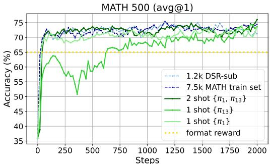
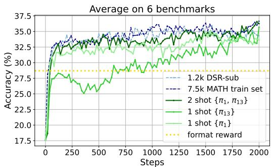
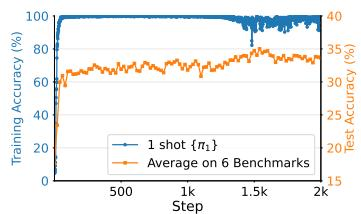
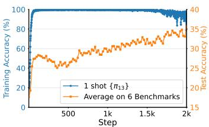
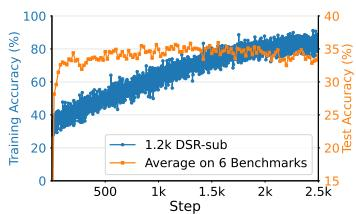
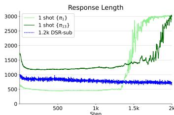
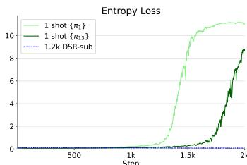
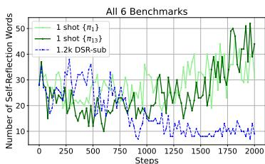
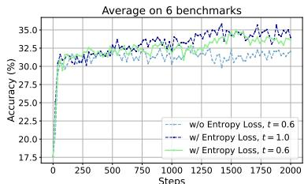

# Reinforcement Learning for Reasoning in Large Language Models with One Training Example

Yiping Wang $^{1}$ † * Qing Yang $^{2}$  Zhiyuan Zeng $^{1}$  Liliang Ren $^{3}$  Liuyan Liu $^{3}$

Baolin Peng $^{3}$  Hao Cheng $^{3}$  Xuehai He $^{4}$  Kuan Wang $^{5}$  Jianfeng Gao $^{3}$

Weizhu Chen $^{3}$  Shuohang Wang $^{3\dagger}$  Simon Shaolei  $\mathbf{D}\mathbf{u}^{1\dagger}$  Yelong Shen $^{3\dagger}$

1University of Washington 2University of Southern California 3Microsoft 4University of California, Santa Cruz 5Georgia Institute of Technology

# Abstract

We show that reinforcement learning with verifiable reward using one training example (1-shot RLVR) is effective in incentivizing the mathematical reasoning capabilities of large language models (LLMs). Applying RLVR to the base model Qwen2.5-Math-1.5B, we identify a single example that elevates model performance on MATH500 from  $36.0\%$  to  $73.6\%$  (8.6% improvement beyond format correction), and improves the average performance across six common mathematical reasoning benchmarks from  $17.6\%$  to  $35.7\%$  (7.0% non-format gain). This result matches the performance obtained using the 1.2k DeepScaleR subset (MATH500:  $73.6\%$ , average:  $35.9\%$ ), which contains the aforementioned example. Furthermore, RLVR with only two examples even slightly exceeds these results (MATH500:  $74.8\%$ , average:  $36.6\%$ ). Similar substantial improvements are observed across various models (Qwen2.5-Math-7B, Llama3.2-3B-Instruct, DeepSeek-R1-Distill-Qwen-1.5B), RL algorithms (GRPO and PPO), and different math examples. In addition, we identify some interesting phenomena during 1-shot RLVR, including cross-category generalization, increased frequency of self-reflection, and sustained test performance improvement even after the training accuracy has saturated, a phenomenon we term post-saturation generalization. Moreover, we verify that the effectiveness of 1-shot RLVR primarily arises from the policy gradient loss, distinguishing it from the "groking" phenomenon. We also show the critical role of promoting exploration (e.g., by incorporating entropy loss with an appropriate coefficient) in 1-shot RLVR training. We also further discuss related observations about format correction, label robustness and prompt modification. These findings can inspire future work on RLVR efficiency and encourage a re-examination of recent progress and the underlying mechanisms in RLVR. Our code, models, and data are open source at https://github.com/ypwang61/One-Shot-RLVR.

# 1 Introduction

Recently, significant progress has been achieved in enhancing the reasoning capabilities of large language models (LLMs), including OpenAI-o1 [1], DeepSeek-R1 [2], and Kimi-1.5 [3], particularly for complex mathematical tasks. A key method contributing to these advancements is Reinforcement Learning with Verifiable Reward (RLVR) [4, 5, 2, 3], which commonly employs reinforcement learning on an LLM with a rule-based outcome reward, such as a binary reward indicating the correctness

  
Figure 1: RLVR with 1 example (green) can perform as well as using datasets with thousands of examples (blue). Left/Right corresponds to MATH500/Average performance on 6 mathematical reasoning benchmarks (MATH500, AIME24, AMC23, Minerva Math, OlympiadBench, and AIME25). Base model is Qwen2.5-Math-1.5B.  $\pi_1$  and  $\pi_{13}$  are examples defined by Eqn. 2 and detailed in Tab. 2, and they are from the 1.2k DeepScalerR subset (DSR-sub). Setup details are in Sec. 3.1. We find that RLVR with 1 example  $\{\pi_{13}\}$ $(35.7\%)$  performs close to that with 1.2k DSR-sub  $(35.9\%)$ , and RLVR with 2 examples  $\{\pi_1,\pi_{13}\}$ $(36.6\%)$  even performs better than RLVR with DSR-sub and as well as using 7.5k MATH train dataset  $(36.7\%)$ . Format reward (gold) (Appendix C.2.3) serves as a baseline for format correction. Detailed results are in Appendix C.1.1. Additional results for non-mathematical reasoning tasks are in Tab. 1.

of the model's final answer to a math problem. Several intriguing empirical phenomena have been observed in RLVR, such as the stimulation or enhancement of specific cognitive behaviors [6] (e.g., self-reflection) and improved generalization across various downstream tasks [5, 2, 3].

Currently, substantial efforts are directed toward refining RL algorithms (e.g., PPO [7] and GRPO [8]) to further enhance RLVR's performance and stability [9-16]. Conversely, data-centric aspects of RLVR remain relatively underexplored. Although several studies attempt to curate high-quality mathematical reasoning datasets [17, 18, 11], there is relatively limited exploration into the specific role of data in RLVR. Thus, critical questions remain open: How much data is truly necessary? What data is most effective? How do the quality and quantity of the training data relate to observed empirical phenomena (e.g., self-reflection and robust generalization)? The most relevant study to these problems is LIMR [19], which proposed a metric called learning impact measurement (LIM) to evaluate the effectiveness of training examples. Using the LIM score, they maintain model performance while reducing the number of training examples by sixfold. However, this study does not explore how aggressively the RLVR training dataset can be reduced. Motivated by these considerations, in this paper, we specifically investigate the following research question:

"To what extent can we reduce the training dataset for RLVR while maintaining comparable performance compared to using the full dataset?"

We empirically demonstrate that, surprisingly, the training dataset for RLVR can be reduced to as little as ONE example! This finding supports recent claims that base models already possess significant reasoning capabilities [13, 20, 6, 21], and further shows that a single example is sufficient to substantially enhance the base model's mathematical performance. We refer to this setup as 1-shot RLVR. We summarize our contributions and findings below:

- We find that selecting one specific example as the training dataset can achieve similar downstream performance to that of the 1.2k DeepScaleR subset (DSR-sub) containing that example. Specifically, this improves the Qwen2.5-Math-1.5B model from  $36.0\%$  to  $73.6\%$  on MATH500, and from  $17.6\%$  to  $35.7\%$  on average across 6 mathematical reasoning benchmarks, including non-trivial improvements beyond format correction (Fig. 1). Notably, these two examples are relatively easy for the base model, which can solve them with high probability without any training (Sec. 3.2.1). Additionally, 1-shot RLVR on math examples can improve model performance on non-mathematical reasoning tasks, even outperforming full-set RLVR (Tab. 1).  
- We confirm the effectiveness of 1(few)-shot RLVR across different base models (Qwen2.5-Math-1.5/7B, Llama3.2-3B-Instruct), models distilled from long Chain-of-Thought (CoT) data (DeepSeek-R1-Distill-Qwen-1.5B), and different RL algorithms (GRPO, PPO).  
- We highlight an intriguing phenomenon in 1-shot RLVR: post-saturation generalization. Specifically, the training accuracy on the single example rapidly approaches  $100\%$ , yet the model's test accuracy continues to improve. Moreover, despite using only one training

example, overfitting does not occur until after approximately 1.4k training steps. Even post-overfitting, while the model's reasoning outputs for the training example become incomprehensible multilingual gibberish mixed with correct solutions, its test performance remains strong, and the reasoning outputs for the test examples remain human-interpretable.  
- In addition, we demonstrate the following phenomena: (1) 1-shot RLVR is viable for many examples in the full dataset when each example is individually used for training. We also discuss its connection with format correction in Appendix C.2.3. (2) 1-shot RLVR enables cross-category generalization: training on a single example from one category (e.g., Geometry) often enhances performance in other categories (e.g., Algebra, Number Theory). (3) As 1-shot RLVR training progresses, both the response length for the training example and the frequency of self-reflective terms in downstream tasks increase.  
- Through ablation studies, we show that policy gradient loss primarily drives the improvements observed in 1-shot RLVR, distinguishing it from "grokking", which heavily depends on regularization methods like weight decay. Additionally, we emphasize the importance of promoting diverse exploration in model outputs, showing that adding an entropy loss with an appropriate coefficient further enhances performance.  
- Lastly, we find that employing entropy loss alone, even without any outcome reward, yields a performance boost, although it remains weaker than the format-reward baseline. Similar improvements are observed for Qwen2.5-Math-7B and Llama-3.2-3B-Instruct. We also discuss label robustness and prompt modification in RLVR (Appendix C.2).

# 2 Preliminary

RL Loss Function. In this paper, we adopt GRPO [8, 2] as the RL algorithm for LLMs unless stated otherwise. We briefly introduce three main components in the loss function as below and provide more details in Appendix B.1.

(1) Policy gradient loss: it encourages the model to produce responses with higher rewards, assigning weights according to their group-normalized advantages. Thus, better-than-average solutions are reinforced, whereas inferior ones are penalized. Since we focus on mathematical problems, the reward is defined as binary (0-1), where a reward of 1 is granted only when the outcome of the model's response correctly matches the ground truth. We do not include the format reward when using the outcome reward, but format-reward RLVR is used as a baseline for Qwen models. Further discussion can be found in Appendix C.2.3.

(2) KL loss: it helps to maintain general language quality by measuring the divergence between current model's responses and those from reference model.

(3) Entropy loss [22]: applied with a negative coefficient, it incentivizes higher per-token entropy to encourage exploration and generate more diverse reasoning paths. We note that entropy loss is not strictly necessary for GRPO training, but it is included by default in verl [22] used in our experiments. Its effect on 1-shot RLVR is discussed in Sec. 4.1.

Data Selection: Historical Variance Score. To explore how extensively we can reduce the RLVR training dataset, we propose a simple data selection approach for ranking training examples. We first train the model for  $E$  epochs on the full dataset using RLVR. Then for each example  $i \in [N] = \{1, \dots, N\}$ , we can obtain a list of historical training accuracy  $L_{i} = [s_{i,1}, \dots, s_{i,E}]$ , which records its average training accuracy for every epoch. Note that some previous work has shown that the variance of the reward signal [23] is critical for RL training, we simply rank the data by their historical variance of training accuracy, which is directly related to the reward:

$$
v _ {i} := \operatorname {v a r} \left(s _ {i, 1}, \dots , s _ {i, E}\right) \tag {1}
$$

Next, we define a permutation  $\pi : [N] \to [N]$  such that  $v_{\pi(1)} \geq \dots \geq v_{\pi(N)}$ . Under this ordering,  $\pi(j)$  (denoted as  $\pi_j$  for convenience) corresponds to the example with the  $j$ -th largest variance  $v_i$ :

$$
\pi_ {j} := \pi (j) = \underset {j} {\arg \operatorname {s o r t}} \left\{v _ {l}: l \in [ N ] \right\} \tag {2}
$$

Table 1: 1-shot RLVR with math examples  $\pi_1 / \pi_{13}$  improves model performance on ARC, even better than full-set RLVR. Base model is Qwen2.5-Math-1.5B, evaluation tasks are ARC-Easy (ARC-E) and ARC-Challenge (ARC-C). We select the checkpoints achieving the best average across 6 math benchmarks.

<table><tr><td>Dataset</td><td>Size</td><td>ARC-E</td><td>ARC-C</td></tr><tr><td>Base</td><td>NA</td><td>48.0</td><td>30.2</td></tr><tr><td>MATH</td><td>7500</td><td>51.6</td><td>32.8</td></tr><tr><td>DSR-sub</td><td>1209</td><td>42.2</td><td>29.9</td></tr><tr><td>{π1}</td><td>1</td><td>52.0</td><td>32.2</td></tr><tr><td>{π13}</td><td>1</td><td>55.8</td><td>33.4</td></tr><tr><td>{π1, π13}</td><td>2</td><td>52.1</td><td>32.4</td></tr></table>

(3) Entropy loss [22]: applied with a negative coefficient, it incentivizes higher per-token entropy to encourage exploration and generate more diverse reasoning paths. We note that entropy loss is not strictly necessary for GRPO training, but it is included by default in verl [22] used in our experiments. Its effect on 1-shot RLVR is discussed in Sec. 4.1.

We then select examples according to this straightforward ranking criterion. For instance,  $\pi_1$ , identified by the historical variance score on Qwen2.5-Math-1.5B, performs well in 1-shot RLVR (Sec. 3.2.3, 3.3). We also choose additional examples from diverse categories among  $\{\pi_1,\dots ,\pi_{17}\}$  and evaluate them under 1-shot RLVR (Tab. 3), finding that  $\pi_{13}$  likewise achieves strong performance. Importantly, we emphasize that this criterion is not necessarily optimal for selecting single examples for 1-shot RLVR2. In fact, Tab. 3 shows that many examples, including those with moderate or low historical variance, can individually produce improvements on MATH500 when used as a single training example in RLVR. This suggests a potentially general phenomenon that is independent of the specific data selection method.

# 3 Experiments

# 3.1 Setup

Models. We by default run our experiments on Qwen2.5-Math-1.5B [24, 25], and also verify the effectiveness of Qwen2.5-Math-7B [25], Llama-3.2-3B-Instruct [26], and DeepSeek-R1-Distill-Qwen-1.5B [2] for 1-shot RLVR in Sec. 3.3. We also include the results of Qwen2.5-1.5B and Qwen2.5-Math-1.5B-Instruct in Appendix C.1.2.

Dataset. Due to resource limitations, we randomly select a subset consisting of 1209 examples from DeepScaleR-Preview-Dataset [18] as our instance pool ("DSR-sub"). For data selection (Sec. 2), as described in Sec. 2, we first train Qwen2.5-Math-1.5B for 500 steps, and then obtain its historical variance score (Eqn. 1) and the corresponding ranking (Eqn. 2) on the examples. To avoid ambiguity, we do not change the correspondence between  $\{\pi_i\}_{i=1}^{1209}$  and examples for all the experiments, i.e., they are all ranked by the historical variance score of Qwen2.5-Math-1.5B. We also use the MATH [27] training set (consisting of 7500 instances) as another dataset in full RLVR to provide a comparison. More details are in Appendix B.2.

Training. As described in Sec. 2, we follow the verl [22] pipeline, and by default, the coefficients for KL divergence and entropy loss are  $\beta = 0.001$  and  $\alpha = -0.001$ , respectively. The training rollout temperature is set to 0.6 for vLLM [28]. The training batch size and mini-batch size are  $128^3$ , and we sample 8 responses for each prompt. Therefore, we have 8 gradient updates for each rollout step. By default, the maximum prompt length is 1024, and the maximum response length is 3072, considering that Qwen2.5-Math-1.5B/7B's context length are 4096. For a fairer comparison on Qwen models, we include the format-reward baseline, which assigns a reward of 1 if and only if the final answer can be parsed from the model output (see Appendix C.2.3 for details). More details are in Appendix B.4.

Evaluation. We use the official Qwen2.5-Math evaluation pipeline [25] for our evaluation. Six widely used complex mathematical reasoning benchmarks are used in our paper: MATH500 [27, 29], AIME 2024 [30], AMC 2023 [31], Minerva Math [32], OlympiadBench [33], and AIME 2025 [30]. We also consider non-mathematical reasoning tasks ARC-Easy and ARC-Challenge [34]. More details about benchmarks are in Appendix B.3. For AIME 2024, AIME 2025, and AMC 2023, which contain only 30 or 40 questions, we repeat the test set 8 times for evaluation stability and evaluate the model with temperature  $= 0.6$ , and finally report the average pass@1 (avg@8) performance. And for other 3 mathematical benchmarks, we let temperature be 0. The evaluation setup for DeepSeek-R1-Distill-Qwen-1.5B and other evaluation details are provided in Appendix B.5.

# 3.2 Observation of 1/Few-Shot RLVR

In Fig. 1, we have found that RLVR with 1 or 2 examples can perform as well as RLVR with thousands of examples, yielding significant improvements in both format and non-format aspects. Tab. 1 further shows that 1(few)-shot RLVR with these math examples enable better generalization on non-mathematical reasoning tasks (More details are in Appendix C.1). To better understand this phenomenon, we provide a detailed analysis of 1-shot RLVR in this section.

# 3.2.1 Dissection of  $\pi_1$ : A Not-So-Difficult Problem

Table 2: Example  ${\pi }_{1}$  . It is selected from DSR-sub (Sec. 3.1).

# Prompt of example  $\pi_1$ :

The pressure  $\backslash (\texttt{P}\backslash)$  exerted by wind on a sail varies jointly as the area  $\backslash (\texttt{A}\backslash)$  of the sail and the cube of the wind's velocity  $\backslash (\texttt{V}\backslash)$ . When the velocity is  $\backslash (\texttt{8}\backslash)$  miles per hour, the pressure on a sail of  $\backslash (\texttt{2}\backslash)$  square feet is  $\backslash (\texttt{4}\backslash)$  pounds. Find the wind velocity when the pressure on  $\backslash (\texttt{4}\backslash)$  square feet of sail is  $\backslash (\texttt{32}\backslash)$  pounds. Let's think step by step and output the final answer within  $\backslash$ boxed{}

Ground truth (label in DSR-sub): 12.8.

First, we inspect the examples that produce such strong results. Tab. 2 lists the instances of  $\pi_1$ , which is defined by Eqn. 2. We can see that it's actually an algebra problem with a physics background. The key steps for it are obtaining  $k = 1/256$  for formula  $P = kAV^3$ , and calculating  $V = (2048)^{1/3} \approx 12.699$ . Interestingly, we note that base model already almost solves  $\pi_1$ . In Fig. 3, the base model without any training already solves all the key steps before calculating  $(2048)^{1/3}$  with high probability4. Just for the last step to calculate the cube root, the model has diverse outputs, including 4, 10.95, 12.6992,  $8\sqrt[3]{4}$ , 12.70, 12.8, 13, etc. Specifically, for 128 samplings from the base model,  $57.8\%$  of outputs are "12.7" or "12.70",  $6.3\%$  of outputs are "12.8", and  $6.3\%$  are "13". More examples used in this paper are shown in Appendix E. In Appendix C.2.5, we show that interestingly, even though the key step in solving  $\pi_1$  is computing  $\sqrt[3]{2048}$ , including only this question in the training example leads to significantly worse performance compared to using full  $\pi_1$ .

# 3.2.2 Post-saturation Generalization: Generalization After Training Accuracy Saturation

  
Figure 2: Post-saturation generalization in 1-shot RLVR. The training accuracy of RLVR with  $\pi_1$  (Left) and  $\pi_{13}$  (Middle) saturates before step 100, but their test performance continues improving. On the other hand, the training accuracy for RLVR with  $1.2\mathrm{k}$  DSR-sub dataset (Right) still has not saturated after 2000 steps, but there is no significant improvement on test tasks after step 1000.

Then, we show an interesting phenomenon in 1-shot RLVR. As shown in Fig. 2, since we only have one training example, it's foreseeable that the training accuracy for  $\pi_1$  and  $\pi_{13}$  quickly saturates before the 100th step. However, the performance on the test set still continues improving: 1-shot RLVR with  $\pi_1$  gets  $3.4\%$  average improvement from step 100 to step 1540, while using  $\pi_{13}$  yields a  $9.9\%$  average improvement from step 500 to step  $2000^5$ . Besides, this phenomenon cannot be observed when using full-set RLVR with DSR-sub currently, as the test performance has started to drop before training accuracy converges.

Moreover, we compare the training and evaluation responses in Fig. 3. Surprisingly, we find that at the final stage of 1-shot RLVR, the model overfits the single training example by mixing the correct calculation process into long unintelligible multilingual outputs in its outputted reasoning. Nonetheless, the test responses still remain normally and maintain high accuracy, indicating that post-saturation generalization still holds even after overfitting the training example. In particular, overfitting in RLVR occurs quite late ( $\pi_1$  after 1400 steps and  $\pi_{13}$  after 1800 steps). Considering that each example is sampled 1024 times per step, the single training example is not overfitted until after millions of rollouts. Further analysis is provided in Sec. 4.1.

# 3.2.3 1-shot RLVR is Effective for Many Examples & Brings Improvements across Categories

In this section, we investigate whether different data behave differently in 1-shot RL, and whether 1-shot RLVR with one training example from a specific category can help the model better generalize to other categories. We select data with high  $(\pi_1,\dots ,\pi_{17})$  , medium  $(\pi_{605},\pi_{606})$  , and low

<table><tr><td>Training Response</td><td>Evaluation Response (MATH500)</td></tr><tr><td>Problem: As shown in Table 2
Answer: 12.8</td><td>Problem: Find the roots of $(x-3)^3+(x-7)^3=(2x-10)^3.$
Answer: 3, 5, 7</td></tr><tr><td>Step 0: &quot;Step 1: ...\[\P=\text{kAV^3}\] ... Step 2: ...\[\k=\text{frac}\{4\}{1024}\]=\text{frac}\{1\}{256}\] ... Step 3: ...\[\V=\text{sqrt}\{3\}{2048}\] \]nIn\[\V=12.88\]...final answer is:\nIn\[\boxed{12.88}\]&quot;}</td><td>Step 0: &quot;Find the roots of $(x-3)^3+(x-7)^3=(2x-10)^3.$.
HighlightIn.HighlightIn.HighlightIn.HighlightIn....(no final answer).&quot;</td></tr><tr><td>Step 500: &quot;We start by writing the mathematical relationship for the pressure $\backslash(P)\backslash\backslash\Pi\Pi\Pi\Pi\Pi\Pi\Pi\Pi\Pi\Pi\Pi\Pi\Pi\Pi\Pi\Pi\Pi\Pi\Pi\Pi\Pi\Pi\Pi\Pi\Pi\Pi\Pi\Pi\Pi\Pi\Pi\Pi\Pi\Pi\Pi\Pi\Pi\Pi\Pi\Pi\Pi\Pi\Pi\Pi\Pi\Pi\Pi\Pi\Pi\Pi\PI\Pi\Pi\Pi\Pi\Pi\Pi\Pi\Pi\Pi\Pi\Pi\Pi\Pi\Pi\Pi\Pi\Pi\Pi\Pi\Pi\Pi\Pi\Pi\Pi\Pi\Pi\Pi\Pi\Pi\Pi\Pi\Pi\Pi\Pi\Pi\Pi\Pi\Pi\Pi\Pi\Pi\Pi\Pi\Pi\Pi\Pi\Pi\Pi\Pi\Pl&quot;</td><td>Step 500: &quot;... simplifies to:\nIn\[\n(x-3)^3+(x-7)^3=(2x-10)(\backslash x-3)^2-(x-3)(x-7)+(x-7)^2)\]nInThis equation is true if \(\backslash\{2x-10=0\}\) or if the expression \(\backslash((x-3)^2-(x-3)(x-7)+(x-7)^2=0\).So \(\backslash(x=5)\) is a solution... Since the discriminant is negative, there are no real solutions to this quadratic equation...the final answer is:\nIn\[\n\Box\boxed(12.8)\]}/miles per hour&quot;</td></tr><tr><td>Step 1300: &quot;First, substituting the initial known scenario conditions into the corresponding variant,...\[\P=k\backslashcdot A\backslashcdot V^3\]\...From specific of \(\backslash(A=2\backslash)\), \(\backslash(V=8\backslash)\), \(\backslash(P=4\backslash)\), nInthen required equation will be line up out:\n\[4=\text{k}\backslashcdot 2\backslash\text{cdot} 4\backslash\text{cdot} V^3\]\...[4=4=1024k]{nIn solving can then seek toward \(\backslash(k=\backslash\text{frac}\{4\}\{1024)=\backslash\text{frac}\{1\}\{256\})\]...For a moment press onward investing concrete data to pinpoint...\[\{32=\backslash\text{frac}\{1\}\{256\}\backslash\text{cdot} 4\backslash\text{cdot} V^3\}\]...now simplification further solving thus for all:\n[V^3=2048] then calculate in:\n[V=\backslash\text{sqrt}\{3\}\{2048}=12.8]\nInThus, putting already tidings calculated match format needed to seize \(\backslash(v=31)\), and \(\backslash(x=71)\). Therefore, the roots of the equation are:\nIn\[\n\Box\boxed(12.8)\]...&quot;</td><td>Step 1300: &quot;...First, let&#x27;s simplify the equation... \(\backslash[\n{2x-10})(x-3)^2-(x-3)(x-7)+(x-7)^2-(2x-10)^2=0\)nIn\[\nThis gives us two cases to consider:\nIn\{1:(2x-10)=0\}\nIn\{1:(x-3)^2-(x-3)(x-7)+(x-7)^2-(2x-10)^2=0\}\nSo\{x=5\}\) is a solution.
Now let&#x27;s solve the second case... \(\backslash\{n(x-3)(x-7)=0\}\)implies \(x=\) \(\backslash\{3\times t\text{ext}\{or\}\}\) \(x=\backslash\{7\}\backslash\}\)nInSo the solutions to the equation are \(\backslash(x=5)\), \(\backslash(x=3)\), and \(\backslash(x=7)\). Let&#x27;s verify these solutions using Python. &quot;python Infrom sympy&quot;&quot;output[l, 3, 7]&quot;&quot;nThe solutions to the equation \(\backslash(\{x-3\)^3+(x-7)^3=(2x-10)^3)\) are \(\backslash(x=5)\), \(\backslash(x=3)\), and \(\backslash(x=7)\). Therefore, the roots of the equation are:\nIn\[\n\Box\boxod(3,2)\]}/nIn\[\nBox\boxod(3,2)\]}/nIn\[\Box\boxod(3,2)\]}/nIn\[\Box\boxod(3,2)\]}/nIn\[\Box\boxod(3,2)\]}/nIn\[\Box\boxod(3,2)\]}/nIn\[\Box\boxod(3,2)\]}/nIn\[\Box\boxod(3,2)\]}/nIn\[\Box\boxod(3,2)\]
Step 1860: &quot;Let&#x27;s solve the equation \(\backslash((x-3)^3+(x-7)^3=(2x-10)^3)\)&quot; step by step... we need to solve:\nIn\[\n{x^n^3-15x^2+71x-105=0}\nIn\}We can use the Rational Root Theorem to find the possible rational roots of this polynomial. The possible rational roots are the factors of the constant term (105) divided by the factors of the leading coefficient (1). The factors of 105 are \(\backslash(\{x=5\})\) is a root:\nIn\[\n{pm 1, pm 3, pm 5, pm 7, pm 15, pm 21, pm 35, pm 105}\). By testing these values, we find that \(\backslash(\{x=5\})\) is a root:\nIn\[\n{5n^3-15n^2+71(5)-105=125-375+355-105=0}\nIn\}We get:\nIn\[\n{n^3x-315x^2+71(5)-105=125-375+355-105=0}\nIn\}We get:\nIn\[\n{n^3x-315x^2+71(5)-105=125-375+355-105=0}\nIn\}We get:\nIn\[\n{n^3x-301-105=125-375+355-105=0}\nIn\}We get:\nIn\[\n{n^3x-301-105=125-375+355-105=0}\nIn\}We get:\nIn\[\n{n^3x-301-105=125-375+3n}\nIn\}We get:\nIn\[\n{n^3x-301-105=125-375+3n}\nIn\}We get:\nIn\[\n{n^3x-301-105=125-375+3n}\nIn\}We get:\nIn\[\n{n^3x-301-105=10}\nIn\}We get:\nIn\[\n{n^3x-301-105=10}\nIn\}We get:\nIn\[\n{n^3x-301-105=10}\nIn\}We get:\nIn\[\n{n^3x-301-105=10}\nIn\}We get:\nIn\[\n{n^4x-105=10}\nIn\}We get:\nIn\[\n{n^4x-105=10}\nIn\}We get:\nIn\[\n{n^4x-105=10}\nIn\}We get:\nIn\[\n{n^4x-105=10}\nIn\}We get:\nIn\[\n{n^4x-10]\nIn\}We get:\nIn\[\n{n^4x-10]\nIn\}We get:\nIn\[\n{n^4x-10]\nIn\}We get:\nIn\[\n{n^4x-10]\nIn\}We get:\nIn\[\n{n^4x-10]\nIn\}We get:\nIn\[\n{n^4x-10}\nIn\}We get:\nIn\[\n{n^4x-10}\nIn\}We get:\nIn\[\n{n^4x-10}\nIn\}We get:\nIn\[\n{n^4x-10}\nIn\}We get:\nIn\[\n{n^4x-10}\nIn\}We get:\nIn\[\n{n^4x-10]\nIn\}We get:\nIn\[\n{n^4x-10}\nIn\}We get:\nIn\[\n{n^4x-10}\nIn\}We get:\nIn\[\n{n^4x-10}\nIn\}We get:\nIn\[\n{n^4x-10]\nIn\}We get:\nIn\[\n{n^4x-10]\nIn\}We get:\nIn\[\n{n^4x-10}\nIn\}We get:\nIn\[\n{n^4x-10}\nIn\}We get:\nIn\[\n{n^4x-10]\nIn\}We get:\nIn\[\n{n^4x-10}\nIn\}We get:\nIn\[\n{n^4x-10]\nIn\}We get:\nIn\[\n{n^4x-10}\nIn\}We get:\nIn\[\n{n^4x-10}\nIn\}We get:\nIn\[\n{n^4x-10]\nIn\}We get:\nIn\[\n{n^4x-10]\nIn\}We get:\nIn\[\n{n^4x-10]\nIn\}We get:\nIn\[\n{n^4x-10}\nIn\}We get:\nIn\[\n{n^4x-10]\nIn\}We get:\nIn\[\n{n^4x-10}\nIn\}We get:\nIn\[\n{n^4x-10]\nIn\}We get:\nIn\[\n{n^4x-10]\nIn\}We get:\nIn\[\n{n^4x-10}\nIn\}We get:\nIn\[\n{n^4x-10]\nIn\}We get:\nIn\[\n{n^4x-10]\nIn\}We get:\nIn\[\n{n^4x-10]\nIn\}We get:\nIn\[\n{n^4x-10]\nIn\}We get:\nIn\[\n{n^4x=0}\nIn\}We get:\nIn\[\n{n^4x=0}\nIn\}We get:\nIn\[\n{n^4x=0}\nIn\}We get:\nIn\[\n{n^4x=0}\nIn\}We get:\nIn\[\n{n^4x=0}\nIn\}We get:\nIn\[\n{n^4x=0}\nIn\}W=128/n\nfru/v; In\backslash{s#3?spock-手势:提名的心 Work # n# n# n# n# n# n# n# n# n# n# n# n# n# n# n# n# n# n# n# n# n# n# n# n# n# n# n# n# n# n# n# n# n# n# n# n# n# n# n# n# n# n# n# n# n# n# n# n# n# n# n#
Step 1860: &quot;Let&#x27;s solve the equation \(\backslash((x-3)^3+(x-7)^3=(2x-10)^3)\)&quot; step by step... we need to solve:\nIn\[\n{x^n^3-15x^2+71x-105=0}\nIn\}We can use the Rational Root Theorem to find the possible rational roots of this polynomial. The possible rational root is
\[ \text{The factor of } \text{the constant term (105)} \div \text{the factors of the coefficients of the roots of } \text{the leading coefficient (1)}. \]
Step 1860: &quot;Let&#x27;s solve the equation \(\backslash((x-3)^3+(x-7)^3=(2x-10)^3)\)&quot; step by step... we need to solve:\nIn\[\n{x^n^3-15x^2+71x-105=0}\nIn\}We can use the Rational Root Theorem to find the possible rational roots of this polynomial. The possible quotient is
\[ \text{The factor of } \text{the constant term (105)} \div \text{the factors of the roots of } \text{the leading coefficient (1)}. \]
Step 1860: &quot;Let&#x27;s solve the equation \(\backslash((x-3)^3+(x-7)^3=(2x-10)^3)\)&quot; step by step... we need to solve:\nIn\[\n{x^n^3-15x^2+71x-105=0}\nIn\}We can use the RationalRoot Theorem to find the possible rational roots of this polynomial. The possible quotient is
\[ \text{The factor of } \text{the constant term (105)} \div \text{the factors of the roots of } \text{the leading coefficient (1)}. \]
Step 1860: &quot;Let&#x27;s solve the equation \(\backslash((x-3)^3+(x-7)^3=(2x-10)^3)\)&quot; step
\[ \text{The factor of } \text{the constant term (105)} \div \text{the factors of the roots of } \text{the leading coefficient (1)}. \]
Step 1860: &quot;Let&#x27;s solve the equation \(\backslash((x-3)^3+(x-7)^3=(2x-10)^3)\)&quot; step
\[ \text{The factor of } \text{the constant term (89)} \div \text{the factors of the roots of } \text{the leading coefficient (1)}. \]
Step 1860: &quot;Let&#x27;s solve the equation \(\backslash((x-3)^3+(x-7)^3=(2x-10)^3)\)&quot; step
\[ \text{The factor of } \text{the constant term (89)} \div \text{the factors of the roots of } \text{theleading coefficient (1)}. \]
Step 1860: &quot;Let&#x27;s solve the equation \(\backslash((x-3)^3+(x-7)^3=(2x-10)^3)\)&quot; step
\[ \text{The factor of } \text{the constant term (89)} \div \text{the factors of the roots of } \text{the leading coefficient (1)}. \]
Step 1860: &quot;Let&#x27;s solve
\[ \text{The factor of } \text{the constant term (89)} \div \text{the factors of the roots of } \text{the leading coefficient (1)}. \]
Step 1860: &quot;Let&#x27;s solve
\[ \text{The factor of } \text{the constant term (89)} \div \text{the factors of the roots of } \text{the leading coefficient (1)}. \]
Step 1859: &quot;Let&#x27;s solve
\[ \text{The factor of } \text{the constant term (89)} \div \text{the factors of the roots of } \text{the leading coefficient (1)}. \]
Step 1859: &quot;Let&#x27;s solve
\[ \text{The factor of } \text{the constant term (89)} \div \text{the factors of the roots of } \text{the leading coefficient (1)}. \)
Step 1859: &quot;Let&#x27;s solve
\[ \text{The factor of } \text{the constant term (89)} \div \text{the factors of the roots of } \text{the leading coefficient (1)}. \]
Step 1859: &quot;Let&#x27;s solve
\[ \text{The factor of } \text{the constant term (89)} \div \text{the factors of the roots of } \text{theleading coefficient (1)}. \]
Step 1859: &quot;Let&#x27;s solve
\[ \text{The factor of } \text{the constant term (89)} \div \text{the factors of the roots of } \text{theleading coefficient (1)}. \]
Step 1859: &quot;Let&#x27;s solve
\[ \text{The factor of } \text{the constant term (89)} \div \text{the factors of the rootsof } \text{theleading coefficient (1)}. \]
Step 1859: &quot;Let&#x27;s solve
\[ \text{The factor of } \text{the constant term (89)} \div \text{the factors of the roots of } \text{theleading coefficient (1)}. \]
Step 1859: &quot;Let&#x27;s solve
\[ \text{The factor of } \text{the constant term (89)} \div \text { }^{3}(2048)\text{ }^{\prime \prime}\text{ }^{\prime \prime}\text{ }^{\prime \prime}\text{ }^{\prime \prime}\text{ }^{\prime \prime}\text{ }^{\prime \prime}\text{ }^{\prime \prime}\text{ }^{\prime \prime}\text{ }^{\prime \prime}\text{ }^{\prime \prime}\text{ }^{\prime \prime}\text{ }^{\prime \prime}\mathrm{~nIn~}\text{ }^{\prime \prime}\text{ }^{\prime \prime}\text{ }^{\prime \prime}\text{ }^{\prime \prime}\text{ }^{\prime \prime}\text{ }^{\prime \prime}\text{ }^{\prime \prime}\text{ }^{\prime \prime}\text{ }^{\prime \prime}\text{ }^{\prime \prime}\text{ }^{\prime \prime} \]
Step 1859: &quot;Let&#x27;s solve
\[ \text{The factor of } \text{the constant term (89)} \div \text{the factors of the roots of } \text{the leading coefficient (1)}. \]
Step 1859: &quot;Let&#x27;s solve
\[ \text{The factor of } \text{the constant term (89)} \div \text{the factors of the roots of } \text { }^{\prime \prime}\text{ }^{\prime \prime}\text{ }^{\prime \prime}\text{ }^{\prime \prime}\text{ }^{\prime \prime}\text{ }^{\prime \prime}\text{ }^{\prime \prime}\text{ }^{\prime \prime}\text{ }^{\prime \prime}\text{ }^{\prime \prime}\text{ }^{\prime \prime}\text{ }}^{\prime \prime}\text{ }^{\prime \prime}\text{ }^{\prime \prime}\text{ }^{\prime \prime}\text{ }^{\prime \prime}\text{ }^{\prime \prime}\text{ }^{\prime \prime}\text{ }^{\prime \prime}\text{ }^{\prime \prime}\text{ }^{\prime \prime}\text{ }^{\prime \prime}\text{ }^{3}(2048)\text{ }^{\prime \prime}\text{ }^{\prime \prime}\text{ }^{\prime \prime}\text{ }^{\prime \prime}\text{ }^{\prime \prime}\text{ }^{\prime \prime}\text{ }^{\prime \prime}\text{ }^{\prime \prime}\text{ }^{\prime \prime}\text{ }^{\prime \prime}\tag{1}</td></tr></table>

Figure 3: The model can still generalize on test data after overfitting training example for 1-shot RLVR's post-saturation generalization. Here we show model's response to training example  $\pi_1$  and a selected MATH500 problem. Green/Red are used for marking Correct/Wrong answers. The model converges on  $\pi_1$  (before step 500) and later attempt to generate longer solutions for  $\pi_1$  in different styles (step 1300), and gradually performs better on evaluation task. But it significantly overfits training data  $\pi_1$  at step 1860 (when model achieves  $74\%$  MATH500 accuracy), as it mixes the correct process (cyan) with meaningless output. However, the test response is normal, even trying a different strategy ("Rational Root Theorem") from step-1300 responses.

$(\pi_{1201}, \ldots, \pi_{1209})$  historical variance (Eqn. 1) and from different topics. We determine the categories of the questions based on their characteristics. We show their detailed MATH500 performance for both overall and subclasses in Tab. 3. More performance curves are in Appendix C.1.

We observe that (1) 1-shot RLVR improves performance across all categories in MATH500. Almost all examples yield a  $\geq 30\%$  improvement over the base model, except for the incorrect example  $\pi_{1207}$  and the extremely difficult example  $\pi_{1208}$ , which cause the model to fail to generate any correct solutions. (2) 1-shot RLVR can perform at least as well as the format-reward baseline (except  $\pi_{1207}$  and  $\pi_{1208}$ ), and with appropriate examples, 1-shot RLVR with outcome reward can achieve additional non-trivial improvements. From Tab. 3, we observe that the improvements of some examples (e.g.,  $\pi_7$ ,  $\pi_{11}$ , and  $\pi_{606}$ ) mainly come from format correction. However, many other examples (e.g.,  $\pi_1$ ,  $\pi_{13}$ , and  $\pi_{1209}$ ) still exhibit non-trivial improvements beyond format fixing. Further discussion is provided in Appendix C.2.3. (3) Counterintuitively, test data belonging to the same category as the single training example does not necessarily exhibit better improvement. For instance,  $\pi_{11}$  belongs to Number Theory, but RLVR trained with  $\pi_{11}$  achieves a relatively low Number Theory score compared to using other examples (e.g.,  $\pi_{605}$  from Precalculus). This may indicate that the reasoning capability stimulated by an instance cannot be simply predicted by superficial features such as categories [35]. Additional analysis on prompt complexity is provided in Appendix C.2.5.

# 3.2.4 More Frequent Self-Reflection on Test Data

In this section, we show another empirical observation of 1-shot RLVR: it can increase the frequency of self-reflection [6] in the model responses as training progresses. To study this, we check the output patterns of different checkpoints from the RLVR training on Qwen2.5-Math-1.5B. We find

Table 3: 1(Few)-Shot RLVR performance (\%) for different categories in MATH500. Here for MATH500, we consider Algebra (Alg.), Count & Probability (C.P.), Geometry (Geo.), Intermediate Algebra (I. Alg.), Number Theory (N. T.), Prealgebra (Prealg.), Precalculus (Precal.), and MATH500 Average (Avg.). We report the best model performance on MATH500 and AIME24 separately (As illustrated in Appendix B.5). "Size" means dataset size, and "Step" denotes the checkpoint step that model achieves the best MATH500 performance. Data with red color means the model (almost) never successfully samples the ground truth in training ( $\pi_{1207}$  has wrong label and  $\pi_{1208}$  is too difficult). "Format" denotes the format reward baseline (Appendix C.2.3) for format correction. We further mention related discussions about prompt complexity in Appendix C.2.5.  

<table><tr><td>Dataset</td><td>Size</td><td>Step</td><td>Type</td><td>Alg.</td><td>C. P.</td><td>Geo.</td><td>I. Alg.</td><td>N. T.</td><td>Prealg.</td><td>Precal.</td><td>MATH500</td><td>AIME24</td></tr><tr><td>Base</td><td>0</td><td>0</td><td>NA</td><td>37.1</td><td>31.6</td><td>39.0</td><td>43.3</td><td>24.2</td><td>36.6</td><td>33.9</td><td>36.0</td><td>6.7</td></tr><tr><td>MATH</td><td>7500</td><td>1160</td><td>General</td><td>91.1</td><td>65.8</td><td>63.4</td><td>59.8</td><td>82.3</td><td>81.7</td><td>66.1</td><td>75.4</td><td>20.4</td></tr><tr><td>DSR-sub</td><td>1209</td><td>1160</td><td>General</td><td>91.9</td><td>68.4</td><td>58.5</td><td>57.7</td><td>85.5</td><td>79.3</td><td>67.9</td><td>75.2</td><td>18.8</td></tr><tr><td>Format</td><td>1209</td><td>260</td><td>General</td><td>81.5</td><td>60.5</td><td>53.7</td><td>52.6</td><td>72.6</td><td>68.3</td><td>53.6</td><td>65.6</td><td>10.0</td></tr><tr><td>{π1}</td><td>1</td><td>1860</td><td>Alg.</td><td>88.7</td><td>63.2</td><td>56.1</td><td>62.9</td><td>79.0</td><td>81.7</td><td>64.3</td><td>74.0</td><td>16.7</td></tr><tr><td>{π2}</td><td>1</td><td>220</td><td>N. T.</td><td>83.9</td><td>57.9</td><td>56.1</td><td>55.7</td><td>77.4</td><td>82.9</td><td>60.7</td><td>70.6</td><td>17.1</td></tr><tr><td>{π4}</td><td>1</td><td>80</td><td>N. T.</td><td>79.8</td><td>57.9</td><td>53.7</td><td>51.6</td><td>71.0</td><td>74.4</td><td>53.6</td><td>65.6</td><td>17.1</td></tr><tr><td>{π7}</td><td>1</td><td>580</td><td>I. Alg.</td><td>75.8</td><td>60.5</td><td>51.2</td><td>56.7</td><td>59.7</td><td>70.7</td><td>57.1</td><td>64.0</td><td>12.1</td></tr><tr><td>{π11}</td><td>1</td><td>20</td><td>N. T.</td><td>75.8</td><td>65.8</td><td>56.1</td><td>50.5</td><td>66.1</td><td>73.2</td><td>50.0</td><td>64.0</td><td>13.3</td></tr><tr><td>{π13}</td><td>1</td><td>1940</td><td>Geo.</td><td>89.5</td><td>65.8</td><td>63.4</td><td>55.7</td><td>83.9</td><td>81.7</td><td>66.1</td><td>74.4</td><td>17.1</td></tr><tr><td>{π16}</td><td>1</td><td>600</td><td>Alg.</td><td>86.3</td><td>63.2</td><td>56.1</td><td>51.6</td><td>67.7</td><td>73.2</td><td>51.8</td><td>67.0</td><td>14.6</td></tr><tr><td>{π17}</td><td>1</td><td>220</td><td>C. P.</td><td>80.7</td><td>65.8</td><td>51.2</td><td>58.8</td><td>67.7</td><td>78.1</td><td>48.2</td><td>67.2</td><td>13.3</td></tr><tr><td>{π605}</td><td>1</td><td>1040</td><td>Precal.</td><td>84.7</td><td>63.2</td><td>58.5</td><td>49.5</td><td>82.3</td><td>78.1</td><td>62.5</td><td>71.8</td><td>14.6</td></tr><tr><td>{π606}</td><td>1</td><td>460</td><td>N. T.</td><td>83.9</td><td>63.2</td><td>53.7</td><td>49.5</td><td>58.1</td><td>75.6</td><td>46.4</td><td>64.4</td><td>14.2</td></tr><tr><td>{π1201}</td><td>1</td><td>940</td><td>Geo.</td><td>89.5</td><td>68.4</td><td>58.5</td><td>53.6</td><td>79.0</td><td>73.2</td><td>62.5</td><td>71.4</td><td>16.3</td></tr><tr><td>{π1207}</td><td>1</td><td>100</td><td>Geo.</td><td>67.7</td><td>50.0</td><td>43.9</td><td>41.2</td><td>53.2</td><td>63.4</td><td>42.7</td><td>54.0</td><td>9.6</td></tr><tr><td>{π1208}</td><td>1</td><td>240</td><td>C. P.</td><td>58.1</td><td>55.3</td><td>43.9</td><td>32.0</td><td>40.3</td><td>48.8</td><td>32.1</td><td>45.0</td><td>8.8</td></tr><tr><td>{π1209}</td><td>1</td><td>1140</td><td>Precal.</td><td>86.3</td><td>71.1</td><td>65.9</td><td>55.7</td><td>75.8</td><td>76.8</td><td>64.3</td><td>72.2</td><td>17.5</td></tr><tr><td>{π1...π16}</td><td>16</td><td>1840</td><td>General</td><td>90.3</td><td>63.2</td><td>61.0</td><td>55.7</td><td>69.4</td><td>80.5</td><td>60.7</td><td>71.6</td><td>16.7</td></tr><tr><td>{π1,π2}</td><td>2</td><td>1580</td><td>Alg./N.T.</td><td>89.5</td><td>63.2</td><td>61.0</td><td>60.8</td><td>82.3</td><td>74.4</td><td>58.9</td><td>72.8</td><td>15.0</td></tr><tr><td>{π1,π13}</td><td>2</td><td>2000</td><td>Alg./Geo.</td><td>92.7</td><td>71.1</td><td>58.5</td><td>57.7</td><td>79.0</td><td>84.2</td><td>71.4</td><td>76.0</td><td>17.9</td></tr></table>

  
Figure 4: (Left, Middle) Average response length on training data and entropy loss. After around 1300/1700 steps, the average response length of 1-shot RLVR with  $\pi_1 / \pi_{13}$  significantly increases, corresponding to that model tries to solve the single problem with longer CoT reasoning in a more diverse way (Fig. 3, step 1300), which is also confirmed by the increase of entropy loss. These may also indicate the gradual overfitting (Fig. 3, step 1860). (Right) Number of reflection words detected in evaluation tasks. The number of reflection words ("rethink", "recheck", and "recalculate") appearing in evaluation tasks increases in 1-shot RLVR with  $\pi_1 / \pi_{13}$ , especially after around 1250 steps, matching the increase of response length. On the other hand, RLVR with DSR-sub contains fewer reflection words as the training progresses.

that their self-reflection process often appears with words "rethink", "recheck" and "recalculate". Therefore, we count the number of responses that contain these three words when evaluating 6 mathematical reasoning tasks. The results are in Fig. 4. First, after around 1.3k steps, the response length and entropy loss increase significantly, which may imply the attempt of diverse output patterns or overfitting (Fig. 3). Second, for the evaluation task, the base model itself already exhibits self-reflection processes, which supports the observation in recent works [13, 21]. Third, the number of self-recheck processes increases at the later stages of 1-shot RL training, which again confirms that the model generalizes well on test data and shows more complex reasoning processes even after it

Table 4: 1(few)-shot RLVR is viable for different models and RL algorithm. "Random" denotes the 16 examples randomly sampled from 1.2k DSR-sub. Format reward (Appendix C.2.3) serves as a baseline for format correction. More details are in Appendix C.1, and we also include the results of Qwen2.5-Math-1.5B-Instruct and Qwen2.5-1.5B in Appendix C.1.2.  

<table><tr><td>RL Dataset</td><td>Dataset Size</td><td>MATH 500</td><td>AIME 2024</td><td>AMC 2023</td><td>Minerva Math</td><td>Olympiad-Bench</td><td>AIME 2025</td><td>Avg.</td></tr><tr><td colspan="9">Qwen2.5-Math-7B [24] + GRPO</td></tr><tr><td>NA</td><td>NA</td><td>51.0</td><td>12.1</td><td>35.3</td><td>11.0</td><td>18.2</td><td>6.7</td><td>22.4</td></tr><tr><td>DSR-sub</td><td>1209</td><td>78.6</td><td>25.8</td><td>62.5</td><td>33.8</td><td>41.6</td><td>14.6</td><td>42.8</td></tr><tr><td>Format Reward</td><td>1209</td><td>65.8</td><td>24.2</td><td>54.4</td><td>24.3</td><td>30.4</td><td>6.7</td><td>34.3</td></tr><tr><td>{π1}</td><td>1</td><td>79.2</td><td>23.8</td><td>60.3</td><td>27.9</td><td>39.1</td><td>10.8</td><td>40.2</td></tr><tr><td>{π1, π13}</td><td>2</td><td>79.2</td><td>21.7</td><td>58.8</td><td>35.3</td><td>40.9</td><td>12.1</td><td>41.3</td></tr><tr><td>{π1, π2, π13, π1209}</td><td>4</td><td>78.6</td><td>22.5</td><td>61.9</td><td>36.0</td><td>43.7</td><td>12.1</td><td>42.5</td></tr><tr><td>Random</td><td>16</td><td>76.0</td><td>22.1</td><td>63.1</td><td>31.6</td><td>35.6</td><td>12.9</td><td>40.2</td></tr><tr><td>{π1, ..., π16}</td><td>16</td><td>77.8</td><td>30.4</td><td>62.2</td><td>35.3</td><td>39.9</td><td>9.6</td><td>42.5</td></tr><tr><td colspan="9">Llama-3.2-3B-Instruct [26] + GRPO</td></tr><tr><td>NA</td><td>NA</td><td>40.8</td><td>8.3</td><td>25.3</td><td>15.8</td><td>13.2</td><td>1.7</td><td>17.5</td></tr><tr><td>DSR-sub</td><td>1209</td><td>43.2</td><td>11.2</td><td>27.8</td><td>19.5</td><td>16.4</td><td>0.8</td><td>19.8</td></tr><tr><td>{π1}</td><td>1</td><td>45.8</td><td>7.9</td><td>25.3</td><td>16.5</td><td>17.0</td><td>1.2</td><td>19.0</td></tr><tr><td>{π1, π13}</td><td>2</td><td>49.4</td><td>7.1</td><td>31.6</td><td>18.4</td><td>19.1</td><td>0.4</td><td>21.0</td></tr><tr><td>{π1, π2, π13, π1209}</td><td>4</td><td>46.4</td><td>6.2</td><td>29.1</td><td>21.0</td><td>15.1</td><td>1.2</td><td>19.8</td></tr><tr><td colspan="9">Qwen2.5-Math-1.5B [24] + PPO</td></tr><tr><td>NA</td><td>NA</td><td>36.0</td><td>6.7</td><td>28.1</td><td>8.1</td><td>22.2</td><td>4.6</td><td>17.6</td></tr><tr><td>DSR-sub</td><td>1209</td><td>72.8</td><td>19.2</td><td>48.1</td><td>27.9</td><td>35.0</td><td>9.6</td><td>35.4</td></tr><tr><td>{π1}</td><td>1</td><td>72.4</td><td>11.7</td><td>51.6</td><td>26.8</td><td>33.3</td><td>7.1</td><td>33.8</td></tr><tr><td colspan="9">DeepSeek-R1-Distill-Qwen-1.5B [2] + GRPO (Eval=32k)</td></tr><tr><td>NA</td><td>NA</td><td>82.9</td><td>29.8</td><td>63.2</td><td>26.4</td><td>43.1</td><td>23.9</td><td>44.9</td></tr><tr><td>DSR-sub</td><td>1209</td><td>84.5</td><td>32.7</td><td>70.1</td><td>29.5</td><td>46.9</td><td>27.8</td><td>48.6</td></tr><tr><td>{π1}</td><td>1</td><td>83.9</td><td>31.0</td><td>66.1</td><td>28.3</td><td>44.6</td><td>24.1</td><td>46.3</td></tr><tr><td>{π1, π2, π13, π1209}</td><td>4</td><td>84.8</td><td>32.2</td><td>66.6</td><td>27.7</td><td>45.5</td><td>24.8</td><td>46.9</td></tr><tr><td>{π1, ..., π16}</td><td>16</td><td>84.5</td><td>34.3</td><td>69.0</td><td>30.0</td><td>46.9</td><td>25.2</td><td>48.3</td></tr></table>

overfits the training data. Interestingly, for the 1.2k DeepScaleR subset, the frequency of reflection slightly decreases as the training progresses, matching the decreasing response length.

# 3.3 1/Few-shot RLVR on Other Models/Algorithms

We further investigate whether 1(few)-shot RLVR is feasible for other models and RL algorithms. We consider setup mentioned in Sec. 3.1, and the results are shown in Tab. 4 (Detailed results on each benchmark are in Appendix C.1). We can see (1) for Qwen2.5-Math-7B, 1-shot RLVR with  $\pi_1$  improves average performance by  $17.8\%$  ( $5.9\%$  higher than format-reward baseline), and 4-shot RLVR performs as well as RLVR with DSR-sub. Moreover,  $\{\pi_1, \dots, \pi_{16}\}$  performs better than the subset consisting of 16 randomly sampled examples. (2) For Llama-3.2-3B-Instruct, the absolute gain from RLVR is smaller, but 1(few)-shot RLVR still matches or surpasses (e.g.,  $\{\pi_1, \pi_{13}\}$ ) the performance of full-set RLVR. We also show the instability of the RLVR process on Llama-3.2-3B-Instruct in Appendix C.1. (3) RLVR with  $\pi_1$  using PPO also works for Qwen2.5-Math-1.5B with PPO. (4) For DeepSeek-R1-Distill-Qwen-1.5B, the performance gap between few-shot and full-set RLVR is larger. Nevertheless, few-shot RLVE still yield improvement. More results are in Appendix C.

# 4 Analysis

Table 5: Ablation study of loss function and label correctness. Here we use Qwen2.5-Math-1.5B and example  $\pi_1$ . “+” means the component is added. “Convergence” denotes if the training accuracy saturates (e.g. Fig. 2). “-0.003” is the coefficient of entropy loss (default -0.001). We report the best model performance on each benchmark separately (Appendix B.3). (1) Rows 1-8: The improvement of 1(few)-shot RLVR is mainly attributed to policy gradient loss, and it can be enhanced by adding entropy loss. (2) Rows 9-10: Simply adding entropy loss alone can still improve MATH500, but still worse than the format reward baseline (Tab. 3, MATH500: 65.6, AIME24: 10.0). (3) Rows 5,11-13: further investigation into how different labels affect test performance.  

<table><tr><td>Row</td><td>Policy Loss</td><td>Weight Decay</td><td>KL Loss</td><td>Entropy Loss</td><td>Label</td><td>Training Convergence</td><td>MATH 500</td><td>AIME 2024</td></tr><tr><td>1</td><td></td><td></td><td></td><td></td><td>12.8</td><td>NO</td><td>39.8</td><td>7.5</td></tr><tr><td>2</td><td>+</td><td></td><td></td><td></td><td>12.8</td><td>YES</td><td>71.8</td><td>15.4</td></tr><tr><td>3</td><td>+</td><td>+</td><td></td><td></td><td>12.8</td><td>YES</td><td>71.4</td><td>16.3</td></tr><tr><td>4</td><td>+</td><td>+</td><td>+</td><td></td><td>12.8</td><td>YES</td><td>70.8</td><td>15.0</td></tr><tr><td>5</td><td>+</td><td>+</td><td>+</td><td>+</td><td>12.8</td><td>YES</td><td>74.8</td><td>17.5</td></tr><tr><td>6</td><td>+</td><td>+</td><td>+</td><td>+, -0.003</td><td>12.8</td><td>YES</td><td>73.6</td><td>15.4</td></tr><tr><td>7</td><td>+</td><td></td><td></td><td>+</td><td>12.8</td><td>YES</td><td>75.6</td><td>17.1</td></tr><tr><td>8</td><td></td><td>+</td><td>+</td><td></td><td>12.8</td><td>NO</td><td>39.0</td><td>10.0</td></tr><tr><td>9</td><td></td><td>+</td><td>+</td><td>+</td><td>12.8</td><td>NO</td><td>65.4</td><td>7.1</td></tr><tr><td>10</td><td></td><td></td><td></td><td>+</td><td>12.8</td><td>NO</td><td>63.4</td><td>8.8</td></tr><tr><td>11</td><td>+</td><td>+</td><td>+</td><td>+</td><td>12.7</td><td>YES</td><td>73.4</td><td>17.9</td></tr><tr><td>12</td><td>+</td><td>+</td><td>+</td><td>+</td><td>4</td><td>YES</td><td>57.0</td><td>9.2</td></tr><tr><td>13</td><td>+</td><td>+</td><td>+</td><td>+</td><td>929725</td><td>NO</td><td>64.4</td><td>9.6</td></tr></table>

In this section, we concentrate on exploring the potential mechanisms that allow RLVR to work with only one or a few examples. We hope the following analyses can provide some insight for future works. Additional experiments and discussions about the format correction (Appendix C.2.3), prompt modification (Appendix C.2.5) and the reasoning capabilities of base models (Appendix D) are included in supplementary materials.

  
Figure 5: Encouraging exploration can improve post-saturation generalization.  $t$  is the temperature parameter for training rollouts.

# 4.1 Ablation Study: Policy Gradient Loss is the Main Contributor, and Entropy Loss Further Improve Post-Saturation Generalization

As discussed in Sec. 3.2.2, 1-shot RLVR shows the property of post-saturation generalization. This phenomenon is similar to "grokking" [36, 37], which shows that neural networks first memorize/overfit the training data but still perform poorly on

the test set, while suddenly improve generalization after many training steps. A natural question is raised: Is the performance gain from 1-shot RLVR related to the "grokking" phenomenon? To answer this question, noting "grokking" is strongly affected by regularization [36, 38-41] like weight decay, we conduct an ablation study by removing or changing the components of the loss function one by one to see how each of them contributes to the improvement.

The results are shown in Tab. 5 (Test curves are in Appendix C.2.1). We see that if we only add policy gradient loss (Row 2) with  $\pi_1$ , we already get results close to that of the full loss training (Row 5). In addition, further adding weight decay (Row 3) and KL divergence loss (Row 4) has no significant impact on model performance, while adding entropy loss (Row 5) can further bring  $4.0\%$  improvement for MATH500 and  $2.5\%$  for AIME24. Here we need to be careful about the weight of the entropy loss, as a too large coefficient (Row 6) might make the training more unstable. These observations support that the feasibility of 1(few)-shot RLVR is mainly attributed to policy gradient loss, rather than weight decay, distinguishing it from "grokking", which should be significantly affected by weight decay. To double check this, we show that only adding weight decay and KL divergence (Row 8) has little influence on model performance, while using only policy gradient loss and entropy loss (Row 7) behaves almost the same as the full GRPO loss.

Moreover, we also argue that encouraging greater diversity in model outputs—for instance, adding proper entropy loss — can enhance post-saturation generalization in 1-shot RLVR. As shown in Fig. 5, without entropy loss, model performance under 1-shot RLVR shows limited improvement beyond step 150, coinciding with the point at which training accuracy saturates (Fig. 2, Left). By adding entropy loss, the model achieves an average improvement of  $2.3\%$ , and further increasing

the temperature to  $t = 1.0$  yields an additional  $0.8\%$  gain. More discussions about entropy loss and post-saturation generalization are in Appendix C.2.2.

# 4.2 Entropy-Loss-Only Training & Label Correctness

In Tab. 3, we find that when using  $\pi_{1207}$  and  $\pi_{1208}$ , it is difficult for model to output the ground truth label and receive rewards during 1-shot RLVR training, resulting in a very sparse policy gradient signal. Nevertheless, they still outperform the base model, although their performance remains lower than that of the format-reward baseline. To investigate this, we remove the policy loss from the full GRPO loss (Tab. 5, Row 9) or even retain only the entropy loss (Row 10), and again observe similar improvement. Furthermore, this phenomenon also happens on Qwen2.5-Math-7B and Llama-3.2-3B-Instruct, although only improve at the first several steps. These results imply entropy loss may independently contribute to performance gains from format correction, which, although much smaller than those from policy loss, are still nontrivial.

Moreover, we conduct an experiment by altering the label to (1) the correct one ("12.7," Row 11), (2) an incorrect one that model can still overfit ("4," Row 12), and (3) an incorrect one

that the model can neither guess nor overfit ("9292725," Row 13). We compare them with (4) the original label ("12.8," Row 5). Interestingly, we find the performance rankings are  $(1) \approx (4) > (3) > (2)$ . This suggests that slight inaccuracies in the label do not significantly impair 1-shot RLVR performance. However, if the incorrect label deviates substantially while remaining guessable and overfittable, the resulting performance can be even worse than using a completely incorrect and unguessable label, which behaves similarly to training with entropy loss alone (Row 10). In Appendix C.2.4, we also discuss label robustness on full-set RLVR by showing that if too many data in the dataset are assigned random wrong labels, full-set RLVR can perform worse than 1-shot RLVR.

Table 6: Training with only entropy loss using  $\pi_1$  can partially improve base model performance, but still perform worse than format-reward baseline. Details are in Tab. 13.  

<table><tr><td>Model</td><td>M500</td><td>Avg.</td></tr><tr><td>Qwen2.5-Math-1.5B</td><td>36.0</td><td>17.6</td></tr><tr><td>+Entropy Loss, 20 steps</td><td>63.4</td><td>25.0</td></tr><tr><td>Format Reward</td><td>65.0</td><td>28.7</td></tr><tr><td>Llama-3.2-3B-Instruct</td><td>40.8</td><td>17.5</td></tr><tr><td>+Entropy Loss, 10 steps</td><td>47.8</td><td>19.5</td></tr><tr><td>Qwen2.5-Math-7B</td><td>51.0</td><td>22.4</td></tr><tr><td>+Entropy Loss, 4 steps</td><td>57.2</td><td>25.0</td></tr><tr><td>Format Reward</td><td>65.8</td><td>34.3</td></tr></table>

# 5 Conclusion

In this work, we show that 1-shot RLVR is sufficient to trigger substantial improvements in reasoning tasks, even matching the performance of RLVR with thousands of examples. The empirical results reveal not only improved task performance but also additional observations such as post-saturation generalization, cross-category generalization, more frequent self-reflection and also additional analysis. These findings suggest that the reasoning capability of the model is already buried in some base models, and encouraging exploration on a very small amount of data is capable of generating useful RL training signals for igniting these LLM's reasoning capability. It also demonstrates the anti-overfitting property of the RLVR algorithm with zero-mean advantage, as we can train on a single example millions of times without performance degradation. Our work also emphasizes the importance of better selection and collection of data for RLVR. We discuss directions for future work in Appendix D.4, and also discuss limitations in Appendix D.1.

# 6 Acknowledgements

We thank Lifan Yuan, Hamish Ivison, Rulin Shao, Shuyue Stella Li, Rui Xin, Scott Geng, Pang Wei Koh, Kaixuan Huang, Mickel Liu, Jacqueline He, Noah Smith, Jiachen T. Wang, Yifang Chen, and Weijia Shi for very constructive discussions. YW and ZZ acknowledge the support of Amazon AI Ph.D. Fellowship. SSD acknowledges the support of NSF IIS-2110170, NSF DMS-2134106, NSF CCF-2212261, NSF IIS-2143493, NSF CCF-2019844, NSF IIS-2229881, and the Sloan Research Fellowship.

# References

[1] OpenAI. Learning to reason with llms. https://openai.com/index/learning-to-reason-with-llms/, 2024. Accessed: 2025-04-10.