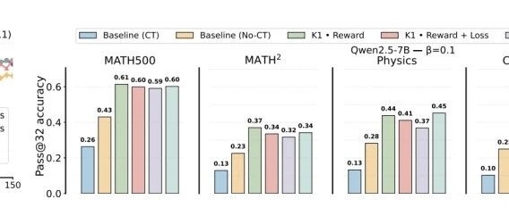

# Untitled Page

原文链接: https://mp.weixin.qq.com/s/k4GGCC7ls2PMFftiJH3jQQ



# 别再把KL散度加进loss了！Bengio团队实证：回归Reward才是无偏正解

[数据派THU](javascript:void(0);)


在小说阅读器中沉浸阅读

以下文章来源于PaperWeekly
，作者让你更懂AI的

[

**PaperWeekly**
.

PaperWeekly是一个推荐、解读、讨论和报道人工智能前沿论文成果的学术平台，致力于让国内外优秀科研工作得到更为广泛的传播和认可。社区：http://paperweek.ly | 微博：@PaperWeekly](#)


```

本文约2300字，建议阅读5分钟

## 全网都在卷 RLVR，但 Bengio 团队刚泼了盆冷水。

```

DeepSeek-R1 的爆火让 RLVR 成为当下大模型后训练的绝对主流。

无论是 PPO 还是近期大热的 GRPO，核心逻辑都是一致的：在最大化 Reward 的同时，利用 KL 散度约束策略模型  不偏离参考模型 。

这个逻辑听起来天经地义，但在工程落地时，我们往往面临一个极其隐蔽的选择。这个 KL 惩罚项，到底是应该减在 reward 里，还是直接加在 loss 里？

绝大多数开源库（如 VeRL, OpenRLHF, SkyRL）为了实现方便，默认将特定的估算器（如 K3）直接置于 Loss 中。

然而，Mila 实验室（Bengio 团队）的最新研究《A Comedy of Estimators》给这种约定俗成的做法泼了一盆冷水。

这项研究指出目前主流的 KL 实现方式，在数学上其梯度估计是有偏的（Biased）。这种偏差不仅会导致训练不稳定，更严重的是会损害模型的泛化能力。

而修复方案出奇简单，返璞归真地将 KL 移回 Reward 并使用朴素 K1 估算器，就能在域外任务（OOD）上带来近 20% 的性能提升。

本文将剥开繁复的代码实现，从数学本质出发，带你避开这个 LLM RL 训练中的梯度陷阱。


论文标题：A Comedy of Estimators: On KL Regularization in RL Training of LLMs

论文链接：https://arxiv.org/pdf/2512.21852

01 KL散度的计算困境

在 RLVR 的标准设定下，我们的优化目标非常明确。既要最大化奖励 ，又要约束策略模型  不偏离参考模型 。

这通常通过在目标函数中加入反向 KL 散度 (Reverse KL Divergence) 来实现：


其中  是正则化系数。但在实际操作中，面对高维序列空间，我们无法直接计算 ，只能通过采样估算。这里涉及到两个核心变量：

1. 估算器 (Estimator)：是用朴素的 Log-ratio（称为 K1），还是用 PPO/GRPO 中常用的低方差近似项（称为 K3，由 Schulman 提出）？

2. 位置 (Placement)：是作为惩罚项从 Reward 中扣除 (In-Reward)，还是作为正则项直接加入 Loss 函数 (In-Loss) ？

目前的行业现状是：为了工程实现方便或沿袭惯例，绝大多数开源库（如 VeRL, SkyRL 等）默认选择 K3 in Loss。但 Bengio 团队告诉我们：这可能是个错误的决定。

02 被忽视的梯度偏差

判断一种实现方式是否正确，唯一的标准是看它的梯度是否与真实梯度 (True Gradient) 一致。

对于序列级反向 KL 散度，其真实梯度的数学形式如下 ：


论文对四种常见的“估算器+位置”组合进行了详尽的梯度推导，结果与直觉截然相反。


〓 表1. 不同估算器配置的梯度偏差与训练行为总结。

注意 K3 in Loss 虽然稳定但有偏，只有 K1 in Reward 兼顾了无偏与稳定。

最反直觉的点在于 K3 in Loss（主流方案）虽然工程上表现稳定，但其梯度在数学上是有偏的 (Biased) 。而 K1 in Reward，虽然看起来最原始，却是唯一既无偏又稳定的最优解。

03 为什么K3 in Loss是错的？

当我们把 K3 放入 Loss 直接进行反向传播时，推导出的梯度期望包含了一个错误的系数项：


论文明确指出（Eq 41），这个梯度形式实际上是在优化前向 KL 散度：


这导致模型倾向于去覆盖参考模型的分布（Mode-covering），而非我们期望的寻找高奖励模式（Mode-seeking）。

为了直观展示这种偏差，作者构建了一个极简参数化模型（Toy Model）进行验证。


〓 图2. 极简自回归模型下各估算器的梯度偏差（左）与方差（右）。K1 in Reward（点线）的偏差接近于 0，而 K3 in Loss（虚线）存在显著的偏差。

04 实验结果

理论上的偏差真的会影响 LLM 的推理能力吗？作者在 Qwen2.5-7B 和 Llama-3.1-8B 上进行了大规模的 MATH 数据集微调实验。

1. 训练稳定性：避坑K3 in Reward

首先，千万不要尝试 K3 in Reward。实验表明，这种配置会引入巨大的梯度方差，导致模型训练瞬间崩溃。

****

〓 图3. 如图所示，K3 in Reward 会导致 Pass@1 准确率直接跌零。

2. 泛化能力：K1 in Reward的降维打击

这是本研究最核心的发现。作者对比了 K3 in Loss（有偏，主流方案）和 K1 in Reward（无偏，推荐方案）在域内（MATH）和域外（Physics, Chemistry, Biology）任务上的表现。


〓 图4. Qwen2.5-7B 在不同 KL 配置下的性能对比。浅绿色 (K1 in Reward) 代表无偏方案，灰色 (K3 in Loss) 代表主流有偏方案。

数据极其惊人，K1 in Reward 在所有任务上均优于或持平于 K3 in Loss。特别是在 OOD 任务上，优势呈现碾压之势。

例如在 Physics 任务上（），K1 in Reward 达到了 0.508 的准确率，而 K3 in Loss 仅为 0.429。平均而言，无偏估计在 OOD 任务上带来了约 19% 的相对提升。

这意味着无偏的梯度估计能让模型学到更本质的推理逻辑，而不是仅仅死记硬背训练集的分布。

3. 异步训练下的鲁棒性

工业界（如 DeepSeek）通常使用异步架构（Asynchronous RL）来提升训练效率，这会引入 Off-policy 滞后。


〓 图5. 高并发异步设置 (Async Level=10) 下的训练曲线。

在 Dr. GRPO 架构下，K1 in Reward（灰色线）依然稳健，而其他配置（如 No KL 或 K1 in Loss）迅速崩盘。

实验证明，在 Dr. GRPO 等异步架构下，K1 in Reward 依然是防止模型崩坏的鲁棒性保障。

05 为什么无偏这么重要？

为了彻底证实梯度无偏性是性能提升的根本原因，作者做了一个精妙的控制变量实验。

如果你费劲地把 K3 同时加入 Reward 和 Loss 以凑出无偏梯度，效果会怎样？

****

〓 图6. 一旦梯度被修正为无偏（右侧柱状图），K3 的表现立刻追平了 K1。

**这说明估算器叫什么不重要，重要的是数学上的 Unbiased。**

**进一步的熵分析显示，K3 in Loss 的行为更像是一种 Forward KL 正则化，它倾向于让模型“覆盖”参考模型的分布（Mode-covering）。**

**而 K1 in Reward 则表现出 Reverse KL 应有的 Mode-seeking 特性，允许模型在保持低熵（更自信）的同时探索高奖励区域。**

****

〓 图7. 熵 (Entropy) 与前向 KL 分析。K1 in Reward (深色线) 保持了更低的熵，体现了 Mode-seeking 特性。

结语

这篇论文给火热的 RLVR 泼了一盆必要的冷水，提醒我们在追求算力堆砌的同时，不要忽视数学本源的严谨性。

对于正在使用 VeRL 或 OpenRLHF 等框架的一线从业者，建议参考以下配置表进行修改，以获得“免费”的性能提升。


〓 表2. 针对 VeRL 和 OpenRLHF 的代码配置修正指南。核心是将 KL 估算器类型设为 "k1" 并开启 "use\_kl\_in\_reward"。

一句话总结：别再盲目信任默认配置了。把 KL 惩罚项从 loss 移回 reward，用最简单的 K1 估算器，你可能会发现你的模型比你想象的更聪明。

编辑：文婧

**关于我们**

数据派THU作为数据科学类公众号，背靠清华大学大数据研究中心，分享前沿数据科学与大数据技术创新研究动态、持续传播数据科学知识，努力建设数据人才聚集平台、打造中国大数据最强集团军。

****

**新浪微博：@数据派THU**

**微信视频号：**数据派THU****

**今日头条：****数据派THU******

预览时标签不可点

[阅读原文](javascript:;)


微信扫一扫
关注该公众号

继续滑动看下一个