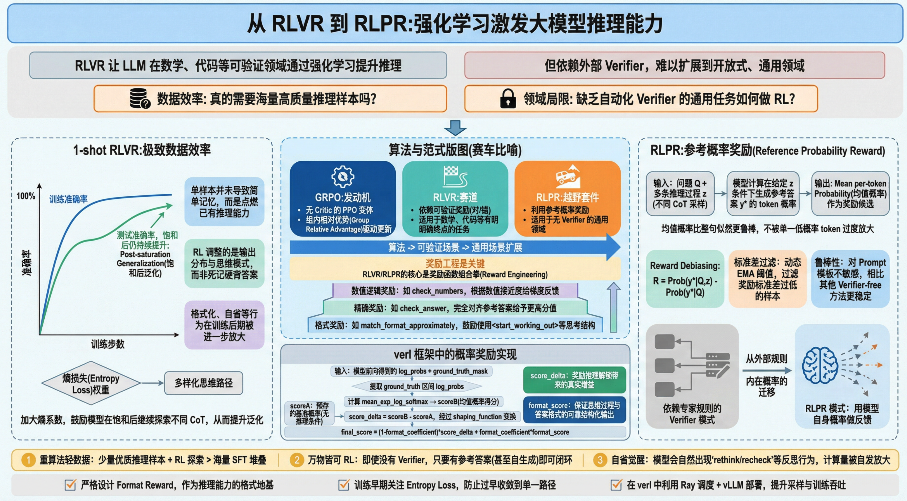
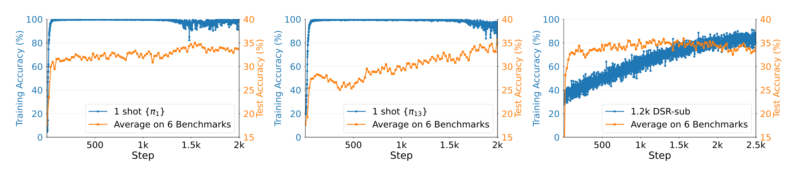
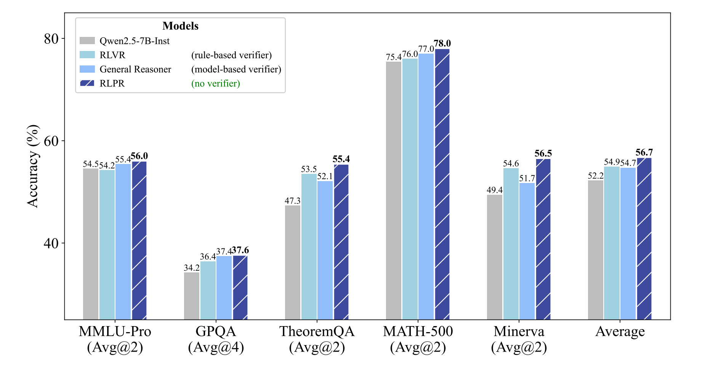
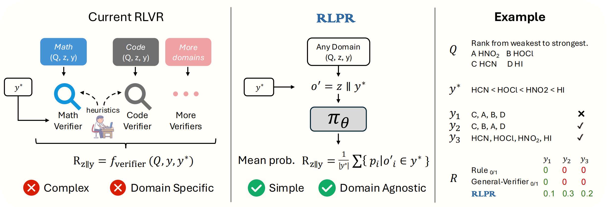
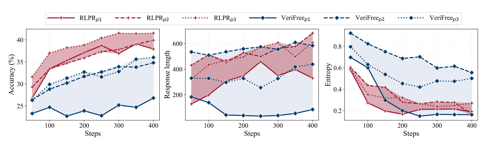
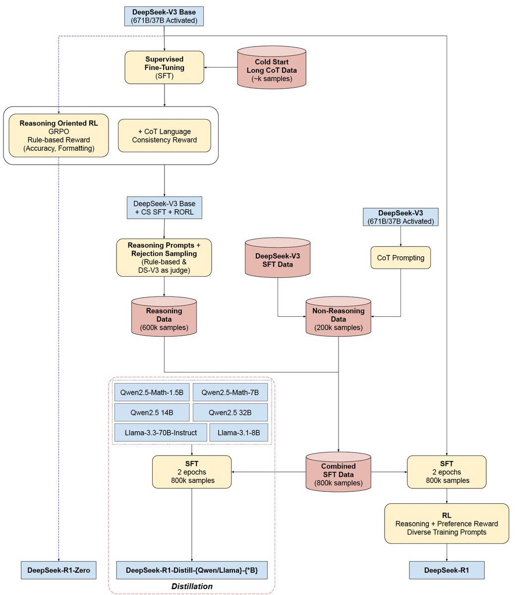

# 从 RLVR 到 RLPR：深度强化学习如何引爆 LLM 的推理潜能？

> 强化学习已成为 LLM 推理进化的核心引擎。然而，传统 RLVR 往往困于数学、代码等“自带验证器”的封闭领域。本文将深度解析如何从 1-shot RLVR 的数据极致利用，演进到 RLPR 借“模型内在概率”打破验证器枷锁的新范式，并结合 `verl` 框架拆解其工程落地细节。

## 1. 背景：RLVR 的崛起与“验证器”瓶颈

强化学习在 LLM 推理能力的进化中扮演了核心角色（如 OpenAI o1, DeepSeek-R1）。核心逻辑在于：通过 **RLVR（可验证奖励强化学习）**，模型在海量采样中探索不同的思维链（CoT），并根据最终结果的正确性获得奖励。

然而，RLVR 的大规模应用面临两个核心痛点：
1. **数据效率之谜**：我们真的需要成千上万的高质量推理样本吗？
2. **领域的局限性**：在非数学、非代码的通用领域（如创意写作、常识推理），缺乏自动化的正确性校验器（Verifier），RL 难以展开。

近期，两项重量级研究——**1-shot RLVR** 与 **RLPR**，分别在数据效率和通用化方向给出了极具启发性的答案。

## 2. 核心版图：从算法到范式的立体透视

在深入细节前，我们需要厘清 **GRPO、RLVR 与 RLPR** 三者之间的逻辑层级。如果把 LLM 的进化比作一辆赛车的调校：


*   **GRPO (Group Relative Policy Optimization) 是“发动机”**：它是一种底层的优化算法（PPO 的高效变体）。通过移除 Critic 模型并引入组内相对优势（Group Relative Advantage），它为模型更新提供了动力。
*   **RLVR (Reinforcement Learning with Verifiable Rewards) 是“赛道”**：它定义了一种训练范式，即“用客观对错作为导航”。在数学和代码这些有明确终点的赛道上，RLVR 表现极佳。
*   **RLPR (Reinforcement Learning with Reference Probability Reward) 是“越野套件”**：它是 RLVR 范式的演进。当赛道延伸到没有明确路标的“通用领域”时，RLPR 借用模型自身的“概率直觉”作为反馈，让 RL 依然能够奔驰。

### 2.1 工程视角：Unsloth 中的 GRPO 实操
从 `unsloth` 提供的 [`Qwen3-4B-GRPO`](https://github.com/unslothai/notebooks/blob/main/nb/Qwen3_(4B)-GRPO.ipynb) 实践中，我们可以看到这种范式的落地形态。工程上，RLVR/RLPR 的核心在于**奖励函数的组合拳**。

为了让“发动机”（GRPO）更平稳地启动，开发者通常不会只给一个生硬的“对错”分数，而是采用阶梯式奖励：
1.  **格式奖励（Soft Reward）**：如 `match_format_approximately`，即便答案错了，只要模型学会了用 `<start_working_out>` 思考，就给点“辛苦分”。
2.  **精确奖励（Hard Reward）**：如 `check_answer`，完全对齐参考答案给予重奖（如 5.0 分）。
3.  **数值逻辑奖励**：如 `check_numbers`，甚至根据数值的接近程度（Ratio）给出梯度奖励，缓解强化学习初期的稀疏反馈问题。


## 3. **1-Shot** RLVR：哪怕只有一条数据，也能引爆推理

华盛顿大学与微软的研究发现，**RLVR 具有惊人的数据效率**。仅仅使用 **1 个训练样本** 进行 1-shot RLVR，就能显著提升模型的基准测试表现。

### 核心观察：饱和后的持续进化（Post-saturation Generalization）
传统认知中，单样本训练会导致极速过拟合。但在 RLVR 实验中，研究者观察到了一个神奇的现象：
* **现象**：训练准确率在不到 100 步内就达到 100%（饱和），但模型的**测试集准确率却在饱和后持续攀升**，并能维持数千步不降。
* **直觉解释**：RL 并不是在“记住”答案，而是在利用唯一的样本作为“火种”，激发模型内部已有的推理逻辑，并优化其输出分布（如奖励格式化、自省行为）。


*图 1：1-shot RLVR 的“饱和后泛化”现象，训练准确率虽早早封顶，测试性能依然在优化。*

### 关键 Trick：探索与熵
实验表明，**策略梯度损失**起主要贡献作用，而**熵损失**则是维持泛化的关键。在已有 **策略梯度损失 + weight decay + KL散度** 的基础上加入熵项，带来 **MATH500 +4.0%**、**AIME24 +2.5%** 的额外提升；但熵系数过大会更不稳定。**无熵项**时，模型在训练准确率饱和后（约 step 150）测试提升有限；加入熵项后平均 **+2.3%**，进一步把 rollout temperature 提到 $t=1.0$ 还能再带来 **+0.8%** 的增益。

从数学上看，这对应于“策略梯度项 + 熵正则项”的分工。设策略为 $\pi_\theta$，最大化期望回报：

$$
J(\theta)=\mathbb{E}_{\tau\sim \pi_\theta}\Big[\sum_t r_t\Big]
$$

策略梯度定理给出梯度（用优势函数 $A_t$ 表示）：

$$
\nabla_\theta J(\theta)=\mathbb{E}_{\tau\sim\pi_\theta}\Big[\sum_t \nabla_\theta \log \pi_\theta(a_t\mid s_t)\, A_t\Big]
$$

这里的优势函数 $A_t$ 可以先把它理解成“**这一步的选择到底比平时划算多少**”。类比一下：同样在状态 $s_t$ 下，你脑子里对“正常水平能拿到多少分/收益”有个预期（这就是基线 $V(s_t)$）。如果你这次采取的动作 $a_t$ 最终带来的回报比这个预期更好，那么 $A_t>0$，策略梯度就会把“下次再这么做”的概率推高；反之如果比预期更差，$A_t<0$，就会把概率压低。用“相对预期的增量”（而不是直接用总回报）还有个工程上的好处：把共同的、与动作无关的波动当作基线扣掉，**显著降低梯度估计的方差**，训练会更稳。

**RLVR/RLPR 是“奖励怎么定义”的训练范式；GRPO 是“用这些奖励怎么更新参数”的优化算法**。在 LLM 里我们通常把“一次完整生成的推理轨迹（含答案）”视为一条轨迹 $z$，每个 prompt $Q$ 会采样一组（group）轨迹 $\{z_i\}_{i=1}^K$ 并得到对应奖励 $\{r_i\}$。GRPO 的关键就是用**组内相对优势**当作 $A$（天然零均值、无需单独训练 Critic）：

$$
A_i = r_i - \frac{1}{K}\sum_{j=1}^K r_j
$$

这个形式的直观理解是：**不问“这条样本绝对有多好”，只问“在同一组候选里它比平均水平好多少”**。你可以把一次 group 采样想成“同一道题 $Q$，同时让模型交 $K$ 份解题草稿”，$r_i$ 是每份草稿的得分。直接用 $r_i$ 会带来两个麻烦：(1) 不同题目的难度/奖励尺度不同，绝对分数不可比；(2) 奖励会整体平移（加个常数）但并不改变“哪份更好”，却会让梯度估计抖得更厉害。减去组均值后：
- **只保留排序信息**：谁高于平均就被增强，谁低于平均就被抑制；
- **天然零均值（baseline）**：相当于自动做了一个强基线，显著降方差，让更新更稳；
- **跨题目更可比**：不同 $Q$ 的“绝对难度”被均值吸收，留下更可学习的“相对偏好信号”。

然后用 PPO/GRPO 常见的“比率 + 优势”形式去更新策略，并叠加前文提到的 **KL、熵、weight decay** 等正则项来稳住训练。直观上就是：**同一组里得分更高的样本被鼓励“更常生成”，得分更低的样本被压下去**。

至于 **KL散度惩罚 / 熵正则 / WD** 三者关系：它们都是“让 GRPO 更新别走偏”的不同正则，解决的风险点不一样、互补而非替代——
- **KL散度惩罚**：约束当前策略别离参考策略/旧策略太远，防止一步更新把分布推崩（过度漂移）。
- **熵正则**：鼓励输出分布保持一定随机性，防止策略过早坍塌到单一模板，维持探索与多样性（尤其对后期泛化/数据多样性很关键）。
- **WD（Weight Decay）**：纯参数层面的 L2 正则，偏“防过拟合/控参数范数”，不直接关心输出分布，但能改善训练数值稳定性与泛化。

加入熵奖励（实现上常等价为在 loss 中加入 entropy loss），得到最大熵目标：

$$
J_\beta(\theta)=\mathbb{E}_{\tau\sim \pi_\theta}\Big[\sum_t r_t\Big]+\beta\cdot \mathbb{E}_{s_t\sim d^{\pi_\theta}}\big[H(\pi_\theta(\cdot\mid s_t))\big]
$$

其梯度自然分解为：

$$
\nabla_\theta J_\beta(\theta)=
\mathbb{E}\Big[\sum_t \nabla_\theta \log \pi_\theta(a_t\mid s_t)\, A_t\Big]
\beta\cdot \nabla_\theta \mathbb{E}\big[H(\pi_\theta(\cdot\mid s_t))\big]
$$

直观上，
- 第一项（策略梯度）负责“把更高奖励的推理轨迹/输出模式的概率推上去”，因此构成性能提升的主要驱动力；而在 1-shot 场景中，当训练准确率很快饱和后，若缺少探索压力，策略分布更容易坍塌到少数高概率模式并在训练样本上逐步风格化过拟合。
- 第二项（熵正则）鼓励输出多样性、延缓分布坍塌，从而更容易继续发现对测试题也有效的推理模式——这与论文里“熵项/更高温度提升 post-saturation generalization”的结果一致。


## 3. RLPR：摆脱验证器，迈向通用领域

既然数据不是瓶颈，那么“如何给奖励”就成了唯一的障碍。面壁智能提出的 **RLPR** 框架，通过引入 **参考概率奖励（Reference Probability Reward）**，在“**有参考答案**”这一前提下，为通用领域提供了一个可规模化的、无需外部验证器（verifier-free）的训练信号。

从数学原理上看，RLPR 想优化的不是“判断对错”，而是“**一条推理过程 $z$ 是否真的让正确答案 $y^*$ 变得更容易生成**”。把问题记为 $Q$，推理轨迹/思维链记为 $z\sim \pi_\theta(\cdot\mid Q)$，并用一个固定的参考模型（或当前模型的某个冻结副本）给出条件概率 $p_{\text{ref}}(\cdot)$。一个最自然的奖励写法是**对数概率增益**：

$$
R(Q,z)=\log p_{\text{ref}}(y^*\mid Q,z)-\log p_{\text{ref}}(y^*\mid Q)
$$

注意这正对应你后面写的“Reward Debiasing”：第二项是一个只依赖 \(Q\) 的基线（baseline），用来扣掉“题目本身就容易”的偏置。把这个奖励代入策略优化目标（以 REINFORCE/GRPO 这类策略梯度为例）：

$$
J(\theta)=\mathbb{E}_{z\sim \pi_\theta(\cdot\mid Q)}[R(Q,z)]
$$

对应到工程实现里（GRPO），就是：对每个 $Q$ 采样一组 $\{z_i\}$，用 RLPR 的 $R(Q,z_i)$ 作为该组的奖励，再做组内归一/相对优势（例如减去组均值）得到 $A_i$，最后用 GRPO 的 policy loss 去更新 $\pi_\theta$。因此你可以把它记成一句话：**RLPR 负责“把一条推理 $z$ 打几分”，GRPO 负责“用这堆分数把策略往高分方向推”**；而 RLVR 只是把这个“打分函数”换成了外部可验证的对错/格式规则。

则策略梯度更新会倾向于提高那些能让 $\log p_{\text{ref}}(y^*\mid Q,z)$ 上升的 $z$ 的概率——也就是偏好“能解释并支持正确答案”的推理过程。

更进一步，如果把 $p_{\text{ref}}$ 当作对真实分布的近似，那么上面的期望其实是在最大化一种“信息增益/条件互信息”的代理目标：对真实分布而言，

$$
\mathbb{E}_{z}\big[\log p(y^*\mid Q,z)-\log p(y^*\mid Q)\big]
= I(y^*;z\mid Q)\ge 0
$$

也就是说，好的推理 $z$ 应该为正确答案 $y^*$ 提供信息，使其在条件分布下更“可预测”。这解释了 RLPR 为什么在数学上能绕开显式 verifier：它把“推理是否有用”转化成“推理是否提升了正确答案的可预测性”。

当然，这里仍有边界条件：它依赖“参考答案 $y^*$ 的存在与质量”，也依赖参考模型概率的可靠性（校准/偏置/表达方式差异会影响奖励），因此更准确的表述是“**把 verifier 的角色从外部规则，迁移成模型内在概率的可微分反馈**”，而不是对所有开放域都绝对彻底。

### 核心原理：内在概率即奖励
RLPR 的核心洞察是：**模型生成正确答案的内在概率，直接反映了其对当前推理路径（CoT）质量的评价**。


*图 2：RLPR 在通用领域与数学领域的综合表现。相比传统的验证器方法，RLPR 在自由格式回答上展现出更强的竞争力。*

* **计算方式**：将生成的推理过程 $z$ 拼接上参考答案 $y^*$，计算模型在 $z$ 的条件下生成 $y^*$ 的平均 token 概率（Mean per-token Probability）。
* **为什么比 Likelihood 好？**：传统的 Sequence Likelihood（乘积）对单个低概率 token 过于敏感，而 Mean Probability（均值）更具鲁棒性，能容忍自然语言中的近义词表达。


*图 3：RLPR 架构对比。左侧为传统 Verifier 模式（依赖领域专家规则），右侧为 RLPR 模式（利用模型自身概率作为反馈）。*

### 工程优化：去偏（Debiasing）与动态过滤
直接使用概率作为奖励会引入偏置（例如某些问题本身就很简单，概率天然高）。RLPR 引入了三个关键工程手段：
1. **Reward Debiasing**：计算 $R = \text{Prob}(y^* | Q, z) - \text{Prob}(y^* | Q)$。即只奖励那些因为有了推理 $z$ 而提升的概率，减去问题本身的基准概率。
2. **Standard Deviation Filtering**：采用动态阈值过滤掉那些奖励标准差过低的样本。如果一个样本的所有采样奖励都差不多（太简单或太难），它无法提供有效的梯度信息，通过 EMA 动态调整过滤阈值可显著稳定训练。
3. **鲁棒性（Robustness）**：相比 VeriFree 等方法，RLPR 对训练 Prompt 模板的敏感度更低，表现出更强的工程落地稳健性。


*图 4：RLPR 的稳定性分析。在不同 Prompt 模板下，RLPR 均能维持一致的性能表现，优于同类 Verifier-free 方法。*


### 4. 关联：RLVR / RLPR 与模型蒸馏（把 RL 训练变成“数据资产”）
很多人会把“强化学习（RLVR/RLPR）”与“模型蒸馏”当成两条不相干的路线：前者是训练方法，后者是部署策略。但在推理模型的工程落地里，它们往往是**同一条流水线上的上下游**：**RL 负责把“会推理的老师”训练出来，同时顺手产出海量高质量推理轨迹；蒸馏负责把这些轨迹变成可复用的数据集，喂给更小、更便宜的学生模型**。

对照 Easy Dataset 的《蒸馏数据集》文档（详细看参考链接【6】），蒸馏的关键并不只是“老师给答案”，而是把老师的**过程性信息**（推理步骤/风格/偏好，甚至 token 级概率这种“软答案”）提取成训练数据；同时数据集要满足**覆盖任务场景**与**多样性/平衡性**，否则蒸馏后会掉泛化。

这也解释了 RLVR/RLPR 为什么天然适合做“蒸馏数据工厂”：
- **RLVR -> 可靠的“硬筛选”推理数据**：在有外部 verifier 的任务（数学、代码）里，RLVR 能用“最终答案对/错、格式对齐”等规则奖励强约束模型，并在训练中反复采样多条 CoT。最终你不仅得到一个更强的老师，还能拿到大量“**有最终正确性背书**”的推理轨迹，天然适合构造 reasoning data。
- **RLPR -> 无 verifier 场景的“软评估/软过滤”**：在开放域里你没法写规则判断对错，但如果你有参考答案 $y^*$，RLPR 用 $\log p_{\text{ref}}(y^*|Q,z)-\log p_{\text{ref}}(y^*|Q)$ 这类“信息增益”式奖励去衡量一条推理 $z$ 是否真的“让正确答案更站得住”。把它当作**打分器/过滤器**，就能在没有显式 verifier 的前提下，对多条候选 CoT 做排序与筛选，用来构造更干净的蒸馏数据集（尤其适合解释性问答、开放域推理等）。
- **熵/温度 -> 蒸馏所需的多样性**：前面 1-shot RLVR 里我们看到熵项/更高采样温度会提升“饱和后泛化”，在数据层面也可理解为：它帮助你产出**更多样化但仍高质量**的推理轨迹，降低蒸馏数据“同质化模板”的风险。

下面这张流程图把“RL -> 数据 -> 蒸馏 -> 再对齐”的闭环画得很直观：先用 SFT + 面向推理的 RL（GRPO，规则奖励/格式奖励/一致性奖励等）把老师模型做强，再用老师生成大规模 reasoning / non-reasoning 数据，组合成 SFT 数据去蒸馏多个更小的底座，最终再叠加偏好/推理奖励做进一步对齐：


*图 5：一个典型的“推理 RL 与蒸馏联动”的工程流水线示意（DeepSeek-R1 系列）。*

一句话把三者串起来：**RLVR/RLPR 决定“怎么把推理学出来”，蒸馏决定“怎么把推理带下去”**——前者产出能力与数据，后者把能力压缩成可部署的模型族群。

## 5. `verl` 框架下的工程实现

在 `verl` 这一高性能分布式 RL 框架中，RLPR 的核心逻辑实现在 `ProbRewardManager` 类中。以下是关键代码实现思路：

### 5.1 概率奖励计算
不同于传统的 `compute_score` 返回 0 或 1，`ProbRewardManager` 通过模型前向传播获取参考答案 token 的 log-probs：

```python
# verl/workers/reward_manager/prob.py 核心逻辑简化
def compute_scoreB(self, old_log_probs, ground_truth_mask):
    # 提取 ground_truth 部分的 log_probs
    old_log_probs_in_gt = old_log_probs[ground_truth_mask.bool()]
    
    # 将 log_probs 转换为概率并求均值 (Mean Prob)
    if self.compute_score_name == 'mean_exp_log_softmax':
        scoreB = torch.mean(torch.exp(old_log_probs_in_gt)).item()
    return scoreB
```

### 5.2 奖励去偏与格式约束
为了确保推理质量，代码中通常会将概率提升量（$\Delta \text{score}$）与格式奖励（Format Reward）结合：

```python
# 计算 score_delta = 采样奖励 - 基准奖励 (scoreA 为预存的基准概率)
score_delta = scoreB - scoreA
score_delta = self.shaping_function(score_delta)

# 结合格式分数 (R1 格式要求包含 <think> 和 <answer> 标签)
format_score = format_reward(predict_str=predict_str, format_mode=self.format_mode)
final_score = (1 - self.format_coefficient) * score_delta + self.format_coefficient * format_score
```


## 6. 总结与启示：强化学习的“降维打击”

### 6.1. 概念强化
- **RLVR**：确实是用一个**外部、强约束、可自动判真伪的 Verifier**（例如答案对/错、单测通过）来给奖励；奖励信号来自“结果是否正确”，所以适合数学/代码这类有客观终点的任务。
- **RLPR**：不是“不验证”，而是把“验证器”换成了**参考模型的概率打分**（不需要你手写规则/分类器）。它用的是：给定问题 $Q$ 和推理过程 $z$，看正确答案 $y^*$ 在参考模型下是否变得更“可预测”（概率是否上升，且用去偏项扣掉题目本身的容易程度）。  

所以它是在用“**推理是否提高了正确答案的条件概率**”来评估这条推理的有效性，从而产生可用的奖励信号。

一句话总结：**RLVR 用外部 verifier 验“结果对不对”；RLPR 用参考概率评“这条推理是否让正确答案更站得住”。**

### 6.2. 技术选型影响
1. **重算法轻数据**：不需要过分追求百万级的 SFT 数据，精心挑选的少量推理样本结合 RL 探索，往往能产生更强的泛化推理能力。
2. **万物皆可 RL**：RLPR 证明了即使没有 Verifier，只要有参考答案（甚至哪怕是模型自生成的），就能通过概率回传建立反馈闭环。
3. **自省能力的觉醒**：在训练后期，模型会自发产生更多的“rethink”、“recheck”行为，这种计算量的“自我压榨”是模型推理能力质变的标志。

### 6.3. 工程落地建议
* 优先保证 **Format Reward** 的严苛，它是推理能力的基石。
* 在训练初期，关注 **Entropy Loss**，防止模型过早陷入“思维定式”。
* 使用 `verl` 等框架时，利用其 **Ray 调度** 和 **vLLM 混合部署**，可大幅提升采样效率，让 RLVR 的快速迭代成为可能。


**参考文献**：
1. *Wang et al., "Reinforcement Learning for Reasoning in Large Language Models with One Training Example", 2025.*
2. *Yu et al., "RLPR: EXTRAPOLATING RLVR TO GENERAL DOMAINS WITHOUT VERIFIERS", 2025.*
3. *verl Project: https://github.com/volcengine/verl*
4. *Sutton et al., "Policy Gradient Methods for Reinforcement Learning with Function Approximation", NeurIPS 2000.*
5. *Haarnoja et al., "Soft Actor-Critic: Off-Policy Maximum Entropy Deep Reinforcement Learning with a Stochastic Actor", ICML 2018.*
6. https://docs.easy-dataset.com/jin-jie-shi-yong/images-and-media