# 蒸馏数据集 | Easy Dataset

原文链接: https://docs.easy-dataset.com/jin-jie-shi-yong/images-and-media

[Edit](https://github.com/ConardLi/easy-dataset-docs/blob/main/basics/images-and-media.md)

# 蒸馏数据集

数据蒸馏模块支持从大参数模型中零样本构造蒸馏数据集，然后用于微调小参数模型。

### **什么是模型蒸馏？**

想象有一位“大教授”（大模型），知识渊博但“脾气很大”：培养他需要巨额学费（训练成本高），请他讲课需要豪华教室（高算力硬件），每节课费用惊人（推理成本高）。而“小学生”（小模型）虽然乖巧轻便（低部署成本），但知识面有限。

**模型蒸馏**就是让大教授把解题思路 “浓缩” 成小抄，教给小学生的过程。

* 大教授不会直接说 “这道题选A”，而是给出一组概率分布（比如 A 选项 80% 可能，B 选项 20% 可能），这种“软答案”包含了他的思考逻辑。
* 小学生通过模仿大教授的思路，既能学到核心知识，又不用承担高额成本，就像用“解题思路小抄”快速掌握重点。

简单理解：从大模型中提取原始数据集、推理过程，再微调小模型。

### **为什么需要模型蒸馏？**

大模型虽强，但实际应用中面临两大难题：

1. **算力门槛高**：训练一个千亿参数模型需消耗数百万美元，普通企业和个人根本玩不起。
2. **部署困难**：大模型运行需要几十 GB 内存，普通个人设备根本“装不下”。

**蒸馏的核心价值**：个人和小型企业没有能力部署大参数模型，但可以从大模型蒸馏出特定领域的小模型来使用，在大幅降低部署成本的同时，也能够保持特定领域下的使用效果。

### **模型蒸馏的案例**

DeepSeek 推出的系列开源蒸馏模型：

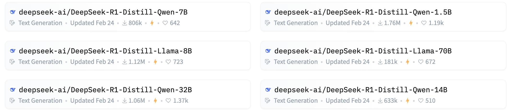

李飞飞团队的论文 《s1：Simple test- time scaling》 中提到：仅花费 50 美元，就训练出一个比肩 ChatGPT o1 和 DeepSeek R1 的模型，基于通义的开源模型 Qwen2.5-32B 进行的微调，而微调所用的数据集，其中一部分蒸馏自 Google Gemini 2.0 Flash Thinking。

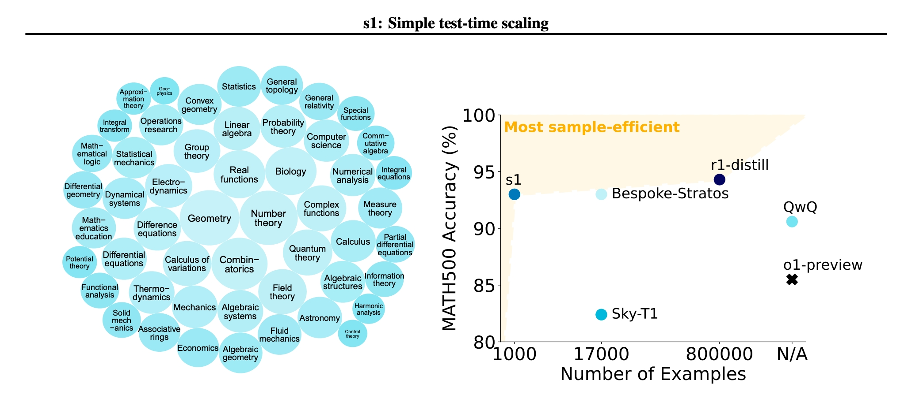

这个模型的诞生，是先通过知识蒸馏，从 Gemini API 获取推理轨迹和答案，辅助筛选出 1000 个高质量的数据样本。然后，再用这个数据集，对通义 Qwen2.5-32B 进行微调，最终得到性能表现不错的 s1 模型。

### **蒸馏 vs 微调 vs RAG**

**蒸馏**

小模型模仿大模型的解题思路

轻量化部署（手机、企业私有云）

**微调**

用特定数据给模型“补课”（如医疗数据）

垂直领域定制（如法律、医疗问答）

**RAG**

模型调用外部知识库“作弊”

企业文档检索（如内部培训资料）

### **蒸馏基本流程**

1. **准备“小抄”（软标签生成）**

   * 大教授先“做一遍题”：用原始数据（如“这部电影很棒”）输入大模型，生成概率分布。
2. **小学生“刷题”（模型训练）**

   * 小模型输入同样数据，输出自己的预测（如“正面85%，负面15%”），对比大教授的“小抄”计算差距（损失函数）。
   * 通过反复调整参数（反向传播），让小模型的答案越来越接近大教授的思路。
3. **结合“标准答案”（软硬标签结合）**

   * 小模型既要学大教授的思路（软标签），也要保证基础题正确率（硬标签，如“猫就是猫”），通过平衡系数（α）调节两者比重，避免“学偏”。

### 使用 Easy Dataset 构造蒸馏数据集

### Easy Dataset 可以解决什么问题？基于特定领域从大模型蒸馏数据集：比如我们想蒸馏出一个基于 DeepSeek R1 推理过程的中医小模型，就要先从 DeepSeek R1 中提取 “中医” 相关的领域数据集。

### 蒸馏数据集思路

在模型蒸馏过程中，数据集的构造是非常重要的，直接决定蒸馏模型的质量，需要如下要求：

* **覆盖任务场景**：数据集需与原始任务（如图像分类、自然语言处理等）的真实分布一致，确保教师模型和学生模型学习到的数据特征具有实际意义。
* **多样性与平衡性**：数据需包含足够的样本多样性（如不同类别、噪声水平、边缘情况等），避免因数据偏差导致蒸馏后的模型泛化能力不足。

为了满足这样的要求，我们在特定领域上肯定不能完全随机提取数据集，在 Easy Dataset 中的思路是：

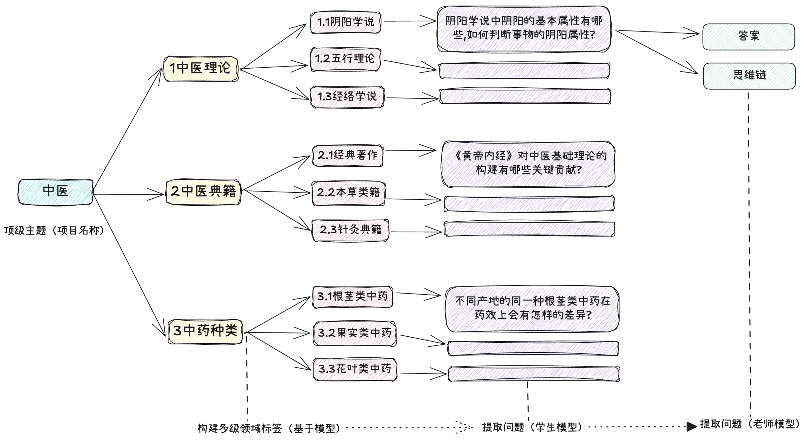

先通过顶级主题（默认使用项目名称），构造多级领域标签，从而构造完整的领域树，在基于 “学生模型” 从领域树的叶子结点提取问题，最终使用 “教师模型” 为问题逐个生成答案和思维过程。

在实际任务中，提取问题的 “学生模型” 和生成答案的 “教师模型” 也可以是同一个。

### 手动蒸馏数据集

我们创建一个体育与运动（Physical Education and Sports）的新项目：

在数据蒸馏任务中，将使用项目名称作为默认的顶级蒸馏主题，所以取好项目名称至关重要。

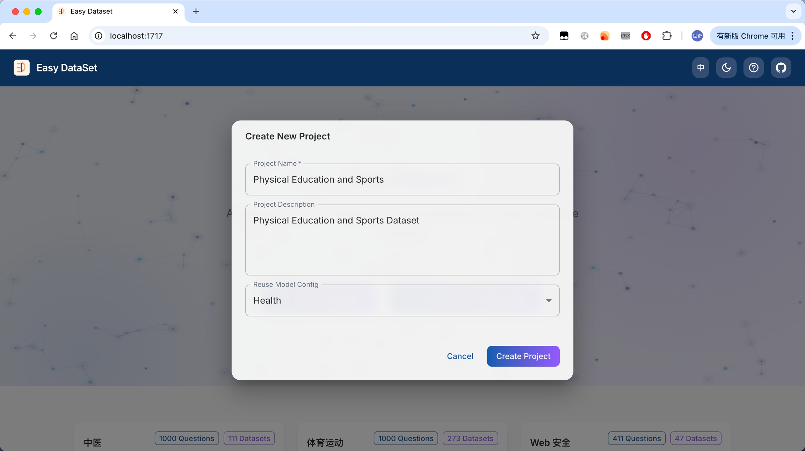

然后我们来到数据蒸馏模块，点击生成顶级标签：

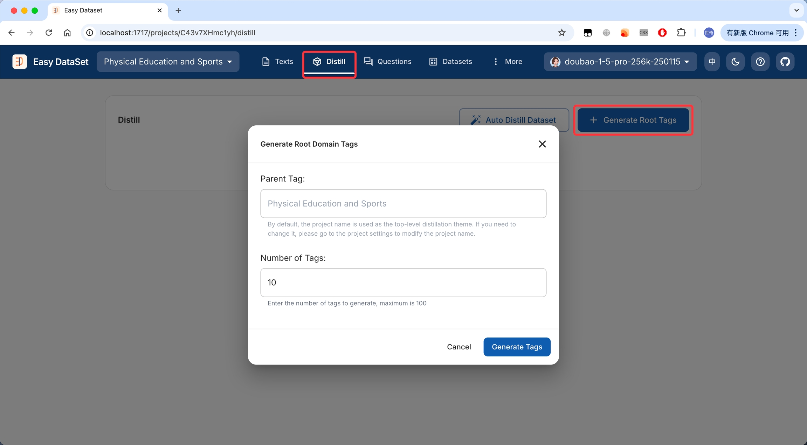

此操作可以我们从顶级主题（默认是项目名称）生成 N 个子主题（标签），数量可自定义输入，任务成功后，将在对话框生成标签预览：

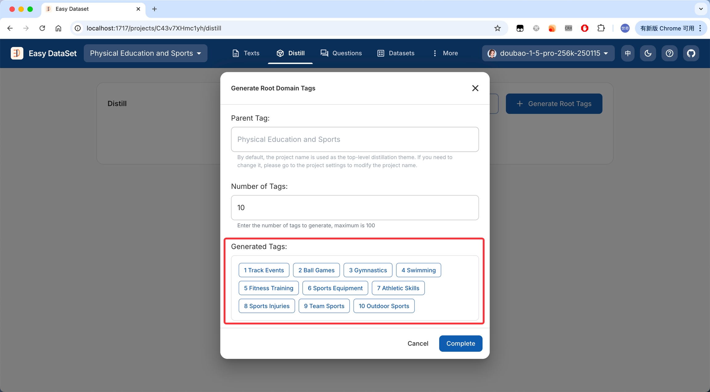

我们可以点击每个子主题上的添加子标签，可以继续生成多层子主题：

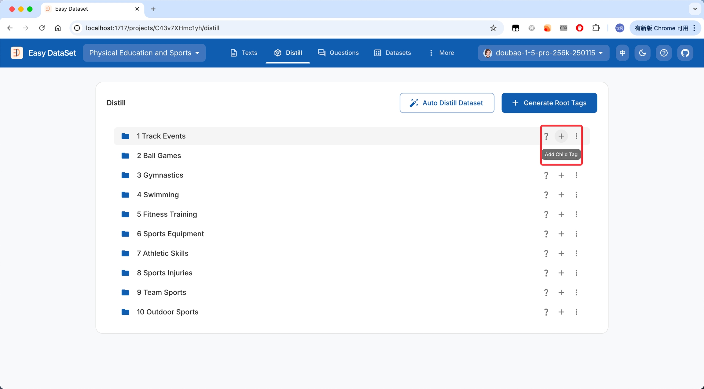

为了保证子主题生成的相关性，生成多层子主题将传入完整的标签路径：

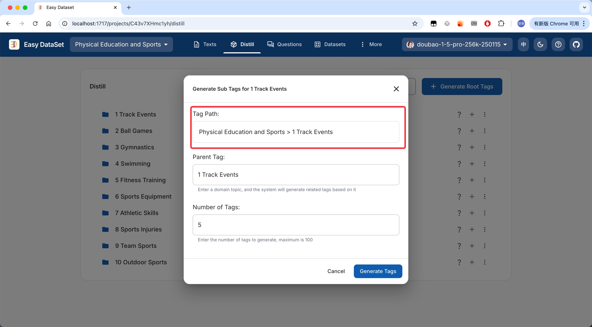

多级领域标签树构建完成后，可以开启从叶子标签上提取问题：

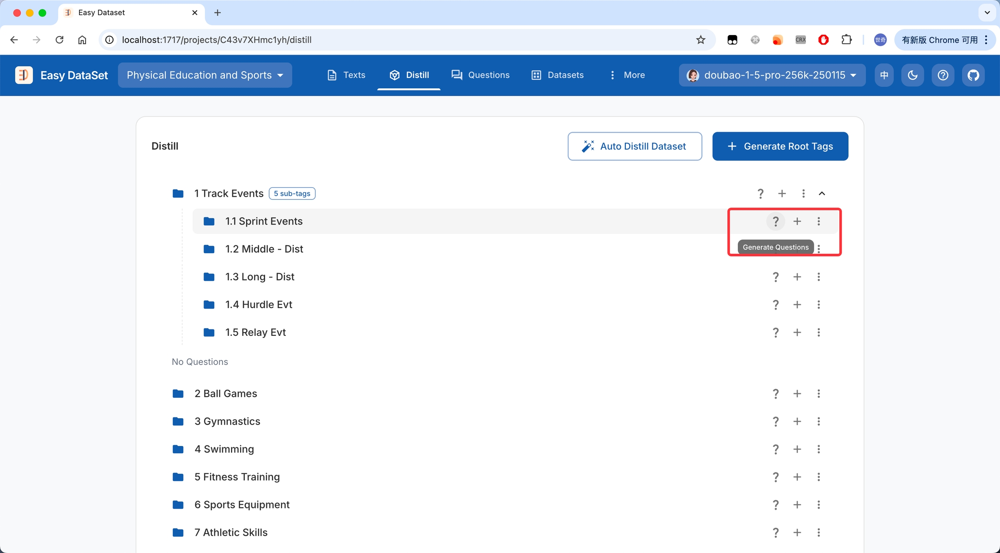

我们可以选择生成问题的数量，另外提取问题时也将传入完整领域标签路径：

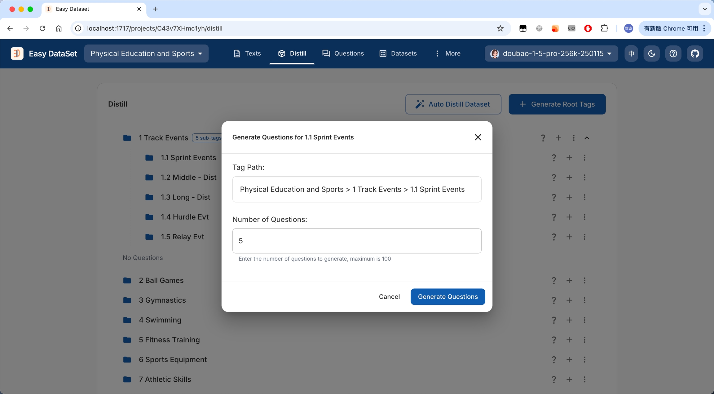

生成完成后，可以对问题进行预览：

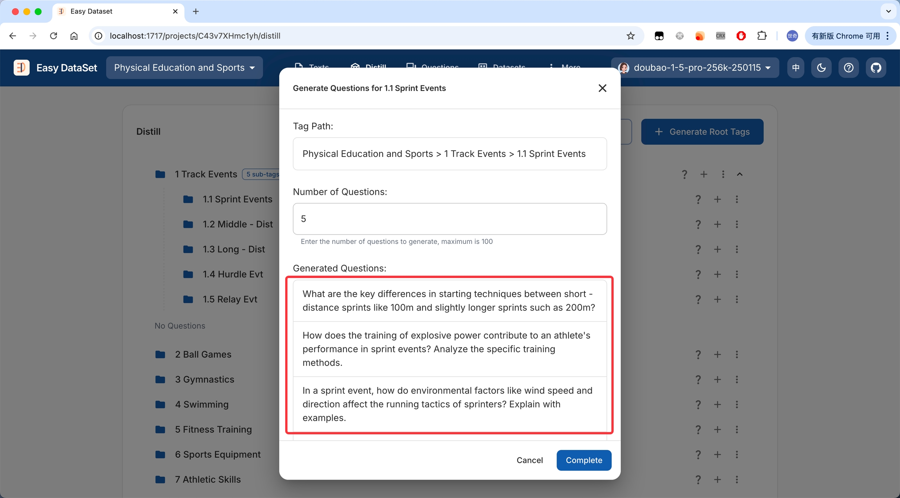

可以从领域树叶子结点上看到已生成的问题：

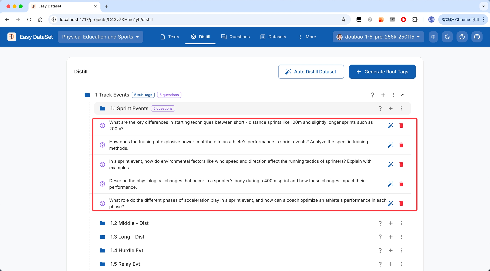

然后可以在每个问题上点击生成答案：

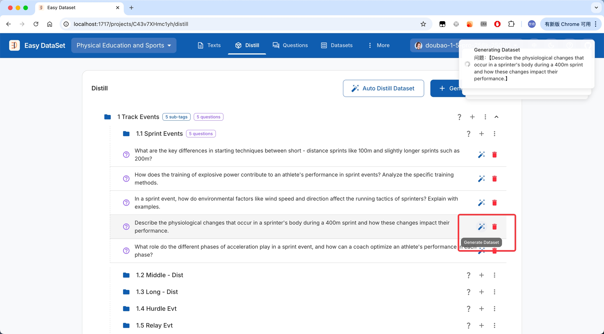

也可以到问题管理模块为已生成的问题批量生产答案（蒸馏出的问题由于未关联文本块，默认展示为 Distilled Content）：

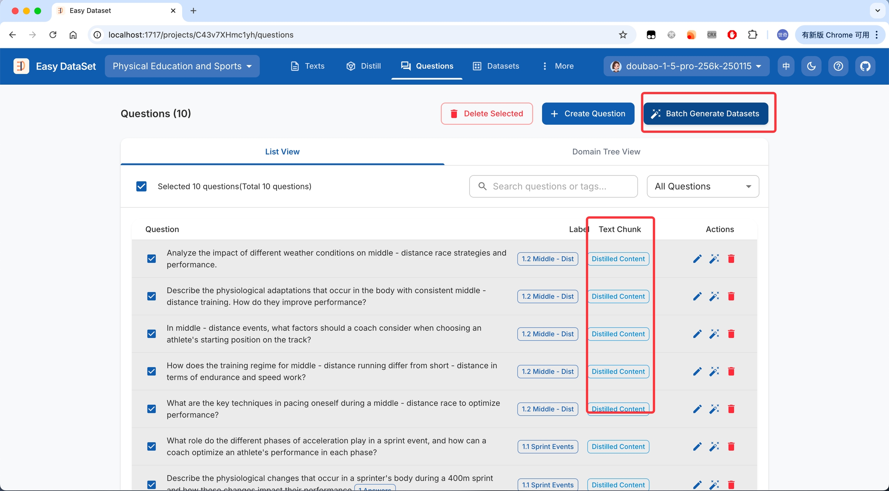

### 自动蒸馏数据集

如果你不需要精细化的控制以上的每一步，可以选择全自动蒸馏数据集：

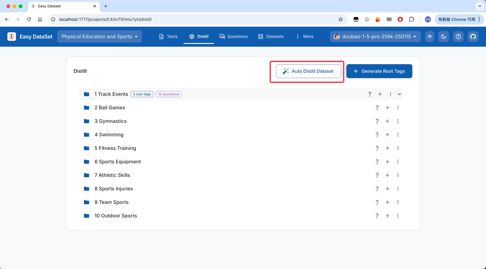

在配置框中，我们可以看到如下选项：

* 蒸馏主题（默认为项目名称）
* 生产领域树标签的层级（默认为两层）
* 每层生成的标签数量（默认为 10 个）
* 每个子标签生产的问题数量（默认为 10 个）

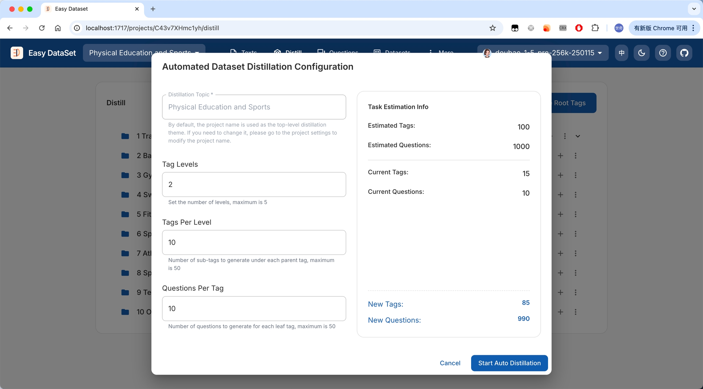

任务开始后，我们可以看到详细的任务进度，包括构建标签、问题、答案的具体进度：

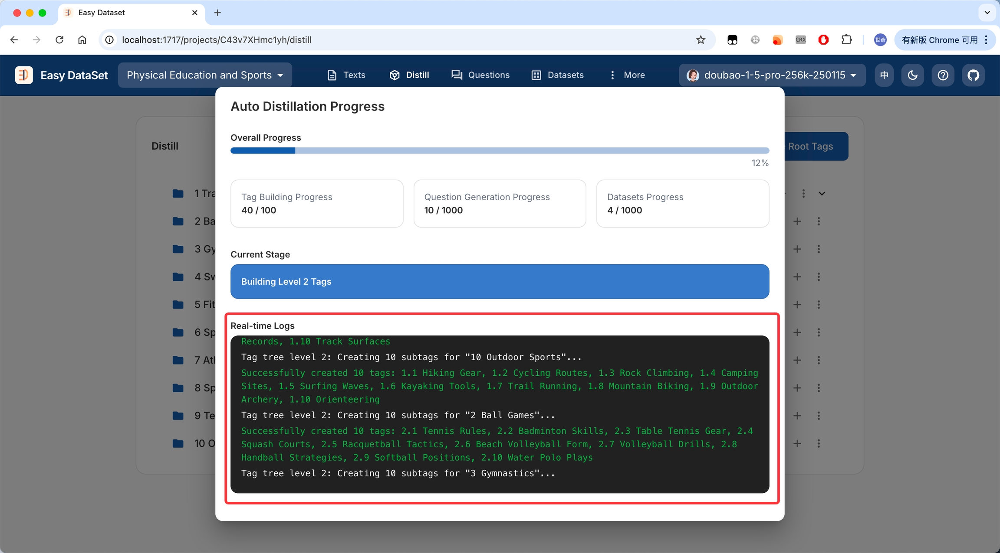

此处也会遵循：「项目设置 - 任务设置」 中最设置的大并发数限制。

[Previous自定义提示词](/jin-jie-shi-yong/markdown)[NextMGA 增强数据集](/jin-jie-shi-yong/mga-zeng-qiang-shu-ju-ji)

Last updated 7 months ago

Was this helpful?