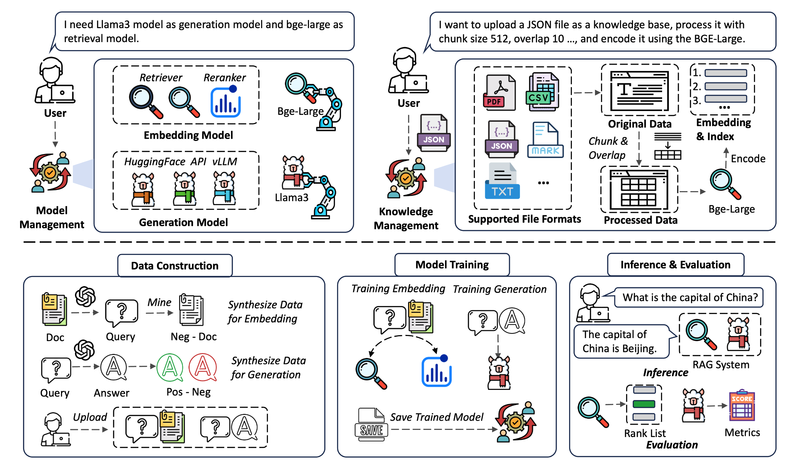
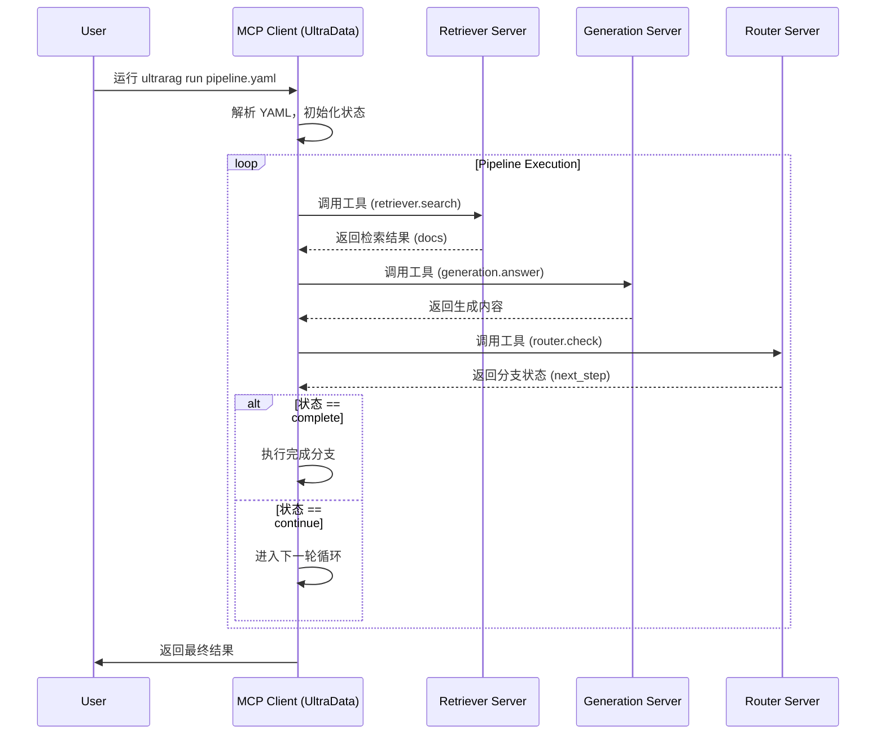
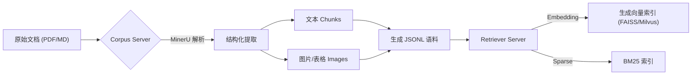

# UltraRAG：基于 MCP 架构的模块化与自适应 RAG 框架

> **前言**：在 RAG（检索增强生成）系统日益复杂的今天，如何快速构建适应特定领域（如法律、金融）的高质量 RAG 应用，同时又能灵活应对多模态数据和复杂的推理流程？清华大学 THUNLP 实验室联合 OpenBMB 推出的 **UltraRAG** 给出了答案。这是一个基于 **MCP (Model Context Protocol)** 架构设计的模块化 RAG 工具包，它不仅实现了“低代码”构建复杂 Pipeline，更通过全流程的数据自适应能力，解决了通用 RAG 在垂直领域“水土不服”的难题。

---

## 1. 为什么我们需要 UltraRAG？

现有的 RAG 开发工具（如 LangChain, LlamaIndex）虽然降低了入门门槛，但在面对真实复杂的科研或工业场景时，往往显得力不从心：
*   **领域适应难**：通用模型在特定领域（如法律条文检索）表现不佳，缺乏从数据构建到微调的一站式方案。
*   **系统复杂度高**：构建包含循环、条件分支的多轮推理系统（如 IRCoT, Iterative RAG）需要编写大量“胶水代码”。
*   **多模态支持弱**：难以高效处理 PDF 中的表格、图片等混合内容。

**UltraRAG** 的诞生正是为了解决这些痛点。它不仅仅是一个工具箱，更是一套支持 **“知识适应（Knowledge Adaptation）”** 的全生命周期解决方案。


*图 1: UltraRAG 整体架构图，包含全局设置（模型/知识管理）与核心功能模块（数据构建、训练、评估与推理）。*

---

## 2. 核心架构：基于 MCP 的低代码编排

UltraRAG v2 的最大技术亮点在于采用了 **MCP (Model Context Protocol)** 架构。这种架构将 RAG 的各个组件解耦为独立的 **Server**，通过标准协议与 **Client** 通信。

### 2.1 什么是 MCP 架构？

在 UltraRAG 中，检索器（Retriever）、生成器（Generator）、路由器（Router）等都被封装为独立的 MCP Server。
*   **Server 层**：每个功能模块都是一个独立的 Python 进程，功能通过函数级的 `@tool` 接口暴露。
*   **Client 层**：负责解析用户的 YAML 配置文件，并根据定义的逻辑调度各个 Server。

这种设计的优势在于：开发者只需要编写 **YAML 配置文件**，就能定义包含串行、循环、条件分支的复杂推理流程，真正实现了“配置即代码”。

### 2.2 核心代码实现：Server 封装

在代码层面，每个组件都继承自 `UltraRAG_MCP_Server`。以下是一个自定义 Server 的精简示例：

```python
# 示例：定义一个自定义 MCP Server
from ultrarag.server import UltraRAG_MCP_Server

app = UltraRAG_MCP_Server("custom")

# 注册一个工具，定义输入输出流
@app.tool(output="ans_ls->extract_query_list")
def search_query_extract(ans_ls: list[str]) -> dict[str, list[str]]:
    """
    从上一轮的回答中提取搜索查询
    """
    queries = [extract_func(ans) for ans in ans_ls]
    return {"extract_query_list": queries}

# 自动生成 server.yaml 配置
if __name__ == "__main__":
    app.run()
```

### 2.3 复杂流程控制：YAML 编排

无需编写复杂的 Python 循环逻辑，你可以在 YAML 中直接声明控制流。以下是一个包含 **循环（Loop）** 和 **分支（Branch）** 的 Pipeline 定义示例：

```yaml
pipeline:
  # 1. 初始检索
  - retriever.search
  
  # 2. 循环执行：多轮推理
  - loop:
      times: 3
      steps:
        - prompt.generate_sub_questions
        - retriever.search
        - generation.answer
        
  # 3. 条件分支：检查是否完成
  - branch:
      router: 
        - router.check_state  # 路由工具返回状态
      branches:
        complete: [generation.final_summary]  # 完成则总结
        incomplete: [retriever.search_more]   # 未完成则继续检索
```

为了更直观地理解 MCP 客户端如何调度这些 Server，我们可以看下面的交互流程图：



---

## 3. 核心特性深度解析

除了架构上的创新，UltraRAG 在功能模块上也做得非常扎实。

### 3.1 数据构建与自适应（Data Construction & Adaptation）

这是 UltraRAG 最具差异化的功能。它不仅仅是“使用”数据，还能“制造”数据来适应模型。
*   **自动化语料构建**：集成 **MinerU**，能够处理 PDF 中的复杂布局，自动提取文本、表格和图片，构建多模态知识库。
*   **合成训练数据**：
    *   **Retriever 微调数据**：自动生成 Query-Document 对，并挖掘难负例（Hard Negatives）。
    *   **Generator 对齐数据**：生成 SFT（监督微调）数据和 DPO（直接偏好优化）数据。

**流程图：从原始文档到索引的构建**



### 3.2 多模态 RAG 支持

得益于 MinerU 的解析能力和底层对图像 Embedding 的支持（如 Infinity 后端），UltraRAG 可以轻松构建 **VisRAG** 系统。
*   **解析阶段**：将 PDF 页面转换为图片或提取内嵌图片。
*   **检索阶段**：支持跨模态检索，直接通过文本查询检索相关图片。
*   **生成阶段**：对接多模态大模型（如 MiniCPM-V），实现基于视觉信息的问答。

### 3.3 全面的评估体系

UltraRAG 内置了 **Evaluation Server**，提供标准化的评估流程：
*   **检索指标**：NDCG@k, Recall@k, MAP, MRR。
*   **生成指标**：ROUGE-L, F1, EM (Exact Match)。
*   **数据集**：内置支持 40+ 个常用 Benchmark（如 HotpotQA, NQ, DocVQA），方便科研人员快速复现和对比。

---

## 4. 实战案例：法律领域的知识适应

为了验证 UltraRAG 的有效性，团队在 LawBench 数据集上进行了实验。法律场景对术语的准确性要求极高，通用模型往往表现不佳。

通过 UltraRAG 的**知识适应**流程：
1.  **数据准备**：上传法律书籍和案例。
2.  **微调**：自动构建数据微调 Embedding 模型（MiniCPM-Embedding-Light）和生成模型（基于 KBAlign 和 RAG-DDR 方法）。
3.  **推理**：使用自适应后的模型进行回答。

**效果对比**：
*   **Vanilla RAG**：仅仅检索到相关性较低的《劳动法》通用条款，回答笼统。
*   **UltraRAG**：精准检索到《外资企业行政管理规定》第32条，给出了针对“外资企业工伤”场景的准确法律依据。
*   **数据表现**：使用 RAG-DDR 策略微调后，生成任务的 ROUGE-L 指标相比 Vanilla RAG 提升了约 **30%**。

---

## 5. 总结

UltraRAG 代表了 RAG 框架发展的一个新方向：从单纯的“胶水层”进化为**“操作系统”**。
*   对于**开发者**，MCP 架构和 YAML 编排极大地降低了复杂系统的构建成本。
*   对于**科研人员**，内置的 Benchmark 和模块化设计使得算法复现和对比变得简单。
*   对于**企业用户**，全流程的知识适应能力是解决垂直领域“幻觉”和“检索不准”问题的关键钥匙。

如果你正在寻找一个既能快速上手，又能深度定制，还能自动优化模型性能的 RAG 框架，UltraRAG 绝对值得一试。

> **项目地址**：[OpenBMB/UltraRAG](https://github.com/OpenBMB/UltraRAG)  
> **核心贡献者**：Tsinghua NLP, Northeastern University, OpenBMB

