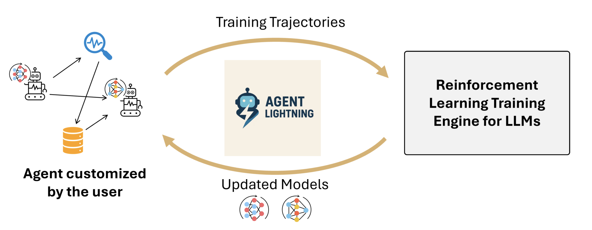
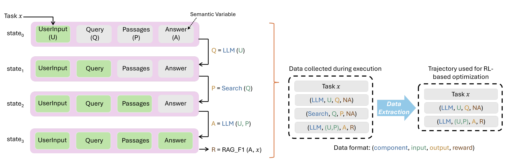
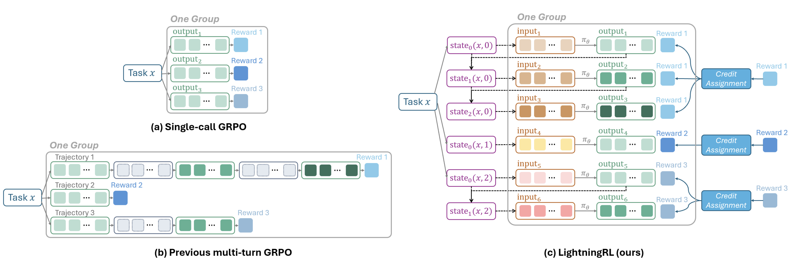
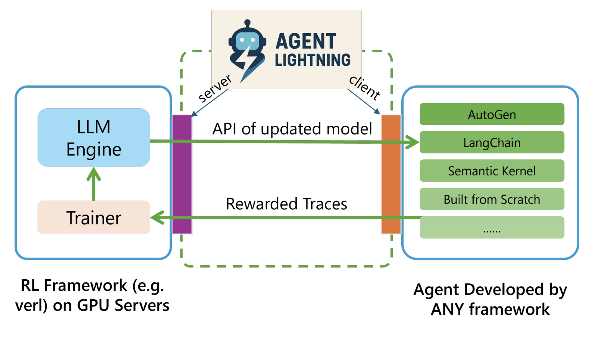
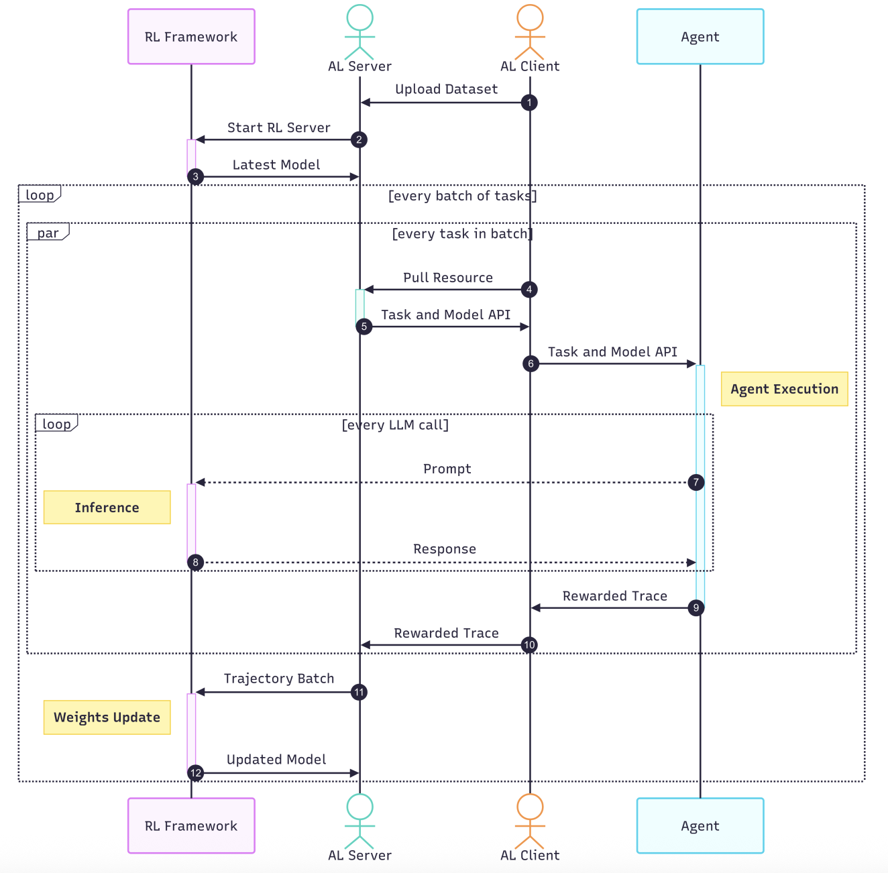
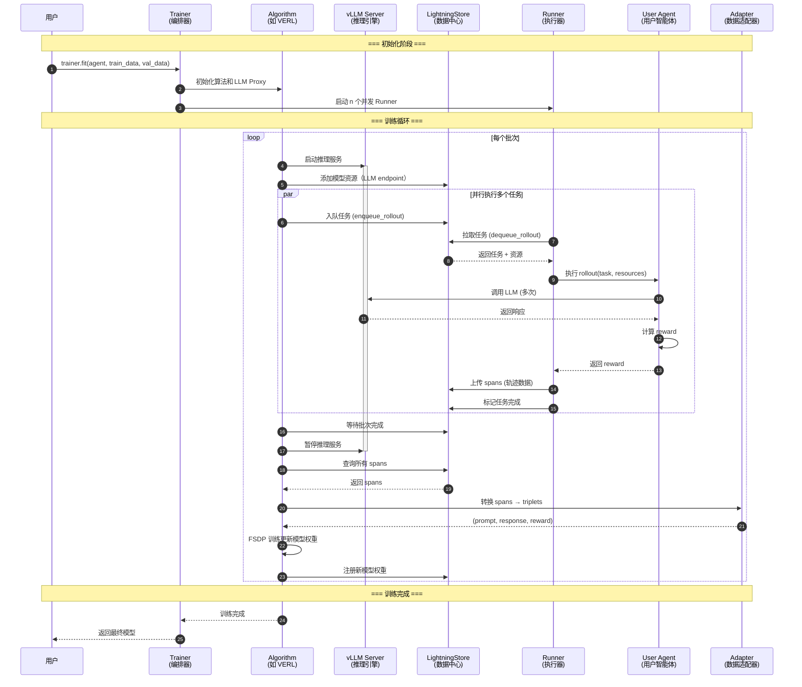

# Agent Lightning：让任何 AI Agent 都能用强化学习训练

## 引言：AI Agent 训练的困境

当前的 AI Agent 在复杂任务中虽然展现出了灵活性，但仍然面临显著挑战：它们容易出错，特别是在未经训练的场景下（如私有数据集、多轮交互工作流）表现不佳。虽然提示工程能带来一些改进，但要真正释放 Agent 的潜力，我们需要对模型进行**训练和微调**。

强化学习（RL）是一个自然的选择——它依赖结果反馈而非昂贵的标注数据。然而，现有的 RL 方法主要针对静态、单轮任务设计，与 Agent 的复杂动态执行特性不匹配。更棘手的是，现有框架将 RL 训练与 Agent 实现紧密耦合，导致开发者必须重写 Agent 代码才能接入训练系统。

微软研究院推出的 **Agent Lightning** 框架彻底改变了这一局面。


*图1: Agent Lightning 框架概览 - 实现 Agent 执行与 RL 训练的完全解耦*

## Agent Lightning 是什么？

**Agent Lightning 是一个灵活可扩展的框架，能够对任何 AI Agent 进行基于强化学习的训练，且几乎无需修改代码。**

它的核心价值在于**完全解耦** Agent 执行和 RL 训练：

- ✅ **框架无关**：支持 LangChain、OpenAI Agents SDK、AutoGen、CrewAI 等任何框架，甚至从零开发的 Agent
- ✅ **零代码改动**：现有 Agent 只需轻量集成即可接入训练循环
- ✅ **选择性优化**：在多智能体系统中可以选择优化特定的 Agent
- ✅ **算法灵活**：支持强化学习（RL）、监督微调（SFT）、提示词优化（APO）等多种方法

## 核心创新：三大支柱

### 1. 统一数据接口：MDP 建模

Agent Lightning 将 Agent 执行过程建模为**马尔可夫决策过程（MDP）**，定义了统一的数据接口。

在 MDP 中：
- **状态（State）**：Agent 执行的当前快照，包含所有语义变量
- **动作（Action）**：LLM 生成的完整输出序列
- **奖励（Reward）**：评估任务完成质量的标量信号


*图2: 统一数据接口 - 将复杂的 Agent 执行流转换为标准的 RL 训练数据*

如图2所示，一个检索增强生成（RAG）Agent 的执行过程被抽象为：

**执行流（左侧）**：
- State 0: 用户输入问题
- State 1: LLM 生成搜索查询
- State 2: 搜索工具返回文档
- State 3: LLM 生成最终答案

**收集数据（右侧）**：
每次组件调用都被记录为 `(component, input, output, reward)` 格式的 transition，这些数据直接用于 RL 训练。

这种设计的优势在于：
- **抽象复杂性**：忽略 Agent 内部的复杂逻辑，只关注 LLM 的输入输出
- **灵活性**：支持动态工作流、多 Agent 协作等复杂场景
- **可扩展性**：轻松处理多轮交互，不会受限于上下文长度

### 2. LightningRL：分层强化学习算法

传统 RL 算法针对单次 LLM 调用设计，而 Agent 通常需要多次调用才能完成任务。Agent Lightning 提出 **LightningRL** 算法来弥合这一鸿沟。


*图3: LightningRL 与传统方法的对比*

如图3所示：

- **(a) 单轮 GRPO**：传统方法，仅适用于单次交互
- **(b) 多轮 GRPO（掩码）**：通过序列拼接和掩码处理多轮，但实现复杂且易受长上下文影响
- **(c) LightningRL（本文方法）**：
  - 将轨迹分解为独立的 transitions
  - 通过**信用分配模块**将最终回报合理分配给每一步
  - 每个 transition 独立优化，兼容现有单轮 RL 方法

**核心优势**：
- 无需序列拼接和复杂掩码
- 支持灵活的上下文构建
- 缓解长上下文问题
- 实现简洁高效

### 3. Training-Agent Disaggregation 架构

Agent Lightning 引入了**训练-Agent 分离架构**，实现物理和逻辑上的彻底解耦。


*图4: Training-Agent Disaggregation 架构*

架构包含两个核心组件：

**Lightning Server（训练控制器）**：
- 管理 RL 训练过程
- 暴露 OpenAI 兼容的 API 端点
- 协调任务分发和数据收集

**Lightning Client（Agent 运行时）**：
- 执行用户的 Agent 代码
- 利用 OpenTelemetry 自动收集轨迹
- 无需修改 Agent 代码

这种架构带来的好处：
- **计算分离**：训练和执行可独立扩展和部署
- **Agent 无感知**：Agent 只需调用 API，无需了解训练细节
- **灵活扩展**：通过 `n_runners` 参数轻松实现并行化

## 工作原理：完整训练流程


*图5: Agent Lightning 完整工作流程 - 数据在各组件间的流动*

Figure 8 展示了 Agent Lightning 的完整工作流程：
1. **初始化**：用户上传任务数据集，启动 Lightning Server
2. **任务分发**：Server 将任务批次和模型 API 端点分发给 Client
3. **智能体执行**：Client 运行智能体，智能体调用 LLM API
4. **数据收集**：Client 自动收集轨迹数据（输入、输出、奖励）
5. **模型更新**：数据回传至 Server 和 RL 框架，更新模型权重
6. **循环迭代**：更新后的模型继续服务下一批次任务

让我们通过一个更详细的时序图来深入理解这个流程：



关键步骤解读：

1. **任务分发**：Algorithm 从数据集中取出任务，通过 Store 分发给多个 Runner
2. **并行执行**：多个 Runner 并发执行 Agent，实时调用 LLM
3. **数据收集**：执行过程中自动捕获 spans（包含输入、输出、reward）
4. **数据转换**：Adapter 将原始 spans 转换为训练数据格式（如 triplets）
5. **模型更新**：使用 FSDP 等分布式训练技术更新 LLM 权重
6. **循环迭代**：更新后的模型用于下一批次，持续优化

## 实战案例：训练 SQL Agent

让我们看一个真实的例子：使用 LangChain 构建的 SQL Agent。

### Agent 定义

```python
import agentlightning as agl
from typing import Dict, Any

class LitSQLAgent(agl.LitAgent[Dict[str, Any]]):
    def __init__(self, max_turns: int, truncate_length: int):
        self.max_turns = max_turns
        self.truncate_length = truncate_length

    def rollout(
        self,
        task: Dict[str, Any],
        resources: agl.NamedResources,
        rollout: agl.Rollout
    ) -> float:
        # 从资源中获取 LLM
        llm: agl.LLM = resources["main_llm"]
        
        # 构建 LangGraph Agent
        agent = build_langgraph_sql_agent(
            database_path="sqlite:///" + task["db_id"],
            max_turns=self.max_turns,
            openai_base_url=llm.get_base_url(
                rollout.rollout_id, 
                rollout.attempt.attempt_id
            ),
            model=llm.model,
            sampling_parameters=llm.sampling_parameters,
        )
        
        # 执行 Agent
        result = agent.invoke(
            {"question": task["question"]}, 
            {"callbacks": [self.tracer.get_langchain_handler()]}
        )
        
        # 计算 reward（比较生成的 SQL 与 ground truth）
        reward = evaluate_query(
            result["query"], 
            task["ground_truth"], 
            task["db_path"]
        )
        return reward
```

### 训练启动

```python
import agentlightning as agl
import pandas as pd

# 1. 配置 VERL 算法
verl_config = {
    "algorithm": {"adv_estimator": "grpo"},
    "data": {
        "train_batch_size": 32,
        "max_prompt_length": 4096,
        "max_response_length": 2048,
    },
    "actor_rollout_ref": {
        "rollout": {"name": "vllm", "n": 4},
        "model": {"path": "Qwen/Qwen2.5-Coder-1.5B-Instruct"},
    },
    "trainer": {"n_gpus_per_node": 1, "total_epochs": 2}
}

# 2. 创建 Agent 和 Trainer
agent = LitSQLAgent(max_turns=5, truncate_length=4096)
algorithm = agl.VERL(verl_config)

trainer = agl.Trainer(
    n_runners=10,  # 10 个并发 Runner
    algorithm=algorithm,
    adapter={"agent_match": "write|rewrite"}  # 只优化 write 和 rewrite agent
)

# 3. 加载数据并训练
train_data = pd.read_parquet("data/train_spider.parquet").to_dict("records")
val_data = pd.read_parquet("data/test_dev_500.parquet").to_dict("records")

trainer.fit(agent, train_dataset=train_data, val_dataset=val_data)
```

就这么简单！**只需不到 50 行代码**，你的 LangChain Agent 就能接入强化学习训练。

### 训练效果

论文在三个不同的任务上验证了 Agent Lightning 的有效性：

- **Text-to-SQL**（Spider 数据集 + LangChain）：在包含 8000+ SQL 问题的数据集上，选择性优化 `write_query` 和 `rewrite_query` 两个 Agent，训练和测试的 reward 曲线均呈现稳定上升趋势
- **RAG**（MuSiQue 数据集 + OpenAI Agents SDK）：在包含 2100 万文档的 Wikipedia 检索场景下，模型学会了生成更有效的多跳查询，F1 分数持续提升
- **Math QA**（Calc-X 数据集 + AutoGen）：通过强化学习，模型显著提升了调用计算器工具的准确性和时机把握

实验结果证明，Agent Lightning 能够在不同框架、不同任务类型上实现**持续且稳定的性能改进**，展现了框架的通用性和有效性。

## 核心特性总结

| 特性 | 说明 |
|-----|------|
| **零代码改动** | 现有 Agent 几乎无需修改即可训练 |
| **框架无关** | 支持 LangChain、OpenAI SDK、AutoGen 等任何框架 |
| **选择性优化** | 多智能体系统中可选择特定 Agent 训练 |
| **算法灵活** | 支持 RL、SFT、APO 等多种优化方法 |
| **自动追踪** | 基于 OpenTelemetry 自动收集执行数据 |
| **并行扩展** | 通过 `n_runners` 轻松实现并行化 |
| **调试友好** | `trainer.dev()` 提供干运行模式 |

## 为什么选择 Agent Lightning？

与现有方案相比，Agent Lightning 的独特优势在于：

1. **彻底解耦**：不像其他框架要求在训练系统内重写 Agent，Agent Lightning 让你的 Agent 代码保持原样
2. **生产就绪**：训练和部署使用同一份 Agent 代码，避免了"训练-部署"鸿沟
3. **可扩展性**：Training-Agent Disaggregation 架构支持大规模分布式训练
4. **数据效率**：统一数据接口使得多种算法可以共享同一份轨迹数据

## 开始使用

Agent Lightning 已在 GitHub 开源：https://github.com/microsoft/agent-lightning

安装：
```bash
pip install agentlightning
```

快速开始：
```python
import agentlightning as agl

@agl.rollout
def my_agent(task: str, llm: agl.LLM) -> float:
    # 你的 Agent 逻辑
    response = call_llm(llm, task)
    reward = evaluate(response)
    return reward

trainer = agl.Trainer(algorithm=agl.VERL(config), n_runners=4)
trainer.fit(my_agent, train_dataset=data)
```

## 结语

Agent Lightning 代表了 AI Agent 训练范式的重大突破。通过统一数据接口、分层 RL 算法和训练-执行分离架构，它将强化学习的力量带给了**任何** AI Agent，无论你使用什么框架，无论你的 Agent 有多复杂。

在 AI Agent 从"能用"走向"好用"的道路上，Agent Lightning 提供了一个优雅、高效、可扩展的解决方案。如果你正在构建复杂的 AI Agent 系统，不妨试试 Agent Lightning，让你的 Agent 能够从真实交互中持续学习和进化。

---

*本文基于论文《Agent Lightning: Train ANY AI Agents with Reinforcement Learning》整理，详细技术细节请参考原论文和官方文档。*
