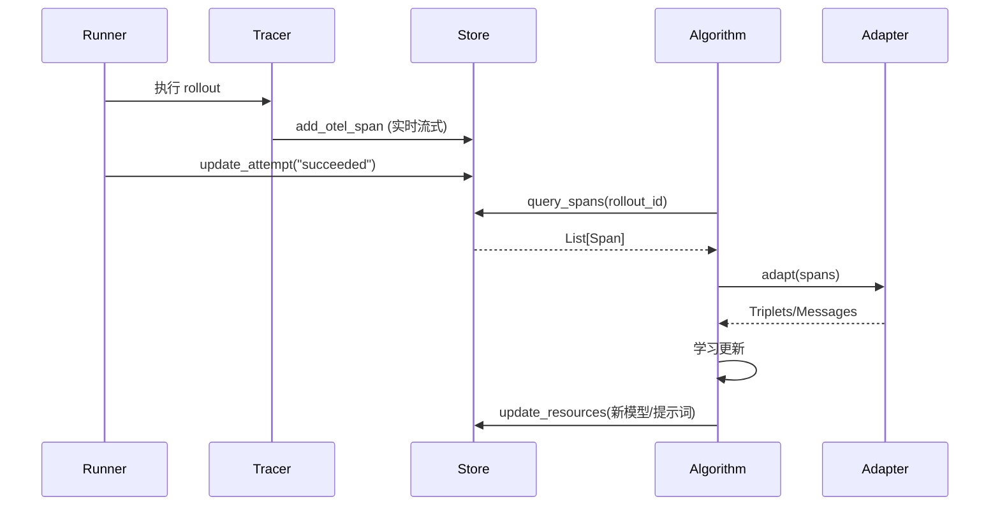
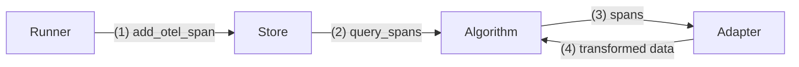
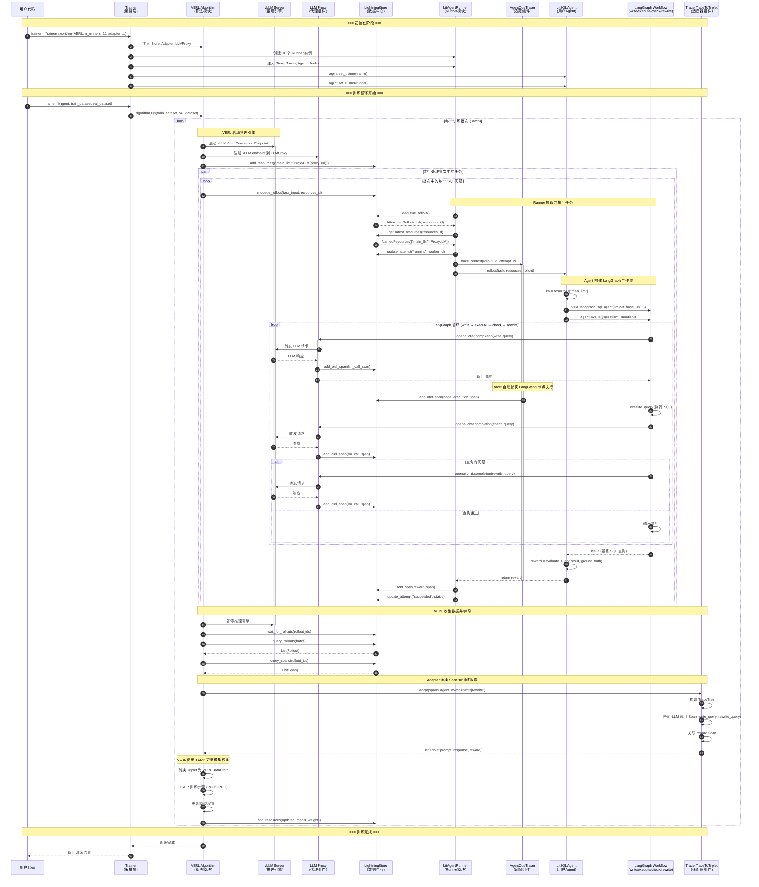
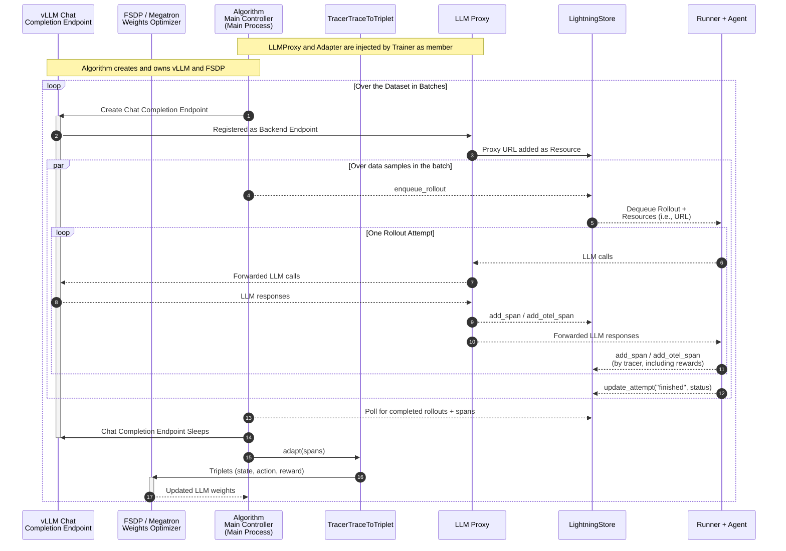
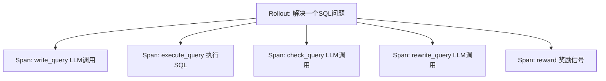
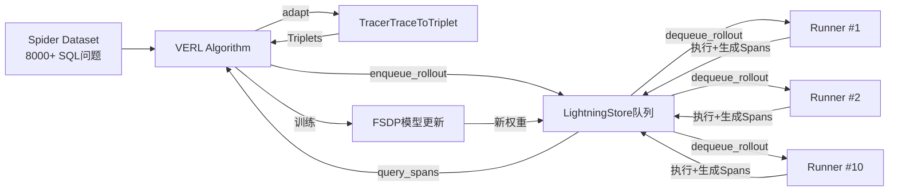

# 我问
我想知道，这个框架最突出最显著的功能点有哪些，你详尽罗列下

# deepwiki
您询问的是 Agent Lightning 框架最突出的功能点。<cite></cite>根据代码库上下文,我将详细列举这个框架的核心特性。<cite></cite>

## Agent Lightning 的核心功能特性

### 1. 零代码改动集成
几乎无需修改现有代码即可将任何 AI Agent 转变为可优化的系统。 [1](#0-0) 这是框架最显著的特点之一,大幅降低了集成成本。<cite></cite>

### 2. 框架无关性
支持与任何 Agent 框架集成,包括 LangChain、OpenAI Agent SDK、AutoGen、CrewAI、Microsoft Agent Framework 等,甚至可以不使用任何框架直接用 Python OpenAI。 [2](#0-1) 这种灵活性让开发者可以继续使用熟悉的工具。<cite></cite>

### 3. 选择性优化
可以在多智能体系统中选择性地优化一个或多个 Agent。 [3](#0-2) 例如在 SQL Agent 示例中,可以通过 `agent_match` 参数只优化 `write_query` 和 `rewrite_query`,而不优化 `check_query`。 [4](#0-3) 

### 4. 多算法支持
内置多种优化算法,包括强化学习(RL)、自动提示优化(APO)、监督微调(SFT)等。 [5](#0-4) 框架提供了 VERL 和 APO 等开箱即用的算法实现。<cite></cite>

### 5. 统一的训练架构
通过三个核心组件实现清晰的训练循环:<cite></cite>

- **Algorithm**: 决定运行哪些任务、从结果中学习并更新资源(如模型或提示词)。 [6](#0-5) 
- **Runner**: 执行算法分配的任务、运行 Agent 并记录结果。 [7](#0-6) 
- **LightningStore**: 作为中央数据库和消息队列,存储任务、结果和资源。 [8](#0-7) 

### 6. 自动化追踪系统
Tracer 组件自动记录 Agent 执行过程中的详细 Span(事件),无需手动记录每个步骤。 [9](#0-8) 它会自动捕获 LLM 调用、工具执行等关键操作的输入、输出和元数据。<cite></cite>

### 7. LLM Proxy 集成
LLM Proxy 作为一等公民,提供:<cite></cite>

- **自动化追踪**: 自动捕获 LLM 交互的详细追踪信息。 [10](#0-9) 
- **后端抽象**: 为各种 LLM 后端提供统一接口。 [11](#0-10) 
- **资源管理**: 算法可以动态更新 Agent 使用的 LLM,无需中断代码。 [12](#0-11) 

### 8. 灵活的执行策略
提供两种执行策略:<cite></cite>

- **SharedMemoryExecutionStrategy**: 在单进程中以线程方式运行,适合轻量级调试。 [13](#0-12) 
- **ClientServerExecutionStrategy**: 跨进程分离关注点,算法端启动 HTTP API 服务器,Runner 通过 REST 连接。 [14](#0-13) 

### 9. 可扩展的并行化
通过 `n_runners` 参数轻松增加吞吐量,支持多个 Runner 并行执行 Rollout。 [15](#0-14) 框架会自动处理任务分发和结果收集。<cite></cite>

### 10. 开发友好的调试模式
`Trainer.dev()` 方法提供干运行功能,使用轻量级 Baseline 算法,只处理少量任务并打印所有 Span,非常适合验证数据库连接和控制流。 [16](#0-15) 

## Notes

Agent Lightning v0.2.0 是一个重大更新,引入了 Lightning Store、Emitter、Adapter、Tracer 等核心组件,以及新的执行策略和嵌入式算法设计。 [17](#0-16) 框架的设计理念是保持最少的活动部件,让开发者专注于想法而非管道工程。 [18](#0-17) 

Wiki pages you might want to explore:
- [LitAgent Interface (microsoft/agent-lightning)](/wiki/microsoft/agent-lightning#4.3)

### Citations

**File:** README.md (L20-20)
```markdown
- Turn your agent into an optimizable beast with **ZERO CODE CHANGE** (almost)! 💤
```

**File:** README.md (L21-21)
```markdown
- Build with **ANY** agent framework (LangChain, OpenAI Agent SDK, AutoGen, CrewAI, Microsoft Agent Framework...); or even WITHOUT agent framework (Python OpenAI). You name it! 🤖
```

**File:** README.md (L22-22)
```markdown
- **Selectively** optimize one or more agents in a multi-agent system. 🎯
```

**File:** README.md (L23-23)
```markdown
- Embraces **Algorithms** like Reinforcement Learning, Automatic Prompt Optimization, Supervised Fine-tuning and more. 🤗
```

**File:** README.md (L57-57)
```markdown
Agent Lightning keeps the moving parts to a minimum so you can focus on your idea, not the plumbing. Your agent continues to run as usual; you can still use any agent framework you like; you drop in the lightweight `agl.emit_xxx()` helper, or let the tracer collect every prompt, tool call, and reward. Those events become structured spans that flow into the LightningStore, a central hub that keeps tasks, resources, and traces in sync.
```

**File:** docs/how-to/train-sql-agent.md (L238-239)
```markdown
The [`Adapter`][agentlightning.Adapter], as discussed earlier, is used at the algorithm side, and receives the traces emitted by the agent and runners. The `agent_match` parameter ensures [`VERL`][agentlightning.algorithm.verl.VERL] only ingests spans from the specific agent you want to optimize.
In the example above, there are at least three agents—`write_query`, `rewrite_query`, and `check_query`. By setting `agent_match` to a regex like `"write"`, both `write_query` and `rewrite_query` agents are optimized simultaneously. You can also set it to `"write|check"` or `None` to include all agents if desired.
```

**File:** docs/how-to/train-sql-agent.md (L243-243)
```markdown
Before committing hours of GPU time, you can **dry-run** the agent with [`Trainer.dev()`][agentlightning.Trainer.dev]. This method swaps in the lightweight [`Baseline`][agentlightning.Baseline] algorithm, enqueues up to ten tasks, and prints every span emitted by the agent. Because it uses the same runner stack as full training, it’s ideal for verifying database connections and LangGraph control flow.
```

**File:** docs/deep-dive/birds-eye-view.md (L14-14)
```markdown
* **[Algorithm][agentlightning.Algorithm]:** The "brain" of the system. It decides what tasks to run, learns from the results, and updates resources (like AI models or prompts).
```

**File:** docs/deep-dive/birds-eye-view.md (L15-15)
```markdown
* **[Runner][agentlightning.Runner]:** The "worker" of the system. It executes tasks assigned by the algorithm, runs the agent, and records the results.
```

**File:** docs/deep-dive/birds-eye-view.md (L16-16)
```markdown
* **[LightningStore][agentlightning.LightningStore]:** The central "database" and message queue. It acts as the single source of truth, storing tasks, results, and resources, and enabling communication between the Algorithm and Runner.
```

**File:** docs/deep-dive/birds-eye-view.md (L95-95)
```markdown
The [`Tracer`][agentlightning.Tracer] is a component within the [`Runner`][agentlightning.Runner] that records detailed spans (events) during an agent's execution and sends them to the [`LightningStore`][agentlightning.LightningStore]. Instead of requiring the agent to manually log every span, the tracer automatically instruments key methods (e.g., LLM calls) and captures their inputs, outputs, and metadata. This provides a detailed log of the agent's behavior with minimal effort.
```

**File:** docs/deep-dive/birds-eye-view.md (L182-182)
```markdown
1. **Instrumentation:** It automatically captures detailed traces of LLM interactions (prompts, responses, metadata) and sends them to the store, complementing the tracer, especially when the agent's code is hard to instrument directly.
```

**File:** docs/deep-dive/birds-eye-view.md (L183-183)
```markdown
2. **Backend Abstraction:** It provides a unified interface for various LLM backends (OpenAI, Anthropic, local models) and can add features like retry logic, rate limiting, and caching.
```

**File:** docs/deep-dive/birds-eye-view.md (L184-184)
```markdown
3. **Resource Management:** The algorithm can dynamically update which LLM the agent uses (e.g., swapping to a newly fine-tuned model) by simply swapping the backend model the proxy is using, without interrupting the agent's code.
```

**File:** docs/deep-dive/birds-eye-view.md (L409-409)
```markdown
[`SharedMemoryExecutionStrategy`][agentlightning.SharedMemoryExecutionStrategy] runs algorithm and runner bundles as threads in one process. The strategy wraps the store with [`LightningStoreThreaded`][agentlightning.LightningStoreThreaded], which guards calls with a lock for safe concurrency.
```

**File:** docs/deep-dive/birds-eye-view.md (L445-445)
```markdown
[`ClientServerExecutionStrategy`][agentlightning.ClientServerExecutionStrategy] splits concerns across processes. The algorithm bundle starts a [`LightningStoreServer`][agentlightning.LightningStoreServer] (HTTP API) that wraps the underlying store. Runners connect via [`LightningStoreClient`][agentlightning.LightningStoreClient] to call the same interface over REST. The server embeds a client to support algorithm-launched subprocesses (e.g., an LLM proxy worker) that need to talk back to the algorithm’s process through the same API.
```

**File:** docs/tutorials/parallelize.md (L15-15)
```markdown
Increase throughput by setting `n_runners` when constructing the trainer. The following example comes from [train_calc_agent.py]({{ src("examples/calc_x/train_calc_agent.py") }}). Since backend LLMs usually use techniques like [continuous batching](https://docs.vllm.ai/en/latest/) to increase throughput, you do not have to worry about overwhelming the backend with too many requests.
```

**File:** docs/changelog.md (L36-45)
```markdown
### Core Enhancements

* **Lightning Store**: Added unified interface and implementation for Agent-lightning's core storage.
* **Emitter**: Emitting any objects as spans to the store.
* **Adapter** and **Tracer**: Adapting to OpenAI-like messages, and OpenTelemetry dummy tracer.
* **LLM Proxy**: Added LLM Proxy as the first-class citizen in Agent-lightning.
* **Agent Runner**: New version providing a more modular and robust runner design.
* **Embedded Algorithms**: Algorithms are now embedded directly into trainers for simplicity.
* **New Execution Strategies**: Introduced *Client-Server* and *Shared Memory* execution models.
* **Trainer Updates**: Integrated v0.2 interfaces and FastAlgorithm validation.
```


# 我问
你说 零代码改动集成，那么我现在有个java开发的类似dify、coze的智能体开发平台，能零代码改动吗？

# deepwiki
您询问的是 Java 开发的智能体平台能否使用 Agent Lightning 的"零代码改动"集成。<cite/>

## 简短回答

**不能**。<cite/>Agent Lightning 目前仅支持 **Python** 生态系统,无法直接集成到 Java 开发的平台中。<cite/>

## 详细说明

Agent Lightning 的"零代码改动"特性是指在 **Python Agent** 的基础上进行集成。 [1](#1-0) 具体来说:

### 支持的框架和语言

Agent Lightning 支持的都是 Python 框架:<cite/>

- LangChain (Python)
- OpenAI Agent SDK (Python)
- AutoGen (Python)
- CrewAI (Python)
- Microsoft Agent Framework (Python)
- 或直接使用 Python OpenAI 库 [2](#1-1) 

测试代码也证实了这一点,所有集成测试都是针对 Python 框架的。 [3](#1-2) 

### 核心依赖 Python 生态

Agent Lightning 的核心组件都是 Python 实现的:<cite/>

1. **LitAgent 接口**需要继承 Python 类并实现 `rollout` 方法 [4](#1-3) 
2. **Tracer** 使用 OpenTelemetry Python SDK 进行追踪<cite/>
3. **LLM Proxy** 基于 LiteLLM 和 uvicorn (Python web 框架) [5](#1-4) 
4. **Trainer** 和 **Algorithm** 都是 Python 类<cite/>

### 可能的替代方案

如果您想在 Java 平台中使用类似的训练能力,可能需要:<cite/>

1. **将 Agent 逻辑用 Python 重写**,然后使用 Agent Lightning 进行训练
2. **通过 API 桥接**:Java 平台通过 HTTP API 调用 Python 实现的 Agent,但这不是"零代码改动"
3. **等待社区贡献** Java 版本的实现(目前不存在)

## Notes

Agent Lightning 的设计理念是保持最少的活动部件,专注于 Python 生态系统的深度集成。 [6](#1-5) 框架与 Python 的 OpenTelemetry、asyncio、类型系统等深度绑定,移植到 Java 需要完全重新实现整个架构。<cite/>

Wiki pages you might want to explore:
- [LitAgent Interface (microsoft/agent-lightning)](/wiki/microsoft/agent-lightning#4.3)

### Citations

**File:** README.md (L20-21)
```markdown
- Turn your agent into an optimizable beast with **ZERO CODE CHANGE** (almost)! 💤
- Build with **ANY** agent framework (LangChain, OpenAI Agent SDK, AutoGen, CrewAI, Microsoft Agent Framework...); or even WITHOUT agent framework (Python OpenAI). You name it! 🤖
```

**File:** README.md (L56-56)
```markdown

```

**File:** tests/tracer/test_integration.py (L8-13)
```python
This module tests the integration of AgentLightning with:
- Autogen AgentChat
- LangChain/LangGraph
- OpenAI Agent SDK
- AgentOps
- Reward tracking functionality
```

**File:** docs/tutorials/write-agents.md (L19-23)
```markdown
## [`@rollout`][agentlightning.rollout] Decorator

The simplest way to create an agent is by writing a standard Python function and marking it with the [@rollout][agentlightning.rollout] decorator. This approach is perfect for agents with straightforward logic that doesn't require complex state management.

Agent-lightning automatically inspects your function's signature and injects the required resources. For example, if your function has a parameter named `prompt_template`, Agent-lightning will find the [PromptTemplate][agentlightning.PromptTemplate] resource for the current rollout and pass it in.
```

**File:** agentlightning/llm_proxy.py (L486-493)
```python
    """Host a LiteLLM OpenAI-compatible proxy bound to a LightningStore.

    The proxy:

    * Serves an OpenAI-compatible API via uvicorn.
    * Adds rollout/attempt routing and headers via middleware.
    * Registers OTEL export and token-id callbacks.
    * Writes a LiteLLM worker config file with `model_list` and settings.
```


# 我问
你说Tracer 组件自动记录 Agent 执行过程中的详细 Span(事件)，记录之后怎么用于训练呢？

# deepwiki
您询问的是 Tracer 记录的 Span 如何用于训练。<cite/>让我详细解释这个数据流转过程。<cite/>

## Span 的训练流程

### 1. Span 的记录与存储

Tracer 在 Agent 执行过程中自动捕获 Span 并存储到 LightningStore 中。 [1](#2-0) 具体流程如下:<cite/>

在 Runner 执行 rollout 时,Tracer 通过 `trace_context` 上下文管理器包裹 Agent 的执行,自动拦截 LLM 调用等关键操作。 [2](#2-1) 这些 Span 会实时流式传输到 Store。 [3](#2-2) 

### 2. Algorithm 查询 Span

当 rollout 完成后,Algorithm 从 LightningStore 查询这些 Span 数据:<cite/>

```python
spans = await store.query_spans(rollout_id=rollout.rollout_id)
``` [4](#2-3) 

### 3. Adapter 转换数据格式

Algorithm 使用 Adapter 将原始 Span 转换为训练数据。 [5](#2-4) 

例如,`TracerTraceToTriplet` 将 Span 转换为 `(prompt, response, reward)` 三元组: [6](#2-5) 

转换流程:<cite/>
- 从 Span 构建 TraceTree
- 匹配 LLM 调用 Span (如 `openai.chat.completion`)
- 关联 reward Span
- 生成训练用的 Triplet 数据 [7](#2-6) 

### 4. Algorithm 学习与更新

Algorithm 使用转换后的数据进行学习并更新资源。<cite/>以 VERL 为例: [8](#2-7) 

1. 查询完成的 rollout 和 spans
2. 通过 Adapter 转换为 triplets
3. VERL 使用这些 triplets 更新模型权重
4. 将更新后的模型注册回 Store

## 完整数据流



<cite/>

## 实际示例

在 APO 算法中,Span 被转换为消息格式用于提示词优化: [9](#2-8) 

在 VERL 算法中,Span 被转换为 RL triplets 用于模型微调: [10](#2-9) 

## Notes

Span 包含了 Agent 执行的完整上下文,包括 LLM 的输入输出、工具调用、reward 信号等。 [11](#2-10) 这些结构化数据使得算法能够理解 Agent 的行为并进行针对性优化。<cite/>不同的 Adapter 可以将同一组 Span 转换为不同格式,以适配不同的学习算法。<cite/>

Wiki pages you might want to explore:
- [Algorithm Component (microsoft/agent-lightning)](/wiki/microsoft/agent-lightning#4.1)
- [LitAgent Interface (microsoft/agent-lightning)](/wiki/microsoft/agent-lightning#4.3)

### Citations

**File:** docs/deep-dive/birds-eye-view.md (L76-76)
```markdown
    async def query_spans(self, rollout_id: str, ...): ...
```

**File:** docs/deep-dive/birds-eye-view.md (L94-95)
```markdown

The [`Tracer`][agentlightning.Tracer] is a component within the [`Runner`][agentlightning.Runner] that records detailed spans (events) during an agent's execution and sends them to the [`LightningStore`][agentlightning.LightningStore]. Instead of requiring the agent to manually log every span, the tracer automatically instruments key methods (e.g., LLM calls) and captures their inputs, outputs, and metadata. This provides a detailed log of the agent's behavior with minimal effort.
```

**File:** docs/deep-dive/birds-eye-view.md (L112-119)
```markdown
        loop For each finished span
            Agent-->>Tracer: openai.chat.completion invoked<br>agent.execute invoked<br>...
            Agent->>Tracer: emit intermediate reward
            Tracer-->>Store: add_otel_span(rollout_id, attempt_id, span)
        end
        Agent->>Runner: final reward + extra spans (if any)
        Runner-->>Store: add_span(rollout_id, attempt_id, span)
        Runner-->>Store: update_attempt(status)
```

**File:** docs/deep-dive/birds-eye-view.md (L163-166)
```markdown

The [`Adapter`][agentlightning.Adapter] is a component used by the [`Algorithm`][agentlightning.Algorithm] to transform raw data from the [`LightningStore`][agentlightning.LightningStore] into a format suitable for learning. Runners stream raw spans into the store during execution. Later, the algorithm queries these spans and uses an adapter to convert them into structured data, like training examples for a reinforcement learning model.

For instance, the [`TracerTraceToTriplet`][agentlightning.TracerTraceToTriplet] processes OpenTelemetry spans to create `(prompt, response, reward)` triplets, which are the fundamental data structure for many RL fine-tuning algorithms.
```

**File:** docs/deep-dive/birds-eye-view.md (L168-174)
```markdown

```

**File:** docs/deep-dive/birds-eye-view.md (L351-358)
```markdown
        Algo-->>Store: Poll for completed rollouts + spans
        Algo->>vLLM: Chat Completion Endpoint Sleeps
        deactivate vLLM
        Algo->>Adapter: adapt(spans)
        Adapter->>FSDP: Triplets (state, action, reward)
        activate FSDP
        FSDP-->>Algo: Updated LLM weights
        deactivate FSDP
```

**File:** agentlightning/runner/agent.py (L366-393)
```python
            async with self._tracer.trace_context(
                name=rollout_id, store=store, rollout_id=rollout_id, attempt_id=next_rollout.attempt.attempt_id
            ):
                await self._trigger_hooks(
                    hook_type="on_trace_start", agent=agent, runner=self, tracer=self._tracer, rollout=next_rollout
                )

                # NOTE: This is the most costly step in the whole function
                # If the rollout method becomes unresponsive or timeouts, there is nothing we can do within the runner.
                # We might need some mechanisms in execution strategy to restart the runner. But that's a future work.
                if agent.is_async():
                    rollout_method = (
                        agent.training_rollout_async if next_rollout.mode == "train" else agent.validation_rollout_async
                    )
                    result = await rollout_method(
                        next_rollout.input, resources=resources_update.resources, rollout=next_rollout
                    )
                else:
                    rollout_method = (
                        agent.training_rollout if next_rollout.mode == "train" else agent.validation_rollout
                    )
                    result = rollout_method(
                        next_rollout.input, resources=resources_update.resources, rollout=next_rollout
                    )

                await self._trigger_hooks(
                    hook_type="on_trace_end", agent=agent, runner=self, tracer=self._tracer, rollout=next_rollout
                )
```

**File:** agentlightning/adapter/triplet.py (L673-696)
```python
    def adapt(self, source: Union[List[Span], List[ReadableSpan]], /) -> List[Triplet]:  # type: ignore
        """Convert tracer spans into [`Triplet`][agentlightning.Triplet] trajectories.

        Args:
            source: Agent Lightning spans or raw OpenTelemetry spans that form a trace.

        Returns:
            Ordered list of trajectory transitions with prompt, response, and reward information.
        """
        source_normalized = [
            Span.from_opentelemetry(span, "dummy", "dummy", 0) if isinstance(span, ReadableSpan) else span
            for span in source
        ]
        trace_tree = TraceTree.from_spans(source_normalized)
        if self.repair_hierarchy:
            trace_tree.repair_hierarchy()
        trajectory = trace_tree.to_trajectory(
            llm_call_match=self.llm_call_match,
            agent_match=self.agent_match,
            exclude_llm_call_in_reward=self.exclude_llm_call_in_reward,
            reward_match=self.reward_match,
            _skip_empty_token_spans=self._skip_empty_token_spans,
        )
        return trajectory
```

**File:** docs/how-to/train-first-agent.md (L121-128)
```markdown
### Span

A span represents a single unit of work or an operation within a **rollout**. Spans are the building blocks of a trace. They have a start and end time and contain details about the specific operation, like an LLM call, a tool execution, or a reward calculation. For a more precise definition, see the [OpenTelemetry documentation](https://opentelemetry.io/docs/concepts/signals/traces/).

!!! example "Analogy: Span"

    If the rollout is "baking a cake," a span could be "preheating the oven," "mixing flour and sugar," or "adding frosting." Each is a distinct step or unit of work.

```

**File:** docs/how-to/train-first-agent.md (L194-196)
```markdown
    # This is used to convert the span data into a message format consumable by APO algorithm
    adapter=agl.TraceToMessages(),
)
```

**File:** docs/how-to/train-sql-agent.md (L234-238)
```markdown
First, `agl.VERL(verl_config)` launches the [`VERL`][agentlightning.algorithm.verl.VERL] algorithm and its OpenAI-compatible proxy. The `train_data` and `val_data` are passed into [`VERL`][agentlightning.algorithm.verl.VERL], which enqueues tasks to a centralized task queue managed by the [`LightningStore`][agentlightning.LightningStore], accessible to all runners.

When [`Trainer.fit`][agentlightning.Trainer.fit] is called, it launches 10 concurrent runners (as specified by `n_runners=10`). Each runner pulls tasks from the centralized task queue, executes the agent’s [`rollout`][agentlightning.LitAgent.rollout] method, collects traces, and returns rewards to VERL for training.

The [`Adapter`][agentlightning.Adapter], as discussed earlier, is used at the algorithm side, and receives the traces emitted by the agent and runners. The `agent_match` parameter ensures [`VERL`][agentlightning.algorithm.verl.VERL] only ingests spans from the specific agent you want to optimize.
```


# 我问
从『模块』和『组件』的角度，告诉我，这个repo有哪些模块，每个模块下面有哪些组件？然后基于sql agent的例子，给一个详细的时序图，说明下模块之间的是如何交互的，以及各自模块的核心组件在什么地方发挥什么作用？

# deepwiki
您询问的是 Agent Lightning 仓库的模块组成、组件结构,以及基于 SQL Agent 示例的详细交互时序图。<cite/>

## 模块与组件架构

Agent Lightning 采用清晰的模块化设计,主要分为以下几个核心模块:<cite/>

### 1. **Algorithm 模块** (算法端)

**核心职责**: 决定运行哪些任务、从结果中学习并更新资源 [1](#3-0) 

**主要组件**:
- **Algorithm**: 算法主控制器,如 `VERL`、`APO`、`Baseline` 等 [2](#3-1) 
- **Adapter**: 将原始 Span 转换为算法可用的训练数据格式 [3](#3-2) 
- **LLM Proxy**: 可选的 LLM 调用代理,提供统一接口和自动追踪 [4](#3-3) 

### 2. **Runner 模块** (执行端)

**核心职责**: 执行算法分配的任务、运行 Agent 并记录结果 [5](#3-4) 

**主要组件**:
- **Runner**: 工作进程管理器,默认为 `LitAgentRunner` [6](#3-5) 
- **Tracer**: 自动追踪组件,如 `AgentOpsTracer` [7](#3-6) 
- **Hooks**: 生命周期回调钩子 [8](#3-7) 
- **LitAgent**: 用户定义的 Agent 实现 [9](#3-8) 

### 3. **Store 模块** (数据中心)

**核心职责**: 作为中央数据库和消息队列,存储任务、结果和资源 [10](#3-9) 

**主要组件**:
- **LightningStore**: 核心存储接口,默认实现为 `InMemoryLightningStore` [11](#3-10) 
- **LightningStoreThreaded**: 线程安全包装器 [12](#3-11) 
- **LightningStoreServer/Client**: HTTP 服务端/客户端包装器 [13](#3-12) 

### 4. **Trainer 模块** (编排层)

**核心职责**: 高层编排器,连接所有主要组件 [14](#3-13) 

**主要组件**:
- **Trainer**: 统一入口点,管理所有组件的生命周期 [15](#3-14) 
- **ExecutionStrategy**: 执行策略,控制组件的部署和并行化 [16](#3-15) 

## SQL Agent 详细时序图

基于 SQL Agent 示例,以下是完整的训练循环交互时序图:<cite/>



<cite/>

## 核心组件作用详解

### 在 SQL Agent 示例中的关键作用点:

1. **LitSQLAgent** (用户 Agent): 包装 LangGraph 工作流,实现 `rollout` 方法 [17](#3-16) 

2. **Tracer** (追踪组件): 自动捕获 LangGraph 节点执行和 LLM 调用,通过 LangChain 回调处理器集成 [18](#3-17) 

3. **LLM Proxy** (代理组件): 拦截所有 LLM 调用,自动记录 Span 并转发到 vLLM [19](#3-18) 

4. **Adapter** (适配器): 使用 `agent_match` 参数选择性地只提取 `write_query` 和 `rewrite_query` 的 Span,过滤掉 `check_query` [20](#3-19) 

5. **VERL Algorithm**: 管理 vLLM 推理引擎生命周期,协调数据收集和模型更新 [21](#3-20) 

6. **LightningStore**: 作为唯一的数据交换中心,Algorithm 和 Runner 完全解耦,只通过 Store 通信 [22](#3-21) 

## Notes

这个架构的核心设计理念是 **关注点分离**: Algorithm 和 Runner 完全解耦,只通过 LightningStore 通信。 [22](#3-21) 这使得系统可以灵活扩展,例如通过 `n_runners=10` 轻松启动 10 个并行 Runner。 [23](#3-22) ExecutionStrategy 决定这些组件是在同一进程的线程中运行 (SharedMemory) 还是跨进程通过 HTTP 通信 (ClientServer)。 [24](#3-23) 

Wiki pages you might want to explore:
- [LitAgent Interface (microsoft/agent-lightning)](/wiki/microsoft/agent-lightning#4.3)

### Citations

**File:** docs/deep-dive/birds-eye-view.md (L14-14)
```markdown
* **[Algorithm][agentlightning.Algorithm]:** The "brain" of the system. It decides what tasks to run, learns from the results, and updates resources (like AI models or prompts).
```

**File:** docs/deep-dive/birds-eye-view.md (L15-15)
```markdown
* **[Runner][agentlightning.Runner]:** The "worker" of the system. It executes tasks assigned by the algorithm, runs the agent, and records the results.
```

**File:** docs/deep-dive/birds-eye-view.md (L16-16)
```markdown
* **[LightningStore][agentlightning.LightningStore]:** The central "database" and message queue. It acts as the single source of truth, storing tasks, results, and resources, and enabling communication between the Algorithm and Runner.
```

**File:** docs/deep-dive/birds-eye-view.md (L178-184)
```markdown
The [`LLMProxy`][agentlightning.LLMProxy] is an optional bridge component that sits between an agent and the algorithms' resources. It acts as a centralized endpoint for all LLM calls. Usually the proxy URL is added to the store as a special resource, so that the [`Runner`][agentlightning.Runner] can fetch it along with other resources when dequeuing a rollout. During rollouts, the runner invokes the proxy's HTTP endpoint instead of calling a model backend directly.

This design offers several benefits:

1. **Instrumentation:** It automatically captures detailed traces of LLM interactions (prompts, responses, metadata) and sends them to the store, complementing the tracer, especially when the agent's code is hard to instrument directly.
2. **Backend Abstraction:** It provides a unified interface for various LLM backends (OpenAI, Anthropic, local models) and can add features like retry logic, rate limiting, and caching.
3. **Resource Management:** The algorithm can dynamically update which LLM the agent uses (e.g., swapping to a newly fine-tuned model) by simply swapping the backend model the proxy is using, without interrupting the agent's code.
```

**File:** docs/deep-dive/birds-eye-view.md (L231-231)
```markdown
The [Trainer][agentlightning.Trainer] is the high-level orchestrator that initializes and connects all major components -- [Algorithm][agentlightning.Algorithm], [Runner][agentlightning.Runner], [LightningStore][agentlightning.LightningStore], [Tracer][agentlightning.Tracer], [Adapter][agentlightning.Adapter], [LLM Proxy][agentlightning.LLMProxy], and [Hook][agentlightning.Hook]. The components can have a lifecycle as long as the trainer. The trainer manages their lifecycles and handles dependency injection, ensuring that every part of the system operates within a consistent and shared environment.
```

**File:** docs/deep-dive/birds-eye-view.md (L246-246)
```markdown
        Algorithm["Algorithm<br>(no default)"]
```

**File:** docs/deep-dive/birds-eye-view.md (L247-247)
```markdown
        Adapter["Adapter<br>(TracerTraceToTriplet*)"]
```

**File:** docs/deep-dive/birds-eye-view.md (L248-248)
```markdown
        LLMProxy["LLM Proxy<br>(no default)"]
```

**File:** docs/deep-dive/birds-eye-view.md (L258-258)
```markdown
        Trainer --has--> Algorithm
```

**File:** docs/deep-dive/birds-eye-view.md (L267-267)
```markdown
        Runner["Runner<br>(LitAgentRunner* default)"]
```

**File:** docs/deep-dive/birds-eye-view.md (L268-268)
```markdown
        Tracer["Tracer<br>(AgentOpsTracer*)"]
```

**File:** docs/deep-dive/birds-eye-view.md (L269-269)
```markdown
        Hooks["Hooks (empty default)"]
```

**File:** docs/deep-dive/birds-eye-view.md (L270-270)
```markdown
        Agent["Agent<br>(LitAgent*)"]
```

**File:** docs/deep-dive/birds-eye-view.md (L317-359)
```markdown
In the VERL integration, the algorithm launches a chat completion endpoint using `vLLM` and wraps training with `FSDP` for distributed optimization. It enqueues tasks from the dataset. After rollouts finish, it queries spans and converts them to triplets with `TracerTraceToTriplet`. VERL’s native training loop then consumes these triplets to update model weights. The workflow can be summarized in the following diagram.



**File:** docs/deep-dive/birds-eye-view.md (L370-372)
```markdown
Readers might have observed from the diagram above that there is absolutely no communication between (1) runner and agents and (2) algorithm. The only overlap of them is the [Trainer][agentlightning.Trainer] and [LightningStore][agentlightning.LightningStore]. This observation is very clear with the diagram within the trainer section. This design allows us to flexibly scale the runner and algorithm independently, which is crucial for large-scale training.

Agent-lightning packages two executable bundles: a runner bundle ([Runner][agentlightning.Runner], [Tracer][agentlightning.Tracer], [Hook][agentlightning.Hook], [LitAgent][agentlightning.LitAgent]) and an algorithm bundle ([Algorithm][agentlightning.Algorithm], [Adapter][agentlightning.Adapter], [LLM Proxy][agentlightning.LLMProxy]). Both share the [LightningStore][agentlightning.LightningStore]. The trainer initializes and connects the bundles.
```

**File:** docs/deep-dive/birds-eye-view.md (L397-403)
```markdown
An [execution strategy][agentlightning.ExecutionStrategy], defined and owned by the trainer, governs how algorithm and runner bundles are placed, connected, scaled, and aborted. It serves four primary purposes.

Execution strategies first determine **bundle placement** — whether the two bundles run in the same thread, process, machine, or across separate machines. They also define **store management**, wrapping the store and specifying how data is shared between bundles.

In terms of **scalability**, the strategy can replicate the runner bundle across multiple threads, processes, or machines to expand throughput on the runner side. The algorithm side remains single-process due to the complexity of parallelization. Mature frameworks such as *DeepSpeed* and *Megatron* already support distributed model training, so scaling of the algorithm bundle is delegated to those implementations.

**Abort handling** is another core responsibility. Aborts may be triggered by normal exits, failures in either bundle, or user interrupts. The trainer must include cancellation interfaces for the bundles so that bundles can be cleanly aborted. When the algorithm bundle exits normally, the strategy signals the runner bundle to terminate. If the runner exits first, no signal is sent to the algorithm, as it may still be processing completed rollouts. In cases of failure or user interruption, the strategy signals both bundles to abort; if a bundle fails to respond, the strategy should attempt a forceful termination.
```

**File:** docs/deep-dive/birds-eye-view.md (L409-409)
```markdown
[`SharedMemoryExecutionStrategy`][agentlightning.SharedMemoryExecutionStrategy] runs algorithm and runner bundles as threads in one process. The strategy wraps the store with [`LightningStoreThreaded`][agentlightning.LightningStoreThreaded], which guards calls with a lock for safe concurrency.
```

**File:** docs/deep-dive/birds-eye-view.md (L445-445)
```markdown
[`ClientServerExecutionStrategy`][agentlightning.ClientServerExecutionStrategy] splits concerns across processes. The algorithm bundle starts a [`LightningStoreServer`][agentlightning.LightningStoreServer] (HTTP API) that wraps the underlying store. Runners connect via [`LightningStoreClient`][agentlightning.LightningStoreClient] to call the same interface over REST. The server embeds a client to support algorithm-launched subprocesses (e.g., an LLM proxy worker) that need to talk back to the algorithm’s process through the same API.
```

**File:** agentlightning/trainer/trainer.py (L36-59)
```python
class Trainer(TrainerLegacy):
    """High-level orchestration layer that wires Algorithm <-> Runner <-> Store.

    A [`Trainer`][agentlightning.Trainer] packages the moving parts of Agent-Lightning's
    training loop into a single entry point:

    * **Algorithm lifecycle:** Instantiates or accepts an [`Algorithm`][agentlightning.Algorithm],
      attaches the current [`LightningStore`][agentlightning.LightningStore], adapter, and
      initial resources, then executes the algorithm role inside the configured execution strategy.
    * **Runner fleet:** Spawns one or more [`Runner`][agentlightning.Runner] instances (defaulting
      to [`LitAgentRunner`][agentlightning.LitAgentRunner]) that hydrate a [`LitAgent`][agentlightning.LitAgent],
      claim rollouts, stream spans, and respect graceful termination signals from the execution strategy.
    * **Execution strategy:** Delegates process management to an
      [`ExecutionStrategy`][agentlightning.ExecutionStrategy] (shared memory, client/server, etc.),
      so advanced users can swap orchestration backends without changing trainer code.
    * **Telemetry plumbing:** Ensures tracers, adapters, and optional [`LLMProxy`][agentlightning.LLMProxy]
      are wired into both algorithm and runners so telemetry flows back into the store.

    The trainer exposes two convenience entry points:
    [`fit()`][agentlightning.Trainer.fit] for full training and
    [`dev()`][agentlightning.Trainer.dev] for fast, reproducible dry-runs. See the
    [Train the First Agent](../how-to/train-first-agent.md) and
    [Write the First Algorithm](../how-to/write-first-algorithm.md) tutorials for the broader context.
    """
```

**File:** agentlightning/trainer/trainer.py (L82-83)
```python
    strategy: ExecutionStrategy
    """An instance of [`ExecutionStrategy`][agentlightning.ExecutionStrategy] to use for spawning the algorithm and runners."""
```

**File:** docs/how-to/train-sql-agent.md (L83-111)
```markdown
class LitSQLAgent(agl.LitAgent[Dict[str, Any]]):

    def __init__(self, max_turns: int, truncate_length: int):
        # Every turn here refers to a full cycle of write/exe/check/rewrite
        self.max_turns = max_turns
        self.truncate_length = truncate_length

    def rollout(
        self,
        task: Dict[str, Any],
        resources: agl.NamedResources,
        rollout: agl.Rollout
    ) -> float | None:
        llm: agl.LLM = resources["main_llm"]
        agent = build_langgraph_sql_agent(
            database_path="sqlite:///" + task["db_id"],
            max_turns=self.max_turns,
            truncate_length=self.truncate_length,
            openai_base_url=llm.get_base_url(rollout.rollout_id, rollout.attempt.attempt_id),
            model=llm.model,
            sampling_parameters=llm.sampling_parameters,
        )
        result = agent.invoke({"question": question}, {
            "callbacks": [self.tracer.get_langchain_handler()],
            "recursion_limit": 100,
        })
        reward = evaluate_query(result["query"], ground_truth, db_path, raise_on_error=False)
        return reward
```
```

**File:** docs/how-to/train-sql-agent.md (L225-236)
```markdown
    n_runners=10,
    algorithm=algorithm,
    adapter={"agent_match": active_agent},
)
train_data = pd.read_parquet("data/train_spider.parquet").to_dict("records")
val_data = pd.read_parquet("data/test_dev_500.parquet").to_dict("records")
trainer.fit(agent, train_dataset=train_data, val_dataset=val_data)
```

First, `agl.VERL(verl_config)` launches the [`VERL`][agentlightning.algorithm.verl.VERL] algorithm and its OpenAI-compatible proxy. The `train_data` and `val_data` are passed into [`VERL`][agentlightning.algorithm.verl.VERL], which enqueues tasks to a centralized task queue managed by the [`LightningStore`][agentlightning.LightningStore], accessible to all runners.

When [`Trainer.fit`][agentlightning.Trainer.fit] is called, it launches 10 concurrent runners (as specified by `n_runners=10`). Each runner pulls tasks from the centralized task queue, executes the agent’s [`rollout`][agentlightning.LitAgent.rollout] method, collects traces, and returns rewards to VERL for training.
```

**File:** docs/how-to/train-sql-agent.md (L238-239)
```markdown
The [`Adapter`][agentlightning.Adapter], as discussed earlier, is used at the algorithm side, and receives the traces emitted by the agent and runners. The `agent_match` parameter ensures [`VERL`][agentlightning.algorithm.verl.VERL] only ingests spans from the specific agent you want to optimize.
In the example above, there are at least three agents—`write_query`, `rewrite_query`, and `check_query`. By setting `agent_match` to a regex like `"write"`, both `write_query` and `rewrite_query` agents are optimized simultaneously. You can also set it to `"write|check"` or `None` to include all agents if desired.
```


# 我问
span长什么样子，举个例子？还有就是rollout的时候，是基于历史模拟出一堆轨迹出来然后并发去执行吗？

# deepwiki
您询问的是 Span 的具体结构示例,以及 rollout 的执行机制。<cite/>

## Span 的结构示例

Span 是基于 OpenTelemetry 标准的数据结构,包含了执行过程中的详细信息。 [1](#4-0) 

### 实际 Span 示例

从调试输出可以看到真实的 Span 长这样: [2](#4-1) 

一个完整的 Span 包含以下关键字段:<cite/>

1. **标识信息**: `rollout_id`, `attempt_id`, `sequence_id` - 用于关联到具体的执行 [3](#4-2) 
2. **追踪信息**: `trace_id`, `span_id`, `parent_id` - OpenTelemetry 的追踪标识 [4](#4-3) 
3. **核心字段**: `name`, `status`, `attributes`, `events` - 记录操作的详细信息 [5](#4-4) 
4. **时间戳**: `start_time`, `end_time` - 记录执行时长 [6](#4-5) 

例如,一个 LLM 调用的 Span 会在 `attributes` 中包含 `gen_ai.prompt.0.content` (输入提示词) 和 `gen_ai.response.0.content` (LLM 响应)。<cite/>一个 reward Span 则会在 `attributes` 中包含 `reward` 字段,值为数值型的奖励分数。 [7](#4-6) 

## Rollout 的执行机制

**不是基于历史模拟轨迹**。<cite/>Rollout 是**实时执行**的,不是从历史数据中模拟出来的。<cite/>

### 实际执行流程

1. **Algorithm 准备任务**: Algorithm 从 dataset 中取出任务输入,通过 `enqueue_rollout` 放入 Store 的队列中 [8](#4-7) 

2. **Runner 并发拉取**: 多个 Runner (通过 `n_runners` 参数控制数量) 并发地从 Store 中 `dequeue_rollout` 拉取任务 [9](#4-8) 

3. **实时执行 Agent**: 每个 Runner 拿到任务后,**实时调用 Agent 的 rollout 方法**,Agent 会真实地调用 LLM、执行工具等操作 [10](#4-9) 

4. **流式记录 Span**: 在执行过程中,Tracer 实时捕获每个操作并流式写入 Store [11](#4-10) 

### 并发执行示例

在 SQL Agent 示例中,设置 `n_runners=10` 意味着同时有 10 个 Runner 进程在并发执行不同的 SQL 问题: [12](#4-11) 

每个 Runner 都是**独立实时执行**一个完整的 rollout,包括:<cite/>
- 调用 LLM 生成 SQL 查询
- 执行 SQL 查询获取结果  
- 调用 LLM 检查查询质量
- 如果需要,调用 LLM 重写查询
- 计算最终 reward

这些都是**真实发生的操作**,不是模拟。<cite/>

### 与 RL 中 "rollout" 概念的区别

虽然在传统强化学习中,"rollout" 有时指从某个状态开始模拟执行策略,但在 Agent Lightning 中,rollout 就是指**一次完整的真实执行**。 [13](#4-12) 

## Notes

Span 的设计遵循 OpenTelemetry 标准,这使得它可以与现有的可观测性工具集成。 [14](#4-13) 并发执行的关键在于 LightningStore 作为中央队列,多个 Runner 通过它协调工作,避免重复执行同一任务。 [15](#4-14) 

Wiki pages you might want to explore:
- [Core Architecture (microsoft/agent-lightning)](/wiki/microsoft/agent-lightning#3)

### Citations

**File:** agentlightning/types/tracer.py (L204-257)
```python
class Span(BaseModel):
    """Agent Lightning's canonical span model used for persistence and analytics.

    The model captures the most relevant fields from
    `opentelemetry.sdk.trace.ReadableSpan` instances while preserving unmodeled
    attributes in Pydantic `BaseModel`'s extra storage. This keeps the serialized format
    stable even as upstream OpenTelemetry types evolve.
    """

    model_config = ConfigDict(extra="allow")

    rollout_id: str
    """The rollout which this span belongs to."""
    attempt_id: str
    """The attempt which this span belongs to."""
    sequence_id: int
    """The ID to make spans ordered within a single attempt."""

    # Current ID (in hex, formatted via trace_api.format_*)
    trace_id: str  # one rollout can have traces coming from multiple places
    """The trace ID of the span. One rollout/attempt can have multiple traces.
    This ID comes from the OpenTelemetry trace ID generator.
    """
    span_id: str
    """The span ID of the span. This ID comes from the OpenTelemetry span ID generator."""
    parent_id: Optional[str]
    """The parent span ID of the span."""

    # Core ReadableSpan fields
    name: str
    """The name of the span. See [OpenTelemetry docs](https://opentelemetry.io/docs/concepts/signals/traces/)."""
    status: TraceStatus
    """The status of the span. See [OpenTelemetry docs](https://opentelemetry.io/docs/concepts/signals/traces/)."""
    attributes: Attributes
    """The attributes of the span. See [OpenTelemetry docs](https://opentelemetry.io/docs/concepts/signals/traces/)."""
    events: List[Event]
    """The events of the span. See [OpenTelemetry docs](https://opentelemetry.io/docs/concepts/signals/traces/)."""
    links: List[Link]
    """The links of the span. See [OpenTelemetry docs](https://opentelemetry.io/docs/concepts/signals/traces/)."""

    # Timestamps
    start_time: Optional[float]
    """The start time of the span. See [OpenTelemetry docs](https://opentelemetry.io/docs/concepts/signals/traces/)."""
    end_time: Optional[float]
    """The end time of the span. See [OpenTelemetry docs](https://opentelemetry.io/docs/concepts/signals/traces/)."""

    # Other parsable fields
    context: Optional[SpanContext]
    """The context of the span. See [OpenTelemetry docs](https://opentelemetry.io/docs/concepts/signals/traces/)."""
    parent: Optional[SpanContext]
    """The parent context of the span. See [OpenTelemetry docs](https://opentelemetry.io/docs/concepts/signals/traces/)."""
    resource: OtelResource
    """The resource of the span. See [OpenTelemetry docs](https://opentelemetry.io/docs/concepts/signals/traces/)."""

```

**File:** docs/tutorials/debug.md (L45-56)
```markdown
[Rollout(rollout_id='ro-519769241af8', input='Explain why the sky appears blue using principles of light scattering in 100 words.', start_time=1760706315.6996238, ..., status='succeeded')]
[Span(rollout_id='ro-519769241af8', attempt_id='at-a6b62caf', sequence_id=1, ..., name='agentlightning.reward', attributes={'reward': 0.95}, ...)]
```

Swap in an [`AgentOpsTracer`][agentlightning.AgentOpsTracer] instead of [`OtelTracer`][agentlightning.OtelTracer] to see the underlying LLM spans alongside reward information:

```python
[
    Span(rollout_id='ro-519769241af8', attempt_id='at-a6b62caf', sequence_id=1, ..., name='openai.chat.completion', attributes={..., 'gen_ai.prompt.0.role': 'user', 'gen_ai.prompt.0.content': 'You are a helpful assistant. Explain why the sky appears blue using principles of light scattering in 100 words.', ...}),
    Span(rollout_id='ro-519769241af8', attempt_id='at-a6b62caf', sequence_id=2, ..., name='openai.chat.completion', attributes={..., 'gen_ai.prompt.0.role': 'user', 'gen_ai.prompt.0.content': 'Evaluate how well the output fulfills the task...', ...}),
    Span(rollout_id='ro-519769241af8', attempt_id='at-a6b62caf', sequence_id=3, ..., name='agentlightning.reward', attributes={'reward': 0.95}, ...)
]
```

**File:** docs/deep-dive/birds-eye-view.md (L30-31)
```markdown
    loop Over the dataset
        Algo-->>Store: add_resources + enqueue_rollout
```

**File:** docs/deep-dive/birds-eye-view.md (L32-33)
```markdown
        Store-->>Runner: dequeue_rollout → AttemptedRollout
        Store-->>Runner: get_latest_resources
```

**File:** docs/deep-dive/birds-eye-view.md (L35-36)
```markdown
        Runner->>Agent: rollout + resources
        Agent->>Runner: reward / spans
```

**File:** docs/deep-dive/birds-eye-view.md (L37-37)
```markdown
        Runner-->>Store: add_span or add_otel_span
```

**File:** docs/deep-dive/birds-eye-view.md (L51-51)
```markdown
* **[Rollout][agentlightning.Rollout]:** A unit of work that an agent performs against a resource. A rollout (noun) can be incomplete, in which case it is also known as a **task**, **sample**, or **job** (these terms are used interchangeably). The agent executes its own defined workflow against the rollout — the process is also called "to rollout" (verb). After execution, the rollout (noun) is considered *complete*.
```

**File:** docs/tutorials/parallelize.md (L15-34)
```markdown
Increase throughput by setting `n_runners` when constructing the trainer. The following example comes from [train_calc_agent.py]({{ src("examples/calc_x/train_calc_agent.py") }}). Since backend LLMs usually use techniques like [continuous batching](https://docs.vllm.ai/en/latest/) to increase throughput, you do not have to worry about overwhelming the backend with too many requests.

```python
import agentlightning as agl
from datasets import Dataset as HFDataset
from calc_agent import calc_agent

train_dataset = HFDataset.from_parquet("data/train.parquet").to_list()
val_dataset = HFDataset.from_parquet("data/test.parquet").to_list()

algorithm = agl.VERL(verl_config)

trainer = agl.Trainer(
    algorithm=algorithm,
    n_runners=8,  # launch eight rollout workers
    tracer=agl.OtelTracer(),
    adapter=agl.LlmProxyTraceToTriplet(),
)

trainer.fit(calc_agent, train_dataset=train_dataset, val_dataset=val_dataset)
```

**File:** docs/how-to/train-first-agent.md (L123-129)
```markdown
A span represents a single unit of work or an operation within a **rollout**. Spans are the building blocks of a trace. They have a start and end time and contain details about the specific operation, like an LLM call, a tool execution, or a reward calculation. For a more precise definition, see the [OpenTelemetry documentation](https://opentelemetry.io/docs/concepts/signals/traces/).

!!! example "Analogy: Span"

    If the rollout is "baking a cake," a span could be "preheating the oven," "mixing flour and sugar," or "adding frosting." Each is a distinct step or unit of work.

The picture below from [ADK](https://google.github.io/adk-docs/observability/cloud-trace/) shows a typical rollout, where each rectangle in the waterfall visualizes a span. As can be seen in the visualization, spans can be sequential, parallel or nested among each other. In other frameworks, the terminology might be slightly different. Agent-lightning follows the terminologies used by OpenTelemetry to avoid confusion.
```

**File:** agentlightning/store/base.py (L194-216)
```python
    async def add_span(self, span: Span) -> Span:
        """Persist a pre-constructed span emitted during rollout execution.

        The provided [`Span`][agentlightning.Span] must already contain the `rollout_id`,
        `attempt_id`, and `sequence_id`. Implementations must:

        * Verify that both rollout and attempt exist.
        * Ensure span ordering remains strictly increasing per attempt (rejecting or keeping duplicates).
        * Treat the span arrival as a heartbeat: update the attempt's `last_heartbeat_time`
          and transition both attempt and rollout to `"running"` if they were still
          `"preparing"` or `"requeuing"`.

        Args:
            span: Fully populated span to persist.

        Returns:
            The stored span record (implementations may return a copy).

        Raises:
            NotImplementedError: Subclasses must implement span persistence.
            ValueError: Implementations must raise when the referenced rollout or attempt is missing.
        """
        raise NotImplementedError()
```

# 我问
你说有10个runner进程并发执行不同的sql，谁来给这10个不同的sql？那谁来给rollout打分，奖励函数如何设计？每条完整的rollout对应一个span是吗？然后批量的span经过预处理用于后续的强化微调？

# deepwiki
您询问的是关于 SQL Agent 训练中的几个关键问题:谁提供 SQL 任务、如何打分、Rollout 与 Span 的关系,以及数据如何用于训练。<cite/>

## 谁提供 10 个不同的 SQL 任务?

**Dataset 提供任务**。<cite/>在 SQL Agent 示例中,训练数据来自 Spider 数据集,包含约 8000 个 SQL 问题样本。 [1](#5-0) 

具体流程如下:<cite/>

1. **用户加载数据集**:
```python
train_data = pd.read_parquet("data/train_spider.parquet").to_dict("records")
val_data = pd.read_parquet("data/test_dev_500.parquet").to_dict("records")
``` [2](#5-1) 

2. **传递给 Trainer**:
```python
trainer.fit(agent, train_dataset=train_data, val_dataset=val_data)
``` [3](#5-2) 

3. **Algorithm 分批入队**: VERL 算法从 dataset 中按批次(batch)取出任务,通过 `enqueue_rollout` 放入 LightningStore 的队列中。 [4](#5-3) 每个批次包含多个 SQL 问题,10 个 Runner 并发地从队列中拉取不同的任务执行。<cite/>

## 谁来给 Rollout 打分?

**Agent 自己计算 reward**。<cite/>在 SQL Agent 中,reward 由 `evaluate_query` 函数计算,该函数在 Agent 的 `rollout` 方法中被调用。 [5](#5-4) 

### Reward 函数设计

Spider 数据集提供了 ground-truth SQL 查询,reward 函数的逻辑是:<cite/>

1. **执行两个查询**: 执行 Agent 生成的 SQL 和 ground-truth SQL
2. **比较结果**: 如果两个查询的执行结果完全一致,则认为等价
3. **返回奖励**: 等价返回 1.0,否则返回 0.0 [6](#5-5) 

**关键约束**: Ground-truth 查询**绝不能**暴露给 Agent,只能用于评估。 [7](#5-6) 

Reward 通过两种方式返回给算法:<cite/>
- **直接返回**: `rollout` 方法返回 float 值 [8](#5-7) 
- **Emit Span**: 使用 `emit_reward()` (但不要同时使用两种方式) [9](#5-8) 

## Rollout 与 Span 的关系

**一个 Rollout 对应多个 Span**,不是一个。<cite/>

### 关系说明

- **Rollout**: 一次完整的任务执行,从接收任务到返回结果的整个过程 [10](#5-9) 
- **Span**: Rollout 执行过程中的单个操作单元,如一次 LLM 调用、一次工具执行等 [11](#5-10) 

在 SQL Agent 的一个 Rollout 中,会产生多个 Span:<cite/>



<cite/>

每个 Span 都有唯一的 `rollout_id` 标识它属于哪个 Rollout。 [12](#5-11) 

## Span 如何用于强化微调?

**批量处理流程**如下:<cite/>

### 1. 收集 Span

VERL 等待一个批次的所有 Rollout 完成,然后查询所有相关的 Span:<cite/>

```python
# 等待批次完成
await store.wait_for_rollouts(rollout_ids)
# 查询所有 Span
spans = await store.query_spans(rollout_ids)
``` [13](#5-12) 

### 2. Adapter 预处理

`TracerTraceToTriplet` Adapter 将原始 Span 转换为 RL 训练数据:<cite/>

1. **构建 TraceTree**: 根据 `parent_id` 重建 Span 的层级关系
2. **匹配目标 Agent**: 使用 `agent_match="write|rewrite"` 只提取 `write_query` 和 `rewrite_query` 的 LLM 调用 [14](#5-13) 
3. **关联 Reward**: 将每个 LLM 调用 Span 与对应的 reward Span 关联
4. **生成 Triplet**: 输出 `(prompt, response, reward)` 三元组 [15](#5-14) 

### 3. 转换为 VERL 格式

VERL 将 Triplet 进一步转换为其内部的 `DataProto` 格式,包含 `input_ids`、`position_ids`、`attention_mask`、`token_level_scores` 等字段。 [16](#5-15) 

### 4. FSDP 训练

使用 FSDP (Fully Sharded Data Parallel) 进行分布式模型训练,更新 LLM 权重。 [17](#5-16) 

## 完整数据流



<cite/>

## Notes

在 VERL 的配置中,`train_batch_size=32` 控制每个批次的任务数量,`rollout.n=4` 表示每个任务会生成 4 个不同的 rollout(GRPO 的 group size)。 [18](#5-17) 因此实际上每个批次会产生 32×4=128 个 rollout。<cite/>10 个 Runner 并发执行这些 rollout,显著提升训练吞吐量。<cite/>

Wiki pages you might want to explore:
- [LitAgent Interface (microsoft/agent-lightning)](/wiki/microsoft/agent-lightning#4.3)

Wiki pages you might want to explore:
- [LitAgent Interface (microsoft/agent-lightning)](/wiki/microsoft/agent-lightning#4.3)

### Citations

**File:** docs/how-to/train-sql-agent.md (L109-110)
```markdown
        reward = evaluate_query(result["query"], ground_truth, db_path, raise_on_error=False)
        return reward
```

**File:** docs/how-to/train-sql-agent.md (L123-126)
```markdown
The `evaluate_query` function provides the reward mechanism for RL training. In agent training, obtaining a consistent and meaningful reward signal is often challenging. Fortunately, this is simplified when using the [**Spider dataset**](https://yale-lily.github.io/spider). The dataset includes ~8k samples containing natural-language questions, database schemas, and ground-truth SQL queries.

Using the [**Spider evaluator**](https://github.com/taoyds/test-suite-sql-eval), the agent's generated query is executed and compared to the ground-truth query on the target database. The two queries are considered equivalent if they produce identical execution results.

```

**File:** docs/how-to/train-sql-agent.md (L127-129)
```markdown
!!! attention

    The ground-truth queries must **never** be exposed to the agent during training to prevent data leakage.
```

**File:** docs/how-to/train-sql-agent.md (L131-131)
```markdown
In this setup, the reward is returned directly from the [`rollout`][agentlightning.LitAgent.rollout] method, enabling the runner to forward it back to the RL algorithm.
```

**File:** docs/how-to/train-sql-agent.md (L133-135)
```markdown
!!! warning

    Avoid using [`emit_reward`][agentlightning.emit_reward] in conjunction with returning a reward value. Doing both will cause the algorithm to receive duplicate reward signals, leading to inconsistent training behavior.
```

**File:** docs/how-to/train-sql-agent.md (L148-160)
```markdown
        # Controls how many tasks are pooled per step
        # (multiplied by actor_rollout_ref.rollout.n)
        "train_batch_size": 32,
        # Prompt and responses larger than these lengths are truncated
        "max_prompt_length": 4096,
        "max_response_length": 2048,
    },
    "actor_rollout_ref": {
        "rollout": {
            # Only vLLM is supported currently
            "name": "vllm",
            # Equals to group size of GRPO
            "n": 4,
```

**File:** docs/how-to/train-sql-agent.md (L229-230)
```markdown
train_data = pd.read_parquet("data/train_spider.parquet").to_dict("records")
val_data = pd.read_parquet("data/test_dev_500.parquet").to_dict("records")
```

**File:** docs/how-to/train-sql-agent.md (L231-231)
```markdown
trainer.fit(agent, train_dataset=train_data, val_dataset=val_data)
```

**File:** docs/how-to/train-sql-agent.md (L238-239)
```markdown
The [`Adapter`][agentlightning.Adapter], as discussed earlier, is used at the algorithm side, and receives the traces emitted by the agent and runners. The `agent_match` parameter ensures [`VERL`][agentlightning.algorithm.verl.VERL] only ingests spans from the specific agent you want to optimize.
In the example above, there are at least three agents—`write_query`, `rewrite_query`, and `check_query`. By setting `agent_match` to a regex like `"write"`, both `write_query` and `rewrite_query` agents are optimized simultaneously. You can also set it to `"write|check"` or `None` to include all agents if desired.
```

**File:** docs/deep-dive/birds-eye-view.md (L51-51)
```markdown
* **[Rollout][agentlightning.Rollout]:** A unit of work that an agent performs against a resource. A rollout (noun) can be incomplete, in which case it is also known as a **task**, **sample**, or **job** (these terms are used interchangeably). The agent executes its own defined workflow against the rollout — the process is also called "to rollout" (verb). After execution, the rollout (noun) is considered *complete*.
```

**File:** docs/deep-dive/birds-eye-view.md (L53-53)
```markdown
* **[Span][agentlightning.Span]:** During the rollout, the agent can generate multiple spans (also known as "traces" or "events"). The recorded spans are collected in the store, which is crucial for understanding agent behavior and optimizing agents.
```

**File:** docs/deep-dive/birds-eye-view.md (L333-339)
```markdown
    loop Over the Dataset in Batches
        Algo->>vLLM: Create Chat Completion Endpoint
        activate vLLM
        vLLM->>LLMProxy: Registered as Backend Endpoint
        LLMProxy->>Store: Proxy URL added as Resource
        par Over data samples in the batch
            Algo-->>Store: enqueue_rollout
```

**File:** docs/deep-dive/birds-eye-view.md (L351-353)
```markdown
        Algo-->>Store: Poll for completed rollouts + spans
        Algo->>vLLM: Chat Completion Endpoint Sleeps
        deactivate vLLM
```

**File:** docs/deep-dive/birds-eye-view.md (L354-355)
```markdown
        Algo->>Adapter: adapt(spans)
        Adapter->>FSDP: Triplets (state, action, reward)
```

**File:** docs/deep-dive/birds-eye-view.md (L356-358)
```markdown
        activate FSDP
        FSDP-->>Algo: Updated LLM weights
        deactivate FSDP
```

**File:** docs/deep-dive/birds-eye-view.md (L366-366)
```markdown
2. **On mapping to VERL.** VERL uses a classic RLHF setup where each action is a single token, the state is the full conversation history up to that token, and reward is given at the end. This is very different from our setup where each action is actually  a chunk of text, although they are both called RL! Therefore, after the adapter produces triplets, the algorithm converts each `(state, action, reward)` into a VERL trajectory (`DataProto`) with keys like `input_ids`, `position_ids`, `attention_mask`, and `token_level_scores`. That conversion happens after triplet generation and is not shown in the diagram.
```
