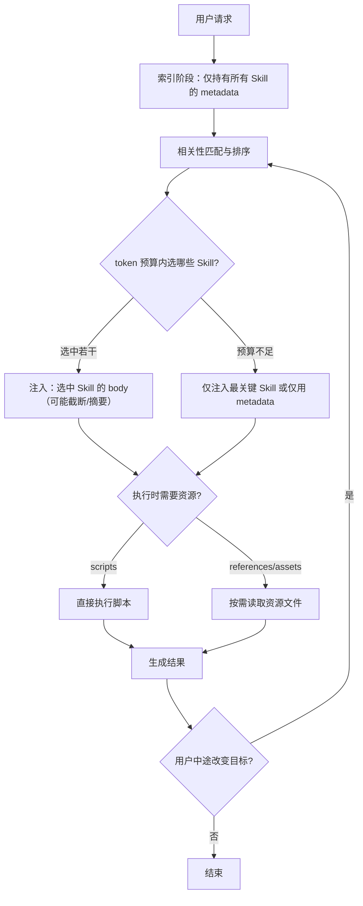

# 深度解析 Agent Skills：AI Agent的模块化“技能包”与工程实践

在 AI Agent 的演进中，我们正从提示词工程走向模块化能力。Anthropic 推出的 **Agent Skills** 不是又一套提示词模板，而是一种标准化的、可复用的能力封装机制。

本文从架构设计、核心机制和工程落地三个角度，说明 Agent Skills 如何缓解上下文污染（Context Rot）问题，并支撑更可维护的 AI Agent系统。


*(图：Agent Skills 生态示意)*

## 一、背景与痛点：为什么我们需要“技能”？

在构建复杂 Agent 时，开发者通常面临两个核心矛盾：

1.  **上下文窗口的有限性 vs. 知识的无限性**：为了让 Agent 学会处理特定任务（如“分析财报”），我们需要塞入大量的 Prompt、规则和示例。但这会迅速消耗 Token，导致“上下文污染”，使模型在长对话中遗忘指令或产生幻觉。
2.  **静态知识 vs. 动态能力**：Projects（知识库）适合存储静态背景，MCP（模型上下文协议）适合连接外部工具，但缺乏一个中间层来定义“**如何使用这些工具完成特定流程**”的程序化知识。

Agent Skills 应运而生。它借鉴了人类“技能包”的概念，将**指令、代码和资源**封装在一个独立的模块中，并引入了**渐进式披露（Progressive Disclosure）** 机制，实现了能力的按需加载。

## 二、核心架构：解剖一个 Skill

从工程视角来看，一个 Skill 本质上是一个遵循特定协议的文件夹。其核心由三部分组成：

### 1. 入口与元数据：`SKILL.md`

这是 Skill 的“大脑”，采用了 **YAML Frontmatter + Markdown** 的双层结构：

```markdown
---
name: competitive-analysis  # 唯一标识
description: |              # 触发器与路由逻辑
  当用户需要分析竞争对手时使用此技能。
  输入包括公司名称或财报文件。
---

# 详细指令 (Markdown Body)
## 步骤 1：数据获取
...
## 步骤 2：分析框架
...
```

### 2. 执行层：`scripts/`

存放 Python、Bash 或 Node.js 脚本。与 MCP 不同，这些脚本是**自包含**的。模型通过工具调用（Tool Use）协议来执行这些脚本，而不是直接访问 Shell。这确保了沙箱隔离和安全性。

### 3. 知识层：`resources/` (or `references/`)

存放静态资源，如模板文件、PDF 文档或复杂的规则说明。这些资源默认不加载，只有在 `SKILL.md` 的指令中明确引用时才会被读取。

## 三、核心创新：渐进式披露机制 (Progressive Disclosure)

Agent Skills 最精妙的设计在于解决了 Token 效率问题。它将信息的加载分为三个层级：

1.  **Level 1：索引扫描 (Indexing)**
    Agent 启动时，仅读取所有 Skills 的 `YAML Frontmatter`（元数据）。这只需极少的 Token，让 Agent 知道自己“会什么”。

2.  **Level 2：指令注入 (Instruction Loading)**
    当用户的 Prompt 触发了某个 Skill 的 `description` 时，系统才会将该 Skill 的 `Markdown Body`（详细指令）注入到当前上下文中。

3.  **Level 3：动态执行 (Dynamic Execution)**
    在执行过程中，如果需要查阅特定文档或运行脚本，Agent 才会进一步加载 `resources/` 下的文件或调用 `scripts/`。

这种**按需加载**（Lazy Loading）的策略，让 Agent 即使挂载成百上千个 Skills，也能在可控的上下文预算内高效工作，大幅缓解了 Context Window 的瓶颈。

## 四、生态位分析：Skills vs. Others

理解 Skills 的关键在于厘清它与其他组件的边界：

| 组件 | 核心隐喻 | 作用域 | 典型用例 |
| :--- | :--- | :--- | :--- |
| **Prompts** | **指令** | 单次对话 | "把这段话改写得更专业" |
| **Projects** | **背景** | 项目持久化 | "这是我们公司的编码规范文档" |
| **MCP** | **连接器** | 工具/数据源 | "连接到 GitHub API 或 MySQL 数据库" |
| **Skills** | **能力包** | 跨项目复用 | "**如何**审查代码并生成报告" |

**核心区别**：MCP 解决了“能不能连接”的问题，而 Skills 解决了“**怎么做**”的问题。Skills 往往包含了一系列对 MCP 工具的编排逻辑。

## 五、工程落地与最佳实践

在实际开发中，定义高质量的 Skill 需要遵循以下原则：

### 1. 依赖管理 (Dependency Management)
Skills 需要是自包含的。工程上通常采用两种方式：
*   **声明式**：在 `SKILL.md` 中明确列出 `pip install` 或 `npm install` 命令。
*   **自动化**：在 `scripts/` 下提供 `setup.sh` 或 `requirements.txt`。

### 2. 触发器前置 (Front-load Triggers)
在 `YAML description` 中，不仅要写功能描述，更要写**触发场景**（Trigger Phrases）。
*   *Bad*: "一个分析数据的工具。"
*   *Good*: "当用户要求'分析财报'、'提取关键指标'或'对比增长率'时使用此技能。"

### 3. 代码即工具
不要在 `SKILL.md` 中粘贴大量代码。应将复杂逻辑封装为 `scripts/` 下的脚本，仅在 Markdown 中通过伪代码描述调用流程。这既节省了 Token，又利用了解释器比 LLM 更擅长精确计算的特性。

## 六、实现细节：SKILL.md 的解析与校验

很多人会把“Skill 的渐进式加载”想象成一个黑盒，其实工程上主要是两层逻辑的组合：**格式约束（便于可靠解析）** + **宿主产品的注入策略（决定何时加载哪些内容）**。

### 1. Frontmatter 的“可解析性”与字段白名单

在这个仓库里，`skills/skill-creator/scripts/quick_validate.py` 的校验逻辑体现了一个非常关键的工程取舍：Skill 的 YAML Frontmatter 不追求“灵活”，而追求“可控”。它只允许 5 个顶层字段：

- `name`（必需）
- `description`（必需）
- `license`（可选）
- `allowed-tools`（可选）
- `metadata`（可选，作为扩展口）

这意味着如果你想扩展字段，不应该在顶层随意加 key，而是把扩展信息放进 `metadata` 这个 map 里。否则会被校验脚本判定为不合法。

### 2. 解析方式：正则切分 + YAML 解析

`quick_validate.py` 使用正则从文件头提取 `--- ... ---` 的 frontmatter，再用 `yaml.safe_load` 解析成字典对象，然后做 name/description 的约束检查（如 hyphen-case、长度限制、禁止尖括号等）。这种实现的好处是：

- 快：启动扫描阶段只读少量文本
- 稳：把“结构化元数据”从“自由文本指令”中分离出来，减少解析歧义

### 3. 打包链路：验证前置

`skills/skill-creator/scripts/package_skill.py` 在打包 `.skill`（zip）之前会强制调用 `validate_skill`。这是一种“左移质量”的设计：把格式错误拦截在分发前，而不是运行时才发现某个 Skill 无法被索引。

## 七、多 Skill 触发、上下文膨胀与“卸载”问题

核心三个问题：

1) “description 触发后，body 才注入上下文”这句话是否严格成立？  
2) 如果多个 Skill 同时触发，会不会导致超长上下文？  
3) Skill1 注入后想切换到 Skill2，怎么卸载 Skill1？

下面给出更工程化、也更接近真实系统行为的答案。

### 1) “触发才注入 body”是**常见实现**，但不是规范强制

Agent Skills Spec 只规定了 Skill 的**文件结构**（必须有 `SKILL.md`，且以 YAML Frontmatter 开头），并没有强制约束“宿主必须怎么把内容拼进 prompt”。  
“先扫描 metadata，匹配后再加载 body”这一做法，通常是 **Claude Code / Desktop / 其他 Agent 宿主** 为了节省 token、提高路由效率而采用的策略，也正是“渐进式披露”的具体体现。

因此更精确的表述应该是：

- 规范层：定义 `SKILL.md` 的结构，让宿主可以可靠抽取 `name/description/...`。
- 产品层：宿主通常只常驻 `name+description`，在判断“确实需要”时才注入 body 与资源。

### 2) 多个 Skill 同时触发怎么办？会不会超长？

真实系统里一般不会“匹配到就全注入”，原因很简单：上下文预算是硬约束。常见做法是：

- **检索与排序**：基于用户请求对所有 Skill metadata 做相关性匹配，得到候选集合。
- **预算约束下的选择**：在 token budget 内选择 top-k（或分阶段选择），必要时对 Skill body 做截断/摘要，或者只注入其中最关键段落。
- **尽量把重内容移到 resources/scripts**：脚本可以直接执行（不必全文注入），references 按需读取，从而把“信息”从上下文搬到“外部资源”。

所以答案是：

- 会不会超长？在极端情况下可能，但这通常意味着宿主的“选择策略 / 预算控制”做得不够好。
- 设计上怎么避免？限制 body 规模、让 description 更精准、把细节下沉到 references/、把确定性逻辑下沉到 scripts/。

### 3) Skill1 注入后怎么“卸载”？——多数系统里**不存在真正的卸载**

这里要分清楚两层“上下文”：

- **模型上下文（prompt）**：对一次推理来说，已经发送给模型的 token 无法撤销，理论上“卸载”不了，只能通过新增指令改变优先级，或者开启新的推理轮次。
- **宿主的注入策略（下一轮是否继续注入）**：宿主完全可以在后续回合不再注入 Skill1 的 body，而只注入 Skill2。此时 Skill1 的内容仍可能存在于对话历史里，但不再是“当前执行策略”的主导指令。

工程上的常见切换方式有三种：

1. **下一轮重路由**：用户明确表示“改用 Skill2”，宿主重新做一次匹配与注入，后续只注入 Skill2。  
2. **显式覆盖**：在系统 / 开发者层或新的 Skill2 body 中加入“忽略之前某 Skill 的流程，以下以新流程为准”的覆盖性指令。  
3. **新会话 / 新 run**：对长链路任务，直接开启新的 run，把旧上下文留在历史中，避免持续膨胀。

下面给一个更贴近工程实现的流程图（把“预算控制 + 重路由”也画进去）：



## 八、总结

Agent Skills 标志着 AI 应用开发正在从“手工作坊”走向“工业化组装”。通过标准化的目录结构和渐进式加载机制，我们终于可以将复杂的业务逻辑封装为可复用、可分发、可维护的独立模块。

对于架构师而言，未来的工作将不再是反复调试 Prompt，而是设计合理的 Skill 边界，构建企业专属的“能力货架”。
