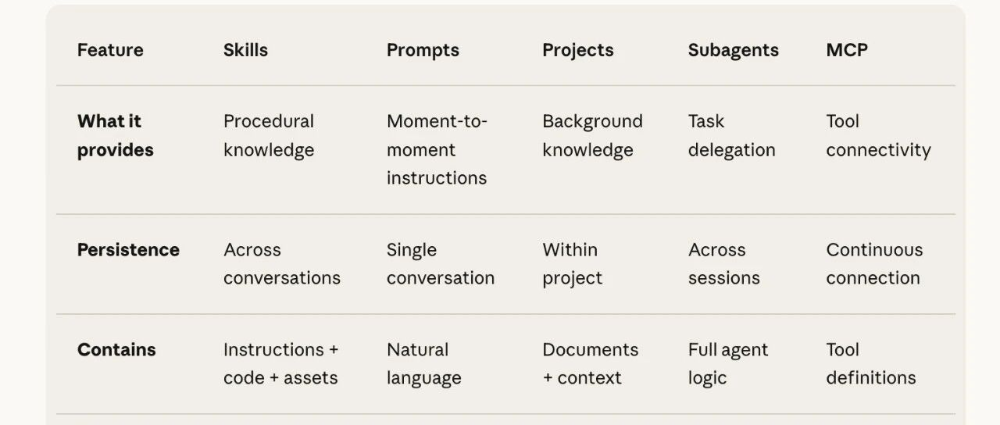
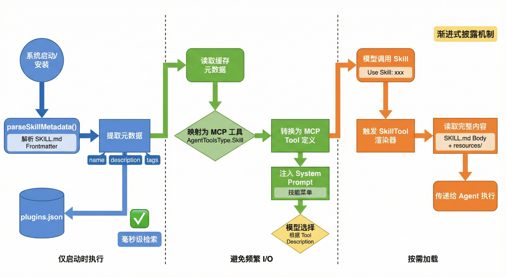
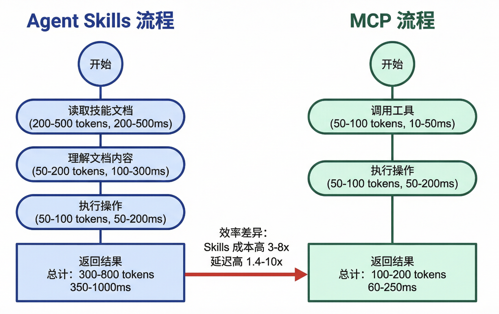
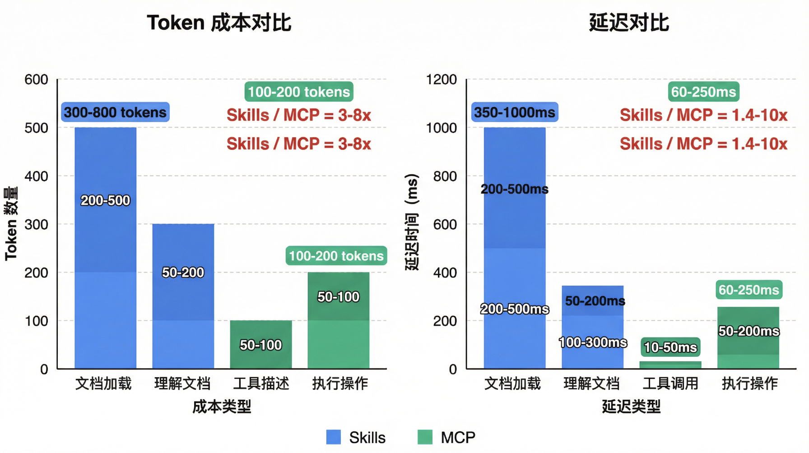
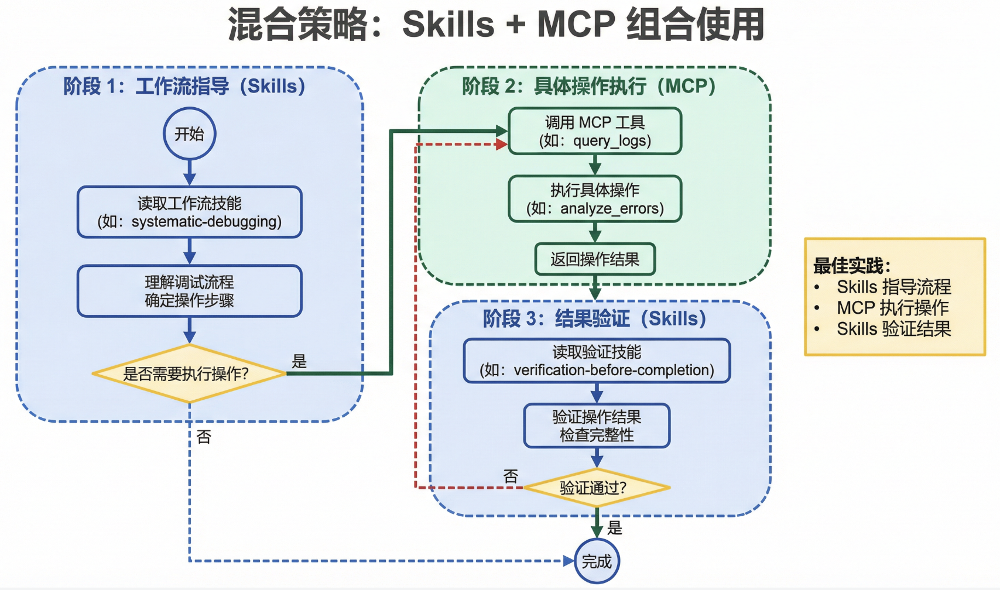
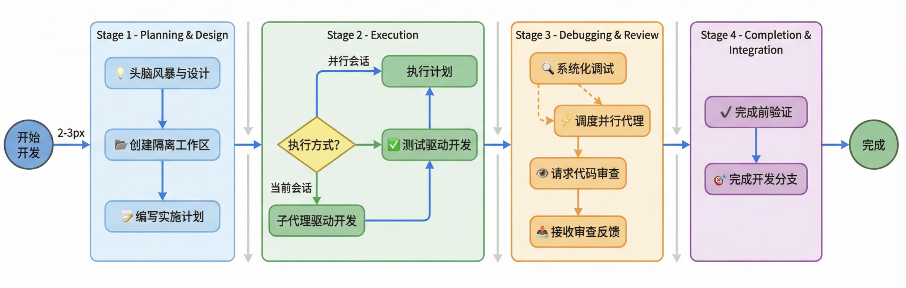
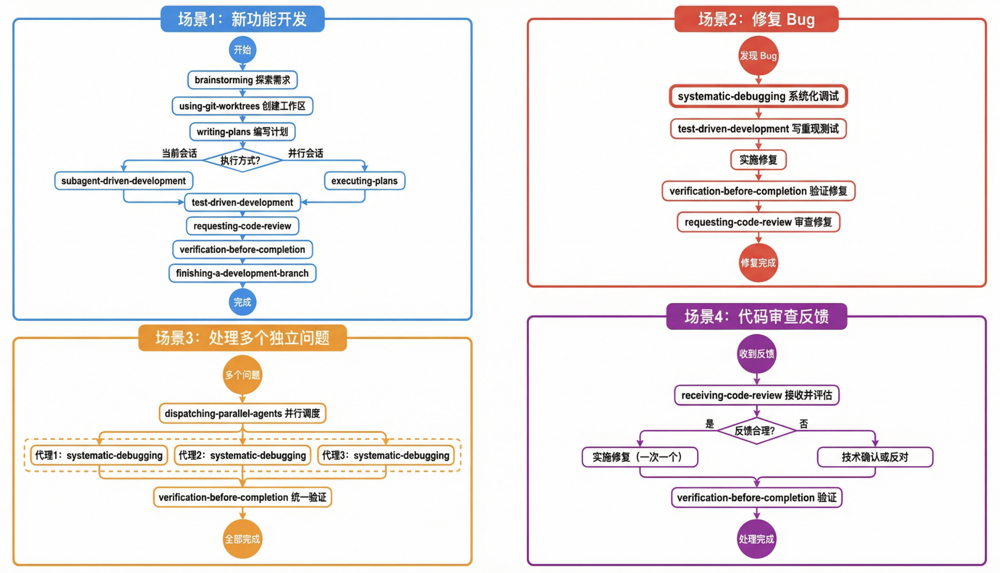
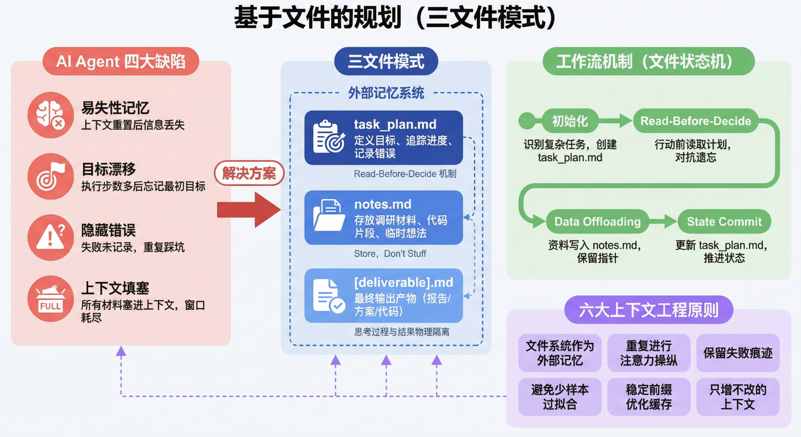

# Agent Skills vs MCP 与常见 Agent Skills 介绍

在 AI Agent 的演进中，我们正经历从简单的提示词工程向模块化、工程化能力封装的范式转变。Anthropic 推出的 **Agent Skills** 以及社区衍生出的 **Superpowers** 工作流系统，为构建复杂、可靠的 Agent 提供了全新的解决方案。

本文将深入解析 Agent Skills 的核心架构、Superpowers 的 TDD 工作流方法论、Planning with Files 的上下文管理机制，并详细对比 Skills 与 MCP 的适用边界与混合策略。

## 一、Agent Skills：打破上下文瓶颈的模块化架构

在构建复杂 Agent 时，开发者面临的核心矛盾是**上下文窗口的有限性**与**知识无限性**之间的冲突。为了让 Agent 学会特定任务，塞入大量 Prompt 会迅速消耗 Token，导致“上下文污染”（Context Rot）。

**Agent Skills** 应运而生。它不是又一套 Prompt 模板，而是一种标准化的能力封装机制。

### 1.1 解剖一个 Skill

从工程视角看，一个 Skill 是一个遵循特定协议的文件夹，包含三个核心部分：

1.  **入口与元数据 (`SKILL.md`)**：这是 Skill 的“大脑”，采用 `YAML Frontmatter` + `Markdown Body` 结构。YAML 定义了 `name` 和 `description`（触发逻辑），Markdown Body 定义了具体的执行指令。
2.  **执行层 (`scripts/`)**：存放 Python、Bash 或 Node.js 脚本。这些脚本是**自包含**的，通过工具调用协议执行，确保沙箱隔离。
3.  **知识层 (`resources/`)**：存放静态资源（模板、PDF、规则说明），默认不加载，仅在需要时引用。

### 1.2 渐进式披露机制 (Progressive Disclosure)

Agent Skills 解决了 Token 效率问题，其核心在于**按需加载**：

1.  **Level 1：索引扫描**：Agent 启动时，仅读取所有 Skills 的 `YAML Frontmatter`。这只需极少 Token，让 Agent 知道自己“会什么”。
2.  **Level 2：指令注入 (Instruction Loading)**：当用户 Prompt 触发某个 Skill 的 `description` 时，系统才将 `Markdown Body` 注入当前上下文。
3.  **Level 3：动态执行**：执行过程中，若需查阅文档或运行脚本，才进一步加载 `resources/` 或调用 `scripts/`。

这种机制使得 Agent 可以挂载成百上千个 Skills，而不会撑爆上下文窗口。

### 1.3 源码视角：宿主如何把 Skill 变成“可路由的工具”

概念层面讲“渐进式披露”很容易，但真正落地要解决三个工程问题：**怎么从 `SKILL.md` 抽元数据**、**怎么让模型在多技能里做选择**、**怎么避免每轮交互都加载长文档**。以开源 Agent 宿主（如 Cherry Studio）的实现为例，典型做法是：

**1. 元数据提取：只解析 Frontmatter，不吞全文**
*   **解析入口**：安装/扫描阶段通过类似 `parseSkillMetadata` 的函数读取 `SKILL.md`，提取 `name`、`description` 等字段，生成结构化 `PluginMetadata`。
*   **语义边界**：对于 Skill，“文件名”语义往往是**文件夹名**而非 `.md` 文件名，这样一个 Skill 可以带 `resources/`、`scripts/` 等附件，而不是被限制成单文件。

**2. 元数据缓存：把“技能索引”持久化，避免重复解析**
*   **缓存介质**：将解析后的 Skill 元数据写入 Agent 工作目录下的缓存文件（例如 `.claude/plugins.json`），而不是只放在内存里。
*   **读取路径**：后续每次获取 Agent 信息或进入对话时，优先从缓存文件读取已安装插件列表；解析失败则降级为空列表但不中断运行。

**3. 工具化注入：模型看到的是“技能菜单”，不是技能全文**
*   **映射方式**：Skill 在宿主里会被映射为一种工具类型（例如 `AgentToolsType.Skill`），并被统一纳入 MCP 工具列表。
*   **注入粒度**：宿主将 `name/description/参数结构` 等信息拼装成工具定义注入 System Prompt，模型在每一轮对话里看到的是可用工具集合，并基于描述做路由决策。

**4. 调用时再展开：把长文档留到真正需要的那一刻**
*   **触发点**：当模型决定调用某个 Skill（工具调用里带上 `command` 等参数）时，宿主才会进入对应的执行/渲染链路。
*   **展开策略**：此时才按需读取更重的内容（可能是 `SKILL.md` 的 Body、引用的 `resources/`，或直接执行 `scripts/`），把“信息”从默认上下文挪到按需读取与可执行资产上。

## 二、Skills vs. MCP：静态指导与动态执行的博弈

理解 Skills 的关键在于厘清它与 MCP 的边界。

*   **Skills** 解决“**怎么做**”（How-to）：提供流程指导、最佳实践和思维框架。
*   **MCP** 解决“**有什么**”（What）：连接外部工具、数据库和实时数据源。

### 2.1 效率与场景对比

根据量化分析，Skills 与 MCP 在 Token 成本和延迟上存在显著差异：

*   **Token 成本**：Skills 通常需要加载文档（200-500 tokens）+ 理解（50-200 tokens），而 MCP 仅需工具描述（50-100 tokens）。Skills 的 Token 消耗是 MCP 的 **3-8 倍**。
*   **延迟**：Skills 需要文档加载和阅读理解过程，延迟通常是 MCP 的 **1.4-10 倍**。

基于此，我们可以得出明确的选择原则：

| 场景类型 | 推荐方案 | 原因 |
| :--- | :--- | :--- |
| **实时数据查询** | **MCP** | Skills 是静态文档，无法获取实时状态；MCP 直接连接数据源。 |
| **高频简单操作** | **MCP** | 简单操作（如文件读写）无需复杂指导，Skills 会造成 Token 浪费。 |
| **复杂计算** | **MCP** | 解释执行代码容易出错，MCP 可调用原生优化代码（如 C++ 图像处理）。 |
| **状态保持操作** | **MCP** | Skills 无状态，MCP 工具可维护会话级状态（如断点续传）。 |
| **工作流指导** | **Skills** | 固化最佳实践、多步骤决策流程，AI 需要理解“为什么”做。 |

### 2.2 最佳实践：混合策略

最强大的 Agent 往往是 Skills 与 MCP 的组合：

1.  **Skills** 作为“指挥官”，负责流程编排和策略制定。
2.  **MCP** 作为“执行官”，负责具体操作和数据获取。

例如，在 `systematic-debugging` Skill 中，Agent 遵循 Skill 定义的“根因分析 -> 假设验证”流程，但在执行每一步时，调用 `query_logs` 或 `run_test` 等 MCP 工具。

## 三、Superpowers：TDD 驱动的 Agent 工作流系统

Superpowers Skills 是一套经过实战验证的高级 Agent 工作流系统，其核心理念是将**测试驱动开发（TDD）** 应用于 Prompt 和文档编写。

### 3.1 编写技能的方法论

**编写技能 = 将 TDD 应用于流程文档**。

*   **RED（基线失败）**：在没有技能的情况下运行压力测试，记录 Agent 的错误行为和“合理化借口”。
*   **GREEN（最小实现）**：编写针对性的 Skill 文档，直接反驳那些借口，确保 Agent 遵守规则。
*   **REFACTOR（封堵漏洞）**：随着 Agent 找到新的绕过方式，不断更新文档，添加明确的反对意见。

### 3.2 核心工作流技能

Superpowers 定义了从需求到交付的完整闭环：

1.  **Brainstorming**：任何创意工作前的必选项。通过逐个提问、方案权衡，生成设计文档。
2.  **Writing-plans**：将设计转化为 2-5 分钟粒度的可执行任务计划。
3.  **Execution**：
    *   `subagent-driven-development`：在当前会话中，为每个任务分派子 Agent，适合快速迭代。
    *   `executing-plans`：在并行会话中批量执行任务，适合大规模实现。
4.  **Test-Driven-Development**：任何功能实现前先写失败测试。
5.  **Systematic-Debugging**：遇到 Bug 时，强制执行“根因调查 -> 模式分析 -> 假设测试”流程，严禁猜测性修复。
6.  **Verification-before-completion**：在声称“完成”前，必须运行验证命令并检查输出。

### 3.3 强制触发原则

Superpowers 的一条铁律：**如果认为有 1% 的可能性某个技能适用，必须调用该技能。**

这避免了 AI 的“合理化”倾向——即当任务看似简单时，AI 往往会跳过必要的规范步骤（如先写测试）。

## 四、Planning with Files：解决上下文遗忘的“外挂内存”

Agent 在长任务中常面临 **Volatile Memory**（易失性记忆）和 **Goal Drift**（目标漂移）问题。`planning-with-files` Skill 引入了“三文件模式”，将文件系统作为 Agent 的外部记忆。

### 4.1 三文件协议

1.  **`task_plan.md`（指挥塔）**：
    *   **作用**：定义目标、拆解阶段、追踪进度、记录状态。
    *   **机制**：**Read-Before-Decide**。每一次关键行动前，Agent 必须先读取此文件，确认“我在哪、下一步干什么”，对抗遗忘。
2.  **`notes.md`（外部存储器）**：
    *   **作用**：存放调研材料、网页摘要、代码片段。
    *   **机制**：**Store, Don’t Stuff**。将大量资料落盘，只在 Context 中保留指针，防止上下文填塞。
3.  **`[deliverable].md`（最终交付物）**：
    *   **作用**：物理隔离“思考过程”与“最终结果”，便于复用与交付。

### 4.2 核心机制

这种模式本质上构建了一个 **File-Based State Machine**（基于文件的状态机）。通过不断更新 `task_plan.md` 中的状态（如将 `[ ]` 改为 `[x]`），Agent 即使在上下文重置后，也能从磁盘中恢复执行进度，实现长程任务的可靠交付。

## 五、实战落地：如何开发高质量 Skills

### 5.1 AI for AI

开发 Skill 的最佳实践是**默认让 AI 来写 Skill**。
1.  拉取官方 Skills 仓库作为参考。
2.  清晰描述需求和基线失败场景。
3.  让 Claude Opus/Sonnet 生成 `SKILL.md`。
4.  进行多模型测试（Haiku/Sonnet/Opus）。

### 5.2 工程原则

*   **依赖管理自包含**：在 `SKILL.md` 中声明依赖，或在 `scripts/` 中提供 `setup.sh`。
*   **触发器前置**：在 `description` 中不仅写功能，更要写明确的**触发场景**（Trigger Phrases）。
*   **代码即工具**：不要在 Markdown 中写复杂的伪代码逻辑，尽量下沉到 Python/Node.js 脚本中，利用解释器的精确性。
*   **格式规范**：遵循 YAML Frontmatter 规范，路径统一使用正斜杠 `/`，拒绝 Windows 反斜杠。

## 六、总结

Agent Skills 标志着 AI 应用开发正在从“手工作坊”走向“工业化组装”。

*   **Skills** 提供了标准化的能力封装与分发机制。
*   **Superpowers** 引入了 TDD 和严格的流程规范，保证了 Agent 的行为质量。
*   **Planning with Files** 解决了长程任务的记忆与注意力管理问题。
*   **MCP** 提供了强大的外部连接能力。

对于架构师和开发者而言，未来的核心工作将不再是反复调试 Prompt，而是设计合理的 Skill 边界，构建企业专属的“能力货架”，并灵活组合 Skills 与 MCP，打造出既聪明又可靠的 AI Agent。
