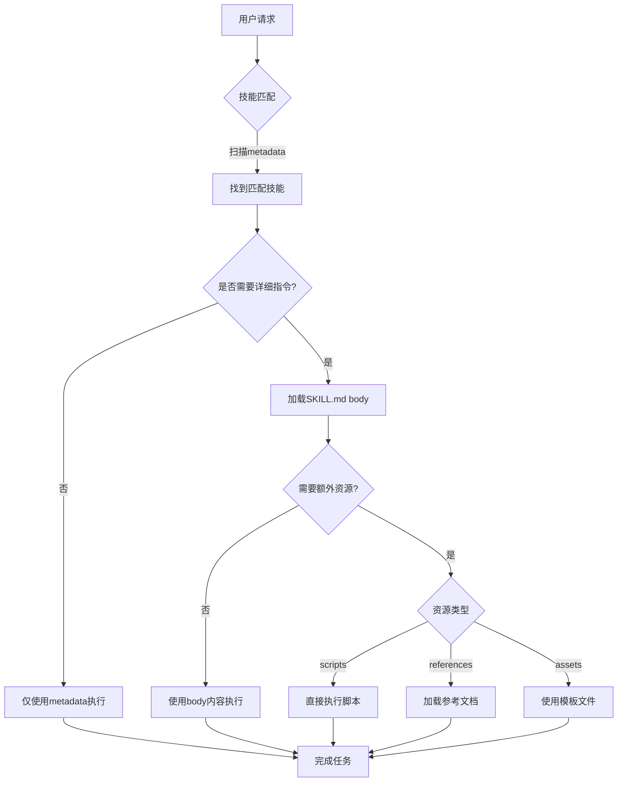
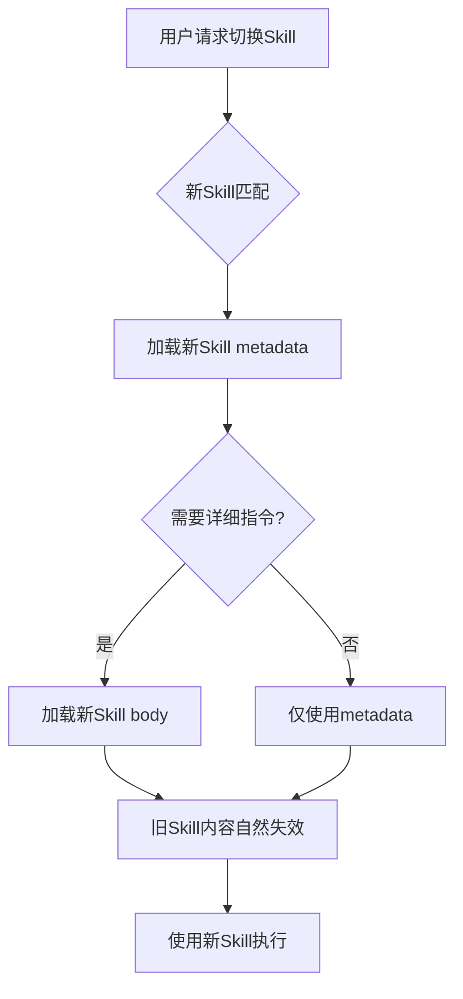

# me
我想知道，有些skill需要额外安装依赖，整体是怎么实现的？

# deepwiki
## Skill依赖管理的实现方式

Skills通过多种方式管理依赖安装，主要包括文档说明、脚本自动化和资源目录组织。

### 1. SKILL.md中的依赖声明

在`SKILL.md`文件中明确列出所需依赖，如PPTX skill所示：

```markdown
## Dependencies

Required dependencies (should already be installed):

- **markitdown**: `pip install "markitdown[pptx]"` (for text extraction from presentations)
- **pptxgenjs**: `npm install -g pptxgenjs` (for creating presentations via html2pptx)
- **playwright**: `npm install -g playwright` (for HTML rendering in html2pptx)
- **react-icons**: `npm install -g react-icons react react-dom` (for icons)
- **sharp**: `npm install -g sharp` (for SVG rasterization and image processing)
- **LibreOffice**: `sudo apt-get install libreoffice` (for PDF conversion)
- **Poppler**: `sudo apt-get install poppler-utils` (for pdftoppm to convert PDF to images)
- **defusedxml**: `pip install defusedxml` (for secure XML parsing)
``` [1](#0-0) 

### 2. 自动化安装脚本

通过`scripts/`目录中的脚本自动安装依赖，如web-artifacts-builder skill：

```bash
echo "📦 Installing shadcn/ui dependencies..."
pnpm install @radix-ui/react-accordion @radix-ui/react-aspect-ratio @radix-ui/react-avatar @radix-ui/react-checkbox @radix-ui/react-collapsible @radix-ui/react-context-menu @radix-ui/react-dialog @radix-ui/react-dropdown-menu @radix-ui/react-hover-card @radix-ui/react-label @radix-ui/react-menubar @radix-ui/react-navigation-menu @radix-ui/react-popover @radix-ui/react-progress @radix-ui/react-radio-group @radix-ui/react-scroll-area @radix-ui/react-select @radix-ui/react-separator @radix-ui/react-slider @radix-ui/react-slot @radix-ui/react-switch @radix-ui/react-tabs @radix-ui/react-toast @radix-ui/react-toggle @radix-ui/react-toggle-group @radix-ui/react-tooltip
pnpm install sonner cmdk vaul embla-carousel-react react-day-picker react-resizable-panels date-fns react-hook-form @hookform/resolvers zod
``` [2](#0-1) 

### 3. 资源目录组织

Skill-creator skill定义了标准的资源目录结构：

```
skill-name/
├── SKILL.md (required)
└── Bundled Resources (optional)
    ├── scripts/          - Executable code (Python/Bash/etc.)
    ├── references/       - Documentation intended to be loaded into context as needed
    └── assets/           - Files used in output (templates, icons, fonts, etc.)
``` [3](#0-2) 

### 4. 依赖安装指导

在相关文档中提供详细的安装步骤，如MCP-builder skill的evaluation文档：

```bash
pip install -r scripts/requirements.txt
export ANTHROPIC_API_KEY=your_api_key
``` [4](#0-3) 

## 实现机制总结

1. **声明式依赖管理**：在SKILL.md的YAML frontmatter和正文中明确声明依赖
2. **脚本自动化**：通过scripts目录中的shell脚本、Python脚本等自动处理依赖安装
3. **渐进式加载**：依赖信息按需加载，避免上下文窗口膨胀
4. **标准化结构**：统一的目录结构确保依赖管理的一致性

这种设计既保证了skill的自包含性，又提供了灵活的依赖管理方式，用户可以根据需要选择手动安装或使用自动化脚本。

## Notes

- 依赖管理主要通过文档说明和脚本自动化两种方式实现
- scripts目录中的可执行代码可以执行而无需加载到上下文窗口
- 所有skill都遵循相同的目录结构和依赖管理模式

Wiki pages you might want to explore:
- [Overview (anthropics/skills)](/wiki/anthropics/skills#1)

### Citations

**File:** skills/pptx/SKILL.md (L473-484)
```markdown
## Dependencies

Required dependencies (should already be installed):

- **markitdown**: `pip install "markitdown[pptx]"` (for text extraction from presentations)
- **pptxgenjs**: `npm install -g pptxgenjs` (for creating presentations via html2pptx)
- **playwright**: `npm install -g playwright` (for HTML rendering in html2pptx)
- **react-icons**: `npm install -g react-icons react react-dom` (for icons)
- **sharp**: `npm install -g sharp` (for SVG rasterization and image processing)
- **LibreOffice**: `sudo apt-get install libreoffice` (for PDF conversion)
- **Poppler**: `sudo apt-get install poppler-utils` (for pdftoppm to convert PDF to images)
- **defusedxml**: `pip install defusedxml` (for secure XML parsing)
```

**File:** skills/web-artifacts-builder/scripts/init-artifact.sh (L271-273)
```shellscript
echo "📦 Installing shadcn/ui dependencies..."
pnpm install @radix-ui/react-accordion @radix-ui/react-aspect-ratio @radix-ui/react-avatar @radix-ui/react-checkbox @radix-ui/react-collapsible @radix-ui/react-context-menu @radix-ui/react-dialog @radix-ui/react-dropdown-menu @radix-ui/react-hover-card @radix-ui/react-label @radix-ui/react-menubar @radix-ui/react-navigation-menu @radix-ui/react-popover @radix-ui/react-progress @radix-ui/react-radio-group @radix-ui/react-scroll-area @radix-ui/react-select @radix-ui/react-separator @radix-ui/react-slider @radix-ui/react-slot @radix-ui/react-switch @radix-ui/react-tabs @radix-ui/react-toast @radix-ui/react-toggle @radix-ui/react-toggle-group @radix-ui/react-tooltip
pnpm install sonner cmdk vaul embla-carousel-react react-day-picker react-resizable-panels date-fns react-hook-form @hookform/resolvers zod
```

**File:** skills/skill-creator/SKILL.md (L51-62)
```markdown
```
skill-name/
├── SKILL.md (required)
│   ├── YAML frontmatter metadata (required)
│   │   ├── name: (required)
│   │   └── description: (required)
│   └── Markdown instructions (required)
└── Bundled Resources (optional)
    ├── scripts/          - Executable code (Python/Bash/etc.)
    ├── references/       - Documentation intended to be loaded into context as needed
    └── assets/           - Files used in output (templates, icons, fonts, etc.)
```
```

**File:** skills/mcp-builder/reference/evaluation.md (L553-558)
```markdown
2. **Install dependencies**:

```bash
pip install -r scripts/requirements.txt
export ANTHROPIC_API_KEY=your_api_key
```

# me
就会自动打开终端去执行吗？是模型具备这样的判断能力吗？

# deepwiki
## 模型执行机制说明

模型不会自动打开终端执行命令，而是通过工具调用机制来判断和执行脚本。

### 执行判断机制

模型具备判断何时需要执行脚本的能力，但这种判断基于以下机制：

1. **工具调用而非直接终端访问**：模型通过工具调用接口执行脚本，如`evaluation.py`中的工具调用循环 [1](#1-0) 

2. **脚本执行条件**：当skill包含可执行脚本时，模型会根据任务需求判断是否需要执行，如`webapp-testing` skill中的服务器管理脚本 [2](#1-1) 

### 具体实现方式

**脚本执行流程**：
```python
# 模型通过工具调用执行，而非直接终端
tool_result = await connection.call_tool(tool_name, tool_input)
``` [3](#1-2) 

**服务器管理示例**：
```python
# 启动服务器进程
process = subprocess.Popen(
    server['cmd'],
    shell=True,
    stdout=subprocess.PIPE,
    stderr=subprocess.PIPE
)
``` [4](#1-3) 

### 判断能力依据

模型的判断能力来源于：

1. **Skill描述**：通过`SKILL.md`中的description字段判断何时使用该skill [5](#1-4) 

2. **脚本设计原则**：scripts目录中的代码设计为"可以执行而无需加载到上下文窗口" [6](#1-5) 

3. **渐进式加载**：依赖信息按需加载，避免不必要的执行 [7](#1-6) 

## Notes

- 模型不直接访问终端，而是通过安全的工具调用接口
- 执行判断基于skill元描述和任务需求分析
- 所有脚本执行都通过标准化的工具调用机制进行
- 这种设计确保了安全性和可控性

Wiki pages you might want to explore:
- [Overview (anthropics/skills)](/wiki/anthropics/skills#1)

### Citations

**File:** skills/mcp-builder/scripts/evaluation.py (L109-121)
```python
    while response.stop_reason == "tool_use":
        tool_use = next(block for block in response.content if block.type == "tool_use")
        tool_name = tool_use.name
        tool_input = tool_use.input

        tool_start_ts = time.time()
        try:
            tool_result = await connection.call_tool(tool_name, tool_input)
            tool_response = json.dumps(tool_result) if isinstance(tool_result, (dict, list)) else str(tool_result)
        except Exception as e:
            tool_response = f"Error executing tool {tool_name}: {str(e)}\n"
            tool_response += traceback.format_exc()
        tool_duration = time.time() - tool_start_ts
```

**File:** skills/webapp-testing/scripts/with_server.py (L64-89)
```python
        # Start all servers
        for i, server in enumerate(servers):
            print(f"Starting server {i+1}/{len(servers)}: {server['cmd']}")

            # Use shell=True to support commands with cd and &&
            process = subprocess.Popen(
                server['cmd'],
                shell=True,
                stdout=subprocess.PIPE,
                stderr=subprocess.PIPE
            )
            server_processes.append(process)

            # Wait for this server to be ready
            print(f"Waiting for server on port {server['port']}...")
            if not is_server_ready(server['port'], timeout=args.timeout):
                raise RuntimeError(f"Server failed to start on port {server['port']} within {args.timeout}s")

            print(f"Server ready on port {server['port']}")

        print(f"\nAll {len(servers)} server(s) ready")

        # Run the command
        print(f"Running: {' '.join(args.command)}\n")
        result = subprocess.run(args.command)
        sys.exit(result.returncode)
```

**File:** skills/skill-creator/SKILL.md (L68-69)
```markdown
- **Frontmatter** (YAML): Contains `name` and `description` fields. These are the only fields that Claude reads to determine when the skill gets used, thus it is very important to be clear and comprehensive in describing what the skill is, and when it should be used.
- **Body** (Markdown): Instructions and guidance for using the skill. Only loaded AFTER the skill triggers (if at all).
```

**File:** skills/skill-creator/SKILL.md (L79-80)
```markdown
- **Benefits**: Token efficient, deterministic, may be executed without loading into context
- **Note**: Scripts may still need to be read by Claude for patching or environment-specific adjustments
```

**File:** skills/skill-creator/SKILL.md (L116-120)
```markdown
Skills use a three-level loading system to manage context efficiently:

1. **Metadata (name + description)** - Always in context (~100 words)
2. **SKILL.md body** - When skill triggers (<5k words)
3. **Bundled resources** - As needed by Claude (Unlimited because scripts can be executed without reading into context window)
```


# me
skill.md文件整体包括几个部分结构？我知道有name desc还有呢？能自己扩展吗？是不是有专门的代码去解析skill.md成标准的结构化json文件，然后实现渐进式加载？说到渐进式加载（是不是实际就是懒加载？）到底分了多少层渐进？在什么情况下才渐进？给出具体的mermaid流程图

# deepwiki
## SKILL.md文件结构与渐进式加载机制

### SKILL.md完整结构

SKILL.md文件包含两个主要部分：

**1. YAML Frontmatter（必需）**
- `name` (必需): 技能标识符，使用hyphen-case格式 [1](#2-0) 
- `description` (必需): 完整描述技能功能和触发条件 [2](#2-1) 
- `license` (可选): 许可证信息 [3](#2-2) 
- `allowed-tools` (可选): 预批准工具列表 [4](#2-3) 
- `metadata` (可选): 扩展键值对 [4](#2-3) 

**2. Markdown Body（必需）**
- 技能说明、使用指南、示例等具体内容 [5](#2-4) 

### 扩展性

可以通过`metadata`字段进行扩展，支持任意键值对 [4](#2-3) 。验证代码明确允许这5个属性，其他字段会导致验证失败 [6](#2-5) 。

### 解析机制

有专门的解析代码：
- `quick_validate.py`: 解析YAML frontmatter并验证格式 [7](#2-6) 
- `package_skill.py`: 在打包前调用验证 [8](#2-7) 
- 使用正则表达式提取frontmatter，然后用yaml.safe_load解析 [9](#2-8) 

### 渐进式加载（懒加载）机制

确实是懒加载，分为三层 [10](#2-9) ：

1. **Metadata层** (~100词): 始终在上下文中，用于技能匹配
2. **SKILL.md body层** (<5k词): 技能触发时加载
3. **Bundled resources层**: 按需加载，脚本可直接执行无需读入上下文

### 渐进式加载流程图



### 渐进触发条件

1. **Metadata始终加载**: 用于技能识别和匹配 [11](#2-10) 
2. **Body加载条件**: 当技能被触发且需要详细指令时 [12](#2-11) 
3. **Resources加载条件**: Claude根据任务需求判断是否需要额外资源 [13](#2-12) 

这种设计确保了上下文窗口的高效利用，避免加载不必要的信息 [14](#2-13) 。

## Notes

- SKILL.md严格限制为5个YAML字段，通过metadata扩展
- 渐进式加载确实是懒加载实现
- 三层加载机制优化了上下文窗口使用
- 脚本可以直接执行，是唯一不需要加载到上下文的资源类型

Wiki pages you might want to explore:
- [Overview (anthropics/skills)](/wiki/anthropics/skills#1)

### Citations

**File:** skills/skill-creator/SKILL.md (L29-31)
```markdown
The context window is a public good. Skills share the context window with everything else Claude needs: system prompt, conversation history, other Skills' metadata, and the actual user request.

**Default assumption: Claude is already very smart.** Only add context Claude doesn't already have. Challenge each piece of information: "Does Claude really need this explanation?" and "Does this paragraph justify its token cost?"
```

**File:** skills/skill-creator/SKILL.md (L55-56)
```markdown
│   │   ├── name: (required)
│   │   └── description: (required)
```

**File:** skills/skill-creator/SKILL.md (L68-70)
```markdown
- **Frontmatter** (YAML): Contains `name` and `description` fields. These are the only fields that Claude reads to determine when the skill gets used, thus it is very important to be clear and comprehensive in describing what the skill is, and when it should be used.
- **Body** (Markdown): Instructions and guidance for using the skill. Only loaded AFTER the skill triggers (if at all).

```

**File:** skills/skill-creator/SKILL.md (L116-121)
```markdown
Skills use a three-level loading system to manage context efficiently:

1. **Metadata (name + description)** - Always in context (~100 words)
2. **SKILL.md body** - When skill triggers (<5k words)
3. **Bundled resources** - As needed by Claude (Unlimited because scripts can be executed without reading into context window)

```

**File:** skills/internal-comms/SKILL.md (L4-4)
```markdown
license: Complete terms in LICENSE.txt
```

**File:** skills/skill-creator/scripts/quick_validate.py (L26-39)
```python
    # Extract frontmatter
    match = re.match(r'^---\n(.*?)\n---', content, re.DOTALL)
    if not match:
        return False, "Invalid frontmatter format"

    frontmatter_text = match.group(1)

    # Parse YAML frontmatter
    try:
        frontmatter = yaml.safe_load(frontmatter_text)
        if not isinstance(frontmatter, dict):
            return False, "Frontmatter must be a YAML dictionary"
    except yaml.YAMLError as e:
        return False, f"Invalid YAML in frontmatter: {e}"
```

**File:** skills/skill-creator/scripts/quick_validate.py (L42-42)
```python
    ALLOWED_PROPERTIES = {'name', 'description', 'license', 'allowed-tools', 'metadata'}
```

**File:** skills/skill-creator/scripts/quick_validate.py (L44-50)
```python
    # Check for unexpected properties (excluding nested keys under metadata)
    unexpected_keys = set(frontmatter.keys()) - ALLOWED_PROPERTIES
    if unexpected_keys:
        return False, (
            f"Unexpected key(s) in SKILL.md frontmatter: {', '.join(sorted(unexpected_keys))}. "
            f"Allowed properties are: {', '.join(sorted(ALLOWED_PROPERTIES))}"
        )
```

**File:** skills/skill-creator/scripts/package_skill.py (L47-54)
```python
    # Run validation before packaging
    print("🔍 Validating skill...")
    valid, message = validate_skill(skill_path)
    if not valid:
        print(f"❌ Validation failed: {message}")
        print("   Please fix the validation errors before packaging.")
        return None
    print(f"✅ {message}\n")
```


# me
当用户的 Prompt 触发了某个 Skill 的 description 时，系统才会将该 Skill 的 Markdown Body（详细指令）注入到当前上下文中，是这样吗？如果是这样，当触发多个skill怎么办？还是会出现超长上下文吗？还有如果用户在当前skill1的指令注入后，如果执行过程打断了，又不要这个skill1，需要skill2怎么办？怎么卸掉skill1？


# deepwiki
## Skill触发与上下文管理机制

你的理解基本正确。当用户的Prompt触发某个Skill的description时，系统才会将该Skill的Markdown Body注入到上下文中 [1](#3-0) 。

### 多Skill触发处理

**触发机制**：
- 系统首先扫描所有Skill的metadata（name + description）进行匹配 [2](#3-1) 
- 匹配成功后才加载对应的SKILL.md body内容

**多Skill情况**：
从现有代码看，系统设计上考虑了上下文窗口限制：
- SKILL.md body建议控制在5k词以内 [3](#3-2) 
- 采用渐进式加载避免同时加载过多内容
- 但代码中未明确说明多个Skill同时触发的具体处理逻辑

### 上下文长度控制

系统通过以下机制控制上下文长度：
1. **分层加载**：metadata始终加载（~100词），body按需加载（<5k词） [4](#3-3) 
2. **资源分离**：scripts可直接执行无需读入上下文，references按需加载 [5](#3-4) 
3. **简洁原则**：强调"上下文窗口是公共资源"，要求Skill保持简洁 [6](#3-5) 

### Skill切换与卸载

**关于Skill卸载机制**：
现有代码中未明确描述Skill的卸载机制。基于渐进式加载设计推断：



**可能的处理方式**：
1. **自然替换**：新Skill的body加载后，旧Skill内容在上下文中自然被"推远"
2. **上下文窗口管理**：系统可能通过上下文窗口限制自动管理旧内容
3. **显式切换**：用户明确要求切换时，系统可能优先加载新Skill

## Notes

- 多Skill同时触发的具体处理逻辑在现有代码中未明确说明
- Skill卸载机制的具体实现细节需要更多系统级代码信息
- 渐进式加载设计确实有助于控制上下文长度，但极端情况下仍可能出现超长上下文
- 实际的多Skill管理和卸载可能依赖于Claude的上下文管理策略，而非Skill系统本身

Wiki pages you might want to explore:
- [Overview (anthropics/skills)](/wiki/anthropics/skills#1)

Wiki pages you might want to explore:
- [Overview (anthropics/skills)](/wiki/anthropics/skills#1)

### Citations

**File:** skills/skill-creator/SKILL.md (L29-31)
```markdown
The context window is a public good. Skills share the context window with everything else Claude needs: system prompt, conversation history, other Skills' metadata, and the actual user request.

**Default assumption: Claude is already very smart.** Only add context Claude doesn't already have. Challenge each piece of information: "Does Claude really need this explanation?" and "Does this paragraph justify its token cost?"
```

**File:** skills/skill-creator/SKILL.md (L116-121)
```markdown
Skills use a three-level loading system to manage context efficiently:

1. **Metadata (name + description)** - Always in context (~100 words)
2. **SKILL.md body** - When skill triggers (<5k words)
3. **Bundled resources** - As needed by Claude (Unlimited because scripts can be executed without reading into context window)

```
