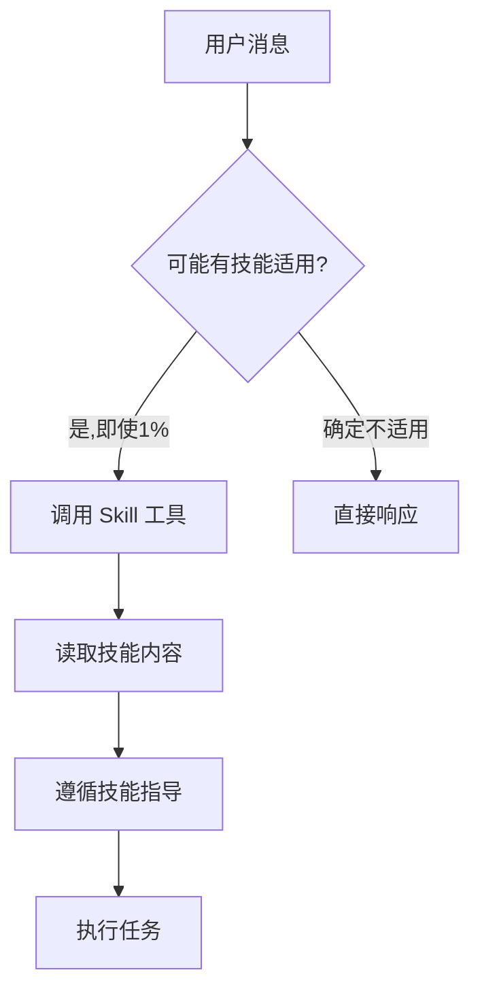
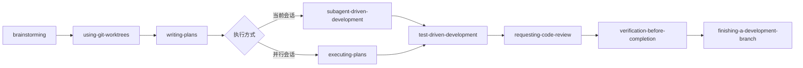

# Superpowers Skills：AI 辅助开发的工作流系统实践

## 引言

Superpowers Skills 是一套面向 Cursor 和 Claude Code 的 AI 辅助开发工作流系统，通过结构化的技能（Skills）将最佳实践固化为可复用的指导文档。与传统的提示词工程不同，Skills 采用**测试驱动开发（TDD）**的方法论来编写，确保每个技能都经过实际场景验证，能够可靠地指导 AI 完成复杂开发任务。

本文将从系统架构、技能编写方法论、核心工作流实践三个维度，为使用 Cursor/Claude Code 的开发者提供完整的实践指南。

## 系统架构：技能如何被发现和使用

### 技能发现机制

Skills 采用 **渐进式加载（Progressive Disclosure）** 架构：

1. **元数据预加载**：启动时仅加载所有技能的 `name` 和 `description`（YAML frontmatter）
2. **按需读取**：当 AI 判断某个技能可能适用时，才读取完整的 `SKILL.md` 文件
3. **深度引用**：大型参考文档、工具脚本等仅在需要时加载

这种设计使得系统可以管理 100+ 技能而不占用过多上下文窗口。每个技能的描述字段至关重要——它决定了 AI 何时会触发该技能。

### 技能触发原则

核心原则：**如果认为有 1% 的可能性某个技能适用，必须调用该技能**。



这个看似严格的规则实际上避免了 AI 的"合理化"倾向——当任务看似简单时，AI 可能会跳过必要的流程步骤。

## 技能编写方法论：TDD 应用于文档

### 核心理念

**编写技能 = 将 TDD 应用于流程文档**。与传统代码的 TDD 循环对应：

| TDD 概念 | 技能创建 |
|---------|---------|
| 测试用例 | 压力场景（使用子代理） |
| 生产代码 | 技能文档（SKILL.md） |
| 测试失败（RED） | 无技能时违反规则（基线行为） |
| 测试通过（GREEN） | 有技能时遵守规则 |
| 重构 | 关闭漏洞同时保持合规 |

### RED-GREEN-REFACTOR 循环

#### RED：编写失败测试（基线）

在编写技能之前，必须先用子代理运行压力场景，**观察无技能时的失败行为**：

- 记录代理做出的选择
- 记录使用的合理化借口（verbatim）
- 识别哪些压力触发了违规

**关键原则**：如果没有看到代理失败，就不知道技能是否教对了。

#### GREEN：编写最小技能

针对基线测试中发现的具体问题编写技能：

- 直接回应那些合理化借口
- 不要为假设情况添加额外内容
- 运行相同场景验证代理现在遵守规则

#### REFACTOR：关闭漏洞

当代理找到新的合理化借口时：

- 添加明确的反对意见
- 重新测试直到无懈可击
- 构建合理化表格和"危险信号"列表

### 描述字段的陷阱

**关键发现**：描述字段只应说明**何时使用**，不应总结**工作流程**。

测试发现，当描述包含工作流程摘要时，AI 可能会遵循描述而不是读取完整技能内容。例如，描述说"任务间进行代码审查"，AI 可能只做一次审查，而技能正文明确要求两阶段审查（规范符合性 + 代码质量）。

**正确做法**：
```yaml
# ✅ 正确：只描述触发条件
description: Use when executing implementation plans with independent tasks in the current session

# ❌ 错误：包含工作流程摘要
description: Use when executing plans - dispatches subagent per task with code review between tasks
```

### 技能结构最佳实践

**目录结构**：
```
skill-name/
├── SKILL.md              # 主文档（必需）
├── reference.md          # 大型参考（可选，>100行）
├── examples.md           # 使用示例（可选）
└── scripts/             # 工具脚本（可选）
    └── helper.py
```

**SKILL.md 结构**：
- YAML frontmatter：仅 `name` 和 `description`（总计 <1024 字符）
- Overview：核心原则 1-2 句话
- When to Use：触发条件和症状
- Core Pattern：技术/模式说明
- Quick Reference：快速参考表
- Implementation：内联代码或链接到文件
- Common Mistakes：常见错误及修复

**Token 效率**：
- 入门工作流：<150 词
- 频繁加载技能：<200 词
- 其他技能：<500 词

使用交叉引用、压缩示例、消除冗余来保持简洁。

## 核心工作流实践

### 完整开发流程

Superpowers Skills 定义了从需求到交付的完整工作流：



### 关键技能对比

#### 1. brainstorming vs writing-plans

**brainstorming**：
- **时机**：任何创意工作前（新功能、组件、行为修改）
- **输出**：设计文档（`docs/plans/YYYY-MM-DD-<topic>-design.md`）
- **方法**：逐个提问、提出 2-3 种方案、分段呈现设计

**writing-plans**：
- **时机**：有规格说明后，编码前
- **输出**：详细实施计划（任务粒度 2-5 分钟）
- **方法**：假设工程师零上下文，提供文件路径、代码、测试、验证命令

**关系**：brainstorming 产生设计 → writing-plans 将设计转化为可执行任务。

#### 2. subagent-driven-development vs executing-plans

两者都用于执行实施计划，但适用场景不同：

| 维度 | subagent-driven-development | executing-plans |
|------|---------------------------|----------------|
| **会话** | 当前会话 | 并行会话 |
| **审查频率** | 每个任务后立即审查（两阶段） | 批次间审查（默认 3 个任务） |
| **迭代速度** | 更快（无人工介入延迟） | 较慢（批次间需人工审查） |
| **适用场景** | 任务相对独立，需要快速迭代 | 批量执行，适合长时间任务 |

**选择指南**：
- 任务独立 + 当前会话 → `subagent-driven-development`
- 批量执行 + 并行会话 → `executing-plans`

#### 3. systematic-debugging vs test-driven-development

**systematic-debugging**：
- **核心原则**：先找根因，再修复（禁止症状修复）
- **四阶段**：根因调查 → 模式分析 → 假设与测试 → 实施修复
- **适用**：任何 bug、测试失败、意外行为

**test-driven-development**：
- **核心原则**：先写失败测试，再写最小实现
- **循环**：RED（写失败测试）→ GREEN（最小实现）→ REFACTOR（重构）
- **适用**：新功能、bug 修复、重构、行为变更

**关系**：debugging 找到根因 → TDD 编写修复（先测试后实现）。

### 技能优先级

当多个技能可能适用时，按以下顺序：

1. **流程技能优先**（brainstorming, debugging）——决定**如何**处理任务
2. **实施技能其次**（frontend-design, mcp-builder）——指导**执行**

示例：
- "构建 X" → brainstorming 先，然后实施技能
- "修复 bug" → debugging 先，然后领域特定技能

## 最佳实践总结

### 技能编写

1. **遵循 TDD**：无失败测试，不写技能
2. **描述只写触发条件**：不总结工作流程
3. **保持简洁**：入门工作流 <150 词，其他 <500 词
4. **关闭所有漏洞**：记录合理化借口，添加明确反对
5. **测试所有模型**：Haiku、Sonnet、Opus 都要测试

### 技能使用

1. **强制触发原则**：1% 可能性也要调用技能
2. **遵循流程顺序**：不要跳过 brainstorming、debugging 等前置步骤
3. **验证完成**：声称完成前必须运行验证命令
4. **组合使用**：多个技能可以按顺序组合

### 技能选择与管理

基于实际使用经验，以下是技能库管理的实用建议：

**1. 渐进式安装，够用就好**

避免一次性安装大量技能。建议策略：
- **起步阶段**：先安装 2-3 个高频核心技能（如 `brainstorming`、`systematic-debugging`、`test-driven-development`）
- **熟练后扩展**：在熟悉核心技能后，根据实际需求逐步添加
- **原因**：技能过多会增加元数据加载负担，且容易产生选择困难

**2. 技能组合使用，效果倍增**

单个技能解决特定问题，组合使用可以产生协同效应：
- **示例组合**：`planning-with-files` + `ralph-wiggum`（文件规划 + 代码生成）
- **工作流组合**：`brainstorming` → `writing-plans` → `subagent-driven-development`
- **实践建议**：理解各技能的输出格式，设计技能间的数据流

**3. 定期清理，控制 Token 成本**

技能库需要定期维护：
- **清理标准**：3 个月未使用的技能考虑移除
- **Token 影响**：虽然采用渐进式加载，但元数据仍会预加载
- **维护频率**：建议每月检查一次技能使用情况

**4. 评估标准：看反馈不看 Stars**

选择技能时，关注实际使用反馈而非表面指标：
- **优先查看**：Issues 中的问题报告、社区讨论的实际使用案例
- **避免误区**：Stars 数量高不代表适合你的场景
- **验证方法**：在小规模项目中试用，观察是否符合预期

**5. 自定义技能，解决高频重复任务**

对于团队或个人的高频重复任务，创建自定义技能：
- **适用场景**：项目特定的代码规范、团队工作流、领域特定模式
- **工具支持**：使用 `skill-creator` 可以快速生成技能模板
- **成本收益**：一次投入，长期受益，且可以分享给团队

### 常见陷阱

| 陷阱 | 正确做法 |
|------|---------|
| "这个 bug 很简单，不需要系统化调试" | 简单 bug 也有根因，必须系统化调试 |
| "先快速修复，再写测试" | 先写失败测试，再修复 |
| "功能完成了"（未运行验证） | 运行验证命令，看输出，再声明完成 |
| 描述包含工作流程摘要 | 描述只写触发条件 |

## 结语

Superpowers Skills 系统通过将 TDD 方法论应用于流程文档，创建了一套经过实战验证的 AI 辅助开发工作流。其核心价值在于：

1. **可复用的最佳实践**：将经验固化为可发现、可执行的技能
2. **系统化的工作流**：从需求到交付的完整流程指导
3. **质量保证机制**：通过 TDD 确保技能的有效性

对于使用 Cursor/Claude Code 的开发者而言，理解并应用这套系统可以显著提升 AI 辅助开发的效率和代码质量。

**实践路径建议**：
1. **第一阶段**：安装 2-3 个核心工作流技能（brainstorming、systematic-debugging、test-driven-development），熟悉基本使用
2. **第二阶段**：根据项目需求添加领域特定技能，学习技能组合使用
3. **第三阶段**：为团队高频任务创建自定义技能，建立技能库管理体系

记住：技能是工具，关键在于理解其设计理念和使用场景。从简单开始，逐步扩展，定期优化，才能真正发挥 Skills 系统的价值。

---

**参考资源**：
- [Superpowers Skills 使用场景指南](SUPERPOWERS-SKILLS-GUIDE.md)
- [Writing Skills 技能文档](writing-skills/SKILL.md)
- [Anthropic 官方最佳实践](writing-skills/anthropic-best-practices.md)
