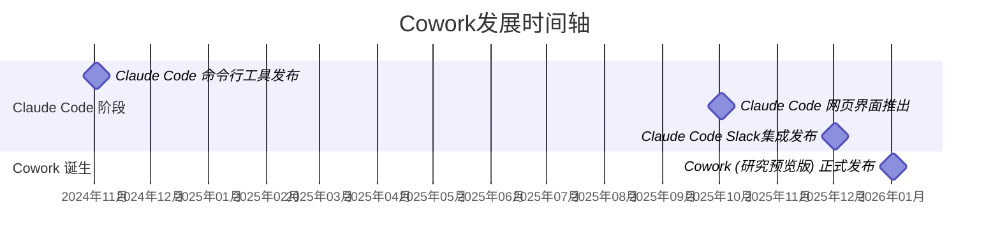
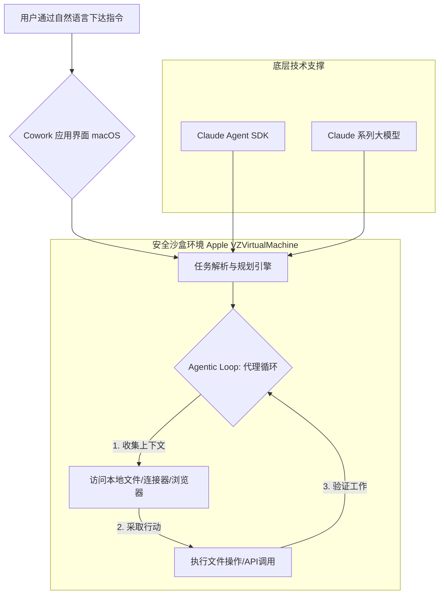

# Anthropic Cowork深度研究报告：从技术原理到企业级落地


## 执行摘要

Anthropic Cowork是Anthropic公司于2026年1月推出的一款创新性agent产品，标志着AI技术从被动的对话式助手向能够自主操作本地文件系统、主动与用户协作的“虚拟队友”的重大转变。该产品源于其开发者工具Claude Code的成功，旨在将强大的agent能力普及给更广泛的非技术用户。Cowork部署为macOS桌面应用，利用**Claude Agent SDK**和基于Apple **VZVirtualMachine**的沙盒环境，实现了对用户授权文件夹的安全读写与编辑，并支持多任务并行处理。

本报告对Anthropic Cowork进行了全面深入的研究，涵盖了其**发展历史、核心技术原理、代码实践与扩展方法、以及企业级落地研发规划**。报告发现，Cowork的核心优势在于其强大的代理能力、安全优先的设计理念（通过虚拟化技术实现沙盒隔离），以及对非技术用户的友好性。它直接挑战了微软Copilot等现有市场领导者，并可能重塑传统的SaaS市场格局。然而，作为一款处于“研究预览”阶段的产品，Cowork仍面临提示注入等安全挑战，且用户对AI自主操作的信任度仍需时间培养。

对于企业而言，Cowork既带来了效率提升的机遇，也提出了全新的管理要求。本报告建议企业采取**分阶段引入、制定严格的授权与审计机制、加强员工培训**等策略，并结合**Claude Agent SDK**进行深度定制开发，以稳妥、高效地将这一颠覆性技术整合到现有工作流中。

## 1. 发展历史与演进

Anthropic Cowork的诞生并非一蹴而就，而是对其前身产品Claude Code在实际应用中用户行为洞察的直接产物。这一演进过程清晰地反映了AI技术从服务于专业开发者向赋能广大知识工作者普及的战略路径。



*图1: Anthropic Cowork 发展历程关键节点*

Cowork的概念源于Anthropic对其开发者工具**Claude Code**使用模式的敏锐洞察。Claude Code于2024年末作为一款强大的命令行工具推出，最初旨在帮助开发者自动化编码任务。然而，Anthropic观察到，用户迅速将其应用范围扩展到各种非编码工作，如进行度假研究、制作幻灯片、整理文件、处理邮件等，这揭示了一个巨大的潜在市场需求：一个能够直接操作计算机的通用agent [[1]](https://venturebeat.com/technology/anthropic-launches-cowork-a-claude-desktop-agent-that-works-in-your-files-no)。

许多潜在用户虽然有此类需求，却不具备使用命令行工具的技术背景。为了消除这一技术壁垒，Anthropic在Claude Code的底层技术架构基础上进行了简化和封装，最终于2026年1月12日以“研究预览版”的形式推出了Cowork [[3]](https://www.sohu.com/a/975696104_121956424)。Anthropic将其生动地描述为“**为你其余工作准备的Claude Code**” (Claude Code for the rest of your work)，明确了其将agent能力从开发者普及至每一位知识工作者的产品定位 [[8]](https://dev.to/sivarampg/cowork-claude-code-for-the-rest-of-your-work-3hjp)。据报道，Cowork的大部分核心功能在约一个半星期内便开发完成，其中很可能大量使用了Claude Code本身进行开发，这不仅展示了Anthropic团队高效的执行力，也彰显了AI自我加速发展的惊人潜力 [[1]](https://venturebeat.com/technology/anthropic-launches-cowork-a-claude-desktop-agent-that-works-in-your-files-no)。

## 2. 技术原理深度剖析

Cowork的核心技术根植于Anthropic的**Claude Agent SDK**和一套精密设计的**沙盒执行环境**，这两者共同构成了其强大功能与安全保障的基石。Cowork并非一个独立的AI模型，而是与Claude Code共享相同的底层技术栈，可被视为其核心能力的图形化、用户友好型封装 [[18]](https://ppc.land/anthropic-opens-claude-codes-automation-power-to-everyone-with-cowork/)。



*图2: Anthropic Cowork 技术架构与工作流程*

### 2.1 代理能力 (Agentic Capabilities) 与代理循环 (Agentic Loop)

Cowork的智能行为源于其强大的“代理能力”。它不仅仅是一个简单的问答模型，而是一个能够作为智能代理，遵循**“收集上下文 → 采取行动 → 验证工作”**的代理循环，进行计划、执行、观察结果并迭代优化，直至达成最终目标 [[22]](https://byteiota.com/anthropic-cowork-brings-claude-code-to-non-technical-users/)。

- **任务规划与分解**: 收到复杂任务后（如“总结这份PDF报告并创建一个演示文稿”），Cowork能将其拆解为一系列具体的子任务（如：读取PDF、提炼要点、生成大纲、创建幻灯片），并协调其内部的多个子代理并行处理，实现高度自治的多步骤操作 [[5]](https://www.anthropic.com/engineering/building-agents-with-the-claude-agent-sdk)。
- **上下文持久化**: Cowork以用户指定的文件夹作为持久的上下文边界。它能将中间生成的文件（如报告摘要）直接写入该目录，并在后续步骤（如创建演示文稿）中再次调用这些文件，从而避免了传统AI助手需要用户反复手动上传下载、提供上下文的繁琐流程。
- **自主工具使用**: 借助Claude Agent SDK，Cowork能够动态地发现、学习和执行工具。这包括通过**程序化工具调用(Programmatic Tool Calling, PTC)**，让Claude自己编写Python代码来编排复杂的工具执行流，极大地提升了处理复杂任务的效率和准确性。

### 2.2 Claude Agent SDK

Claude Agent SDK是构建像Cowork这样的自主agent的核心工具集 [[5]](https://www.anthropic.com/engineering/building-agents-with-the-claude-agent-sdk)。与需要用户手动实现工具调用循环的客户端SDK（Client SDK）不同，Agent SDK赋予了Claude模型本身在计算机环境中执行文件写入、使用外部工具以及管理自主代理循环的能力。SDK在默认情况下以受限权限在临时目录中运行，这种设计从根本上增强了安全性。

### 2.3 沙盒执行环境 (Sandboxed Execution Environment)

安全是Cowork设计的重中之重，尤其是当AI需要操作本地文件时。为确保系统完整性和用户数据安全，Cowork采用了一套严密的多层“瑞士奶酪”防御体系 [[17]](https://encorp.ai/en/blog/anthropic-cowork-custom-ai-agents-files-2026-01-13) [[6]](https://elephas.app/blog/claude-cowork-review-alternatives) [[4]](https://baijiahao.baidu.com/s?id=1854162465227437747&wfr=spider&for=pc)。

- **虚拟化隔离**: Cowork在一个基于Apple `VZVirtualMachine`框架构建的**虚拟化Linux环境**（ARM64 Ubuntu 22.04）中运行。这个沙盒环境将AI的操作与主机macOS完全隔离，即使AI出现错误或执行了恶意指令，其影响也被严格限制在虚拟机内部，无法触及用户的核心系统文件。
- **文件系统访问控制**: AI只能在用户明确授权的特定文件夹内进行读、写、创建文件等操作。这是通过将用户指定的文件夹挂载到虚拟机内部的特定路径实现的。
- **网络隔离**: Cowork的网络访问也受到严格控制。它只能连接到经过批准的服务器，所有出站流量都通过一个本地代理进行限制，防止数据泄露或恶意软件下载。
- **进程与系统调用限制**: 在虚拟机内部，Cowork还可能利用如`bubblewrap`和`seccomp`等技术，进一步限制agent能够执行的进程权限和系统调用，构筑起层层防线。

### 2.4 工具与连接器生态

为了扩展其能力边界，Cowork集成了Claude现有的连接器生态系统以及“Claude in Chrome”浏览器扩展。这使其能够：
- **连接外部服务**: 与Asana, Notion, PayPal等第三方SaaS应用进行数据交互和操作 [[1]](https://venturebeat.com/technology/anthropic-launches-cowork-a-claude-desktop-agent-that-works-in-your-files-no)。
- **执行网页任务**: 访问互联网，执行导航网站、填写表单、从网页提取信息等需要浏览器环境的复杂任务 [[1]](https://venturebeat.com/technology/anthropic-launches-cowork-a-claude-desktop-agent-that-works-in-your-files-no)。

## 3. 初步代码实践与扩展方法

Cowork本身设计为一款无需编程即可使用的工具，其主要交互方式是自然语言。然而，对于希望扩展其功能、使其更好地融入特定工作流的开发者和高级用户而言，可以通过其底层的**技能 (Skills)** 和**连接器 (Connectors)** 机制进行深度定制和代码扩展。

### 3.1 通过“技能”进行功能扩展

“技能”是扩展Claude代理（包括Cowork）功能的核心机制，允许用户为AI定义特定的能力、工作流程和所需资源。当面对相应任务时，Cowork会自动发现并调用这些技能。

**实践方法：**
1.  **定义技能结构**: 技能通常通过在特定目录（如`.claude/skills/`）下创建符合规范的子目录来定义。每个子目录代表一个技能。
2.  **编写`SKILL.md`**: 这是技能的核心定义文件，使用Markdown格式编写，用于告诉Claude该技能的用途、何时调用、以及如何执行。其中可以包含指令、所需参数等。
3.  **提供自动化脚本**: 在技能目录中可以包含`CODE`文件夹，存放由`SKILL.md`中指令调用的自动化脚本，如Python或Shell脚本。

**概念代码示例：创建“月度销售报告生成”技能**

假设我们要创建一个技能，让Cowork能自动读取一个月的销售数据CSV文件，并生成一份Markdown格式的总结报告。

```plaintext
-- 技能目录结构 --
.claude/
  skills/
    generate_sales_report/
      ├── SKILL.md
      └── CODE/
          └── analyze_sales.py
```

**`SKILL.md` 文件内容示例:**

```markdown
# 技能: 月度销售报告生成

**描述:**
此技能用于读取指定的月度销售数据CSV文件，计算关键指标（总销售额、平均订单价值、销售冠军产品），并生成一份Markdown格式的总结报告。

**参数:**
- `csv_file_path`: (字符串, 必填) 包含销售数据的CSV文件的路径。

**指令:**
1. 接收 `csv_file_path` 参数。
2. 调用`CODE/analyze_sales.py`脚本，并将`csv_file_path`作为参数传递给它。
3. `analyze_sales.py`脚本将执行以下操作：
   a. 使用pandas库读取CSV文件。
   b. 计算总销售额、订单数、平均订单价值和销售量最高的产品。
   c. 将分析结果以JSON格式输出到标准输出。
4. 接收脚本输出的JSON数据。
5. 基于JSON数据，撰写一份结构化的Markdown销售报告，并将其保存为`sales_report_YYYY-MM.md`。
```

**`CODE/analyze_sales.py` 脚本（概念性）:**

```python
import pandas as pd
import sys
import json

def analyze_sales(file_path):
    df = pd.read_csv(file_path)
    total_sales = df['amount'].sum()
    order_count = df['order_id'].nunique()
    avg_order_value = total_sales / order_count if order_count > 0 else 0
    top_product = df.groupby('product_name')['quantity'].sum().idxmax()

    result = {
        'total_sales': total_sales,
        'order_count': order_count,
        'avg_order_value': avg_order_value,
        'top_product': top_product
    }
    print(json.dumps(result))

if __name__ == '__main__':
    analyze_sales(sys.argv[1])
```

### 3.2 通过“连接器”集成外部服务

“连接器”则赋予了Cowork超越本地文件系统的能力，使其能够与几乎任何外部应用程序、Web API和数据源进行交互，极大地拓宽了其应用边界 [[1]](https://venturebeat.com/technology/anthropic-launches-cowork-a-claude-desktop-agent-that-works-in-your-files-no)。

**实践方法：**

1.  **开发外部API**: 首先，你需要有一个暴露了清晰API的外部服务。这可以是一个你自己的应用（如公司内部的项目管理系统），也可以是一个公共的第三方服务（如天气API）。
2.  **创建API规范**: 使用OpenAPI (Swagger)等标准格式为你的API编写详细的规范文档。这将作为Claude理解和调用你的服务的“说明书”。
3.  **配置连接器**: 在Claude的生态中（可能通过其开发者平台或相关配置文件），你需要注册你的连接器，提供API规范的地址和必要的认证信息（如API Key）。这使得Cowork能够在执行相关任务时，将你的API作为一个可调用的“工具”。

**应用场景示例：集成公司项目管理系统**

通过为公司的Jira或类似系统创建一个连接器，你可以直接通过Cowork下达指令，如：“在‘Q3营销活动’项目中，创建一个名为‘设计新的社交媒体宣传图’的任务，截止日期是下周五”，Cowork将能通过调用相应的API来完成此操作，实现跨应用的无缝工作流。

## 4. 企业级落地研发规划与技术方案

将Cowork这样具备高度自主性的agent引入企业环境，既是提升生产力的巨大机遇，也伴随着数据安全、操作合规性等方面的挑战。因此，企业需要一套系统性的规划和技术方案来确保其平稳、安全、高效地落地。

### 4.1 分阶段引入策略

建议采用循序渐进的策略，以控制风险并充分评估其价值：

| 阶段 | 核心目标 | 主要活动 | 关键产出 |
| :--- | :--- | :--- | :--- |
| **第一阶段：试点探索 (1-3个月)** | 验证可行性，评估核心价值 | - 组建小范围试点团队（如IT、研发部门）。<br>- 严格限定AI可访问的非敏感数据文件夹。<br>- 专注于高重复性、低风险的办公任务（如文件归档、信息提取）。 | - Cowork在特定场景下的效用评估报告。<br>- 初步的安全风险分析。<br>- 员工使用反馈。 |
| **第二阶段：流程整合 (3-6个月)** | 将Cowork融入特定业务流程 | - 识别1-2个业务部门（如市场、销售），将其典型工作流与Cowork结合。<br>- 开发初步的自定义“技能”以适应部门需求。<br>- 建立操作审计与监控机制。 | - 定制化的工作流自动化方案。<br>- 完善的授权与审计策略文档。<br>- 投入产出比（ROI）分析。 |
| **第三阶段：全面推广与深度集成** | 在全公司范围推广，并进行系统级集成 | - 制定全员培训计划，推广最佳实践。<br>- 利用Claude Agent SDK开发与企业核心系统（ERP、CRM）深度集成的无头(Headless)代理。<br>- 建立AI治理委员会，持续优化策略。 | - 全面部署的AI助手解决方案。<br>- 与核心业务系统绑定的自动化流程。<br>- 长期AI战略规划。 |

### 4.2 核心技术方案

**1. 严格的授权与审计机制:**

企业必须建立一套健全的agent文件访问授权与审计系统 [[17]](https://encorp.ai/en/blog/anthropic-cowork-custom-ai-agents-files-2026-01-13)。
- **最小权限原则**: 确保agent仅能访问完成其特定任务所必需的最小范围的文件夹和数据。应采用基于角色的访问控制（RBAC）策略。
- **全面操作审计**: 实施全面的日志记录，追踪AI的每一次文件操作（读取、写入、创建、删除）、API调用和用户指令。这些日志应定期审查，以满足合规性要求（如GDPR、SOX）和内部安全审查。

**2. 员工培训与提示工程:**

对员工进行系统性培训是成功应用Cowork的关键。
- **清晰指令培训**: 重点培训员工如何编写清晰、明确、无歧义的提示语，以避免AI产生误解或执行错误操作。
- **安全意识教育**: 教育员工识别并防范潜在的“提示注入”攻击风险。例如，警惕处理来自不可信来源（如网页、邮件）的内容，这些内容可能包含诱使AI执行恶意操作的隐藏指令 [[3]](https://www.sohu.com/a/975696104_121956424)。

**3. 结合Claude Agent SDK进行定制化开发:**

对于需要高度定制化或在后台（无头模式）运行的复杂企业自动化场景，应直接利用Claude Agent SDK进行开发 [[9]](https://platform.claude.com/docs/en/agent-sdk/hosting)。
- **集成CI/CD流水线**: 开发agent，用于自动化代码审查、测试报告生成、部署日志分析等开发运维任务。
- **开发专用业务代理**: 为特定业务流程（如财务对账、供应链库存分析、客户支持工单自动处理）构建专用的agent。
- **遵循安全最佳实践**: 在开发过程中，严格遵循SDK提供的安全隔离、认证和权限管理最佳实践，例如为不同领域的代理维护独立的上下文和工具集 [[10]](https://alirezarezvani.medium.com/master-claude-agent-sdk-a-5-step-integration-guide-to-cut-development-time-70-with-3ac316e9fcec)。

**4. 优化现有工作流:**

系统性地识别企业内部那些重复性高、耗时多的日常办公任务，将其作为Cowork的首批自动化目标。
- **任务识别**: 如跨多个电子表格的数据录入与核对、从大量邮件中提取关键信息并汇总、定期生成标准格式的业务报告、根据模板批量创建合同文档等。
- **逐步融入**: 评估并逐步将agent融入员工的日常工作中，衡量其对效率提升的实际效果，并根据反馈持续优化提示语和自动化流程。

## 5. 横向对比与独特优势

Cowork的发布，标志着agent领域的竞争进入了一个新阶段。它凭借其独特的产品定位和技术优势，在市场中形成了鲜明的竞争力。

| 特性 | Anthropic Cowork | Microsoft Copilot | 其他AI Agent产品 (如Lindy.ai, Teammates.work) |
| :--- | :--- | :--- | :--- |
| **核心定位** | “虚拟队友”，主动协作 | 操作系统/应用级助手 | “AI员工”或“虚拟劳动力” |
| **技术路径** | 从强大的编码代理(Claude Code)自下而上发展 | 与Windows操作系统和Office全家桶深度集成，自上而下渗透 | 通常为平台化产品，允许用户构建/配置专用代理 |
| **核心优势** | - 强大的沙盒隔离，安全性高<br>- 继承Claude Code的鲁棒代理能力<br>- 专注非技术用户，降低使用门槛 | - 与Windows/Office生态无缝集成<br>- 庞大的企业用户基础 | - 易于上手的无代码/低代码构建器<br>- 提供丰富的预设模板和角色 |
| **交互方式** | 自然语言指令，异步协作 | 侧边栏、嵌入式按钮、聊天框 | 主要通过平台配置和自然语言指令 |
| **数据处理** | 直接操作本地授权文件夹 | 主要操作云端Office文档和关联数据 | 连接多种SaaS应用和数据库 |
| **潜在挑战** | 用户对本地文件操作的信任度；提示注入风险 | 潜在的生态锁定；对非微软产品的支持度 | 通用代理能力可能不及基础模型厂商；创业公司生存空间受挤压 |

### Cowork的独特优势分析：

1.  **安全隔离带来的信任基础**: Cowork最大的亮点之一就是其通过`VZVirtualMachine`提供的虚拟化Linux环境，为AI操作提供了高级别的沙盒隔离 [[6]](https://elephas.app/blog/claude-cowork-review-alternatives)。这在企业环境中尤为重要，因为它在提供OS级别代理的强大功能与沙盒应用的安全性之间取得了精妙的平衡，能有效打消企业对数据安全的顾虑，这是其相比于深度集成操作系统的Copilot的一个关键差异化优势。
2.  **继承自Claude Code的强大基因**: Cowork并非简单地堆叠工具，而是从一个非常强大的代码代理能力演进而来。这意味着其底层的代理行为、任务规划和执行能力更为鲁棒和可编程，使其在处理复杂、多步骤任务时可能表现出更高的可靠性和灵活性 [[1]](https://venturebeat.com/technology/anthropic-launches-cowork-a-claude-desktop-agent-that-works-in-your-files-no)。
3.  **颠覆SaaS市场的潜力**: Cowork处理日常任务的通用能力，可能对现有专注于单一功能的SaaS市场构成冲击。许多过去需要购买专门软件才能完成的任务（如发票处理、媒体文件管理、简单数据分析），现在或许只需一条自然语言指令即可完成。有评论甚至称其有望“取代数百个‘AI垃圾’(AI slop) B2B SaaS产品” [[4]](https://baijiahao.baidu.com/s?id=1854162465227437747&wfr=spider&for=pc)，显示了其重塑软件服务模式的巨大潜力。

## 6. 结论

Anthropic Cowork不仅仅是一款新工具，它代表了AI技术应用范式的一次关键跃迁——从作为信息提供者的“对话者”，转变为深度融入工作流、具备执行能力的“行动者”。通过将源于Claude Code的强大代理能力封装在对非技术人员友好的桌面应用中，并前瞻性地通过先进的沙盒隔离技术解决了本地文件访问的核心安全疑虑，Cowork成功地为“AI虚拟队友”这一概念赋予了现实可行的形态。

作为一款“虚拟队友”，Cowork不仅有望显著提升个人和企业的办公效率，更预示着未来的工作模式将朝着人机深度协作的方向演进，AI将在日常工作中扮演更自主、更主动的角色。尽管它尚处于发展的初期，面临着提示注入等安全挑战和赢得用户广泛信任的考验，但Cowalk的出现无疑将加速AI Agent市场的成熟，推动整个行业从“模型智能”的比拼转向“任务执行效能”的竞争。

展望未来，随着技术的不断完善、跨平台支持（如Windows）的实现以及用户信任的逐步建立，Cowork及其所代表的agent技术，极有可能成为企业数字化转型浪潮中不可或缺的核心驱动力，深刻变革知识工作者的工作方式。

## 7. 参考文献

1.  [https://venturebeat.com/technology/anthropic-launches-cowork-a-claude-desktop-agent-that-works-in-your-files-no](https://venturebeat.com/technology/anthropic-launches-cowork-a-claude-desktop-agent-that-works-in-your-files-no)
2.  [https://baike.baidu.com/item/Claude%20Cowork/67221973](https://baike.baidu.com/item/Claude%20Cowork/67221973)
3.  [https://www.sohu.com/a/975696104_121956424](https://www.sohu.com/a/975696104_121956424)
4.  [https://baijiahao.baidu.com/s?id=1854162465227437747&wfr=spider&for=pc](https://baijiahao.baidu.com/s?id=1854162465227437747&wfr=spider&for=pc)
5.  [https://www.anthropic.com/engineering/building-agents-with-the-claude-agent-sdk](https://www.anthropic.com/engineering/building-agents-with-the-claude-agent-sdk)
6.  [https://elephas.app/blog/claude-cowork-review-alternatives](https://elephas.app/blog/claude-cowork-review-alternatives)
7.  [https://platform.claude.com/docs/en/agent-sdk/overview](https://platform.claude.com/docs/en/agent-sdk/overview)
8.  [https://dev.to/sivarampg/cowork-claude-code-for-the-rest-of-your-work-3hjp](https://dev.to/sivarampg/cowork-claude-code-for-the-rest-of-your-work-3hjp)
9.  [https://platform.claude.com/docs/en/agent-sdk/hosting](https://platform.claude.com/docs/en/agent-sdk/hosting)
10. [https://alirezarezvani.medium.com/master-claude-agent-sdk-a-5-step-integration-guide-to-cut-development-time-70-with-3ac316e9fcec](https://alirezarezvani.medium.com/master-claude-agent-sdk-a-5-step-integration-guide-to-cut-development-time-70-with-3ac316e9fcec)
11. [https://blog.promptlayer.com/building-agents-with-claude-codes-sdk/](https://blog.promptlayer.com/building-agents-with-claude-codes-sdk/)
12. [https://github.com/awattar/claude-code-best-practices](https://github.com/awattar/claude-code-best-practices)
13. [https://www.reddit.com/r/ClaudeAI/comments/1k5slll/anthropics_guide_to_claude_code_best_practices/](https://www.reddit.com/r/ClaudeAI/comments/1k5slll/anthropics_guide_to_claude_code_best_practices/)
14. [https://aws.amazon.com/blogs/machine-learning/claude-code-deployment-patterns-and-best-practices-with-amazon-bedrock/](https://aws.amazon.com/blogs/machine-learning/claude-code-deployment-patterns-and-best-practices-with-amazon-bedrock/)
15. [https://www.mintmcp.com/blog/enterprise-development-guide-ai-agents](https://www.mintmcp.com/blog/enterprise-development-guide-ai-agents)
16. [https://assets.anthropic.com/m/66daaa23018ab0fd/original/Anthropic-enterprise-ebook-digital.pdf](https://assets.anthropic.com/m/66daaa23018ab0fd/original/Anthropic-enterprise-ebook-digital.pdf)
17. [https://encorp.ai/en/blog/anthropic-cowork-custom-ai-agents-files-2026-01-13](https://encorp.ai/en/blog/anthropic-cowork-custom-ai-agents-files-2026-01-13)
18. [https://ppc.land/anthropic-opens-claude-codes-automation-power-to-everyone-with-cowork/](https://ppc.land/anthropic-opens-claude-codes-automation-power-to-everyone-with-cowork/)
19. [https://xueqiu.com/9993624771/370603966](https://xueqiu.com/9993624771/370603966)
20. [https://www.163.com/dy/article/KJ51IT050511D3QS.html](https://www.163.com/dy/article/KJ51IT050511D3QS.html)
21. [https://it.sohu.com/a/975678348_122066678](https://it.sohu.com/a/975678348_122066678)
22. [https://byteiota.com/anthropic-cowork-brings-claude-code-to-non-technical-users/](https://byteiota.com/anthropic-cowork-brings-claude-code-to-non-technical-users/)