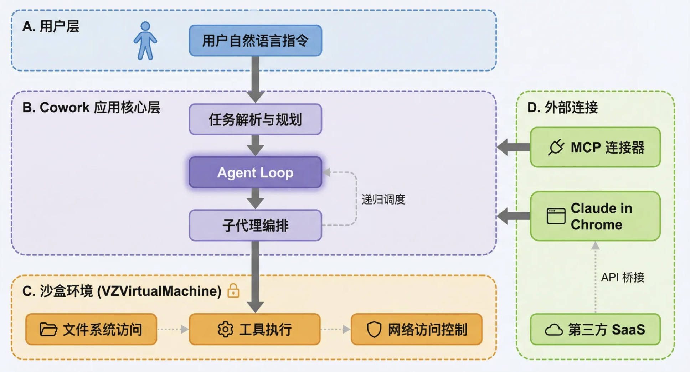
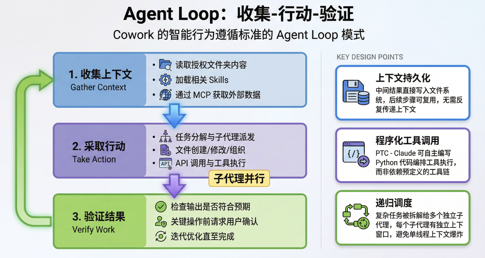
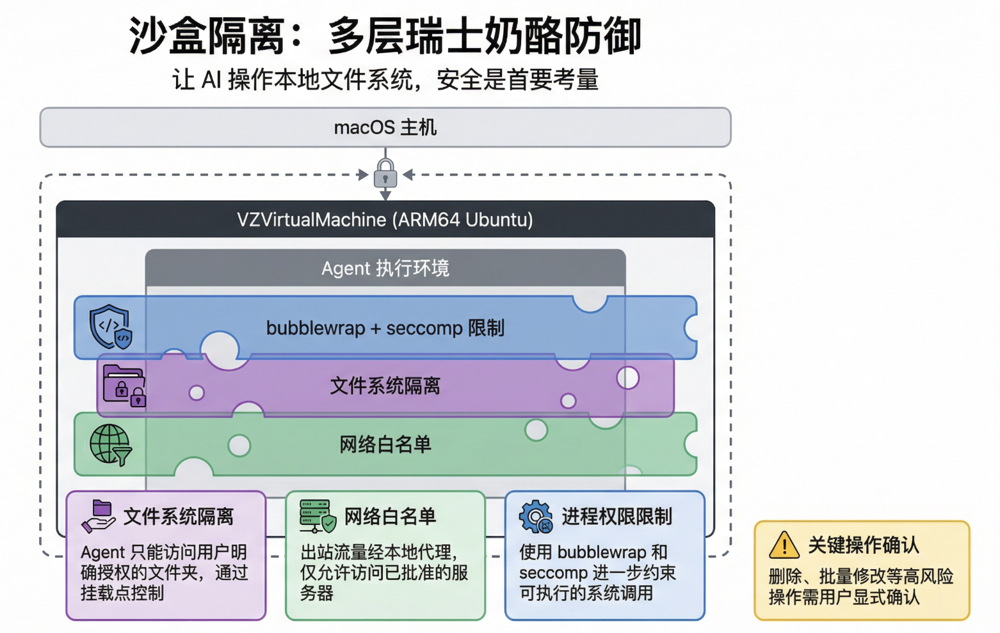

# Anthropic Cowork 技术解析：当 AI Agent 从终端走向桌面

2026年1月，Anthropic 发布了 Cowork——一款将 Claude Code 的 Agent 能力封装为面向非技术用户的桌面协作工具。这不仅是一次产品形态的演进，更代表了 AI Agent 从"开发者工具"向"通用生产力工具"跃迁的关键节点。

本文从技术架构师视角，深入解析 Cowork 的设计原理、核心机制、与现有工具生态的关系，以及企业落地的关键考量。

## 一、产品定位：为什么不是"又一个聊天机器人"

### 1.1 从 Claude Code 的"意外发现"说起

Cowork 的诞生源于 Anthropic 对 Claude Code 用户行为的观察。Claude Code 最初定位为开发者命令行工具，但用户迅速将其扩展到各种非编码场景：

- 整理文件、清理邮件
- 制作幻灯片、生成报告
- 从硬盘恢复照片、监测植物生长
- 甚至控制烤箱

这种"功能溢出"揭示了一个核心洞察：**用户需要的不是"更聪明的对话"，而是"能替我干活的数字同事"**。

### 1.2 Cowork 的核心差异

与传统对话式 AI 相比，Cowork 的本质区别在于：

| 维度 | 传统对话 AI | Cowork |
|------|-------------|--------|
| 交互模式 | 一问一答，线性 | 任务委托，异步并行 |
| 上下文来源 | 用户手动提供 | 直接访问本地文件系统 |
| 输出形态 | 文本/Artifact | 直接写入本地文件 |
| 执行能力 | 无（纯生成） | 有（文件读写、工具调用） |
| 工作模式 | 被动响应 | 主动规划、持续执行 |

用 Anthropic 自己的话说：**这更像是"给同事留言"，而不是"来回沟通"**。

## 二、技术架构：Agent Loop + 沙盒隔离

### 2.1 核心架构概览


### 2.2 Agent Loop：收集-行动-验证

Cowork 的智能行为遵循标准的 Agent Loop 模式：


关键设计点：

- **子代理并行**：复杂任务被拆解给多个独立子代理，每个子代理有独立上下文窗口，避免单线程上下文爆炸
- **上下文持久化**：中间结果直接写入文件系统，后续步骤可复用，无需反复传递上下文
- **程序化工具调用 (PTC)**：Claude 可自主编写 Python 代码编排工具执行，而非依赖预定义的工具链

### 2.3 沙盒隔离：多层"瑞士奶酪"防御

让 AI 操作本地文件系统，安全是首要考量。Cowork 采用基于 Apple `VZVirtualMachine` 的虚拟化方案：


**安全边界设计**：

1. **文件系统隔离**：Agent 只能访问用户明确授权的文件夹，通过挂载点控制
2. **网络白名单**：出站流量经本地代理，仅允许访问已批准的服务器
3. **进程权限限制**：使用 `bubblewrap` 和 `seccomp` 进一步约束可执行的系统调用
4. **关键操作确认**：删除、批量修改等高风险操作需用户显式确认

这种设计在"OS 级代理能力"与"沙盒应用安全性"之间取得平衡——即使 Agent 出错或遭遇提示注入攻击，影响范围也被严格限制。

## 三、Skills 系统：可组合的专业知识

### 3.1 Skills 的本质

Skills 是 Cowork（及整个 Claude 生态）扩展专业能力的核心机制。它本质上是一个包含指令、脚本和资源的文件夹：

```
.claude/skills/
└── generate_sales_report/
    ├── SKILL.md          # 技能定义与调用指令
    └── CODE/
        └── analyze.py    # 自动化脚本
```

**渐进式加载机制**：

```
元数据扫描 (~100 tokens)
    ↓ 匹配相关
完整指令加载 (<5k tokens)
    ↓ 需要时
脚本/资源加载
```

这种设计确保即使有大量 Skills，也不会撑爆上下文窗口。

### 3.2 Skills vs 其他构建块

Claude 生态中有多个"扩展能力"的机制，它们各司其职：

| 构建块 | 提供什么 | 持久性 | 典型用途 |
|--------|----------|--------|----------|
| **Skills** | 程序知识 + 可执行代码 | 跨对话 | 品牌指南、Excel公式、分析流程 |
| **Projects** | 背景知识 | 项目内 | 产品规格、研究资料、团队文档 |
| **MCP** | 工具连接 | 持续 | Google Drive、Slack、数据库 |
| **Subagents** | 任务委托 | 跨会话 | 代码审查、安全审计、并行研究 |
| **Prompts** | 即时指令 | 单次对话 | 一次性请求、对话式细化 |

**选择原则**：

- 重复的操作流程 → Skills
- 项目背景知识 → Projects
- 外部数据访问 → MCP
- 独立并行任务 → Subagents
- 临时指令 → Prompts

它们可以组合使用。例如，一个竞争分析任务可以同时调用：
- **Project**：加载市场研究文档
- **MCP**：连接 Google Drive 获取最新报告
- **Skills**：应用竞争分析框架
- **Subagents**：并行研究多个竞争对手

## 四、与现有工具的关系：连接器与 Claude in Chrome

### 4.1 MCP 连接器

通过 Model Context Protocol (MCP)，Cowork 可以连接外部服务：

- **数据源**：Google Drive、Slack、GitHub、数据库
- **业务工具**：Asana、Notion、PayPal、CRM 系统
- **自定义 API**：企业内部系统

MCP 提供标准化的连接层，避免为每个数据源编写定制集成。

### 4.2 Claude in Chrome

如果用户安装了 Chrome 扩展，Cowork 还能执行浏览器任务：

- 阅读网页、提取信息
- 填写表单
- 跨标签页导航
- 从无 API 的网站抓取数据

这使 Cowork 的能力边界从"本地文件"扩展到"整个互联网"。

## 五、企业落地：分阶段引入策略

### 5.1 风险与应对

让 AI 操作本地文件系统，企业需要关注：

**操作风险**：
- 误解指令导致数据丢失
- 批量修改造成不可逆后果

**安全风险**：
- 提示注入攻击（恶意网页/文档诱导 Agent 执行非预期操作）
- 敏感数据泄露

**应对措施**：
- 最小权限原则：仅授权必要文件夹
- 全面操作审计：记录所有文件操作
- 员工培训：清晰指令编写 + 安全意识

### 5.2 推荐落地路径

| 阶段 | 时间 | 目标 | 关键活动 |
|------|------|------|----------|
| 试点探索 | 1-3月 | 验证可行性 | 小范围团队、非敏感数据、低风险任务 |
| 流程整合 | 3-6月 | 融入业务 | 定制 Skills、建立审计机制、ROI 分析 |
| 全面推广 | 6月+ | 规模化 | 全员培训、系统集成、AI 治理 |

### 5.3 定制化开发

对于复杂场景，可使用 Claude Agent SDK 进行深度定制：

- **无头模式**：后台自动化，无需 GUI 交互
- **CI/CD 集成**：自动代码审查、测试报告生成
- **专用业务代理**：财务对账、供应链分析、客户工单处理

## 六、行业影响：SaaS 市场的潜在颠覆

Cowork 的出现，可能对现有 SaaS 市场产生冲击。许多过去需要专门软件的任务：

- 发票处理
- 媒体文件管理
- 简单数据分析
- 文档格式转换

现在可能只需一条自然语言指令即可完成。有评论甚至称其有望"取代数百个 AI slop B2B SaaS 产品"。

### 与竞品对比

| 特性 | Cowork | Microsoft Copilot | Lindy.ai 等 |
|------|--------|-------------------|-------------|
| 技术路径 | 从编码代理自下而上 | 与 Office 自上而下集成 | 平台化配置 |
| 核心优势 | 沙盒隔离安全、强 Agent 能力 | 生态无缝、用户基础大 | 无代码构建、模板丰富 |
| 潜在挑战 | 用户信任、提示注入 | 生态锁定 | 通用能力有限 |

## 七、当前限制与未来方向

### 7.1 已知限制

- **仅 macOS**：暂不支持 Windows/Linux
- **无跨设备同步**：会话仅存于本地
- **功能不完整**：Projects、Memory、聊天共享暂不支持
- **研究预览阶段**：可能存在不稳定因素

## 参考资料

- [Cowork 官方教程](https://claude.com/resources/tutorials/claude-cowork-a-research-preview)
- [Introducing Agent Skills](https://claude.com/blog/skills)
- [Skills explained: How Skills compares to prompts, Projects, MCP, and subagents](https://claude.com/blog/skills-explained)
- [Claude Agent SDK 文档](https://platform.claude.com/docs/en/agent-sdk/overview)
- [How to enable Claude Code for Enterprise](https://claude.com/resources/tutorials/how-to-enable-claude-code-for-your-enterprise-team)
