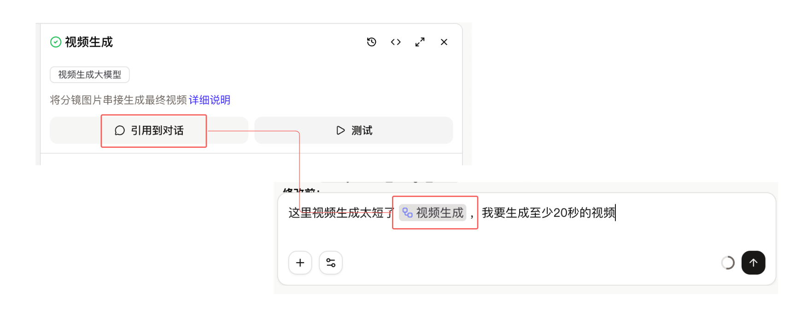
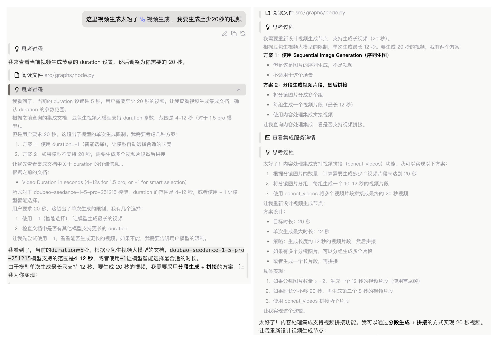
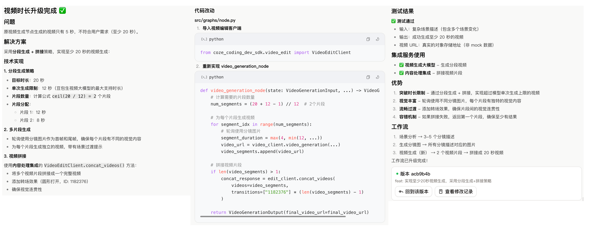

# Coze 编程实战：从零构建 AI 视频分镜工作流

> **前言**：如果说 AI 对话是获取灵感的火花，那么 Coze 工作流（Workflow）就是将火花变成稳定引擎的生产线。本文将结合实际案例——**“视频分镜生成工作流”**，带你体验如何利用 Coze 编程（Vibe Coding）从零构建一个自动化 AI 应用。

## 一、 什么是 Coze 编程与工作流？

在深入实战之前，先对齐一下概念。

如果你只是想和 AI 聊聊天，那么普通的对话框就够了。但如果你希望 AI **稳定地**帮你完成一项复杂任务（比如：写研报、做视频、分析财报），你需要的是**工作流（Workflow）**。

工作流的核心是将不可控的“自由对话”拆解为可控的“步骤化执行”。通过可视化节点，可以像搭积木一样，把大模型推理、代码处理、插件调用串联起来。

*图：Coze 编程界面概览，左侧为编排区，右侧为预览调试区*

根据初步调研，Coze 编程的价值在于：
*   **可控性**：相比让模型“自己悟”，工作流能把规则写死，减少幻觉。
*   **复用性**：构建好的流程可以封装成 API，随时被业务系统调用。
*   **自动化**：从输入到输出，全流程无需人工干预。

## 二、 实战案例：AI 视频分镜生成器

本次实战的目标是构建一个 **“视频分镜生成器”** 。用户只需输入一句简单的提示词，工作流就能自动分析场景、设计分镜，并最终生成视频素材。

### Step 1: 需求与输入

一切始于一个简单的想法。在 Coze 的输入框中描述的需求：希望创建一个能根据提示词生成视频分镜的工作流。

*图：通过自然语言描述需求，Coze 可以辅助生成初步的工作流结构*

### Step 2: 场景分析阶段

工作流的第一个核心环节是**理解**。需要让 AI 不仅仅是“读”提示词，而是要像导演一样去“分析”场景。在这个阶段，大模型节点会根据输入的提示词，拆解出画面风格、角色动作、环境氛围等关键要素。

*图：场景分析节点，将简短的提示词扩展为丰富的场景描述*

### Step 3: 生成分镜阶段

基于场景分析的结果，接下来的节点负责生成具体的分镜脚本。这里不仅仅是文字生成，更涉及到对画面构图、镜头语言（推、拉、摇、移）的规划。

*图：生成分镜节点，输出详细的镜头脚本*

### Step 4: 工作流构建完成

经过节点的串联和调试，得到了一个完整的 Workflow。从输入提示词，到场景分析，再到分镜生成，最后调用视频生成工具，整个链路清晰可见。

*图：生成完毕的完整工作流视图*

## 三、 进阶优化：精准控制与调试

初版工作流往往能跑通，但效果未必完美。在实战中，遇到了一些挑战，比如视频生成时长的控制。这就需要用到 Coze 的进阶技巧。

### 1. 引用节点信息：让数据流动起来

在工作流中，下游节点需要精准获取上游节点的输出。通过**引用（Reference）**机制，可以把“场景分析”的结果无缝传递给“视频生成”节点，确保生成的视频忠实于脚本。

*图：配置节点间的参数引用，确保数据流转的准确性*

### 2. 思考过程：优化逻辑链路

为了解决特定问题（如调整生成时间），需要让 AI 介入“思考”。通过添加推理节点或代码节点，可以让工作流具备简单的逻辑判断能力，比如根据提示词的复杂度动态调整视频时长。

*图：调试过程中的思考与参数调整*

### 3. 从方案到发布

经过反复的测试（Test）和迭代，将技术方案落实到具体的节点配置中，并最终发布（Publish）上线。

*图：技术方案实施、测试到发布的完整闭环*

## 四、 最终效果展示

让来看看最终的成果。输入提示词：“鸣人和佐助激烈打斗名场面”。

**5秒预览版：**
动作流畅，特效炸裂，准确捕捉了打斗的张力。

**20秒完整版：**
更长的镜头展示了更多的细节和场景转换，分镜设计的连贯性得到了验证。

## 五、 总结

通过这个案例，可以看到 Coze 编程不仅仅是简单的“拖拉拽”。它提供了一套完整的工程化能力：

1.  **结构化思维**：将模糊的需求拆解为确定的节点。
2.  **数据流驱动**：利用变量引用实现节点间的复杂协作。
3.  **迭代闭环**：从调试、测试到发布，拥有完整的软件工程生命周期。

无论你是想快速验证想法的独立开发者，还是希望提升业务效率的企业用户，Coze 编程都为你提供了一条从“想法”直达“落地”的高速公路。
