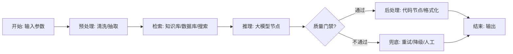
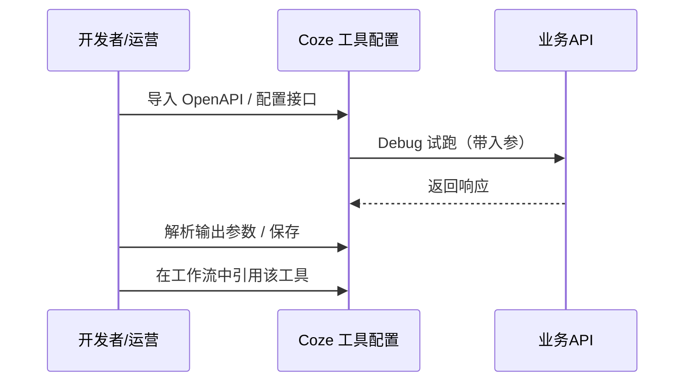
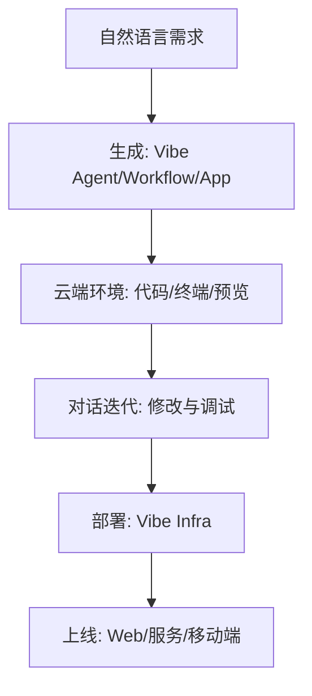

# 初步调研：Coze（扣子）编程与工作流构建

更新时间：2026-01-23  
调研目标：梳理「扣子 Coze 平台」与「扣子编程（Vibe Coding）」的能力边界，聚焦用 Coze 编程构建可复用、可发布、可对接业务系统的工作流（Workflow）方案。

---

## 1. 一页结论（TL;DR）

- 如果你要“把 AI 变成稳定产线”：优先用 Coze 的可视化工作流把流程拆成节点，靠变量/分支/工具调用来稳定产出。
- 如果你要“用对话直接生成/修改应用、并一键部署上线”：扣子编程（code.coze.cn）更像云端 AI IDE + 部署平台，覆盖 Agent / Workflow / App / Infra 的一体化链路。[^code_coze][^ai_bot][^53ai_vibe]
- “Coze 编程”在实践里常指两条路径：  
  - **工作流里的代码节点**：解决结构化处理、计算、格式转换、补齐平台节点能力的“最后一公里”。[^zhihu_code_node]  
  - **OpenAPI/SDK 编程对接**：把 Coze 的 Bot/Workflow 以 API/SDK 形式接入现有系统，做批处理、异步、流式输出、权限治理。[^coze_py][^coze_java]

---

## 2. 名词对齐：你到底在用哪一种 “Coze 编程”

| 名称 | 你在做什么 | 典型产物 | 适合谁 |
|---|---|---|---|
| 扣子 Coze（coze.cn / coze.com） | 搭建智能体/应用/工作流、配置知识库与插件、发布到渠道或用 API 调用 | Bot、Workflow、Template、插件、知识库 | 运营/产品/业务开发/增长 |
| 工作流（Workflow） | 把一个任务拆成可视化节点，明确输入/输出/分支与错误处理 | 一个可被运行、可复用的流程图 | 需要稳定交付的人 |
| 代码节点（Code Node） | 在工作流中写代码做加工/校验/转换/聚合/生成结构化输出 | 节点级代码逻辑 | 需要“更强可控性”的人 |
| 插件/工具（Tools / Plugin） | 把外部 API 或内部能力封装成可调用工具（可导入 OpenAPI） | 可复用工具接口 | 需要接业务系统的人 |
| 扣子编程（code.coze.cn） | 用对话驱动生成/修改代码、实时预览、云端一键部署与发布 | 云端项目（Agent/Workflow/App） | 从想法到上线、希望少折腾环境的人 |

---

## 3. Coze 工作流：从“会对话”到“可交付产线”

工作流的核心是把不可控的“自由对话”变成可控的“步骤化执行”。社区里对工作流的常见表述是：节点像积木一样串起来，通过变量引用把上一步输出喂给下一步，从而形成稳定的操作链。[^volc_workflow][^53ai_workflow_tutorial]

### 3.1 典型节点组合（抽象视角）



你可以把其中的“预处理/后处理”理解为工作流稳定性的关键：它们决定了输入/输出是否结构化，是否可被后续系统可靠消费。

### 3.2 变量与数据流：让节点“会接力”

- 常见做法是让“开始节点”定义输入变量（例如标题、用户问题、文件 URL、JSON 参数）。
- 后续节点通过引用上一步输出变量作为输入，形成“数据流驱动”的执行链。[^53ai_workflow_tutorial]
- 当你想把结果交给外部系统，建议在“结束节点”输出结构化字段（例如 JSON：`{title, summary, tags, status}`），避免只输出长文本。

---

## 4. 代码节点（Code Node）：工作流里的“万能加工机”

### 4.1 为什么需要代码节点

可视化节点很快，但在以下场景容易遇到“积木不够用”：

- 需要严格的字段校验（缺字段就报错/走降级）
- 需要做复杂的结构转换（多模型输出合并、从自由文本抽 JSON）
- 需要可复用的计算逻辑（打分、排序、分桶、去重、采样）
- 需要把上游多个节点输出进行聚合（例如生成统一报表）

社区教程常把代码节点理解为工作流中的一个环节：它不能独立存在，必须嵌在工作流里，用来承担更灵活的处理逻辑。[^zhihu_code_node]

### 4.2 代码节点在工程上的价值

- **可控**：相比提示词“让模型自己悟”，代码能把规则写死，减少幻觉。
- **可测**：对输入/输出做断言更容易（尤其是结构化 JSON）。
- **可复用**：同一段逻辑可以在多个工作流中复制/沉淀为模板。

### 4.3 代码节点使用建议（偏工程化）

- 只做“确定性加工”：校验、清洗、格式化、计算、拼装；把“创造性生成”留给大模型节点。
- 输入/输出尽量结构化：例如 `items: [{id, text, score}]`，不要只传一大段文本。
- 把错误分级：可重试（网络/临时故障）与不可重试（字段缺失/格式错误）要走不同分支。

---

## 5. 插件/工具（Tools / Plugin）：把业务系统接进来

Coze 的插件/工具体系常用于“把外部 API 变成节点可调用的能力”。在官方文档中心（国际站）对插件工具的说明中，包含通过 OpenAPI（YAML）导入、配置输入/输出参数、调试运行等关键步骤。[^coze_plugin_tools]



**落地建议**

- 先把“只读能力”工具化（查询、检索、获取状态），再逐步扩展到“写入能力”（创建订单、发券、更新状态）。
- 对写入类工具增加幂等字段（request_id）与权限最小化，避免误调用扩大影响面。

---

## 6. 通过 API / SDK 运行 Coze：把工作流接入你的系统

如果你要把工作流跑在你的业务链路里（例如后端服务、定时任务、批处理），常见路线是走 Coze Open API，并使用官方/社区 SDK。

### 6.1 Python：coze-py（cozepy）

coze-py 提供同步与异步接口，并包含 Workflow Run 的示例与流式处理能力。[^coze_py]

```python
import os
from cozepy import Coze, TokenAuth, COZE_CN_BASE_URL

coze = Coze(
    auth=TokenAuth(os.getenv("COZE_API_TOKEN")),
    base_url=os.getenv("COZE_API_BASE") or COZE_CN_BASE_URL,
)
```

### 6.2 Java：coze-java

coze-java 提到可以直接调用工作流，并给出 run 与 stream 的示例调用方式。[^coze_java]

---

## 7. 扣子编程（code.coze.cn）：Vibe Coding 视角下的“从想法到上线”

从公开描述看，扣子编程（code.coze.cn）强调：

- **通过对话快速构建** 智能体、工作流、网页与移动应用
- **开箱即用的云端环境**、实时预览与 **一键部署**（Vibe Infra）[^code_coze][^ai_bot]

行业文章进一步强调了 Vibe Infra 的覆盖范围（资源分配、版本部署、域名备案、移动端打包与发布等），并把 Vibe Workflow 描述为“描述需求即可生成可视化工作流，同时仍可分节点调试和修改”。[^53ai_vibe]



**把它和“Coze 工作流编辑器”放在一起理解：**

- 工作流编辑器更像“可视化编排器”，适合把业务 SOP 变成可维护流程。
- 扣子编程更像“云端 AI IDE + 自动化上线”，适合从 0 到 1 快速做出可运行的完整应用形态。

---

## 8. 典型落地场景（可复用工作流模板视角）

### 8.1 内容生产流水线（标题 → 大纲 → 正文 → 质检 → 发布稿）

- 入口：标题/主题/受众/平台（小红书、公众号等）
- 处理：大模型生成 + 代码节点结构化（JSON：标题、段落、要点、标签）
- 质检：敏感词/长度/引用来源/重复度（可规则化部分交给代码节点）
- 输出：可直接发布的稿件 + 元数据

### 8.2 企业客服（意图识别 → 知识检索 → 规则答复 → 工具调用）

- 把“必须一致”的口径用规则/模板锁死
- 把“需要实时数据”的部分交给工具（订单、物流、库存）
- 把“需要解释与安抚”的部分交给大模型，但加上边界与拒答策略

### 8.3 文件/票据解析（上传 → OCR/抽取 → 结构化 → 入库）

参考“发票读取工作流”的公开示例思路：上传 PDF 后抽取关键信息并输出结构化结果（JSON/表格），支持多页汇总。[^ai_bot]

---

## 9. 工程化清单（让工作流“能跑、可控、可维护”）

### 9.1 结构化优先

- 每个关键节点都明确输入/输出字段（尤其是跨节点传递的变量）
- 大模型输出尽量用 JSON Schema 约束（或用后处理代码节点做兜底解析）

### 9.2 可观测与可回放

- 记录每次运行的输入、关键中间结果、最终输出与错误分支
- 对外部工具调用记录 request_id，便于排查与幂等

### 9.3 成本与时延

- 将“长文本生成”与“检索/规则处理”拆开，减少不必要的模型调用
- 对高频流程设置缓存策略（例如知识检索结果、外部 API 只读查询）

### 9.4 权限与密钥

- PAT / OAuth token 必须只放在密钥管理处，不写入工作流文本或仓库
- 工具权限按最小化原则配置，写入类能力要有强审计与幂等保护

---

## 10. 参考链接

[^code_coze]: https://code.coze.cn/ 「扣子编程（code.coze.cn）登录页文案：云端 Vibe Coding 开发平台、对话构建与一键部署」
[^ai_bot]: https://ai-bot.cn/code-coze/ 「AI工具集：扣子编程功能概览（Vibe Agent/Workflow/App/Infra、云端环境与一键部署）」
[^53ai_vibe]: https://www.53ai.com/news/coze/2025121960579.html 「53AI：扣子编程公开测试与 Vibe Infra / Vibe Workflow 介绍」
[^53ai_workflow_tutorial]: https://www.53ai.com/news/coze/2024090893786.html 「53AI：Coze 工作流搭建教程（节点、输入输出、调试发布）」
[^volc_workflow]: https://developer.volcengine.com/articles/7523794048684195882 「火山引擎开发者社区：扣子 Coze 工作流搭建长文教程」
[^zhihu_code_node]: https://zhuanlan.zhihu.com/p/9317450076 「知乎：Coze 代码节点入门（Bot/工作流/代码节点关系与示例）」
[^coze_plugin_tools]: https://docs.coze.com/guides/plugin_tools 「Coze Docs：Plugin Tools（OpenAPI 导入、参数配置与调试）」
[^coze_java]: https://github.com/coze-dev/coze-java 「GitHub：coze-java（Java SDK，包含工作流 run/stream 示例）」
[^coze_py]: https://github.com/coze-dev/coze-py 「GitHub：coze-py（Python SDK，包含工作流运行与流式示例）」
