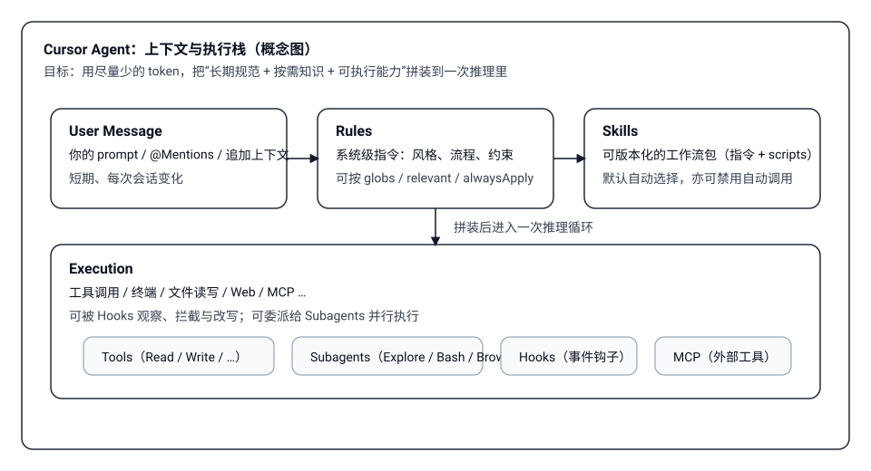
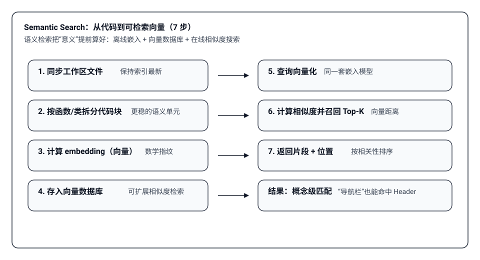
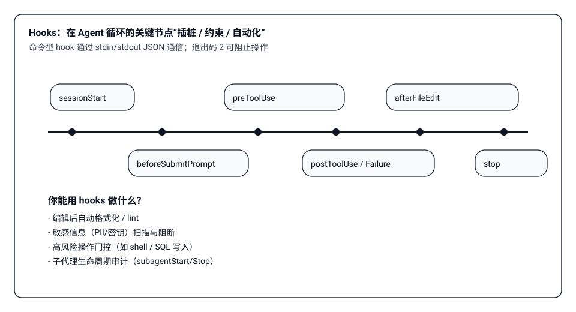

# Cursor 近版本更新调研：Skills / Subagents / Hooks 把 Agent 做成“工程系统”

> 这篇文章基于 Cursor 官方文档（已在本地落盘）做一次“面向工程实践”的更新点梳理：哪些能力是新增/强化的？如何组合成稳定、可复用、可治理的 Agent 工作流？

## 1. 一句话总览：Agent = 指令 + 工具 + 你的输入

Cursor 的 Agent 可以理解成一个编排器：把三类要素在一次推理中拼装起来，再循环执行直到完成任务：

- **Instructions（指令）**：system prompt + rules（持久化约束/工作流）
- **Tools（工具）**：文件读写、代码检索、终端命令、MCP 工具等
- **User Messages（用户输入）**：你的 prompt、@Mentions 引用的文件/片段/文档

近版本更新的方向很清晰：让“上下文工程”可配置、可迁移、可治理，并把高噪音/高 token 的工作隔离出去（subagents、hooks）。

## 2. Skills：把“会做什么”封装成可版本化的包（Cursor 2.4 重点）

### 2.1 Skills 是什么：可移植、可版本控制的能力单元

Skill 是一个文件夹包，核心入口是 `SKILL.md`（YAML frontmatter + Markdown body）。Cursor 启动时会自动发现并加载 skills，并在需要时让 Agent 选择调用。

默认搜索路径包括（项目级 + 用户级）：

- 项目：`.cursor/skills/`、`.claude/skills/`、`.codex/skills/`
- 用户：`~/.cursor/skills/`、`~/.claude/skills/`、`~/.codex/skills/`

### 2.2 Frontmatter 的关键字段：决定“何时用”和“怎么用”

`SKILL.md` 的 frontmatter 至少包含：

- `name`：小写字母/数字/连字符，且必须与父文件夹同名
- `description`：Agent 判断相关性的主要信号（写清触发场景）
- `disable-model-invocation`：设为 `true` 时，仅在你显式 `/skill-name` 调用时生效（类似传统 slash command）

可选目录与用途：

- `scripts/`：可执行脚本（bash/python/js…），由 Agent 在需要时运行
- `references/`：按需加载的补充资料（避免让 SKILL.md 过长）
- `assets/`：静态资源（模板、图片、数据文件等）

### 2.3 从 Rules/Commands 迁移到 Skills：/migrate-to-skills

Cursor 2.4 内置了 `/migrate-to-skills`，用于把已有的动态规则与 slash commands 转成 skills：

- Dynamic rules（Apply Intelligently）→ 标准 skills
- Slash commands → `disable-model-invocation: true` 的 skills（保留“显式调用”语义）

工程意义：把“团队约定的提示词/工作流”从零散配置收敛成可审查、可复用、可迭代的包。

### 2.4 实战：/yt-dlp-downloader 技能 + Cherry Studio 下载油管视频

再给一个更“落地”的 Skills 使用例子：我把 `yt-dlp` 这个成熟的下载库封装成了一个可复用的 Skill：**/yt-dlp-downloader**，并把代码推送到了：

- `https://github.com/DemonDamon/AgenticX-AgentSkills`

这个例子想说明的是：当你把一段可执行能力（下载、转码、抓取、批处理等）封装成 skill 后，它就不再是“某次对话里的一段提示词”，而是可以被团队复用、可版本化迭代、还能迁移到不同host（例如 Cherry Studio、Claude Code 兼容目录等）的工程资产。

下面是我在 Cherry Studio 里演示“用 /yt-dlp-downloader 下载 YouTube 视频”的完整流程：

1. 在 Cherry Studio 里创建一个“视频下载助手”

2. 把 skill 拷贝到 `.claude/skills/`（让host能发现到它）

3. 新开一个会话，确认能检索到 skill 的 meta 信息（说明技能已被加载）

4. 如果下载需要 Cookie，用浏览器快速导出并保存到本地 `cookie.txt`

5. 触发下载并等待任务完成

## 3. Rules：把“应该怎么做”变成持久系统指令

Rules 是系统级指令（提示词、脚本、模板等的集合），会被放到模型上下文的开头，解决大模型 “不跨补全记忆”的问题。Cursor 支持多种应用方式：

- Always Apply：每次对话都生效
- Apply Intelligently：按描述相关性自动引入
- Apply to Specific Files：按文件匹配规则生效（globs）
- Apply Manually：通过 `@my-rule` 手动触发

项目规则存放于 `.cursor/rules`，支持 `.md` 与带 frontmatter 的 `.mdc`（可更精细控制 description / globs / alwaysApply）。

团队/企业规则有更高优先级：**Team Rules → Project Rules → User Rules**（冲突时前者覆盖后者）。

实用分工建议：

- Rules：约束风格、工程流程、审查标准、默认工具链
- Skills：封装“可执行的工作流”，包含脚本/模板/参考资料

### 3.1 示例：把 Google Python 编码习惯固化成项目 Rule

这里举一个我在项目里的真实落地例子：参考 [Google Python Style Guide](https://google.github.io/styleguide/pyguide.html)，把团队希望长期遵守的 Python 编码习惯抽取出来，固化成一个项目级 Rule。

这个 Rule 的关键点不是“写得多”，而是“作用范围与约束可控”：通过 `globs: **/*.py` 把它限制在 Python 文件上，再用 `alwaysApply: false` 避免在非 Python 任务里影响对话（例如规则里要求英文注释、文件头 Author、禁止相对导入等）。

每个规则都有四种模式，如下图所示：

当前这个 Rule 最合适的应用方式是 **Apply to Specific Files**：让 globs 负责“确定性覆盖”，既避免“智能相关性判断”漏判，也比全局 Always Apply 更克制。

这类 Rule 的写法有两个实践要点（也适用于其他语言/规范）：
- 把“可自动判断的范围”交给 globs（例如 `**/*.py`），把“必须遵守的硬约束”写成明确可检查的条款（例如注释语言、导入方式、文件头）
- 让 Rule 只负责“应该怎么做”，把可执行动作（批量格式化、自动修复、生成模板）交给 Skills 或 Hooks，避免把规则写成大段操作流程

## 4. Commands：把常用工作流做成可复用的“/命令”

Commands 是自定义命令系统：你可以把常用工作流写成 Markdown 文件，并在聊天输入框里用 `/` 前缀触发。它的定位更偏“提示词工作流模板”，适合团队标准化常见任务（例如 review、写测试、生成变更说明）。

命令定义位置：

- 项目命令：`.cursor/commands/`（纳入版本控制，团队共享）
- 全局命令：`~/.cursor/commands/`（个人习惯）
- 团队命令：Cursor Dashboard 下发（集中管理与更新）

使用时，你在命令名后面追加的任何文本都会被一起送入提示词上下文（相当于给命令补参数）。

## 5. Semantic Search：把“概念级定位”变成默认能力

传统 grep 依赖字符串命中，而语义搜索做的是“按意义匹配”：你问“认证在哪处理？”也能命中 `authMiddleware`，即使没有出现关键词。

一些工程要点：

- **索引是离线计算**：代码被拆成语义块，再生成 embedding 写入向量库
- **查询是在线匹配**：把你的问题向量化后做相似度检索
- **索引更新策略**：新文件自动加入；修改文件重算；删除文件移除向量
- **隐私与安全**：路径会加密；代码内容不以明文永久存储，索引过程临时处理后丢弃

## 6. @Mentions：把“精确上下文控制”交还给你（Cursor 2.0 体验改进）

@ 提及是“把对话上下文精确对齐到你关心的对象”的入口：

- `@Files & Folders`：引用文件/文件夹（大内容会自动凝缩以适配上下文）
- `@Code`：引用更细粒度的代码片段
- `@Docs`：使用内置文档，或添加你自己的文档站点 URL

Cursor 2.0 对上下文展示与复制体验做了调整（例如移除顶部栏、改成输入框内联标签），同时弱化了需要手动附加的条目，让 Agent 更自动地获取上下文。

## 7. Subagents：把高噪音工作“隔离上下文 + 并行处理”

子 Agent 是主 Agent 委派的“专业化助手”，在独立上下文中运行，完成后只把总结回传给主对话。它的价值是：

- **上下文隔离**：搜索/命令输出/浏览器 DOM 不再污染主上下文
- **并行吞吐**：主 Agent 一次可并行启动多个子 Agent
- **成本效益**：例如 Explore 子 Agent 默认使用更快模型做大量检索

内置子 Agent 典型用途：

- Explore：搜索与分析代码库
- Bash：运行一系列 shell 命令（把冗长日志隔离）
- Browser：通过 MCP 控制浏览器（过滤 DOM/截图噪声）

自定义 subagent（项目级 `.cursor/agents/` 或用户级 `~/.cursor/agents/`）常用字段：

- `model`: `fast` / `inherit` / 指定模型 ID
- `readonly`: 只读运行
- `is_background`: 后台运行（不阻塞主流程）

## 8. Hooks：把“治理与自动化”嵌进 Agent 循环

Hooks 是派生进程，通过 stdio 使用 JSON 双向通信，在 Agent 循环的各阶段前后触发，可观察、阻断或修改行为。

### 8.1 两类 hook：命令型 vs 提示词型

- 命令型（默认）：执行脚本，stdin 读 JSON，stdout 输出 JSON
  - 退出码 `0`：成功
  - 退出码 `2`：阻止操作（等同 deny）
  - 其它：失败放行（fail-open）
- 提示词型：用 大模型 做策略评估，返回 `{ ok: boolean, reason?: string }`

### 8.2 Cursor Agent 与 Cursor Tab 的事件不同

Agent（对话）支持：`sessionStart/sessionEnd`、`preToolUse/postToolUse/postToolUseFailure`、`beforeSubmitPrompt`、`beforeReadFile/afterFileEdit`、`subagentStart/subagentStop`、`stop` 等。

Tab（行内补全）使用独立事件：`beforeTabFileRead`、`afterTabFileEdit`，便于对“自主补全”与“对话驱动”采用不同策略。

### 8.3 第三方 Hooks：兼容 Claude Code

Cursor 支持加载 Claude Code 的 hooks 配置（需开启第三方技能相关设置），并把事件映射到 Cursor 的 hook 名称体系。合并优先级从高到低大致为：

企业 hooks → 团队 hooks → 项目 hooks（`.cursor/hooks.json`）→ 用户 hooks（`~/.cursor/hooks.json`）→ Claude 本地/项目/用户配置。

工程建议：优先用项目 hooks 固化团队最小治理（例如密钥扫描、危险命令门控），再用用户 hooks 做个人偏好（如自动格式化）。

## 9. 一套“可复用、可治理”的落地组合

把以上能力合在一起，你可以得到一种更像工程系统的 AI 编码工作流：

1. **Rules**：统一语言、代码风格、审查要点、默认工作流
2. **Skills**：把复杂任务封装成包（目录结构 + scripts + references）
3. **Semantic Search + @Mentions**：让定位更快且更准确
4. **Subagents**：把高噪音任务并行外包（搜索/命令/浏览）
5. **Hooks**：把安全与自动化放进循环里（可审计、可阻断）

## 10. 参考资料
1. `https://cursor.com/docs/context/skills`
2. `https://cursor.com/docs/context/rules`
3. `https://cursor.com/docs/context/semantic-search`
4. `https://cursor.com/docs/context/mentions`
5. `https://cursor.com/docs/context/subagents`
6. `https://cursor.com/docs/agent/hooks`
7. `https://cursor.com/docs/agent/third-party-hooks`
8. `https://cursor.com/docs/agent/overview`
9. `https://cursor.com/docs/context/commands`
10. `https://github.com/DemonDamon/AgenticX-AgentSkills`（/yt-dlp-downloader 所在仓库）