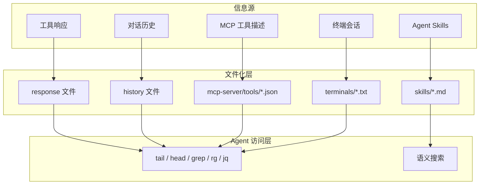
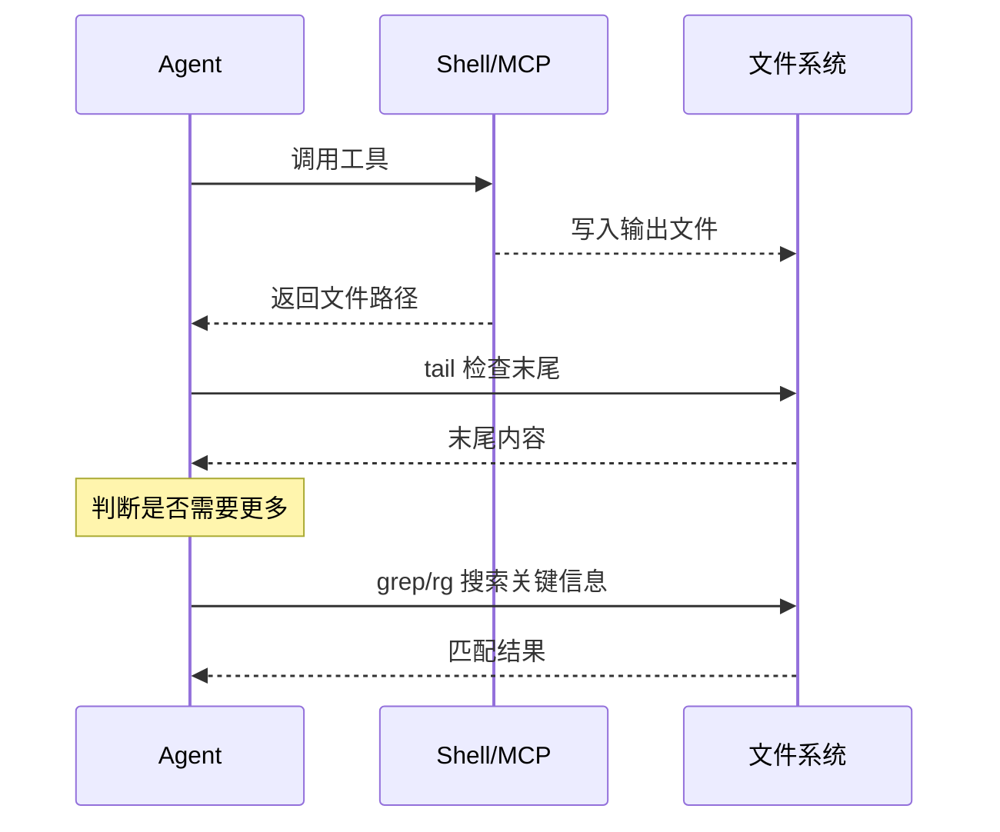
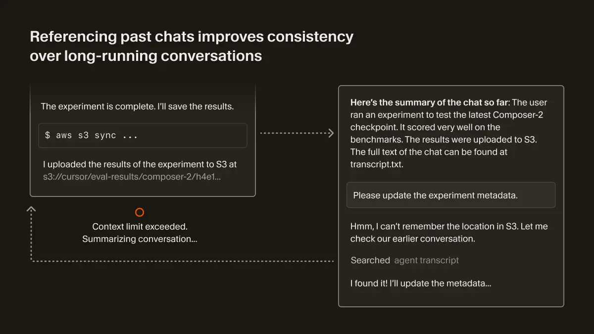
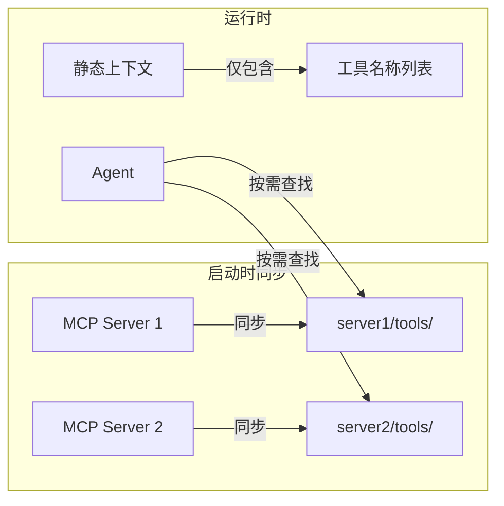
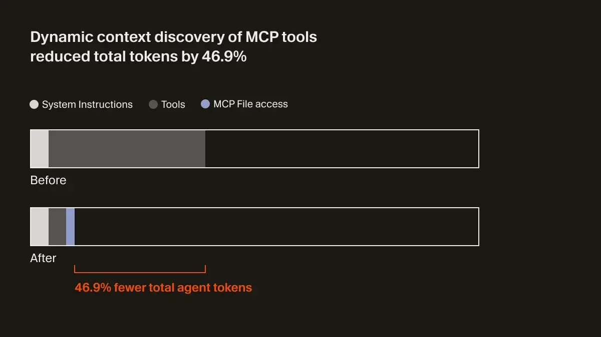

# Cursor 动态上下文发现：如何用「文件化」策略将 Token 消耗降低 47%

> 深度拆解 Cursor 的上下文工程架构——从动态发现到智能压缩的完整技术方案

## 一、背景：为什么需要动态上下文发现

编码 Agent 正在快速改变软件构建方式。其能力提升来自两方面：**更强的 Agent 模型** + **更好的上下文工程（Context Engineering）**。

Cursor 的 Agent 框架（agent harness）会针对每个前沿模型单独优化，但有一类上下文工程改进是**模型无关**的——如何收集上下文、如何在长轨迹中优化 token 使用。

Cursor 团队发现：**随着模型变强，预先提供更少细节、让 Agent 自主拉取相关上下文，效果反而更好**。

这就是 **动态上下文发现（Dynamic Context Discovery）** 的核心思想，与传统的**静态上下文（Static Context）**（始终包含在 prompt 中）形成对比。

| 类型 | 定义 | 问题 |
|------|------|------|
| **静态上下文** | 始终包含在 prompt 中的固定信息 | 占用 token、可能造成混淆或矛盾 |
| **动态上下文** | Agent 按需拉取的相关信息 | token 效率高、回复质量更好 |

**动态上下文发现的优势**：
- 只将必要数据拉入上下文窗口
- 减少可能造成混淆或矛盾的信息量
- 提升 Agent 回复质量

## 二、核心架构：文件作为统一抽象

Cursor 实现动态上下文发现的核心载体是**文件（Files）**：



**为什么选择文件？**

官方博客原文：
> It's not clear if files will be the final interface for LLM-based tools. But as coding agents quickly improve, **files have been a simple and powerful primitive** to use, and a safer choice than yet another abstraction that can't fully account for the future.

文件的优势：
1. **统一接口**：所有信息源都可以用文件表示
2. **工具生态**：`tail`、`grep`、`rg`、`jq` 等标准工具开箱即用
3. **惰性加载**：Agent 按需读取，无需一次性加载
4. **面向未来**：相比复杂抽象，文件是更安全的选择

## 三、5 大动态上下文策略详解

### 策略 1：长工具响应 → 文件化

**问题**：工具调用（Shell 命令、MCP 调用）可能返回巨大的 JSON 响应，显著膨胀上下文窗口。

**常见做法**：截断长输出 → 可能丢失重要信息。

**Cursor 做法**：



**关键细节**：
- Cursor 的**一方工具**（如文件编辑、代码搜索）通过智能工具定义和最小响应格式防止膨胀
- **第三方工具**（Shell、MCP）没有这种原生优化，所以写入文件
- Agent 用 `tail` 检查末尾（多数结论在末尾），按需读取更多

**收益**：减少接近上下文上限时触发的不必要摘要。

### 策略 2：摘要时保留历史引用

**问题**：上下文窗口填满后触发摘要（summarization），但摘要是**有损压缩**，Agent 可能遗忘关键细节。

**Cursor 做法**：

1. 将对话历史持久化为文件（如 `transcript.txt`）
2. 摘要后给 Agent 一个指向历史文件的引用
3. Agent 如果发现摘要中缺失细节，可以搜索历史文件恢复



> 图示：Agent 完成实验后上传结果到 S3，触发上下文摘要。后续用户请求更新元数据时，Agent 发现摘要中缺失 S3 路径，通过搜索 `agent transcript` 恢复了完整信息。

**触发时机**：
- **自动**：达到上下文窗口上限
- **手动**：用户输入 `/summarize`

### 策略 3：支持 Agent Skills 开放标准

**Agent Skills** 是由 **Anthropic 提出的开放标准**，用于为编码 Agent 扩展专用能力。Cursor **支持（Supporting）** 该标准。

> 注：Agent Skills 标准已被 Cursor、Claude Code、GitHub Copilot、VS Code 等主流工具采用，具备跨平台可移植性。

**Skills 的构成**（遵循 Anthropic 规范）：

```markdown
<!-- SKILL.md -->
---
name: deploy-k8s
description: 将应用部署到 Kubernetes 集群
---

# Deploy to Kubernetes

## 使用说明
...

## 可执行脚本
- ./scripts/deploy.sh
```

**动态发现机制**：
- Skills 的**名称和描述**作为静态上下文包含在系统提示中
- Agent 需要时通过 `grep` 或 Cursor 的语义搜索拉取完整 Skill 定义
- Skills 可以打包可执行文件或脚本，Agent 可以轻松找到相关内容

### 策略 4：MCP 工具惰性加载

**问题**：
- MCP 服务器通常包含大量工具，描述往往很长
- 大部分工具实际不会被使用，但始终包含在 prompt 中
- 多个 MCP 服务器会进一步放大问题

**Cursor 的设计哲学**：

> We believe it's the responsibility of the **coding agents** to reduce context usage.（减少上下文使用是编码 Agent 的责任，而非期望每个 MCP 服务器自己优化）

**Cursor 做法**：



**关键设计决策**（来自官方脚注）：

> We considered a tool search approach, but that would scatter tools across a flat index. Instead, we create **one folder per server**, keeping each server's tools logically grouped. When the model lists a folder, it sees all tools from that server together and can understand them as a cohesive unit. Files also enable more powerful searching. The agent can use full `rg` parameters or even `jq` to filter tool descriptions.

- **每个 MCP Server 一个文件夹**，而非扁平索引
- Agent 列出文件夹时能看到该 Server 的所有工具，理解为一个整体
- 支持强大的搜索能力：`rg` 参数、`jq` 过滤

**实测效果**：



> 在调用 MCP 工具的运行中，该策略将 Agent **总 token 消耗减少 46.9%**（统计显著，但会随已安装 MCP 数量产生较大波动）

**额外收益**：可向 Agent 传达工具状态。例如，如果 MCP 服务器需要重新认证，以前 Agent 会完全忘记这些工具，用户会困惑；现在 Agent 可以主动提示用户重新认证。

### 策略 5：终端会话 → 文件同步

**传统做法**：用户需要手动复制终端输出粘贴给 Agent。

**Cursor 做法**：
- 集成终端的输出自动同步到本地文件系统
- 用户可以轻松问「为什么我的命令失败了？」，Agent 能理解引用
- 终端历史可能很长，Agent 可以 `grep` 只获取相关输出

**官方原文**：
> This mirrors what CLI-based coding agents see, with prior shell output in context, but **discovered dynamically rather than injected statically**.

这与 CLI 编码 Agent（如 Claude Code）看到的内容一致——之前的 Shell 输出在上下文中，但是**动态发现而非静态注入**。

## 四、长历史上下文的压缩策略

除了 5 大动态策略，Cursor 还针对**文件/文件夹**设计了智能压缩机制（来自 Cursor 官方文档）：

| 状态 | 触发条件 | 保留内容 | 后续交互 |
|------|----------|----------|----------|
| **Condensed** | 文件较大但结构可提取 | 函数签名、类定义、方法名 | 需要时自动扩展加载 |
| **Significantly Condensed** | 文件极大，结构也放不下 | 仅文件名 + 标签 | 用户需手动重新上传 |
| **Not Included** | 超出剩余容量或格式不支持 | 警告图标 | 需筛选核心文件后重试 |

**常规压缩示例**：

```typescript
// 原始文件（500 行）
export class UserService {
  private db: Database;
  constructor(db: Database) { /* ... 50行 ... */ }
  async createUser(data: CreateUserDTO): Promise<User> { /* ... 100行 ... */ }
  async updateUser(id: string, data: UpdateUserDTO): Promise<User> { /* ... 80行 ... */ }
}

// 压缩后（~20 行）
export class UserService {
  private db: Database;
  constructor(db: Database): void;
  async createUser(data: CreateUserDTO): Promise<User>;
  async updateUser(id: string, data: UpdateUserDTO): Promise<User>;
}
```

## 五、为什么这套架构有效

### 1. Token 效率最大化

静态注入：「宁滥勿缺」，大量无关信息占用上下文
动态发现：「按需精准」，只拉取当前任务需要的信息

### 2. 复杂度线性可控

| 方案 | 上下文占用 |
|------|-----------|
| 静态注入 | MCP 工具数 × 描述长度（指数膨胀） |
| 动态发现 | 固定名称列表 + 按需查找（线性可控） |

### 3. 工具生态零成本复用

Agent 不需要学习新 API，直接复用 `tail`、`grep`、`rg`、`jq` 等标准工具。

### 4. 面向未来的扩展性

新增信息源？写入文件即可。新增 MCP Server？同步到对应文件夹。架构天然支持水平扩展。

## 六、可落地实践清单

| 场景 | 传统做法 | 动态上下文做法 |
|------|----------|----------------|
| **长工具响应** | 截断 | 写入文件 + `tail` 按需读取 |
| **对话历史** | 直接压缩丢弃 | 保留文件引用 + 搜索回查 |
| **Agent 能力扩展** | 全部注入 prompt | Skills 文件 + 语义搜索 |
| **MCP 工具** | 全部描述注入 | 仅名称 + 按需查找（每 Server 一个文件夹） |
| **终端输出** | 手动复制粘贴 | 自动同步文件 + `grep` |
| **大文件处理** | 强制截断或拒绝 | 三级压缩（结构/文件名/警告） |

## 七、总结

Cursor 的动态上下文发现架构可以用一句话概括：

> **用文件作为统一抽象，将「静态注入」转变为「动态发现」，实现 token 效率与响应质量的双重提升。**

**核心数据点**：
- **46.9%**：MCP 动态加载策略减少的 Agent 总 token 消耗
- **5 大策略**：长响应文件化、摘要时保留历史引用、支持 Agent Skills、MCP 惰性加载、终端会话文件同步
- **3 级压缩**：Condensed → Significantly Condensed → Not Included

**架构精髓**：不在于复杂算法，而在于**用最简单的原语（文件）解决最普遍的问题（上下文膨胀）**。

---

## 参考资料

- [Cursor 官方博客 - Dynamic Context Discovery](https://cursor.com/blog/dynamic-context-discovery)（2026.01.06，作者：Jediah Katz）
- [Cursor 官方文档 - Context](https://cursor.com/learn/context)
- [Cursor 官方文档 - Summarization](https://cursor.com/docs/agent/chat/summarization)
- [Anthropic - Agent Skills 开放标准](https://github.com/anthropics/skills)
- [Anthropic 工程博客 - Equipping Agents with Agent Skills](https://www.anthropic.com/engineering/equipping-agents-for-the-real-world-with-agent-skills)
