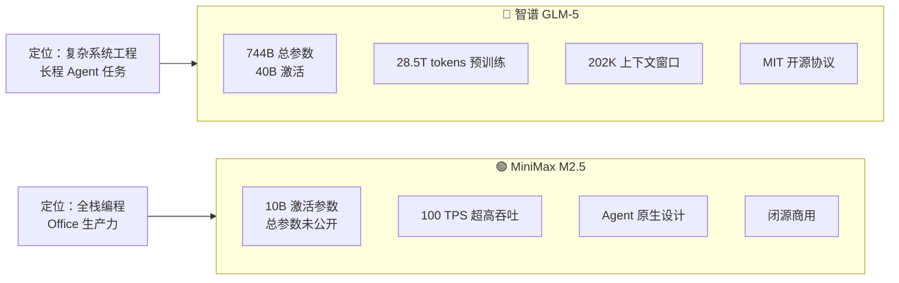
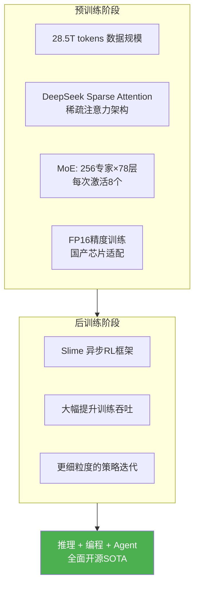
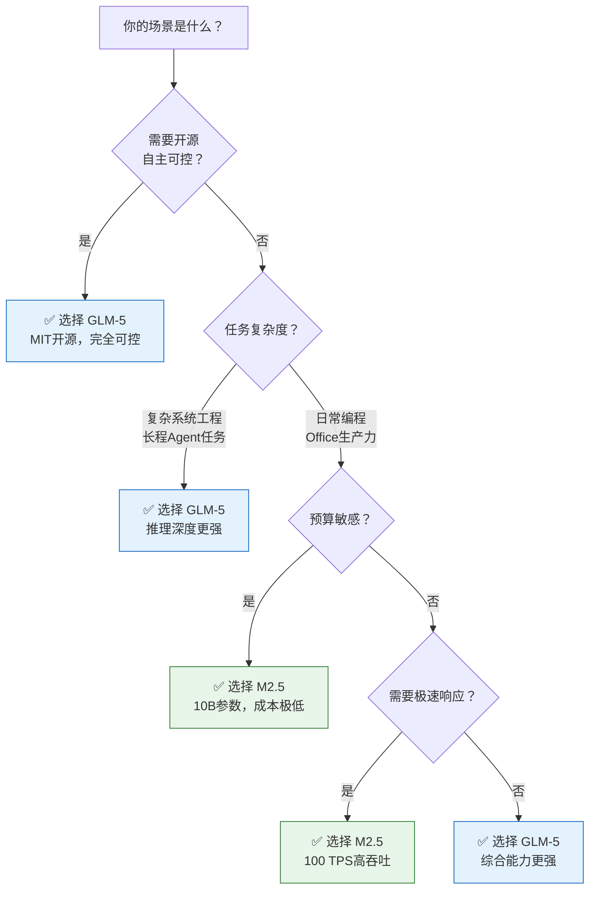

# 智谱GLM-5 vs MiniMax M2.5：国产大模型编程与智能体能力巅峰对决

## 引言

2026年2月11-12日，48小时内，国产大模型领域密集投下两枚重磅炸弹：智谱AI发布了开源旗舰 **GLM-5**，MiniMax紧随其后上线 **M2.5**。两款模型不约而同瞄准了同一个方向——**Coding & Agentic**，直接对标国际顶尖的Claude Opus系列。

GLM-5喊出了"From Vibe Coding to Agentic Engineering"的口号，M2.5则宣称是"全球首个为Agent场景原生设计的生产级模型"。一个开源重武器、一个轻量化利器，这场国产大模型的巅峰对决，到底谁更适合你的场景？

*图：GLM-5 综合性能雷达图——在推理、编程、智能体三大维度均达到开源模型SOTA水平（来源：智谱官方博客）*

## 一、模型概览：重量级 vs 轻量级

两款模型在设计哲学上形成了鲜明对比——GLM-5走的是"大力出奇迹"的路线，M2.5则追求极致的效率比。

### 1.1 智谱GLM-5

| 维度 | 规格 |
|------|------|
| **发布时间** | 2026年2月11日 |
| **模型定位** | 面向复杂系统工程与长程智能体任务的开源大模型 |
| **总参数** | 744B（40B激活），稀疏度5.9% |
| **架构** | 78层隐藏层 + 256个专家模块（每次激活8个） |
| **预训练数据** | 28.5T tokens（较GLM-4.5的23T大幅提升） |
| **上下文窗口** | 202K tokens |
| **训练精度** | FP16（兼顾国产算力硬件适配） |
| **开源协议** | MIT License |
| **可用平台** | HuggingFace / ModelScope / api.z.ai / Z.ai |

### 1.2 MiniMax M2.5

| 维度 | 规格 |
|------|------|
| **发布时间** | 2026年2月12日 |
| **模型定位** | 全球首个为Agent场景原生设计的生产级模型 |
| **激活参数** | 仅10B（总参数未公开） |
| **推理吞吐** | 100 TPS 超高吞吐量 |
| **推理速度** | 官方称"超国际顶尖模型" |
| **显存占用** | 极低（10B激活参数优势） |
| **编程对标** | Claude Opus 4.6 |
| **核心场景** | 全栈编程 + Office生产力（Excel/PPT/深度调研） |

> **关键差异**：GLM-5激活参数是M2.5的**4倍**（40B vs 10B），但M2.5在推理效率上具有天然优势。两者的设计取舍反映了截然不同的工程哲学。

## 二、核心技术架构对比

### 2.1 GLM-5的技术创新栈

GLM-5在预训练和后训练两个阶段都实现了重大突破：

**四大技术亮点**：

- **DeepSeek稀疏注意力（DSA）**：首次引入DSA架构，在保持长文本处理效果无损的前提下，**显著降低部署成本**——这对744B参数的大模型来说至关重要
- **Slime异步强化学习框架**：全新开发的[异步RL基础设施](https://github.com/THUDM/slime)，解决了大规模LLM强化学习训练效率低下的难题，实现更精细的后训练迭代
- **混合专家系统（MoE）**：78层×256专家模块，每次仅激活8个（稀疏度5.9%），在保持强大能力的同时控制推理成本
- **国产芯片兼容**：支持华为昇腾、摩尔线程、寒武纪、昆仑芯、MetaX、燧原、海光等国产芯片部署

### 2.2 M2.5的技术优势

M2.5虽未公开详细架构参数，但其设计哲学非常明确——**以最小的参数量撬动最大的实用价值**：

- **极致轻量化**：激活参数量仅10B，是GLM-5的1/4，在显存占用和推理能效比上优势碾压
- **100 TPS超高吞吐**：在实际Agent场景中，高吞吐意味着更快的多轮交互速度，这对编程助手类应用至关重要
- **Agent原生设计**：从架构层面就为工具调用、多步骤规划、Office文档生成等场景做了深度优化
- **全栈开发覆盖**：PC、App、跨端应用一站式支持

## 三、Benchmark全面对比

### 3.1 GLM-5的官方评测成绩

以下是GLM-5与国际顶尖模型在各大基准测试上的完整对比（数据来源：智谱官方博客）：

#### 推理能力

| Benchmark | GLM-5 | GLM-4.7 | DeepSeek-V3.2 | Kimi K2.5 | Claude Opus 4.5 | Gemini 3.0 Pro | GPT-5.2 |
|-----------|-------|---------|---------------|-----------|-----------------|----------------|---------|
| Humanity's Last Exam | 30.5 | 24.8 | 25.1 | **31.5** | 28.4 | **37.2** | 35.4 |
| HLE w/ Tools | **50.4** | 42.8 | 40.8 | **51.8** | 43.4 | 45.8 | 45.5 |
| AIME 2026 I | 92.7 | 92.9 | 92.7 | 92.5 | **93.3** | 90.6 | - |
| HMMT Nov. 2025 | **96.9** | 93.5 | 90.2 | 91.1 | 91.7 | 93.0 | **97.1** |
| GPQA-Diamond | 86.0 | 85.7 | 82.4 | 87.6 | 87.0 | **91.9** | **92.4** |

#### 编程能力

| Benchmark | GLM-5 | GLM-4.7 | DeepSeek-V3.2 | Kimi K2.5 | Claude Opus 4.5 | Gemini 3.0 Pro | GPT-5.2 |
|-----------|-------|---------|---------------|-----------|-----------------|----------------|---------|
| **SWE-bench Verified** | **77.8** 🥇 | 73.8 | 73.1 | 76.8 | **80.9** | 76.2 | **80.0** |
| SWE-bench Multilingual | **73.3** 🥇 | 66.7 | 70.2 | 73.0 | **77.5** | 65.0 | 72.0 |
| Terminal-Bench 2.0 | **56.2** 🥇 | 41.0 | 39.3 | 50.8 | **59.3** | 54.2 | 54.0 |
| CyberGym | **43.2** 🥇 | 23.5 | 17.3 | 41.3 | **50.6** | 39.9 | - |

> 🥇 = 开源模型最佳成绩

#### 智能体能力（Agent）

| Benchmark | GLM-5 | GLM-4.7 | DeepSeek-V3.2 | Kimi K2.5 | Claude Opus 4.5 | Gemini 3.0 Pro | GPT-5.2 |
|-----------|-------|---------|---------------|-----------|-----------------|----------------|---------|
| **BrowseComp** | **62.0** 🥇 | 52.0 | 51.4 | 60.6 | 37.0 | 37.8 | - |
| BrowseComp w/ CM | **75.9** 🥇 | 67.5 | 67.6 | 74.9 | 67.8 | 59.2 | 65.8 |
| **τ²-Bench** | **89.7** 🥇 | 87.4 | 85.3 | 80.2 | **91.6** | **90.7** | 85.5 |
| **MCP-Atlas** | **67.8** 🥇 | 52.0 | 62.2 | 63.8 | 65.2 | 66.6 | **68.0** |
| Vending Bench 2 | **$4,432** 🥇 | $2,377 | $1,034 | $1,198 | **$4,967** | **$5,478** | $3,591 |

### 3.2 编程能力实战对比

*图：CC-Bench-V2 内部编程评测——GLM-5在前端、后端、长程任务三个维度均大幅超越GLM-4.7，逼近Claude Opus 4.5（来源：智谱官方博客）*

在智谱内部的CC-Bench-V2评测中，GLM-5较上一代GLM-4.7在编程开发场景下平均性能**提升超20%**，包括：
- **前端开发**：p5.js物理模拟、Three.js魔方、Markdown编辑器深色模式
- **后端重构**：大型代码库的自主分析和架构优化
- **长程任务**：从需求分析到部署的完整软件开发生命周期管理

### 3.3 长程Agent能力：Vending Bench 2

*图：Vending Bench 2——模拟经营自动售货机一整年，GLM-5最终余额$4,432，开源模型第一，逼近Claude Opus 4.5的$4,967（来源：智谱官方博客）*

Vending Bench 2是一个极具特色的benchmark，要求模型在模拟环境中**经营一台自动售货机长达一年**。这个测试全面考核模型的：
- 长期规划与资源管理能力
- 市场分析与定价策略
- 风险评估与应急响应
- 持续优化与迭代决策

GLM-5以$4,432的最终余额在开源模型中拔得头筹，仅次于Gemini 3.0 Pro（$5,478）和Claude Opus 4.5（$4,967）。

## 四、从Vibe Coding到Agentic Engineering

### 4.1 范式转变

智谱在GLM-5的发布中明确提出了一个关键趋势：AGI行业正从 **"Vibe Coding"** 向 **"Agentic Engineering"** 范式转变。这种转变意味着：
- **从"帮我写代码"到"帮我做工程"**：模型不再只是代码片段生成器，而是能自主完成从需求分析到测试部署的完整流程
- **从分钟级任务到天级任务**：Vending Bench 2的一年模拟经营就是典型的长程Agent任务
- **从单一工具到多工具协同**：网页浏览、API调用、代码执行、文件操作的无缝衔接

### 4.2 GLM-5的Agentic Engineering实力

GLM-5在多个Agent基准上全面开花：

- **BrowseComp 75.9**（带上下文管理）：联网检索与信息理解能力**超越所有竞品**，包括Claude Opus 4.5（67.8）和GPT-5.2（65.8）
- **MCP-Atlas 67.8**：工具调用和多步骤任务执行开源第一，接近GPT-5.2（68.0）
- **τ²-Bench 89.7**：复杂多工具场景下的规划和执行能力，仅次于Claude Opus 4.5（91.6）

### 4.3 M2.5的Agent原生优势

M2.5虽然没有公布详细的benchmark分数，但其"Agent场景原生设计"的定位带来了独特价值：

- **生产级可靠性**：从设计之初就考虑了Agent场景的稳定性和鲁棒性
- **Office文档生成**：Excel高阶处理、PPT生成、深度调研报告——这些是GLM-5未着重强调的实用场景
- **高吞吐Agent循环**：100 TPS意味着在多轮Agent交互中，M2.5的响应速度远超大参数模型
- **跨端协同**：PC、移动端、Web端的Agent应用全栈覆盖

## 五、Office生产力：GLM-5的新战场

GLM-5在此次发布中特别强调了从"聊天"到"工作"的转变，展现了强大的Office文档生成能力：

*图：GLM-5端到端生成的赞助提案文档——从文本描述直接输出格式化的.docx文件，包含图表、分层结构和专业排版（来源：智谱官方博客）*

GLM-5可以将文本或源材料直接转化为：
- **.docx文档**：PRD、教案、考试卷、赞助提案
- **.xlsx表格**：财务报表、数据分析表
- **.pdf文件**：研究报告、运营手册

Z.ai平台已上线Agent模式，内置PDF/Word/Excel创建技能，支持多轮协作，将模型输出转化为可直接使用的交付物。

## 六、部署与成本：工程落地的关键考量

### 6.1 成本效益分析

| 对比维度 | 智谱GLM-5 | MiniMax M2.5 |
|---------|----------|-------------|
| **API定价** | 输入$0.80/M tokens，输出$2.56/M tokens | 通过Coding Plan订阅，性价比高 |
| **本地部署硬件** | BF16权重约1.5TB，4-bit量化需~400GB内存 | 10B激活参数，普通服务器/高端PC可运行 |
| **推理吞吐** | 受限于参数规模，需高端GPU集群 | 100 TPS，单卡即可获得高吞吐 |
| **国产芯片支持** | ✅ 7+款国产芯片适配 | 未公开 |
| **开源可控性** | ✅ MIT协议完全开源 | ❌ 闭源 |
| **Coding工具集成** | Claude Code / OpenCode / Kilo Code等 | Claude Code / 海螺AI |

### 6.2 选型决策树

## 参考资料

1. [GLM-5: From Vibe Coding to Agentic Engineering](https://z.ai/blog/glm-5) — 智谱官方技术博客
2. [GLM-5 GitHub仓库](https://github.com/zai-org/GLM-5) — 开源代码与模型权重
3. [GLM-5 HuggingFace](https://huggingface.co/zai-org/GLM-5) — 模型下载与部署指南
4. [Slime异步RL框架](https://github.com/THUDM/slime) — GLM-5后训练核心基础设施
5. [MiniMax M2.5旗舰编程模型上线，对标Claude Opus 4.6](https://www.ithome.com/0/921/416.htm) — IT之家
6. [MiniMax M2.5正式上线，直接对标Claude Opus 4.6](https://finance.eastmoney.com/a/202502123649095468.html) — 每日经济新闻
7. [全网首测！MiniMax M2.5发布，跑OpenClaw实测真香](https://news.qq.com/rain/a/20260212A0389U00) — 腾讯新闻
8. [Vending Bench 2](https://andonlabs.com/evals/vending-bench-2) — 长程Agent能力评测平台
