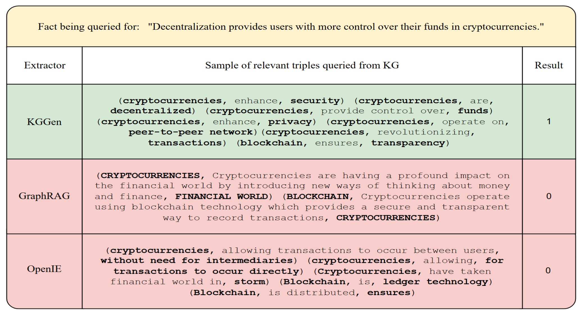
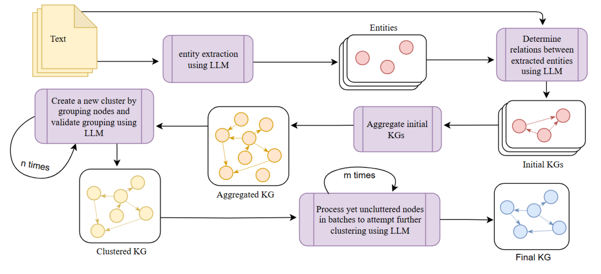
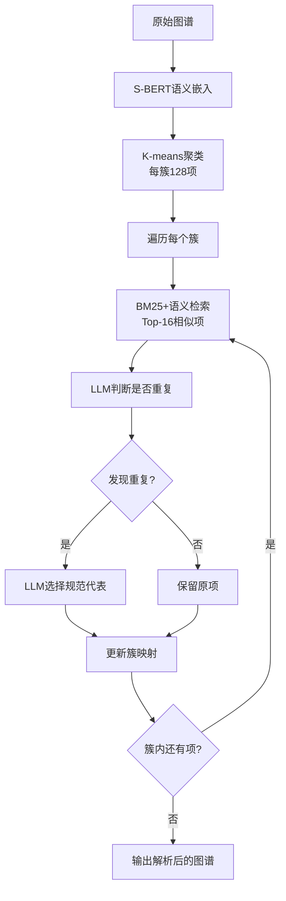
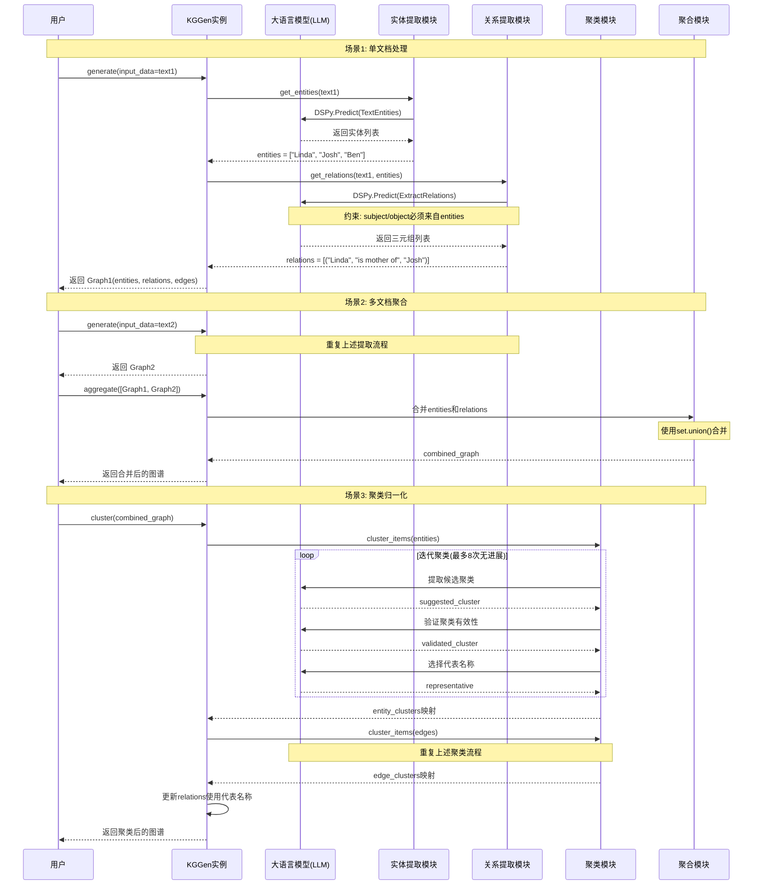
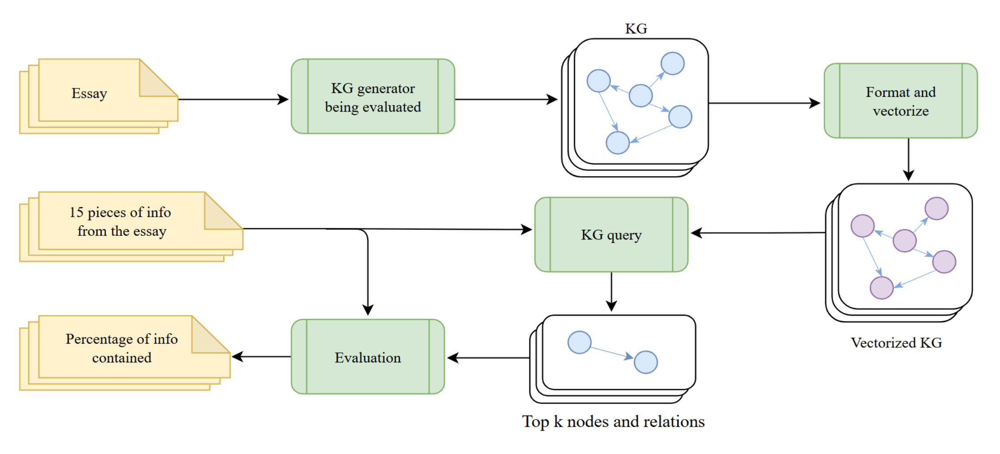
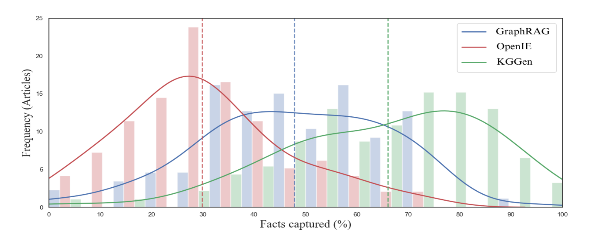
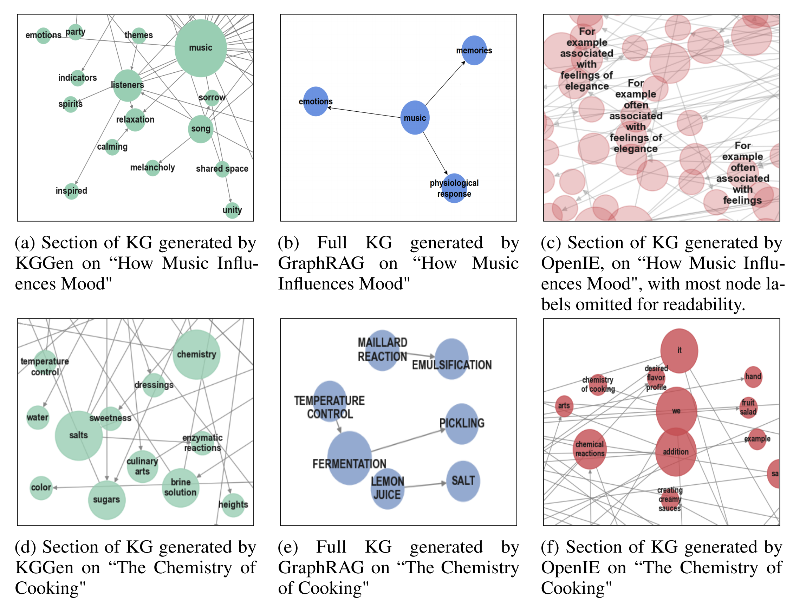
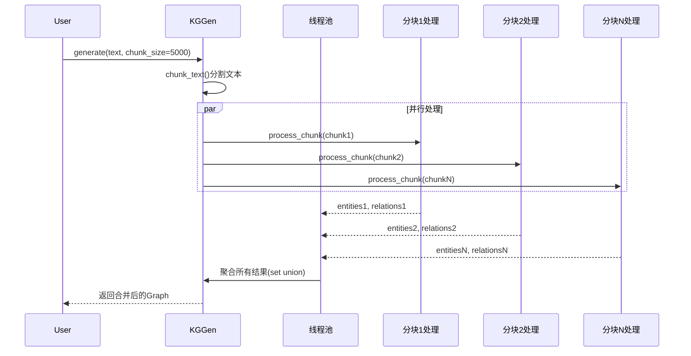

# KGGen：用大模型从文本中提取高质量知识图谱

## 引言

知识图谱作为结构化知识表示的核心方式，在信息检索、问答系统和推荐引擎中扮演着关键角色。然而，高质量知识图谱的稀缺性一直是业界的痛点。Wikidata、DBpedia等主流图谱虽然规模庞大，但覆盖度远未达到理想状态，尤其在垂直领域更是如此。

现有的自动化提取工具如OpenIE和GraphRAG虽然能从文本生成知识图谱，但存在明显缺陷：**提取的实体和关系过于分散，导致图谱稀疏、冗余度高，难以支撑下游任务**。举个例子，"冬季奥运会"、"冬奥会"、"Winter Olympics"这些表述本质上是同一实体，但传统方法会把它们当作不同节点处理，导致图谱连接断裂。

斯坦福大学团队提出的**KGGen**正是为了解决这一问题。它不仅能从文本中提取知识图谱，更重要的是通过创新的**实体与关系解析机制**，将分散的知识整合成稠密、可复用的高质量图谱。本文将深入解析KGGen的技术原理和实现细节。

## 问题的本质：为什么传统方法生成的图谱不好用？

让我们先看一个具体案例。对于查询"**去中心化使加密货币用户能更好地控制其资金**"这个事实，不同方法的提取效果对比如下：



从对比中可以看出：

- **KGGen**：提取出语义明确的三元组如`(加密货币, 提供控制, 资金)`、`(加密货币, 是, 去中心化的)`，能直接支持事实验证
- **GraphRAG**：关系过于笼统`(加密货币, 正在对金融世界产生深远影响, ...)`，无法精确回答问题
- **OpenIE**：充斥着`it`、`are`等无意义节点，信息噪声极大

传统方法的核心问题在于：**缺乏有效的实体消歧和关系归一化机制**。这导致图谱中几乎每条边都对应一个独特的关系类型，关系无法复用，图谱变成了一堆离散的碎片。

## KGGen的解决方案：三阶段提取流水线

KGGen采用创新的三阶段流水线架构，系统性地解决了上述问题：



### 阶段一：实体与关系提取

第一阶段使用大语言模型（如GPT-4、Claude）进行结构化提取。KGGen采用**两步提取策略**：

1. **实体识别**：先从文本中提取所有关键实体
2. **关系抽取**：基于已识别的实体列表提取三元组

这种设计的巧妙之处在于使用**DSPy框架的动态Schema生成**。传统方法需要预定义固定的实体和关系类型，而KGGen通过运行时动态构建约束来适应不同领域的文本：

```python
class TextEntities(dspy.Signature):
    """从文本中提取关键实体（主语或宾语）"""
    source_text: str = dspy.InputField()
    entities: list[str] = dspy.OutputField(desc="完整的关键实体列表")

def extraction_sig(entities, context=""):
    class ExtractRelations(dspy.Signature):
        __doc__ = f"""提取主语-谓语-宾语三元组。
        主语和宾语必须来自实体列表。{context}"""
        
        source_text: str = dspy.InputField()
        entities: list[str] = dspy.InputField()
        relations: list[Relation] = dspy.OutputField()
    
    return ExtractRelations

# 动态约束：每次调用时entities列表不同，Schema也随之变化
ExtractRelations = extraction_sig(entities=["Linda", "Josh", "Ben"])
```

这种动态Schema的核心价值是：**约束LLM只能从已识别的实体中选择主语和宾语**，避免产生不一致的实体表述，为后续解析奠定基础。

### 阶段二：图谱聚合

当处理多个文档时，KGGen会先独立提取每个文档的局部图谱，然后通过集合并集操作聚合：

```python
def aggregate(self, graphs: list[Graph]) -> Graph:
    all_entities = set()
    all_relations = set()
    all_edges = set()
    
    for graph in graphs:
        all_entities.update(graph.entities)
        all_relations.update(graph.relations)
        all_edges.update(graph.edges)
    
    return Graph(entities=all_entities, 
                 relations=all_relations, 
                 edges=all_edges)
```

聚合阶段会进行基础规范化（如统一小写），但不涉及复杂的语义判断，这部分工作留给了下一阶段。

### 阶段三：实体与边解析（核心创新）

这是KGGen区别于其他方法的**关键创新**。解析阶段通过混合算法识别并合并语义相同的实体和关系：



具体算法分为四个步骤：

**步骤1：语义聚类**  
使用S-BERT对所有实体（或关系）生成语义嵌入，通过k-means聚成多个128项的簇。这一步快速缩小后续LLM处理的搜索空间。

**步骤2：相似度检索**  
在每个簇内，为每个项找出Top-16最相似的候选项，相似度计算融合了BM25（词频统计）和语义嵌入（语义理解）：

```python
# 混合相似度 = 0.5 × BM25分数 + 0.5 × 余弦相似度
combined_score = 0.5 * bm25_score + 0.5 * cosine_similarity
```

**步骤3：LLM去重判断**  
将候选项交给LLM，判断哪些是同一实体的不同表述（考虑时态、单复数、缩写、同义词等变体）：

```python
class ExtractCluster(dspy.Signature):
    """从列表中找出一组语义相同的项。
    相同是指：不同时态、复数形式、词干形式、大小写、缩写或简写"""
    
    items: set[str] = dspy.InputField()
    context: str = dspy.InputField()
    cluster: list[str] = dspy.OutputField()
```

**步骤4：规范代表选择**  
对于确认的重复项集合，LLM选出最能代表共享语义的规范名称，类似Wikidata的别名机制。例如从`{"Olympic Winter Games", "Winter Olympics", "冬奥会"}`中选出`"Winter Olympics"`作为标准代表。

这一机制的威力在处理大规模文本时尤为明显。论文在处理2000万字符的数据集时，成功将`"Olympic Winter Games"`、`"Winter Olympics"`、`"winter Olympic games"`合并为单一规范实体。

### 完整交互流程

为了更清晰地理解KGGen的工作机制，下面通过时序图展示三个典型场景的完整交互流程：



从时序图可以看出，KGGen通过模块化设计实现了灵活的组合能力：用户可以只提取单文档，也可以聚合多文档，还可以选择性地执行聚类优化。这种设计使得系统既易于理解，又便于扩展。

## 如何评估：MINE基准的诞生

知识图谱提取一直缺乏标准化评估基准。为此，论文提出了 **MINE（Measure of Information in Nodes and Edges）** 基准，包含两个互补任务：

### MINE-1：知识保留能力测试

评估从短文本中保留信息的能力。基准包含100篇文章（涵盖科学、技术、艺术等领域），每篇标注15个关键事实。评估流程如下：



评估步骤：
1. 提取器为每篇文章生成知识图谱
2. 对每个事实，用语义搜索检索相关节点
3. 扩展到两跳邻居节点形成子图
4. LLM判断事实能否从子图推断出来

为确保评估可靠性，论文用人工验证了60个样本，LLM判断与人工评估的一致性达**90.2%**，相关性为**0.80**。

### MINE-2：RAG任务实用性测试

基于WikiQA数据集评估图谱在问答系统中的表现。这更贴近实际应用场景，测试图谱的检索和推理能力。

## 性能表现：显著超越现有方法

在MINE-1基准上，KGGen的表现大幅领先：



关键数据：
- **KGGen**: 66.07% 准确率
- **GraphRAG**: 47.80% 准确率  
- **OpenIE**: 29.84% 准确率

更重要的是，KGGen在三元组有效性上接近完美：

| 方法 | 有效三元组比例 |
|------|---------------|
| KGGen | 98% (98/100) |
| GraphRAG | 0% (0/100) |
| OpenIE | 55% (55/100) |

GraphRAG得分为0%令人震惊，原因是它提取的结构不符合传统知识图谱的定义（主语-谓语-宾语三元组），而是生成了更接近自然语言描述的冗长关系。

从可视化对比中可以更直观地看出差异：



- **KGGen**：节点信息丰富（如"Eurasia exhibition"）、关系清晰、连通性好
- **GraphRAG**：节点稀疏、图谱碎片化、关键信息缺失
- **OpenIE**：大量无意义节点（如"it"、"are"）成为枢纽，错误连接不相关概念

## 可扩展性：为大规模应用设计

KGGen的一个显著优势是**关系复用率随文本规模增长而提升**。论文测试了从1万到100万字符的不同规模，结果显示：

- **KGGen**：平均每种关系类型被使用10次，且随规模增长而上升
- **GraphRAG**：始终保持约2次/关系，无论规模如何

这意味着KGGen提取的关系具有更好的泛化能力，不会随着文本增多而线性增加关系类型数量。

在计算成本方面，处理100万字符的《风之名》小说：

| 阶段 | 耗时 | Token消耗 | 成本 |
|------|------|-----------|------|
| 实体关系提取 | 273秒 | 222万 | $0.46 |
| 实体边解析 | 279秒 | 315万 | $0.38 |
| **总计** | **551秒** | **537万** | **$0.84** |

去重效果显著：实体减少22.4%，边减少23%，大幅提升图谱质量的同时降低存储成本。

## 快速上手：代码示例

KGGen已开源并提供Python库，使用非常简单：

```python
from kg_gen import KGGen

# 初始化
kg = KGGen(model="openai/gpt-4o", temperature=0.0)

# 单文档提取
text1 = "Linda是Joe的母亲。Ben是Joe的兄弟。"
graph1 = kg.generate(input_data=text1)

# 多文档聚合
text2 = "Andrew是Joseph的父亲。Joseph也叫Joe。"
graph2 = kg.generate(input_data=text2)
combined = kg.aggregate([graph1, graph2])

# 实体关系解析（消除"Joe"和"Joseph"的歧义）
final_graph = kg.cluster(combined, context="家庭关系")

print(f"实体数: {len(final_graph.entities)}")
print(f"关系数: {len(final_graph.relations)}")
print(f"实体聚类映射: {final_graph.entity_clusters}")
```

对于大文档，可以启用分块并行处理：

```python
# 自动分块处理并聚合结果
large_text = "..." # 数百万字符的长文本
graph = kg.generate(
    input_data=large_text,
    chunk_size=5000,  # 每块5000字符
    cluster=True       # 自动执行解析
)
```

### 并行处理机制详解

当处理大规模文档时，KGGen会自动将文本分块并通过线程池并行处理，显著提升处理效率：



这种并行架构使得处理时间近似与文本块数量成反比，在多核机器上能获得接近线性的加速比。

## 局限性与未来方向

尽管KGGen表现出色，但论文也坦诚指出了一些局限：

1. **过度/不足去重问题**：LLM有时会将相似但不同的实体合并（如"1型糖尿病"和"2型糖尿病"），或者遗漏应合并的变体
2. **领域专业知识缺失**：在医学、金融等专业领域，通用LLM可能缺乏足够的领域知识进行精确提取
3. **评估规模受限**：MINE基准最大测试500万Token的语料，离真正的网络规模还有距离

未来改进方向包括：
- 引入领域特定本体来指导提取和解析
- 开发更大规模的评估基准
- 探索自适应本体集成机制

## 总结

KGGen通过创新的三阶段流水线和实体关系解析机制，成功解决了传统知识图谱提取方法的稀疏性和冗余问题。其核心贡献可以总结为：

1. **方法创新**：混合LLM与传统IR技术的实体关系解析算法
2. **基准构建**：提出MINE评估框架，填补了领域空白
3. **性能优势**：66%准确率超越竞品，关系复用率提升5倍

该项目自发布以来已获得700+ GitHub星标，下载量超1.2万次，展现了强大的社区吸引力。对于需要从文本构建高质量知识图谱的开发者而言，KGGen提供了一个生产就绪的开源解决方案。

**项目地址**：https://github.com/stair-lab/kg-gen

---

*本文基于斯坦福大学团队发表的论文《KGGen: Extracting Knowledge Graphs from Plain Text with Language Models》撰写，论文详细阐述了方法设计、基准构建和实验验证的完整过程。*