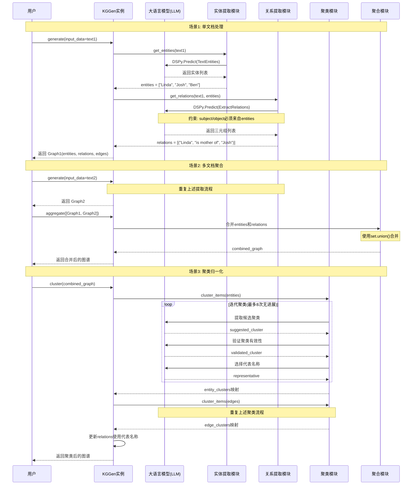
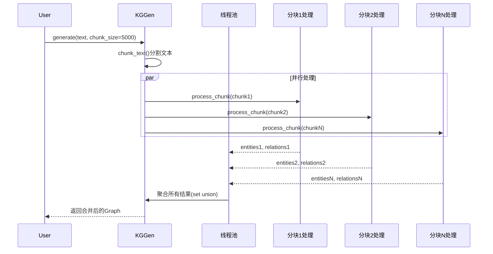

# 我问
首先你说大模型从单文本提取实体和关系，schema哪里来？提取标准是什么？那能否支持跨多个文档构建知识图谱？

# deepwiki答
您的问题涉及 `kg-gen` 系统中大模型如何从文本提取实体和关系的机制,具体包括:
1. Schema(模式)的来源
2. 提取标准
3. 是否支持跨多个文档构建知识图谱 [1](#0-0) 

## Schema来源

系统使用 **DSPy Signatures** 动态定义schema,而不是预定义的固定schema [2](#0-1) 。实体提取使用 `TextEntities` signature,它指示大模型提取"subjects or objects" [2](#0-1) 。

关系提取的schema更加结构化,使用Pydantic `BaseModel`定义三元组格式 [3](#0-2) 。关键约束是:**subject和object必须来自第一阶段提取的实体列表** [4](#0-3) 。

## 提取标准

提取标准通过DSPy signature的文档字符串(docstring)传递给大模型:

1. **实体提取标准**: "Extract key entities from the source text. Extracted entities are subjects or objects. This is for an extraction task, please be THOROUGH and accurate" [5](#0-4) 

2. **关系提取标准**: "Extract subject-predicate-object triples from the source text. Subject and object must be from entities list...please be thorough, accurate, and faithful to the reference text" [4](#0-3) 

3. **可选的上下文参数**: 您可以通过 `context` 参数提供额外的领域特定标准 [6](#0-5) ,例如 `context="Family relationships"` [7](#0-6) 。

## 跨多个文档构建知识图谱

**完全支持**。系统提供两种方式:

### 方式1: 分块处理单个大文档
使用 `chunk_size` 参数将大文本分块并行处理,然后聚合结果 [8](#0-7) 。每个chunk独立提取实体和关系,最后通过集合并集(set union)合并 [9](#0-8) 。

### 方式2: 聚合多个独立图谱
使用 `aggregate()` 方法合并多个文档生成的图谱 [10](#0-9) :

```python
graph1 = kg.generate(input_data=text1)
graph2 = kg.generate(input_data=text2)
combined_graph = kg.aggregate([graph1, graph2])
``` [11](#0-10) 

聚合后可以使用 `cluster()` 方法归一化相似实体和关系(如"Josh"和"Joshua") [12](#0-11) ,这通过迭代LLM调用实现语义聚类 [13](#0-12) 。

## Notes

- Schema是通过DSPy框架的类型化签名动态生成的,不需要预定义固定模式<cite />
- 提取标准主要依赖prompt工程(通过docstring)和可选的context参数<cite />
- 系统设计明确支持多文档场景,MCP服务器实现就是一个持久化跨会话聚合记忆的例子 [14](#0-13) 
- 关系提取有fallback机制处理约束违反情况 [15](#0-14) 

Wiki pages you might want to explore:
- [Core Python Library (stair-lab/kg-gen)](/wiki/stair-lab/kg-gen#2.1)

### Citations

**File:** src/kg_gen/kg_gen.py (L149-160)
```python
    def generate(
        self,
        input_data: Union[str, List[Dict]],
        model: str = None,
        api_key: str = None,
        api_base: str = None,
        context: str = "",
        chunk_size: Optional[int] = None,
        cluster: bool = False,
        temperature: float = None,
        output_folder: Optional[str] = None,
    ) -> Graph:
```

**File:** src/kg_gen/kg_gen.py (L214-236)
```python
        else:
            chunks = chunk_text(processed_input, chunk_size)
            entities = set()
            relations = set()

            def process_chunk(chunk, lm):
                with dspy.context(lm=lm):
                    chunk_entities = get_entities(chunk, is_conversation)
                    chunk_relations = get_relations(
                        chunk, chunk_entities, is_conversation=is_conversation
                    )
                    return chunk_entities, chunk_relations

            # Process chunks in parallel using ThreadPoolExecutor
            with ThreadPoolExecutor() as executor:
                results = list(
                    executor.map(process_chunk, chunks, [self.lm] * len(chunks))
                )

            # Combine results
            for chunk_entities, chunk_relations in results:
                entities.update(chunk_entities)
                relations.update(chunk_relations)
```

**File:** src/kg_gen/steps/_1_get_entities.py (L5-11)
```python
class TextEntities(dspy.Signature):
    """Extract key entities from the source text. Extracted entities are subjects or objects.
    This is for an extraction task, please be THOROUGH and accurate to the reference text."""

    source_text: str = dspy.InputField()
    entities: list[str] = dspy.OutputField(desc="THOROUGH list of key entities")

```

**File:** src/kg_gen/steps/_2_get_relations.py (L12-14)
```python
            __doc__ = f"""Extract subject-predicate-object triples from the source text. 
      Subject and object must be from entities list. Entities provided were previously extracted from the same source text.
      This is for an extraction task, please be thorough, accurate, and faithful to the reference text. {context}"""
```

**File:** src/kg_gen/steps/_2_get_relations.py (L66-72)
```python
    class Relation(BaseModel):
        """Knowledge graph subject-predicate-object tuple."""

        subject: str = dspy.InputField(desc="Subject entity", examples=["Kevin"])
        predicate: str = dspy.InputField(desc="Predicate", examples=["is brother of"])
        object: str = dspy.InputField(desc="Object entity", examples=["Vicky"])

```

**File:** src/kg_gen/steps/_2_get_relations.py (L75-105)
```python
    try:
        extract = dspy.Predict(ExtractRelations)
        result = extract(source_text=input_data, entities=entities)
        return [(r.subject, r.predicate, r.object) for r in result.relations]

    except Exception as _:
        Relation, ExtractRelations = fallback_extraction_sig(
            entities, is_conversation, context
        )
        extract = dspy.Predict(ExtractRelations)
        result = extract(source_text=input_data, entities=entities)

        class FixedRelations(dspy.Signature):
            """Fix the relations so that every subject and object of the relations are exact matches to an entity. Keep the predicate the same. The meaning of every relation should stay faithful to the reference text. If you cannot maintain the meaning of the original relation relative to the source text, then do not return it."""

            source_text: str = dspy.InputField()
            entities: list[str] = dspy.InputField()
            relations: list[Relation] = dspy.InputField()
            fixed_relations: list[Relation] = dspy.OutputField()

        fix = dspy.ChainOfThought(FixedRelations)

        fix_res = fix(
            source_text=input_data, entities=entities, relations=result.relations
        )

        good_relations = []
        for rel in fix_res.fixed_relations:
            if rel.subject in entities and rel.object in entities:
                good_relations.append(rel)
        return [(r.subject, r.predicate, r.object) for r in good_relations]
```

**File:** tests/test_basic.py (L62-66)
```python
    graph1 = kg.generate(
        input_data=text1,
        model="openai/gpt-4o",
        context="Family relationships",
    )
```

**File:** README.md (L130-146)
```markdown
# EXAMPLE 4: Combining multiple graphs
text1 = "Linda is Joe's mother. Ben is Joe's brother."

# Input text 2: also goes by Joe."
text2 = "Andrew is Joseph's father. Judy is Andrew's sister. Joseph also goes by Joe."

graph4_a = kg.generate(input_data=text1)
graph4_b = kg.generate(input_data=text2)

# Combine the graphs
combined_graph = kg.aggregate([graph4_a, graph4_b])

# Optionally cluster the combined graph
clustered_graph = kg.cluster(
  combined_graph,
  context="Family relationships"
)
```

**File:** src/kg_gen/steps/_3_cluster_graph.py (L217-276)
```python
def cluster_items(
    dspy: dspy, items: set[str], item_type: ItemType = "entities", context: str = ""
) -> tuple[set[str], dict[str, set[str]]]:
    """Returns item set and cluster dict mapping representatives to sets of items"""

    context = f"{item_type} of a graph extracted from source text." + context
    remaining_items = items.copy()
    clusters: list[Cluster] = []
    no_progress_count = 0
    validate = None

    while len(remaining_items) > 0 and no_progress_count < LOOP_N:
        ExtractCluster, ItemsLiteral = get_extract_cluster_sig(items)
        extract = dspy.Predict(ExtractCluster)

        suggested_cluster: set[ItemsLiteral] = set(
            extract(items=remaining_items, context=context).cluster
        )

        if not suggested_cluster:
            no_progress_count += 1
            continue

        ValidateCluster, ClusterLiteral = get_validate_cluster_sig(suggested_cluster)
        validate = dspy.Predict(ValidateCluster)

        validated_cluster = set(
            validate(cluster=suggested_cluster, context=context).validated_items
        )
        if not validated_cluster:
            no_progress_count += 1
            continue

        no_progress_count = 0

        representative = choose_rep(
            cluster=validated_cluster, context=context
        ).representative

        clusters.append(
            Cluster(representative=representative, members=validated_cluster)
        )
        remaining_items = {
            item for item in remaining_items if item not in validated_cluster
        }

    if len(remaining_items) > 0:
        items_to_process = list(remaining_items)

        for i in range(0, len(items_to_process), BATCH_SIZE):
            batch = items_to_process[i : min(i + BATCH_SIZE, len(items_to_process))]
            _process_batch(batch, clusters, context, validate)

    # Prepare the final output format expected by the calling function:
    # 1. A dictionary mapping representative -> set of members
    # 2. A set containing all unique representatives
    final_clusters_dict = {c.representative: c.members for c in clusters}
    new_items = set(final_clusters_dict.keys())  # The set of representatives

    return new_items, final_clusters_dict
```

**File:** mcp/server.py (L145-153)
```python
    try:
        # Generate graph from text
        new_graph = kg_gen_instance.generate(input_data=text)
        
        # Merge with existing memory graph
        if memory_graph is None:
            memory_graph = new_graph
        else:
            memory_graph = kg_gen_instance.aggregate([memory_graph, new_graph])
```


# 我问
我还是没有完全理解「Schema是通过DSPy框架的类型化签名动态生成的,不需要预定义固定模式」

# deepwiki答
您想更深入理解"Schema是通过DSPy框架的类型化签名动态生成的"这个概念。让我用具体代码示例来解释。<cite/>

## 什么是"动态生成"

在传统方法中,您需要预先定义一个固定的JSON Schema或数据结构。<cite/>但在`kg-gen`中,Schema是在**运行时根据输入动态构建**的。<cite/>

## 具体实现机制

### 1. 基础Schema定义

关系提取使用Pydantic `BaseModel`定义基本结构: [1](#1-0) 

这个`Relation`类定义了三元组的基本格式(subject, predicate, object),但**没有限制具体的值**。<cite/>

### 2. 动态约束注入

关键在于`extraction_sig()`函数,它**动态创建**DSPy Signature类: [2](#1-1) 

注意第11-14行的`__doc__`字符串 - 这是**运行时生成的提示词**,告诉LLM提取规则。 [3](#1-2) 第17行的`entities`参数是**动态传入的实体列表**,每次调用都不同。 [4](#1-3) 

### 3. 聚类场景的动态Literal类型

更高级的例子在聚类功能中。`get_extract_cluster_sig()`函数根据**当前待聚类的items集合**动态创建Literal类型: [5](#1-4) 

第34行的`ItemsLiteral = Literal[tuple(items)]`是关键 - 它将Python集合转换为类型约束,限制LLM只能从这些items中选择。 [6](#1-5) 每次调用时`items`不同,生成的Literal类型也不同。<cite/>

### 4. 实际调用流程

在`get_relations()`中,整个流程是: [7](#1-6) 

1. 第73行:根据当前`entities`列表动态创建Signature类
2. 第76行:用这个动态Signature创建DSPy预测器
3. 第77行:执行提取,LLM受到动态Schema约束

<cite/>

## 为什么说"不需要预定义"

因为Schema的具体约束(如"subject必须是Linda/Josh/Ben之一")是在**每次调用时根据第一阶段提取的实体动态确定**的,而不是写死在代码里。<cite/>不同文档会提取不同实体,因此每次的Schema约束都不同。<cite/>

## Notes

- DSPy框架通过Python类型系统(Pydantic + Literal)实现了Schema的动态构建<cite/>
- 这种设计使得系统可以处理任意领域的文本,无需为每个领域预定义Schema<cite/>
- Fallback机制(`fallback_extraction_sig`)在LLM违反约束时提供修复,进一步增强了灵活性 [8](#1-7) 

Wiki pages you might want to explore:
- [Core Python Library (stair-lab/kg-gen)](/wiki/stair-lab/kg-gen#2.1)

### Citations

**File:** src/kg_gen/steps/_2_get_relations.py (L6-22)
```python
def extraction_sig(
    Relation: BaseModel, is_conversation: bool, context: str = ""
) -> dspy.Signature:
    if not is_conversation:

        class ExtractTextRelations(dspy.Signature):
            __doc__ = f"""Extract subject-predicate-object triples from the source text. 
      Subject and object must be from entities list. Entities provided were previously extracted from the same source text.
      This is for an extraction task, please be thorough, accurate, and faithful to the reference text. {context}"""

            source_text: str = dspy.InputField()
            entities: list[str] = dspy.InputField()
            relations: list[Relation] = dspy.OutputField(
                desc="List of subject-predicate-object tuples. Be thorough."
            )

        return ExtractTextRelations
```

**File:** src/kg_gen/steps/_2_get_relations.py (L42-57)
```python
def fallback_extraction_sig(
    entities, is_conversation, context: str = ""
) -> dspy.Signature:
    """This fallback extraction does not strictly type the subject and object strings."""

    entities_str = "\n- ".join(entities)

    class Relation(BaseModel):
        # TODO: should use literal's here instead.
        __doc__ = f"""Knowledge graph subject-predicate-object tuple. Subject and object entities must be one of: {entities_str}"""

        subject: str = dspy.InputField(desc="Subject entity", examples=["Kevin"])
        predicate: str = dspy.InputField(desc="Predicate", examples=["is brother of"])
        object: str = dspy.InputField(desc="Object entity", examples=["Vicky"])

    return Relation, extraction_sig(Relation, is_conversation, context)
```

**File:** src/kg_gen/steps/_2_get_relations.py (L66-71)
```python
    class Relation(BaseModel):
        """Knowledge graph subject-predicate-object tuple."""

        subject: str = dspy.InputField(desc="Subject entity", examples=["Kevin"])
        predicate: str = dspy.InputField(desc="Predicate", examples=["is brother of"])
        object: str = dspy.InputField(desc="Object entity", examples=["Vicky"])
```

**File:** src/kg_gen/steps/_2_get_relations.py (L73-78)
```python
    ExtractRelations = extraction_sig(Relation, is_conversation, context)

    try:
        extract = dspy.Predict(ExtractRelations)
        result = extract(source_text=input_data, entities=entities)
        return [(r.subject, r.predicate, r.object) for r in result.relations]
```

**File:** src/kg_gen/steps/_3_cluster_graph.py (L33-47)
```python
def get_extract_cluster_sig(items: set[str]) -> dspy.Signature:
    ItemsLiteral = Literal[tuple(items)]

    class ExtractCluster(dspy.Signature):
        """Find one cluster of related items from the list.
        A cluster should contain items that are the same in meaning, with different tenses, plural forms, stem forms, or cases.
        Return populated list only if you find items that clearly belong together, else return empty list."""

        items: set[ItemsLiteral] = dspy.InputField()
        context: str = dspy.InputField(
            desc="The larger context in which the items appear"
        )
        cluster: list[ItemsLiteral] = dspy.OutputField()

    return ExtractCluster, ItemsLiteral
```

# 我问
能不能画出mermaid交互时序图，详细告诉我，如何基于文档集合构建出知识图谱

# deepwiki答
您想了解如何基于文档集合构建知识图谱的完整流程。<cite/>让我用Mermaid时序图展示整个交互过程。<cite/>

## 完整流程时序图



## 详细步骤说明

### 步骤1: 初始化KGGen实例 [1](#2-0) 

用户创建`KGGen`实例,配置模型参数(model, temperature, api_key等)。 [2](#2-1) 

### 步骤2: 处理单个文档 [3](#2-2) 

#### 2.1 实体提取
调用`get_entities()`使用DSPy的`TextEntities` signature。 [4](#2-3) LLM返回实体列表如`["Linda", "Josh", "Ben"]`。 [5](#2-4) 

#### 2.2 关系提取
调用`get_relations()`传入文本和实体列表。 [6](#2-5) 动态创建的`ExtractRelations` signature约束subject/object必须来自entities。 [7](#2-6) 

#### 2.3 构建Graph对象 [8](#2-7) 

### 步骤3: 多文档聚合 [9](#2-8) 

对每个文档重复步骤2,然后使用`aggregate()`方法。 [10](#2-9) 聚合通过集合并集(set union)合并所有entities、edges和relations。<cite/>

### 步骤4: 聚类归一化(可选) [11](#2-10) 

#### 4.1 实体聚类
调用`cluster_items()`对entities进行迭代聚类。 [12](#2-11) 每次迭代:
1. LLM提取候选聚类(如`{"Josh", "Joshua"}`)
2. LLM验证聚类有效性
3. LLM选择代表名称(如"Josh")

#### 4.2 边聚类
对edges重复相同的聚类流程。 [13](#2-12) 

#### 4.3 更新关系
遍历所有relations,将实体和边替换为其代表名称。 [14](#2-13) 

### 步骤5: 返回最终图谱 [15](#2-14) 

返回包含归一化后的entities、edges、relations以及cluster映射的`Graph`对象。 [16](#2-15) 

## 并行处理大文档

如果指定`chunk_size`参数,系统会分块并行处理: [17](#2-16) 



## Notes

- 整个流程是三阶段管道:实体提取→关系提取→可选聚类<cite/>
- 每个阶段都使用DSPy框架与LLM交互,通过类型化签名确保结构化输出<cite/>
- 多文档处理通过简单的集合并集实现,无需复杂的合并逻辑<cite/>
- 聚类阶段使用迭代LLM调用,有最多8次无进展的保护机制防止死循环 [18](#2-17) 
- MCP服务器实现展示了持久化跨会话聚合的实际应用 [19](#2-18) 

Wiki pages you might want to explore:
- [Core Python Library (stair-lab/kg-gen)](/wiki/stair-lab/kg-gen#2.1)

### Citations

**File:** src/kg_gen/kg_gen.py (L26-61)
```python
    def __init__(
        self,
        model: str = "openai/gpt-4o",
        max_tokens: int = 16000,  # minimum for gpt-5 family models
        temperature: float = 0.0,
        reasoning_effort: str = None,
        api_key: str = None,
        api_base: str = None,
        retrieval_model: Optional[str] = None,
    ):
        """Initialize KGGen with optional model configuration

        Args:
            model: Name of model to use (e.g. 'gpt-4')
            temperature: Temperature for model sampling
            api_key: API key for model access
            api_base: Specify the base URL endpoint for making API calls to a language model service
        """
        self.model = model
        self.reasoning_effort = reasoning_effort
        self.max_tokens = max_tokens
        self.temperature = temperature
        self.api_key = api_key
        self.api_base = api_base
        self.retrieval_model: Optional[SentenceTransformer] = None
        self.lm = None

        self.init_model(
            model=model,
            reasoning_effort=reasoning_effort,
            max_tokens=max_tokens,
            temperature=temperature,
            api_key=api_key,
            api_base=api_base,
            retrieval_model=retrieval_model,
        )
```

**File:** src/kg_gen/kg_gen.py (L122-137)
```python
            self.lm = dspy.LM(
                model=self.model,
                api_key=self.api_key,
                reasoning_effort=self.reasoning_effort,
                temperature=self.temperature,
                max_tokens=self.max_tokens,
                api_base=self.api_base,
            )
        else:
            self.lm = dspy.LM(
                model=self.model,
                temperature=self.temperature,
                max_tokens=self.max_tokens,
                api_base=self.api_base,
                reasoning_effort=self.reasoning_effort,
            )
```

**File:** src/kg_gen/kg_gen.py (L149-213)
```python
    def generate(
        self,
        input_data: Union[str, List[Dict]],
        model: str = None,
        api_key: str = None,
        api_base: str = None,
        context: str = "",
        chunk_size: Optional[int] = None,
        cluster: bool = False,
        temperature: float = None,
        output_folder: Optional[str] = None,
    ) -> Graph:
        """Generate a knowledge graph from input text or messages.

        Args:
            input_data: Text string or list of message dicts
            model: Name of OpenAI model to use
            api_key (str): OpenAI API key for making model calls
            chunk_size: Max size of text chunks in characters to process
            context: Description of data context
            output_folder: Path to save partial progress

        Returns:
            Graph: Generated knowledge graph
        """

        # Process input data
        is_conversation = isinstance(input_data, list)
        if is_conversation:
            # Extract text from messages
            text_content = []
            for message in input_data:
                if (
                    not isinstance(message, dict)
                    or "role" not in message
                    or "content" not in message
                ):
                    raise ValueError(
                        "Messages must be dicts with 'role' and 'content' keys"
                    )
                if message["role"] in ["user", "assistant"]:
                    text_content.append(f"{message['role']}: {message['content']}")

            # Join with newlines to preserve message boundaries
            processed_input = "\n".join(text_content)
        else:
            processed_input = input_data

        # Reinitialize dspy with new parameters if any are provided
        if any([model, temperature, api_key, api_base]):
            self.init_model(
                model=model or self.model,
                temperature=temperature or self.temperature,
                api_key=api_key or self.api_key,
                api_base=api_base or self.api_base,
            )

        if not chunk_size:
            with dspy.context(lm=self.lm):
                entities = get_entities(
                    processed_input, is_conversation=is_conversation
                )
                relations = get_relations(
                    processed_input, entities, is_conversation=is_conversation
                )
```

**File:** src/kg_gen/kg_gen.py (L214-236)
```python
        else:
            chunks = chunk_text(processed_input, chunk_size)
            entities = set()
            relations = set()

            def process_chunk(chunk, lm):
                with dspy.context(lm=lm):
                    chunk_entities = get_entities(chunk, is_conversation)
                    chunk_relations = get_relations(
                        chunk, chunk_entities, is_conversation=is_conversation
                    )
                    return chunk_entities, chunk_relations

            # Process chunks in parallel using ThreadPoolExecutor
            with ThreadPoolExecutor() as executor:
                results = list(
                    executor.map(process_chunk, chunks, [self.lm] * len(chunks))
                )

            # Combine results
            for chunk_entities, chunk_relations in results:
                entities.update(chunk_entities)
                relations.update(chunk_relations)
```

**File:** src/kg_gen/kg_gen.py (L238-242)
```python
        graph = Graph(
            entities=entities,
            relations=relations,
            edges={relation[1] for relation in relations},
        )
```

**File:** src/kg_gen/kg_gen.py (L291-304)
```python
    def aggregate(self, graphs: list[Graph]) -> Graph:
        # Initialize empty sets for combined graph
        all_entities = set()
        all_relations = set()
        all_edges = set()

        # Combine all graphs
        for graph in graphs:
            all_entities.update(graph.entities)
            all_relations.update(graph.relations)
            all_edges.update(graph.edges)

        # Create and return aggregated graph
        return Graph(entities=all_entities, relations=all_relations, edges=all_edges)
```

**File:** src/kg_gen/steps/_1_get_entities.py (L5-10)
```python
class TextEntities(dspy.Signature):
    """Extract key entities from the source text. Extracted entities are subjects or objects.
    This is for an extraction task, please be THOROUGH and accurate to the reference text."""

    source_text: str = dspy.InputField()
    entities: list[str] = dspy.OutputField(desc="THOROUGH list of key entities")
```

**File:** src/kg_gen/steps/_1_get_entities.py (L22-29)
```python
def get_entities(input_data: str, is_conversation: bool = False) -> List[str]:
    extract = (
        dspy.Predict(ConversationEntities)
        if is_conversation
        else dspy.Predict(TextEntities)
    )
    result = extract(source_text=input_data)
    return result.entities
```

**File:** src/kg_gen/steps/_2_get_relations.py (L11-14)
```python
        class ExtractTextRelations(dspy.Signature):
            __doc__ = f"""Extract subject-predicate-object triples from the source text. 
      Subject and object must be from entities list. Entities provided were previously extracted from the same source text.
      This is for an extraction task, please be thorough, accurate, and faithful to the reference text. {context}"""
```

**File:** src/kg_gen/steps/_2_get_relations.py (L60-78)
```python
def get_relations(
    input_data: str,
    entities: list[str],
    is_conversation: bool = False,
    context: str = "",
) -> List[str]:
    class Relation(BaseModel):
        """Knowledge graph subject-predicate-object tuple."""

        subject: str = dspy.InputField(desc="Subject entity", examples=["Kevin"])
        predicate: str = dspy.InputField(desc="Predicate", examples=["is brother of"])
        object: str = dspy.InputField(desc="Object entity", examples=["Vicky"])

    ExtractRelations = extraction_sig(Relation, is_conversation, context)

    try:
        extract = dspy.Predict(ExtractRelations)
        result = extract(source_text=input_data, entities=entities)
        return [(r.subject, r.predicate, r.object) for r in result.relations]
```

**File:** README.md (L130-140)
```markdown
# EXAMPLE 4: Combining multiple graphs
text1 = "Linda is Joe's mother. Ben is Joe's brother."

# Input text 2: also goes by Joe."
text2 = "Andrew is Joseph's father. Judy is Andrew's sister. Joseph also goes by Joe."

graph4_a = kg.generate(input_data=text1)
graph4_b = kg.generate(input_data=text2)

# Combine the graphs
combined_graph = kg.aggregate([graph4_a, graph4_b])
```

**File:** src/kg_gen/steps/_3_cluster_graph.py (L8-8)
```python
LOOP_N = 8
```

**File:** src/kg_gen/steps/_3_cluster_graph.py (L217-261)
```python
def cluster_items(
    dspy: dspy, items: set[str], item_type: ItemType = "entities", context: str = ""
) -> tuple[set[str], dict[str, set[str]]]:
    """Returns item set and cluster dict mapping representatives to sets of items"""

    context = f"{item_type} of a graph extracted from source text." + context
    remaining_items = items.copy()
    clusters: list[Cluster] = []
    no_progress_count = 0
    validate = None

    while len(remaining_items) > 0 and no_progress_count < LOOP_N:
        ExtractCluster, ItemsLiteral = get_extract_cluster_sig(items)
        extract = dspy.Predict(ExtractCluster)

        suggested_cluster: set[ItemsLiteral] = set(
            extract(items=remaining_items, context=context).cluster
        )

        if not suggested_cluster:
            no_progress_count += 1
            continue

        ValidateCluster, ClusterLiteral = get_validate_cluster_sig(suggested_cluster)
        validate = dspy.Predict(ValidateCluster)

        validated_cluster = set(
            validate(cluster=suggested_cluster, context=context).validated_items
        )
        if not validated_cluster:
            no_progress_count += 1
            continue

        no_progress_count = 0

        representative = choose_rep(
            cluster=validated_cluster, context=context
        ).representative

        clusters.append(
            Cluster(representative=representative, members=validated_cluster)
        )
        remaining_items = {
            item for item in remaining_items if item not in validated_cluster
        }
```

**File:** src/kg_gen/steps/_3_cluster_graph.py (L279-291)
```python
def cluster_graph(graph: Graph, context: str = "") -> Graph:
    """Cluster entities and edges in a graph, updating relations accordingly.

    Args:
        dspy: The DSPy runtime
        graph: Input graph with entities, edges, and relations
        context: Additional context string for clustering

    Returns:
        Graph with clustered entities and edges, updated relations, and cluster mappings
    """
    entities, entity_clusters = cluster_items(dspy, graph.entities, "entities", context)
    edges, edge_clusters = cluster_items(dspy, graph.edges, "edges", context)
```

**File:** src/kg_gen/steps/_3_cluster_graph.py (L293-317)
```python
    # Update relations based on clusters
    relations: set[tuple[str, str, str]] = set()
    for s, p, o in graph.relations:
        # Look up subject in entity clusters
        if s not in entities:
            for rep, cluster in entity_clusters.items():
                if s in cluster:
                    s = rep
                    break

        # Look up predicate in edge clusters
        if p not in edges:
            for rep, cluster in edge_clusters.items():
                if p in cluster:
                    p = rep
                    break

        # Look up object in entity clusters
        if o not in entities:
            for rep, cluster in entity_clusters.items():
                if o in cluster:
                    o = rep
                    break

        relations.add((s, p, o))
```

**File:** src/kg_gen/steps/_3_cluster_graph.py (L319-325)
```python
    return Graph(
        entities=entities,
        edges=edges,
        relations=relations,
        entity_clusters=entity_clusters,
        edge_clusters=edge_clusters,
    )
```

**File:** src/kg_gen/models.py (L6-15)
```python
class Graph(BaseModel):
    entities: set[str] = Field(
        ..., description="All entities including additional ones from response"
    )
    edges: set[str] = Field(..., description="All edges")
    relations: set[Tuple[str, str, str]] = Field(
        ..., description="List of (subject, predicate, object) triples"
    )
    entity_clusters: Optional[dict[str, set[str]]] = None
    edge_clusters: Optional[dict[str, set[str]]] = None
```

**File:** mcp/server.py (L145-153)
```python
    try:
        # Generate graph from text
        new_graph = kg_gen_instance.generate(input_data=text)
        
        # Merge with existing memory graph
        if memory_graph is None:
            memory_graph = new_graph
        else:
            memory_graph = kg_gen_instance.aggregate([memory_graph, new_graph])
```