# Nacos 3.x 深度剖析：从微服务基座到 AI 原生注册中心的架构演进

> 本文面向资深技术专家与算法工程师，系统解析 Nacos 3.x 的核心架构演进、MCP/A2A 协议生态及企业级落地实践。

---

## 一、引言：AI 原生时代的服务治理新范式

在 AI Agent 爆发式增长的当下，我们正在见证一场从"以服务为中心"到"以智能为中心"的架构范式迁移。传统微服务架构中，Nacos 作为服务发现与配置管理的核心中间件，已在阿里巴巴经历十余年双十一洪峰考验，沉淀了亿级规模实例的治理能力。

然而，当 AI Agent 开始调用外部工具、当大模型需要动态感知服务能力、当多智能体需要协同工作时，传统的服务注册发现模式面临三大核心挑战：

1. **协议碎片化**：Function Calling 的厂商锁定与规格不一致
2. **治理缺位**：MCP Server 缺乏统一的注册、发现、版本管理能力
3. **集成成本高**：存量 API 难以被 AI 模型直接理解和调用

Nacos 3.x 正是为解决这些问题而生。本文将从架构设计、协议生态、实战落地三个维度，深度剖析 Nacos 3.x 如何成为 AI 原生时代的服务治理基座。

---

## 二、Nacos 3.x 架构全景：双轨并行的演进策略

### 2.1 整体架构设计

Nacos 3.x 在保持原有微服务能力的基础上，新增了 AI Registry 层，形成了"微服务 + AI 服务"双轨并行的架构体系：

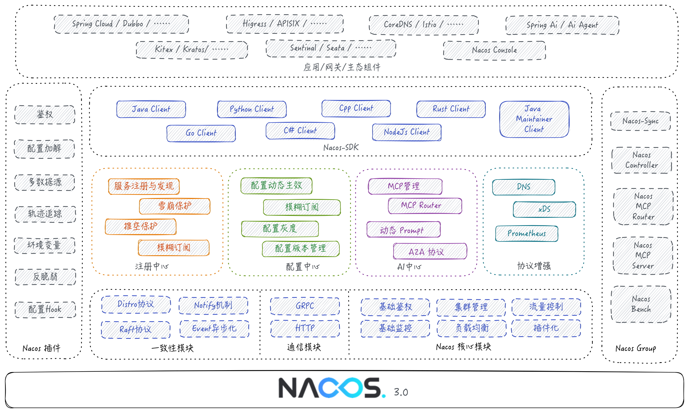

Nacos 3.0 的整体架构以一致性协议、通信模块、其他核心基础功能模块为基座，承载出注册中心、配置中心、AI Registry、协议增强等功能；同时通过各类多语言 SDK，桥接各个生态组件。

### 2.2 数据模型的统一抽象

Nacos 3.x 将传统微服务与 AI 服务统一在同一套数据模型下，通过三元组 `(Namespace, Group, ResourceName)` 实现资源的唯一标识：


| 资源类型 | ResourceName | 典型场景 |
|---------|--------------|---------|
| 微服务 | ServiceName | Dubbo/Spring Cloud 服务注册 |
| 配置 | DataId | 应用配置、开关配置 |
| MCP 服务 | McpName | AI Tool 服务注册 |
| Agent | AgentName | A2A 智能体注册 |

这种统一抽象带来的核心优势是：**AI 服务可以复用微服务已有的命名空间隔离、权限控制、多环境管理等成熟能力**。

### 2.3 一致性协议：AP 与 CP 的精妙平衡

Nacos 内核采用双协议混合架构，针对不同数据特性选择最优一致性模型：

- **Distro 协议（自研 AP）**：用于临时实例（如 MCP Server 实例）的注册，保证高可用
- **Raft 协议（JRaft CP）**：用于持久化配置（如 Tool 元数据定义），保证强一致性

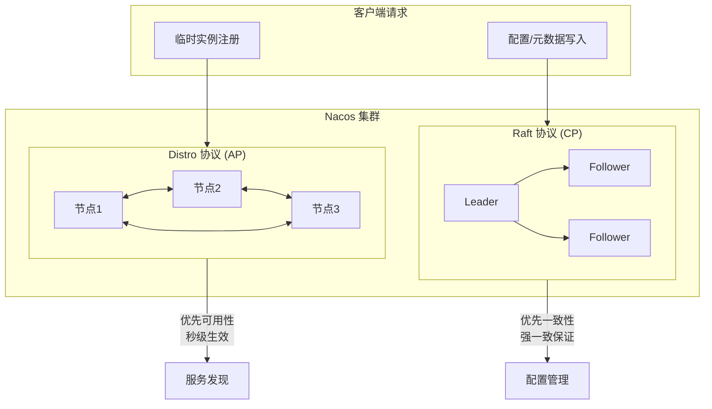

这种设计使得 MCP Server 的实例上下线可以做到秒级生效，而 Tool 的描述信息修改则能保证全局一致。

### 2.4 SDK 与 Nacos 的交互原理

无论 Java、Python 还是 Go SDK，底层逻辑高度统一。以下是 SDK 调用 Nacos 的完整交互流程：

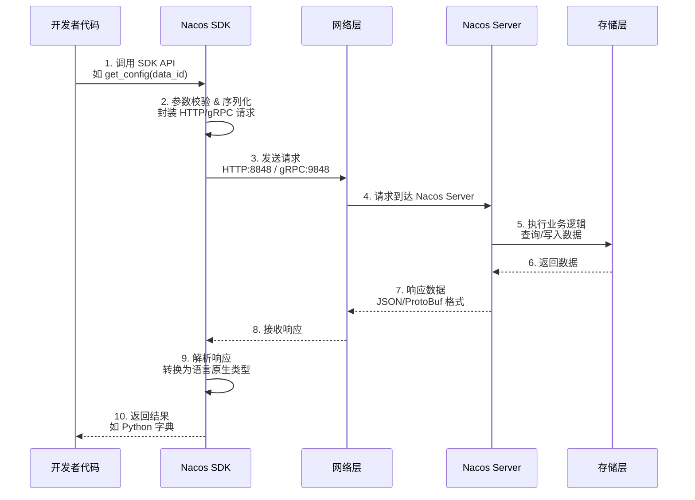

---

## 三、MCP Registry：让 AI 像调用本地函数一样调用远程服务

### 3.1 MCP 协议的技术背景

Model Context Protocol（MCP）是 Anthropic 主导的 AI 工具调用标准协议，其核心目标是：**让大模型像调用本地函数一样调用远程服务**。

Nacos 3.x 作为 MCP Registry（控制面），与 Higress 网关（数据面）协同，形成完整的 MCP 服务治理体系：


### 3.2 三类 MCP 服务注册方式

Nacos MCP Registry 支持三种注册模式，覆盖从新建到存量的全场景：

#### 方式一：存量 API 零代码转换

对于已注册到 Nacos 的 HTTP/RPC 服务，可通过控制台声明式配置，**零代码**转换为 MCP 服务。

**MCP Tool 元数据配置示例**：

```json
{
  "serviceName": "weather-api-service",
  "interfaces": [
    {
      "name": "get_weather",
      "description": "查询指定城市指定日期的天气信息",
      "parameters": [
        {
          "name": "city",
          "type": "string",
          "description": "城市名称，如：北京、上海",
          "required": true
        },
        {
          "name": "date",
          "type": "string",
          "description": "查询日期，格式：YYYY-MM-DD",
          "required": true
        }
      ],
      "backendPath": "/api/weather",
      "method": "GET"
    }
  ]
}
```

**存量 API 转 MCP 的完整流程**：

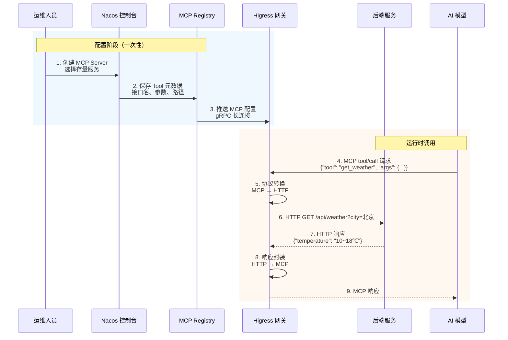

#### 方式二：SDK 自动注册（推荐）

**Java 版本（Spring AI Alibaba）**：

```java
@Service
public class WeatherService {
    
    @Tool(description = "Get weather information by city name")
    public String getWeather(
        @ToolParam(description = "City name, e.g., Beijing, Shanghai") String cityName
    ) {
        // 模拟天气数据
        Map<String, String> weatherData = Map.of(
            "Beijing", "Sunny, 10~18℃",
            "Shanghai", "Cloudy, 8~14℃",
            "Guangzhou", "Rainy, 15~22℃"
        );
        return weatherData.getOrDefault(cityName, "Unknown city");
    }
    
    @Tool(description = "Get weather forecast for the next 7 days")
    public List<String> getWeatherForecast(
        @ToolParam(description = "City name") String cityName,
        @ToolParam(description = "Number of days (1-7)") int days
    ) {
        // 返回未来几天的天气预报
        return IntStream.range(0, Math.min(days, 7))
            .mapToObj(i -> String.format("Day %d: Sunny, %d~%d℃", i+1, 10+i, 18+i))
            .collect(Collectors.toList());
    }
}
```

**Spring Boot 配置**：

```yaml
spring:
  application:
    name: weather-mcp-server
  ai:
    mcp:
      server:
        name: weather-mcp-server
        version: 1.0.0
        type: SYNC
        instructions: "Weather query MCP server"
    alibaba:
      mcp:
        nacos:
          server-addr: 127.0.0.1:8848
          namespace: public
          username: nacos
          password: nacos
          register:
            enabled: true
```

**Python 版本（nacos-mcp-wrapper）**：

```python
from nacos_mcp_wrapper.server.nacos_mcp import NacosMCP
from nacos_mcp_wrapper.server.nacos_settings import NacosSettings

# 配置 Nacos 连接
nacos_settings = NacosSettings()
nacos_settings.SERVER_ADDR = "127.0.0.1:8848"
nacos_settings.NAMESPACE = "public"
nacos_settings.USERNAME = "nacos"
nacos_settings.PASSWORD = "nacos"

# 创建 MCP Server 实例
mcp = NacosMCP(
    "weather-mcp-python", 
    nacos_settings=nacos_settings, 
    version="1.0.0", 
    port=18001
)

@mcp.tool()
def get_weather(city: str, date: str) -> dict:
    """
    Query weather information for a specific city and date.
    
    Args:
        city: City name (e.g., Beijing, Shanghai, Guangzhou)
        date: Query date in YYYY-MM-DD format
    
    Returns:
        Weather information including temperature and status
    """
    mock_data = {
        "Beijing": {"temperature": "10~18℃", "status": "Sunny"},
        "Shanghai": {"temperature": "8~14℃", "status": "Cloudy"},
        "Guangzhou": {"temperature": "15~22℃", "status": "Rainy"}
    }
    
    weather = mock_data.get(city, {"temperature": "N/A", "status": "Unknown"})
    return {
        "city": city,
        "date": date,
        "temperature": weather["temperature"],
        "status": weather["status"]
    }

@mcp.tool()
def add_numbers(a: int, b: int) -> int:
    """Add two integers together"""
    return a + b

@mcp.tool()
def search_cities(keyword: str) -> list:
    """Search cities by keyword"""
    all_cities = ["Beijing", "Shanghai", "Guangzhou", "Shenzhen", "Hangzhou"]
    return [city for city in all_cities if keyword.lower() in city.lower()]

if __name__ == "__main__":
    # 启动 MCP Server（支持 stdio/sse/streamable-http）
    mcp.run(transport="sse")
```

**MCP Server 自动注册流程**：

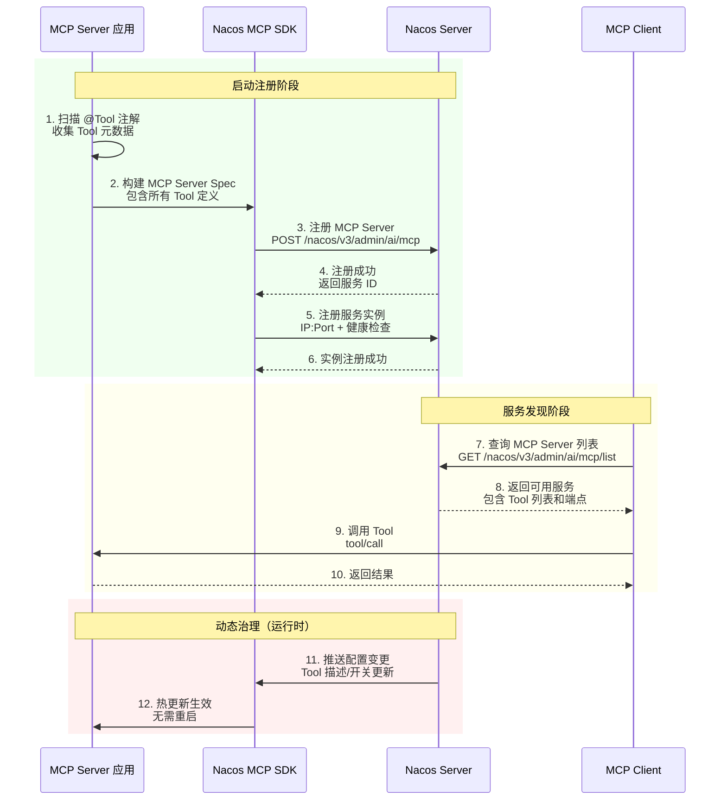

### 3.3 Tool 元数据的动态治理

Nacos 3.x 的核心价值之一是实现了 Tool 的**运行时热更新**：

| 治理能力 | 说明 | 生效时间 |
|---------|------|---------|
| 描述更新 | 修改 Tool/参数的 description | 实时（无需重启）|
| 动态开关 | 禁用/启用特定 Tool | 实时 |
| 版本管理 | Tool schema 变更时自动创建新版本 | 发布后生效 |
| 灰度发布 | 指定 IP 范围获取特定版本 | 配置后生效 |

这意味着当 Prompt 工程师需要调优 Tool 的描述以提升模型选择准确率时，无需触发任何服务重启，修改立即生效。

---

## 四、Nacos MCP Router：智能工具分发的最后一公里

### 4.1 解决 Tool 爆炸问题

当 MCP Server 数量膨胀到数十个、Tool 数量达到数百个时，模型会出现"选择困难症"——过长的 Tool 列表不仅超出上下文窗口限制，还会显著降低工具选择的准确率。

Nacos MCP Router 应运而生，它是一个基于 MCP 官方 SDK 开发的**元 MCP Server**：


### 4.2 核心工具说明

| 工具名称 | 功能描述 | 输入参数 |
|---------|---------|---------|
| `search_mcp_server` | 根据任务语义搜索最匹配的 MCP Server | task_description, key_words |
| `add_mcp_server` | 动态加载并初始化指定 MCP Server | mcp_server_name |
| `use_tool` | 代理调用目标 MCP Server 的工具 | mcp_server_name, mcp_tool_name, params |

### 4.3 完整工作流程

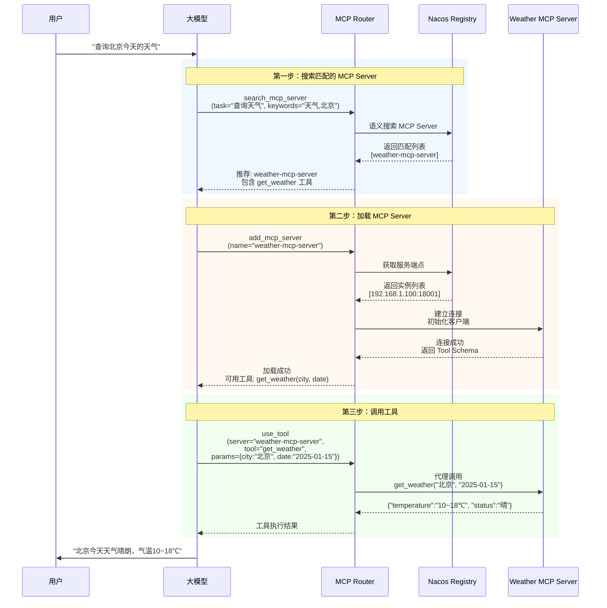

### 4.4 部署方式

支持 stdio/sse/streamable-http 三种协议，可通过 uvx 或 Docker 快速部署：

```bash
# 方式一：使用 uvx（推荐）
export NACOS_ADDR=127.0.0.1:8848
export NACOS_USERNAME=nacos
export NACOS_PASSWORD=your_password
export TRANSPORT_TYPE=streamable_http
uvx nacos-mcp-router@latest

# 方式二：使用 Docker
docker run -i --rm --network host \
  -e NACOS_ADDR=$NACOS_ADDR \
  -e NACOS_USERNAME=$NACOS_USERNAME \
  -e NACOS_PASSWORD=$NACOS_PASSWORD \
  -e TRANSPORT_TYPE=streamable_http \
  nacos-mcp-router:latest
```

**Cherry Studio / Cursor 配置示例**：

```json
{
  "mcpServers": {
    "nacos-mcp-router": {
      "command": "uvx",
      "args": ["nacos-mcp-router@latest"],
      "env": {
        "NACOS_ADDR": "127.0.0.1:8848",
        "NACOS_USERNAME": "nacos",
        "NACOS_PASSWORD": "your_password"
      }
    }
  }
}
```

---

## 五、Python SDK 实战：配置管理与服务发现

### 5.1 环境准备

```bash
# 1. 拉取并启动 Nacos（Docker 方式）
docker run -d \
  --name nacos-server \
  -p 8848:8848 \
  -p 9848:9848 \
  -e MODE=standalone \
  -e NACOS_AUTH_ENABLE=false \
  nacos/nacos-server:v2.3.2

# 2. 安装 Python SDK
pip install nacos-sdk-python
```

### 5.2 配置管理完整示例

```python
from nacos import NacosClient
import time
import json

def main():
    # 1. 初始化 Nacos 客户端
    client = NacosClient(
        server_addresses="localhost:8848",
        namespace=""  # 默认 public 命名空间
    )
    
    # 2. 发布配置
    config_content = {
        "name": "nacos-python-demo",
        "version": "1.0.0",
        "env": "dev",
        "db_config": {
            "host": "localhost",
            "port": 3306,
            "database": "test_db"
        },
        "feature_flags": {
            "new_ui": True,
            "beta_api": False
        }
    }
    
    publish_result = client.publish_config(
        data_id="python-demo-config",
        group="DEFAULT_GROUP",
        content=json.dumps(config_content, indent=2)
    )
    print(f"✅ 发布配置结果：{publish_result}")
    
    # 3. 读取配置
    config = client.get_config(
        data_id="python-demo-config",
        group="DEFAULT_GROUP"
    )
    config_dict = json.loads(config)
    print(f"📖 读取到的配置：{json.dumps(config_dict, indent=2, ensure_ascii=False)}")
    
    # 4. 监听配置变化
    def config_listener(content):
        print("\n🔔 配置发生变更！")
        updated_config = json.loads(content)
        print(f"新配置：{json.dumps(updated_config, indent=2, ensure_ascii=False)}")
        
        # 业务逻辑：根据配置变化执行相应操作
        if updated_config.get("feature_flags", {}).get("new_ui"):
            print("🎨 新 UI 特性已启用")
    
    client.add_config_listener(
        data_id="python-demo-config",
        group="DEFAULT_GROUP",
        cb=config_listener
    )
    
    print("\n⏳ 开始监听配置变化（在 Nacos 控制台修改配置试试...）")
    
    try:
        while True:
            time.sleep(1)
    except KeyboardInterrupt:
        print("\n🛑 停止监听")

if __name__ == "__main__":
    main()
```

**配置监听机制流程**：

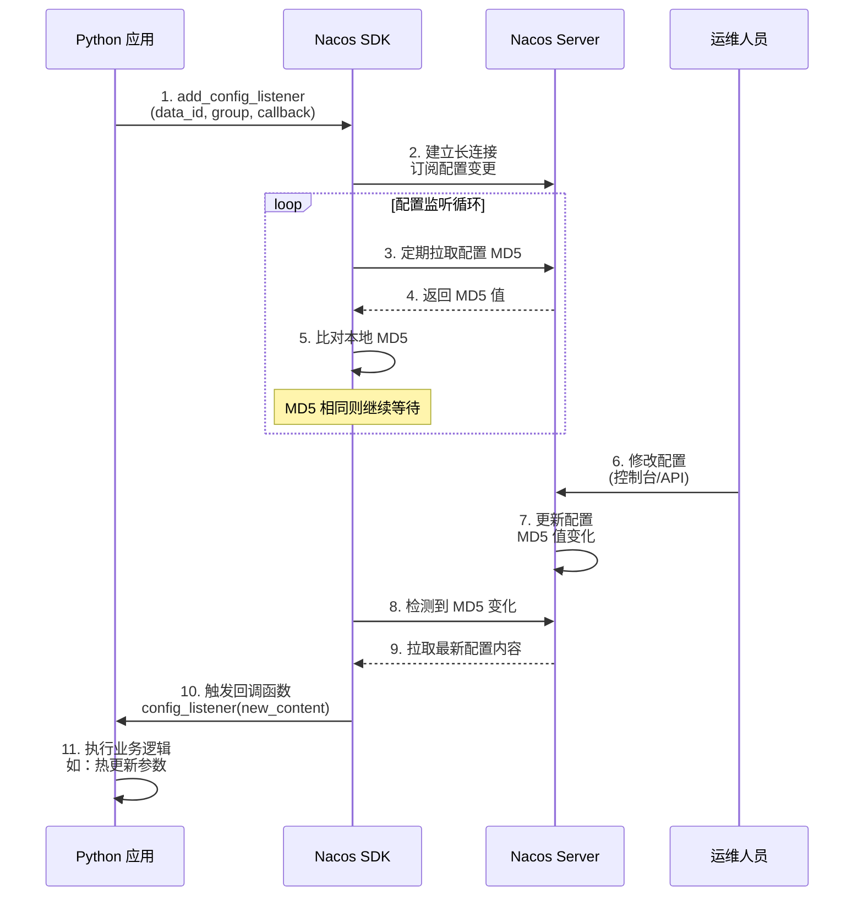

### 5.3 服务注册与发现完整示例

```python
from nacos import NacosClient
import time

def main():
    client = NacosClient(
        server_addresses="localhost:8848",
        namespace=""
    )
    
    # 1. 注册服务实例
    register_result = client.add_naming_instance(
        service_name="python-demo-service",
        ip="127.0.0.1",
        port=8080,
        group_name="DEFAULT_GROUP",
        cluster_name="DEFAULT",
        weight=1.0,
        metadata={
            "version": "1.0.0",
            "env": "dev",
            "region": "cn-hangzhou"
        },
        ephemeral=True  # 临时实例，自动心跳
    )
    print(f"✅ 注册服务实例：{register_result}")
    
    # 2. 注册第二个实例（模拟多实例部署）
    client.add_naming_instance(
        service_name="python-demo-service",
        ip="127.0.0.1",
        port=8081,
        group_name="DEFAULT_GROUP",
        metadata={"version": "1.0.1", "env": "dev"}
    )
    print("✅ 注册第二个实例")
    
    # 3. 查询服务实例
    instances = client.list_naming_instances(
        service_name="python-demo-service",
        group_name="DEFAULT_GROUP",
        healthy_only=True
    )
    
    print(f"\n📋 查询到 {len(instances)} 个健康实例：")
    for idx, instance in enumerate(instances, 1):
        print(f"\n  实例 {idx}:")
        print(f"    地址: {instance.ip}:{instance.port}")
        print(f"    权重: {instance.weight}")
        print(f"    元数据: {instance.metadata}")
        print(f"    健康: {'✓' if instance.healthy else '✗'}")
    
    # 4. 监听服务变化
    def service_listener(event):
        print(f"\n🔔 服务实例变化：{event}")
    
    client.subscribe(
        service_name="python-demo-service",
        group_name="DEFAULT_GROUP",
        listener=service_listener
    )
    
    print("\n⏳ 监听服务实例变化...")
    
    # 5. 模拟服务下线
    time.sleep(5)
    client.remove_naming_instance(
        service_name="python-demo-service",
        ip="127.0.0.1",
        port=8081,
        group_name="DEFAULT_GROUP"
    )
    print("\n🔻 已注销端口 8081 的实例")
    
    time.sleep(10)

if __name__ == "__main__":
    main()
```

---

## 六、FastAPI 实战：无侵入注册与 MCP 服务

### 6.1 无侵入式服务注册（Agent 模式）

**应用代码（零 Nacos 依赖）**：

```python
# app.py - 纯业务逻辑，无任何 Nacos 相关代码
from fastapi import FastAPI, Query
from pydantic import BaseModel
from typing import Optional, List
from datetime import datetime

app = FastAPI(
    title="天气查询 API 服务",
    description="基于 FastAPI 实现，支持 Nacos Agent 无侵入注册",
    version="1.0.0"
)

class WeatherResponse(BaseModel):
    city: str
    date: str
    temperature: str
    status: str
    humidity: Optional[int] = None
    wind: Optional[str] = None

class ForecastItem(BaseModel):
    date: str
    temperature: str
    status: str

# 模拟天气数据
WEATHER_DATA = {
    "北京": {"temperature": "10~18℃", "status": "晴", "humidity": 45, "wind": "北风3级"},
    "上海": {"temperature": "8~14℃", "status": "多云", "humidity": 65, "wind": "东风2级"},
    "广州": {"temperature": "15~22℃", "status": "小雨", "humidity": 80, "wind": "南风1级"},
    "深圳": {"temperature": "16~23℃", "status": "阴", "humidity": 75, "wind": "东南风2级"},
}

@app.get("/health", summary="健康检查")
async def health_check():
    """Agent 健康探测接口"""
    return {
        "status": "healthy",
        "service": "weather-api-service",
        "timestamp": datetime.now().isoformat()
    }

@app.get("/api/weather", response_model=WeatherResponse, summary="查询天气")
async def get_weather(
    city: str = Query(..., description="城市名称"),
    date: str = Query(default=None, description="查询日期，格式 YYYY-MM-DD")
):
    """查询指定城市的天气信息"""
    if date is None:
        date = datetime.now().strftime("%Y-%m-%d")
    
    weather = WEATHER_DATA.get(city, {
        "temperature": "N/A", 
        "status": "未知城市",
        "humidity": None,
        "wind": None
    })
    
    return WeatherResponse(
        city=city,
        date=date,
        **weather
    )

@app.get("/api/forecast", response_model=List[ForecastItem], summary="天气预报")
async def get_forecast(
    city: str = Query(..., description="城市名称"),
    days: int = Query(default=3, ge=1, le=7, description="预报天数")
):
    """获取未来几天的天气预报"""
    base_weather = WEATHER_DATA.get(city, {"temperature": "N/A", "status": "未知"})
    
    forecast = []
    for i in range(days):
        forecast.append(ForecastItem(
            date=f"Day {i+1}",
            temperature=base_weather["temperature"],
            status=base_weather["status"]
        ))
    
    return forecast

if __name__ == "__main__":
    import uvicorn
    uvicorn.run(app, host="0.0.0.0", port=5000)
```

**Agent 无侵入注册流程**：

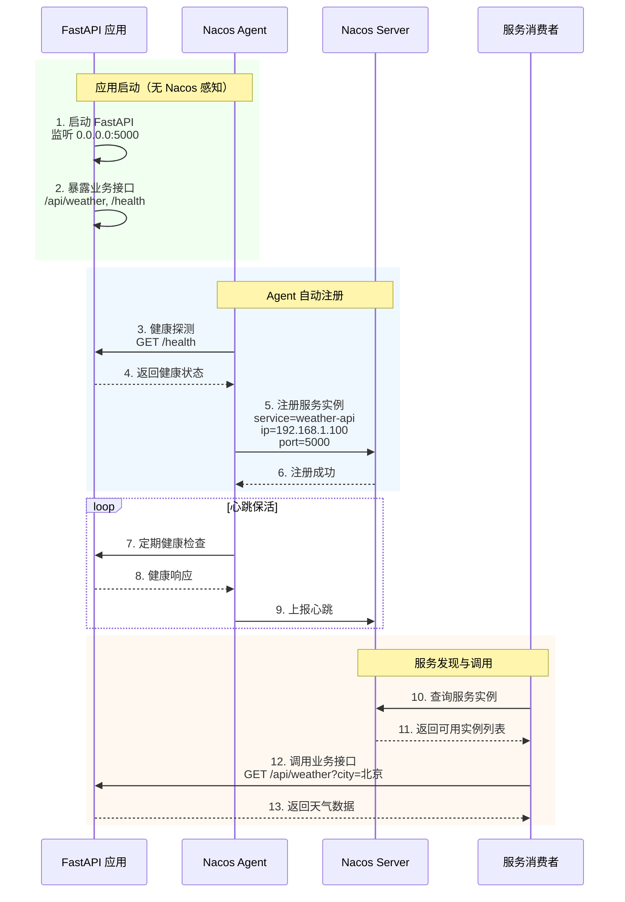

**Docker 部署命令**：

```bash
# 1. 启动 Nacos 3.x
docker run -d \
  --name nacos-3x \
  -p 8848:8848 \
  -p 9848:9848 \
  -e MODE=standalone \
  -e NACOS_AUTH_ENABLE=false \
  nacos/nacos-server:v3.3.0

# 2. 启动 Nacos Agent
docker run -d \
  --name nacos-agent \
  --link nacos-3x:nacos \
  -e NACOS_SERVER_ADDR="nacos:8848" \
  -e AGENT_REGISTRY_APP_NAME="weather-api-service" \
  -e AGENT_REGISTRY_APP_IP="192.168.1.100" \
  -e AGENT_REGISTRY_APP_PORT="5000" \
  -e AGENT_HEALTH_CHECK_INTERVAL="5" \
  nacos/nacos-agent:v3.3.0

# 3. 启动 FastAPI 应用
python app.py
```

---

## 七、生产部署与高可用设计

### 7.1 部署模式对比

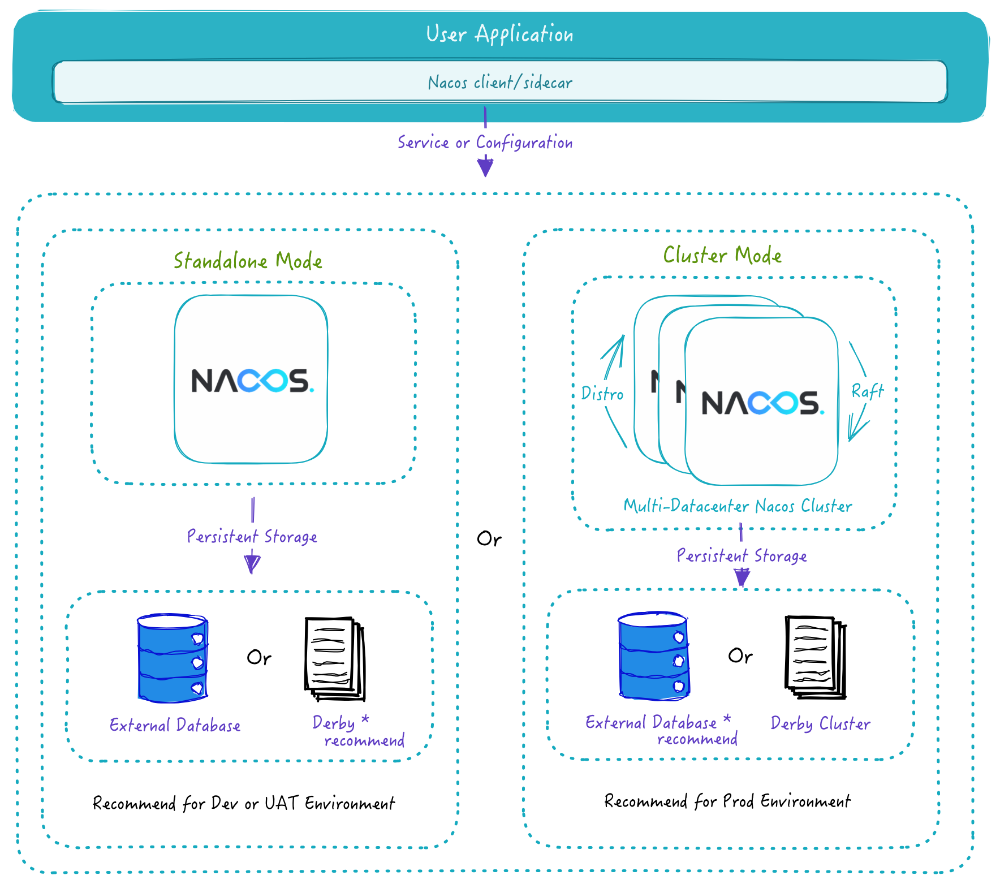

| 模式 | 适用场景 | 数据存储 | 高可用 |
|------|---------|---------|-------|
| 单机模式 | 开发测试 | 内置 Derby | ✗ |
| 集群模式 | 生产环境 | 外置 MySQL | ✓ |

### 7.2 集群高可用架构

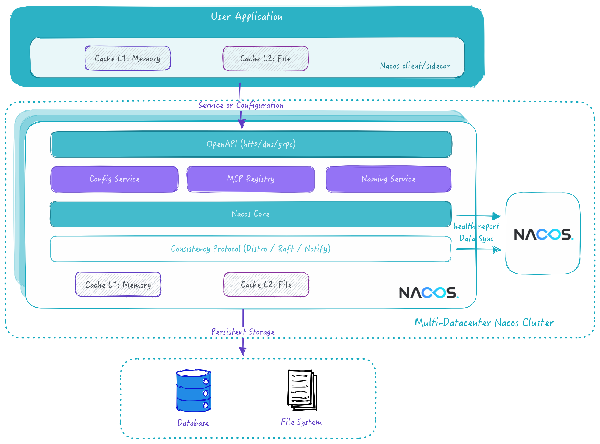

**关键配置建议**：

```yaml
# Nacos 集群配置
nacos:
  cluster:
    nodes: 3  # 最少 3 节点（Raft 协议要求）
    
  datasource:
    type: mysql
    url: jdbc:mysql://mysql-master:3306/nacos?characterEncoding=utf8
    username: nacos
    password: ${NACOS_DB_PASSWORD}
    
  jvm:
    heap: "-Xms4g -Xmx4g"
    gc: "-XX:+UseG1GC"
    
  network:
    inter_node_latency: "<5ms"  # 节点间延迟要求
```

### 7.3 性能指标

| 场景 | 规模 | SLA |
|------|------|-----|
| 实例上下线推送 | 1w 实例 | 1s 内 99.9% 完成 |
| 实例上下线推送 | 10w 实例 | 3s 内 99.9% 完成 |
| 配置变更推送 | 任意规模 | 毫秒级生效 |
| 长连接承载 | 单节点 | 10w+ 连接 |

---

## 八、生态组件与扩展能力

### 8.1 丰富的生态集成

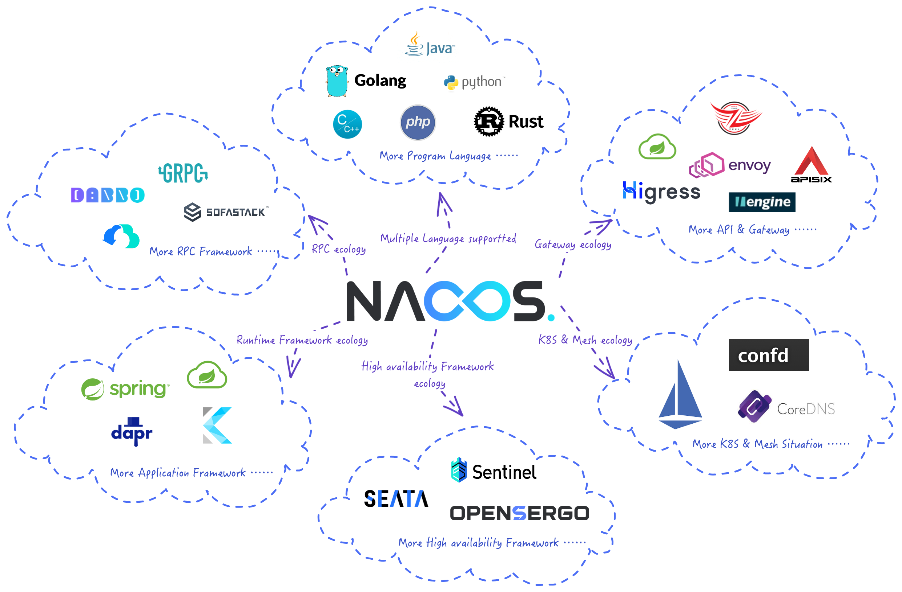

Nacos 几乎支持所有主流语言和框架，构建了完整的云原生生态：

- **微服务框架**：Spring Cloud、Dubbo、gRPC、Kubernetes Service
- **AI 框架**：Spring AI Alibaba、Dify、Model Context Protocol
- **多语言 SDK**：Java、Python、Go、Node.js、C#
- **服务网格**：Istio、Envoy、Dapr

### 8.2 插件化扩展

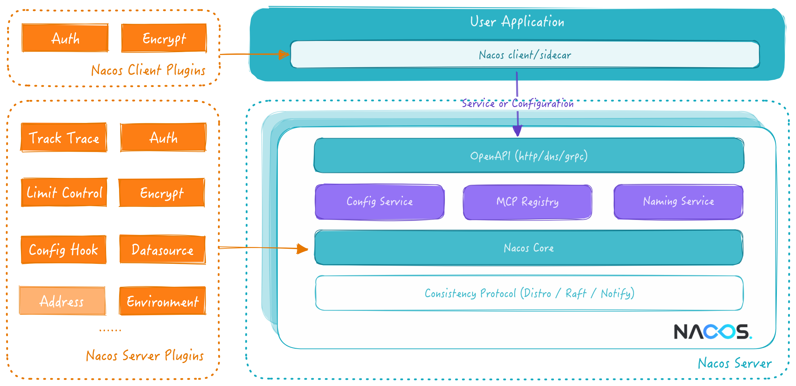

Nacos 采用模块化设计，支持自定义插件扩展：

- **认证插件**：对接企业 LDAP/SSO
- **存储插件**：支持 PostgreSQL、Oracle 等数据库
- **监控插件**：集成 Prometheus、Grafana
- **审计插件**：对接企业审计系统

---

## 九、总结与展望

### 9.1 核心价值总结

Nacos 3.x 通过三个核心能力，完成了从微服务基座到 AI 原生注册中心的演进：

| 能力 | 解决的问题 | 适用场景 |
|------|-----------|---------|
| MCP Registry | MCP Server 的统一治理 | AI 工具服务化 |
| A2A Registry | 多智能体的协同通信 | Multi-Agent 系统 |
| 存量 API 转换 | 降低 AI 集成成本 | 企业存量系统改造 |

### 9.2 未来演进方向

根据 Nacos 官方 Roadmap，后续重点演进方向包括：

1. **多语言 A2A SDK**：Python、Go 等语言的 A2A Client 支持
2. **语义化检索**：基于 skills/tags/description 的 Agent 智能发现
3. **A2A Registry Protocol**：跟进官方标准协议定义
4. **MCP 工具精选**：与 AI 网关联动，实现 Tool 的智能压缩与排序

---

## 参考资料

1. [Nacos 官方文档](https://nacos.io/docs/latest/overview/)
2. [Model Context Protocol 官方规范](https://modelcontextprotocol.io/)
3. [A2A Protocol 官方规范](https://a2a-protocol.org/)
4. [Spring AI Alibaba 文档](https://java2ai.com/)
5. [Higress MCP 网关实战](https://higress.cn/ai/mcp-quick-start/)
6. [nacos-mcp-wrapper-python](https://github.com/nacos-group/nacos-mcp-wrapper-python)
7. [Nacos MCP Router](https://github.com/nacos-group/nacos-mcp-router)

---

> 作者注：本文基于 Nacos 3.1.1 版本撰写，部分 API 可能随版本迭代有所变化，请以官方文档为准。