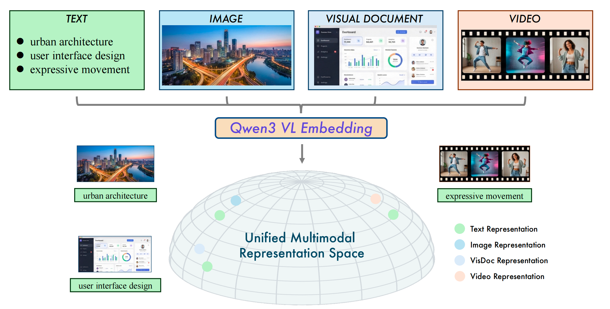
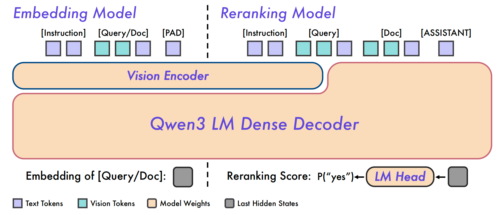
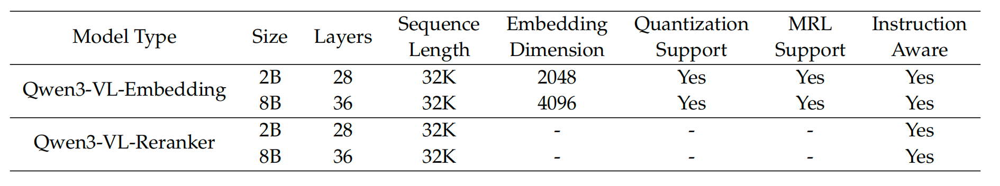
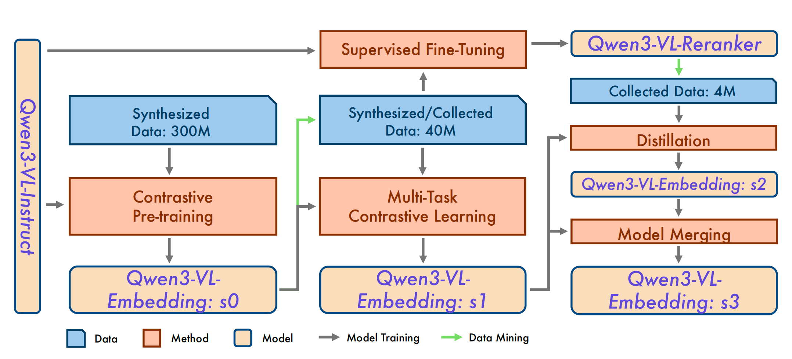
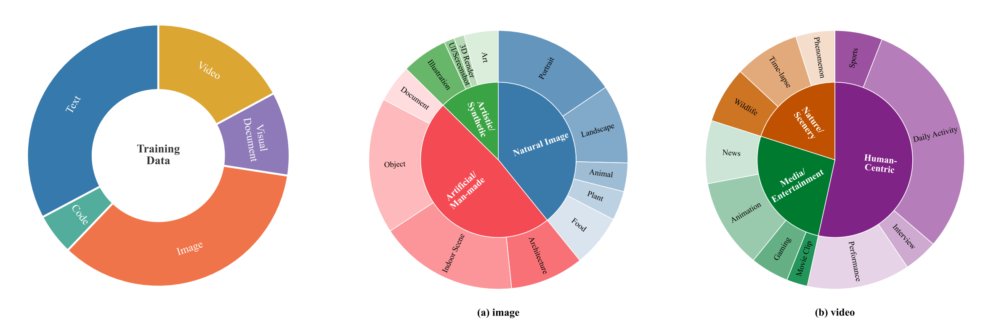
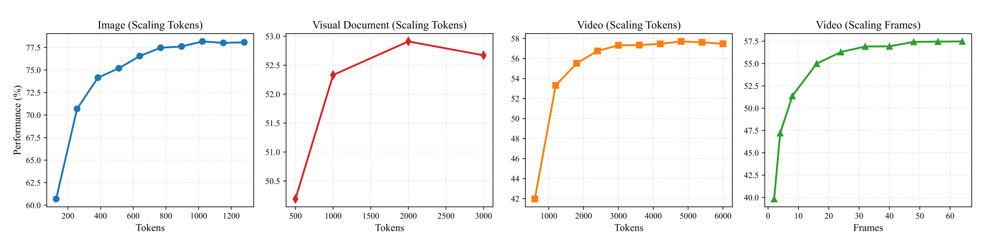

# Qwen3-VL-Embedding：统一多模态检索框架的技术解析与实践

## 摘要

Qwen3-VL-Embedding 和 Qwen3-VL-Reranker 是基于 Qwen3-VL 基础模型构建的多模态检索与排序模型系列，在 MMEB-V2 基准测试中取得了 77.8 分的 SOTA 成绩。本文深入解析其架构设计、训练策略和核心实现，并通过代码实践展示如何在实际场景中应用这些模型。



*Figure 1: 统一多模态表示空间示意图。Qwen3-VL-Embedding 将多源数据（文本、图像、视觉文档和视频）映射到共同的语义流形*

## 1. 背景与问题定义

### 1.1 多模态检索的挑战

多模态内容的爆炸式增长，其中充斥着图像、文档截图、视频等多样化数据模态，这要求检索系统能够：
- **跨模态理解**：理解文本与图像/视频之间的语义关联
- **统一表示空间**：将不同模态映射到同一语义空间
- **细粒度排序**：对候选结果进行精确的相关性评分

### 1.2 现有方案的局限

虽然 CLIP 等模型在图像-文本对齐方面取得了成功，但面对复杂多模态检索任务时仍存在不足：

- **模态覆盖有限**：难以处理 **视频、视觉文档** 等复杂模态
- **任务泛化能力弱**：在分类、QA、检索等不同任务间性能不平衡
- **部署效率低**：缺乏灵活的维度选择和量化支持

Qwen3-VL-Embedding 系列通过基于 VLM 的统一架构和多阶段训练策略，有效解决了这些问题。

## 2. 架构设计

### 2.1 整体架构

Qwen3-VL-Embedding 和 Qwen3-VL-Reranker 采用双塔（Dual-Tower）和单塔（Single-Tower）两种架构，分别服务于召回和精排两个阶段：


**模型规格**：


| 模型类型 | 参数量 | 层数 | 序列长度 | Embedding维度 | 量化支持 | MRL支持 |
|---------|--------|------|----------|--------------|---------|--------|
| Qwen3-VL-Embedding-2B | 2B | 28 | 32K | 2048 | ✅ | ✅ |
| Qwen3-VL-Embedding-8B | 8B | 36 | 32K | 4096 | ✅ | ✅ |
| Qwen3-VL-Reranker-2B | 2B | 28 | 32K | - | - | - |
| Qwen3-VL-Reranker-8B | 8B | 36 | 32K | - | - | - |

### 2.2 Embedding 模型：双塔架构

Embedding 模型采用双塔架构，分别对query和文档进行独立编码，适合大规模检索场景：

**核心特点**：
- **独立编码**：query和文档可独立编码，支持离线索引构建
- **高效检索**：通过余弦相似度快速计算相关性
- **灵活输入**：支持文本、图像、视频及其组合

**输入模板**：
```python
<|im_start|>system
{Instruction}
<|im_end|>
<|im_start|>user
{Instance}
<|im_end|><|endoftext|>
```

### 2.3 Reranker 模型：单塔架构

Reranker 模型采用单塔架构，通过交叉注意力机制进行深度交互：

**核心特点**：
- **深度交互**：Query 和 Document 在同一序列中进行交叉注意力计算
- **精确评分**：通过预测 "yes"/"no" token 的概率计算相关性分数
- **细粒度判断**：能够捕捉微妙的语义差异

**输入模板**：
```
<|im_start|>system
Judge whether the Document meets the requirements based on the Query and the Instruct provided. 
Note that the answer can only be "yes" or "no".
<|im_end|>
<|im_start|>user
<Instruct>: {Instruction}
<Query>: {Query}
<Document>: {Document}
<|im_end|>
```

## 3. 核心实现解析

### 3.1 Embedding 模型实现

基于代码分析，Embedding 模型的核心实现包含以下几个关键组件：

#### 3.1.1 模型封装类

```python
class Qwen3VLForEmbedding(Qwen3VLPreTrainedModel):
    """基于 Qwen3VLModel 的 Embedding 封装"""
    def __init__(self, config):
        super().__init__(config)
        self.model = Qwen3VLModel(config)
    
    def forward(self, input_ids, pixel_values=None, 
                pixel_values_videos=None, ...):
        outputs = self.model(...)
        return Qwen3VLForEmbeddingOutput(
            last_hidden_state=outputs.last_hidden_state,
            attention_mask=attention_mask
        )
```

**设计要点**：
- 继承 `Qwen3VLPreTrainedModel`，复用 Qwen3-VL 的视觉-语言理解能力
- 直接返回 hidden states，不进行生成任务的前向传播

#### 3.1.2 特征提取与池化

Embedding 模型的关键在于如何从模型的 hidden states 中提取固定维度的向量表示：

```python
@staticmethod
def _pooling_last(hidden_state: torch.Tensor, 
                  attention_mask: torch.Tensor) -> torch.Tensor:
    """提取最后一个非填充 token 的 hidden state"""
    # 翻转 attention_mask，找到最后一个非零位置
    flipped_tensor = attention_mask.flip(dims=[1])
    last_one_positions = flipped_tensor.argmax(dim=1)
    col = attention_mask.shape[1] - last_one_positions - 1
    row = torch.arange(hidden_state.shape[0], device=hidden_state.device)
    return hidden_state[row, col]
```

**为什么使用最后一个 token**：
- `<|endoftext|>` token 位于序列末尾，聚合了所有上下文信息
- 相比平均池化，最后一个 token 能更好地保留序列的语义完整性
- 与训练时的目标一致（使用最后一个 token 的 hidden state）

#### 3.1.3 多模态输入处理

模型支持灵活的输入格式，包括文本、图像、视频及其组合：

```python
def format_model_input(self, text=None, image=None, video=None, 
                      instruction=None, fps=None, max_frames=None):
    """格式化多模态输入为对话格式"""
    conversation = [
        {"role": "system", "content": [{"type": "text", 
                                       "text": instruction or self.default_instruction}]},
        {"role": "user", "content": content}
    ]
    
    # 处理视频输入
    if video:
        if isinstance(video, list):
            # 帧序列：均匀采样
            video_content = sample_frames(video_content, self.num_frames, self.max_frames)
        elif isinstance(video, str):
            # 视频文件：按 fps 采样
            video_kwargs = {'fps': fps or self.fps, 
                          'max_frames': max_frames or self.max_frames}
        content.append({'type': 'video', 'video': video_content, **video_kwargs})
    
    # 处理图像输入
    if image:
        content.append({
            'type': 'image', 
            'image': image_content,
            "min_pixels": self.min_pixels,  # 最小像素数：4×32×32 = 4096
            "max_pixels": self.max_pixels    # 最大像素数：1800×32×32 ≈ 1.8M
        })
    
    # 处理文本输入
    if text:
        content.append({'type': 'text', 'text': text})
    
    return conversation
```

**关键参数**：
- **图像分辨率控制**：`min_pixels=4096`, `max_pixels=1843200`（约 1280×1440）
- **视频采样策略**：默认 1 FPS，最多 64 帧，总像素预算约 786 万像素
- **动态分辨率**：保持宽高比的同时限制 token 消耗

#### 3.1.4 完整推理流程

```python
def process(self, inputs: List[Dict[str, Any]], normalize: bool = True):
    """完整的 Embedding 生成流程"""
    # 1. 格式化输入为对话格式
    conversations = [self.format_model_input(
        text=ele.get('text'),
        image=ele.get('image'),
        video=ele.get('video'),
        instruction=ele.get('instruction'),
        fps=ele.get('fps'),
        max_frames=ele.get('max_frames')
    ) for ele in inputs]
    
    # 2. 预处理：tokenize + 视觉特征提取
    processed_inputs = self._preprocess_inputs(conversations)
    processed_inputs = {k: v.to(self.model.device) for k, v in processed_inputs.items()}
    
    # 3. 前向传播
    outputs = self.forward(processed_inputs)
    
    # 4. 池化：提取最后一个 token 的 hidden state
    embeddings = self._pooling_last(
        outputs['last_hidden_state'], 
        outputs['attention_mask']
    )
    
    # 5. L2 归一化（用于余弦相似度计算）
    if normalize:
        embeddings = F.normalize(embeddings, p=2, dim=-1)
    
    return embeddings
```

### 3.2 Reranker 模型实现

Reranker 模型的核心在于如何计算 Query-Document 对的相关性分数：

#### 3.2.1 相关性分数计算

```python
def get_binary_linear(self, model, token_yes, token_no):
    """构建二元分类线性层：yes - no"""
    lm_head_weights = model.lm_head.weight.data
    weight_yes = lm_head_weights[token_yes]
    weight_no = lm_head_weights[token_no]
    
    # 构建线性层：输出 = (weight_yes - weight_no) @ hidden_state
    linear_layer = torch.nn.Linear(D, 1, bias=False)
    with torch.no_grad():
        linear_layer.weight[0] = weight_yes - weight_no
    return linear_layer

@torch.no_grad()
def compute_scores(self, inputs):
    """计算相关性分数"""
    # 获取最后一个 token 的 hidden state
    batch_scores = self.model(**inputs).last_hidden_state[:, -1]
    
    # 通过线性层计算 logit
    scores = self.score_linear(batch_scores)
    
    # Sigmoid 归一化到 [0, 1]
    scores = torch.sigmoid(scores).squeeze(-1).cpu().detach().tolist()
    return scores
```

**设计原理**：
- 利用语言模型 head 中 "yes" 和 "no" token 的权重差
- 通过 `sigmoid(logit_yes - logit_no)` 计算相关性概率
- 相比直接分类，这种方式能更好地利用预训练模型的语义理解能力

#### 3.2.2 输入格式化

Reranker 需要将 Query 和 Document 组合到同一序列中：

```python
def format_mm_instruction(self, query_text, query_image, query_video,
                         doc_text, doc_image, doc_video, instruction=None):
    """格式化 Reranker 输入"""
    inputs = [{
        "role": "system",
        "content": [{
            "type": "text",
            "text": "Judge whether the Document meets the requirements..."
        }]
    }]
    
    contents = [
        {"type": "text", "text": '<Instruct>: ' + instruction},
        # Query 内容
        *self.format_mm_content(query_text, query_image, query_video, 
                               prefix='<Query>:'),
        # Document 内容
        *self.format_mm_content(doc_text, doc_image, doc_video, 
                               prefix='\n<Document>:')
    ]
    
    inputs.append({"role": "user", "content": contents})
    return inputs
```

## 4. 训练策略

### 4.1 多阶段训练流程

Qwen3-VL-Embedding 采用三阶段训练策略，逐步提升模型性能：


#### Stage 1: 对比预训练（Contrastive Pre-training）

**目标**：在大规模合成数据上建立基础的相关性理解能力

**数据**：使用 Qwen3-VL-32B 生成的多模态、多任务合成数据

**损失函数**：扩展的 InfoNCE 损失

$$
\mathcal{L}_{\text{retrieval}} = -\frac{1}{N} \sum_{i}^{N} \log \frac{e^{(s(q_i, d_i^+) / \tau)}}{Z_i}
$$

其中 $Z_i$ 包含：
- 正样本对 $(q_i, d_i^+)$
- K 个硬负样本 $\{d_{i,k}^{-}\}_{k=1}^{K}$
- Batch 内其他query $\{q_j\}_{j \neq i}$
- Batch 内其他文档 $\{d_j\}_{j \neq i}$

**关键技巧**：False Negative 掩码机制

$$
m_{ij} = \begin{cases}
0, & \text{if } s_{ij} > s(q_i, d_i^+) + 0.1 \text{ or } d_j = d_i^+ \\
1, & \text{otherwise}
\end{cases}
$$

当相似度分数过高时，可能是误判的负样本，需要掩码避免错误优化。

#### Stage 2: 多任务对比学习与监督微调

**目标**：在高质量数据上提升多任务性能

**数据**：精选的公开数据集 + 内部数据 + 采样合成数据

**改进**：
- 使用 Stage 1 训练的模型进行数据挖掘，提升数据质量
- 针对不同任务类型设计专门的对比目标
- 同时训练 Reranker 模型

**损失函数调整**：移除 query-query 和 document-document 对比项，专注于 query-document 对齐

#### Stage 3: 蒸馏与模型合并

**目标**：从 Reranker 中蒸馏相关性判别能力

**流程**：
1. **蒸馏**：使用 Reranker 生成细粒度相关性分数，指导 Embedding 模型训练
   $$
   \mathcal{L}_{\text{distill}} = -\sum_{i=1}^{k+1} P_{\text{reranker}}(d_i | q) \log P_{\text{embedding}}(d_i | q)
   $$
2. **模型合并**：将蒸馏后的模型（s2）与 Stage 2 模型（s1）合并，平衡检索和分类/QA 任务性能

### 4.2 数据合成策略



*Figure 3 & 4: 训练数据中不同类别的分布（左）和数据合成种子池的分布（右）*

#### 4.2.1 种子池构建

1. **质量过滤**：过滤低分辨率、异常宽高比的素材
2. **结构优化**：视频场景切分、去除静态/损坏片段
3. **细粒度标注**：使用 Qwen3-VL-32B 生成类别标签
4. **跨模态对齐**：使用 GME 模型过滤低置信度或视觉-文本不对齐的样本
5. **类别重平衡**：确保各类别数据分布均衡

#### 4.2.2 任务特定数据合成

**图像任务**：
- **分类**：图像 + 分类指令 → 类别标签
- **问答**：图像 + 问题 → 答案
- **检索**：搜索文本 → 候选图像

**视频任务**：
- **分类**：视频 + 分类任务 → 类别
- **问答**：视频 + 问题 → 答案
- **检索**：文本描述 → 候选视频
- **时刻检索**：文本query + 关键帧 → 视频片段

### 4.3 硬负样本挖掘

硬负样本在对比学习中至关重要：

```python
# 1. Recall：使用 Embedding 模型检索 Top-K 候选
for query in queries:
    candidates = retrieve_topk(query, corpus, K=100)
    scores = cosine_similarity(query_emb, candidate_embs)

# 2. Positive Refinement：过滤低质量正样本
if max(positive_scores) < threshold_positive:
    discard(query)  # 正样本质量不足，丢弃该query

# 3. Hard Negative Selection：选择困难负样本
avg_positive_score = mean(positive_scores)
for candidate in candidates:
    if candidate not in positives:
        if candidate_score < avg_positive_score + margin:
            add_as_hard_negative(candidate)
```

**关键参数**：
- `threshold_positive`：正样本分数阈值
- `margin`：安全边距，避免误判负样本

## 5. 高效推理技术

### 5.1 Matryoshka Representation Learning (MRL)

MRL 允许在训练时同时优化多个维度的表示，推理时可根据存储和计算约束灵活选择维度：

```python
# 训练时：同时计算多个维度的损失
for dim in [128, 256, 512, 1024, 2048]:
    truncated_emb = embedding[:, :dim]
    loss_dim = compute_loss(truncated_emb, ...)
    total_loss += loss_dim

# 推理时：选择合适维度
embedding_512 = embedding[:, :512]  # 50% 存储，性能损失 < 2%
```

**优势**：
- 无需重训练即可调整维度
- 在存储和性能间灵活权衡
- 训练时只需覆盖足够密集的维度集合

### 5.2 Quantization-Aware Training (QAT)

通过量化感知训练，模型在低精度（int8 或 binary）下仍能保持性能：

```python
# 训练时：同时使用全精度和量化表示
full_precision_emb = model(input)
quantized_emb = quantize(full_precision_emb, bits=8)

# 计算损失时同时考虑两种表示
loss = loss_fn(full_precision_emb, ...) + loss_fn(quantized_emb, ...)
```

**量化效果**：
- **int8 量化**：性能损失可忽略（< 1%）
- **Binary 量化**：性能下降明显，但随着维度降低影响增大
Figure 6: 不同嵌入维度和量化方案下的性能分析（MSMARCO 和 VL3-Syn 数据集），展示了 MRL 和 QAT 技术在文本检索和跨模态图像检索任务上的性能表现，可以看到在合理维度范围内，性能下降是可接受的。

## 6. 实践指南

### 6.1 环境配置

```bash
# 克隆仓库
git clone https://github.com/QwenLM/Qwen3-VL-Embedding.git
cd Qwen3-VL-Embedding

# 安装依赖
bash scripts/setup_environment.sh
source .venv/bin/activate

# 下载模型（以 2B 版本为例）
huggingface-cli download Qwen/Qwen3-VL-Embedding-2B \
    --local-dir ./models/Qwen3-VL-Embedding-2B
```

### 6.2 Embedding 模型使用

#### 基础用法

```python
import torch
from src.models.qwen3_vl_embedding import Qwen3VLEmbedder

# 初始化模型
model = Qwen3VLEmbedder(
    model_name_or_path="./models/Qwen3-VL-Embedding-2B",
    max_length=8192,
    min_pixels=4096,
    max_pixels=1843200,  # 约 1280×1440
    fps=1.0,
    max_frames=64
)

# 准备输入
inputs = [
    {
        "text": "A woman playing with her dog on a beach at sunset.",
        "instruction": "Retrieve images or text relevant to the user's query."
    },
    {
        "image": "path/to/image.jpg",
        "instruction": "Represent this image."
    },
    {
        "video": "path/to/video.mp4",
        "fps": 1.0,
        "max_frames": 32
    },
    {
        "text": "A beautiful sunset scene.",
        "image": "path/to/image.jpg"  # 多模态输入
    }
]

# 生成 Embeddings
embeddings = model.process(inputs, normalize=True)
print(f"Embedding shape: {embeddings.shape}")  # [4, 2048]

# 计算相似度
similarity_matrix = embeddings @ embeddings.T
print(similarity_matrix)
```

#### 文本分类任务

```python
# 准备分类数据
texts = [
    "Fears for T N pension after talks...",
    "US fighter squadron to be deployed..."
]
labels = ["Business", "World"]

# 格式化输入
inputs = [
    {
        "text": text,
        "instruction": "Classify the news article."
    }
    for text in texts
]

# 生成类别 Embeddings
label_inputs = [
    {"text": label, "instruction": "Classify the news article."}
    for label in ["Business", "World", "Sports", "Sci/Tech"]
]

text_embeddings = model.process(inputs)
label_embeddings = model.process(label_inputs)

# 计算相似度并分类
similarities = text_embeddings @ label_embeddings.T
predictions = similarities.argmax(dim=1)
print(f"Predictions: {[labels[i] for i in predictions]}")
```

#### 图像检索任务

```python
# 准备query和候选图像
query = {
    "text": "A man with a red helmet on a small moped on a dirt road.",
    "instruction": "Find images matching this description."
}

candidate_images = [
    {"image": "image1.jpg"},
    {"image": "image2.jpg"},
    {"image": "image3.jpg"},
    # ... 更多候选
]

# 生成 Embeddings
query_emb = model.process([query])
candidate_embs = model.process(candidate_images)

# 检索 Top-K
similarities = query_emb @ candidate_embs.T
top_k_indices = similarities.topk(k=5).indices[0]
print(f"Top-5 retrieved images: {top_k_indices.tolist()}")
```

#### 视频检索任务

```python
# 视频输入处理
video_query = {
    "text": "A person cooking in a kitchen.",
    "instruction": "Find videos matching this description."
}

video_candidates = [
    {
        "video": "video1.mp4",
        "fps": 1.0,      # 采样率：每秒 1 帧
        "max_frames": 64  # 最多 64 帧
    },
    # ... 更多候选视频
]

# 生成 Embeddings
query_emb = model.process([video_query])
video_embs = model.process(video_candidates)

# 检索
similarities = query_emb @ video_embs.T
top_k = similarities.topk(k=10).indices[0]
```

### 6.3 Reranker 模型使用

```python
from src.models.qwen3_vl_reranker import Qwen3VLReranker

# 初始化 Reranker
reranker = Qwen3VLReranker(
    model_name_or_path="./models/Qwen3-VL-Reranker-2B",
    max_length=8192
)

# 准备输入
inputs = {
    "instruction": "Retrieve images or text relevant to the user's query.",
    "query": {
        "text": "A woman playing with her dog on a beach at sunset."
    },
    "documents": [
        {
            "text": "A woman shares a joyful moment with her golden retriever..."
        },
        {
            "image": "path/to/image.jpg"
        },
        {
            "text": "A dog running on the beach.",
            "image": "path/to/image2.jpg"
        }
    ],
    "fps": 1.0,
    "max_frames": 64
}

# 计算相关性分数
scores = reranker.process(inputs)
print(f"Relevance scores: {scores}")  # [0.85, 0.92, 0.78]

# 排序
ranked_indices = sorted(
    range(len(scores)), 
    key=lambda i: scores[i], 
    reverse=True
)
print(f"Ranked documents: {ranked_indices}")
```

### 6.4 完整检索流程：Embedding + Reranker

```python
def multimodal_retrieval(query, corpus, embedder, reranker, top_k=100):
    """
    完整的多模态检索流程：
    1. 使用 Embedding 模型召回 Top-K
    2. 使用 Reranker 模型精排
    """
    # Stage 1: 召回
    query_emb = embedder.process([query])
    corpus_embs = embedder.process(corpus)
    
    similarities = query_emb @ corpus_embs.T
    top_k_indices = similarities.topk(k=top_k).indices[0]
    top_k_candidates = [corpus[i] for i in top_k_indices]
    
    # Stage 2: 精排
    rerank_inputs = {
        "query": query,
        "documents": top_k_candidates
    }
    rerank_scores = reranker.process(rerank_inputs)
    
    # 合并排序
    final_ranked = sorted(
        zip(top_k_indices, rerank_scores),
        key=lambda x: x[1],
        reverse=True
    )
    
    return final_ranked

# 使用示例
query = {
    "text": "Find images of urban architecture.",
    "instruction": "Retrieve relevant images."
}

corpus = [
    {"image": "img1.jpg"},
    {"image": "img2.jpg"},
    # ... 大量候选图像
]

results = multimodal_retrieval(query, corpus, model, reranker, top_k=100)
print(f"Top-10 results: {results[:10]}")
```

### 6.5 性能优化技巧

#### 批量处理

```python
def batch_encode(embedder, inputs, batch_size=8):
    """批量编码，提升吞吐量"""
    embeddings_list = []
    for i in range(0, len(inputs), batch_size):
        batch = inputs[i:i+batch_size]
        batch_emb = embedder.process(batch)
        embeddings_list.append(batch_emb)
    return torch.cat(embeddings_list, dim=0)
```

#### 使用 vLLM 加速

```python
from vllm import LLM

# 使用 vLLM 的 pooling runner
model = LLM(
    model="Qwen/Qwen3-VL-Embedding-2B",
    runner="pooling"  # 专门优化的 pooling runner
)

inputs = [
    {"prompt": "A woman playing with her dog..."},
    {"prompt": "<|vision_start|><|image_pad|><|vision_end|>",
     "multi_modal_data": {"image": image}}
]

outputs = model.embed(inputs)
embeddings = torch.tensor([o.outputs.embedding for o in outputs])
```

#### MRL 维度选择

```python
# 生成完整维度 Embedding
full_emb = model.process(inputs, normalize=True)  # [N, 2048]

# 选择合适维度（无需重训练）
dim_512 = full_emb[:, :512]   # 25% 存储，性能损失 < 2%
dim_1024 = full_emb[:, :1024] # 50% 存储，性能损失 < 1%

# 使用降维后的 Embedding 进行检索
similarities_512 = dim_512 @ dim_512.T
```

## 7. 性能评估

### 7.1 MMEB-V2 基准测试

Qwen3-VL-Embedding-8B 在 MMEB-V2 基准测试中取得了 **77.8 分**的综合成绩，排名第一：

| 模型 | 参数量 | Image Overall | Video Overall | VisDoc Overall | **All** |
|------|--------|---------------|---------------|----------------|---------|
| VLM2Vec-V2 | 2B | 64.9 | 34.6 | 69.2 | 59.2 |
| GME-8B | 8B | 56.0 | 38.4 | 79.3 | 59.1 |
| Ops-MM-embedding-v1 | 8B | 72.7 | 53.8 | 74.4 | 68.9 |
| RzenEmbed | 8B | 75.9 | 55.7 | 81.3 | 72.9 |
| **Qwen3-VL-Embedding-2B** | 2B | **75.0** | **61.9** | **79.2** | **73.2** |
| **Qwen3-VL-Embedding-8B** | 8B | **80.1** | **67.1** | **82.4** | **77.8** |

**关键亮点**：
- **图像任务**：80.1 分，在分类、QA、检索、定位等任务上全面领先
- **视频任务**：67.1 分，相比其他模型有显著提升
- **视觉文档**：82.4 分，在 VDR、VisRAG 等任务上表现优异

### 7.2 训练阶段性能分析


Figure 7 展示了图像空间分辨率和视频时间/空间粒度对模型性能的影响，可以看到性能随资源消耗增加而提升，但在最高消耗水平时出现轻微回归。

| 模型阶段 | Image Overall | Video Overall | VisDoc Overall | All |
|---------|---------------|---------------|----------------|-----|
| s0 (预训练) | 65.8 | 57.5 | 74.8 | 66.6 |
| s1 (多任务微调) | 74.8 | 60.3 | 77.1 | 72.1 |
| s2 (蒸馏) | 71.3 | 59.5 | 80.9 | 71.5 |
| s3 (合并) | **75.0** | **61.9** | **79.2** | **73.2** |

**观察**：
- Stage 2 蒸馏后，检索任务性能显著提升，但分类/QA 任务略有下降
- Stage 3 模型合并成功平衡了各项任务性能

### 7.3 Reranker 性能

| 模型 | Size | MMEB-v2(Retrieval) | MMTEB(Retrieval) | JinaVDR | ViDoRe(v3) |
|------|------|---------------------|-------------------|---------|------------|
| Qwen3-VL-Embedding-2B | 2B | 73.4 | 68.1 | 71.0 | 52.9 |
| jina-reranker-m0 | 2B | - | - | 82.2 | 57.8 |
| **Qwen3-VL-Reranker-2B** | 2B | **75.1** | **70.0** | **80.9** | **60.8** |
| **Qwen3-VL-Reranker-8B** | 8B | **79.2** | **74.9** | **83.6** | **66.7** |

Reranker 模型相比基础 Embedding 模型有 **1.7-4.1 分**的提升。

### 7.4 纯文本任务性能

在 MMTEB 多语言基准测试中，Qwen3-VL-Embedding-8B 取得了 **67.9 分**的平均任务分数，与同规模的纯文本 Embedding 模型性能相当：

| 模型 | Size | Mean (Task) | Retrieval | STS |
|------|------|-------------|-----------|-----|
| Qwen3-Embedding-8B | 8B | 70.6 | 70.9 | 81.1 |
| **Qwen3-VL-Embedding-8B** | 8B | **67.9** | **69.4** | **75.4** |

虽然多模态能力带来了一定的文本性能损失，但仍在可接受范围内。

## 8. 关键创新点总结

### 8.1 架构创新

1. **统一多模态表示空间**：基于 Qwen3-VL 的强大基础，实现文本、图像、视频的统一编码
2. **双阶段检索架构**：Embedding（召回）+ Reranker（精排），兼顾效率和精度
3. **灵活的输入格式**：支持单模态和多模态组合输入

### 8.2 训练创新

1. **多阶段训练策略**：从大规模预训练到任务特定微调，再到知识蒸馏
2. **数据合成与挖掘**：使用大模型生成高质量训练数据，并通过模型迭代提升数据质量
3. **硬负样本挖掘**：自动识别和利用困难负样本，提升对比学习效果

### 8.3 工程创新

1. **MRL 支持**：训练一次，推理时灵活选择维度
2. **量化感知训练**：支持 int8 和 binary 量化，大幅降低部署成本
3. **动态分辨率**：根据内容自适应调整图像/视频分辨率

## 9. 局限性与未来方向

### 9.1 当前局限

1. **文本性能略降**：相比纯文本 Embedding 模型，在文本任务上有 2-3 分差距
2. **长视频处理**：64 帧限制可能无法充分捕捉长视频的时序信息
3. **计算成本**：8B 模型对显存和计算资源要求较高

### 9.2 未来方向

1. **更多模态支持**：音频、3D 模型等
2. **更高效的训练**：探索更高效的预训练和微调策略
3. **组合推理能力**：增强对复杂多模态组合的理解
4. **更全面的评估**：建立覆盖更多场景的评估协议

## 10. GUI Agent 中的知识增强落地考量

GUI Agent（图形界面智能体）作为能够理解和操作图形界面的 AI 系统，其核心挑战在于如何从屏幕截图、UI 元素、文档图像等多模态信息中提取知识，并基于这些知识做出准确的决策。Qwen3-VL-Embedding 和 Qwen3-VL-Reranker 为 GUI Agent 提供了强大的多模态知识检索与增强能力。

### 10.1 GUI Agent 的知识增强需求

GUI Agent 在执行任务时面临以下知识检索需求：

**1. 屏幕理解与上下文检索**
- **场景**：Agent 需要理解当前屏幕截图，检索相关的操作文档、教程或历史经验
- **挑战**：屏幕截图包含复杂的 UI 布局、文本、图标等混合信息
- **解决方案**：使用 Qwen3-VL-Embedding 将屏幕截图编码为向量，在知识库中检索相似的操作场景

**2. 文档与界面元素的跨模态匹配**
- **场景**：用户查询"如何登录"，需要匹配包含登录界面截图的操作文档
- **挑战**：查询是文本，知识库包含截图、PDF 页面等视觉内容
- **解决方案**：利用统一的多模态表示空间，实现文本查询与视觉文档的语义对齐

**3. 操作步骤的精确排序**
- **场景**：检索到多个相关操作步骤，需要按相关性排序
- **挑战**：需要理解查询意图与候选步骤的细粒度匹配度
- **解决方案**：使用 Reranker 模型对候选结果进行精确排序

### 10.2 架构设计

在 GUI Agent 中集成 Qwen3-VL-Embedding 和 Reranker 的典型架构：

```python
class GUIAgentKnowledgeBase:
    """GUI Agent 知识增强系统"""
    
    def __init__(self):
        # 初始化 Embedding 和 Reranker 模型
        self.embedder = Qwen3VLEmbedder(
            model_name_or_path="./models/Qwen3-VL-Embedding-2B",
            default_instruction="Retrieve relevant GUI operation knowledge."
        )
        self.reranker = Qwen3VLReranker(
            model_name_or_path="./models/Qwen3-VL-Reranker-2B"
        )
        # 向量数据库（如 Milvus、Qdrant）
        self.vector_db = None
        
    def index_knowledge(self, knowledge_items):
        """索引知识库：支持文本、截图、PDF 页面等"""
        for item in knowledge_items:
            # 多模态输入：文本描述 + 截图/PDF 页面
            embedding = self.embedder.process([{
                "text": item.get("description", ""),
                "image": item.get("screenshot", None),
                "instruction": "Represent GUI operation knowledge."
            }])
            # 存储到向量数据库
            self.vector_db.insert(item["id"], embedding)
    
    def retrieve(self, query_screenshot, query_text, top_k=10):
        """检索相关知识"""
        # 1. 生成查询向量（屏幕截图 + 文本描述）
        query_emb = self.embedder.process([{
            "image": query_screenshot,
            "text": query_text,
            "instruction": "Retrieve relevant GUI operation knowledge."
        }])
        
        # 2. 向量检索 Top-K 候选
        candidates = self.vector_db.search(query_emb, top_k=top_k)
        
        # 3. Reranker 精排
        rerank_inputs = {
            "query": {
                "image": query_screenshot,
                "text": query_text
            },
            "documents": [
                {
                    "text": cand["description"],
                    "image": cand["screenshot"]
                }
                for cand in candidates
            ]
        }
        scores = self.reranker.process(rerank_inputs)
        
        # 4. 返回排序后的结果
        ranked_results = sorted(
            zip(candidates, scores),
            key=lambda x: x[1],
            reverse=True
        )
        return ranked_results
```

### 10.3 关键落地考量

#### 10.3.1 知识库构建

**多模态知识组织**：
- **操作文档**：文本描述 + 关键步骤截图
- **历史经验**：成功/失败的操作序列，包含屏幕截图
- **UI 组件库**：常见 UI 元素的截图与功能描述
- **错误案例**：错误截图 + 解决方案文本

**索引策略**：
```python
# 示例：索引操作文档
knowledge_items = [
    {
        "id": "login_guide_001",
        "description": "用户登录操作指南：点击登录按钮，输入用户名和密码",
        "screenshot": "screenshots/login_page.png",
        "category": "authentication",
        "steps": ["点击登录", "输入用户名", "输入密码", "点击确认"]
    },
    # ... 更多知识项
]
```

#### 10.3.2 查询优化

**多模态查询构建**：
- **屏幕截图**：当前 GUI 状态
- **用户意图文本**：自然语言描述的操作目标
- **上下文信息**：历史操作、错误信息等

**Instruction 定制**：
```python
# 针对不同场景定制 instruction
instructions = {
    "operation_guide": "Retrieve GUI operation guides matching the current screen.",
    "error_solution": "Find solutions for the error shown in the screenshot.",
    "ui_component": "Identify UI components and their functions in the screenshot."
}
```

#### 10.3.3 性能优化

**批量处理**：
- GUI Agent 可能需要同时处理多个屏幕截图
- 使用批量编码提升吞吐量

```python
def batch_retrieve(self, queries, batch_size=8):
    """批量检索，提升效率"""
    query_embs = []
    for query in queries:
        emb = self.embedder.process([{
            "image": query["screenshot"],
            "text": query["text"]
        }])
        query_embs.append(emb)
    
    # 批量向量检索
    all_results = self.vector_db.batch_search(query_embs, top_k=10)
    
    # 批量 Rerank
    rerank_results = []
    for i, candidates in enumerate(all_results):
        scores = self.reranker.process({
            "query": queries[i],
            "documents": candidates
        })
        rerank_results.append(sorted(
            zip(candidates, scores),
            key=lambda x: x[1],
            reverse=True
        ))
    return rerank_results
```

**MRL 维度选择**：
- GUI Agent 场景下，知识库可能包含大量截图
- 使用 MRL 降低存储成本，选择 512 或 1024 维即可

```python
# 使用降维后的 Embedding
embeddings_512 = embeddings[:, :512]  # 75% 存储节省，性能损失 < 2%
```

#### 10.3.4 实时性要求

**缓存策略**：
- 常见屏幕状态的 Embedding 可以缓存
- Reranker 结果可以缓存，避免重复计算

**异步处理**：
- Embedding 生成和向量检索可以异步执行
- Reranker 仅在需要高精度时调用

```python
import asyncio

async def async_retrieve(self, query):
    """异步检索，提升响应速度"""
    # 并行执行 Embedding 和向量检索
    query_emb, candidates = await asyncio.gather(
        self.embedder.process_async([query]),
        self.vector_db.search_async(query_emb)
    )
    # Reranker 可以按需调用
    if len(candidates) > 5:
        return self.reranker.process(...)
    return candidates
```

### 10.4 实践建议

**1. 知识库质量**
- 确保操作文档包含清晰的截图和文本描述
- 定期更新知识库，添加新的操作场景和错误案例
- 对知识项进行分类标注，便于过滤和检索

**2. 查询构建**
- 结合屏幕截图和用户意图文本，提升查询准确性
- 根据任务类型选择合适的 instruction
- 考虑历史上下文，构建更丰富的查询

**3. 结果利用**
- 将检索到的知识作为上下文，输入到 LLM 生成操作指令
- 结合 Reranker 分数，过滤低相关性结果
- 支持多轮对话，基于用户反馈优化检索

**4. 监控与优化**
- 监控检索准确率和响应时间
- 收集用户反馈，优化知识库和检索策略
- 定期评估模型性能，考虑模型更新

### 10.5 典型应用场景

**场景 1：操作引导**
- 用户截图当前界面，询问"如何操作"
- Agent 检索相似界面的操作文档
- 返回排序后的操作步骤

**场景 2：错误诊断**
- Agent 捕获错误截图
- 检索历史错误案例和解决方案
- 返回匹配的解决方案

**场景 3：UI 组件识别**
- 截图包含未知 UI 组件
- 检索 UI 组件库，识别组件类型和功能
- 返回组件说明和使用方法

### 10.6 总结

Qwen3-VL-Embedding 和 Qwen3-VL-Reranker 为 GUI Agent 提供了强大的多模态知识检索能力，通过统一的表示空间和精确的排序机制，能够有效提升 Agent 的理解和操作能力。在实际落地中，需要重点关注知识库构建、查询优化、性能调优等方面，结合 GUI Agent 的特点进行定制化设计。

**核心优势**：
- **多模态统一**：文本、截图、PDF 统一编码，实现跨模态检索
- **高精度排序**：Reranker 模型确保最相关知识的优先返回
- **工程友好**：MRL、量化等特性支持高效部署

**落地建议**：
- 从核心场景入手，逐步扩展知识库
- 重视知识质量，确保操作文档的准确性和完整性
- 持续优化，基于实际使用反馈迭代改进

更多技术细节和代码示例请参考[代码仓库](https://github.com/QwenLM/Qwen3-VL-Embedding)和[多模态 RAG 示例](https://github.com/QwenLM/Qwen3-VL-Embedding/tree/main/examples)。

---

## 参考文献

1. Li, M., et al. (2026). Qwen3-VL-Embedding and Qwen3-VL-Reranker: A Unified Framework for State-of-the-Art Multimodal Retrieval and Ranking. arXiv preprint.

2. Bai, S., et al. (2025). Qwen3-VL Technical Report. arXiv preprint arXiv:2511.21631.

3. Zhang, Y., et al. (2025c). Qwen3 Embedding: Advancing Text Embedding and Reranking through Foundation Models. arXiv preprint arXiv:2506.05176.

4. Meng, R., et al. (2025). VLM2Vec-V2: Advancing Multimodal Embedding for Videos, Images, and Visual Documents. arXiv preprint arXiv:2507.04590.
