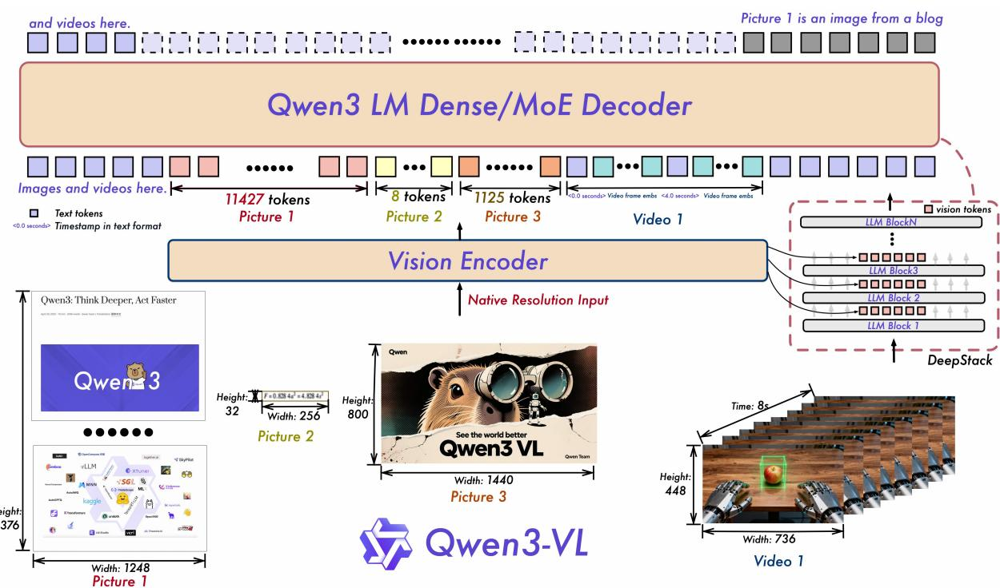
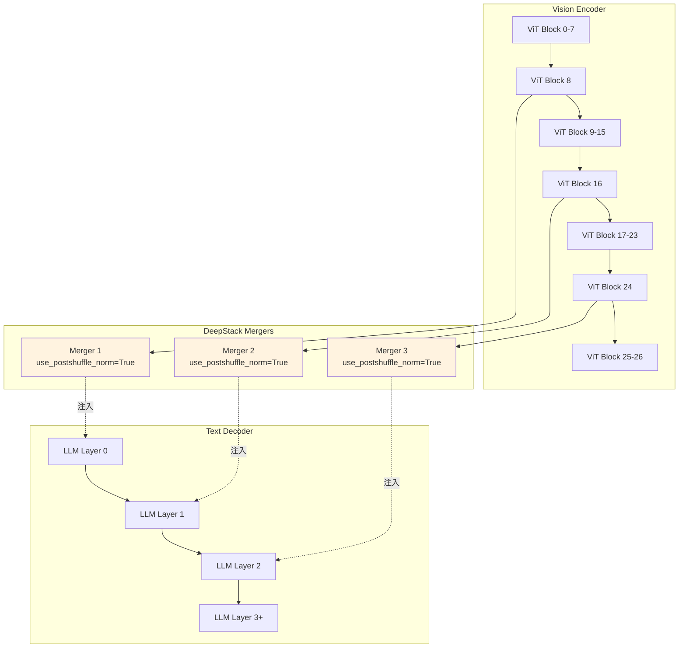
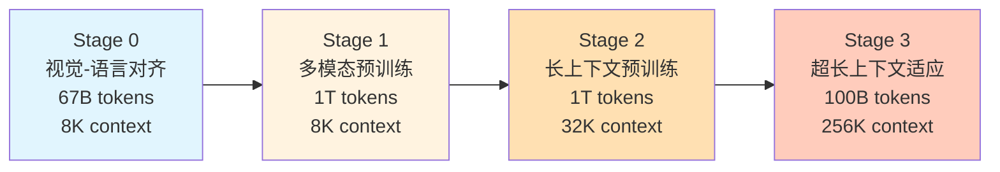
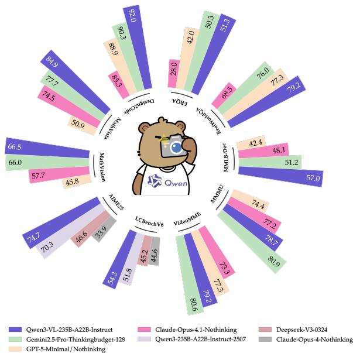
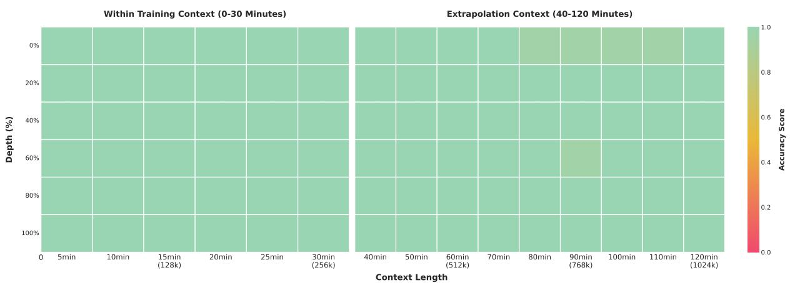

# Qwen3-VL:突破多模态边界的架构创新与训练实践

## 引言

Qwen3-VL是阿里Qwen团队最新发布的视觉-语言多模态大模型,在保持纯文本能力的同时,实现了对图像、视频、长文档的原生支持。该模型最显著的特点是支持高达256K token的多模态上下文,并通过三大架构创新——Interleaved MRoPE、DeepStack和Text-based Timestamp——在多模态理解与推理任务上达到了业界领先水平。

本文将深入解析Qwen3-VL的模型架构设计与分阶段训练策略,重点剖析核心创新的设计动机、理论依据及实验验证。

## 一、整体架构:三模块协同的多模态融合


Qwen3-VL延续了经典的视觉-语言模型架构,由三个核心模块组成:

### 1.1 Vision Encoder:动态分辨率的视觉编码

Qwen3-VL采用**SigLIP-2 (SO-400M)** 作为视觉编码器,在官方预训练权重基础上继续训练以支持**动态分辨率输入**。与固定分辨率方案相比,动态分辨率能够:
- 保留图像原始宽高比,减少信息损失
- 根据图像复杂度自适应分配视觉token数量
- 通过`min_pixels`和`max_pixels`参数灵活控制计算成本

对于小尺寸模型(2B/4B),使用SigLIP2-Large (300M)以降低计算开销。

### 1.2 Vision-Language Merger:高效的模态对齐

Merger采用**两层MLP**结构,将Vision Encoder输出的$2 \times 2$视觉特征patch压缩为单个视觉token,并对齐到LLM的隐藏维度。这种设计在保持表达能力的同时,显著减少了视觉token的序列长度。

核心代码示例:

```python
class VisionLanguageMerger(nn.Module):
    def __init__(self, vision_dim, llm_dim):
        super().__init__()
        self.mlp = nn.Sequential(
            nn.Linear(vision_dim * 4, llm_dim),  # 2x2 patch合并
            nn.GELU(),
            nn.Linear(llm_dim, llm_dim)
        )
    
    def forward(self, visual_features):
        # visual_features: [B, H/2, W/2, C]
        merged = self.merge_2x2_patches(visual_features)  # [B, H/2/2, W/2/2, C*4]
        return self.mlp(merged)  # [B, num_visual_tokens, llm_dim]
```

### 1.3 LLM Backbone:Dense与MoE双线并行

Qwen3-VL提供两类架构:
- **Dense模型**(2B/4B/8B/32B):标准的全参数Transformer
- **MoE模型**(30B-A3B/235B-A22B):稀疏混合专家架构,并通过`decoder_sparse_step`参数控制MoE层频率,在相同激活参数量下获得更大的模型容量


## 二、三大核心创新:理论与实践

### 2.1 Interleaved MRoPE:解决频谱不平衡的位置编码

#### 问题诊断

原始MRoPE(Multi-dimensional Rotary Position Embedding)将embedding维度分为时间(t)、高度(h)、宽度(w)三个子空间,**连续分配**频率:

$$\text{原始布局: } [t_1, t_2, ..., t_n, h_1, h_2, ..., h_m, w_1, w_2, ..., w_k]$$

这种设计导致**频谱不平衡**:
- 时间维度独占低频段,空间维度集中在高频段
- 长视频场景下,低频信息不足以编码复杂的时空关系
- 消融实验显示在长视频理解任务上性能下降明显

#### 解决方案:Interleaved布局

Qwen3-VL提出**交错分配**频率的方案:

$$\text{交错布局: } [t_1, h_1, w_1, t_2, h_2, w_2, ..., t_n, h_n, w_n, ...]$$

**核心实现**:

```python
def apply_interleaved_mrope(self, freqs, mrope_section):
    """
    将原始的分块布局 [TTT...HHH...WWW] 重组为交错布局 [THWTHW...]
    
    Args:
        freqs: (3, bs, seq_len, head_dim // 2) - 原始频率
        mrope_section: [24, 20, 20] - 各维度分配的维度数
    """
    freqs_t = freqs[0]  # 基础时间频率
    for dim, offset in enumerate((1, 2), start=1):  # 遍历H, W
        length = mrope_section[dim] * 3
        idx = slice(offset, length, 3)  # 间隔为3的索引
        freqs_t[..., idx] = freqs[dim, ..., idx]  # 交错插入
    return freqs_t
```

#### 效果验证

论文未直接提供Interleaved MRoPE的单独消融实验,但在长视频任务(LVBench)上,Qwen3-VL相比Qwen2.5-VL提升显著:
- MLVU: 69.2% → 78.1% (+8.9%)
- LVBench: 47.6% → 58.0% (+10.4%)

这一提升部分归功于Interleaved MRoPE对长时序信息的更好建模。

### 2.2 DeepStack:多层视觉特征的深度融合

#### 设计动机

传统VLM仅使用Vision Encoder**最后一层**的特征,丢失了中间层的细粒度信息。受[DeepStack论文](https://arxiv.org/abs/2406.04334)启发,Qwen3-VL提出跨层特征融合机制。

#### 架构设计



**关键实现**:

```python
# 配置提取的层索引(默认为8, 16, 24层)
deepstack_visual_indexes = [8, 16, 24]

# 创建与索引数量对应的Merger
deepstack_merger_list = nn.ModuleList([
    VisionPatchMerger(config, use_postshuffle_norm=True)
    for _ in range(len(deepstack_visual_indexes))
])

# 在Vision Encoder的forward中提取特征
for layer_num, block in enumerate(self.blocks):
    hidden_states = block(hidden_states, ...)
    if layer_num in deepstack_visual_indexes:
        idx = deepstack_visual_indexes.index(layer_num)
        feature = deepstack_merger_list[idx](hidden_states)
        deepstack_features.append(feature)

# 在LLM的前几层注入特征
def _deepstack_process(hidden_states, visual_pos_masks, visual_embeds):
    hidden_states = hidden_states.clone()
    hidden_states[visual_pos_masks] += visual_embeds  # 残差连接
    return hidden_states
```

#### 消融实验验证

论文Table 12展示了DeepStack的消融实验(基于15B-A2B内部模型,200B token预训练):

| 方法 | InfoVQA | DocVQA | ChartQA | AI2D | MMMU | 平均 |
|------|---------|--------|---------|------|------|------|
| Baseline | 71.9 | 89.5 | 81.5 | 81.8 | 52.9 | 74.7 |
| +DeepStack | **74.2** | **91.1** | **83.3** | **83.2** | **54.1** | **76.0** |

**结论**:DeepStack在文档理解和细粒度视觉任务上带来**1.3%的平均提升**,验证了多层特征融合对增强视觉-语言对齐的有效性。

### 2.3 Text-based Timestamp:视频时间的显式表征

#### 问题分析

Qwen2.5-VL使用T-RoPE(Temporal RoPE),将视频帧的绝对时间编码到位置ID中。这种方式存在两个问题:
1. **位置ID稀疏**:长视频(如2小时)会产生极大的时间位置ID,导致模型难以学习
2. **采样依赖**:需要在不同帧率下均匀采样,增加数据构建成本

#### 解决方案:时间戳Token化

Qwen3-VL采用**文本token表示时间戳**的方案:

```
<3.0s> <vision_start> <frame_1> <vision_end> 
<6.0s> <vision_start> <frame_2> <vision_end>
<9.0s> <vision_start> <frame_3> <vision_end>
```

**实现细节**:

```python
# 将多帧视频分割为单帧段
video_grid_thw = torch.repeat_interleave(
    video_grid_thw, 
    video_grid_thw[:, 0],  # 时间维度
    dim=0
)
video_grid_thw[:, 0] = 1  # 每段时间维度设为1

# 计算每帧对应的秒数
second_per_grid = temporal_patch_size / fps
timestamps = [f"<{i * second_per_grid:.1f}s>" for i in range(num_frames)]
```

**优势**:
- 时间信息更直观,模型可直接理解"3秒处发生了什么"
- 支持HMS格式(如"00:01:30"),增强时间表达的多样性
- 降低了对特定采样率的依赖

#### 效果验证

在视频时序定位任务Charades-STA上:
- Qwen3-VL-8B: 59.9% mIoU
- 相比Qwen2.5-VL显著提升(具体数值未公开)

## 三、分阶段训练:从对齐到超长上下文

### 3.1 预训练四阶段

Qwen3-VL的预训练遵循"由短到长、由浅入深"的策略:



#### Stage 0: 视觉-语言对齐 (Vision-Language Alignment)

**训练策略**:
- 仅训练Merger,**冻结**Vision Encoder和LLM
- 数据:67B高质量图文对、OCR数据
- 目标:建立视觉特征到语言空间的初步映射

**设计理由**:Vision Encoder和LLM均已具备强大的单模态表征能力,仅需学习"翻译"层即可快速建立跨模态联系,避免过早破坏预训练权重。

#### Stage 1: 多模态预训练 (Multimodal Pre-Training)

**训练策略**:
- **全参数训练**:Vision Encoder、Merger、LLM同时更新
- 数据:1T token,混合VL数据(图像、视频、文档)与纯文本数据
- 关键数据:Interleaved文档、VQA、Grounding、STEM推理

**核心优化**:引入**Square-root Reweighting**机制,解决纯文本与多模态数据的loss不平衡问题:

$$\text{Loss}_{\text{batch}} = \sqrt{N_{\text{text}}} \cdot \text{Loss}_{\text{text}} + \sqrt{N_{\text{vision}}} \cdot \text{Loss}_{\text{vision}}$$

其中$N$为各类型样本数量。这种策略避免了多模态数据稀释纯文本能力。

#### Stage 2: 长上下文预训练

**训练策略**:
- 序列长度扩展至**32K**
- 增加纯文本比例,强化长文本理解
- 引入更多长视频和Agent轨迹数据

**技术细节**:
- 动态调整视频采样率(fps),在长度限制下保留更多帧
- 合并连续页面构建长文档序列

#### Stage 3: 超长上下文适应

**训练策略**:
- 序列长度推至极限:**256K token**
- 专注长视频(2小时)和长文档(数百页)任务
- 数据量相对较小(100B),作为微调性质的适应阶段

### 3.2 后训练三阶段

#### Phase 1: 监督微调 (SFT)

**数据构建**:
- 规模:120万样本(1/3纯文本,2/3多模态)
- 双模式:
  - **Non-thinking**: 标准指令遵循
  - **Thinking**: 长思维链(CoT)格式,显式建模推理过程

**质量控制**:
- Query过滤:剔除不可验证或模糊指令
- Response过滤:规则过滤(重复、格式)+ Qwen2.5-VL模型评分

#### Phase 2: 强对弱蒸馏

利用Qwen3-VL-235B作为教师模型,指导小模型学习:

```python
# Off-policy阶段:学习教师输出
loss_kd = KL_div(student_logits, teacher_outputs)

# On-policy阶段:对齐logits分布
student_outputs = student.generate(prompts)
teacher_logits = teacher(prompts)
loss_kd = KL_div(student_logits, teacher_logits)
```

实验表明,蒸馏阶段对小模型性能提升显著(如Qwen3-VL-8B在MMMU上从61.4%提升至74.1%)。

#### Phase 3: 强化学习

**推理RL**:
- 任务:Math、Code、VQA等可验证任务
- 算法:**SAPO**(Soft Adaptive Policy Optimization)
- 数据:30K高质量查询,通过Best-of-N采样构建

**通用RL**:
- 目标:指令遵循、偏好对齐
- 奖励设计:
  - 规则奖励:格式、语言一致性
  - 模型奖励:Qwen2.5-VL-72B作为评判器

**Thinking with Images**:
针对Agent能力,引入工具调用奖励:

$$\text{Reward}_{\text{tool}} = -|\text{actual\_calls} - \text{target\_calls}|$$

防止模型通过单次工具调用"作弊"获得高奖励。

## 四、数据工程:质量与多样性的平衡

### 4.1 预训练数据亮点

1. **图像Caption重构**:使用Qwen2.5-VL-32B对原始alt-text进行重写,生成包含空间布局、对象关系的细粒度描述
2. **多语言OCR**:从10种语言扩展至**39种**,合成3000万样本
3. **3D Grounding**:统一到虚拟相机坐标系,输出9-DoF边界框(位置+尺寸+姿态)
4. **STEM合成数据**:代码渲染几何图形,生成100万点定位样本和200万感知型VQA

### 4.2 后训练数据创新

**Multimodal Necessity Filtering**:
对于数学题,过滤掉Qwen3-30B(纯文本模型)能答对的样本,确保保留的数据**必须依赖视觉信息**才能解决。

**陷阱任务设计**:
构建反直觉的计数任务(如遮挡物体)和复杂时钟识别任务,通过RL纠正SFT阶段学到的错误先验。

## 五、评估结果与分析

### 5.1 多模态推理领先

在MMMU(多学科理解)、MathVista(数学推理)等任务上,Qwen3-VL-235B-A22B-Thinking达到业界顶尖水平:

| 模型 | MMMU | MathVista | MathVision |
|------|------|-----------|------------|
| Qwen3-VL-235B (Thinking) | **78.7** | **85.9** | **85.8** |
| GPT-5 (high) | 74.4 | 81.3 | 70.9 |
| Gemini-2.5-Pro (Thinking) | 80.9 | 82.7 | 73.3 |



### 5.2 纯文本能力不降反升

通过Square-root Reweighting和高质量文本数据混合,Qwen3-VL在纯文本任务上**超越**同规模纯文本模型:

| 模型 | MMLU-Pro | AIME-25 | LiveCodeBench |
|------|----------|---------|---------------|
| Qwen3-235B (Text-only) | 83.0 | 70.3 | 51.8 |
| Qwen3-VL-235B (VLM) | **81.8** | **74.7** | **54.3** |

这一结果打破了"多模态损害语言能力"的传统认知。

### 5.3 长上下文能力验证

**Needle-in-a-Haystack实验**:在视频中插入"针"帧,测试模型定位能力:
- 30分钟视频(256K token): **100%准确率**
- 2小时视频(1M token,使用YaRN外推): **99.5%准确率**



## 六、总结与展望

Qwen3-VL通过三大架构创新(Interleaved MRoPE、DeepStack、Text-based Timestamp)和精细的分阶段训练策略,在多模态理解、长上下文建模和纯文本能力上实现了全面突破。其核心设计哲学可归纳为:

1. **平衡而非取舍**:通过Square-root Reweighting等技术,在多模态与纯文本能力间找到平衡点
2. **显式优于隐式**:用文本时间戳代替位置编码,用交错频率代替分块频率,增强模型可解释性
3. **渐进式扩展**:从8K到256K的分阶段训练,避免灾难性遗忘

未来方向包括:
- 统一理解-生成架构(如引入Diffusion模块实现视觉生成)
- 具身智能场景下的实时交互能力
- 工具增强的多模态Agent系统

Qwen3-VL的开源发布(Apache 2.0协议)为多模态AI的进一步发展提供了坚实基础,值得社区深入研究与应用探索。
