# 我问
视觉处理的pipeline具体是怎么样的？

# deepwiki答
## 视觉处理Pipeline概述

Qwen3-VL的视觉处理pipeline通过`qwen-vl-utils`工具包实现，主要包含消息构建、视觉信息提取、图像/视频处理和模型输入准备四个阶段 [1](#0-0) 。

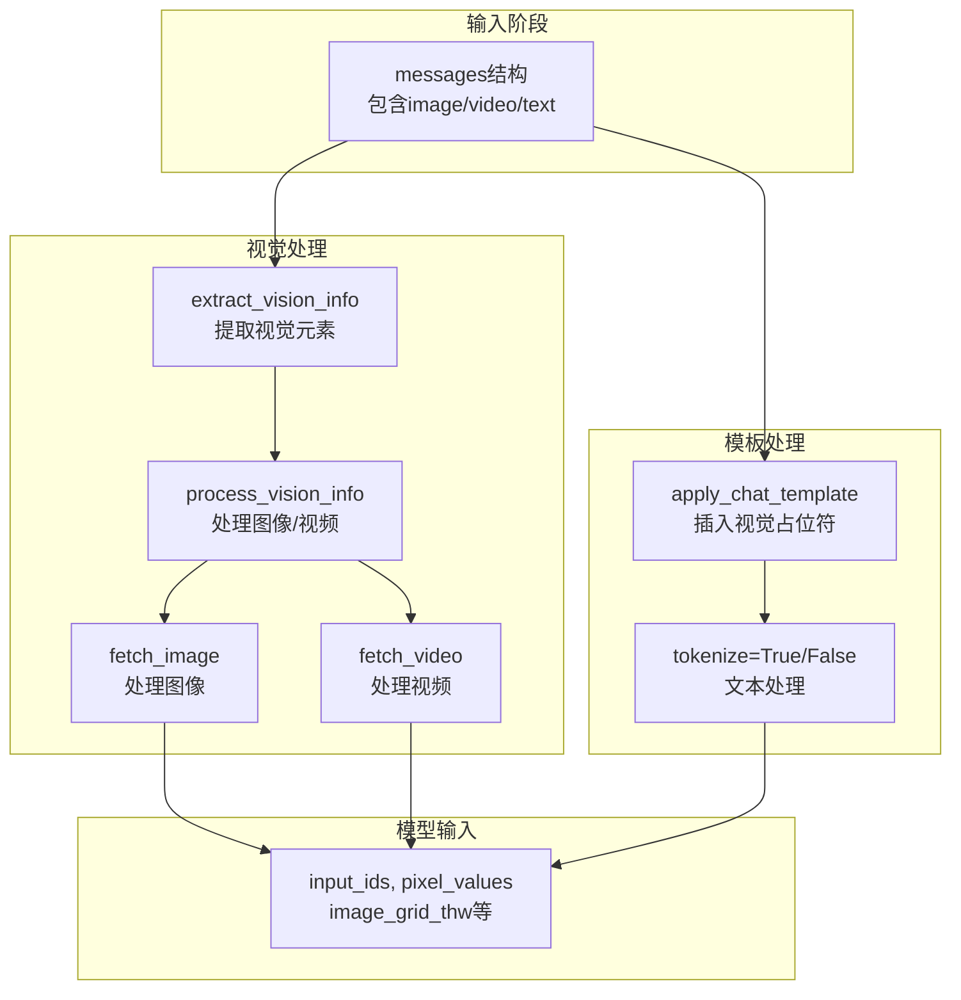

## 详细流程说明

### 1. 消息结构构建
消息采用多模态格式，每个消息包含`role`和`content`字段，content可以是文本、图像或视频 [2](#0-1) ：

```python
messages = [
    {
        "role": "user",
        "content": [
            {"type": "image", "image": "path/or/url"},
            {"type": "text", "text": "描述这张图片"}
        ]
    }
]
```

### 2. 视觉信息提取
`extract_vision_info`函数遍历消息，识别包含`image`、`image_url`或`video`字段的内容元素 [3](#0-2) 。

### 3. 图像处理流程
`fetch_image`函数处理多种图像格式 [4](#0-3) ：
- **本地文件**：`file:///path/to/image.jpg`
- **HTTP/HTTPS URL**：直接下载
- **Base64编码**：`data:image;base64,...`
- **PIL图像对象**：直接处理

图像会转换为RGB格式，并根据参数调整尺寸：
- 指定`resized_height`和`resized_width`
- 或使用`min_pixels`和`max_pixels`保持宽高比

### 4. 视频处理流程
`fetch_video`函数支持三种视频输入 [5](#0-4) ：
- **视频文件**：本地路径或URL
- **帧列表**：`["frame1.jpg", "frame2.jpg", ...]`
- **解码后端**：torchcodec（推荐）、decord或torchvision

视频处理参数：
- `fps`/`nframes`：控制帧采样
- `min_pixels`/`max_pixels`：单帧分辨率
- `total_pixels`：总像素预算

### 5. Chat模板应用
`apply_chat_template`方法将消息转换为模型输入格式 [6](#0-5) ：
- 插入视觉占位符`<|image_pad|>`和`<|video_pad|>`
- 可选择添加视觉ID标签
- 处理文本tokenization

### 6. 两种处理路径

#### 路径1：直接使用Processor
```python
inputs = processor.apply_chat_template(
    messages,
    tokenize=True,
    add_generation_prompt=True,
    return_dict=True,
    return_tensors="pt"
)
```

#### 路径2：使用qwen-vl-utils（推荐）
```python
text = processor.apply_chat_template(messages, tokenize=False, add_generation_prompt=True)
images, videos, video_kwargs = process_vision_info(
    messages, 
    image_patch_size=16,
    return_video_kwargs=True,
    return_video_metadata=True
)
inputs = processor(
    text=text, 
    images=images, 
    videos=videos, 
    do_resize=False,
    return_tensors="pt",
    **video_kwargs
)
```

## Notes

- 使用`qwen-vl-utils`时必须设置`do_resize=False`避免重复调整尺寸 [7](#0-6) 
- Qwen3-VL的`image_patch_size`为16，而Qwen2.5-VL为14 [8](#0-7) 
- 视频处理时，Qwen3-VL需要`return_video_metadata=True`并处理返回的元数据 [9](#0-8) 

Wiki pages you might want to explore:
- [Quick Start Guide (QwenLM/Qwen3-VL)](/wiki/QwenLM/Qwen3-VL#3)
- [Message Formats and Multimodal Inputs (QwenLM/Qwen3-VL)](/wiki/QwenLM/Qwen3-VL#4.4)

### Citations

**File:** qwen-vl-utils/src/qwen_vl_utils/vision_process.py (L93-141)
```python
def fetch_image(ele: Dict[str, Union[str, Image.Image]], image_patch_size: int = 14) -> Image.Image:
    if "image" in ele:
        image = ele["image"]
    else:
        image = ele["image_url"]

    image_obj = None
    patch_factor = int(image_patch_size * SPATIAL_MERGE_SIZE)
    if isinstance(image, Image.Image):
        image_obj = image
    elif image.startswith("http://") or image.startswith("https://"):
        with requests.get(image, stream=True) as response:
            response.raise_for_status()
            with BytesIO(response.content) as bio:
                image_obj = copy.deepcopy(Image.open(bio))
    elif image.startswith("file://"):
        image_obj = Image.open(image[7:])
    elif image.startswith("data:image"):
        if "base64," in image:
            _, base64_data = image.split("base64,", 1)
            data = base64.b64decode(base64_data)
            with BytesIO(data) as bio:
                image_obj = copy.deepcopy(Image.open(bio))
    else:
        image_obj = Image.open(image)
    if image_obj is None:
        raise ValueError(f"Unrecognized image input, support local path, http url, base64 and PIL.Image, got {image}")
    image = to_rgb(image_obj)

    ## resize
    if "resized_height" in ele and "resized_width" in ele:
        resized_height, resized_width = smart_resize(
            ele["resized_height"],
            ele["resized_width"],
            factor=patch_factor,
        )
    else:
        width, height = image.size
        min_pixels = ele.get("min_pixels", IMAGE_MIN_TOKEN_NUM * patch_factor ** 2)
        max_pixels = ele.get("max_pixels", IMAGE_MAX_TOKEN_NUM * patch_factor ** 2)
        resized_height, resized_width = smart_resize(
            height,
            width,
            factor=patch_factor,
            min_pixels=min_pixels,
            max_pixels=max_pixels,
        )
    image = image.resize((resized_width, resized_height))
    return image
```

**File:** qwen-vl-utils/src/qwen_vl_utils/vision_process.py (L403-480)
```python
def fetch_video(ele: Dict[str, Any], image_patch_size: int = 14, return_video_sample_fps: bool = False,
                return_video_metadata: bool = False) -> Union[torch.Tensor, List[Image.Image]]:
    image_factor = image_patch_size * SPATIAL_MERGE_SIZE
    VIDEO_FRAME_MIN_PIXELS = VIDEO_MIN_TOKEN_NUM * image_factor * image_factor
    VIDEO_FRAME_MAX_PIXELS = VIDEO_MAX_TOKEN_NUM * image_factor * image_factor
    if isinstance(ele["video"], str):
        video_reader_backend = get_video_reader_backend()
        try:
            video, video_metadata, sample_fps = VIDEO_READER_BACKENDS[video_reader_backend](ele)
        except Exception as e:
            logger.warning(f"video_reader_backend {video_reader_backend} error, use torchvision as default, msg: {e}")
            video, video_metadata, sample_fps = VIDEO_READER_BACKENDS["torchvision"](ele)
    else:
        # The input is a list of frames
        assert isinstance(ele["video"], (list, tuple))
        process_info = ele.copy()
        process_info.pop("type", None)
        process_info.pop("video", None)
        # use ThreadPoolExecutor to parallel process frames
        max_workers = min(MAX_NUM_WORKERS_FETCH_VIDEO, len(ele["video"]))
        with ThreadPoolExecutor(max_workers=max_workers) as executor:
            futures = [
                executor.submit(fetch_image, {"image": video_element, **process_info}, image_factor)
                for video_element in ele["video"]
            ]
            image_list = [future.result() for future in futures]

        nframes = ceil_by_factor(len(image_list), FRAME_FACTOR)
        if len(image_list) < nframes:
            image_list.extend([image_list[-1]] * (nframes - len(image_list)))

        sample_fps = ele.get("sample_fps", 2.0)
        video = torch.stack([
            torch.from_numpy(np.array(image).transpose(2, 0, 1))
            for image in image_list
        ])

        # fake video metadata
        raw_fps = process_info.pop("raw_fps", sample_fps)
        video_metadata = dict(
            fps=raw_fps,
            frames_indices=[i for i in range(len(video))],
            total_num_frames=(nframes / sample_fps) * raw_fps,
        )

    nframes, _, height, width = video.shape
    min_pixels = ele.get("min_pixels", VIDEO_FRAME_MIN_PIXELS)
    total_pixels = ele.get("total_pixels", MODEL_SEQ_LEN * image_factor * image_factor * 0.9)
    max_pixels = max(min(VIDEO_FRAME_MAX_PIXELS, total_pixels / nframes * FRAME_FACTOR), int(min_pixels * 1.05))
    max_pixels_supposed = ele.get("max_pixels", max_pixels)
    if max_pixels_supposed > max_pixels:
        logger.warning(f"The given max_pixels[{max_pixels_supposed}] exceeds limit[{max_pixels}].")
    max_pixels = min(max_pixels_supposed, max_pixels)
    if "resized_height" in ele and "resized_width" in ele:
        resized_height, resized_width = smart_resize(
            ele["resized_height"],
            ele["resized_width"],
            factor=image_factor,
        )
    else:
        resized_height, resized_width = smart_resize(
            height,
            width,
            factor=image_factor,
            min_pixels=min_pixels,
            max_pixels=max_pixels,
        )
    video = transforms.functional.resize(
        video,
        [resized_height, resized_width],
        interpolation=InterpolationMode.BICUBIC,
        antialias=True,
    ).float()

    final_video = (video, video_metadata) if return_video_metadata else video
    if return_video_sample_fps:
        return final_video, sample_fps
    return final_video
```

**File:** qwen-vl-utils/src/qwen_vl_utils/vision_process.py (L483-498)
```python
def extract_vision_info(conversations: Union[List[Dict[str, Any]], List[List[Dict[str, Any]]]]) -> List[Dict[str, Any]]:
    vision_infos = []
    if isinstance(conversations[0], dict):
        conversations = [conversations]
    for conversation in conversations:
        for message in conversation:
            if isinstance(message["content"], list):
                for ele in message["content"]:
                    if (
                        "image" in ele
                        or "image_url" in ele
                        or "video" in ele
                        or ele.get("type", "text") in ("image", "image_url", "video")
                    ):
                        vision_infos.append(ele)
    return vision_infos
```

**File:** qwen-vl-utils/src/qwen_vl_utils/vision_process.py (L501-534)
```python
def process_vision_info(
    conversations: Union[List[Dict[str, Any]], List[List[Dict[str, Any]]]],
    return_video_kwargs: bool = False,
    return_video_metadata: bool = False,
    image_patch_size: int = 14,
) -> Tuple[Optional[List[Image.Image]], Optional[List[Union[torch.Tensor, List[Image.Image]]]], Optional[Dict[str, Any]]]:

    vision_infos = extract_vision_info(conversations)
    ## Read images or videos
    image_inputs = []
    video_inputs = []
    video_sample_fps_list = []
    for vision_info in vision_infos:
        if "image" in vision_info or "image_url" in vision_info:
            image_inputs.append(fetch_image(vision_info, image_patch_size=image_patch_size))
        elif "video" in vision_info:
            video_input, video_sample_fps = fetch_video(vision_info, return_video_sample_fps=True,
                        image_patch_size=image_patch_size, return_video_metadata=return_video_metadata)
            video_sample_fps_list.append(video_sample_fps)
            video_inputs.append(video_input)
        else:
            raise ValueError("image, image_url or video should in content.")
    if len(image_inputs) == 0:
        image_inputs = None
    if len(video_inputs) == 0:
        video_inputs = None

    video_kwargs = {'do_sample_frames': False}
    if not return_video_metadata: # BC for qwen2.5vl
        video_kwargs.update({'fps': video_sample_fps_list})

    if return_video_kwargs:
        return image_inputs, video_inputs, video_kwargs
    return image_inputs, video_inputs
```

**File:** README.md (L162-173)
```markdown
messages = [
    {
        "role": "user",
        "content": [
            {
                "type": "image",
                "image": "https://qianwen-res.oss-cn-beijing.aliyuncs.com/Qwen-VL/assets/demo.jpeg",
            },
            {"type": "text", "text": "Describe this image."},
        ],
    }
]
```

**File:** README.md (L176-183)
```markdown
inputs = processor.apply_chat_template(
    messages,
    tokenize=True,
    add_generation_prompt=True,
    return_dict=True,
    return_tensors="pt"
)
inputs = inputs.to(model.device)
```

**File:** README.md (L436-436)
```markdown
📌 Note: Since `qwen-vl-utils` already resizes images/videos, pass `do_resize=False` to the processor to avoid duplicate resizing.
```

**File:** qwen-vl-utils/README.md (L424-424)
```markdown

```

**File:** qwen-vl-utils/README.md (L426-426)
```markdown

```


# 我问
详细解释模型架构是到底如何，顺便解释模型是如何分阶段训练出来的？

# deepwiki答
## 模型架构概述

Qwen3-VL采用多模态融合架构，主要由视觉编码器(ViT)、多模态投影器(MLP)和语言模型(LLM)三部分组成 [1](#0-0) 。核心创新包括：

- **Interleaved-MRoPE**: 在时间、宽度、高度维度上分配频率的位置编码，增强长视频推理能力
- **DeepStack**: 融合多层ViT特征，捕获细粒度细节并增强图像-文本对齐
- **Text-Timestamp Alignment**: 超越T-RoPE，实现精确的时间戳锚定事件定位

## 分阶段训练详解

### 1. 组件选择策略

训练框架支持灵活选择要训练的组件 [2](#0-1) ：

```python
tune_mm_vision: bool = field(default=False)  # 视觉编码器
tune_mm_mlp: bool = field(default=False)     # 多模态投影器  
tune_mm_llm: bool = field(default=False)     # 语言模型
```

### 2. 训练阶段配置

不同训练场景的组件配置策略 [3](#0-2) ：

| 场景 | tune_mm_vision | tune_mm_mlp | tune_mm_llm | 用途 |
|------|----------------|-------------|-------------|------|
| 全参数微调 | True | True | True | 最大适应能力 |
| 仅LLM | False | False | True | 保持视觉特征 |
| 投影器+LLM | False | True | True | 推荐默认配置 |
| LoRA微调 | False | True | True+LoRA | 参数高效训练 |
| 混合模态 | False | True | True | 图像+视频训练必需 |

### 3. 学习率分层设置

框架支持组件特定的学习率配置 [4](#0-3) ：

- `learning_rate`: 基础LLM学习率 (默认2e-7)
- `mm_projector_lr`: 投影器学习率 (建议1e-5)
- `vision_tower_lr`: 视觉编码器学习率 (建议1e-6)

### 4. 训练执行流程

训练入口`train_qwen.py`实现了完整的训练流程 [5](#0-4) ：

1. 根据模型路径自动识别模型类型(Qwen2VL/Qwen2.5VL/Qwen3VL)
2. 加载预训练模型和处理器
3. 配置可训练参数(`set_model`函数)
4. 应用LoRA配置(如果启用)
5. 创建数据模块并启动训练

### 5. 优化策略

- **DeepSpeed集成**: 支持ZeRO-2和ZeRO-3，MoE模型仅支持ZeRO-2 [6](#0-5) 
- **LoRA微调**: 通过低秩适应减少显存需求 [7](#0-6) 
- **Flash Attention 2**: 提升注意力计算效率

## Notes

- 混合图像和视频数据训练时，必须设置`tune_mm_vision=False` [8](#0-7) 
- 训练分辨率参数(`max_pixels`/`min_pixels`)对模型性能至关重要 [9](#0-8) 
- Qwen3VL MoE模型当前在HuggingFace实现中缺少负载均衡损失支持 [10](#0-9) 

Wiki pages you might want to explore:
- [Fine-tuning (QwenLM/Qwen3-VL)](/wiki/QwenLM/Qwen3-VL#7)

### Citations

**File:** README.md (L43-56)
```markdown
#### Model Architecture Updates:

<p align="center">
    
<p>


1. **Interleaved-MRoPE**: Full‑frequency allocation over time, width, and height via robust positional embeddings, enhancing long‑horizon video reasoning.

2. **DeepStack**: Fuses multi‑level ViT features to capture fine‑grained details and sharpen image–text alignment.

3. **Text–Timestamp Alignment:** Moves beyond T‑RoPE to precise, timestamp‑grounded event localization for stronger video temporal modeling.


```

**File:** qwen-vl-finetune/qwenvl/train/argument.py (L6-11)
```python
@dataclass
class ModelArguments:
    model_name_or_path: Optional[str] = field(default="Qwen/Qwen2.5-VL-3B-Instruct")
    tune_mm_llm: bool = field(default=False)
    tune_mm_mlp: bool = field(default=False)
    tune_mm_vision: bool = field(default=False)
```

**File:** qwen-vl-finetune/qwenvl/train/argument.py (L38-39)
```python
    mm_projector_lr: Optional[float] = None
    vision_tower_lr: Optional[float] = None
```

**File:** qwen-vl-finetune/README.md (L308-310)
```markdown
The script accepts arguments in three categories:

   - Flags to control which components to tune (`tune_mm_vision`, `tune_mm_mlp`, `tune_mm_llm`). If trained with both image and video data, tune_mm_vision should be False: `tune_mm_vision=False`
```

**File:** qwen-vl-finetune/README.md (L314-314)
```markdown
   - Training resolution is critical for the model performances, hence `--max_pixels` and `--min_pixels` should be properly set
```

**File:** qwen-vl-finetune/README.md (L317-317)
```markdown
   - The Qwen3VL MoE model does not support DeepSpeed with ZeRO-3. Additionally, Hugging Face’s official implementation does not include support for load balancing loss currently.
```

**File:** qwen-vl-finetune/qwenvl/train/train_qwen.py (L92-185)
```python
def train(attn_implementation="flash_attention_2"):
    global local_rank

    parser = transformers.HfArgumentParser(
        (ModelArguments, DataArguments, TrainingArguments)
    )
    model_args, data_args, training_args = parser.parse_args_into_dataclasses()

    local_rank = training_args.local_rank
    os.makedirs(training_args.output_dir, exist_ok=True)

    if "qwen3" in model_args.model_name_or_path.lower() and "a" in Path(model_args.model_name_or_path.rstrip("/")).name.lower():
        model = Qwen3VLMoeForConditionalGeneration.from_pretrained(
            model_args.model_name_or_path,
            cache_dir=training_args.cache_dir,
            attn_implementation=attn_implementation,
            dtype=(torch.bfloat16 if training_args.bf16 else None),
        )
        data_args.model_type = "qwen3vl"
    elif "qwen3" in model_args.model_name_or_path.lower():
        model = Qwen3VLForConditionalGeneration.from_pretrained(
            model_args.model_name_or_path,
            cache_dir=training_args.cache_dir,
            attn_implementation=attn_implementation,
            dtype=(torch.bfloat16 if training_args.bf16 else None),
        )
        data_args.model_type = "qwen3vl"
    elif "qwen2.5" in model_args.model_name_or_path.lower():
        model = Qwen2_5_VLForConditionalGeneration.from_pretrained(
            model_args.model_name_or_path,
            cache_dir=training_args.cache_dir,
            attn_implementation=attn_implementation,
            dtype=(torch.bfloat16 if training_args.bf16 else None),
        )
        data_args.model_type = "qwen2.5vl"
    else:
        model = Qwen2VLForConditionalGeneration.from_pretrained(
            model_args.model_name_or_path,
            cache_dir=training_args.cache_dir,
            attn_implementation=attn_implementation,
            dtype=(torch.bfloat16 if training_args.bf16 else None),
        )
        data_args.model_type = "qwen2vl"

    print(f'the initlized model is {model_args.model_name_or_path} the class is {model.__class__.__name__}')
    processor = AutoProcessor.from_pretrained(
        model_args.model_name_or_path,
    )

    if data_args.data_flatten or data_args.data_packing:
        replace_qwen2_vl_attention_class()
    model.config.use_cache = False

    if training_args.gradient_checkpointing:
        if hasattr(model, "enable_input_require_grads"):
            model.enable_input_require_grads()
        else:

            def make_inputs_require_grad(module, input, output):
                output.requires_grad_(True)

            model.get_input_embeddings().register_forward_hook(make_inputs_require_grad)

    tokenizer = transformers.AutoTokenizer.from_pretrained(
        model_args.model_name_or_path,
        cache_dir=training_args.cache_dir,
        model_max_length=training_args.model_max_length,
        padding_side="right",
        use_fast=False,
    )

    if training_args.lora_enable:
        from peft import LoraConfig, get_peft_model, TaskType
        print("LoRA enabled")

        for p in model.parameters():
            p.requires_grad = False

        lora_config = LoraConfig(
            r=training_args.lora_r or 64,
            lora_alpha=training_args.lora_alpha or 128,
            lora_dropout=training_args.lora_dropout or 0.05,
            target_modules=["q_proj", "k_proj", "v_proj", "o_proj"],  # Qwen 的 attention 线性层
            bias="none",
            task_type=TaskType.CAUSAL_LM,
        )
        model = get_peft_model(model, lora_config)
    else:
        set_model(model_args, model)

        if torch.distributed.get_rank() == 0:
            model.visual.print_trainable_parameters()
            model.model.print_trainable_parameters()
    
```

**File:** qwen-vl-finetune/scripts/sft_30a3b_lora.sh (L8-11)
```shellscript
# DeepSpeed configuration
# MoE model only supports zero2
# this script could run on 32 80G GPU
deepspeed=./scripts/zero2.json
```


# 我问
我不太明白，三个核心创新「Interleaved-MRoPE、DeepStack、Text-Timestamp Alignment」分别使用在哪个模型组件中？以及如何设计的？

# deepwiki答
## 三个核心创新的组件归属和设计详解

### 1. Interleaved-MRoPE - 位置编码组件

**使用组件**: 语言模型的注意力机制中的位置编码 [1](#1-0) 

**设计原理**:
- 在时间、高度、宽度三个维度上分配不同的频率
- 通过`get_rope_index_3()`函数实现Qwen3VL的版本 [2](#1-1) 
- 为每个token生成3维位置ID：`position_ids`形状为`(3, batch_size, sequence_length)` [3](#1-2) 

**关键实现**:
```python
# 时间、高度、维度的位置索引计算
t_index = torch.arange(llm_grid_t).view(-1, 1).expand(-1, llm_grid_h * llm_grid_w).flatten()
h_index = torch.arange(llm_grid_h).view(1, -1, 1).expand(llm_grid_t, -1, llm_grid_w).flatten()
w_index = torch.arange(llm_grid_w).view(1, 1, -1).expand(llm_grid_t, llm_grid_h, -1).flatten()
``` [4](#1-3) 

### 2. DeepStack - 视觉编码器组件

**使用组件**: Vision Transformer (ViT) 的特征融合层 [5](#1-4) 

**设计原理**:
- 融合ViT多个层的特征，而不是仅使用最后一层
- 通过`spatial_merge_size`参数控制空间分辨率合并 [6](#1-5) 
- 捕获细粒度视觉细节并增强图像-文本对齐

**实现位置**:
虽然代码中没有直接展示DeepStack的实现，但从`spatial_merge_size`的使用可以看出视觉特征经过了多层处理和合并 [7](#1-6) 。

### 3. Text-Timestamp Alignment - 视频处理组件

**使用组件**: 视频数据处理器和位置编码生成器 [8](#1-7) 

**设计原理**:
- 使用时间戳而非绝对时间位置来编码视频帧
- 将多帧视频分割为单帧段，每帧获得独立的时间位置 [9](#1-8) 
- 计算每个时间网格的秒数：`second_per_grid_ts` [10](#1-9) 

**关键实现**:
```python
# 视频帧按时间戳分离
video_grid_thw = torch.repeat_interleave(video_grid_thw, video_grid_thw[:, 0], dim=0)
video_grid_thw[:, 0] = 1  # 设置时间维度为1
``` [9](#1-8) 

## 组件交互流程

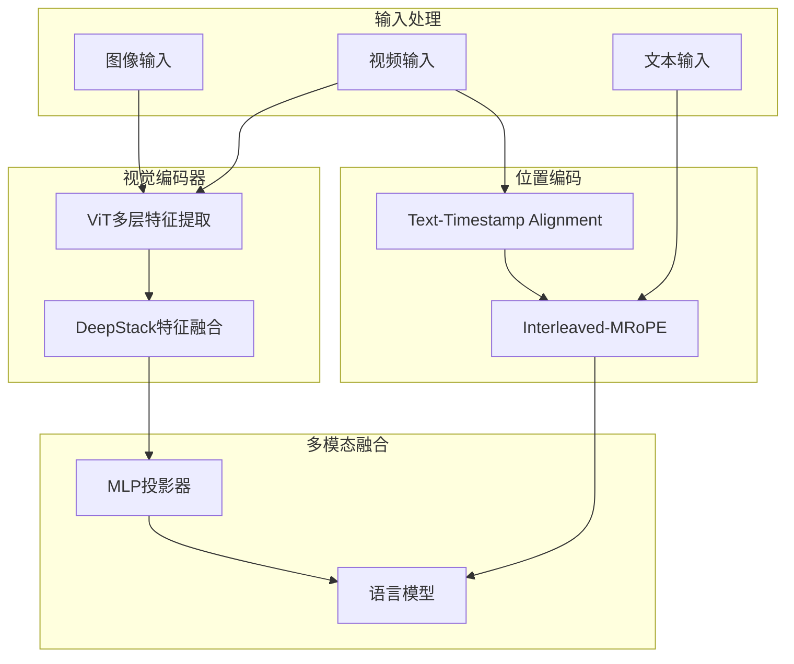

## Notes

- 三个创新点协同工作：DeepStack提取更好的视觉特征，Interleaved-MRoPE提供精确的位置编码，Text-Timestamp Alignment处理视频时序信息 [11](#1-10) 
- 在训练时，这些组件可以通过`tune_mm_vision`、`tune_mm_mlp`、`tune_mm_llm`参数独立控制是否微调 [12](#1-11) 
- Flash Attention 2集成优化了注意力计算，支持这些复杂的位置编码机制 [13](#1-12) 

Wiki pages you might want to explore:
- [Advanced Fine-tuning Topics (QwenLM/Qwen3-VL)](/wiki/QwenLM/Qwen3-VL#7.7)

### Citations

**File:** qwen-vl-finetune/qwenvl/data/rope2d.py (L5-12)
```python
def get_rope_index_3(
    spatial_merge_size: Optional[int] = 2,
    input_ids: Optional[torch.LongTensor] = None,
    image_grid_thw: Optional[torch.LongTensor] = None,
    video_grid_thw: Optional[torch.LongTensor] = None,
    second_per_grid_ts: Optional[torch.Tensor] = None,
    attention_mask: Optional[torch.Tensor] = None,
) -> Tuple[torch.Tensor, torch.Tensor]:
```

**File:** qwen-vl-finetune/qwenvl/data/rope2d.py (L14-18)
```python
    """Different from the original implementation, Qwen3VL use timestamps rather than absolute time position ids."""
    # Since we use timestamps to seperate videos, like <t1> <vision_start> <frame1> <vision_end> <t2> <vision_start> <frame2> <vision_end>, the video_grid_thw should also be split
    if video_grid_thw is not None:
        video_grid_thw = torch.repeat_interleave(video_grid_thw, video_grid_thw[:, 0], dim=0)
        video_grid_thw[:, 0] = 1
```

**File:** qwen-vl-finetune/qwenvl/data/rope2d.py (L28-34)
```python
        position_ids = torch.ones(
            3,
            input_ids.shape[0],
            input_ids.shape[1],
            dtype=input_ids.dtype,
            device=input_ids.device,
        )
```

**File:** qwen-vl-finetune/qwenvl/data/rope2d.py (L76-80)
```python
                llm_grid_t, llm_grid_h, llm_grid_w = (
                    t.item(),
                    h.item() // spatial_merge_size,
                    w.item() // spatial_merge_size,
                )
```

**File:** qwen-vl-finetune/qwenvl/data/rope2d.py (L87-89)
```python
                t_index = torch.arange(llm_grid_t).view(-1, 1).expand(-1, llm_grid_h * llm_grid_w).flatten()
                h_index = torch.arange(llm_grid_h).view(1, -1, 1).expand(llm_grid_t, -1, llm_grid_w).flatten()
                w_index = torch.arange(llm_grid_w).view(1, 1, -1).expand(llm_grid_t, llm_grid_h, -1).flatten()
```

**File:** README.md (L50-54)
```markdown
1. **Interleaved-MRoPE**: Full‑frequency allocation over time, width, and height via robust positional embeddings, enhancing long‑horizon video reasoning.

2. **DeepStack**: Fuses multi‑level ViT features to capture fine‑grained details and sharpen image–text alignment.

3. **Text–Timestamp Alignment:** Moves beyond T‑RoPE to precise, timestamp‑grounded event localization for stronger video temporal modeling.
```

**File:** qwen-vl-finetune/qwenvl/data/data_processor.py (L409-415)
```python
            second_per_grid_ts = [
                self.processor.video_processor.temporal_patch_size
                / self.processor.video_processor.fps
            ] * len(video_grid_thw)
        else:
            video_grid_thw = None
            second_per_grid_ts = None
```

**File:** qwen-vl-finetune/qwenvl/train/trainer.py (L134-137)
```python
    cos, sin = position_embeddings
    query_states, key_states = apply_multimodal_rotary_pos_emb(
        query_states, key_states, cos, sin, self.rope_scaling["mrope_section"]
    )
```


# 我问Transformers的deepwiki仓库
qwen3-vl的三个核心创新「Interleaved-MRoPE、DeepStack、Text-Timestamp Alignment」分别使用在哪个模型组件中？以及如何设计的？

# deepwiki答
## 核心创新组件分布

### 1. Interleaved-MRoPE（交错多维旋转位置编码）
**使用组件**：文本旋转位置嵌入模块 (`Qwen3VLTextRotaryEmbedding`)

**设计实现**：
- 在 `apply_interleaved_mrope` 方法中实现，将3D旋转嵌入的频率布局从分块格式 `[TTT...HHH...WWW]` 重新组织为交错格式 `[THWTHWTHW...TT]` [1](#0-0) 
- 通过 `mrope_section` 参数控制各维度（时间、高度、宽度）的频率分配 [2](#0-1) 
- 在文本注意力计算中应用，通过 `apply_rotary_pos_emb` 函数将旋转位置编码应用到查询和键张量上 [3](#0-2) 

### 2. DeepStack（深度堆叠视觉特征融合）
**使用组件**：视觉模型 (`Qwen3VLVisionModel`) 和文本模型 (`Qwen3VLTextModel`)

**设计实现**：
- 在视觉模型中配置 `deepstack_visual_indexes` 指定提取特征的层索引 [4](#0-3) 
- 创建 `deepstack_merger_list` 模块列表，每个索引对应一个视觉特征合并器 [5](#0-4) 
- 在文本模型的解码器层循环中，对指定层调用 `_deepstack_process` 方法将视觉特征添加到隐藏状态中 [6](#0-5) 
- `_deepstack_process` 方法通过掩码定位视觉位置，直接将视觉嵌入加到文本隐藏状态上 [7](#0-6) 

### 3. Text-Timestamp Alignment（文本时间戳对齐）
**使用组件**：主模型 (`Qwen3VLModel`) 的位置索引计算

**设计实现**：
- 在 `get_rope_index` 方法中实现，使用时间戳而非绝对时间位置ID处理视频 [8](#0-7) 
- 对视频网格进行重复和分割：`torch.repeat_interleave(video_grid_thw, video_grid_thw[:, 0], dim=0)` 并将时间维度设为1 [9](#0-8) 
- 通过时间戳标记分离视频帧，如 `<t1> <vision_start> <frame1> <vision_end> <t2> <vision_start> <frame2> <vision_end>` 的模式 [10](#0-9) 
- 为每个视觉块生成3D位置ID（时间、高度、宽度），文本部分使用最大视觉位置ID加1作为起始位置 [11](#0-10) 

## Notes

这三个核心创新在Qwen3-VL模型中协同工作：Interleaved-MRoPE提供3D位置感知能力，DeepStack实现多层级视觉-文本特征融合，Text-Timestamp Alignment确保视频时序信息的准确编码。类似的实现也出现在Qwen3-VL-MoE和Qwen3-Omni-MoE等变体模型中，体现了这些设计的通用性和可扩展性。

### Citations

**File:** src/transformers/models/qwen3_vl/modular_qwen3_vl.py (L362-362)
```python
        self.mrope_section = config.rope_parameters.get("mrope_section", [24, 20, 20])
```

**File:** src/transformers/models/qwen3_vl/modular_qwen3_vl.py (L364-379)
```python
    def apply_interleaved_mrope(self, freqs, mrope_section):
        """Apply interleaved MRoPE to 3D rotary embeddings.
        Reorganizes frequency layout from chunked [TTT...HHH...WWW] to
        interleaved [THWTHWTHW...TT], preserving frequency continuity.
        args:
            x: (3, bs, seq_len, head_dim // 2)
            mrope_section: (3,)
        returns:
            x_t: (bs, seq_len, head_dim // 2)
        """
        freqs_t = freqs[0]  # just overwrite the first dimension T
        for dim, offset in enumerate((1, 2), start=1):  # H, W
            length = mrope_section[dim] * 3
            idx = slice(offset, length, 3)
            freqs_t[..., idx] = freqs[dim, ..., idx]
        return freqs_t
```

**File:** src/transformers/models/qwen3_vl/modular_qwen3_vl.py (L518-518)
```python
        self.deepstack_visual_indexes = config.deepstack_visual_indexes
```

**File:** src/transformers/models/qwen3_vl/modular_qwen3_vl.py (L519-527)
```python
        self.deepstack_merger_list = nn.ModuleList(
            [
                Qwen3VLVisionPatchMerger(
                    config=config,
                    use_postshuffle_norm=True,
                )
                for _ in range(len(config.deepstack_visual_indexes))
            ]
        )
```

**File:** src/transformers/models/qwen3_vl/modular_qwen3_vl.py (L697-705)
```python
    def _deepstack_process(
        self, hidden_states: torch.Tensor, visual_pos_masks: torch.Tensor, visual_embeds: torch.Tensor
    ):
        visual_pos_masks = visual_pos_masks.to(hidden_states.device)
        visual_embeds = visual_embeds.to(hidden_states.device, hidden_states.dtype)
        hidden_states = hidden_states.clone()
        local_this = hidden_states[visual_pos_masks, :] + visual_embeds
        hidden_states[visual_pos_masks, :] = local_this
        return hidden_states
```

**File:** src/transformers/models/qwen3_vl/modular_qwen3_vl.py (L786-792)
```python
            # add visual features to the hidden states of first several layers
            if deepstack_visual_embeds is not None and layer_idx in range(len(deepstack_visual_embeds)):
                hidden_states = self._deepstack_process(
                    hidden_states,
                    visual_pos_masks,
                    deepstack_visual_embeds[layer_idx],
                )
```

**File:** src/transformers/models/qwen3_vl/modular_qwen3_vl.py (L821-821)
```python
        """Different from the original implementation, Qwen3VL use timestamps rather than absolute time position ids."""
```

**File:** src/transformers/models/qwen3_vl/modular_qwen3_vl.py (L823-823)
```python
        # Since we use timestamps to separate videos, like <t1> <vision_start> <frame1> <vision_end> <t2> <vision_start> <frame2> <vision_end>, the video_grid_thw should also be split
```

**File:** src/transformers/models/qwen3_vl/modular_qwen3_vl.py (L824-826)
```python
        if video_grid_thw is not None:
            video_grid_thw = torch.repeat_interleave(video_grid_thw, video_grid_thw[:, 0], dim=0)
            video_grid_thw[:, 0] = 1
```

**File:** src/transformers/models/qwen3_vl/modular_qwen3_vl.py (L895-900)
```python
                    # t_index is always 0 because llm_grid_t is always 1 (we use timestamps to encode the temporal information for videos)
                    t_index = torch.arange(llm_grid_t).view(-1, 1).expand(-1, llm_grid_h * llm_grid_w).flatten()
                    h_index = torch.arange(llm_grid_h).view(1, -1, 1).expand(llm_grid_t, -1, llm_grid_w).flatten()
                    w_index = torch.arange(llm_grid_w).view(1, 1, -1).expand(llm_grid_t, llm_grid_h, -1).flatten()
                    llm_pos_ids_list.append(torch.stack([t_index, h_index, w_index]) + text_len + st_idx)
                    st = ed + llm_grid_t * llm_grid_h * llm_grid_w
```

**File:** src/transformers/models/qwen3_vl/modeling_qwen3_vl.py (L389-413)
```python
def apply_rotary_pos_emb(q, k, cos, sin, position_ids=None, unsqueeze_dim=1):
    """Applies Rotary Position Embedding to the query and key tensors.

    Args:
        q (`torch.Tensor`): The query tensor.
        k (`torch.Tensor`): The key tensor.
        cos (`torch.Tensor`): The cosine part of the rotary embedding.
        sin (`torch.Tensor`): The sine part of the rotary embedding.
        position_ids (`torch.Tensor`, *optional*):
            Deprecated and unused.
        unsqueeze_dim (`int`, *optional*, defaults to 1):
            The 'unsqueeze_dim' argument specifies the dimension along which to unsqueeze cos[position_ids] and
            sin[position_ids] so that they can be properly broadcasted to the dimensions of q and k. For example, note
            that cos[position_ids] and sin[position_ids] have the shape [batch_size, seq_len, head_dim]. Then, if q and
            k have the shape [batch_size, heads, seq_len, head_dim], then setting unsqueeze_dim=1 makes
            cos[position_ids] and sin[position_ids] broadcastable to the shapes of q and k. Similarly, if q and k have
            the shape [batch_size, seq_len, heads, head_dim], then set unsqueeze_dim=2.
    Returns:
        `tuple(torch.Tensor)` comprising of the query and key tensors rotated using the Rotary Position Embedding.
    """
    cos = cos.unsqueeze(unsqueeze_dim)
    sin = sin.unsqueeze(unsqueeze_dim)
    q_embed = (q * cos) + (rotate_half(q) * sin)
    k_embed = (k * cos) + (rotate_half(k) * sin)
    return q_embed, k_embed
```

# 我问Transformers库的deepwiki
分别画出qwen3-vl的dense和moe的模型架构图

# deepwiki答
## Qwen3-VL 模型架构图

### Dense 版本架构

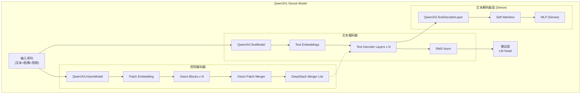

### MoE 版本架构

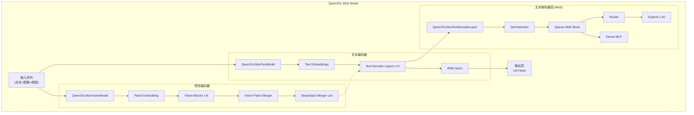

## 架构差异说明

### 1. 视觉编码器
两个版本共享相同的视觉编码器结构 [1](#1-0) ：
- `Qwen3VLVisionModel` / `Qwen3VLMoeVisionModel`
- 包含 `deepstack_visual_indexes` 和 `deepstack_merger_list` 用于DeepStack机制 [2](#1-1) 

### 2. 文本解码器层差异

**Dense版本**：
- 使用标准的 `Qwen3VLTextDecoderLayer` [3](#1-2) 
- 每层包含标准的Self Attention和MLP

**MoE版本**：
- 使用 `Qwen3VLMoeTextDecoderLayer` [4](#1-3) 
- 包含Sparse MoE Block，有60个专家 [5](#1-4) 
- 通过 `decoder_sparse_step` 控制MoE层的频率 [6](#1-5) 
- 支持混合模式：某些层使用Dense MLP，某些层使用MoE [7](#1-6) 

### 3. DeepStack机制
两个版本都实现了相同的DeepStack机制 [8](#1-7) 

Wiki pages you might want to explore:
- [Overview (huggingface/transformers)](/wiki/huggingface/transformers#1)

### Citations

**File:** src/transformers/models/qwen3_vl/modeling_qwen3_vl.py (L596-631)
```python
class Qwen3VLVisionModel(Qwen3VLPreTrainedModel):
    config: Qwen3VLVisionConfig
    _no_split_modules = ["Qwen3VLVisionBlock"]

    def __init__(self, config, *inputs, **kwargs) -> None:
        super().__init__(config, *inputs, **kwargs)
        self.spatial_merge_size = config.spatial_merge_size
        self.patch_size = config.patch_size
        self.spatial_merge_unit = self.spatial_merge_size * self.spatial_merge_size

        self.patch_embed = Qwen3VLVisionPatchEmbed(
            config=config,
        )

        self.pos_embed = nn.Embedding(config.num_position_embeddings, config.hidden_size)
        self.num_grid_per_side = int(config.num_position_embeddings**0.5)

        head_dim = config.hidden_size // config.num_heads
        self.rotary_pos_emb = Qwen3VLVisionRotaryEmbedding(head_dim // 2)

        self.blocks = nn.ModuleList([Qwen3VLVisionBlock(config) for _ in range(config.depth)])
        self.merger = Qwen3VLVisionPatchMerger(
            config=config,
            use_postshuffle_norm=False,
        )

        self.deepstack_visual_indexes = config.deepstack_visual_indexes
        self.deepstack_merger_list = nn.ModuleList(
            [
                Qwen3VLVisionPatchMerger(
                    config=config,
                    use_postshuffle_norm=True,
                )
                for _ in range(len(config.deepstack_visual_indexes))
            ]
        )
```

**File:** src/transformers/models/qwen3_vl_moe/modeling_qwen3_vl_moe.py (L636-645)
```python
        self.deepstack_visual_indexes = config.deepstack_visual_indexes
        self.deepstack_merger_list = nn.ModuleList(
            [
                Qwen3VLMoeVisionPatchMerger(
                    config=config,
                    use_postshuffle_norm=True,
                )
                for _ in range(len(config.deepstack_visual_indexes))
            ]
        )
```

**File:** src/transformers/models/qwen3_vl_moe/modeling_qwen3_vl_moe.py (L890-915)
```python
@auto_docstring(
    custom_intro=(
        "Text part of Qwen3VLMoe, "
        "not a pure text-only model, as DeepStack integrates visual features into the early hidden states."
    )
)
class Qwen3VLMoeTextModel(Qwen3VLMoePreTrainedModel):
    config: Qwen3VLMoeTextConfig
    _no_split_modules = ["Qwen3VLMoeTextDecoderLayer"]

    def __init__(self, config: Qwen3VLMoeTextConfig):
        super().__init__(config)
        self.padding_idx = config.pad_token_id
        self.vocab_size = config.vocab_size

        self.embed_tokens = nn.Embedding(config.vocab_size, config.hidden_size, self.padding_idx)
        self.layers = nn.ModuleList(
            [Qwen3VLMoeTextDecoderLayer(config, layer_idx) for layer_idx in range(config.num_hidden_layers)]
        )
        self.norm = Qwen3VLMoeTextRMSNorm(config.hidden_size, eps=config.rms_norm_eps)
        self.rotary_emb = Qwen3VLMoeTextRotaryEmbedding(config=config)
        self.gradient_checkpointing = False

        # Initialize weights and apply final processing
        self.post_init()

```

**File:** src/transformers/models/qwen3_vl/modular_qwen3_vl.py (L683-692)
```python
@auto_docstring(
    custom_intro=(
        "Text part of Qwen3VL, "
        "not a pure text-only model, as DeepStack integrates visual features into the early hidden states."
    )
)
class Qwen3VLTextModel(Qwen3VLPreTrainedModel, Qwen3Model):
    config: Qwen3VLTextConfig
    _no_split_modules = ["Qwen3VLTextDecoderLayer"]

```

**File:** src/transformers/models/qwen3_vl/modular_qwen3_vl.py (L697-705)
```python
    def _deepstack_process(
        self, hidden_states: torch.Tensor, visual_pos_masks: torch.Tensor, visual_embeds: torch.Tensor
    ):
        visual_pos_masks = visual_pos_masks.to(hidden_states.device)
        visual_embeds = visual_embeds.to(hidden_states.device, hidden_states.dtype)
        hidden_states = hidden_states.clone()
        local_this = hidden_states[visual_pos_masks, :] + visual_embeds
        hidden_states[visual_pos_masks, :] = local_this
        return hidden_states
```

**File:** src/transformers/models/qwen3_vl_moe/modular_qwen3_vl_moe.py (L164-167)
```python
        decoder_sparse_step: Optional[int] = 1,
        moe_intermediate_size: Optional[int] = 1408,
        num_experts_per_tok: Optional[int] = 4,
        num_experts: Optional[int] = 60,
```

**File:** src/transformers/models/qwen3_vl_moe/modular_qwen3_vl_moe.py (L196-199)
```python
        self.moe_intermediate_size = moe_intermediate_size
        self.num_experts_per_tok = num_experts_per_tok
        self.num_experts = num_experts
        self.mlp_only_layers = [] if mlp_only_layers is None else mlp_only_layers
```

**File:** src/transformers/models/qwen3_vl_moe/modular_qwen3_vl_moe.py (L260-319)
```python
class Qwen3VLMoeTextExperts(nn.Module):
    def __init__(self, config):
        super().__init__()
        self.num_experts = config.num_experts
        self.intermediate_size = config.moe_intermediate_size
        self.hidden_size = config.hidden_size
        self.expert_dim = self.intermediate_size
        self.gate_up_proj = nn.Parameter(torch.zeros(self.num_experts, self.hidden_size, 2 * self.expert_dim))
        self.down_proj = nn.Parameter(torch.empty((self.num_experts, self.expert_dim, self.hidden_size)))
        self.act_fn = ACT2FN[config.hidden_act]

    def forward(
        self, hidden_states: torch.Tensor, routing_weights: torch.Tensor, router_indices: torch.Tensor
    ) -> torch.Tensor:
        """
        When training it is more efficient to just loop over the experts and compute the output for each expert
        as otherwise the memory would explode.

        For inference we can sacrifice some memory and compute the output for all experts at once. By repeating the inputs.

        Args:
            hidden_states (torch.Tensor): (batch_size * token_num, hidden_size)
            routing_weights (torch.Tensor): (batch_size * token_num, num_experts)
            router_indices (torch.Tensor): (batch_size * token_num, top_k)
        Returns:
            torch.Tensor
        """
        batch_size = hidden_states.shape[0]
        hidden_states = hidden_states.reshape(-1, self.hidden_size)  # (num_tokens, hidden_size)
        if self.training:
            next_states = torch.zeros_like(hidden_states, dtype=hidden_states.dtype, device=hidden_states.device)
            with torch.no_grad():
                expert_mask = torch.nn.functional.one_hot(router_indices, num_classes=self.num_experts)
                expert_mask = expert_mask.permute(2, 1, 0)
                # we sum on the top_k and on the sequence length to get which experts
                # are hit this time around
                expert_hit = torch.greater(expert_mask.sum(dim=(-1, -2)), 0).nonzero()
            for expert_idx in expert_hit[:]:
                with torch.no_grad():
                    _, token_idx = torch.where(expert_mask[expert_idx[0]])
                current_state = hidden_states[token_idx]
                gate_up = current_state @ self.gate_up_proj[expert_idx]
                gate, up = gate_up.chunk(2, dim=-1)
                gated_output = up * self.act_fn(gate)
                out = gated_output @ self.down_proj[expert_idx]
                weighted_output = out[0] * routing_weights[token_idx, expert_idx, None]
                next_states.index_add_(0, token_idx, weighted_output.to(hidden_states.dtype))
            next_states = next_states.view(batch_size, -1, self.hidden_size)
        else:
            hidden_states = hidden_states.repeat(self.num_experts, 1)
            hidden_states = hidden_states.view(self.num_experts, -1, self.hidden_size)
            gate_up = torch.bmm(hidden_states, self.gate_up_proj)
            gate, up = gate_up.chunk(2, dim=-1)  # not supported for DTensors
            next_states = torch.bmm((up * self.act_fn(gate)), self.down_proj)
            next_states = next_states.reshape(self.num_experts, batch_size, -1, self.hidden_size)
            next_states = (
                next_states * routing_weights.transpose(0, 1).view(self.num_experts, batch_size, -1)[..., None]
            )
            next_states = next_states.sum(dim=0)
        return next_states
```


# 我问Transformers库deepwiki
继续细化出Qwen3VLVisionModel 、Qwen3VLMoeVisionModel 、Qwen3VLTextDecoderLayer和Qwen3VLMoeTextDecoderLayer的结构图（mermaid画就行）

# deepwiku答
## Qwen3-VL 组件详细结构图

### 1. Qwen3VLVisionModel 结构

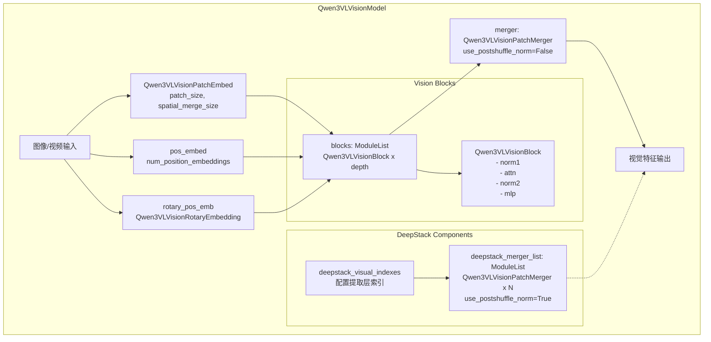

### 2. Qwen3VLMoeVisionModel 结构

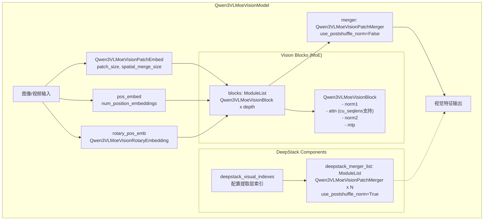

### 3. Qwen3VLTextDecoderLayer 结构

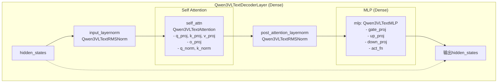

### 4. Qwen3VLMoeTextDecoderLayer 结构

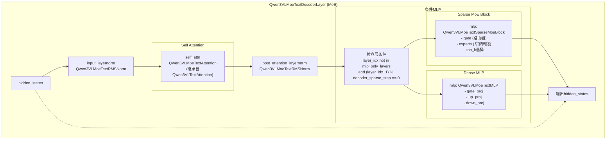

## 关键差异说明

### 视觉模型差异
- **Qwen3VLVisionModel** 使用标准的视觉块 [1](#2-0) 
- **Qwen3VLMoeVisionModel** 继承自Dense版本，但使用MoE特定的组件 [2](#2-1) ，支持 `cu_seqlens` 参数处理变长序列

### 文本解码器层差异
- **Qwen3VLTextDecoderLayer** 使用固定的Dense MLP [3](#2-2) 
- **Qwen3VLMoeTextDecoderLayer** 根据层索引和配置动态选择使用Sparse MoE或Dense MLP [4](#2-3) ，通过 `decoder_sparse_step` 控制MoE频率

### 共同特性
两个版本都实现了相同的DeepStack机制，包含 `deepstack_visual_indexes` 和 `deepstack_merger_list` 组件 [5](#2-4) 。

## Notes

Qwen3VLMoeVisionModel在modular_qwen3_vl_moe.py中通过pass语句继承自Qwen3VLVisionModel [6](#2-5) ，主要差异在于使用的具体组件类型（如VisionBlock、PatchEmbed等）。MoE版本的条件MLP选择机制是其核心创新，实现了计算效率和模型容量的平衡。

### Citations

**File:** src/transformers/models/qwen3_vl/modeling_qwen3_vl.py (L508-550)
```python
class Qwen3VLTextDecoderLayer(GradientCheckpointingLayer):
    def __init__(self, config: Qwen3VLTextConfig, layer_idx: int):
        super().__init__()
        self.hidden_size = config.hidden_size

        self.self_attn = Qwen3VLTextAttention(config=config, layer_idx=layer_idx)

        self.mlp = Qwen3VLTextMLP(config)
        self.input_layernorm = Qwen3VLTextRMSNorm(config.hidden_size, eps=config.rms_norm_eps)
        self.post_attention_layernorm = Qwen3VLTextRMSNorm(config.hidden_size, eps=config.rms_norm_eps)

    def forward(
        self,
        hidden_states: torch.Tensor,
        position_embeddings: tuple[torch.Tensor, torch.Tensor],
        attention_mask: Optional[torch.Tensor] = None,
        position_ids: Optional[torch.LongTensor] = None,
        past_key_values: Optional[Cache] = None,
        use_cache: Optional[bool] = False,
        cache_position: Optional[torch.LongTensor] = None,
        **kwargs: Unpack[TransformersKwargs],
    ) -> torch.Tensor:
        residual = hidden_states
        hidden_states = self.input_layernorm(hidden_states)
        # Self Attention
        hidden_states, _ = self.self_attn(
            hidden_states=hidden_states,
            attention_mask=attention_mask,
            position_ids=position_ids,
            past_key_values=past_key_values,
            use_cache=use_cache,
            cache_position=cache_position,
            position_embeddings=position_embeddings,
            **kwargs,
        )
        hidden_states = residual + hidden_states

        # Fully Connected
        residual = hidden_states
        hidden_states = self.post_attention_layernorm(hidden_states)
        hidden_states = self.mlp(hidden_states)
        hidden_states = residual + hidden_states
        return hidden_states
```

**File:** src/transformers/models/qwen3_vl/modeling_qwen3_vl.py (L596-631)
```python
class Qwen3VLVisionModel(Qwen3VLPreTrainedModel):
    config: Qwen3VLVisionConfig
    _no_split_modules = ["Qwen3VLVisionBlock"]

    def __init__(self, config, *inputs, **kwargs) -> None:
        super().__init__(config, *inputs, **kwargs)
        self.spatial_merge_size = config.spatial_merge_size
        self.patch_size = config.patch_size
        self.spatial_merge_unit = self.spatial_merge_size * self.spatial_merge_size

        self.patch_embed = Qwen3VLVisionPatchEmbed(
            config=config,
        )

        self.pos_embed = nn.Embedding(config.num_position_embeddings, config.hidden_size)
        self.num_grid_per_side = int(config.num_position_embeddings**0.5)

        head_dim = config.hidden_size // config.num_heads
        self.rotary_pos_emb = Qwen3VLVisionRotaryEmbedding(head_dim // 2)

        self.blocks = nn.ModuleList([Qwen3VLVisionBlock(config) for _ in range(config.depth)])
        self.merger = Qwen3VLVisionPatchMerger(
            config=config,
            use_postshuffle_norm=False,
        )

        self.deepstack_visual_indexes = config.deepstack_visual_indexes
        self.deepstack_merger_list = nn.ModuleList(
            [
                Qwen3VLVisionPatchMerger(
                    config=config,
                    use_postshuffle_norm=True,
                )
                for _ in range(len(config.deepstack_visual_indexes))
            ]
        )
```

**File:** src/transformers/models/qwen3_vl_moe/modeling_qwen3_vl_moe.py (L323-368)
```python
class Qwen3VLMoeTextDecoderLayer(GradientCheckpointingLayer):
    def __init__(self, config: Qwen3VLMoeTextConfig, layer_idx: int):
        super().__init__()
        self.self_attn = Qwen3VLMoeTextAttention(config, layer_idx)
        if (layer_idx not in config.mlp_only_layers) and (
            config.num_experts > 0 and (layer_idx + 1) % config.decoder_sparse_step == 0
        ):
            self.mlp = Qwen3VLMoeTextSparseMoeBlock(config)
        else:
            self.mlp = Qwen3VLMoeTextMLP(config, intermediate_size=config.intermediate_size)
        self.input_layernorm = Qwen3VLMoeTextRMSNorm(config.hidden_size, eps=config.rms_norm_eps)
        self.post_attention_layernorm = Qwen3VLMoeTextRMSNorm(config.hidden_size, eps=config.rms_norm_eps)
        self.hidden_size = config.hidden_size

    def forward(
        self,
        hidden_states: torch.Tensor,
        attention_mask: Optional[torch.Tensor] = None,
        position_ids: Optional[torch.LongTensor] = None,
        past_key_values: Optional[Cache] = None,
        use_cache: Optional[bool] = False,
        cache_position: Optional[torch.LongTensor] = None,
        position_embeddings: Optional[tuple[torch.Tensor, torch.Tensor]] = None,
        **kwargs: Unpack[TransformersKwargs],
    ) -> torch.Tensor:
        residual = hidden_states
        hidden_states = self.input_layernorm(hidden_states)
        # Self Attention
        hidden_states, _ = self.self_attn(
            hidden_states=hidden_states,
            attention_mask=attention_mask,
            position_ids=position_ids,
            past_key_values=past_key_values,
            use_cache=use_cache,
            cache_position=cache_position,
            position_embeddings=position_embeddings,
            **kwargs,
        )
        hidden_states = residual + hidden_states

        # Fully Connected
        residual = hidden_states
        hidden_states = self.post_attention_layernorm(hidden_states)
        hidden_states = self.mlp(hidden_states)
        hidden_states = residual + hidden_states
        return hidden_states
```

**File:** src/transformers/models/qwen3_vl_moe/modeling_qwen3_vl_moe.py (L610-645)
```python
class Qwen3VLMoeVisionModel(Qwen3VLMoePreTrainedModel):
    config: Qwen3VLMoeVisionConfig
    _no_split_modules = ["Qwen3VLMoeVisionBlock"]

    def __init__(self, config, *inputs, **kwargs) -> None:
        super().__init__(config, *inputs, **kwargs)
        self.spatial_merge_size = config.spatial_merge_size
        self.patch_size = config.patch_size
        self.spatial_merge_unit = self.spatial_merge_size * self.spatial_merge_size

        self.patch_embed = Qwen3VLMoeVisionPatchEmbed(
            config=config,
        )

        self.pos_embed = nn.Embedding(config.num_position_embeddings, config.hidden_size)
        self.num_grid_per_side = int(config.num_position_embeddings**0.5)

        head_dim = config.hidden_size // config.num_heads
        self.rotary_pos_emb = Qwen3VLMoeVisionRotaryEmbedding(head_dim // 2)

        self.blocks = nn.ModuleList([Qwen3VLMoeVisionBlock(config) for _ in range(config.depth)])
        self.merger = Qwen3VLMoeVisionPatchMerger(
            config=config,
            use_postshuffle_norm=False,
        )

        self.deepstack_visual_indexes = config.deepstack_visual_indexes
        self.deepstack_merger_list = nn.ModuleList(
            [
                Qwen3VLMoeVisionPatchMerger(
                    config=config,
                    use_postshuffle_norm=True,
                )
                for _ in range(len(config.deepstack_visual_indexes))
            ]
        )
```

**File:** src/transformers/models/qwen3_vl/modular_qwen3_vl.py (L518-527)
```python
        self.deepstack_visual_indexes = config.deepstack_visual_indexes
        self.deepstack_merger_list = nn.ModuleList(
            [
                Qwen3VLVisionPatchMerger(
                    config=config,
                    use_postshuffle_norm=True,
                )
                for _ in range(len(config.deepstack_visual_indexes))
            ]
        )
```

**File:** src/transformers/models/qwen3_vl_moe/modular_qwen3_vl_moe.py (L373-374)
```python
class Qwen3VLMoeVisionModel(Qwen3VLVisionModel):
    pass
```

# 我问
详细解释DeepStack机制，画出整体结构，并且代码层面解释deepstack_visual_indexes 和 deepstack_merger_list 组件 。所以你要画三个结构图，1. DeepStack整体流程、2. deepstack_visual_indexes组件结构、3. deepstack_merger_list组件结构

# deepwiki答
## DeepStack机制详解

### 1. DeepStack整体流程

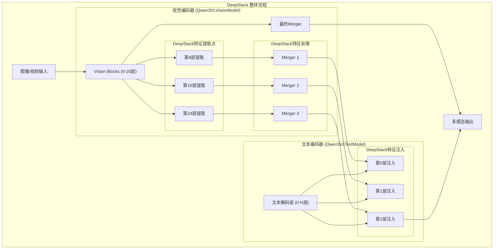

### 2. deepstack_visual_indexes 组件结构

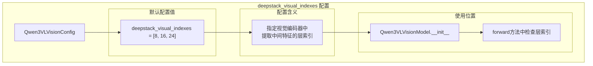

### 3. deepstack_merger_list 组件结构

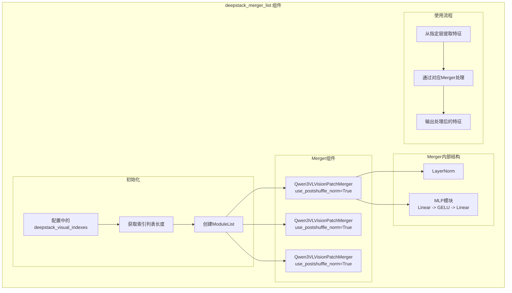

## 代码层面解释

### deepstack_visual_indexes

`deepstack_visual_indexes` 是在配置类中定义的列表，默认值为 `[8, 16, 24]` [1](#3-0) 。它指定了从视觉编码器的哪些层提取中间特征用于DeepStack机制。

在 `Qwen3VLVisionModel` 初始化时，这个配置被保存为实例属性 [2](#3-1) 。

### deepstack_merger_list

`deepstack_merger_list` 是一个 `nn.ModuleList`，包含多个 `Qwen3VLVisionPatchMerger` 实例 [3](#3-2) 。每个merger负责处理从对应层提取的视觉特征。

关键特点：
- 数量与 `deepstack_visual_indexes` 长度相同
- 每个merger设置 `use_postshuffle_norm=True`，与最终的merger不同
- 内部包含LayerNorm和MLP模块用于特征变换

### DeepStack工作流程

在视觉模型的forward方法中：

1. 遍历所有vision blocks [4](#3-3) 
2. 当当前层索引在 `deepstack_visual_indexes` 中时，提取特征 [5](#3-4) 
3. 使用对应的merger处理提取的特征 [6](#3-5) 
4. 将处理后的特征添加到 `deepstack_feature_lists` 中

在文本模型的forward方法中，这些特征通过 `_deepstack_process` 方法被注入到文本解码器的早期层中 [7](#3-6) 。

## Notes

DeepStack机制允许模型从视觉编码器的多个中间层提取特征，并将这些特征注入到文本解码器的不同层中，实现了更深层次的多模态融合。这种设计灵感来源于论文DeepStack(https://arxiv.org/abs/2406.04334) [8](#3-7) 。同样的机制也被应用于Qwen3-VL-MoE和Qwen3-Omni-MoE等模型变体中。

### Citations

**File:** src/transformers/models/qwen3_vl/modular_qwen3_vl.py (L85-85)
```python
        deepstack_visual_indexes=[8, 16, 24],
```

**File:** src/transformers/models/qwen3_vl/modular_qwen3_vl.py (L518-518)
```python
        self.deepstack_visual_indexes = config.deepstack_visual_indexes
```

**File:** src/transformers/models/qwen3_vl/modular_qwen3_vl.py (L519-527)
```python
        self.deepstack_merger_list = nn.ModuleList(
            [
                Qwen3VLVisionPatchMerger(
                    config=config,
                    use_postshuffle_norm=True,
                )
                for _ in range(len(config.deepstack_visual_indexes))
            ]
        )
```

**File:** src/transformers/models/qwen3_vl/modular_qwen3_vl.py (L665-665)
```python
        for layer_num, blk in enumerate(self.blocks):
```

**File:** src/transformers/models/qwen3_vl/modular_qwen3_vl.py (L672-672)
```python
            if layer_num in self.deepstack_visual_indexes:
```

**File:** src/transformers/models/qwen3_vl/modular_qwen3_vl.py (L673-675)
```python
                deepstack_feature = self.deepstack_merger_list[self.deepstack_visual_indexes.index(layer_num)](
                    hidden_states
                )
```

**File:** src/transformers/models/qwen3_vl/modular_qwen3_vl.py (L726-729)
```python
        deepstack_visual_embeds (`list[torch.Tensor]`, *optional*):
            The deepstack visual embeddings. The shape is (num_layers, visual_seqlen, embed_dim).
            The feature is extracted from the different visual encoder layers, and fed to the decoder
            hidden states. It's from the paper DeepStack(https://arxiv.org/abs/2406.04334).
```

**File:** src/transformers/models/qwen3_vl/modular_qwen3_vl.py (L787-792)
```python
            if deepstack_visual_embeds is not None and layer_idx in range(len(deepstack_visual_embeds)):
                hidden_states = self._deepstack_process(
                    hidden_states,
                    visual_pos_masks,
                    deepstack_visual_embeds[layer_idx],
                )
```
