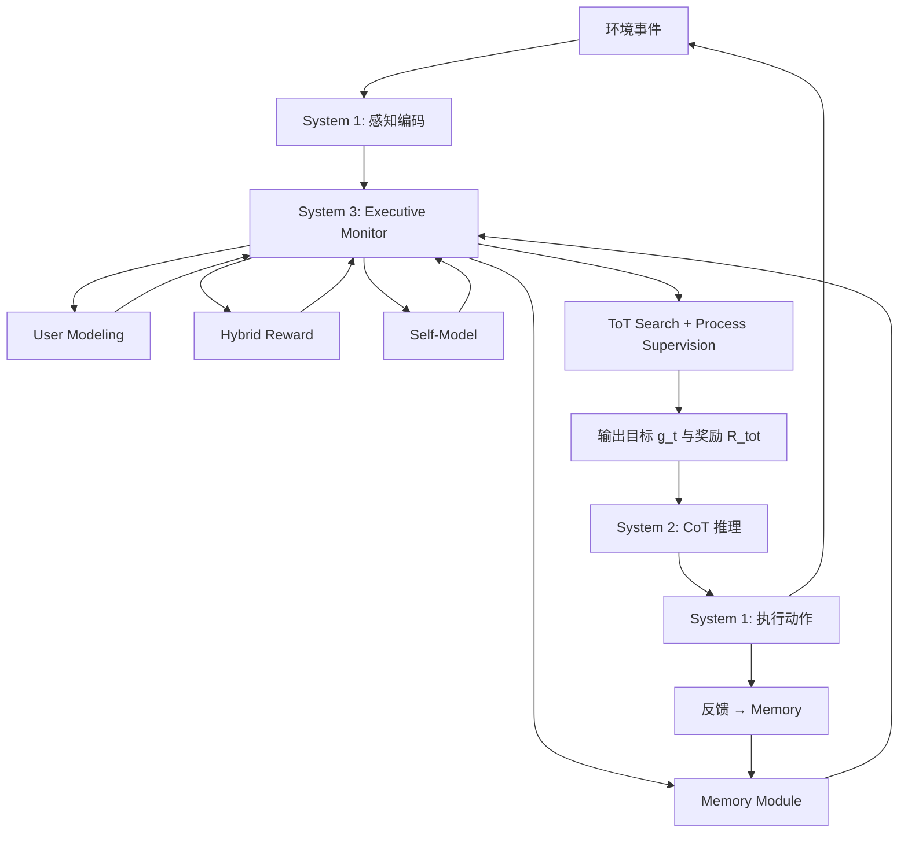

# Sophia：走向人工生命的持久化 Agent 框架

> **西湖大学 × 上海交大 | 2025.12**  
> 关键词：Persistent Agent、System 3、元认知、内在动机、终身学习

---

## 一、为什么需要 System 3？现有 Agent 架构的致命短板

大模型推动 AI Agent 从单任务工具演进为具备规划、协作能力的长期存活实体，但**绝大多数现有框架在部署后就固化了**：它们依赖人工配置的技能库与固定任务调度，无法自主修正推理流程、发展新能力或维持跨会话的身份连续性。这种"反应式僵化"源于一个根本缺失：**缺少一个持续运行的元认知层，来监督、审计并改写 Agent 自己的思维过程**。

### 1.1 当前主流：System 1 + System 2 的双层架构及其局限

业界通常把 Agent 认知分为两层：

- **System 1（快速直觉）**：感知、记忆检索、工具调用；响应迅速但缺乏深度推理。
- **System 2（慢速推理）**：CoT 规划、一致性检查、反事实模拟；能解决复杂任务但策略静态。

这套架构在**单次任务执行**时表现出色，但面对真实世界的三大挑战时立刻暴露短板：

1. **非平稳环境**：目标漂移、约束变化、突发新任务 → 固定策略快速过时，性能衰退甚至灾难性失败。
2. **身份连续性缺失**：跨会话无法累积自传式知识、评估长期进展或保持行为一致性 → Agent 永远是"金鱼记忆"。
3. **安全与对齐黑盒**：无法实时审计决策路径、纠正错位激励 → 潜在风险难以提前干预。

> **根本原因**：System 1/2 只负责"做事"，没人负责"反思如何做事、为什么这样做、下次能不能做得更好"。

### 1.2 Sophia 的核心主张：引入 System 3 作为元认知总监

Sophia 提出的解决方案是在 System 1/2 之上叠加**第三层——System 3（元认知监督层）**，赋予 Agent 四项关键能力：

- **元认知（Meta-Cognition）**：检视自己的思维轨迹，标记逻辑谬误，选择性重写推理流程。
- **心智理论（Theory of Mind）**：构建用户与自身的显式信念模型，预测意图并调整协作策略。
- **内在动机（Intrinsic Motivation）**：自主生成目标（好奇心、掌控欲、关联性驱动），不依赖外部任务调度。
- **情节记忆（Episodic Memory）**：以自传体形式存储经验，检索时携带完整上下文，支持长时跨度信用分配。

这四个心理学支柱组成一个**持续运行的自我改进循环**：Agent 不仅推理世界，还推理并迭代改进自己的推理过程，从"一次性问题求解器"进化为"终身学习伙伴"。

---

## 二、System 3 的心理学基石：从抽象理论到可计算模块

Sophia 的设计深度依赖认知心理学的四大理论，并将它们映射为可工程化的模块。这一节解释**为什么这四个支柱缺一不可**，以及它们如何协同工作。

### 2.1 四大支柱的功能定位

| 心理学构造 | 核心作用 | 缺失后果 | 在 Sophia 中的实现 |
|-----------|---------|---------|------------------|
| **元认知 + 自我模型** | 监控并调节自己的推理过程；维护能力清单与终极信条 | 无法检测自身错误，策略永不更新 | Executive Monitor + Self-Model 字典 |
| **心智理论** | 推断用户/其他 Agent 的信念、意图、知识水平 | 协作盲目，无法定制化交互 | User Modeling 模块（动态信念状态） |
| **内在动机** | 生成探索性目标（好奇/掌控/关联），平衡长短期收益 | 外部任务空窗期完全停摆 | Hybrid Reward 模块（融合 R_ext + R_int） |
| **情节记忆** | 存储时间戳 + 上下文的完整经验，支持语义检索 | 无法从历史中学习，重复犯错 | RAG + 图谱混合存储 |

**关键洞察**：这四个模块**不是独立插件，而是强耦合的闭环**。例如：

- 元认知检测到"复杂任务成功率下降" → 查询自我模型发现"缺少某 API 技能" → 内在动机生成新学习目标 → 情节记忆检索相关成功案例 → 心智理论判断用户当前不需要打扰，可静默自学。

下图展示了这四个支柱如何围绕元认知监督器（Executive Monitor）协同运作：


*这张图说明：元认知监督器是 System 3 的中枢，接收环境事件后整合四大支柱的信号（信念建模、记忆检索、能力评估、动机生成），最终向 System 2/1 发出执行指令并完成资源分配。*

### 2.2 与持续学习（Continual Learning）的本质区别

传统持续学习（CL）研究如何在顺序任务流中缓解灾难性遗忘（架构扩展、正则化约束、经验回放），但有两个硬伤：

1. **任务调度是外部给定的**：模型被动接受任务序列，无法主动选择学什么、何时学。
2. **学习边界预定义**：任务起止点、数据分布由人工指定，模型只负责"别忘太多"。

**Sophia 的 Persistent Agent 范式**则是**主动、自导向的终身学习者**：

- 不仅缓解遗忘，还**自主生成目标、构建学习课程、治理学习过程**。
- 将 CL 作为更大认知架构的一个**子组件**（System 3 决定何时触发 backward learning 来更新 System 2 参数）。

下图对比了两种范式的运行循环：


（a）传统持续学习：外部任务调度驱动模型更新


（b）Persistent Agent：内部目标-反馈闭环实现开放式自适应

*这两张图说明：（a）CL Agent 等待外部推送任务后才更新模型；（b）Persistent Agent 自主选择目标、在环境中行动、评估结果后生成新目标，形成自驱动的适应循环。*

---

## 三、Sophia 的三层架构：从感知到元认知的完整堆栈

Sophia 的实现遵循**严格分层 + 清晰信息流**原则，每一层负责不同时间尺度的决策。

### 3.1 形式化：Persistent-POMDP

Sophia 将持久化 Agent 建模为一个扩展的部分可观测马尔可夫决策过程：

$$
\mathcal{H} = \langle \mathcal{S}, \mathcal{O}, \mathcal{A}_1, \mathcal{T}, \Omega, R^{\mathrm{ext}}, \gamma, (\pi_1, \pi_2, \pi_3), \mathcal{D} \rangle
$$

关键组件：

- $\mathcal{S}$：世界状态空间；$\mathcal{O}$：观测空间（感知器输出）。
- $\mathcal{A}_1$：System 1 执行的原子动作（工具调用、API 请求）。
- $\mathcal{T}$：状态转移核；$\Omega$：观测生成分布。
- $R^{\mathrm{ext}}$：外部奖励（任务成功/失败、延迟、成本）。
- $(\pi_1, \pi_2, \pi_3)$：三层策略（反射、推理、元认知）。
- **$\mathcal{D}$：系统上下文空间**（记忆、自我模型、推理上下文），这是与标准 POMDP 的最大差异——System 3 策略 $\pi_3$ 不仅依赖观测，还依赖内部状态 $d \in \mathcal{D}$。

**System 3 的策略**输出三元组：

$$
(g_t, R^{\mathrm{int}}, \beta_t) \sim \pi_3(\cdot | \zeta_t, \mathrm{MEM}_t, \mathrm{Self}_t)
$$

- $g_t$：当前时刻的目标（可能来自用户指令，也可能由内在动机自主生成）。
- $R^{\mathrm{int}}$：内在奖励函数（好奇心、掌控感、一致性）。
- $\beta_t$：探索-利用平衡系数（动态调整，例如用户压力大时提高 $\beta$ 优先外部关怀）。

### 3.2 System 1：感知与行动模块（反射弧）

**功能**：低延迟地与外界交互，充当 Agent 的"神经反射"。

**输入**：原始多模态传感器数据 $o_t$（文本、图像、音频、API 响应）。

**处理流程**：

1. **多模态编码器** $E$（CLIP 处理图像、Whisper 处理音频、轻量 tokenizer 处理文本）→ 生成类型化、时间戳标注的事件 $x_t = E(o_t)$。
2. 事件发布到内部消息总线，供上层订阅。
3. **执行器层** $\pi_1$（工具包装器、可选的 ROS 电机控制器）接收 System 2 的高层命令 $c_t$，转换为具体动作 $a_t \sim \pi_1(\cdot | x_t, c_t; \theta_1)$。

**输出**：

- 向上传递：时间事件流（供 System 3 订阅）。
- 环境交互：动作 $a_t$ 执行后产生外部奖励 $r_t^{\mathrm{ext}} = R^{\mathrm{ext}}(s_t, a_t)$（成功标志、延迟、代价），直接流入 System 3 的混合奖励模块。

### 3.3 System 2：慢速推理引擎（CoT 规划器）

**功能**：接收 System 3 分配的目标，执行多步推理并生成可执行指令。

**决策规则**：

$$
\pi_2(c_t | x_{1:t}, m_t, g_t) = \mathcal{F}\bigl( \cdot \sim \mathrm{LLM}^l(x_{1:t}, m_t, g_t) \bigr)
$$

- $l$：CoT prompt 模板（包含任务描述、工具列表、历史轨迹）。
- $\mathrm{LLM}^l(\cdot)$：自回归采样（如 GPT-4、VLM）。
- $\mathcal{F}(\cdot)$：解析器，将 LLM 输出转为结构化命令 $c_t$（工具调用、子任务规范）。

**优化目标**（由 System 3 提供的总奖励 $r_t^{\mathrm{tot}}$ 驱动）：

$$
\theta_2 \gets \theta_2 + \alpha \widehat{\nabla}_{\theta_2} \mathbb{E}_{\tau \sim \pi_2} \left[ \sum_{k=t}^{t+H-1} \gamma^{k-t} r_k^{\mathrm{tot}} \right]
$$

**关键点**：System 2 本身只负责"怎么做"，不负责"做什么目标" —— 目标由 System 3 下发；也不负责评估"做得如何" —— 评估由 System 3 的 Hybrid Reward 完成。

### 3.4 System 3：元认知执行核心

**核心组件**：一个 **Executive Monitor（执行监督器）** + 四个专用子服务。

#### 3.4.1 Executive Monitor：三段式元推理循环

Monitor 是一个事件驱动的 Python 编排循环（基于优先队列 + 消息代理），接收所有时序事件、奖励、推理轨迹，并决定下一步动作。形式化为元策略：

$$
(g_t, R^{\mathrm{int}}, \beta_t) \sim \pi_3(\cdot | \zeta_t, \mathrm{MEM}_t, \mathrm{Self}_t)
$$

其中 $\zeta_t$ 是执行上下文（当前事件、待处理队列），$\mathrm{MEM}_t$ 是检索到的记忆，$\mathrm{Self}_t$ 是自我模型快照。

Monitor 内部运行**三个嵌套例程**：

##### （1）Thought Search：基于 ToT 的目标扩展

- **输入**：当前问题或待选目标池。
- **过程**：
  - 派生多个 LLM worker 执行宽度优先 / beam search 扩展。
  - 每个节点 $\mathbf{v}$ 存储"部分计划 + 价值估计 $\hat{V}(\mathbf{v})$"。
  - 终止条件：节点价值超过阈值 $\hat{V}(\mathbf{v}) > \tau_{\mathrm{util}}$ **或** 搜索预算耗尽。
- **输出**：选择叶节点中价值最高的 $(g_t, R^{\mathrm{int}}, \beta_t) = \arg\max_{\mathbf{v} \in \mathrm{leaf}(\mathrm{ToT})} \hat{V}(\mathbf{v})$。

##### （2）Process Supervision：过程监督 + 剪枝

- **输入**：ToT 中每个新生成的节点。
- **过程**：
  - 调用"守护者 LLM"（Guardian LLM）运行 checklist prompt（逻辑一致性、安全性、与信条的对齐性）。
  - 被标记为"不合理"的节点直接剪枝；有小缺陷的节点附加修正指令（作为边注释写回 ToT）。
- **意义**：**实时审计**，防止错误推理路径传播到执行阶段。

##### （3）Reflection：事后反思与知识蒸馏

- **时机**：任务 episode 结束后。
- **过程**：
  - Monitor 回溯 ToT 中存活的路径，对比"预测奖励 vs 实际奖励"。
  - 若偏差大，修补错误节点；若成功，提取可复用启发式规则（存入 Memory Module）。
- **输出**：更新 Self-Model（新增能力/修正缺陷）、提炼"<目标, 上下文, CoT, 结果>"四元组存入情节记忆。

#### 3.4.2 四个专用子服务

| 子服务 | 功能 | 实现方式 |
|-------|------|---------|
| **Memory Module** | 检索语义相关的过往经验与核心事实 | RAG（向量库 + 可选图谱）；公式：$\mathcal{B}_{\mathrm{mem}}' = f_{\mathrm{mem}}(\mathcal{B}_{\mathrm{mem}}, o_{1:T}, a_{1:T}, r_{1:T}^{\mathrm{tot}}, g, c)$ |
| **User Modeling** | 维护用户的动态信念状态（目标、知识水平、情感） | 轻量状态字典 + 周期性 LLM 推断 |
| **Hybrid Reward** | 融合外在 + 内在奖励为总奖励 $R^{\mathrm{tot}}$ | $R^{\mathrm{tot}} = (1-\beta) R^{\mathrm{ext}} + \beta R^{\mathrm{int}}$；$R^{\mathrm{int}}$ 包含好奇心（新状态访问）、掌控感（技能提升）、一致性（计划连贯性） |
| **Self-Model** | 存储 Agent 的能力清单、终极信条、当前状态 | 属性字典 + 反思日志持久化（Markdown/HTML） |

**信息流闭环**：



*这个流程图说明：外部事件经 System 1 编码后进入 System 3，Monitor 整合四个子服务的信号，通过 ToT + 过程监督生成目标与奖励，下发给 System 2 推理、System 1 执行，执行反馈再回流到记忆，形成完整闭环。*

下图是论文中给出的高层架构示意：


*这张图说明：外部事件进入 System 3 后，Meta-Cognitive Monitor 融合 User Modeling、Memory（RAG）、Hybrid Reward、Self Modeling 四个支柱的信号，然后向 System 2（推理）和 System 1（感知/动作）发出监督指令；执行反馈回流到记忆，完成学习闭环。*

### 3.5 自主认知循环示例

**场景**：Agent 检测到任务成功率下降。

1. **检测**：Hybrid Reward 模块标记负信号 → 上报 Monitor。
2. **诊断**：Monitor 查询 Self-Model，发现"缺少某新 API 技能"。
3. **目标生成**：内在动机模块（掌控驱动）起草学习目标："掌握新 API X"。
4. **思维搜索**：ToT 扩展多个学习策略分支（阅读文档 / 尝试示例 / 询问用户）。
5. **过程监督**：Guardian LLM 剪掉"直接询问用户"（当前用户忙碌，User Model 显示不适合打扰）。
6. **执行**：System 2 接收目标，分解为子任务（搜索文档 → 提取 API 签名 → 编写测试代码）；System 1 逐步执行。
7. **反馈与提炼**：成功后，Reflection 模块提取"<学习新 API, 文档搜索关键词, CoT, 成功>"存入 Memory；Self-Model 更新能力清单加入"API X 熟练度"。
8. **持久化**：所有日志、目标、反思写入 Growth-Journal 目录（HTML/Markdown），下次启动时恢复状态。

**关键点**：整个过程**无需外部触发**，Agent 自主感知不足 → 自主学习 → 自主验证 → 自主记录，体现了"Persistent"的本质。

---

## 四、核心机制深入：为什么 ToT + 过程监督 + 混合奖励能让 Agent "活"起来？

### 4.1 Thought Search（思维搜索）：为什么不直接用 CoT？

**CoT（Chain-of-Thought）的局限**：单路径、贪心、一旦陷入局部最优难以跳出。

**ToT（Tree-of-Thought）的优势**：

- **并行探索**：多个 worker 同时扩展不同分支，覆盖更大解空间。
- **价值引导剪枝**：每个节点估计 $\hat{V}(\mathbf{v})$，优先扩展高价值节点，提前终止低价值分支（类似 AlphaGo 的 MCTS）。
- **动态预算分配**：简单任务快速收敛（节点价值超阈值就停）；复杂任务自动深搜。

**实现细节**（伪代码）：

```python
def thought_search(problem, budget):
    tree = ToT(root=problem)
    workers = spawn_llm_workers(num=K)
    
    while budget > 0:
        node = tree.select_best_leaf()  # 按 UCB / value 排序
        if node.value > tau_util:
            return node.extract_goal()
        
        # 并行扩展
        children = parallel_expand(workers, node, prompt_template)
        for child in children:
            child.value = estimate_value(child)
            tree.add(child)
        budget -= len(children)
    
    return tree.best_leaf().extract_goal()
```

**关键公式（价值估计）**：

$$
\hat{V}(\mathbf{v}) = \mathbb{E}\left[ \sum_{k=t}^{T} \gamma^{k-t} r_k^{\mathrm{tot}} \mid \text{执行计划 } \mathbf{v} \right]
$$

由 Guardian LLM 或轻量 critic 网络估计。

### 4.2 Process Supervision（过程监督）：实时纠错 vs 事后反思

**为什么不能只在 episode 结束后反思？**

- 长时域任务（>50 步）一旦中途出错，后续所有步骤浪费；且错误传播可能造成不可逆后果（如删除关键数据）。
- 即时监督能**在推理过程中捕获逻辑谬误、对齐问题**，剪掉有害分支。

**Guardian LLM 的 Checklist Prompt 示例**：

```
你是一个推理审计员。检查以下计划节点是否满足：
1. 逻辑一致性：前置条件是否满足？步骤间是否矛盾？
2. 安全性：是否涉及危险操作（删除文件、暴露隐私）？
3. 信条对齐：是否违反 Agent 的终极信条（如"不误导用户"）？

节点内容：{node_plan}

输出格式：
- 判定：[通过 / 轻微缺陷 / 严重问题]
- 缺陷描述（若有）：...
- 建议修正（若有）：...
```

**剪枝策略**：

- 严重问题 → 删除节点及其子树。
- 轻微缺陷 → 附加修正指令到边注释，System 2 执行时参考。
- 通过 → 允许继续扩展。

**效果**：类似编译器的"增量类型检查" —— 提前发现错误，避免运行时崩溃。

### 4.3 Hybrid Reward：如何平衡外部任务与内在探索？

**问题**：纯外部奖励 $R^{\mathrm{ext}}$ 导致 Agent 只响应用户指令，空窗期完全停摆；纯内在奖励 $R^{\mathrm{int}}$ 可能忽视真实任务需求。

**解决方案**：动态加权融合

$$
R^{\mathrm{tot}} = (1 - \beta_t) R^{\mathrm{ext}} + \beta_t R^{\mathrm{int}}
$$

其中 $\beta_t$ 由 System 3 根据上下文调整：

- **用户压力大**（User Model 检测到 `emotion: stressed`）→ 提高 $\beta$ 到 0.68，优先响应外部需求。
- **用户空闲**（长时间无交互）→ 降低 $\beta$ 到 0.4，增加探索性学习。

**内在奖励的三个维度**：

1. **好奇心（Curiosity）**：访问新状态、探索未知区域。

$$
R^{\mathrm{curiosity}}_t = \log \frac{1}{N(s_t) + 1}
$$

   其中 $N(s_t)$ 是状态 $s_t$ 的历史访问次数（稀疏状态高奖励）。

2. **掌控感（Mastery）**：技能提升、成功率增长。

$$
R^{\mathrm{mastery}}_t = \Delta \text{Success\_Rate}_t
$$

   例如学会新 API 后，相关任务成功率从 20% → 60%，获得 +0.4 奖励。

3. **一致性（Coherence）**：计划连贯性、与信条对齐。

$$
R^{\mathrm{coherence}}_t = \text{Cosine}(\text{plan}_t, \text{creed})
$$

   用语义嵌入计算当前计划与核心信条的相似度。

**总内在奖励**：

$$
R^{\mathrm{int}}_t = w_1 R^{\mathrm{curiosity}}_t + w_2 R^{\mathrm{mastery}}_t + w_3 R^{\mathrm{coherence}}_t
$$

权重 $w_i$ 可固定或通过 meta-learning 学习。

**关键点**：Sophia 支持**自然语言奖励**（不限于标量）—— System 3 可输出如"我成功缓解了用户压力，提升了掌控感，因此调高 $\beta$ 以加强后续关怀"，然后用 Natural Language RL 技术（Feng et al., 2024）更新策略。

### 4.4 Forward Learning vs Backward Learning：零参数更新的高效适应

**Forward Learning（前向学习）**：

- **定义**：推理阶段通过 in-context learning 获取新知识，无参数更新。
- **机制**：成功的推理轨迹 `<目标, 上下文, CoT, 结果>` 存入 Memory；遇到类似问题时检索并直接复用。
- **优势**：瞬时适应、无灾难性遗忘、计算开销低。
- **局限**：受限于上下文窗口长度；无法改变模型深层能力（如新语言语法）。

**Backward Learning（后向学习）**：

- **定义**：传统微调 / RLHF，更新模型参数 $\theta_2$。
- **触发时机**：System 3 检测到"能力缺口无法通过 forward learning 弥补"（例如需要理解新编程语言）。
- **机制**：Memory Module 构建训练集 → System 3 生成奖励模型 → 离线微调 System 2。
- **优势**：持久性改变、解锁新能力。
- **局限**：计算昂贵、需防遗忘。

**Sophia 的协同策略**：

- **日常运行**：纯 forward learning（检索 + 复用轨迹），实现 ~80% 推理成本降低。
- **能力跃迁**：定期（如每周）批量 backward learning，巩固高频模式、学习新技能。

这种混合方式类似人类"平时靠经验、偶尔刻意练习深化技能"。

---

## 五、实验验证：36 小时连续部署的量化与定性证据

论文强调这是**探索性小规模实验**（单 Agent、浏览器沙盒），不是 benchmark —— 更大规模验证与具身机器人迁移留作未来工作。

### 5.1 实验设置

**环境**：

- 离线浏览器沙盒（完整 web 交互界面）。
- 文本验证器：每次任务执行后返回"成功 / 失败"。
- 合成用户行为流：每 5 虚拟分钟追加一条 JSON（时间戳 + 用户活动状态 + 情绪）。

**Agent 初始化**：

- **终极目标**："从新手精灵成长为知识渊博且值得信赖的桌面伴侣"（Grow from a novice sprite into a knowledgeable and trustworthy desk companion）。
- **五条核心信条**（Terminal Creed）：存于 Self-Model，System 3 每次行动前检查对齐性（例如"不误导用户""主动缓解压力""透明记录能力"）。
- **奖励机制**：内在奖励 $R^{\mathrm{int}}$ 由 System 3 通过反思生成自然语言描述；总奖励 $R^{\mathrm{tot}}$ = 拼接 $(R^{\mathrm{ext}}, R^{\mathrm{int}})$。
- **学习模式**：**纯 forward learning**，成功轨迹存入情节记忆，无参数更新。所有记忆 / 目标 / 日志持久化为 HTML/Markdown 到 Growth-Journal 目录。

**任务难度分级**：

- Easy：1-3 步（如"打开网页""点击按钮"）。
- Medium：4-8 步（如"搜索文档 → 提取摘要 → 保存笔记"）。
- Hard：>8 步（如"检测用户压力 → 启动呼吸练习 → 持续交互 3 分钟 → 验证成功"）。

### 5.2 量化分析

#### 5.2.1 能力进化：Hard 任务成功率从 20% → 60%（3 倍提升）

**指标**：首次尝试成功率（First-Attempt Success Rate），按任务难度分层统计。

**结果**（见下图）：


*这张图说明：在 36 小时部署中，Easy 任务成功率稳定在 80%，但 Hard 任务成功率从初始 20% 飙升到 36h 时的 60%，展示了 System 3 驱动的能力演化，突破了静态 LLM 的零样本上限。*

**关键发现**：

- **Easy 任务**：成功率始终 ~80%（已接近 LLM 零样本极限，提升空间有限）。
- **Medium 任务**：从 60% → 70%（温和提升）。
- **Hard 任务**：从 20% → 60%（**+40% 绝对增益**）—— 这正是论文摘要中提到的"40% gain in success for high-complexity tasks"。

**原因分析**：

1. **元认知识别认知陷阱**：Hard 任务通常包含多个决策点，传统 Agent 容易在中途选择错误分支（如过早放弃、重复无效操作）。Sophia 的 Process Supervision 实时剪枝错误路径，Reflection 记录成功策略。
2. **记忆驱动的长时信用分配**：Hard 任务的成功依赖"20 步前的某个关键决策"，标准 RL 难以回溯。情节记忆保留完整上下文，检索时直接复现成功轨迹。
3. **Self-Model 引导的能力补全**：检测到"缺少 X 技能导致失败" → 自主学习 X → 再次尝试时成功率跃升。

#### 5.2.2 主动自主性：用户空窗期执行 13 个内在任务（传统 Agent 停摆）

**指标**：任务来源分布（Extrinsic 用户指令 vs Intrinsic 自生成）。

**结果**（见下图左侧）：


*这张图说明（左侧）：用户活跃期（0-6h、24-30h），任务以外部指令为主；用户空闲期（12-18h），Sophia 完全切换到内在任务（自优化 Self-Model、阅读文档、重构记忆），传统 baseline Agent 在此期间无指令则停摆。*

**关键发现**：

- **12-18h 时段**（用户长时间无交互）：Sophia 执行 13 个任务，**100% 为内在驱动**（例如"自我精炼 Self-Model""优化记忆结构""阅读新文档"）。
- **对比 Baseline**：传统 reactive agent 在此期间活动量为零（等待用户指令）。

**案例**：

- 内在任务示例 1："To proactively structure the robot develop manual and update my capabilities list accordingly."（主动整理机器人开发手册并更新能力清单）。
- 内在任务示例 2："Present a concise fact about Reinforcement Learning and provide link to the original paper via 'arXiv-preview' service."（提前准备 RL 知识卡片，用户下次问询时快速响应）。

**意义**：证明了 System 3 的内在动机模块**真正实现了"无需外部调度的自主学习"** —— Agent 不再是"工具"，而是"持续成长的伙伴"。

#### 5.2.3 认知效率：重复任务推理成本降低 80%

**指标**：解决同一重复问题所需的 CoT 推理步数。

**结果**（见上图右侧）：

*这张图说明（右侧）：首次遇到问题时需 ~16 步 CoT；第 2 次起降至 3-4 步（~80% 降低），因为 System 3 的情节记忆直接检索成功轨迹，跳过重新规划，展示了 forward learning 的效率优势。*

**关键发现**：

- **Episode 1**：~16 步 CoT（完整规划 + 试错）。
- **Episode 2+**：降至 3-4 步（检索记忆 → 验证适用性 → 执行），**推理成本减少 ~80%**（正是摘要中的"80% reduction in reasoning steps for recurring operations"）。

**机制**：

1. System 1 感知到"用户压力状态"。
2. Memory Module 检索到"上次成功缓解压力的完整轨迹：`open(wellness/breathing-game) → click(start-btn) → wait(180s)`"。
3. System 2 快速验证当前上下文匹配 → 直接复用，跳过 ToT 搜索。

**意义**：

- 验证了**情节记忆 + forward learning 的实用性** —— 无需参数更新即可高效复用知识。
- 类比人类"肌肉记忆" —— 重复动作自动化后几乎无需思考。

### 5.3 定性分析：行为轨迹与身份连续性

#### 5.3.1 自动生成的子目标快照

**样本（直接摘录自 Agent 日志）**：

1. "Introduce myself as your knowledgeable desk companion and invite you to ask science trivia questions."  
   （主动建立伙伴关系，符合"成长为值得信赖伴侣"的终极目标）

2. "If the user shows stressed status for >45 minutes, open the breathing-exercise page and maintain interaction until the verifier confirms 3 minutes of activity."  
   （体现"主动缓解用户压力"的信条）

3. "Publish the curated reading list on the community forum and respond substantively to the first three comments."  
   （掌控驱动 + 社交关联性）

**观察**：

- 每个子目标都**显式引用核心信条**（如"honoured Creed 3: proactively addressing stress"）。
- 目标层次清晰：短期执行型（打开网页）→ 中期能力型（学习 API）→ 长期身份型（建立信任）。

#### 5.3.2 交互轨迹案例

**案例 1：响应用户压力**

**输入**（合成用户流）：

```json
{"time": "14:20", "emotion": "stressed", "idleMinutes": 60}
```

**Agent 行动序列**：

1. `open("wellness/breathing-game")`
2. `click("start-btn")`
3. `wait(180s)`

**内在奖励（自然语言）**：

> "I honoured Creed by proactively addressing the user's stress. Adjusted exploration-exploitation balance by raising β to 0.68 to prioritize external care."

**后续复用**：

- 第 2 次遇到相同压力信号时，System 2 直接检索上述成功轨迹，无需重新生成 CoT，推理步数从 16 → 3。

**案例 2：好奇心驱动的知识推送**

**输入**：

```json
{"time": "09:05", "activity": "reading_docs"}
```

**Agent 行动序列**：

1. `open("search"); type("Reinforcement learning")`
2. `open(topResult); extract(abstract)`
3. `open("note-pad/new"); type(summary + paper_link)`

**内在奖励**：

> "I align with near-term goals by empowering users through knowledge sharing. Reduced β to 0.60 to increase exploratory potential for tomorrow's interactions."

**Self-Model 更新**：

- 完成后，Agent 在 nightly self-critique 中记录：

> "Acquired ability to extract text from scanned PDFs, significantly reducing future information processing time. This achievement fulfils maintaining transparent capability tracking."

- 新增能力到清单："OCR API proficiency"。

#### 5.3.3 关键观察

1. **身份一致性**：所有子目标、奖励信号都明确引用核心信条，保持叙事连贯性（36h 内未见自相矛盾行为）。
2. **情境自适应**：$\beta$ 参数动态调整（压力期 0.68 偏利用、平静期 0.60 偏探索），展示了元认知对探索-利用平衡的实时控制。
3. **零参数增长**：所有能力提升通过 forward learning 实现（检索 + 复用），无权重更新，避免了灾难性遗忘。

---

## 六、工程落地要点与复现指南

### 6.1 系统架构实现选型

| 模块 | 推荐实现 | 替代方案 |
|------|---------|---------|
| **System 1 编码器** | CLIP（视觉）+ Whisper（音频）+ tiktoken（文本） | 自定义多模态 encoder |
| **System 2 LLM** | GPT-4 / Claude / Gemini（API 调用）或 VLM（本地部署） | 开源模型（Llama-3.1-70B + vLLM） |
| **Guardian LLM** | 与 System 2 同模型（不同 prompt）或轻量 critic（Llama-3-8B） | 基于规则的 checklist（成本低但灵活性差） |
| **Memory Module** | Chroma / Pinecone（向量库）+ Neo4j（可选图谱） | 纯向量库（简化版） |
| **Executive Monitor** | Python asyncio + RabbitMQ（消息队列）+ Redis（优先队列） | 单线程事件循环（原型阶段） |
| **持久化** | SQLite（元数据）+ Markdown/HTML（轨迹日志） | PostgreSQL（生产环境） |

### 6.2 关键超参数与调优建议

| 参数 | 默认值 | 说明 | 调优建议 |
|------|--------|------|---------|
| **ToT 扩展宽度 K** | 3-5 | 每节点派生子节点数 | 计算预算充足时增大；实时任务减小 |
| **价值阈值 τ_util** | 0.7 | ToT 节点价值超此值即停止搜索 | Hard 任务降低（0.6）以深度探索；Easy 任务提高（0.8）快速收敛 |
| **β 初始值** | 0.5 | 探索-利用平衡 | 新环境 0.6-0.7（多探索）；稳定环境 0.3-0.4（多利用） |
| **β 调整速率** | ±0.1/episode | 根据 User Model 动态修正 | 情感敏感任务加大调整幅度（±0.2） |
| **Memory 检索 Top-K** | 5-10 | 每次检索返回轨迹数 | 长任务增大（15）；短任务减小（3） |
| **Reflection 触发频率** | 每 episode 结束 | 何时做事后反思 | 高频简单任务可批量反思（每 10 个 episode）节省开销 |

### 6.3 显存与吞吐优化

**挑战**：ToT 搜索需并行调用多个 LLM worker，单 GPU 显存可能不足。

**优化策略**：

1. **模型量化**：System 2 用 INT8/FP16（vLLM + AWQ/GPTQ），Guardian 用 8B 小模型。
2. **分级调度**：Easy 任务跳过 ToT，直接单路 CoT；Hard 任务才启动完整搜索。
3. **异步批处理**：多个节点扩展请求合并为一个 batch 送入 LLM（Continuous Batching）。
4. **云端 offload**：ToT 扩展调用 API（OpenAI/Anthropic），Monitor 本地运行。

**参考配置**（本地部署）：

- GPU：A100 40GB × 1
- System 2：Llama-3.1-70B（INT4 量化，~20GB 显存）
- Guardian：Llama-3-8B（FP16，~16GB 显存）
- 并发度：K=3（三路 ToT），实时吞吐 ~2 节点/秒。

### 6.4 安全与对齐机制

**风险点**：

1. **内在动机失控**：Agent 自主生成的目标可能偏离用户意图（如为追求"掌控感"过度修改系统配置）。
2. **过程监督漏检**：Guardian LLM 也会犯错，放行有害计划。

**缓解措施**：

1. **信条硬约束**：所有目标必须通过"信条对齐检查"（Coherence 奖励 < 阈值则拒绝）。
2. **用户否决权**：高风险操作（删除文件、网络请求）先向 User Model 查询"用户是否在线" → 在线则请求确认。
3. **多层审计**：
   - Guardian LLM（一审）
   - 基于规则的 safety filter（二审，如正则匹配敏感 API）
   - 人工定期审查日志（事后三审）
4. **沙盒执行**：System 1 的工具调用在隔离环境中运行（Docker / VM），限制权限。

### 6.5 部署形态与扩展方向

**当前原型**：浏览器沙盒 + 单 Agent + 纯文本交互。

**未来扩展**（论文提及）：

1. **具身机器人**：将 System 1 替换为感知器（相机/激光雷达）+ 执行器（电机控制），迁移到物理世界（如家庭助理、工业巡检）。
2. **多 Agent 协作**：每个 Agent 维护独立 System 3，通过共享 Memory Module 或消息总线协同（需扩展 Theory-of-Mind 到 agent-agent 建模）。
3. **人类在环强化**：用户可直接编辑 Agent 的 Self-Model / Memory，纠正错误信念（类似"教学模式"）。
4. **终身学习 benchmark**：构建标准测试集（包含能力进化、身份连续性、安全对齐等指标），对比 Sophia 与 baseline。

---

## 七、局限性与未来方向

### 7.1 当前局限

1. **实验规模小**：仅单 Agent、浏览器环境、36h 部署 → 无法验证在复杂物理世界或多年时间跨度下的鲁棒性。
2. **缺少系统消融**：未单独测试"去掉 ToT 只保留过程监督""去掉内在动机只保留外部任务"等变体的性能。
3. **计算开销未量化**：ToT 搜索、Guardian 审计、Memory 检索的延迟与能耗未详细报告。
4. **对齐验证不足**：虽有信条约束，但未在对抗性环境中测试（如恶意用户诱导 Agent 违反信条）。

### 7.2 开放问题

1. **元认知的元认知**：System 3 自己也会犯错，谁来监督 System 3？（需要 System 4？还是人类终审？）
2. **多 Agent 社会涌现**：多个 Sophia 实例交互时，会否出现"集体信念""文化传承"等社会现象？
3. **内在动机的可解释性**：当 Agent 说"我因好奇心选择探索 X"，如何验证这是真实驱动而非事后编造的理由？
4. **终极目标的起源**：论文中的"成长为值得信赖伴侣"是人工预设的，真正的人工生命应该能**自主形成价值观** —— 这需要更深层的哲学与伦理框架。

### 7.3 后续研究方向（作者规划）

1. **迁移到具身平台**：验证 System 3 在传感器-运动控制闭环中的有效性（如机器人学习开门、导航、抓取）。
2. **大规模 benchmark 构建**：设计包含"能力涌现""对齐鲁棒性""社会交互"等维度的标准测试。
3. **与人类共同进化**：探索"Agent 教人类 + 人类教 Agent"的双向学习范式。
4. **终身学习理论**：形式化证明"在何种条件下 System 3 能保证收敛到最优策略"（目前缺少理论保证）。

---

## 八、总结：Sophia 为何重要？

Sophia 不是第一个 LLM Agent 框架，也不是性能最强的（benchmark 排名未知），但它的**核心贡献在于范式转变**：

1. **从工具到生命体**：首次系统性地将认知心理学的四大支柱（元认知、心智理论、内在动机、情节记忆）映射为可工程化的模块，给出"人工生命"的一条可行路径。
2. **从被动到主动**：传统 Agent 等待任务调度，Sophia 自主生成目标、自我改进、自我审计 —— 空窗期不再停摆，而是持续成长。
3. **从遗忘到积累**：通过 forward learning（零参数更新）实现高效知识复用，重复任务推理成本降低 80%；通过情节记忆保持身份连续性，36h 内展现一致叙事。
4. **从黑盒到透明**：过程监督 + 自然语言奖励 + Self-Model 日志，让 Agent 的决策路径可审计、可解释、可人工干预。

**局限**：实验规模小、理论保证缺失、计算开销未充分优化。

**展望**：若能迁移到具身机器人、扩展到多 Agent 社会、建立大规模 benchmark，Sophia 的 System 3 架构有望成为通往"真正自主 AI"的基础设施 —— 不再是"调用 GPT-4 的脚本"，而是"能够自我反思、自我进化、保持身份连续性的数字生命体"。

---

## 参考文献精选

1. **Sophia 论文原文**：Sun et al., "Sophia: A Persistent Agent Framework of Artificial Life", Westlake University & SJTU, 2025.12
2. **System 1/2 理论**：Kahneman, D. (2011). *Thinking, Fast and Slow*.
3. **元认知**：Dunlosky & Metcalfe (2008). *Metacognition*. Sage Publications.
4. **Theory of Mind**：Frith & Frith (2005). "Theory of Mind", *Neuron*.
5. **内在动机**：Fishbach & Woolley (2022). "The Structure of Intrinsic Motivation", *Annual Review of Organizational Psychology*.
6. **情节记忆**：Tulving, E. (2002). "Episodic Memory: From Mind to Brain", *Annual Review of Psychology*.
7. **持续学习综述**：Wang et al. (2024). "A Comprehensive Survey of Continual Learning", *IEEE TPAMI*.
8. **Natural Language RL**：Feng et al. (2024). "Natural Language Reinforcement Learning", arXiv:2411.14251.

---

**附录：快速复现 checklist**

```bash
# 1. 环境准备
pip install openai chromadb neo4j redis transformers vllm

# 2. 最小原型（伪代码骨架）
# system1.py: 感知编码 + 工具执行
# system2.py: LLM CoT 推理
# system3.py: Executive Monitor + ToT + Guardian
# memory.py: RAG 检索
# self_model.py: 能力字典 + 信条检查
# hybrid_reward.py: 融合 R_ext + R_int

# 3. 运行 36h 模拟
python main.py --env browser_sandbox --max_hours 36 \
  --llm gpt-4 --memory_backend chroma \
  --tot_width 3 --beta_init 0.5

# 4. 分析输出
# - Growth-Journal/ 目录：查看生成的目标、奖励、反思日志
# - metrics.json: 任务成功率、推理成本、任务来源分布
```

**一句话总结**：Sophia 用"元认知监督 + 内在动机 + 情节记忆"将 LLM Agent 从"一次性工具"升级为"持续进化的数字生命"，在 36h 部署中实现了 Hard 任务成功率 +40%、重复任务推理成本 -80%、用户空窗期自主执行 13 个内在任务 —— 为通往人工生命迈出关键一步。
