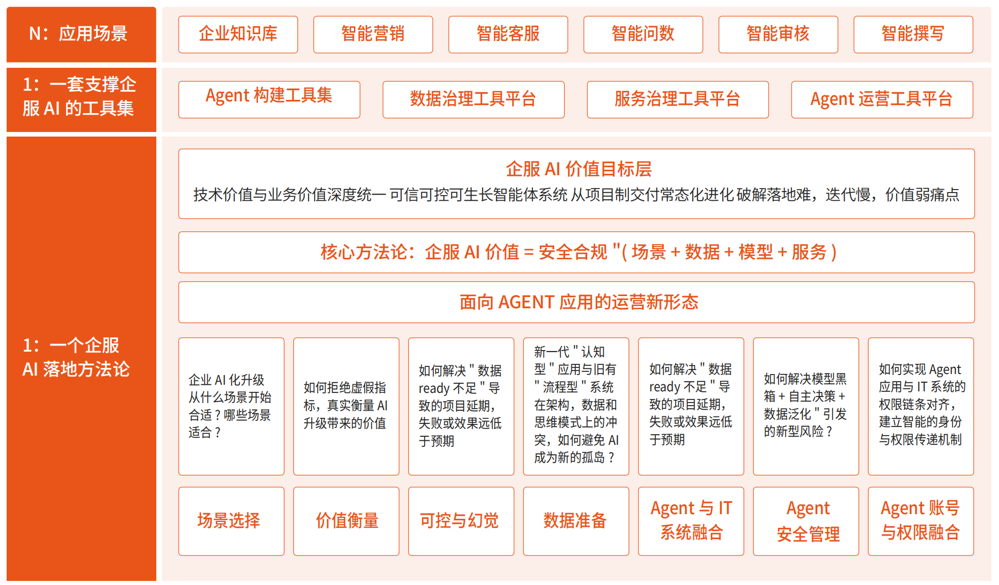
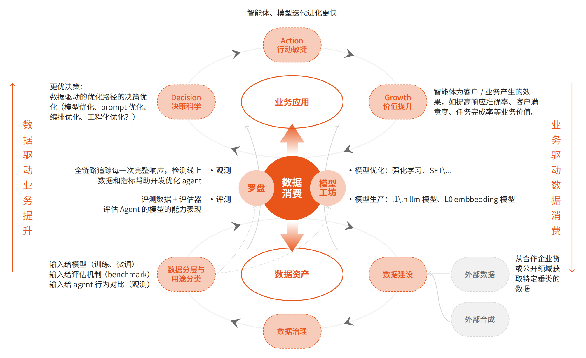
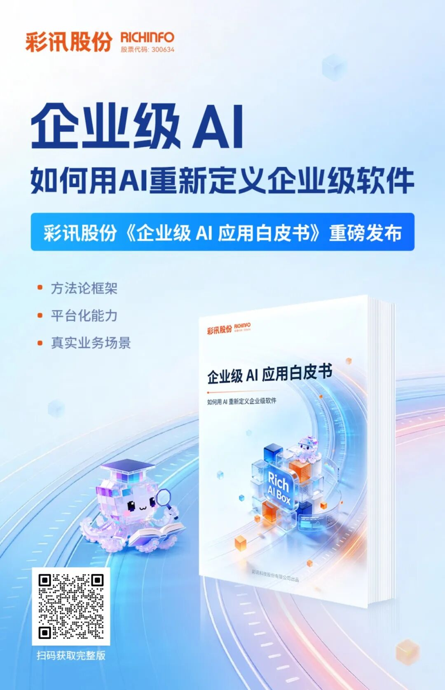

# 企服AI落地方法论：彩讯白皮书的框架与实践

## 一、问题的本质：为什么多数企业AI落地失败？

2026年初，中国企服AI整体处于"部署广、价值浅、头部引领、中小滞后"的规模探索期。一个尴尬的现实是：应用渗透率与价值转化率严重脱节，核心矛盾在于"技术供给"与"企业真实需求、数据基础、组织能力"的不匹配。

企业在实际应用中面临七大核心痛点：

1. **场景选择困难**——"拿着锤子找钉子"，不知从哪开始
2. **价值衡量模糊**——沉迷"虚荣指标"，无法证明ROI
3. **幻觉与失控**——AI"一本正经胡说八道"，决策风险高
4. **数据未就绪**——"有数据"不等于"数据可用"
5. **存量IT孤岛**——Agent与现有系统无法融合
6. **安全合规缺失**——数据泄露、权限越界成生存底线
7. **缺乏数据飞轮**——"一次性交付"思维，无法持续进化

这些问题的根源并非技术本身，而是缺乏一套系统化的方法论将AI能力转化为可持续的业务价值。

## 二、顶层设计：企服AI方法论框架

要解决上述问题，企业需要建立一套完整的顶层架构，将安全合规、场景选择、模型生产、数据治理、服务治理、存量IT融合六大关键环节串联起来。

> 图：彩讯企服AI顶层架构设计

其中一个最核心的方法论是：**企服AI价值 = 安全合规 × (场景 + 数据 + 模型 + 服务)**

这个公式的设计暗藏深意：
- **乘法关系的安全合规**：这是底线而非加分项。当安全合规为0时，无论其他要素多强，整体价值归零。这解释了为什么很多技术炫酷的AI项目最终被企业叫停——不是不够聪明，而是过不了合规关。
- **加法关系的四要素**：场景、数据、模型、服务之间是互补而非互斥的。场景不清晰可以用数据弥补，模型不够强可以用服务治理兜底。这给了企业"木桶不必等长"的灵活空间。
- **场景在前，模型在后**：刻意的排序暗示优先级。先问"解决什么问题"，再问"用什么模型"——这与很多企业"先买模型再找场景"的做法恰好相反。

### 2.1 场景优选：解决"做什么"的问题

场景选择的关键在于思维转变：从"我们能做多酷的技术"转向"我们必须解决多痛的问题"。

**三维评估模型**：

| 评估维度 | 关键指标 | 理想状态 | 风险区域 |
|---------|---------|---------|---------|
| 业务价值 | 频次、痛点程度、支付意愿 | 高频、刚需、有明确付费方 | 低频、锦上添花 |
| 数据就绪度 | 数字化程度、知识结构化率 | 数据已在线、有文档沉淀 | 数据在员工脑子里 |
| 容错空间 | Human-in-the-loop可行性 | 有人工审核环节、非实时交易 | 无人监管、核心资产交易 |

**场景分级建议**：

- **最佳场景**：业务流程清晰、数据就绪度高、业务价值高、容错空间大
- **较好场景**：数据有渠道可获取、业务价值清晰、容错空间较大
- **慎重场景**：数据不明确、业务价值不明确且容错空间小
- **避开场景**：业务混杂、数据多样结构不清晰、几乎没有容错空间

### 2.2 数据治理：解决"AI-Ready"的问题

数据治理不是一个纯技术动作，而是业务、数据、技术三方对齐认知的协作过程。核心是明确数据用途——给人用、给模型用、给系统用——不同用途对数据的要求截然不同。

**数据治理四阶段**：

**分层清洗策略**（针对PB级数据场景）：

1. **第一层：基础清洗**——格式统一、编码转换、完整性校验
2. **第二层：噪声清洗**——去除页眉页脚、广告、机器生成垃圾
3. **第三层：安全清洗**——PII脱敏、商业机密保护、合规检测
4. **第四层：语义清洗**——低质内容过滤、事实冲突检测、偏见均衡

这种"漏斗机制"相比一步到位，可大幅降低算力成本和高价值数据误杀率。

### 2.3 服务治理：解决Agent与存量IT集成的问题

AI Agent与存量IT系统融合的难题，本质上是新一代"认知型"应用与旧有"流程型"系统在架构、数据和思维模式上的冲突。

**核心方法**：语义连接 + 流程管控

1. **三层语义对齐**：
   - 用户意图层：建立多级意图分类体系
   - 接口描述层：构建标准化"技能卡片"
   - 字段含义层：参数名与业务术语映射

2. **四阶段流程管控**：
   - 意图识别：确保意图明确、无歧义
   - 流程规划：确保流程合规、高效（调用阈值建议≤10个接口）
   - 接口调用：确保调用精准、可控
   - 结果反馈：确保结果可用、可优化

**演进路径**：人工辅助 → 人机协同 → 智能自治

## 三、数据飞轮：从"一次性交付"到"持续进化"

企服AI的终极价值在于实现"持续进化"——AI应用随着业务数据积累、用户反馈沉淀，不断优化能力、提升价值。

> 图：彩讯企服AI数据飞轮——应用-数据-反馈-优化的正向循环

**飞轮四步闭环**：

1. **AI应用落地产生数据**：交互数据、业务数据、反馈数据
2. **数据治理激活数据价值**：清洗、标注、整合，转化为高质量训练数据
3. **反馈驱动模型与应用优化**：RAG技术、人机协同调优、模型微调
4. **优化后的AI创造更多价值与数据**：更强智能化能力 → 更多用户 → 更多数据

**驱动飞轮的三大保障**：

- **组织保障**：建立跨部门敏捷小组（业务+技术+数据+运营）
- **技术保障**：轻量化反馈管理平台、数据治理工具、模型迭代平台
- **机制保障**：激励用户反馈、将飞轮效果纳入管理层决策依据

## 四、结语

2026年的企业AI竞争，本质上是**AI能力转化为业务价值的效率之争**。

彩讯白皮书提供的方法论框架——从场景优选、数据治理、服务治理到数据飞轮——为企业提供了一条系统化、可落地的路径。其核心价值在于：**不是教你如何训练最强的模型，而是教你如何让AI在企业环境中真正跑起来、用起来、持续进化**。

当然，方法论不是万能药。企业在落地过程中仍需注意：

- **警惕"影子AI"**：近期OpenClaw等个人AI Agent工具的爆红提醒我们，员工可能在组织决策之前就已经在使用各类AI工具。与其简单封禁，不如纳入治理——摸清现状、建立基线、逐步规范。
- **平衡敏捷与可控**：完整的方法论闭环需要投入，中小企业可以选择性落地，先跑通核心场景再逐步完善。
- **安全是底线**：无论采用何种路径，把AI Agent当作"身份"而非"工具"来治理，是所有企业的必答题。

正如白皮书所言：我们需要做"大模型与企业业务之间的修桥人"。这座桥的地基，就是系统化的方法论与持续进化的能力。

### 获取完整白皮书

如需深入了解企服AI方法论的完整框架、工具集与落地案例，可扫码下载彩讯科技《企业级AI应用白皮书》完整版：

**参考资料**：

1. 彩讯科技《企业级AI应用白皮书》，2026年1月