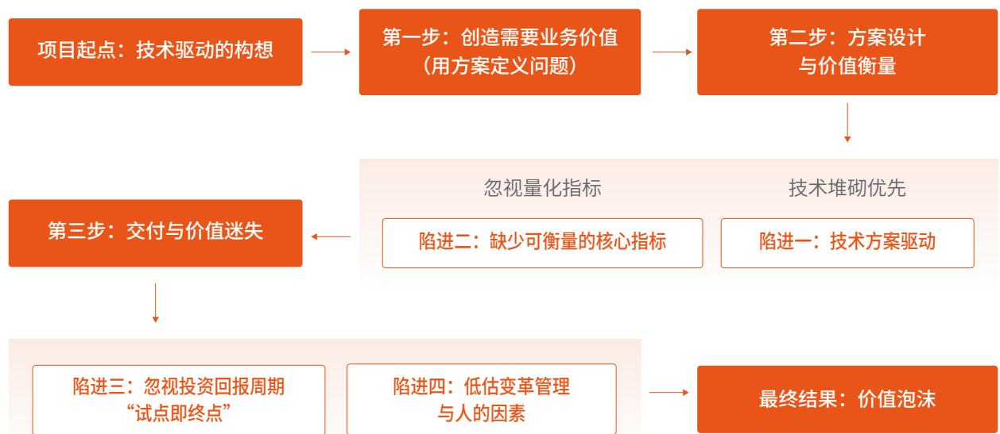
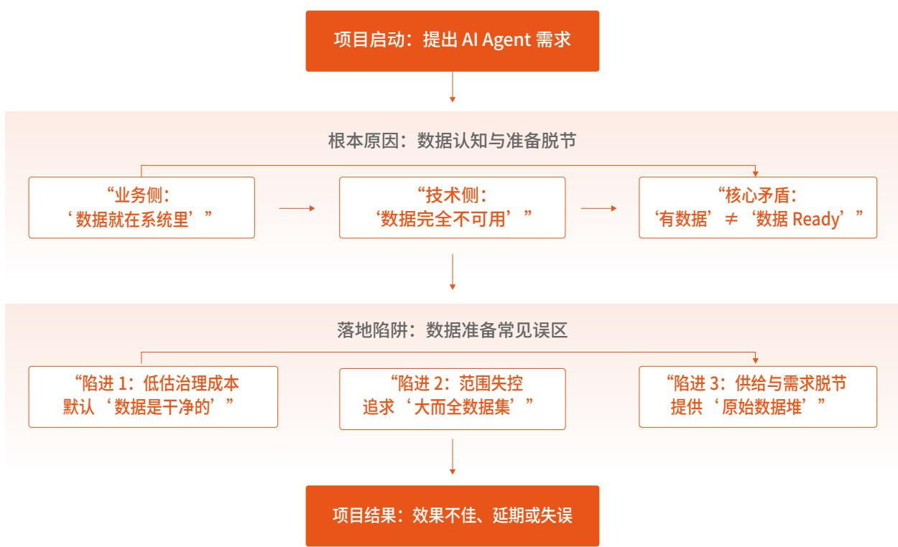
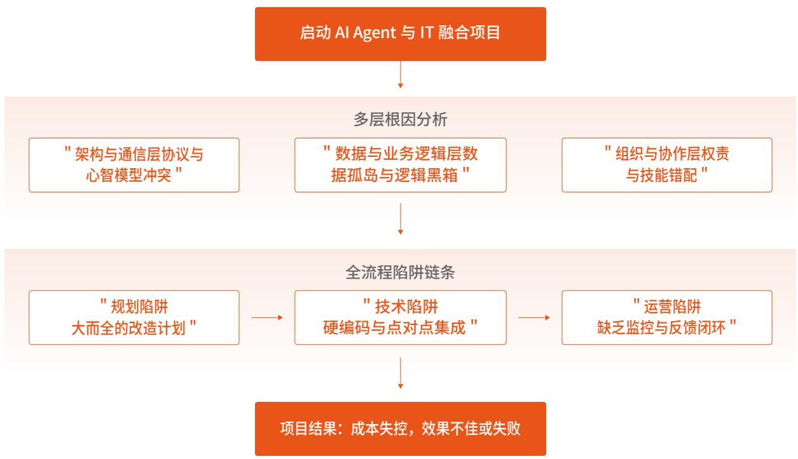
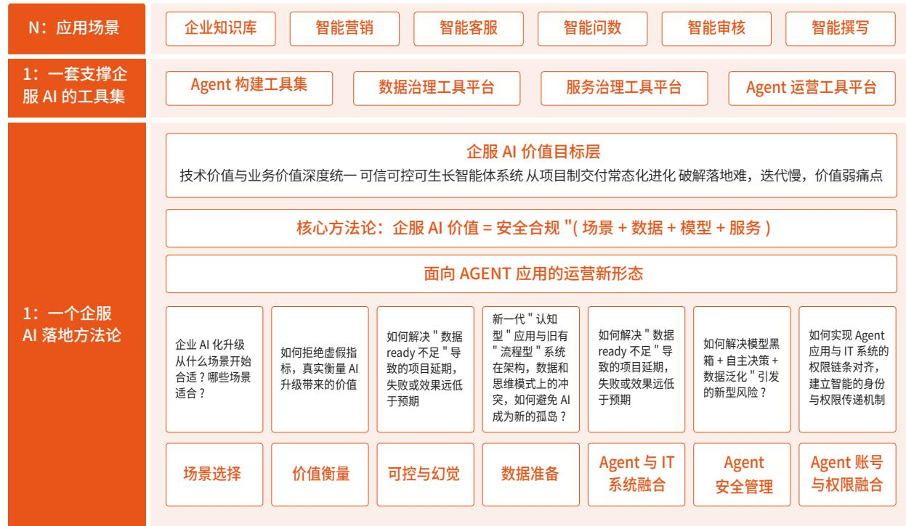
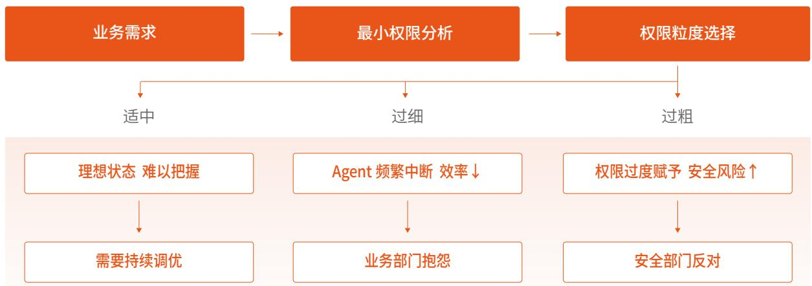
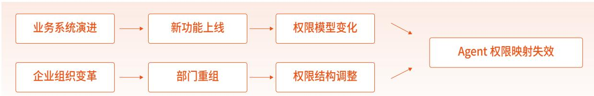
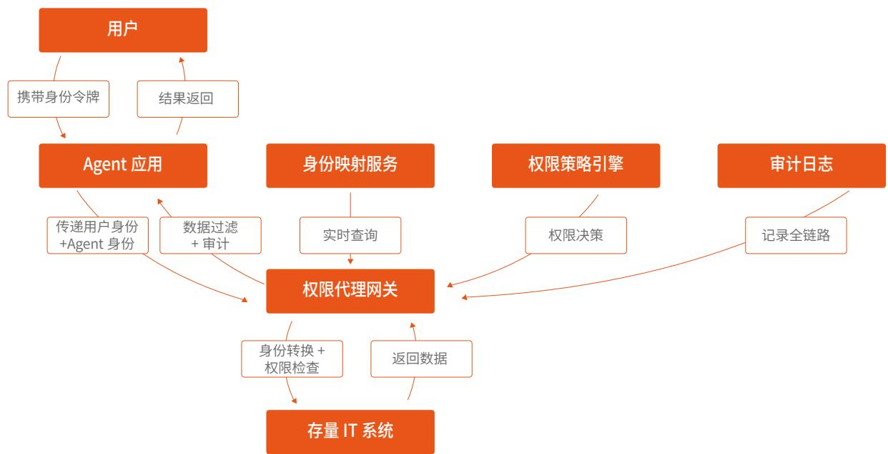
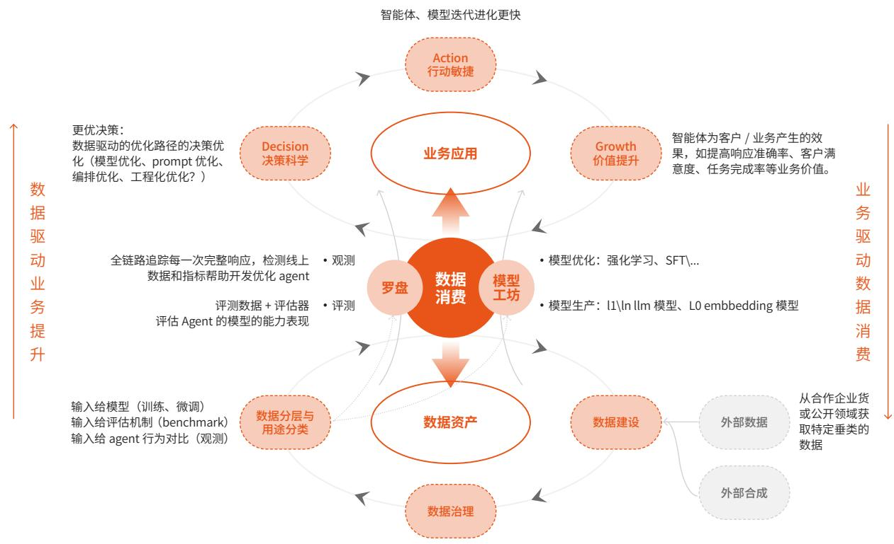
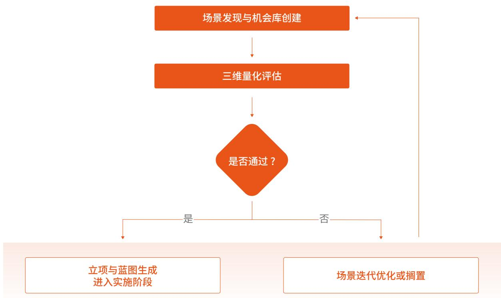

# 企业级 AI 应用白皮书

如何用AI 重新定义企业级软件

# 第一章 核心摘要 5

# 第二章 企服AI定义 7

2.1 企服 AI 核心定义与关键特征 8  
2.2 企服 AI 典型应用场景 8  
2.3 企业该如何去规划和定义自己的 AI 路径 9

# 第三章 中国企服 $\mathsf { A l }$ 的现状及挑战 11

3.1 企业在实际应用中却面临诸多挑战 12  
3.2 企服 AI 落地难主要问题 12  
3.3 彩讯企服 AI 方法论体系 13  
3.4 彩讯企服 AI 产品与工具集 15

# 第四章 企服 AI 的落地痛点分析 17

4.1 痛点一：场景选择——避免“拿着锤子找钉子” 18  
4.2 痛点二 ：价值衡量——拒绝“虚荣指标… 18  
4.3 痛点三 ：可控与幻觉——防止“一本正经胡说八道” 19  
4.4 痛点四 ：数据就绪（AI-Ready） 21  
4.5 痛点五 ：Agent 与存量 IT 融合——避免 AI 成为新的孤岛 22  
4.6 痛点六 ：安全与合规——企服 AI 的生存底线 24  
4.7 痛点七 ：LLMOps 运营缺失——难以形成数据“轮动”效应 26

# 第五章 企服 AI 方法论 29

5.1 企服 AI 方法论总述 30  
5.2 企服 AI 顶层架构设计… 30  
5.3 企服 AI 关键环节实施方案… 31  
5.4 结语：做企业 AI 落地的“修桥人 ” 61

# 第六章 企服 $\mathsf { A l }$ 产品与工具集 62

6.1 企服专项工具链 63  
6.2 开箱即用的场景化 AI 应用套件 72

# 第七章 企服 AI 发展展望 73

# 第一章

# 核心摘要

行业背景

彩讯主张

价值主线

行业背景：AI 从“炫技 ”进入“深水区 ”，企业面临场景难寻、价值难证、数据难通、业务难融等“最后一公里 ”挑战。

彩讯主张：提出“企服 AI ”战略，重新定义企业 AI 为“有感知的数字生命体 ”。主张“$1 + 1 + N$ ”的策略，通过一个企服 AI 方法论框架、一套支撑企服 AI 方法论的工具集、N 个企服 AI 沉淀的平台和产品，实现面向不同企业客户场景复杂的。

价值主线：从高频刚需场景切入，通过私域数据与模型的融合、业务流程与模型的融合、业务系统 / 工具与模型融合，构建可信、可控、可集成、可观测、可迭代的企业智能体（AIAgent）体系。

# 第二章

# 企服AI 定义

企服AI 核心定义与关键特征

企服AI 典型应用场景

企业该如何去规划和定义自己的AI路径

AI 的崛起是一场深刻的生产力革命。在这场变革中，不跟进AI 的企业，就如同工业革命时代停留在马车时代，错失的不仅是几个增长点，更是整整一个时代的发展机遇。

企服 AI（企业服务 AI/Enterprise AI），是面向企业级客户、以 AI 技术为核心，嵌入业务流程并提供合规可控，可集成，可度量价值的智能化解决方案总称，区别于面向 C 端的消费级 AI，核心是解决企业运营、管理、决策与服务的规模化效率与质量问题。

# 2.1 企服 AI 核心定义与关键特征

1.应用主体为企业级客户（大 / 中 / 小微企业）， 服务对象为组织而非个人，覆盖全企业生命周期需求。  
2.技术底座主要是 机器学习 / 大模型 / NLP / 计算机视觉 / IPA/RPA等，按需组合技术，不盲目追新，以解决业务问题为导向。  
3.核心目标是降本增效、合规风控、决策赋能、业务创新,强调可量化ROI,优先“速赢”场景(3-6个月见效）。  
4.关键特性是强治理 / 高安全 / 可集成 / 可解释 / 可运营，适配企业 IT 架构、数据合规与审计要求。  
5.应用形态主要是工具 / 平台 / 方案 / 智能体，从单点工具到全局智能，嵌入业务肌理而非孤立存在。

# 2.2 企服AI 典型应用场景

1.智能办公：文档自动化、会议纪要生成、流程审批、知识管理（企业知识库检索）。  
2.客户服务：智能客服、意图识别、工单自动分配、客户流失预测与挽回。  
3.运营管理：供应链优化、库存预测、产线质量检测、能耗智能调控。  
4.合规风控：财税自动申报、合同智能审查、知识产权监测、员工行为合规预警。  
5. 战略决策：市场洞察、竞品分析、融资匹配、政策红利捕捉。

# 2.3 企业该如何去规划和定义自己的AI路径

企服AI 不是一个技术也不是一个产品，而是平台/产品 $^ +$ 工具集 $^ +$ 方法论的汇聚，企服AI 的本质，是企业在新智能时代的一套“生存与发展 ”战略框架，它远非简单的技术采购，而是一次深刻的组织变革。

那么，企业应如何将这一战略框架落地为可执行的行动？关键在于构建一套清晰的实施体系，其核心包含以下几个层面：

# 2.3.1 从“技术驱动 ”到“价值驱动 ”的路径规划

企业规划AI路径，应始于业务诊断，而非技术选型。首先要回答“我们最大的业务痛点、效率瓶颈或增长机会在哪里？ ”以及“AI 是否是解决这些问题的最佳手段？ ”

路径规划应是动态和迭代的。它不是一份五年不变的计划，而是一个根据业务目标、技术成熟度和投资回报率 (ROI）持续调整的路线图。

# 2.3.2 企业AI转型需要一整套方法论 $^ +$ 工具集

方法论是“大脑”：包括AI成熟度评估模型（评估企业数据、技术、人才、流程的现状）、AI机会点图谱（识别各部门、各流程的AI应用场景）、MVP（最小可行产品）实践指南（快速验证、快速失败、快速学习）以及变革管理框架（如何推动员工接纳和使用AI）。

工具集是“ 四肢 ”：根据方法论筛选出的、最适合解决当前优先级问题的 AI技术、平台和API的集合。它可能是公有云AI服务、私有化部署的模型、或轻量的 SaaS 应用。

# 2.3.3 ROI 为王

强调“速赢 ”—— -优先选择那些在短期内（如3-6个月）能明显降本增效或提升收入的场景，用实际成果建立内部信心，获取持续投资。

量化价值：不仅关注直接的财务回报，也关注难以量化的运营效率（如审批时间缩短）、决策质量（如风险预测准确率提升）和员工体验（如减少重复劳动）的提升。

# 2.3.4 问题导向

坚持“场景大于模型 ”。不追求使用最前沿的大模型，而是寻找最能解决具体业务问题的技术，哪怕只是一个简单的规则引擎加上智能对话。

“赋能员工 ”是核心宗旨。AI 不应是取代人的神秘黑箱，而应是增强每个员工能力的“副驾驶 ”，让他们能处理更复杂、更有价值的工作。

# 2.3.5 企服AI 是一个持续学习和进化的“有机体 ”

它要求企业建立一种数据驱动反馈闭环机制。AI应用在使用中产生的数据和行为反馈，应能反过来用于优化和训练模型，使其越来越“懂”业务，形成越用越聪明的正向循环。

# 2.3.6 企服AI 是“业务与技术 ”的深度融合

它的成功依赖于业务专家与技术专家的紧密协作。企服AI方法论的核心仟务之一，就是搭建沟通的桥梁，确保技术方案精准地对焦业务需求，而不是“隔靴搔痒”。

# 第三章

# 中国企服AI 的现状及挑战

企业在实际应用中却面临诸多挑战

企服AI落地难主要问题

彩讯企服AI方法论体系

彩讯企服AI产品与工具集

AI技术已成为企业提升效率、创新产品及服务、增强核心竞争力的重要引擎。面对多变的市场环境和复杂的管理需求，企业亟需通过AI应用驱动业务升级，实现降本增效、智能决策和个性化服务。深入应用AI，是企业实现可持续发展的必经之路。

中国企服 AI 当前整体处于 “部署广、价值浅、头部引领、中小滞后 ”的规模探索期，应用渗透率与价值转化率严重脱节，核心矛盾是 “技术供给 ” 与 “企业真实需求、数据基础、组织能力 ” 的不匹配。

# 3.1 企业在实际应用中却面临诸多挑战

1.业务场景如何选择？：做 AI化升级从哪个场景开始切入即能避免风险，又能做出价值；  
2. AI 化升级带来的场景如何衡量？  
3. AI Agent 不可控和幻觉如何降低？  
4.私域数据如何与 AI 进行融合？  
5.业务系统与业务流程如何与AI进行融合？  
6.如何消除大模型应用带来的新的安全与隐私风险？  
7.智能体应用不可一蹴而就，如何稳步迭代升级？  
8. Agent 类应用带来的新的运营模式。

# 3.2企服AI落地难主要问题

当前，企服AI 的发展仍处于探索期，大部分企业尚未走通样板路径。主要问题体现在：

1.认知层面：管理层对AI的业务价值尚未形成共识；  
2.资源层面：面临数据、人才、算力三重困局；  
3. 融合层面：AI 模型、AI 工具孤立部署，未能与业务深度集成；  
4.安全层面：面临AI信任缺失、结果不可解释、过程不可观测难题、并且对隐私和权限带来了更大的挑战；

5. 发展层面：缺乏持续进化能力，通用解与特定需求存在矛盾，面临各业务线各自为战，缺乏数据共享、能力共享、服务共享的生态机制。

# 3.3 彩讯企服 AI 方法论体系

为应对企业服务领域AI落地中普遍存在的“场景难选、数据难用、能力难融、安全难控、价值难续”等核心挑战，彩讯基干大量实践，提炼并升华出一套系统化、可闭环的企服AI实施方法论体系。本体系旨在将前沿AI能力安全、合规、高效地转化为企业业务价值，其核心路径遵循 “场景甄别-能力注入-流程重构-权限治理-安全护航-敏捷进化” 的六阶模型。

# 3.3.1 价值驱动的场景甄别与目标锚定

AI建设始于精准的靶点选择。我们构建了三维评估模型，系统化筛选高价值、高可行性的AI场景：

1.业务价值维度：量化评估场景对降本、增效、增收、风控或用户体验提升的潜在贡献。  
2.数据就绪度维度：评估场景所需数据的可得性、质量、结构化程度及合规性，确保AI“有米下炊”。  
3.容错空间维度：根据业务关键性与错误容忍度，明确场景适用的AI技术路径（如追求精确的判别式AI或允许容错的生成式AI），合理设定建设目标与验收标准。

# 3.3.2 深度与时效兼顾的企业数据注入

企业私域数据是AI价值释放的核心燃料。我们依据数据特性和应用目标，将其分类并匹配合适的“注入”方式：

1.知识型数据（广谱）：如制度、手册、历史文档，主要通过RAG技术实现动态检索与增强，保证知识实时性与回答可追溯。  
2.生产型数据（专精）：如业务日志、私有代码、特定领域语料，通过模型后训练进行深度知识蒸馏，或利用长上下文窗口进行原位学习，让AI深刻掌握企业专属Know-How。

# 3.3.3 面向业务流程的智能体能力调度

突破 AI“对话机”局限，使其成为能动用企业全域数字化能力的“虚拟员工”。我们通过多层技术构建A的“手”和“脚”：

1. 服务化封装：通过 MCP 转换工具，将离散的业务系统 API 统一转换为模型可理解、可调用的标准化服务。  
2.流程化编排：通过Workflow引擎，将复杂的跨系统业务流程封装成原子工具或组合任务，供智能体按需调度执行。  
3.自动化延伸：通过智能触发器调度RPA流程，完成规则明确、界面固化的高频操作任务。  
4.协同化智能：通过多智能体调度框架，实现复杂场景下专业化智能体间的任务分解、协作与 决策，完成跨域、长链条业务。

# 3.3.4 无缝融合的企业身份与权限治理

确保 AI 在融入企业现有 IT 治理框架时不产生“权限孤岛”或“安全漏洞”。关键举措包括：

1.身份对齐：通过用户身份统一映射、统一服务ID与统一Agent ID机制，实现自然人、业务账号与AI智能体身份的三者合一与精准对应。  
2.权限复制与鉴权：通过用户权限复制与统一鉴权服务，使AI智能体在调用业务能力时，严格遵守与原业务系统一致的权限策略，实现“权限零越界”。

# 3.3.5 全链路可控的安全与隐私护航

构建覆盖输入、处理、输出全流程的“AI 可信屏障”，让企业用得放心：

1.敏感信息管控：通过敏感行为微调、敏感词过滤、敏感小模型实时识别三层防御，主动发现并拦截输入与交互中的敏感信息。  
2.内容安全防御：通过提示词防投毒检测与模型生成内容安全检测，抵御恶意诱导并确保输出内容合法、合规、符合价值观。  
3.隐私泄漏防护：通过隐私过敏训练提升模型对隐私的“自觉性”，结合输出前隐私过滤技术，双重保障客户数据、商业机密等敏感信息不外泄。

# 3.3.6敏捷集成与持续优化的价值闭环

将 AI 落地视为一个持续迭代、价值深化的过程。通过敏捷集成框架快速验证场景，并通过运营反馈、效果评估、数据回流、模型优化的闭环，驱动AI 应用与业务目标持续对齐、性能与价值不断提升。

# 3.4 彩讯企服 AI 产品与工具集

上述方法论的有效践行，依赖于一套坚实、灵活、自动化的产品与工具支撑。彩讯沉淀的企服AI 产品与工具集，正是方法论各核心环节的工程化映射，确保从战略到执行的平滑落地。

# 3.4.1 核心平台基座：AIBox一体化平台

作为企业 AI 能力的“操作系统”，AIBox 平台提供全生命周期管理：

1.企业级Agent构建平台：提供低代码/无代码的智能体定义、能力编排、记忆与知识库配置环境，是方法论中“智能体能力调度”的核心承载。  
2. Agent互联互通平台：实现智能体间的标准化通信、任务协同与联邦学习，支撑“多智能体调度”的复杂协作场景。  
3. Agent运营与迭代优化平台：提供智能体效果监控、对话分析、AB测试、数据标注与回流管理，是“敏捷集成与持续优化”闭环的关键工具。  
4.训推一体化平台：集成从数据预处理、模型精调、评估到服务化部署的全流程，高效支撑“企业数据注入”中的模型后训练需求。

# 3.4.2 专项工具链：匹配实施路径的关键支撑

围绕方法论六阶模型，我们提供覆盖全程的专项工具集：

1.场景选择与评估工具集：内置三维评估模型，通过场景挖掘、智能调研、数据探查、模拟推演等功能，辅助科学完成“价值驱动的场景甄别”。  
2.数据治理与注入工具集：提供数据分类、清洗、向量化、知识库管理及RAG管道配置工具，专用于“企业数据注入”环节的准备与实施。  
3.服务与流程治理工具集：包含API扫描与MCP转换器、Workflow可视化编排器、RPA触发器配置工具，是实现“业务流程智能体化”的工程基础。  
4.账号与权限治理工具集：提供身份映射配置、权限同步与审计、统一鉴权网关，确保“身份与权限治理”策略的自动化实施。

5. 全链路安全管理工具集：集成敏感词库管理、内容安全过滤引擎、隐私脱敏组件及审计日志系统，是构建“安全与隐私护航”体系的技术组件。

# 3.4.3 开箱即用的场景化 AI 应用套件

基于通用平台与工具，我们预置了经过行业验证的场景化 AI 应用套件，加速价值兑现，如：

1.企业知识中枢：融合多源知识，提供智能问答、知识推荐与创作辅助。  
2.智能客户服务：实现全天候、精准的智能接待、工单处理与销售导购。  
3. 智能营销助手：提供客户洞察、个性化内容生成与营销活动自动化。  
4. AI增强型BI：通过自然语言交互实现数据查询、分析与报告生成，降低数据使用门槛。

总结而言，彩讯的企服AI产品与工具集，并非孤立的功能堆砌，而是严格遵循“方法论驱动”原则设计的有机整体。每一款工具都针对方法论中的特定挑战与环节，确保企业能够体系化、工程化地推进AI落地，最终实现AI能力与业务流程的深度、安全、可持续融合。

# 第四章

# 企服AI 的落地痛点分析

痛点一：场景选择—— 避免“拿着锤子找钉子”

痛点二：价值衡量—— 拒绝“虚荣指标”

痛点三：可控与幻觉——防止“一本正经胡说八道”

痛点四：数据就绪（AI-Ready）

痛点五：Agent 与存量 IT 融合—— 避免 AI 成为新的孤岛

痛点六：安全与合规—— 企服 AI 的生存底线

痛点七：LLMOps 运营缺失—— 难以形成数据“轮动”效应

# 4.1 痛点一：场景选择——避免“拿着锤子找钉子”

# 4.1.1 根因分析

大多数企业在选择 AI 场景时，往往陷入两个极端：

1.好高骛远：直接选择核心交易系统（如银行的核心账务），容错率极低，一旦AI幻觉导致出错，后果灾难性。  
2. 隔靴搔痒：选择极低频的边缘场景（如年会海报生成），虽然安全但无法产生规模化业务价值。

# 4.1.2 常见陷阱

1. 想做 AI 但不知道做什么。  
2. 有明确需求，但不知道做了有什么用。  
3.有明确需求，也有明确ROI，但是容错空间小，对AI要求极高。

# 4.2 痛点二：价值衡量——拒绝“虚荣指标”

# 4.2.1 根因分析

团队过于关注技术本身，而非解决真正的商业问题。下图揭示了从“技术迷恋”到“价值泡沫”的常见陷阱路径：

# 4.2.2 常见陷阱

<table><tr><td>陷阱</td><td>具体表现与常见说法</td><td>潜在后果</td><td>一个关键的诊断问题</td></tr><tr><td>1.创造虚假的业务价值</td><td>“我们用Agent做智能客服，很先进。”
“行业都在做，我们不能落后。”</td><td>解决方案与真实痛点脱节，无人使用，沦为摆设。</td><td>“我们到底在解决哪个具体用户的哪个具体痛点？这个痛点现在是如何解决的？成本或损失有多大？”</td></tr><tr><td>2.技术方案驱动，而非问题驱动</td><td>“我们想试试大模型的XX功能。”
“用最先进的框架和Agent架构。”</td><td>技术复杂，维护成本高，但业务收益模糊，ROI为负。</td><td>“如果不使用Agent技术，这个问题能否解决？使用Agent后，体验或效率的本质提升是什么？”</td></tr><tr><td>3.缺少可衡量的核心指标</td><td>“提升客户体验。”
“让运营更智能。”</td><td>项目成功与否无法评判，无法争取后续资源，很快被搁置。</td><td>“项目上线后，我们第一时间要看哪1-3个数据指标？它们如何与业务KPI（如收入、成本、满意度）挂钩？”</td></tr><tr><td>4.忽视投资回报周期</td><td>“先做个试点看看效果。”
“这是长期战略投入。”</td><td>试点结束即项目终点，无法规模化，价值停留在PPT上。</td><td>“这个试点成功的明确标准是什么？如果成功，规模化推广的路径和成本预算是多少？”</td></tr><tr><td>5.低估变革管理与人的因素</td><td>“工具很好，业务部门自然会用。”
“培训一下就行。”</td><td>业务人员抵制，流程无法跑通，工具被绕过，实际使用率为零。</td><td>“这个Agent将改变哪个岗位的工作流程？我们如何激励他们接受并帮助优化这个新工具？”</td></tr></table>

# 4.3 痛点三：可控与幻觉—— 防止“一本正经胡说八道”

# 4.3.1 根因分析

大模型本质是“文字接龙”的概率预测，它并不理解真理，只理解概率。在企业级应用中，“创造力”往往等于“不可控”。

# 1. 不可控

# 1）原因分析

a.模型黑盒与指令遵循的脆弱性  
b.复杂工具调用链的不确定性  
c.自主规划的不可预测性

# 2）解释与影响

a.大模型的响应基于概率生成，对复杂、多步指令的理解易出现偏差。   
b. Agent调用外部API时，依赖模型对工具描述的理解，任何歧义都可能导致调用错误或进入死循环。  
c. Agent的动态规划（ReAct等模式）如同让AI“自己写代码执行”，其推理路径难以事先完全约束。

# 2. 幻觉

1）原因分析：

a.本质是“知识边界”与“捏造”   
b.信源污染与缺失   
c.思维链中的错误积累

2）解释与影响：

a. 大模型倾向于生成“流畅合理”的文本，而非“绝对真实”的文本。当缺乏相关知识时，会无意识地编造。  
b. 如果提供给 Agent 的参考文档本身有误或信息不足，其生成也会基于错误或进行补全性编造。  
c.在多步推理中，前序步骤的一个小幻觉会被逐步放大，导致最终结论严重偏离事实。

# 4.3.2 常见陷阱

# 1. 认知陷阱

1) 表现：

a. “过度拟人化信任”：误认为 Agent 具备人类的理解与责任意识。  
b. “提示词万能论”：认为通过精妙的提示词就能 $1 0 0 \%$ 解决可控与幻觉问题。

2) 潜在后果 :

a. 将关键决策权过早、过大地交给Agent，引发业务风险（人机协作/人机共生 human in theloop）。  
b. 忽视架构和流程层面的根本设计，导致系统脆弱不堪。

# 2. 技术陷阱

1) 表现：

a. “用LLM监督LLM”闭环：仅用另一个大模型来检查和纠正当前Agent的输出，缺乏事实锚点。  
b. “无限自主”设计：赋予Agent过高自主权，未设置清晰边界、审批节点和熔断机制。

2) 潜在后果 :

a.可能让错误在系统内部循环传递并“自我合理化”，无法根除幻觉。  
b.一旦出错，影响范围会迅速扩大，难以干预和追溯。

# 3.流程管理陷阱

# 1)表现：

a.“以偏概全的评估”：仅用少量、简单的测试用例验证通过，就认为问题已解决。  
b.“忽视数据飞轮”：上线后不系统收集错误案例，缺失持续优化迭代的闭环。

# 2)潜在后果

a. 在复杂、长尾的真实场景中，问题会大规模暴露，导致项目失败。  
b.系统能力停滞不前，无法适应业务变化，效果逐渐下降。

# 4.4 痛点四：数据就绪（AI-Ready）

# 4.4.1 根因分析：为什么“有数据”不等于“数据 Ready”？

在企业级 AI Agent 落地过程中，“数据Ready 不足”是导致项目延期、失败或效果远低于预期的核心瓶颈。这通常不是技术问题，而是组织、管理和认知的综合性问题。

<table><tr><td>根因类别</td><td>具体表现与深层原因</td></tr><tr><td>认知脱节</td><td>业务方认为:“数据都在系统里,导出来就行”。技术方清楚:系统里的数据是为流程记录,而非为AI训练/推理设计的,存在碎片化、口径不一致、大量隐含知识等问题。双方对“Ready”的标准有巨大鸿沟。</td></tr><tr><td>治理缺失</td><td>企业缺乏统一的数据治理体系(如主数据管理、数据质量标准),导致数据:1. 不一致:同一客户在CRM、订单系统的ID和名称不统一。2. 不完整:关键字段(如商品分类、客户行业)大量缺失或为“其他”。3. 不准确:存在过期、错误或测试用的脏数据。</td></tr><tr><td>供给低效</td><td>数据以“原始数据堆”形式提供(如直接开放数据库视图或大量Excel),而非针对Agent任务优化的“认知产品”。Agent需要的是结构化、带语义、任务相关的数据切片,而非所有数据。</td></tr><tr><td>安全与合规壁垒</td><td>因隐私、商业机密等顾虑,数据部门不敢或不能提供所需数据。缺乏有效的数据脱敏、权限管控和审计技术保障,导致流程卡死。</td></tr></table>

# 4.3.2常见陷阱

<table><tr><td>陷阱</td><td>错误做法</td><td>可能导致的结果</td></tr><tr><td>陷阱1:低估治理成本</td><td>“认为数据清洗、对齐是“简单预处理”,未分配专门资源和时间。</td><td>项目80%时间陷在数据泥潭,业务人员因清洗工作枯燥而放弃,或为赶进度使用脏数据,导致Agent表现差。</td></tr><tr><td>陷阱2:范围失控</td><td>追求“大而全”的数据集,希望一次性把所有历史数据、所有字段都准备好。</td><td>数据工程复杂度呈指数级增长,项目长期无法交付,失去业务价值窗口期。</td></tr><tr><td>陷阱3:供给与需求脱节</td><td>数据团队仅提供原始数据,不参与理解Agent的具体任务(如需要什么上下文、以什么格式输入最好)。</td><td>Agent接收到的信息噪声过大,效果不佳,而技术团队和业务团队互相指责。</td></tr><tr><td>陷阱4:忽视数据闭环</td><td>仅关注启动时的初始数据,未设计上线后如何收集用户反馈、错误日志来持续优化数据。</td><td>Agent能力停滞不前,无法适应业务变化,效果逐渐下降。</td></tr></table>

# 4.5 痛点五：Agent 与存量 IT 融合—— 避免 AI 成为新的孤岛

# 4.5.1 根因分析

AI Agent 与存量 IT 系统融合的难题，本质上是新一代“认知型”应用与旧有“流程型”系统在架构、数据和思维模式上的冲突。这是一项集成工程、组织变革和架构演进的综合挑战。

<table><tr><td>层面</td><td>核心根因</td><td>具体表现与影响</td></tr><tr><td>架构与通信层</td><td>1.协议与大模型冲突2.存量系统“不可侵入”</td><td>Agent遵循API优先、事件驱动的现代AI原生思维,而存量系统(如ERP、CRM)多是单体架构、数据库驱动,通过封闭的GUI或复杂私有协议交互。核心系统极其稳定,供应商不允许或企业不敢进行深度改造(如直接写库、修改核心逻辑),导致Agent只能“在玻璃窗外操作”。</td></tr><tr><td>数据与业务逻辑层</td><td>1.数据孤岛与口径不一2.业务逻辑黑箱化</td><td>数据分散在各系统,且同一实体(如“客户”)的ID、状态定义不一致。Agent需要跨系统拼接“事实”,难度巨大。关键业务规则(如“审批逻辑”)以代码形式深埋旧系统,无法被Agent直接理解和调用,形成“认知断层”。</td></tr><tr><td>业务逻辑层</td><td>黑箱化</td><td>关键业务规则(如“审批逻辑”)以代码形式深埋旧系统,解和调用,形成“认知断层”。</td></tr><tr><td>组织与协作层</td><td>1.权责与KPI割裂2.技能断层</td><td>存量系统由传统IT部门运维,追求稳定、安全、少变更;AI Agent项目由创新部门推进,追求敏捷、试错、快速迭代。双方目标与考核机制天然冲突。传统IT人员熟悉Java、数据库,但对大模型、API编排不熟;AI团队懂模型,却不懂复杂的业务后台逻辑。缺乏“双语”人才桥梁。</td></tr></table>

# 4.5.2 常见陷阱

<table><tr><td>陷阱阶段</td><td>错误做法</td><td>后果</td></tr><tr><td>规划陷阱</td><td>“大而全的改造计划”：试图一次性让 Agent打通所有核心系统，重构企业IT架构。</td><td>项目复杂度和风险呈指数级上升，引发传统IT部门的强烈抵触，长期无法交付。</td></tr><tr><td>技术陷阱</td><td>“硬编码”与“点对点集成”：为快速验证，将特定系统的API调用、账号密码直接写死在Agent代码中。</td><td>集成脆弱不堪，任何后端系统的微小升级都会导致Agent失效；形成蜘蛛网式集成，难以维护和扩展。</td></tr><tr><td>设计陷阱</td><td>“Agent万能适配器”：上线后缺乏对Agent与系统间交互的专门监控和异常处理机制。</td><td>Agent逻辑变得极其臃肿和脆弱，核心认知能力被淹没在大量的适配代码中。</td></tr><tr><td>运营陷阱</td><td>“重部署、轻监控”：上线后缺乏对Agent与系统间交互的专门监控和异常处理机制。</td><td>当Agent执行错误操作（如误删订单、重复提交）时，无法及时发现和追溯，造成业务损失和信任危机。</td></tr></table>

# 4.6 痛点六：安全与合规—— 企服 AI 的生存底线

企服 AI 的安全问题集中在数据、模型、算法、运营与供应链五大环节，核心是 “模型黑箱 $^ +$ 自主决策 $^ +$ 数据泛化” 引发的新型风险，与传统 IT系统 “边界清晰、逻辑可控” 的安全逻辑存在本质区别，根源在于技术特性、风险载体与防御逻辑的差异以及 AI 的不确定性与企业 IT /数据 / 治理体系不匹配。

我们将企服 AI 的核心安全问题与成因归纳为以下几个方面：

# 4.6.1 数据安全：泄露与合规双重失控

# 1. 典型问题

数据孤岛、过度采集、跨境传输违规、敏感信息未脱敏、影子 AI导致数据外泄。

# 2. 成因

1）治理缺位：仅 $2 1 \%$ 企业建立 AI 专属数据分类保护体系，跨部门数据打通率＜40%，非结构化数据治理成本高。  
2）权限滥用：AI 需跨系统访问海量数据，最小权限原则执行难，员工用公有大模型处理机密致泄露（如三星代码泄露）。

3）合规滞后：数据跨境未走安全评估，违反《数据出境安全评估办法》，处罚可达年营收 $5 \text{‰}$

# 4.6.2 模型安全：新型攻击与输出失控

# 1. 典型问题

1）输入层：提示词注入、越狱、间接诱导（如伪装成学术研究生成危险内容）。  
2）模型层：后门植入、参数窃取、模型反转攻击（通过输出反推训练数据）。  
3）输出层：幻觉、偏见、深度合成未标识、权限越界（如智能运维 Agent 被诱导执行恶意代码）。

# 2. 成因

1）技术特性：大模型黑箱化，决策逻辑不可解释，传统规则过滤失效。  
2） 部署粗放：近 $9 0 \%$ 私有化服务器 “裸奔”，开源框架默认公网访问，无密码保护。  
3） 权限设计缺陷：沙箱隔离不足，多智能体协同通信协议（如 MCP）存在暴露面。

# 4.6.3 算法安全：公平性与可解释性缺失

# 1. 典型问题

算法偏见（如招聘 AI 歧视女性）、黑箱决策（金融拒贷无依据）、合规举证难。

# 2. 成因

1）数据偏差：训练数据含历史歧视信息，模型学习后放大偏见。  
2）技术短板：深度学习模型可解释性差，LIME 等工具落地难，合规检测通过率低。  
3）治理空白：仅 $1 1 . 7 2 \%$ 企业建立完善 AI 治理制度，算法备案与动态修正机制缺失。

# 4.6.4 运营与供应链安全：全链路风险传导

# 1. 典型问题

第三方 API / 模型合规失控、开源组件后门、日志不全导致追溯难。

# 2. 成因

1）供应链管控弱：供应商数据侵权致企业连带追责，开源插件未审计引入漏洞。   
2）运维缺陷：日志留存不足6个月，风险事件闭环超24小时， $4 7 . 2 \%$ 企业未配置AI安全控制。  
3）意识不足： $3 9 . 5 \%$ 企业处于早期风险评估阶段， $2 4 \%$ 意识到风险却无行动。

# 4.7 痛点七：LLMOps 运营缺失—— 难以形成数据“轮动”效应

AI 应用数据飞轮的核心是应用 - 数据 - 反馈 - 优化的业务闭环，而非模型生产本身；当前问题集中在反馈链路断裂、业务 - 数据协同失效、价值转化滞后、治理与合规约束四大环节，根源是业务场景适配不足、反馈机制缺失、组织与机制不配套，导致 “用起来的数据” 无法反哺应用持续进化。

目前主要会存在以下问题：

# 4.7.1 反馈链路：采集 - 转化 - 回流全流程 “断点”

# 1. 突出问题

应用侧反馈数据 “采不到、转不动、回不去”，无法形成有效反哺闭环。

1）采集缺失：应用交互数据（如客服对话差评、审批驳回理由）分散在不同系统，缺乏埋点设计，关键反馈漏采；用户反馈多为非结构化文本 / 语音，难以自动捕获。  
2）转化低效：反馈数据缺乏业务标签（如 “价格异议”“流程繁琐”），无法映射到应用功能 / 模型参数；人工标注成本高、周期长，反馈时效性差。  
3） 回流断裂：反馈数据与应用迭代流程脱节，如客服 AI 的话术优化需求无法快速同步到知识库，导致 “反馈了但没用”。

# 2. 根本原因

1） 应用设计重交付轻反馈：AI 应用多按 “项目制” 交付，未预留反馈采集接口与埋点，交互数据未纳入需求文档，反馈机制成 “后加项”。  
2） 工具链缺位：缺乏低代码反馈管理平台，业务人员无法自主定义反馈指标、快速标注数据；MLOps 仅覆盖模型生产，未打通应用侧反馈 - 优化链路。  
3）语义鸿沟：技术团队不懂业务场景术语，无法将用户反馈转化为可执行的优化动作，导致反馈 “空转”。

# 4.7.2 业务协同：应用与一线业务 “脱节”，反馈动力不足

# 1. 突出问题

业务端不愿用、不愿反馈，飞轮失去 “人力驱动” 的关键动能。

1)应用价值感知弱:AI应用解决的不是一线真痛点(如仅优化报表生成,未解决客户流失预警),用户缺乏主动反馈意愿。

2）反馈成本高：反馈流程繁琐（如需填多字段表单），占用业务时间，一线员工抵触。  
3）优化见效慢：反馈提交后长期无响应，或优化后效果未量化，打击反馈积极性。

# 2. 根本原因

1） 价值锚点错位：AI 应用立项以技术指标（如模型准确率）为导向，而非业务指标（如转化率、效率提升），导致 “用了但没用好”。  
2） 组织角色缺失：无 “数据 BP”“应用运营” 等中间角色，负责收集一线反馈、推动应用优化，业务与技术 “两张皮”。  
3） 激励机制缺位：未将反馈贡献纳入 KPI，如客服反馈有效问题无奖励，员工缺乏动力参与闭环。

# 4.7.3应用迭代: “一次性交付” 思维，缺乏持续优化机制

# 1. 突出问题

AI 应用上线后进入 “维护期”，而非 “进化期”，反馈无法驱动应用迭代。

1）迭代周期长：应用更新依赖版本发布，反馈到优化的周期以月为单位，无法应对业务快速变化。  
2)优化无章法：反馈数据缺乏优先级排序，如同时处理“界面卡顿”与“算法错误”，资源分散，核心问题解决慢。  
3）模型 - 应用脱节：模型优化未同步到应用功能，如推荐算法准确率提升，但前端展示逻辑未改，用户体验无改善。

# 2. 根本原因

1）项目制思维固化：管理层将AI应用视为“一次性投入”，上线后削减运维预算，缺乏持续迭代资金。  
2）迭代流程僵化：沿用传统软件“需求-开发-测试-上线”流程，未建立“反馈-评估-快速迭代”的敏捷机制。  
3）指标体系缺失：未建立“反馈量-优化量-业务价值”的量化链路，无法证明反馈反哺的ROI，影响管理层决策。

# 4.7.4 数据治理：反馈数据质量差，反哺效果 “打折扣”

# 1. 突出问题

反馈数据存在噪声、重复、矛盾，导致应用优化方向错误，甚至反向 “拉低” 效果。

1） 噪声数据：恶意反馈、误操作反馈（如点错差评按钮）混入数据，误导优化（如调整正确话术）。  
2） 重复反馈：同一问题被多人多次提交，未去重，浪费迭代资源。  
3） 口径不一：不同部门对同一反馈的定义不同（如 “服务差” 在销售端指响应慢，在客服端指态度差），无法形成统一优化方向。

# 2. 根本原因

1）治理聚焦生产侧：数据治理仅覆盖训练数据，未延伸到应用侧反馈数据，缺乏清洗、去重、标注的常态化机制。  
2）标准缺失：无统一的反馈数据元数据规范，指标口径未对齐，导致反馈数据 “不可信、不可比”。  
3） 自动化不足：缺乏 AI 辅助的反馈数据清洗工具（如通过 NLP 识别恶意反馈），依赖人工筛查，效率低、易出错。

# 4.7.5 安全合规：反馈数据流动的 “合规枷锁”

# 1. 突出问题

反馈数据含敏感信息（如客户手机号、合同金额），采集与使用面临法律风险，限制反哺范围。

1）采集受限：用户隐私保护要求严格，埋点采集交互数据需用户授权，导致部分关键反馈无法获取。  
2）脱敏过度：敏感数据脱敏后丢失业务价值（如隐去客户行业信息，无法优化行业专属话术）。  
3）跨境流动难：跨国企业的区域反馈数据无法汇总，影响全球应用统一优化。

# 2. 根本原因

1）合规与业务平衡失当：企业缺乏“隐私计算 $^ +$ 匿名化”技术，无法在合规前提下保留反馈数据的业务价值。  
2）治理滞后：数据安全策略未随应用迭代更新，反馈数据的权限管理、审计流程缺失，易引发合规风险。  
3）成本约束：中小企业无力投入合规技术，只能放弃部分反馈数据，导致飞轮 “燃料不足”。

# 第五章

# 企服 AI 方法论

企服 AI 方法论总述

企服 AI 顶层架构设计

企服 AI 关键环节实施方案

结语：做企业 AI 落地的“修桥人 ”

# 5.1 企服 AI 方法论总述

在数字化浪潮与AI技术飞速演进的双重驱动下，企业服务领域正经历从“工具赋能”到“能力重塑”的根本性变革。AI不再是孤立的技术外挂，而是深度嵌入业务全流程、激活数据资产价值、重构服务模式的核心引擎。然而，企服AI的落地绝非单一技术的堆砌，而是涉及安全合规、场景适配、模型迭代、数据治理、服务治理与存量融合的系统性工程。

作为深耕企服 AI 领域的实践者，我们立足很多行业的落地经验，提出“企服 AI 价值” $\boldsymbol { \cdot }$ 安全合规 *（场景 $^ +$ 数据 $^ +$ 模型 $^ +$ 服务）顶层方法论，串联安全合规、场景选择、模型生产、数据治理、服务治理、存量IT融合六大关键环节，破解“落地难、迭代慢、价值弱”的行业痛点，推动企服 AI 从“项目制交付”走向“常态化进化”，实现技术价值与业务价值的深度统一。该方法论并非简单的软件堆栈，而是一套企业私域数据与模型融合、业务场景与模型融合、IT系统与模型融合的有机生态，旨在为企业构建一个可信、可控、可生长的智能体系统。核心包含六大要素：场景选择、数据治理、服务治理、账号与权限管理，安全管理以及数据飞轮。这六大支柱共同构成了一个稳定、可控且能够持续优化的AI应用框架，是确保AI在企业环境中发挥最大价值、同时将风险降至最低的关键所在。

本方法论的核心逻辑的是：以安全合规筑牢AI应用的信任根基，以高价值场景锚定AI落地的价值方向，以模型生产与数据治理构建 AI 能力的核心底座，以服务治理保障 AI 应用的持续可用，以存量 IT 融合打破数据与权限壁垒，最终通过数据飞轮实现“应用-数据-反馈-优化”。

# 5.2 企服 AI 顶层架构设计

# 5.3 企服 AI 关键环节实施方案

# 5.3.1 场景优选：解决做什么、价值衡量问题

# 5.3.1.1 场景选择

场景选择的关键在于思维的转变:从“我们能做多酷的技术”转向“我们必须解决多痛的问题”成功的 B 端 Agent 项目，起点永远是一个清晰的、可货币化的业务问题。

选择那些 AI 能力强于人类、且人类验证成本低的场景。

1.最佳场景：网络没限制、算力没限制、业务流程清晰、数据就绪度高、业务价值高、容错空间大。  
2.较好场景：业务流程清晰、数据有渠道可获取、业务价值清晰、容错空间较大。  
3.慎重场景：业务流程清晰、数据不明确、业务价值不明确且容错空间小或者业务价值高但无容错空间。  
4.避开场景：业务混杂、数据多样结构不清晰、业务价值说不清楚、几乎没有容错空间。

# 5.3.1.2 场景评估框架

<table><tr><td>评估维度</td><td>关键指标</td><td>理想状态</td><td>风险区域</td></tr><tr><td>业务价值</td><td>频次、痛点程度、支付意愿</td><td>高频、刚需、有明确付费方</td><td>低频、锦上添花</td></tr><tr><td>数据就绪度</td><td>数字化程度、知识结构化率</td><td>数据已在线、有文档沉淀</td><td>数据在员工脑子里或纸质文档</td></tr><tr><td>容错空间</td><td>Human-in-the-loop可行性</td><td>有人工审核环节、非实时交易</td><td>无人监管、核心资产交易</td></tr></table>

# 5.3.1.3 如何发现场景价值

# 1. 行动框架

1）从“问题发现”开始：与一线业务人员深度访谈，量化痛点成本。  
2）定义“价值假说”：在启动前书面明确：“通过[Agent功能]，可以为[目标用户]解决[某个问题 ]，从而带来 [ 可量化的业务指标 ] 提升。”  
3）设计MVP与核心度量：针对价值假说，设计最小可行产品，并确定1-3个核心北极星指标（如“销售有效线索量提升 $2 0 \% ^ { \prime \prime }$ ”）。  
4）规划规模化路径：在试点前就想清楚：试点成功后的推广步骤、所需资源及预期的投资回报周期。

5）将“变革管理”作为项目组成部分：将业务部门的采纳率和满意度设为项目 KPI，并安排专人负责培训和支持。

# 2.问题反思

1）问题相关性：我们解决的问题是来自业务部门的正式需求，还是技术团队的设想？  
2）价值量化：成功指标能否直接在财务报表或业务报表中体现？  
3）替代方案：是否有更简单、便宜的非AI方案可以达到 $7 0 \%$ 的效果？  
4）用户接纳：核心用户是否参与了方案设计？他们是否有动力使用？  
5）退出机制：如果试点未达预期，止损方案是什么？

# 5.3.1.4 如何评估场景价值

<table><tr><td>价值维度</td><td>核心体现</td></tr><tr><td>业务价值</td><td>降本增效、收入提升</td></tr><tr><td>运营价值</td><td>流程自动化、决策优化</td></tr><tr><td>组织价值</td><td>人才释放、门槛降低</td></tr><tr><td>战略价值</td><td>创新加速、差异化竞争</td></tr></table>

# 1. 直接业务价值（降本增效、收入增长）

1）人力成本节约：Agent 可承接重复性工作，如客服、财务录入等。  
2）效率提升：销售拓客从手动搜索转为自动生成潜客列表。  
3）收入增长：智能营销 Agent 通过精准客户分层，推动老客复购额提升。

# 2. 运营价值（流程智能化、决策优化）

1）流程自动化：Agent 能够串联多个系统，实现端到端的自动化执行（如招聘 Agent 完成外呼邀约、创建面试日程、结果通知全流程）。  
2）决策支持：通过行业知识库与推理能力，提供更优方案。  
3）服务质量与稳定性： $7 \times 2 4$ 小时服务、快速响应故障，提升客户满意度等。

# 3. 组织与人力价值（人才结构升级、人机协同）

1）释放高价值人力：让员工从繁琐重复工作中解放，聚焦于需要创造力、谈判、战略规划等关键环节。  
2）降低技术门槛：零代码/自然语言交互使非技术人员也能快速上手，加速数字化普及。  
3）组织灵活性提升：数字员工可按需配置、快速上岗，帮助企业应对业务波动。

# 4. 战略与创新价值（商业模式创新、数据资产沉淀）

1) 加速创新周期：如营销 Agent，能低成本、高质量生成创意素材，加速内容制作。  
2) 数据资产化：Agent 在运行中持续积累业务数据，这些数据可反哺模型优化、形成“数据飞轮”，提升企业智能水平。  
3) 差异化竞争：私有化部署与行业定制化Agent帮助头部企业构建技术壁垒，实现深度业务融合。

# 5.3.2 数据治理：解决 AI ready 的痛点

# 5.3.2.1 数据治理的定义

数据治理是指在 AI 应用中管理和控制数据的活动集合，用以以确保数据的质量、可靠性、安全性与合规性，数据能够准确地支撑人类决策、为模型训练和推理提供输入以及保障系统自动、高效、稳定的运行。

# 5.3.2.2 数据治理的必要性

本节综合数据类型和数据用途两个维度来阐述数据必要性，并在最后给出未治理的结果分析。

# 1.维度一：数据类型 (知识型数据&生产型数据)

1）生产型数据 ：人类生产活动中直接产生的原始记录，如用户行为日志、传感器读数、交易流水、考勤打卡数据等。特征是量大、杂乱、信息密度低、使用时通常需要加工。  
2）知识型数据：人类智慧和经验结晶的可用资产，如行业白皮书、标签体系、决策规则、知识图谱等。特征是精炼、有序、信息密度高、使用时可直接调用，但容易出现口径和版本的不一致。

# 2.维度二：数据用途（人用、模型用、系统用）

1）给人用：主要用于支撑决策，要求数据经过加工、可信、潮源便捷，对数据格式要求低。  
2） 给模型用：主要用于模型的训练或作为输入，对数据的格式化要求较高，且要求数据是安全、无偏见的。  
3） 给系统用：主要用于支撑系统运行，对数据的格式要求严格，且时延要求高。

# 3. 必要性矩阵：未经治理的后果

<table><tr><td>数据类型\用途</td><td>人用</td><td>模型用</td><td>系统用</td></tr><tr><td>生产型数据</td><td>海量原始日志无提炼,决策者找不到关键指标,错失窗口期</td><td>脏数据、缺失值等导致模型输出虚假信息;偏见、分布偏移等导致模型微调后准确率下降、存在歧视</td><td>数据格式错误、出现延时等,导致系统崩溃</td></tr><tr><td>知识型数据</td><td>业务术语口径冲突、版本陈旧,人做出错误决策</td><td>未经验证的专家经验、过时规则被编码为强约束,模型过拟合历史,无法适应新分布</td><td>风控规则硬编码、权限策略散落,知识更新需停机发版,系统僵化失能</td></tr></table>

# 5.3.2.3 明确治理需求与评价标准

企服 AI 强调数据治理应该以核心场景为出发点，明确需求和评价标准，而非一上来就时全量的数据治理。本节按照 3 类用途总结如何判断数据是否需要治理，以及如何量化数据质量的评价标准。

# 1.给人用：决策支撑场景

1) 需要治理的判断依据：  
a. 溯源成本：找一个核心指标的数据源时间过长。  
b.口径冲突：同一业务术语有多种定义（如"高价值用户"）。  
c.隐私风险：含隐私数据且无字段级访问控制。  
d.决策权重：数据需要直接用于高管战略决策或外部监管报送。

# 2)评价标准（量化）

<table><tr><td>指标</td><td>合格线</td><td>说明</td></tr><tr><td>血缘查询时效</td><td>&lt;5分钟</td><td>从指标到源表的自动化追溯</td></tr><tr><td>术语一致性覆盖率</td><td>&gt;95%</td><td>业务术语在数据字典中的统一率</td></tr><tr><td>权限回收时效</td><td>&lt;24小时</td><td>离职/转岗后数据访问权限自动失效</td></tr><tr><td>异常告警响应时效</td><td>&lt;1小时</td><td>数据质量问题从发现到通知决策层</td></tr></table>

# 2.给模型用：训练/推理输入场景

# 1)需要治理的判断依据：

a.质量底线突破：缺失率、重复率、异常值率过高。  
b.偏见风险：敏感属性（性别/地域）标签分布失衡。  
c. 版本失配：训练环境与推理环境的特征计算逻辑不一致。  
d. 安全威胁：存在数据投毒风险或模型反演泄露风险。

# 2) 评价标准（量化）

<table><tr><td>指标</td><td>合格线</td><td>说明</td></tr><tr><td>样本净化率</td><td>&gt;98%</td><td>异常和伪造样本被自动检出比例</td></tr><tr><td>公平性指数</td><td>&lt;0.1</td><td>不同群体间预测差异的统计值</td></tr><tr><td>特征一致性差异率</td><td>&lt;0.1%</td><td>训练-推理环境特征值差异比例</td></tr><tr><td>数据泄露事件</td><td>0次</td><td>训练数据被逆向还原出PII记录</td></tr></table>

# 3.给系统用：运行支撑场景

# 1)需要治理的判断依据：

a. 接口漂移：上游 Schema 变更无通知机制，导致下游服务异常。  
b. 延迟超标：数据管道延迟过高。  
c.资源浪费：冷数据占用高速存储过多。  
d.韧性缺失：无熔断/降级策略，上游数据故障引发系统级联崩溃。

# 2)评价标准（量化）

<table><tr><td>指标</td><td>合格线</td><td>说明</td></tr><tr><td>接口兼容率</td><td>100%</td><td>Schema 变更下游感知覆盖率</td></tr><tr><td>延迟</td><td>&lt;100ms</td><td>数据到达时效保证</td></tr><tr><td>存储资源利用率</td><td>&gt;80%</td><td>冷热分层后有效存储占比</td></tr><tr><td>故障恢复时间</td><td>&lt;5 分钟</td><td>数据问题触发后自动隔离与恢复</td></tr></table>

量化指标时，针对不同的数据类型，也可以调整标准的权重（取值对比上述例子，实际落地视场景需求而定）。

<table><tr><td>数据类型</td><td>人用标准调整</td><td>模型用标准调整</td><td>系统用标准调整</td></tr><tr><td>生产型数据</td><td>容忍10%缺失，但时效性权重×2</td><td>质量红线严格(&gt;2%缺失即告警)</td><td>延迟标准严格×3</td></tr><tr><td>知识型数据</td><td>口径一致性权重×3,版本时效&lt;7天</td><td>版本一致性零容忍,公平性权重×2</td><td>接口稳定性100%,热更新延迟&lt;1分钟</td></tr></table>

根据企服 AI 落地的实际需求，数据治理工作可系统性地划分为以下四个阶段：

a.数据探查  
b. 治理方案设计  
c.数据治理实施  
d.持续优化

# 5.3.2.4 数据探查

# 5.3.2.4.1 数据探查定义

数据探查是在 AI 项目启动前，系统性评估数据就绪度（能不能用、好不好用、怎么用）的摸底过程。它不是一个纯技术动作，而是业务、数据、技术三方对齐认知、识别风险、明确投入的协作过程。

核心目标：摸清数据范围、治理成本和获取路径

1.数据范围：利用现有数据，Agent是否足以理解和完成任务  
2.治理成本：数据存在哪些质量问题，治理成本多大  
3.获取路径：数据来源有哪些，需要采取哪些采集方式

# 5.3.2.4.2 数据探查人员要求

1.数据探查至少需要以下三类角色组成最小可行团队，缺一不可：

1）牵头人：同时熟悉AI对数据的要求以及业务流程，负责拉通业务和技术之间对数据就绪判断标准的 Gap。  
2）数据工程师：执行数据扫描、质量检测、血缘分析、产出技术评估报告。

3）业务专家：定义字段业务含义、识别隐含规则（如"沉默用户"定义）、验收数据语义准确性。

# 2. 案例

在某银行项目中，需要利用AI实现银行的发放业务审核的自动化，这里业务和技术对数据就绪认知的 gap 在于：业务人员认为把自己平时查找规则的文档给到 Agent，就可以实现该应用，实际上，Agent仍缺失了业务专家脑海中的知识和经验这部分数据。

如：银行要求借款人提供的授信资金用途应在其营业执照列明的营业范围之内，但 Agent 并不知道营业执照有哪些规定的范围，进一步的，后续这些范围如果变更，变更信息如何获取，具体的用途名称是否有会出现同义词。

因此，该项目由 AI 产品经理牵头，按照如下流程进行数据探查：

1）拉通技术设计了审核规则数据的格式要求。  
2）从业务人员查找规则的文档中，提炼规则名称、涉及数据来源、LLM提取信息的描述、AI审核规则、审核不通过的判定条件等。  
3）邀请业务专家确认提炼信息的准确性和合理性。  
4）拉通数据工程师进行实验，判断技术可行性。

# 5.3.2.4.3 数据就绪度评价指标

数据就绪度评价应直接服务于探查核心目标：明确数据范围、评估治理成本、确认获取路径。指标按使用对象分类，每项指标需可量化、可验证，并关联具体场景验收标准。

# 1.数据范围类指标（解决"有没有"）

<table><tr><td>指标</td><td>计算公式</td><td>场景挂钩示例</td></tr><tr><td>关键信息完备率</td><td>已明确业务含义的必需信息数/AI需求清单总信息数×100%</td><td>智能客服场景：若&quot;用户历史工单&quot;字段缺失，无法做上下文理解，直接红灯</td></tr><tr><td>样本量达标率</td><td>实际可用样本量/模型最小需求样本量×100%</td><td>客户流失预测：至少需1万条带标签样本，若只有3000条，需调整场景范围</td></tr><tr><td>数据时间跨度</td><td>最早数据日期到当前日期的时间窗口</td><td>供应链预测：缺少去年双11数据，无法训练季节性模型，需补充外部数据</td></tr><tr><td>维度覆盖度</td><td>实际覆盖的业务维度（渠道/区域/产品线）/需求维度×100%</td><td>市场洞察分析：缺少华东区域数据，结论有偏见，需明确数据局限性的免责声明</td></tr></table>

（PS：若数据来源是结构化数据，可以采用字段名称计算，若来源是非结构化文档，也可以用文档标签或者从文档中提取主题词）

# 2.治理成本类指标（解决"花多大代价"）

<table><tr><td>指标</td><td>计算公式</td><td>参考维度</td></tr><tr><td>数据清洗复杂度</td><td>完成数据清洗所需的人天</td><td>是否需要数据标注、多模态数据解析、数据量、数据种类数等</td></tr><tr><td>安全合规成本</td><td>完成脱敏信息获取+脱敏动作完成所需的人天</td><td>需要脱敏字段/文件数、待实现脱敏规则数等</td></tr><tr><td>业务解释成本</td><td>实施人员学习业务知识的人天+业务专家答疑的人天</td><td>团队熟悉业务程度、专家团队的AI认知程度等</td></tr></table>

# 3.获取路径类指标（解决"怎么拿到"）

<table><tr><td>指标</td><td>计算公式/判定标准</td><td>路径风险</td></tr><tr><td>接口可用性</td><td>可调用接口数/需求接口数×100%</td><td>接口未开发：需排期开发，延迟1-2个月</td></tr><tr><td>权限审批周期</td><td>从申请到获得访问权限的天数</td><td>&gt;7天：需提前启动审批，否则卡死项目进度</td></tr><tr><td>数据时延</td><td>业务发生到数据可查询的延迟时间</td><td>&gt;1小时：实时场景（如风控）不可行，需调整技术方案</td></tr><tr><td>技术依赖清晰度</td><td>是否明确数据血缘、依赖系统、Owner联系方式</td><td>依赖系统无Owner：数据问题无人解决，风险极高</td></tr></table>

上述只罗列了常见的参考指标，具体情况视场景而定，切忌一刀切。

# 5.3.2.4.4 数据探查实施步骤

# 1.步骤一：探查方案明确和工具准备

1）动作：项目1号位召集技术和业务人员，明确AI场景目标、所需数据表清单、授权方案、安全要求和探查工具的部署方案等。

2）产出：探查结果模板、责权分工、数据探查工具。  
3）避坑：综合考虑时间、算力、成本等因素，选择是场景范围内全量数据的探查还是抽样。

# 2. 步骤二：技术扫描与质量检测

1）动作 1（结构化数据）：数据工程师写 SQL 脚本，逐表统计。

a. 总行数、日增量、更新频率。  
b. 核心字段空值率、唯一值分布、异常值（如负数、未来日期、超长文本）。  
c. 跨系统关联键（如客户ID）对齐成功率。

2) 动作2（非结构化数据）：数据工程师与算法工程师协作。

a. 基础扫描：统计总文件数、平均文件大小、格式分布（PDF/MP4/WAV等）、元数据完整性（创建时间、上传人、业务标签）。  
b. 可解析性抽检：随机抽取100个文件，测试能否正常打开、解码，记录损坏率。  
c. 内容预览：对文档类运行OCR抽样（10页/份），对音视频类运行ASR或抽帧（1分钟/份），评估内容可理解性。

3) 产出：《数据质量扫描报告》。

# 3.步骤三：业务语义对齐

1) 动作 1（结构化数据）：业务专家逐字段讲解或标注。

a. 字段取值逻辑（谁填的？何时更新？）。  
b. " 未知 "" 其他 " 值占比及业务含义。  
c. 隐含规则（如 " 订单金额 ${ > } 0$ 才有效 "）。

2) 动作2（非结构化数据）：业务专家与算法团队共同确认。

a.内容主题：文件核心信息是什么（合同的关键条款、录音的意图标签、视频的缺陷类型）。  
b. 质量要求：音频最低清晰度（如采样率8kHz以上）、文档可读性（非扫描件或扫描分辨率>300dpi）、视频最小分辨率。  
c. 标签体系：是否已有业务标签，标签准确率如何。

关键信息提取规则：需要提取哪些实体（合同中的甲乙双方、金额；录音中的用户诉求、情绪）。

3)产出：《字段语义说明书》（结构化部分） $^ +$ 《非结构化数据内容规范书》（含文件类型、主题定义、质量标准、提取目标）。

# 4. 步骤四：安全合规评估

1)动作：召集安全部门确认。

a.敏感数据（字段/文件）清单。  
b.脱敏规则（敏感字段取哈希值、视频人脸模糊化处理、音频变调处理、文档是否需水印追踪等）。  
c. 访问权限与审批流程。  
d.审计日志保留时长。  
e. 等保要求（日志留存天数）。

2) 产出：《数据安全评估清单》。

# 5.步骤五：可行性结论与路径输出

1)动作：汇总前三步结论，判断。

a.绿灯：数据质量达标，可直接进入开发。  
b. 黄灯：部分字段需治理，评估治理周期。  
c.红灯：核心数据严重缺失或无法合规获取，暂停项目或调整场景。

2) 产出：《数据探查结论报告》。

# 6.关键动作

1) 任务解码。

a.核心任务：明确场景所需的数据范围。  
b.组织分工：牵头人应熟悉AI Agent运行机制、数据要求、业务知识等，否则极易出现业务需求与技术。

2) 输出物。

a.源数据盘点：扫描CRM、ERP等系统，梳理数据存储、量级、更新频率、血缘关系，识别数据孤岛。  
b.质量"体检"：量化评估完整性（关键字段缺失率）、准确性（脏数据占比）、一致性（跨系统ID对齐率）、时效性（更新延迟）。  
c.语义深挖：显性化隐含知识(如"客户状态 $=$ 休眠"的业务定义），统一业务与技术语言，输出《数据语义词典》。  
d.合规诊断：标记敏感字段，评估现有脱敏、权限、审计能力，明确数据开放边界。

3) 任核心产出：数据质量报告、安全风险评估、可行性结论及 MVP 数据范围建议。

# 5.3.2.5 治理方案设计

数据治理规划设计是将数据探查发现的"问题清单"转化为可落地的"施工蓝图"，需明确标准、路径、协作与验收机制，确保开发团队拿到即可开工。

# 5.3.2.5.1 标准体系构建

# 1.主数据标准

主数据是企业信息系统中用于描述核心业务实体，并被多个业务流程和系统共享使用的关键基础数据。建立主数据标准，可以有效消除数据孤岛，避免AI Agent面对数据冲突、重复等情况时出现幻觉。

主数据标准的核心在于统一核心实体与口径，若探查发现跨系统主数据的对齐率不足，需设计映射中间表及更新机制。

# 2.质量规则设计

为数据定义"干净"的标准，将模糊的质量要求转化为可执行的技术规则，让清洗过程自动化、可度量，而非依赖人工经验反复判断。如：订单金额必须 ${ > } 0$ ，手机号11位且去重，文档扫描件分辨率≥300dpi，音频采样率≥8kHz。

# 3. 安全合规策略

基于探查标记的敏感清单，逐一设计脱敏算法（如手机号掩码、合同PDF加水印）、字段级权限、审计日志。目的在于让数据部门"敢开放"，平衡业务价值与合规风险，避免项目卡在审批环节。

# 4.评价与验收标准

复测通过率：治理后复测空值率、主数据一致率、可解析率，必须达到探查报告中绿灯标准。

接口SLA达标：压测响应时间、可用性、QPS，满足设计承诺，用以确保数据服务化后可稳定支撑AI Agent调用，避免上线后因性能问题再次改造。

业务价值验证：以AI Agent上线后效果达到5.3.1节中明确的场景价值为最终检验治理成效的唯一标准，若不达标，说明治理方向偏离业务需求，需启动新一轮探查与治理。

# 5.3.2.5.2 数据采集与接入方案

# 1.来源与同步机制

为保障数据供给的稳定性与新鲜度，解决探查中发现的"依赖系统无Owner"或"时延过高"等路径风险，确保 AI Agent 始终基于正确的数据决策，需要明确源系统（CRM/ERP/OSS）、采集方式（CDC实时/ETL批量/事件触发）、更新频率。意义在于。

# 2. 质量预检与拦截

在采集接口嵌入格式、大小、分辨率校验，不符合标准直接拒收。将质量问题拦截在源头，避免脏数据流入治理流水线，减少后端清洗成本与返工率。

# 3.安全传输与认证

所有接口需认证、加密、限流。保障数据全链路安全，防止采集环节泄露导致合规事故，同时为后续权限管控奠定基础。

# 5.3.2.5.3 数据清洗与处理流水线设计

针对探查发现数据问题设计可工程化解决的步骤，明确每步的输入、处理逻辑、输出标准，避免清洗工作陷入随机应变的泥潭。不同应用场景，流水线的设计有不同，以下给出AI落地场景中常见的两类流水线：

1.围绕知识库构建：需设计多模态数据解析规则（OCR/ASR准确率门槛）、统一表征格式（文本 $^ +$ 业务元数据挂靠）、分块策略（语义完整性、Token限制、块间重叠）、数据增强（同义改写、摘要生成）、向量化方案（模型选型、维度、更新频率）及入库结构（向量索引、血缘追溯字段）。  
1.围绕训练集构建：需设计特征工程流水线(ID 归一化、空值填充、滑动窗口构造）、样本构造策略（采样方式、时间窗口、正负比例、测试集划分）及标签验证机制（交叉标注、专家抽检）；同时设定处理成功率基线（可解析率 ${ > } 9 5 \%$ 、召回率 ${ \tt > } 9 0 \%$ ）与过程监控告警（规则命中率 ${ < } 8 5 \%$ 或人工复核率 ${ > } 5 \%$ 时触发）。

# 5.3.2.6数据治理实施

数据治理的实施以上一章节中的治理方案为行动纲要，具体步骤如下：

# 5.3.2.6.1 数据采集

为实现跨域数据融合并避免高频查询拖垮生产系统，需将分散数据同步至统一应用环境。依据数据时效性与体量差异，可采用实时管道、定期批量同步、API对接三类采集方案。

# 1.实时管道

基于流计算技术建立低延迟传输通道（如：采用Kafka、Flink等流计算框架，订阅数据源变更日志或事件流），数据产生即触发同步，实现秒级乃至毫秒级的实时捕获。适用生产设备传感器监测、实时业务事件追踪、金融交易风控触发等对时效性要求极高、需即时响应的场景。

# 2.定期批量同步

采用ETL工具（如DataX、Kettle）或自定义脚本，通过定时任务调度，按固定周期（小时、日或周）批量迁移数据，适用于历史日志汇总、业务明细归档、模型训练数据准备、制度文档同步等数据体量大且可容忍分钟级延迟的场景。

# 3.API 对接

通过标准接口协议（RESTful、GraphQL）按需发起调用，实现"用时即取"的精准数据拉取，减少不必要的数据搬移与存储，适用于第三方市场数据获取、跨系统实时查询、外部服务数据补充、动态规则获取等灵活性要求高、难以预先批量同步的场景。

数据采集时，生产型数据和知识型数据的侧重点有些不同。

1.生产型数据体量大、脏数据多、价值密度低，应注意按需采集，避免浪费计算和存储资源。  
2.知识型数据价值密度高，关联多，采集时应关注完整性，同时采集版本号、生效日期、权限等级等管理元数据，确保知识时效性与合规调用。

# 5.3.2.6.2 数据清洗

企服AI数据清洗强调分层清洗的方式，通过“低成本粗筛 高精度精洗 弹性回流”的漏斗机制，相比一步到位，在PB级数据场景下实现算力成本和高价值短指令误杀率的大幅度降低，且每层效果可量化调优，避免一次性清洗算力浪费高、误杀不可逆、问题难溯源的弊端。

# 1.第一层：基础清洗（格式与完整性）

1) 目标：文件可解析、编码统一、字段无缺失、元数据完整。  
2)主要清洗目标：

a. 文本：检测编码，强制转 UTF-8；过滤无法解码的乱码文件。  
b.图像：Pillow自动转RGB，剔除低分辨率的无效缩略图；校正EXIF方向标签。  
c. 音频：统一采样率至 16kHz 单声道；滤除时长 $^ { < 2 }$ 秒的静默片段。

d.视频：检测是否可解码；按场景检测切分长视频。  
e. 结构化数据：过滤业务无关、空值率高、长期不更新的表。

# 2. 第二层：噪声清洗（内容纯净度）

1) 目标：移除无关信息、低质内容、机器生成的 SEO 垃圾。  
2)主要清洗目标：

a. 文本：页眉页脚、导航菜单、法律声明、机器翻译痕迹自动删除。  
b.图像：屏幕截图、含水印、过曝/过暗自动过滤。  
c.音频：彩铃/等待音乐、持续静音、录音开头结尾的“喂”“再见”自动截断。  
d.视频：监控无事件段、片头片尾、广告插播自动切除。

# 3.第三层：安全清洗（隐私与合规）

1) 目标：PII（个人身份识别信息）、商业机密、违禁内容清零，满足 GDPR/ 个保法 / 行业监管要求。  
2)主要清洗目标：

a.文本：按语义边界（句子/段落/Markdown标题）分块，每块≤512 Token，循环调用三层检测引擎：  
a) 正则层：身份证号、手机号、银行卡号精确匹配。  
b)NER 层：识别“项目代号”“合同金额”“未公开产品名”。  
c)关键词层：匹配敏感词库，按数据密级脱敏——公开数据（不处理）、内部数据（掩码）、机密数据（FPE加密）、绝密数据（整段删除）。  
b.图像：检测人脸自动模糊；检测身份证/工牌/车牌特写自动打马赛克；图纸中的参数表OCR后按文本处理。  
c.音频：转写文本按句子走文本检测；声纹提取后与内部员工声纹库比对，标记重要讲话。  
d.视频：提取关键帧的文本和音频，转为文本后走文本处理；画面中检测到身份证、工牌特写，自动定位帧范围并模糊处理。

# 4.第四层：语义清洗（知识密度与认知偏见）

1)目标：提升内容认知价值，消除统计偏见，确保事实一致性。  
2) 主要清洗目标：

a.低质内容过滤：过滤知识密度不达标的片段，如：客服对话中的无效互动。  
b.事实冲突检测：对同一实体的多处描述，判断一致性，矛盾条目打标，触发专家仲裁工单。  
c.偏见均衡：统计性别、地域、职业等维度的提及频率，若某类群体占比失衡，触发“数据增强”任务，确保知识库无系统性偏见。

d.文档自洽性校验：表格中的数值与正文描述是否一致，不一致则整文档降低索引权重。  
e.大模型精修：对通过前三层但语义模糊的内容（如口语化描述、错别字）进行“知识重写”：保留事实，优化表达，生成标准版入库。此过程记录prompt、输出、原始文本三元组，供审计。

# 5.3.2.6.3 知识库构建

知识库可直接面向人提供知识服务，也输出给到模型，支撑RAG、Agent等AI应用。一般采用“解析 分块 知识增强 向量化 入库”的流程：

# 1. 解析

1)对于文档数据：首秀需要判断是否为电子文档，扫描件或图片转成的文档需要利用OCR或VLM进行文字识别，另外图片、公式、表格、复杂版面等，都有专门的模型进行识别和内容提取，模型推荐清单见6.1.2.1节。  
2)对于图片数据：常见的解析包括识别流程图的逻辑和提取图片中的关键元素（文字、符号、物体等）。  
3) 对于音频数据：一般利用 ASR 模型将音频解析为文本  
4)对于视频数据：一般先将视频按照固定间隔进行抽帧，再利用VLM将每一帧的内容转为文本，最后合并为整段视频的概述。  
5)对于结构化数据：一般利用半自动化手段，讲DDL、数据血缘、表/字段隐含关系、取值含义、取值范围、取值示例等信息拼成DSL（领域特定语言）。

# 2. 分块

目前通用场景下，实现下来效果较好的方式是语义分块和父子分块，每个分块的长度还需要综合考虑embedding支持的长度以及LLM的上下文长度。

# 3.知识增强

对每一个分块，生成相应的三元组、问题集、关键词和摘要。

# 4. 向量化

可选择对子分块、三元组、问题集、摘要等都进行向量化。

# 5. 入库

知识库一般由向量库、关系型数据库、对象存储、图数据库组成：

1)向量库：存切分后的文本向量，支撑语义检索。  
2) 关系型数据库：存元数据（文档 ID、分块原文、版本、时效标签、质量分数）、用户信息、权限。

3)对象存储：存原始多模态文件（图片、视频、音频），追溯时直接调取。  
4) 图数据库：存实体和关系，支撑多跳推理与全局关联查询。

# 5.3.2.6.4 训练集构建

构建训练集主要包括数据增强和数据标注两个环节。

# 1.数据增强

企服AI总结了一套覆盖文本、图像及跨模态逻辑的全方位数据增强体系，利用大模型与AIGC技术，实现数据规模的指数级扩张与语义深度的多维延展，以解决训练数据“高价值样本稀缺、表达形式单一、长尾场景难覆盖”的问题。

1)文本增强：通过困难样本对抗生成、长尾场景合成、知识注入改写，为每条种子样本，生成若干条"语义等价、表达变异"的样本，覆盖口语化、书面化、行业黑话等多风格。  
2)图像增强：保持原图结构前提下，通过跨模态引导生成和缺陷样本合成，生成不同条件下的变体，如：不同光照、角度、背景、遮挡的变体，实现训练样本扩增。  
3)视频增强：通过时空联合采样、关键帧语义替换、音频-视频同步增强等技术，对关键事件片段，进行时序插帧、角度变换、速度调节，生成"同一时间事件、多视角观察"的训练样本。  
4)音频增强：利用说话人风格迁移、对抗式噪声注入、文本-语音一致性校验等技术进行声学场景迁移，将干净语音与真实环境（车间噪声、风声）融合，生成带噪但可识别的训练样本。

# 2.数据标注

1)标注流程

a.主动学习驱动的ROI优先策略：人工只标注最不确定（置信度0.4-0.6）和最值钱（高频、高危场景）的样本，实现工作量的大幅减少。  
b.业务规则代码化：将业务专家的隐性判断逻辑（如"核电规程中'立即 $ ' = 1 5$ 分钟内必须执行"）专业可执行的代码，并自动校验标注一致性，避免不同专家之间的理解差异。  
c.人机协同流水线：将标注流程拆解为"AI预标注 初级审核 专家仲裁 规则沉淀"四步。

AI完成绝大多数的实体抽取、格式转换，人工只做"Yes/No"判断和边界案例定义，专家聚焦少数的疑难样本，实现效率提升。

2) 质检流程

a.样本级自动化质检：每条标注提交后，错误数据当场打回，不流入下一环节拦截 $9 0 \%$ 以上低级错误，确保训练数据"零污染"。  
b.批次级跨模态一致性校验：抽样跑"跨模态对齐检查"（如：图像缺陷位置是否与文本描述匹配），避免"图文不符""视听分离"等深层矛盾。

# 5.3.2.7数据质量和持续优化

数据质量保障与持续优化采用"监控-反馈-迭代"的闭环需要：

1. 建立自动化巡检机制，通过实时监控与定期抽检发现质量劣化；  
2. 构建用户反馈与 Bad Case 归因通道，将问题精准分发至责任人限时修复；  
3.实现增量更新与滚动淘汰自动化，定期复盘质量趋势，当模型效果衰减超阈值时重启探查。

# 5.3.2.7.1 按数据用途分类的数据质量指标

1.知识库维度：内容新鲜度（源文件超90天未更新告警）、检索准确率（周抽检Top3结果低于 $8 5 \%$ 触发回溯）；  
2.训练集维度：样本漂移（新样本与训练集分布差异PSI大于0.2告警）、标签一致性（月抽检不一致率超 $5 \%$ 暂停标注）；  
3.在线服务维度：如接口可用性（响应超500ms或错误率超 $1 \%$ 自动熔断），通过多维度量化确保数据持续保鲜并反向驱动治理升级。

# 5.3.2.7.2 按数据类型分类的数据质量指标

1. 结构化数据：知识库监控字段空值率 ${ \tt > } 1 0 \%$ 告警、主数据一致率 ${ < } 9 5 \%$ 触发回溯、接口响应 ${ > } 5 0 0 \mathrm { m s }$ 自动熔断；训练集监控样本分布漂移（ $\cdot \mathsf { P S l } { \mathsf { > } } 0 . 2 ,$ ）、标签不一致率 ${ > } 5 \%$ 暂停标注。  
2. 非结构化数据：知识库监控文件可解析率 ${ < } 9 5 \%$ 、OCR/ASR 准确率 ${ < } 8 5 \%$ 、元数据完整率${ < } 1 0 0 \%$ 告警；训练集监控音视频损坏率 ${ > } 5 \%$ 、关键信息提取召回率 ${ < } 9 0 \%$ 触发增补。

# 5.3.3 服务治理：解决Agent与存量IT集成的痛点

# 5.3.3.1 核心定位与挑战

在企业 AI 应用落地的过程中，Agent 与存量 IT 系统的集成是一个亟需突破的核心痛点。新旧系统之间存在"接口鸿沟"：LLM 基于自然语言交互，而企业存量系统（ERP、CRM、OA）则基于 API 或数据库交互，两者语言不通。 企业面临的主要挑战包括：接口梳理难度大，存量接口数量庞大、命名晦涩、参数语义缺失；业务逻辑复杂，真实业务场景需要多接口协同、存在复杂依赖关系；意图匹配困难，用户自然语言表达多样化、模糊化、复合化；大规模调用不可控，调用链过长会导致结果失控、成本失控和体验下降。

服务治理的本质，正是对企业存量 IT 资产进行标准化封装与流程化管控，在不改变原有系统的前提下，使其能够快速、安全地接入 AI 系统。 其核心目标是赋予 AI 精准操控业务系统的能力，这一目标包含两层含义：第一层是"可理解"，AI 必须能够理解企业内部复杂的业务逻辑，知道每个接口是做什么的、需要什么参数、会返回什么结果；第二层是"可调用"，AI 不仅要理解接口，还要能够正确地调用它们，知道在什么场景下应该调用哪些接口、按照什么顺序调用、如何处理调用结果。最终，通过服务治理，AI 将从一个只能进行语言交流的 " 聊天伙伴 "，蜕变为一个能够执行具体业务操作的"数字员工"。

# 5.3.3.2 方法论框架：语义连接与流程管控

服务治理方法论的核心是建立一套完整的"语义连接 $^ +$ 流程管控"体系，使 AI 能够准确理解企业接口并安全可控地调用它们。

语义连接是接口调用的基础，核心在于实现用户意图、接口描述与字段含义的精准语义对齐。从用户意图层来看，需要建立完善的意图识别体系，能够将用户的自然语言表达准确地映射到预定义的意图类别。这需要构建多级意图分类体系，一级意图对应大的业务领域，二级意图对应具体的业务场景，三级意图对应精细的操作类型。同时需要建立同义词库和意图触发词库，设计意图消歧和追问机制，确保用户意图能够被准确识别。

从接口描述层来看，需要为每一个接口构建标准化的语义描述，形成 AI 可理解的“技能卡片”。技能卡片应当包含接口功能的自然语言描述、适用场景说明、调用前置条件、预期返回结果等关键要素，这些描述应当使用自然语言撰写，便于AI理解和匹配。

从字段含义层来看，需要为接口的每一个入参和出参字段提供详细的语义注释。例如，一个参数名为“USR_TP_CD”的字段，其含义可能是"用户类型代码"，需要明确标注；对于枚举类型参数，还需要建立枚举值与业务术语的映射表，使 AI 能够将用户的自然语言输入转换为

正确的参数值。只有当这三个层次实现精准对齐，AI 才能准确地将用户的自然语言请求转化为正确的接口调用。

流程管控同样不可或缺，服务治理必须包含流程管控，脱离流程谈服务无意义。流程管控需要覆盖接口调用的全生命周期，形成完整的四阶段闭环。

第一阶段是意图识别，管控重点在干确保意图明确、无歧义。在进入流程规划之前，必须确保用户意图已被准确识别。为此需要基于企业业务场景建立"意图-流程"映射库，对于模糊意图实施二次追问机制，对于复合意图进行拆分处理，分别匹配不同的执行流程。

第二阶段是流程规划，管控重点在于确保流程合规、高效。核心要求是规划出最优的接口调用路径，避免冗余和风险。为此需要设置调用数量阈值，当预估调用数超过阈值（如 10 个接口）时，优先考虑流程拆分或直接拒绝处理。同时应优先匹配预置的标准化流程，对于高频场景预先定义好标准化的调用流程，减少 AI 自由规划带来的不确定性。

第三阶段是接口调用，管控重点在于确保调用精准、可控。需要按流程定义的顺序执行接口调用，确保数据在接口间正确传递，并记录每个接口的调用状态。更重要的是引入异常管控机制，定义失败重试策略、备用接口切换策略，以及异常情况下的用户提示机制。

第四阶段是结果反馈，管控重点在于确保结果可用、可优化。需要汇总各接口的调用结果，进行数据整合和格式化处理，将晦涩的技术返回数据翻译为用户易懂的自然语言表达。同时应记录全流程日志，为后续的流程优化提供数据支撑。

此外，还需明确接口调用边界。单次意图满足的流程驱动接口调用数目，需要根据模型能力和业务场景定义明确边界，超过则视为不可行。边界设定需综合考虑模型的长程推理能力、业务场景复杂度、可靠性要求和响应时延要求，建议将边界设置为可配置参数，根据不同场景灵活调整。

# 5.3.3.3 演进策略：从人工辅助走向人机协同

服务治理的落地不可能一步到位，需要采取分阶段演进策略，逐步从人工主导过渡到人机协同，最终实现智能自治。

短期来看，应采取"人工为主 $^ +$ 工具辅助"的模式。在项目初期，由于缺乏足够的数据积累和知识沉淀，人工梳理仍是不可替代的核心力量。由具备业务知识的专家团队负责梳理核心接口的业务逻辑与参数含义，重点工作包括明确接口的业务功能和适用场景、翻译晦涩的参数代号并建立参数与业务术语的映射关系、定义接口的调用条件和前置约束、识别接口之间的依赖关系和调用顺序。在人工梳理的基础上，可利用工具进行自动化的接口包装工作，工具的主要职责包括自动生成接口描述文档的标准化格式、自动构建接口调用的 SDK 封装、自动化执行接□连通性测试。

中期来看，应转向"人机协同 $^ +$ 模型预洞察"的模式。随着系统的运行和数据的积累，可以利用大模型分析企业存量的业务日志、接口请求数据和历史对话记录，自动挖掘接口之间的高频调用组合、识别接口调用的时序规律和依赖关系、发现潜在的接口功能重复或冲突、预测用户意图与接口调用的潜在映射关系。然而，模型的洞察结果并非完全可靠，这就需要人工审核验证模型输出，补充边界条件，修正错误判断。在这一阶段，人工修正比例可达 $8 0 \%$ 以上，但随着模型持续学习和探索优化，这一比例将逐步下降。

长期来看，目标是实现"流程知识化 $^ +$ 自主规划"。需要构建结构化的流程知识库，存储已验证的"意图-流程"映射关系；开发知识推理引擎，基于知识库自动进行意图匹配和流程规划；建立知识更新机制，支持知识的持续迭代和版本管理。最终 AI 能够自主完成意图识别与流程规划，人工的角色将从 " 执行者 " 转变为 " 审核者 " 和 " 策略制定者 "。

# 5.3.3.4 关键实施步骤：构建标准化的治理闭环

在具体的落地实施中，建议遵循以下四个关键步骤，形成完整的治理闭环。

第一步是梳理接口基础信息。这是服务治理的第一步，也是最基础的工作。核心任务是将技术化的接口文档转化为语义化的接口描述。在出入参翻译方面，需要对接口的所有入参和出参进行语义化翻译，将代号化的参数名转换为业务术语（如"USR_TP_CD" "用户类型代码"），定义每个参数的数据类型、取值范围和业务含义，对枚举类型参数则需建立枚举值与业务含义的映射表。在业务逻辑描述方面，需要用自然语言描述接口的业务功能，明确接口可以解决什么业务问题，说明接口适用于哪些业务场景，描述接口的预期行为和返回结果。在调用条件定义方面，需要明确接口的调用前置条件，定义接口调用所需的权限要求，说明接口调用的前置接口依赖，标注接口的调用频率限制和并发约束。

第二步是构建意图-接口匹配体系。在完成接口基础信息梳理后，需要建立用户意图与接口的对应关系。首先要建立意图分类体系，根据企业业务特点建立多级意图分类体系——一级意图对应大的业务领域（如"账户服务"、"业务办理"、"咨询投诉"），二级意图对应具体的业务场景（如"余额查询"、"套餐变更"、"信号投诉"），三级意图对应精细的操作类型（如"查询当月余额"、"查询历史账单"）。接着要建立意图-接口映射，简单意图可能对应单一接口调用，复杂意图可能对应多个接口的组合调用（流程），同一意图在不同上下文下可能对应不同的接口。最后要定义意图识别规则，建立意图触发词库（关键词、同义词、正则表达式等），定义意图优先级和消歧规则，设计模糊意图的追问话术。

第三步是建立接口调用管控机制。这是确保A调用安全可控的关键环节。在调用数量阈值方面，需要设置单次交互的接口调用数量上限，根据业务场景设置不同的阈值（一般场景建议不超过10 个），接近阈值时触发预警，提示可能存在流程设计问题，超过阈值时拒绝执行，并引导用户简化需求分步执行。在替代方案机制方面，需要定义接口调用失败时的应对策略，设置重试策略（包括重试次数、重试间隔等），配置备用接口（当主接口不可用时自动切换），设计降级方案（在部分功能不可用时提供有限服务）。在异常处理机制方面，需要建立完善的异常捕获和处理机制，定义各类异常的分类和处理策略，设计用户友好的异常提示话术，建立异常日志记录和告警通知机制。

第四步是人机协同优化。这是服务治理持续演进的核心机制。通过模型持续分析生产环境的实际调用数据进行生产实例洞察，识别高频意图和低效流程，发现异常调用模式和潜在问题，挖掘新的意图类型和接口组合。基于洞察结果进行迭代优化流程，优化意图识别规则以提高识别准确率，调整流程编排以减少冗余调用、提升效率，完善接口描述以解决语义匹配偏差问题。通过持续的学习和积累逐步降低人工依赖，积累高质量的训练数据以提升模型能力，构建知识库实现知识的自动化应用，开发自动化工具替代重复性的人工工作。

# 5.3.3.5 支撑平台与工具构建：服务治理工具平台

为了支撑上述方法论的落地，我们需要构建一个统一的服务治理工具平台。该平台是企业所有服务接口的统一管控中心，承担接口资产管理、语义描述管理、流程编排管理和运行监控管理等核心职责。平台将开源能力与自建能力有机融合，形成完整的服务治理能力体系，其核心理念是在不改变企业原有系统的前提下，实现 AI 与存量 IT 资产的无缝对接。

服务治理工具平台由四大核心模块组成：定制化适配器、低代码流程编排引擎、AI 运行时管控中间件，以及 MCP 服务注册与发现中心。这四大模块分别解决接口梳理、流程编排、运行管控和服务发现四个关键问题，共同构成完整的服务治理能力闭环。

定制化适配器是平台的接口治理模块，专门解决企业存量系统接口文档技术化程度高、业务语义缺失的问题。该模块支持对接主流办公平台（如企业微信、钉钉）的标准化适配，同时支持基于 B 端客户业务系统（如 OA、ERP 等）的定制化适配。其核心能力在于接口文档解析（自动解析 Swagger、OpenAPI 等格式的接口文档，提取结构化信息）、语义描述生成（利用大模型辅助生成接口的自然语言描述，包括功能说明、场景示例等）、参数翻译（将代号化的参数名自动翻译为业务术语，并生成枚举值映射表）以及技能卡片输出（将处理后的接口信息封装为标准化的"技能卡片"格式，供 AI 系统加载使用）。其工作流程是先导入原始接口文档（支持多种格式），然后工具自动解析并提取结构化信息，接着大模型生成初步的语义描述和参数翻译，随后人工审核和修正模型输出，最后导出标准化的技能卡片。

低代码流程编排引擎是平台的流程治理模块，解决复杂业务场景下多接口组合调用、用户意图难以准确映射的问题。这是一个低代码工具，业务人员无需写代码，通过拖拉拽即可定制符合自身业务流程的 Agent 工具集。例如，可以轻松定义这样的自动化流程："当收到申请邮件时" " 调用 OCR 识别 " " 调用业务系统 API 填单 "。该模块的核心能力在于可视化流程设计（提供拖拽式的流程设计界面，支持将多个原子接口组装成完整的业务流程）、DAG流程定义（支持定义复杂的有向无环图流程，包括顺序调用、并行调用、条件分支等）、意图绑定（支持将编排好的流程与特定意图绑定，建立"意图-流程"的映射关系）、流程测试（提供流程的模拟执行和测试功能，验证流程设计的正确性)以及流程发布(支持流程的版本管理和灰度发布)。

这一模块的核心价值在于解决复杂业务逻辑的复用问题，实现一次编排、多次调用；通过 " 预置流程优先"策略，规避 AI 自由规划可能带来的幻觉风险；提供可视化的流程管理界面，大幅降低流程维护的门槛，让业务人员也能参与流程治理。

AI 运行时管控中间件是平台的运行治理模块，解决 AI Agent 在执行任务时可能产生大量接口调用、缺乏有效管控机制的运行时风险。该模块的核心能力在于调用次数管控（实时统计单次交互的接口调用次数，接近阈值时触发预警，超过阈值时强制中断）、异常熔断机制（监测接口调用的异常情况，当异常率超过阈值时触发熔断，保护下游系统）、结果格式化渲染（将接口返回的技术性数据转化为用户友好的展示格式）、全链路日志记录（记录完整的调用链路信息，支持问题排查和数据分析）以及实时监控告警（提供实时的调用监控大盘，支持自定义告警规则）。该模块集成在服务网关中，作为 AI 请求与后端接口之间的代理层，对所有调用行为进行统一管控。

MCP服务注册与发现中心是平台的服务治理模块，实现服务的统一注册、发现和管理。MCP是一种开源协议，旨在实现AI应用与外部服务（如工具、数据库、API等）之间的双向连接和标准化通信，常被称为"AI 的 USB-C"，它解决了 AI 模型与异构数据、工具和服务之间集成的复杂性问题。

本平台深度整合 Nacos 3.x 的 MCP Registry 能力，构建面向 AI 原生架构的服务注册与发现中心。Nacos 3.x 在保持原有微服务能力的基础上，新增了 AI Registry 层，形成了 " 微服务 $+ \mathsf { A l }$ 服务"双轨并行的架构体系。其核心能力包括：MCP 服务的统一管理（支持服务注册、编排、动态调试，以及 Tool 的运行时热更新）；多种服务注册方式（存量 API 零代码转换、SDK 自动注册、手动导入）；MCP Router 动态路由（解决 Tool 数量膨胀时的"选择困难症"问题，优化 token 使用效率）；以及 Agent 注册中心（支持 A2A 协议，实现多 Agent 协同工作）。

通过整合 Nacos 3.x 的能力，本平台能够实现：统一管理企业所有可供 AI 调用的服务，Agent无需硬编码服务地址即可动态发现可用服务，支持服务的灰度发布和版本回滚，将现有 HTTP/RPC 服务零代码转化为 MCP 服务，以及支持多 Agent 协同工作的场景。这一能力的引入，使得服务治理平台不仅能够管理存量的传统接口，还能够拥抱AI原生时代的服务治理新范式。

# 5.3.3.6 总结

综上所述，服务治理方法论的核心框架是"语义连接 $^ +$ 流程管控"。通过三层语义对齐（用户意图层、接口描述层、字段含义层）让A能够理解企业接口，通过四阶段流程管控（意图识别、流程规划、接口调用、结果反馈）确保调用行为安全可控。

落地策略遵循"人工辅助 人机协同 智能自治"的演进路径，通过四个关键实施步骤（接口信息梳理、意图匹配体系构建、调用管控机制建立、人机协同优化）形成治理闭环，配合服务治理工具平台（定制化适配器、流程编排引擎、运行时管控中间件、MCP 服务注册中心）提供技术支撑。

服务治理的核心价值在于：它使AI能够突破"对话"的边界，真正进入企业业务的核心地带，在不改变原有系统的前提下，通过调用现有的业务逻辑完成实际的业务操作。这一能力的获得，标志着 AI 从"闲聊助手"向"数字员工"的质变，是企业 AI 应用从实验走向生产的关键一步。

# 5.3.4 账号与权限管理：解决 Agent 与企业各系统权限认证问题

# 5.3.4.1 账号与权限管理目标

在 B 端场景账号与权限对齐的关键是在不改造存量 IT 系统的前提下，实现用户 Agent → IT系统的权限链条对齐，建立智能的身份与权限传递机制。

# 5.3.4.2 现实挑战与落地阻碍

# 1.现实挑战

a.账号体系碎片化   
a）多系统独立账号：平均企业有 $3 0 +$ 个独立系统，每个系统都有自己的账号体系  
b）账号命名不一致：  
c）账号生命周期不同步：员工离职后，某些系统账号未及时禁用

b.各业务系统权限差异

a)ERP系统：数千个事务码，角色嵌套复杂  
b)CRM系统：对象级、字段级、记录级权限  
c)……

c.认证机制多样性

a) 传统系统：用户名 / 密码、LDAP、Kerberos  
b) 现代系统：OAuth 2.0、SAML、OpenID Connect  
c) 专有协议：某些系统使用自定义的认证协议  
d) 多因素认证：部分系统强制要求 MFA，Agent 难以处理  
d.数据权限复杂性

a) 行级权限：同一个表，不同用户看到不同的数据行  
b)字段级权限：同一行数据，不同角色看到不同字段  
c) 时间维度的权限：某些数据只在特定时间开放访问

# 2) 组织与管理层面挑战

a.权责划分模糊：Agent权限对齐成"孤儿问题"  
a)IT部门：只管系统可用性  
b)安全部门：只管策略合规  
c)业务部门：只管功能能用  
b.权限梳理工作量巨大

c.变更管理困难

a)权限变更频繁：

组织架构调整：每年都有部门调整

员工岗位变动：每月都有权限变更

业务流程优化：持续的业务流程调整

b)同步延迟：Agent权限配置跟不上业务变化

d.安全与便利的平衡，安全部门的担忧：

a)Agent 成为新的攻击面

b)权限集中带来的风险

c)审计难度增加

e.业务部门的诉求：

a)Agent要能高效完成任务

b)不能频繁中断申请权限

c)用户体验要流畅

# 3)实际操作挑战

a.最小权限原则的实施困境

# 4) 异常场景处理

a.权限不足时的处理：  
a)Agent应该停止任务还是申请权限？  
b) 申请流程需要多长时间？  
c) 任务状态如何保持？  
b.系统异常时的降级策略：  
a) 权限服务不可用时如何处理？  
b) 网关故障时 Agent 如何应对？

# 5)性能与延迟问题

a.权限检查延迟：复杂任务可能需要数十次检查，延迟可能达到数秒甚至分钟级；  
b.数据过滤性能：  
a)大数据集过滤导致响应时间增加  
b)实时数据脱敏影响性能  
6)测试与验证困难   
a.测试覆盖度：  
a)无法测试所有权限组合  
b)生产数据敏感，测试环境数据不真实  
b.回归测试复杂：  
a) 系统权限变更影响 Agent  
b)需要持续进行权限回归测试

# 2.合规与审计挑战

审计需要记录：

1) 谁（用户）要求什么（任务）  
2) 哪个 Agent 执行  
3) 使用了哪个系统账号  
4)执行了什么操作  
5) 返回了什么数据  
6) 是否有异常

# 3.责任界定模糊

1) 事故责任划分：

a.Agent 越权操作，谁负责？  
b.权限映射错误，谁负责？   
c. 数据泄露，责任在用户、Agent 开发者还是系统管理员？  
2) 法律风险：现有法律体系对 AI Agent 的责任界定不明确

# 4.系统演进挑战

# 5.用户接受度挑战

信任问题：用户是否信任 Agent 代表自己操作？

控制感丧失：用户感觉失去了对权限的控制

学习曲线：需要学习新的工作方式

# 1）三大核心矛盾

a.安全与便利的矛盾：越安全越不方便，越便利越不安全  
b.理想与现实的矛盾：理想中的完美权限对齐 vs 现实中的各种限制  
c.短期与长期的矛盾：短期快速上线 vs 长期可维护性

# 2）建议

a.从简单场景开始：只读权限、非核心系统  
b.接受部分手动流程：某些复杂权限场景保持人工处理  
c. 建立明确的边界：明确哪些场景适合 Agent，哪些不适合  
d.持续度量改进：建立度量体系，持续优化

3）结论：Agent 与 IT 系统权限对齐是一个复杂但必要的过程，企业需要认识到这些挑战的存在，并制定符合自身实际情况的实施策略。没有一劳永逸的解决方案，只有持续优化的管理过程。

# 5.3.4.3 可行的解决方案

总体思路：构建一个“Agent 代理网关”，它负责身份转换和权限控制。具体思路如下：

1. 用户向 Agent 发送请求时，必须携带用户身份信息（如 Token）。  
2.Agent 将请求转发给代理网关，并传递用户身份。  
3.代理网关根据用户身份和请求的目标系统，通过“权限映射表”找到对应的目标系统账号（可能是用户的账号，也可能是映射的服务账号）。  
4.代理网关以目标系统账号的身份去调用实际系统，并将结果返回给Agent，再返回给用户。同时，为了确保权限对齐，我们需要建立用户-目标系统-权限的映射关系，并在代理网关进行权限检查。

但是，由于存量系统不做改造，我们无法统一所有系统的权限模型。因此，我们需要针对每个系统建立一套权限映射规则。详细步骤：

1.用户身份传递:

用户请求 Agent 时，必须通过统一认证（如 SSO）获取 Token，Agent 将 Token 传递给代理网关。

2.代理网关身份转换

1) 代理网关验证 Token，获取用户信息（如用户 ID）。  
2)根据用户ID和请求的目标系统，查询“身份映射表”，获取目标系统的登录凭据（可能是用户名密码、API Key等）。这里可能存在多对一映射（多个用户对应一个系统账号），也可能是一对一映射。

3.权限控制

在代理网关层面，我们可以实现一层粗粒度的权限控制，例如：用户是否有权访问某个系统，或者某个接口。

更细粒度的权限控制（如行级、列级）可能需要依赖目标系统自身的权限机制，或者通过数据过滤网关实现。

4. 审计

记录用户通过 Agent 访问系统的日志，包括用户、Agent、目标系统、操作、时间等。

# 5.3.5 安全管理：解决 Agent 安全与合规的痛点

安全与合规是企业级系统不可动摇的底座。企业 AI Agent 部署必须满足企业对数据、权限、行为、结果、流程、合规等多维度的安全和合规诉求。这种安全能力是“从产品 Demo 走向商用部署的第一道门槛”。核心思想是通过组织、流程、技术三个维度，构建Agent安全治理体系。

# 1.明确角色与职责

1)Agent 所有者：业务部门，负责 Agent 的业务合规性  
2)Agent 开发者：IT 或业务部门，负责 Agent 的安全开发  
3)Agent 运维者：IT 部门，负责 Agent 的部署与监控  
4)安全团队：负责安全策略、审计与事件响应

# 2.流程与规范

1)Agent 安全开发生命周期（ASDLC）

a.需求阶段：识别安全与合规要求，定义权限需求  
b.设计阶段：设计安全架构，包括身份认证、授权、审计等  
c.开发阶段：遵循安全编码规范，进行代码安全审查  
d.测试阶段：进行安全测试（包括漏洞扫描、渗透测试）  
e.部署阶段：安全配置、权限最小化原则  
f.运维阶段：持续监控、定期安全评估   
g.下线阶段：权限回收、数据清理

2)Agent 权限申请与审批流程

a. 申请：Agent 所有者提交权限申请，明确业务理由、权限范围、有效期  
b.审批：安全团队审批权限合理性，遵循最小权限原则   
c. 实施：IT 团队根据审批结果配置权限  
d.复核：定期（每季度）复核权限使用情况，及时调整

3） 事件响应流程

a. 定义 Agent 安全事件：如越权访问、数据泄露、恶意使用等  
b. 建立事件响应团队，专门处理 Agent 安全事件  
c. 制定应急预案，包括隔离、调查、恢复、复盘

# 3. 技术控制

1) 身份与访问管理

a. 为每个 Agent 分配唯一身份标识  
b. 建立 Agent 身份生命周期管理（创建、更新、禁用、删除）  
c. 实现 Agent 身份的集中管理

2) 认证与授权

a. 认证：采用强认证机制（如证书、API 密钥），避免使用静态密码  
b.授权：基于角色的访问控制（RBAC）或属性基访问控制（ABAC）  
c. 实施动态授权，根据任务上下文临时提升权限

3) 数据安全

a.数据分类分级：根据数据敏感度，制定不同的访问策略  
b. 数据脱敏：Agent 返回给用户的数据进行脱敏处理  
c.数据加密：传输加密和存储加密（敏感数据）

# 4. 审计与监控

1) 全面审计：记录 Agent 的所有操作（谁、何时、何地、做了什么）  
2) 实时监控：监控 Agent 的异常行为（如非工作时间访问、高频访问）  
3) 定期审计分析：生成审计报告，检查权限使用情况

# 5. 网络安全

1) 网络隔离：将 Agent 部署在独立的网络区域，限制访问范围  
2)防火墙规则：仅允许Agent访问必要的目标系统端口  
3) 入侵检测：部署 IDS/IPS，监控 Agent 网络流量

# 6.端点安全

1)Agent 运行环境的安全加固（操作系统、容器安全）  
2)防病毒、防恶意软件  
3) 漏洞管理：定期扫描和修补 Agent 运行环境的漏洞

# 5.3.6 数据飞轮：解决 Agent 持续优化提升的痛点

企服AI的终极价值，在于实现“持续进化”——即AI应用能够随着业务数据的积累、用户反馈的沉淀，不断优化能力、提升价值，形成“数据越多 $ \mathsf { A l }$ 越智能 价值越大 数据更多”的正向循环，这就是企服AI的数据飞轮。数据飞轮的转动，是企服AI从“一次性项目”走向“长期能力”的关键，也是企业构建AI核心竞争力的核心抓手。

我们构建的企服AI数据飞轮，以“应用-数据-反馈-优化”为核心闭环，形成全链路的正向循环，其运转逻辑可拆解为四个关键步骤：

1.AI应用落地产生数据。通过高价值场景选择与存量IT融合，AI应用深度嵌入业务流程，在服务用户、处理业务的过程中，持续产生海量的交互数据（如用户操作日志、客服对话记录、决策反馈结果）、业务数据（如订单数据、库存数据、客户数据）与反馈数据（如用户评价、问题建议、优化需求），这些数据成为飞轮转动的“初始燃料”。  
2.数据治理激活数据价值。通过数据治理体系，对产生的海量数据进行清洗、标准化、标注、整合，剔除噪声数据、修复异常数据、统一数据标准，将原始数据转化为高质量的标注数据与训练数据，同时通过合规技术保障数据安全，为模型优化提供可靠的“燃料供给”。  
3.反馈驱动模型与应用优化。通过服务治理体系，将用户反馈与高质量数据同步至模型生产环节，结合RAG技术、人机协同调优机制，对AI模型进行微调与迭代，提升模型的准确性、适配性与智能化水平；同时，根据反馈数据优化AI应用的功能配置、交互体验与服务流程，让AI应用更贴合业务需求与用户习惯。  
4.优化后的AI应用创造更多价值与数据。迭代优化后的AI应用，具备更强的智能化能力，能够更好地解决业务痛点、提升服务效率、创造更大的业务价值，从而吸引更多用户使用、覆盖更多业务场景，进而产生更多、更优质的数据，为飞轮的下一次转动提供更充足的燃料，形成正向循环。

驱动数据飞轮持续转动的关键，在于打破各环节的壁垒，确保“数据能采集、治理能高效、反

馈能落地、优化能及时”。为此，我们需做好三大保障：一是组织保障，建立跨部门的敏捷小组（由业务、技术、数据、运营人员组成），负责推动飞轮各环节的协同运转，解决跨部门协作瓶颈；二是技术保障，搭建轻量化的反馈管理平台、数据治理工具、模型迭代平台，提升各环节的效率，缩短“数据-优化”的周期；三是机制保障，建立激励机制，鼓励用户主动提交反馈，将反馈贡献纳入考核，同时将飞轮运转效果（如数据增量、模型准确率提升、业务价值增长）作为管理层决策的重要依据，保障飞轮运转的持续投入。

# 5.4 结语：做企业 AI 落地的“修桥人”

彩讯股份不生产通用大模型，我们致力于做“大模型与企业业务之间的修桥人”。通过 RichAI 全栈体系，我们帮助企业跨越技术与场景的鸿沟，让 AI 真正成为驱动业务增长的生产力。

# 第六章

# 企服 AI 产品与工具集

# 6.1 企服专项工具链

# 6.1.1场景选择与评估工具集

# 6.1.1.1 定位与核心价值

“场景选择与评估工具集”是彩讯企服 AI 方法论体系的战略启动器与决策导航仪。它的核心使命是系统性解决“AI 从哪里开始、优先做什么”这一首要难题，将模糊的 AI 潜力转化为清晰、可执行、高价值回报的作战地图，从而确保企业 AI 投资精准聚焦，从源头上最大化成功概率与投资回报率。

本工具集将方法论中抽象的“三维评估模型”转化为一套可操作、可量化、可视化的数字化工作流程，贯穿从机会发现到项目立项的全过程。

# 6.1.1.2 核心功能模块与工作流程

工具集的工作流程遵循“广域扫描 深度评估 精准制导”的闭环，具体通过四大核心模块协同实现：

# 1.场景发现与机会库创建模块

1)智能化机会扫描；内置行业最佳实践库与模式识别引擎，通过访谈模板、业务流程分析工具。引导业务与技术团队快速梳理和申报潜在AI应用点（如“客诉自动分类”、“合同关键信息抽取”）。  
2)结构化机会卡片：将每个创意场景标准化为包含“场景描述”、“涉及系统”、“预期价值”、

“相关干系人”等字段的数字化卡片，存入统一的“AI 机会库”进行管理与追踪。

# 2. 三维量化评估模块（核心）

这是工具集的核心引擎，对机会库中的每个场景进行多维度自动 / 半自动评分。

# 1)业务价值维度评估器：

a. 提供财务与非财务价值评估模板，引导用户量化估算“效率提升百分比”、“人力节省FTE”、“收入增长潜力”或“风险降低度”。  
b.内置价值权重评分系统，可依据企业战略（如本年侧重降本或增收）动态调整权重。

# 2)数据就绪度维度评估器：

a.数据连接与探查工具：在授权前提下，可安全连接数据源，自动分析场景所需数据的可及性（是否有权限）、完整性（缺失值比例）、质量（一致性、准确性）及结构化程度。  
b.就绪度评分模型：根据探查结果，自动生成数据就绪度评分与诊断报告，明确数据准备工作的具体缺口（如“需补充1000条标注样本”）。

# 3)容错空间维度评估器：

a.容错等级分类器：通过引导式问卷，判断场景属于“零容错”（如财务审计）、“低容错”（如客服标准问答）还是“高容错”（如创意文案生成）。  
b.技术路径推荐引擎：根据容错等级和场景特性，自动推荐匹配的技术路径（如：零容错场景建议“RAG+严格规则校验”；高容错场景可尝试“端到端生成模型”）。

# 3.可视化决策与沙盘推演模块

动态评估雷达图与优先级矩阵：将三维评估结果自动可视化。经典的优先级矩阵以“价值-可行性”为轴，将所有场景划分为“速赢区”、“战略区”、“挑战区”和“观望区”，为决策提供一目了然的依据。

ROI模拟与沙盘推演：对高优先级场景，工具可基干投入成本（算力、人力、时间）和预估价值，模拟投资回报周期。支持“如果-那么”分析，例如模拟数据质量提升 $1 0 \%$ 对整体可行性的影响。

# 4.立项与蓝图生成模块

一键生成场景定义说明书：对最终选定的场景，工具自动整合前期所有评估输入，生成标准化的《AI场景立项说明书》，包含明确的业务目标、成功指标、数据需求、技术路径建议、风险

评估及初步实施路线图。

与下游工具链无缝对接：生成的说明书可直接关联至“数据治理工具集”启动数据准备工作，或链接至“Agent构建平台”启动原型设计，形成流畅的落地流水线。

# 6.1.1.3 工具集的核心产出与价值

1.数据驱动的决策报告：产出客观、透明的场景优先级排序与决策依据报告，取代主观臆断，提升决策质量和团队共识。  
2.清晰可行的实施蓝图：为每个获批场景提供量身定制的启动路线图，明确下一步行动，极大缩短从规划到执行的周期。  
3.风险与成本的前置洞察：提前暴露数据、技术、业务融合方面的潜在风险与成本，允许企业在投入大量资源前进行调整或规避，有效控制项目失败风险。

# 6.1.2 数据治理工具平台

# 6.1.2.1 数据探查工具集

# 1.文档数据标签识别

1)能力概述：根据标签规则及文档内容，识别文档所属标签  
2)输入：批量上传文档集  
3)输出：文档所属的标签  
4)引入方式：独立页面

# 2.数据库基础情况探查工具

1)能力概述：连接关系型数据库，自动完成探查工作  
2)输入：数据库连接信息（IP、账号、密码、端口等）  
3)输出：数据探查报告，包括表数据量、字段数、高空值率字段等  
4) 引入方式：独立页面或嵌入其他系统

# 3.表关系挖掘探查工具

1)能力概述：结合上传的表血缘关系，自动确认关系是否正确，同时挖掘隐含的关系  
2)输入：血缘关系表、数据库连接信息  
3) 输出：上传血缘表的关系正确性确认、隐含的关系挖掘报告  
4) 引入方式：独立页面或嵌入其他系统

# 4. 合规雷达

1) 能力概述：AI 自动识别敏感数据上下文，评估跨域访问风险  
2) 输入：文档上传 $^ +$ 合规要求（GDPR/CCPA）  
3) 输出：探查报告，包括源文档中不合规的内容、位置和理由  
4) 引入方式：独立页面

# 6.1.2.2 数据清洗工具集

# 1. 数据提取

1)能力概述：从PDF、网页、文本文件等非结构化源中智能提取内容，自动识别表格、段落、标题结构，转换为结构化数据行，支持批量处理与格式保留  
2) 输入：文件路径（PDF/HTML/TXT）、提取规则（可选）、批量目录  
3)输出：结构化数据行（CSV/JSONL）、提取日志、未识别内容报告  
4) 引入方式：独立命令行工具，支持 API 集成到数据采集流程

# 2.数据清洗

1)能力概述：自动执行去重、缺失值填充、异常值检测，支持自定义清洗流水线，生成清洗报告与质量评分  
2)输入：原始数据集（CSV/JSONL）、清洗策略配置文件  
3)输出：清洗后数据集、质量诊断报告、清洗率统计   
4) 引入方式：独立页面或 Python 库调用，嵌入 ETL 流程作为清洗节点

# 3.版本管理器

1)能力概述：基于Git管理数据集版本，支持数据行级diff、版本回滚、变更注释，确保训练数据可复现  
2) 输入：数据集文件、版本提交信息、标签（如 v1.0/train）  
3)输出：版本快照、变更对比报告、历史版本列表  
4) 引入方式：命令行 Git 操作封装，集成到 MLOps 流水线

# 6.1.2.3 知识库

Rich 企业知识库：集知识管理与智能问答于一体，支持语料库创建、版本管控、权限配置与多模态解析，可高效管理语料资产；同时提供智能检索、精准问答功能，能基干语料库或上传文件生成回答，支持会话历史管理与语料溯源，全方位满足企业语料存储、检索、交互需求，助力高效语料应用。

# 6.1.2.4 训练集构建工具

# 1. 图像标注器

1)能力概述：图形化交互界面支持多边形、矩形、圆形、点等多种标注方式，生成COCO格式标注文件，适用于分割、检测任务  
2)输入：图片目录、类别定义文件、标注任务清单  
3) 输出：JSON 标注文件（含坐标与类别）、可视化标注预览图  
4) 引入方式：独立桌面应用启动，支持 Python API 批量调用

# 2. 类别管理器

1)能力概述：集中管理标注类别列表，支持类别层级、颜色映射、导入导出，确保跨项目标注标准一致  
2)输入：类别定义文件、层级关系描述  
3)输出：类别配置文件、颜色映射表、一致性校验报告  
4)引入方式：嵌入主应用，独立模块供其他标注工具导入

# 6.1.3 服务与流程治理工具平台

在服务治理章节中，我们提出了服务治理工具平台的四大核心模块：定制化适配器、低代码流程编排引擎、AI 运行时管控中间件，以及 MCP 服务注册与发现中心。这四大模块分别解决接口梳理、流程编排、运行管控和服务发现四个关键问题，共同构成完整的服务治理能力闭环。以下是各模块涉及的具体工具组件。

# 6.1.3.1 定制化适配器：接口治理模块

定制化适配器的核心使命是将企业存量接口转化为 AI 可理解的语义化描述，涵盖接口解析、语义增强、参数翻译、技能卡片输出等环节。

<table><tr><td>工具名称</td><td>使用场景</td><td>引入方式</td><td>解决问题</td></tr><tr><td>接口文档解析器</td><td>接口信息梳理阶段</td><td>开源工具（Swagger Parser/OpenAPI Parser）+自研扩展</td><td>自动解析Swagger/OpenAPI等格式的接口文档，提取结构化元数据</td></tr><tr><td>语义描述生成器</td><td>接口信息梳理阶段</td><td>自研开发（基于大模型）</td><td>利用大模型自动生成接口的自然语言功能说明和场景示例</td></tr><tr><td>参数翻译工具</td><td>接口信息梳理阶段</td><td>自研开发</td><td>将代号化的参数名自动翻译为业务术语，生成枚举值映射表</td></tr><tr><td>技能卡片生成器</td><td>接口信息梳理阶段</td><td>自研开发</td><td>将接口信息封装为 AI 可理解的标准化技能卡片格式</td></tr><tr><td>飞书文档适配器</td><td>标准平台对接</td><td>自研开发</td><td>对接企业微信 API，实现通讯录、消息、应用等功能的标准化封装</td></tr><tr><td>OA 系统适配器</td><td>定制化业务系统对接</td><td>基于客户系统定制开发</td><td>针对客户 OA 系统进行定制化接口封装和语义化描述</td></tr><tr><td>ERP 系统适配器</td><td>定制化业务系统对接</td><td>基于客户系统定制开发</td><td>针对客户 ERP 系统进行定制化接口封装和语义化描述</td></tr><tr><td>CRM 系统适配器</td><td>定制化业务系统对接</td><td>基于客户系统定制开发</td><td>针对客户 CRM 系统进行定制化接口封装和语义化描述</td></tr></table>

# 6.1.3.2 低代码流程编排引擎：流程治理模块

低代码流程编排引擎的核心使命是让业务人员无需编码，通过可视化方式定义 AI 的工作流程，涵盖流程设计、意图绑定、流程测试、版本管理等能力。

<table><tr><td>工具名称</td><td>使用场景</td><td>引入方式</td><td>解决问题</td></tr><tr><td>可视化流程设计器</td><td>流程规划阶段</td><td>自研开发或集成低代码平台</td><td>提供拖拽式界面，业务人员无需写代码即可编排流程</td></tr><tr><td>DAG 流程定义器</td><td>流程规划阶段</td><td>自研开发</td><td>支持定义有向无环图流程，包括顺序、并行、条件分支等</td></tr><tr><td>意图-流程绑定器</td><td>流程规划阶段</td><td>自研开发</td><td>将编排好的流程与特定用户意图绑定，建立映射关系</td></tr><tr><td>流程模拟测试</td><td>流程发布阶段</td><td>自研开发或集成 Git</td><td>支持流程的版本控制、灰度发布和回滚</td></tr><tr><td>标准流程模板库</td><td>流程规划阶段</td><td>自研开发</td><td>存储和管理预置的高频标准化流程模板，支持快速复用</td></tr><tr><td>意图分类模型</td><td>意图识别阶段</td><td>预训练模型微调(BERT/RoBERTa)</td><td>将用户自然语言表达映射到预定义意图类别</td></tr><tr><td>同义词库管理工具</td><td>意图识别阶段</td><td>意图识别阶段</td><td>管理意图触发词、同义词等，提升意图识别召回率</td></tr></table>

# 6.1.3.3 AI 运行时管控中间件：运行治理模块

AI 运行时管控中间件的核心使命是确保 AI 调用行为的安全可控，涵盖调用阈值管控、异常熔断、重试降级、链路追踪、日志监控等能力。

<table><tr><td>工具名称</td><td>使用场景</td><td>引入方式</td><td>解决问题</td></tr><tr><td>调用阈值管控器</td><td>运行时管控</td><td>自研开发</td><td>实时统计接口调用次数，接近阈值预警，超过阈值强制中断</td></tr><tr><td>异常熔断器</td><td>运行时管控</td><td>自研开发或集成 Sentinel</td><td>监测调用异常情况，异常率超限时触发熔断保护</td></tr><tr><td>重试降级引擎</td><td>运行时管控</td><td>自研开发</td><td>定义失败重试策略、备用接口切换策略和降级方案</td></tr><tr><td>链路追踪器</td><td>运行时监控</td><td>集成 SkyWalking/Jaeger</td><td>记录完整的调用链路信息，支持问题排查</td></tr><tr><td>日志监控器</td><td>运行时监控</td><td>自研开发或集成 ELK</td><td>记录全流程日志，为优化提供数据支撑</td></tr><tr><td>结果格式化渲染器</td><td>结果处理阶段</td><td>自研开发</td><td>将技术性返回数据转化为用户友好的展示格式</td></tr><tr><td>监控告警大盘</td><td>运营监控</td><td>自研开发或集成 Grafana</td><td>提供实时调用监控大盘，支持自定义告警规则</td></tr><tr><td>权限校验器</td><td>安全管控</td><td>自研开发</td><td>校验调用权限，防止越权访问</td></tr></table>

# 6.1.3.4 MCP 服务注册与发现中心：服务治理模块

MCP 服务注册与发现中心的核心使命是实现 AI 服务的统一注册、发现和管理，基于 Nacos 3.x的 MCP Registry 能力构建。

<table><tr><td>工具名称</td><td>使用场景</td><td>引入方式</td><td>解决问题</td></tr><tr><td>MCP 服务
注册中心</td><td>服务注册阶段</td><td>基于 Nacos 3.x</td><td>管理 MCP 服务的注册、元信息维护、命名空间和版本管理</td></tr><tr><td>存量 API 转换器</td><td>服务接入阶段</td><td>基于 Nacos 控制台</td><td>将现有 HTTP/RPC 服务零代码转换为 MCP 服务</td></tr><tr><td>MCP SDK 集成包</td><td>服务开发阶段</td><td>集成 Nacos-MCP SDK</td><td>支持 Java/Python 等多语言的 MCP 服务自动注册</td></tr><tr><td>Tool 热更新管理器</td><td>服务运维阶段</td><td>基于 Nacos 3.x</td><td>支持 Tool 描述的实时修改、动态开关、版本管理</td></tr><tr><td>MCP Router</td><td>服务发现阶段</td><td>基于 MCP 官方 SDK</td><td>解决 Tool 爆炸问题，智能匹配和路由 MCP 服务</td></tr><tr><td>Agent 注册中心</td><td>多 Agent 协同</td><td>基于 Nacos 3.x A2A Registry</td><td>实现 Agent 的注册、发现和协作通信</td></tr><tr><td>MCP 服务注册中心</td><td>服务注册阶段</td><td>基于 Nacos 3.x</td><td>管理 MCP 服务的注册、元信息维护、命名空间和版本管理</td></tr><tr><td>存量 API 转换器</td><td>服务接入阶段</td><td>基于 Nacos 控制台</td><td>将现有 HTTP/RPC 服务零代码转换为 MCP 服务</td></tr></table>

# 6.1.4 账号与权限管理工具集

提供身份映射配置、权限同步与审计、统一鉴权网关，确保“身份与权限治理”策略的自动化实施。

# 6.1.4.1 定位与核心价值

在企业服务领域，AI智能体并非运行在“真空实验室”，而是必须深度嵌入既有、复杂且权限森严的IT生态系统。账号与权限治理工具集正是确保AI智能体以“合法公民”身份，安全、合规、可控地访问和操作企业关键业务系统的核心基础设施。

它的核心使命是解决AI落地中最敏感、最基础的治理难题：“如何让AI在正确的时间、以正确的身份、执行正确的操作，且全程可追溯”，从而打破“权限孤岛”，建立人、系统、AI三位一体的统一身份与信任体系。

# 6.1.4.2核心设计理念与挑战应对

本工具集围绕两大核心理念构建，直接回应企业核心关切：

1．“身份对齐，而非身份创造”：不为AI智能体创造独立的特权账号，而是将其映射为现有员工或系统角色，使其天然继承企业的组织架构与治理文化。  
2．“权限复制，而非权限重授”：AI的操作权限不另行定义，而是严格复制其所映射身份在源业务系统中的既有权限，确保“最小权限原则”无缝延续。

它系统性地解决了以下关键挑战：

1、权限泛滥风险：防止因 AI 介入而意外扩大数据或功能的访问范围。  
2、审计溯源困难：确保AI的每一次操作都能关联到具体责任人，满足合规要求。  
3、集成复杂度高：简化AI与多个异构业务系统（如CRM、ERP、OA）的权限对接。

# 6.1.4.3 核心功能模块与运作机制

工具集通过三大模块协同工作，构建从身份映射到操作鉴权的完整闭环。

# 1. 模块一：身份映射与统一标识管理

此模块建立 AI 智能体与现有人或系统身份的“数字孪生”关系。

1)身份映射配置中心

a.提供可视化配置界面，将AI智能体 与企业员工账号（如“销售助手AI”映射到销售团队公用账号“Sales_AI_User”）或系统服务账号进行绑定。  
b.建立并管理 “统一服务ID” 与 “统一Agent ID” ，作为AI智能体在企业全域数字空间中的唯一、标准身份标识，贯穿所有日志与审计系统。  
2)组织架构同步器：自动同步企业AD/LDAP或HR系统中的组织、角色信息，确保AI智能体的“组织归属”实时更新。

# 2.模块二：权限复制与动态鉴权服务

此模块是权限控制的“执行引擎”，确保每次请求都经过合规性校验。

1)权限同步适配器：

a.针对不同的业务系统（Salesforce、SAP、自研系统等），提供连接器或适配API，以“只读”方式拉取被映射身份在源系统中的详细权限列表（如“能查看A模块，能修改B字段”）。  
b.将拉取的权限结构转换为内部统一的权限模型进行存储。

2)统一鉴权网关：

a.作为所有AI智能体对外业务调用的强制代理点。当AI试图通过MCP服务调用某个业务API时，请求首先抵达此网关。

b.网关实时执行鉴权逻辑：1）校验Agent ID合法性；2）查询其映射的真实用户身份；3）判断该身份是否具备执行此次操作的具体权限。  
c.做出“放行”、“拒绝”或“降级处理”（如仅返回部分数据）的决策，并将决策日志记录。

# 3.模块三：审计、监控与策略治理

此模块是治理的“眼睛”与“大脑”，实现持续的可观测性与策略优化。

1)全景操作审计日志：

a.完整记录每一次AI智能体的操作：谁（映射的真人/Agent ID）、在何时、通过哪个AI、试图执行什么操作、调用哪个系统、鉴权结果如何。  
b.日志与企业的SIEM（安全信息和事件管理）系统集成，支持复杂的合规查询与审计报告生成。

2)异常行为监测与告警：

基于基线学习或预设规则，监测异常行为模式，如高频失败鉴权、尝试访问敏感资源等，并实时向管理员告警。  
3) 权限变更与生命周期管理：

当被映射员工的岗位或权限发生变更时，通过事件订阅或定期同步，自动触发AI智能体权限的同步更新或重新评估，确保权限状态始终与业务现实一致。

# 6.1.4.4 安全管理关联工具集

集成敏感词库管理、内容安全过滤引擎、隐私脱敏组件及审计日志系统，是构建“安全与隐私护航”体系的技术组件。

# 6.2 开箱即用的场景化AI应用套件

基于通用平台与工具，我们沉淀了经过行业验证的场景化AI应用套件，加速价值兑现，如：

1.企业知识中枢：融合多源知识，提供智能问答、知识推荐与创作辅助。  
2.智能客户服务：实现全天候、精准的智能接待、工单处理与销售导购。  
3.智能营销助手：提供客户洞察、个性化内容生成与营销活动自动化。  
4.AI增强型BI：通过自然语言交互实现数据查询、分析与报告生成，降低数据使用门槛。

# 第七章

# 企服 A I 发展展望

未来 5 年，企服 AI 应用落地将呈现 “从单点辅助到全流程自主协作、从通用场景到垂直深透、从数字端到物理端融合” 的核心趋势，场景落地路径遵循 “高频标准场景 中低频复杂场景 核心业务场景 决策层场景” 的渗透节奏，AI Agent与行业定制化方案成规模化落地关键驱动力，在模型上将以场景和行业小模型为主，在场景上将从泛化的办公场景深入到核心业务生产场景，在协同上将形成人机智力和多 Agent 协同为主，智能体将从 Copilot 到 Autopilot，智能体将成核心引擎。

出 品 方：彩讯科技股份有限公司

发布时间：2026 年 1 月