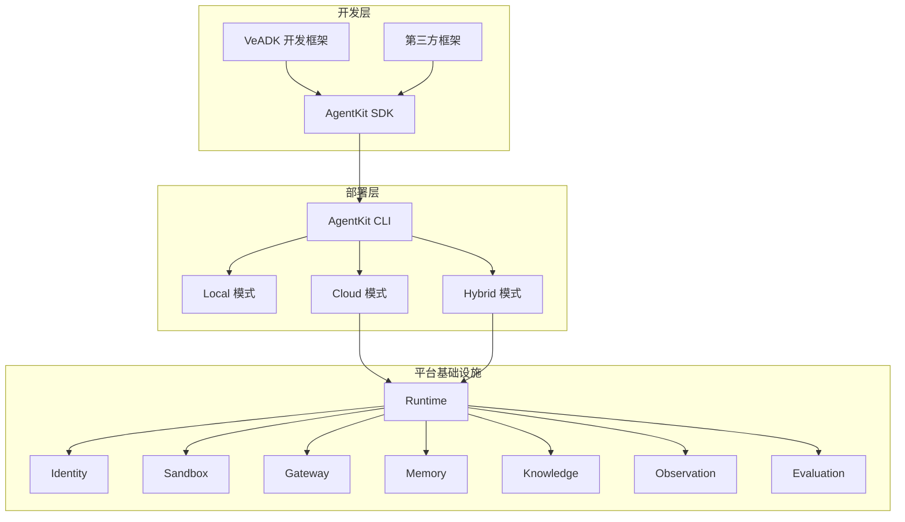

# 火山引擎 AgentKit 深度解析：企业级 Agent 从原型到生产的最后一公里

> 2025 年被视为 Agent 智能体元年。模型能力飙升之后，真正的瓶颈已经从"模型够不够聪明"转向"Agent 怎么安全、可控、低成本地跑在生产环境里"。火山引擎在 2025 年底全面升级的 AgentKit，正是针对这一痛点给出的全栈答案。本文将从平台架构、八大核心模块、开发部署流程、实战案例四个层面，拆解 AgentKit 的设计思路与工程落地要点。

## 一、背景：企业 Agent 落地的四道坎

在大模型能力已经"够用"的前提下，企业真正把 Agent 推上生产线时，普遍卡在四个地方：

1. **身份与权限**：Agent 会调用内部 API、操作数据库、访问第三方服务。谁授权、怎么审计、如何做到最小权限？传统 RBAC 体系很难直接迁移到 Agent 场景。
2. **黑盒困境**：Agent 的推理链路不透明，出了问题难以定位是模型幻觉、工具调用失败还是上下文丢失。没有可观测性，就不可能做持续优化。
3. **存量系统改造**：企业已有几十上百个 HTTP API，不可能全部重写。如何让 Agent 以最低成本接入这些存量接口，是落地的核心阻力。
4. **原型到生产的鸿沟**：Demo 跑在 Jupyter Notebook 里一切正常，但要做到弹性扩缩容、故障恢复、版本管理、灰度发布，工程量陡增。

AgentKit 的设计目标，就是用一个平台把这四道坎全部抹平。

## 二、架构总览

AgentKit 定位为**企业级 AI Agent 开发、部署、运维一站式平台**，采用 Serverless 托管模式。其核心架构可以概括为"一个 SDK + 一套 CLI + 八大基础设施模块"：



**关键设计决策**：

- **VeADK 与 AgentKit 的关系**：VeADK 是 Agent 开发框架（类比 LangChain），负责模型调用、工具编排、记忆管理等能力抽象；AgentKit 是部署运维平台（类比 AWS Lambda + 周边基础设施），两者协同覆盖从开发到生产的全生命周期。
- **不锁定框架**：虽然 VeADK 是原生支持的，但任何主流 Python 框架构建的 Agent，只需通过 AgentKit SDK 的装饰器做简单改造，即可接入平台。这是一个务实的选择，降低迁移成本。
- **Serverless 模式**：用户不需要管理计算、网络、存储等基础设施，按量计费，自动扩缩容。对中小团队而言，这意味着零运维成本。

### 澄清：第三方框架接入 AgentKit 的适配边界

一个常见的疑问是：**我已经用 LangGraph / LangChain / 自研框架开发了 Agent，上 AgentKit 要改多少代码？** 这个问题的答案取决于你想用平台的哪些能力，存在两个层次：

**层次一：纯容器托管（零适配）**。AgentKit Runtime 支持直接部署容器镜像。只要你的 Agent 能打成 Docker 镜像、对外暴露 HTTP 接口，就可以直接跑在 AgentKit 上。这一层不需要任何 SDK 改造，你只是把它当一个 Serverless 容器托管平台用——获得自动扩缩容、版本管理、基础监控等能力。

**层次二：接入平台能力（装饰器适配）**。如果你想用 AgentKit 的核心差异化能力——Memory（记忆库）、Gateway（MCP 网关）、Identity（身份权限）、Observation（全链路追踪）、Evaluation（评测）等——那就需要通过 AgentKit SDK 的装饰器做适配。改动模式大致如下：

```python
# 原来你的 LangGraph / 自研框架代码
def my_agent(query):
    # 业务逻辑
    return response

# 适配 AgentKit 后，加几个装饰器
from agentkit_sdk import agent_entry, with_memory, with_tool

@agent_entry
@with_memory(collection="my_memory")
@with_tool(tool_id="my_sandbox")
def my_agent(query):
    # 业务逻辑不变
    return response
```

用一张表总结适配决策：

| 你的诉求 | 是否需要适配 SDK |
|---------|----------------|
| 只想要 Serverless 托管环境跑 Agent | 不需要，直接容器镜像部署 |
| 想用记忆库、MCP 网关、身份权限等能力 | 需要，通过装饰器接入 |
| 想用评测、全链路观测 | 需要，接入 CozeLoop / APMPlus |
| 用 VeADK 开发 | 天然无缝，零适配 |

本质上，**框架和平台的边界就在这里：框架管开发，平台管生产化。要用平台的基础设施能力，就要按平台的接口规范来——这是必然的耦合代价，但 AgentKit 通过装饰器模式把这个代价压到了最低**。对于已有自研 Agent 框架的团队，建议的策略是：封装一层薄适配层（adapter），将 AgentKit SDK 的接口映射为自研框架的原生接口，让业务开发者无感迁移。

## 三、八大核心模块拆解

### 3.1 Identity：统一身份与权限

为每个 Agent 建立清晰的身份标识，核心机制包括：

- **最小权限 + 细粒度授权**：只分配执行任务必需的权限，支持到工具/API 级别的粒度控制。
- **OAuth 2.0 双模式**：支持 2-legged（应用间授权）和 3-legged（需要用户参与的授权）。
- **链式权限追溯**：Agent A 调用工具 B，工具 B 再调用服务 C，整条链路的授权关系可审计、可回溯。

这一层解决的核心问题是：**Agent 不再是匿名黑户，每一次操作都有据可查**。

### 3.2 Runtime：零信任全托管运行环境

Agent 部署的载体。核心特性：

- **全托管**：无需配置计算、网络、存储、安全策略，一个容器镜像搞定。
- **自动扩缩容**：根据请求并发和计算负载动态调整实例数。实例启动时间 < 150ms。
- **多协议支持**：HTTP Server、A2A（Agent-to-Agent）、MCP 协议均已支持。
- **版本管理**：支持多版本共存、灰度发布、一键回滚。

### 3.3 Sandbox：安全沙箱工具

所有可能修改系统环境、访问敏感数据、执行不可信代码的调用，统一在沙箱中运行。亮点：

- **All-In-One 多端支持**：代码执行（Code Sandbox）、浏览器操作（Browser Sandbox）、CUA（Computer-Use-Agent）、MUA（Mobile-Use-Agent）。
- **会话级实例隔离**：每个用户会话独立实例，分钟级调度万级沙箱。
- **Skills 机制**：Skill 是模块化能力单元，将任务所需的知识、执行流程、代码脚本打包，Agent 可以像调用函数库一样按需加载。

### 3.4 Gateway：智能体网关

这是 AgentKit 解决"存量系统改造"问题的关键组件：

- **HTTP-to-MCP 零代码转换**：上传 Swagger 格式的 API 定义，自动将存量 HTTP 服务转化为 MCP（Model Context Protocol）服务。不需要改一行代码。
- **语义匹配**：对 Agent 的工具调用意图与 MCP Tool 描述做语义匹配，提高 Tool 选择准确度，同时降低 Token 消耗（不用把所有工具描述都塞进 prompt）。
- **统一认证鉴权**：对访问 MCP Server 的请求做认证、限流、审计。

### 3.5 Memory：长期记忆管理

- **双引擎架构**：火山自研 Viking 记忆库 + mem0 开源记忆库。
- **性能指标**：毫秒级召回十亿级记忆条目，秒级索引更新，单库支持超 4 亿条记忆条目。
- **豆包大模型加持**：在 LOCOMO 基准测试中，豆包模型以 90.12% 准确率排名第一，直接决定了记忆提取的质量。
- **多模态记忆**：不仅支持文本，还支持图片等多模态信息的记忆存储与检索。

### 3.6 Knowledge：知识库管理

提供主流知识库的一键导入：

- 支持文档切片、知识检索、知识问答等全流程。
- 统一接口对接，降低切换知识库的成本。

### 3.7 Observation：全链路可观测

- **一条 Trace + 一个看板**：端到端全景全栈分析，从用户请求到模型推理到工具调用，全链路可追溯。
- **Token 消耗追踪**：精准追踪每次交互的 Token 消耗，实时异常消耗预警。
- **与 APMPlus 无缝集成**：开启观测服务即可自动收集 Trace、生成 Metric、支持日志检索。

### 3.8 Evaluation：Agent 评测体系

这是来自字节内部实战的评测平台（源自豆包、Seed 等 2000+ 内部团队的同款系统）：

- **双轨模式**：离线评测（上线前严格把关）+ 在线实时监控（上线后持续追踪）。
- **双维度**：结果评测 + 过程评测（不仅看最终答案对不对，还看决策链路合不合理）。
- **50+ 官方评估器**：覆盖内容质量、工具调用效果、轨迹质量等核心维度。
- **数据积累**：累计对 1 万+ Agent 完成 20 万+ 次评测，沉淀 3000 万+ 优质评测数据。

## 四、开发部署全流程

AgentKit 的工作流可以用一句话概括：**VeADK 写 Agent，CLI 打包部署，平台管理运维**。

### 4.1 开发

推荐使用 VeADK 框架，它提供了 Agent 开发的完整抽象：模型调用、工具编排、记忆管理、多 Agent 协作等。如果已经用了其他框架（如 LangChain），只需要通过 AgentKit SDK 的装饰器做简单适配即可。

### 4.2 部署三模式

| 模式 | 核心优势 | 适用场景 |
|------|----------|----------|
| **Local** | 迭代快，支持离线，便于 debug | 开发调试阶段 |
| **Cloud** | 全云端部署，内置可观测，环境一致 | 生产环境 |
| **Hybrid** | 本地构建 + 云端运行 | 开发调试到预发布过渡 |

### 4.3 CLI 命令速览

```bash
agentkit init      # 初始化项目
agentkit config    # 配置运行参数
agentkit build     # 构建镜像
agentkit deploy    # 部署到云端
agentkit launch    # 启动运行时
agentkit invoke    # 调用测试
agentkit status    # 查看状态
agentkit destroy   # 销毁运行时
```

从 `init` 到 `launch`，一个 Agent 的上线流程可以在分钟级完成。

## 五、实战案例

AgentKit 官方提供了多个典型场景的 [示例工程](https://github.com/bytedance/agentkit-samples)，覆盖从简单到复杂的不同 Agent 架构。下面通过三个官方案例 + 一个知乎披露的案例，展示不同场景下 AgentKit 各模块的组合方式。

### 5.1 客服智能体：多子 Agent 协作 + 全模块接入


> 图：客服智能体架构（[源码](https://github.com/bytedance/agentkit-samples/tree/main/02-use-cases/customer_support)）。这是 AgentKit 模块使用最全面的案例，几乎覆盖了平台的所有核心能力。

客服智能体采用**主路由器 + 多子 Agent** 架构：

- **导购咨询子智能体**：挂载产品知识库（Knowledge，底层 opensearch/vikingDB）和客户信息工具
- **售后支持子智能体**：挂载保修政策知识、故障排查指南、服务工单管理（CRUD）

平台侧接入了 Identity（inbound 鉴权 + outbound 权限托管）、Memory（Mem0/vikingDB 双引擎，存储客户交互历史）、Observability（TLS 日志 + APMPlus 链路追踪）。外部通过 MCP Protocol 接入第三方服务，通过 A2A 协议接入 http 服务。

**这个案例的价值在于**：展示了一个"重型"企业 Agent 如何将身份鉴权、知识检索、长期记忆、工具调用、全链路观测等横切关注点全部交给平台，开发者只需聚焦业务路由逻辑和子 Agent 编排。

### 5.2 AI 编程助手：Sandbox 沙箱驱动的轻量 Agent


> 图：AI 编程助手架构（[源码](https://github.com/bytedance/agentkit-samples/tree/main/02-use-cases/ai_coding)）。相比客服场景，这是一个极简链路，核心依赖 Sandbox。

AI 编程助手的架构非常精简：`Identity → Runtime → Sandbox Tool (all-in-one) → Observability`。Agent 只挂载了三个工具：

- `run_code`：代码执行工具，在沙箱中安全运行用户代码
- `upload_frontend_code_to_tos`：将生成的前端代码上传到 TOS 对象存储
- `get_url_of_frontend_code_in_tos`：生成代码预览 URL

**这个案例的价值在于**：并非所有 Agent 都需要全模块接入。AI Coding 场景的核心诉求是**安全执行不可信代码**，Sandbox 是唯一关键模块，不需要 Knowledge、Memory、Gateway。AgentKit 的模块化设计允许按需组合，避免过度工程化。

### 5.3 旅行助手：Knowledge + Memory + MCP 的典型组合


> 图：旅行助手智能体架构（[源码](https://github.com/bytedance/agentkit-samples/tree/main/02-use-cases/travel_planner)）。使用 deepseek-v3 模型，集成知识库、记忆库、MCP 工具（高德地图）和 Web Search。

旅行助手是一个"中等复杂度"的典型 Agent，使用的平台模块包括：

- **Knowledge**（vikingDB）：存储旅行攻略等结构化知识
- **Memory**（vikingDB）：长期记忆用户的旅行偏好，实现个性化推荐
- **函数工具 Function**：集成 Agent 所需工具
- **MCP Tool**：通过高德 MCP 接入 LBS 位置服务
- **Web Search**：联网搜索实时信息（如天气、航班）

底层大模型使用 deepseek-v3-2-251201，通过方舟大模型服务调用。

**这个案例的价值在于**：它是一个"中间态"——比 AI Coding 复杂（需要知识库和记忆），比客服系统简单（单 Agent，不需要子 Agent 路由）。对于大多数企业的第一个 Agent 项目，这个复杂度级别最具参考价值。

### 5.4 智能会议助手：代码量减少 96% 的效果验证

知乎专栏还披露了一个智能会议助手案例（包含推荐、签到、总结三个子 Agent），给出了与传统开发方式的直接对比数据：

| 指标 | 传统开发 | AgentKit 开发 | 变化 |
|------|----------|---------------|------|
| 核心代码量 | ~2000 行 | ~70 行 | **减少 96%** |
| 权限集成 | 自建 OAuth 流程 | 一行代码 | 原生融入火山 IAM |
| 记忆集成 | 手动管理上下文 | 两行代码 | 自动跨会话记忆 |
| 存量接口对接 | 逐个适配 | HTTP-to-MCP 自动转换 | 零代码改造 |
| 部署 | 配置服务器/容器 | agentkit deploy | 实例启动 < 150ms |

**96% 的代码量缩减**不是因为功能变少了，而是因为身份认证、记忆管理、工具调用、部署运维等横切关注点全部下沉到了平台层。开发者只需要写**业务逻辑**。

### 小结：不同场景的模块组合策略

从以上四个案例可以提炼出一个模块选择矩阵：

| 场景类型 | Identity | Runtime | Sandbox | Gateway/MCP | Memory | Knowledge | Observation |
|---------|----------|---------|---------|-------------|--------|-----------|-------------|
| 客服（多子Agent） | 必选 | 必选 | - | 必选 | 必选 | 必选 | 必选 |
| AI Coding | 必选 | 必选 | **核心** | - | - | - | 必选 |
| 旅行助手 | 必选 | 必选 | - | 必选 | 必选 | 必选 | 必选 |
| 会议助手 | 必选 | 必选 | - | 必选 | 必选 | - | 必选 |

**核心结论**：Identity、Runtime、Observation 是所有场景的标配；其余模块按需组合。这正是 AgentKit 模块化架构的设计优势——不强制全家桶，按场景灵活拼装。

## 六、竞品对比与定位分析

当前 Agent 平台赛道主要有以下几类玩家：

| 类型 | 代表 | 特点 | 与 AgentKit 差异 |
|------|------|------|-----------------|
| 低代码编排平台 | Coze、Dify | 拖拽式搭建，上手快 | 灵活性有限，难以承载复杂企业级场景 |
| Agent 框架 | LangChain、AutoGen | 开发灵活，社区活跃 | 只管开发不管部署运维，生产化需自建基础设施 |
| 云厂商 Agent 平台 | AWS Bedrock Agents | 与云生态深度集成 | AgentKit 更聚焦于企业存量改造和安全合规 |

AgentKit 的差异化定位在于：**它不是一个框架，也不是一个低代码工具，而是一个面向生产环境的全栈基础设施平台**。它把 Agent 开发者从运维、安全、可观测性等工程负担中解放出来。

## 七、工程实践要点与注意事项

基于已有材料，以下是接入 AgentKit 时值得关注的实践要点：

1. **框架选择**：如果从零开始，建议直接用 VeADK，与 AgentKit 无缝集成；如果已有 LangChain 等框架的存量代码，用 SDK 装饰器改造即可，迁移成本很低。
2. **存量 API 对接优先用 Gateway**：不要急着重写旧系统。先把 Swagger 定义导入 Gateway，自动生成 MCP 服务，再逐步优化。
3. **记忆库选型**：Viking 记忆库适合大规模、高性能场景；mem0 适合需要开源可控的场景。根据数据量级和合规要求选择。
4. **评测前置**：不要等上线后才做评测。AgentKit 的离线评测能力应该在开发阶段就用起来，建立 baseline，持续迭代。
5. **成本控制**：Serverless 按量计费意味着要关注 Token 消耗。利用 Observation 的 Token 追踪功能，及时发现异常消耗。Gateway 的语义匹配也能通过减少工具描述的 Token 占用来降成本。

## 八、局限性与未来展望

1. **框架生态**：目前仅支持 Python 框架的 Agent 部署，Java/Go/TypeScript 等语言暂不支持。多语言 SDK 支持是必然方向。
2. **开服地域**：目前开服地域有限，对跨国企业或有数据合规要求的场景可能不够。
3. **MCP 协议成熟度**：MCP 作为相对较新的协议，生态还在建设中。HTTP-to-MCP 的自动转换虽然降低了接入门槛，但语义匹配的准确率在复杂 API 场景下仍需持续优化。
4. **多模态 Agent 支持**：随着 OS Agent（操作浏览器、桌面、手机）场景的兴起，Sandbox 的 CUA/MUA 能力将是未来重点发力方向。
5. **多 Agent 协作**：A2A 协议已支持，但多 Agent 协作的编排、调度、冲突解决等高阶能力仍有进化空间。

## 总结

AgentKit 的核心价值可以概括为一句话：**让开发者只写业务逻辑，把 Agent 投产所需的一切基础设施交给平台**。

八大模块（Identity、Runtime、Sandbox、Gateway、Memory、Knowledge、Observation、Evaluation）构成了一个完整的生产级 Agent 基础设施栈。特别是 Gateway 的存量 API 零代码转换、Memory 的十亿级毫秒召回、以及来自字节内部 2000+ 团队实战验证的评测体系，是 AgentKit 区别于其他 Agent 平台的核心竞争力。

对于正在评估 Agent 平台的技术团队，AgentKit 值得作为首选方案认真考量，尤其是当你面对"存量系统改造"和"安全合规"这两个企业级硬约束时。

*参考资料：*
- *[火山引擎 AgentKit 官方文档](https://www.volcengine.com/docs/86681/1844823)*
- *[知乎：火山引擎 AgentKit 升级，8 大模块让企业 Agent 快速投产](https://zhuanlan.zhihu.com/p/1986764984575886310)*
- *[CSDN：火山引擎发布豆包 1.5 深度思考模型、Agent 全栈解决方案](https://blog.csdn.net/csdnnews/article/details/147303876)*
- *[VeADK 开发框架文档](https://volcengine.github.io/veadk-python/)*
