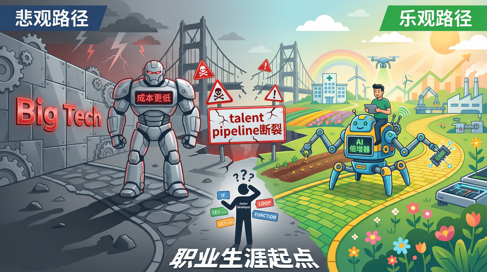
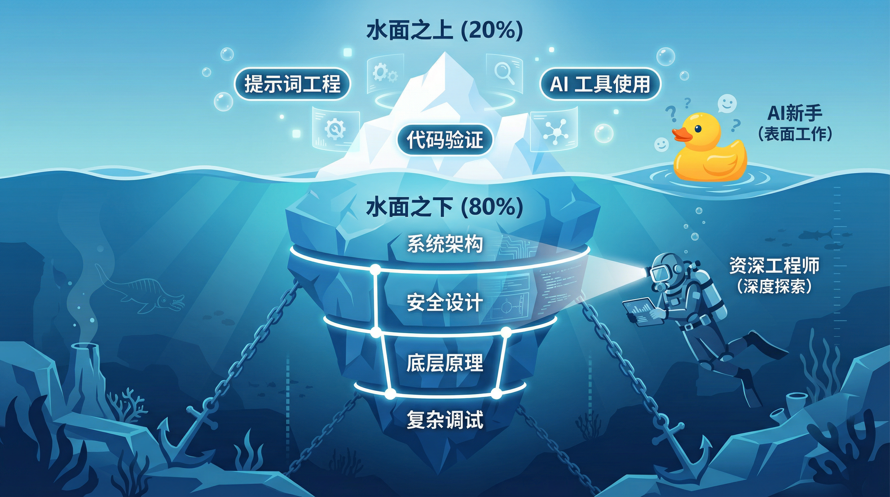
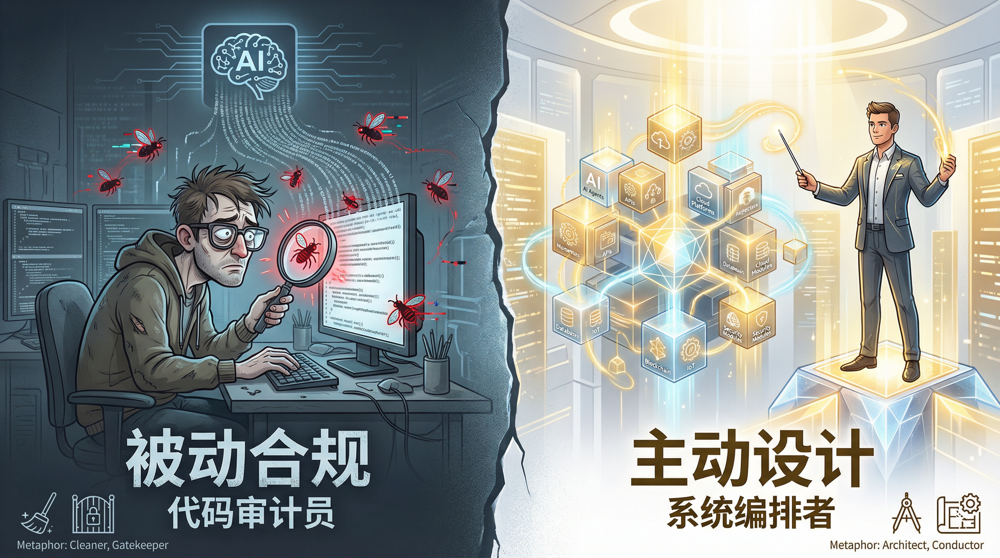
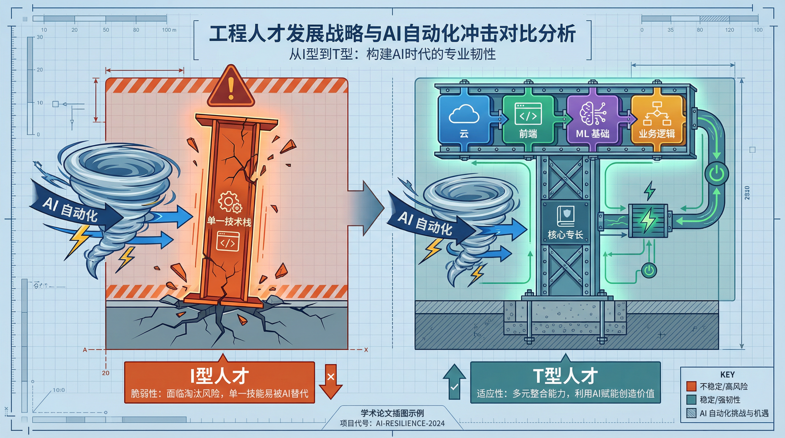
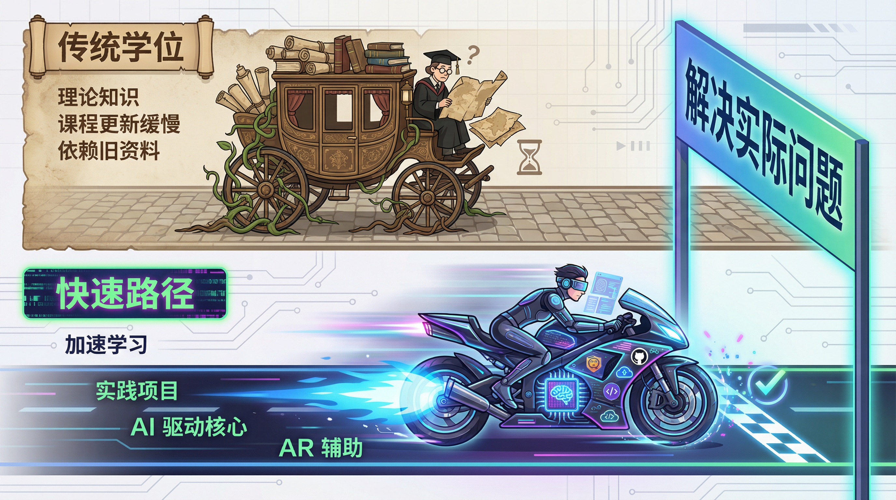

# 软件工程的下一个两年：AI 时代的生存指南

原文链接：[The Next Two Years of Software Engineering](https://addyosmani.com/blog/next-two-years/)

## 前言：拐点已至

软件行业正处在一个残酷而真实的拐点。

别被 AI 编程的各种 Demo 迷惑了，我们面对的不再是“增强版自动补全”，而是能够自主执行任务的智能体（Agents）。曾经那个靠 PPT 和“增长黑客”就能疯狂扩招的时代结束了。现在的指令非常明确：**效率至上**。公司要的是利润，不是规模；要的是能打硬仗的老兵，不是需要手把手教的新兵；要的是武装到牙齿的小型特种部队。

与此同时，新一代开发者入场了。他们务实、反内卷，并且从写第一行代码开始就有 AI 陪伴。

未来两年（2024-2026）充满了不确定性。基于 Addy Osmani 的深度观察和行业数据，我整理了五个决定我们职业命运的关键问题。这不仅是预测，更是生存指南。

---

## 一、初级开发者：人才管道的断裂与重构

这是最令人揪心的问题：入门级的梯子是不是被撤掉了？

### 核心矛盾
初级开发者的招聘需求正在两极分化：一方面因 AI 自动化而崩塌，另一方面可能因软件泛化而爆发。

> 

### 数据不说谎
*   **哈佛研究**：当公司引入生成式 AI，初级开发者就业率在六个季度内下降 **9-10%**，而高级开发者几乎无损。
*   **Big Tech**：过去三年，大厂应届生招聘量腰斩，减少了 **50%**。
*   **现实**：一位工程师的反问振聋发聩：“如果 AI Agent 成本更低且不睡觉，我为什么要花 9 万美元雇一个需要培训半年的新人？”

这不全是 AI 的锅，宏观经济也在挤泡沫。但 AI 加速了这一过程。现在，一个带 AI 的高级工程师能顶过去一个小团队。公司现在的策略是：**悄悄冻结初级HC**。

### 资深视角：要么进化，要么淘汰
悲观地看，如果切断了初级人才输送，5-10 年后行业将面临严重的领导力断层（“缓慢衰退”）。
乐观地看，AI 可能会把软件开发带入医疗、农业、制造等传统行业，创造出全新的“AI 原生”岗位。

**给新人的建议：**
别再把自己定位为“需要学习的人”。要做一个 **“带枪投靠的即战力”**。
*   **AI 是你的外骨骼**：证明“你 + AI > 小团队”。
*   **解释权在你**：用 AI 写代码，但你必须能解释每一行。
*   **去非科技行业**：那里是蓝海。

**给老兵的建议：**
如果不想被越来越多的“苦力活”淹没，就得学会把 AI 当作你的实习生，建立自动化的 CI/CD 和测试网。同时，如果不培养新人，未来就没有人接你的班。

---

## 二、技能重构：从“手写算法”到“驾驭模型”

我们正在经历一场技能的暴跌与暴涨。

### 核心矛盾
核心编程能力（手写快排、默写 API）正在贬值，而对代码的**判断力**和**系统理解力**正在成为稀缺资产。

> 

### 现状
*   **84%** 的开发者定期使用 AI。
*   新人可能永远不会经历“手写二叉树”的痛苦，也可能因此失去了对底层复杂度的敬畏。
*   现在的入门门槛变成了：**Prompting（提问）** 和 **Validating（验证）**。

### 资深视角：高杠杆工程师的诞生
如果人人都有 AI，你的护城河是什么？是**“知道 AI 什么时候在胡说八道”**。
未来的顶级工程师，不是打字最快的，而是最不信任 AI 的。
*   **浅层技能（贬值）**：样板代码、语法记忆、API 调用。
*   **深层技能（升值）**：架构设计、安全审计、性能调优、边缘情况处理。

**生存法则：**
*   **新人**：把 AI 当导师，而不是拐杖。偶尔关掉 Copilot，手写核心逻辑。
*   **老人**：去做 AI 做不了的事——定义复杂系统的边界，处理模糊的业务需求，为代码质量兜底。

---

## 三、角色演变：审计员还是指挥家？

你的工作性质正在发生根本性改变。

### 核心矛盾
开发者会沦为 AI 代码的**保洁阿姨（审计员）**，还是晋升为 AI 军团的**总指挥（编排者）**？

>  

### 两种未来
1.  **悲观（代码保洁）**：你不再创造，只是在检查 AI 生成的代码，寻找 Bug，修补漏洞。编程失去了创造的乐趣，只剩下合规的焦虑。
2.  **乐观（系统编排）**：你成为了架构师。你不再砌砖，而是设计蓝图，指挥 AI Agent 施工。你关心的是数据流、接口定义和系统鲁棒性。

### 资深视角
不要让自己陷入“审查员”的泥潭。要去争取**定义问题**的权利。
未来的工程师更像产品经理 + 架构师。你要决定**构建什么**，而不仅仅是**怎么构建**。

---

## 四、通才的胜利：T 型人才的复兴

“一招鲜，吃遍天”的时代结束了。

### 核心矛盾
死守单一技术栈（比如只懂 React 或只懂 MySQL）的**专才**极其危险，因为 AI 攻克垂直领域的速度太快了。AI 时代的赢家是 **T 型人才**。

> 

### 现实
*   **招聘风向**：几年前还要“云原生专家”，现在就要“AI 工程师”。追逐热点是死路一条。
*   **45%** 的职位现在要求跨领域技能（如 前端 + ML，或 开发 + 运维）。

### 资深视角
AI 是通才的放大器。
以前后端写前端很痛苦，现在有了 AI，后端也能搞定像样的 UI。
*   **I 型人才（危险）**：只懂一个狭窄领域，一旦该领域被自动化，直接失业。
*   **T 型人才（安全）**：有一项深耕的核心能力（垂直），同时利用 AI 快速补齐其他领域的短板（水平）。

**行动指南：**
利用 AI 快速拓展你的边界。如果你是后端，用 AI 写个前端项目；如果你是前端，用 AI 部署一个微服务。**适应性**是你唯一的护身符。

---

## 五、教育崩塌：学位证书还值钱吗？

### 核心矛盾
四年制的计算机学位跟不上行业每三个月一变的节奏。

> 

### 现状
大学还在教过时的 Java 版本，而企业需要你会用 LangChain 和 Docker。
**自学者的红利期**：一个有动力的自学者，利用 AI 可以在几周内掌握过去需要几年积累的工程能力。

### 资深视角
学位可能变成仅仅是“入场券”，而非“能力证明”。
未来的雇主会更看重你的 **GitHub**、你的 **Demo**、你解决实际问题的能力，而不是那张纸。

---

## 结语：拥抱不确定性

未来两年，不管你怎么选，有一点是确定的：
**AI 不会取代开发者，但“会用 AI 的开发者”将取代“不会用 AI 的开发者”。**

别做那个对着旧地图抱怨路变了的人。调整你的罗盘，新的大陆就在前方。